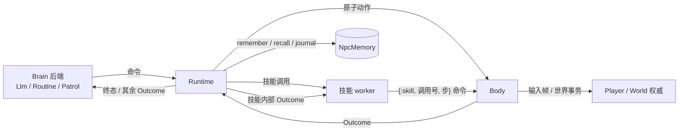

# NPC 运行时

分类：全局系统功能。统一输入与记忆规范见
[模型上下文契约](../../../../../docs/10-active/cross-cutting/2026-09-22-npc-context-memory-contract.md)。
本目录只写职责、契约与接入方式；各轮实现的验证记录在
[共用运行层与评审修复记录](../../../../../docs/10-active/cross-cutting/2026-10-06-npc-runtime-review-fixes.md)。

## 模块

- `Body` 接正式 Session/Player，产生观察并把动作交给 authority；自己维护会话（丢失后重新 claim）。
- `Runtime` 组合任意 Brain，统一命令路由、记忆调用、技能 worker、中断、取消结算与终态记录。
- `Actions` 原子动作目录：工具 schema 与“工具调用 → Body 命令”的译码只在这里定义。
  `Perception`（look / inspect）、`Memory`（记忆工具）、`Skills`（长技能）各自拥有自己的目录。
- `Responses` 是 Responses 应答里工具调用的唯一解析处；`Http` 是共享 JSON 出站。
- `Context` 从权威 profile 派生身体说明与坐标约定。
- `Brain.Llm` 组合观察、近期结果和逐轮检索记忆，只负责询问时机、模型请求与上下文。
  `Brain.Routine`（作者脚本）、`Brain.Patrol`（巡逻决策树）是非 LLM 后端。
- `Skill` 定义 `definition/1`、`run/3` 与可选 `observations?/0`；`Skills` 按 profile 注册。
  内置 `build`（放已发布定义）、`design_house`（住宅设计会话，`Skills.HouseDesign`）、
  `wilderness`（荒野逐格施工，驱动纯状态机 `Builder`）。
- `Scheduler` 定义中断策略 `decide/2`，`Jev` 是现有实现；分类器不能操作世界。
- `Memory` 提供模型记忆工具与上下文投影；`DataService.NpcMemory` 按永久 cid 持久化、检索，并拥有保留上限。



## 契约

- **会话**：Body 是无 socket 的会话 owner，会话是它自己维护的不变量。输入积压超过 120、Scene 结束会话、
  Player 结束、跨 Scene 移交失败、claim 失败时，Body 不退出，1 秒后重新 claim（与玩家断线重连同理），
  Brain / Runtime / 记忆与在途技能都保留；在途移动命令以 `session_lost` 拒绝，已投递的世界调用照常各回结果
  （Player 已结束则 `session_lost` 拒绝，此时请求尚未进 World）。没有会话时的身体与世界命令得到 `invalid_session`。
  同一 cid 被另一个 claim 顶替（关闭原因 2）时 Body 以 `{:shutdown, :replaced}` 正常结束；
  Body 的重启策略是 `transient`，只有崩溃才由监督者重启。
- **技能**：每个调用只有一个终态。取消命令有自己的 id：`%{id:, verb: :cancel_skill, call: 原技能调用号}`，
  受理回 `:done`（`data.call`），没有在途技能回 `no_active_skill`，已在取消中回 `already_cancelling`。
  被取消的技能仍以原调用号回终态：先等 worker 退出，再发带 `settle: 调用号` 的 `stop`，
  Body 在移动停稳且该调用已投递的世界调用全部有了结果后才确认。取消期间落定的内部结果放进终态 `data.settled`；
  已提交事务不撤销、不隐瞒，终态之后不再有这次调用引起的世界变化。停止失败明确回报 `stop_failed`。
- **中断策略**：只由 `interrupt_policy: {模块, 配置}` 开启，每 10 秒及听到说话时检查。
  context 含 `skill`、`observation`、`heard`（技能开始后听到的话，新在前，最多 5 句）。
  `{:error, _}` 或策略进程崩溃只记一笔（终态 `metrics.scheduler_error_count`）并继续技能。
  荒野施工内部分诊用的 `scheduler` endpoint 是另一项职责，配置它不会开启中断检查。
  Jev 实现只在有把握（置信度 ≥ 0.85）地选了非继续选项时中断，拿不准等同继续。
- **观察**：Runtime 只把 Observation 转给声明 `observations?/0` 为 true 的技能（目前是 wilderness），
  其余 worker 邮箱不堆积观察。
- **LLM 询问**：有新情况才问——新 Outcome、听到说话、`wait` 到期、或有实体走进 6 米（离开 8 米才算走远）。
  两次询问至少隔 1 秒；应答没有工具调用或请求失败按 1、2、4…60 秒退避；
  每 NPC 每小时最多 `max_requests_per_hour`（缺省 600）次，用完记 `npc_llm_budget_exhausted`。
  参数不是 JSON 对象或工具不存在时，在本地回报 `invalid_tool_arguments` / `unknown_tool` 给模型，不发给 Body。
- **记忆**：每个 cid 最多 200 条笔记（按最近写入保留）与 1000 条经历；超出的最旧行在写入时删除并记
  `npc_memory_trimmed`。上限只在 `DataService.NpcMemory.limits/0` 定义，`remember` 工具说明从它派生。

## 接入方式

`Body.start_link(..., brain: {模块, profile})`；Body 自动组合 Runtime。
同步后端实现 Brain 的两个回调；慢后端在 init 时保存 self()，异步命令投回这个 Runtime 接收端。
角色的世界操作仍经 Body / Player / World，不把技能内部命令、HTTP 或 worker 生命周期交给后端重写。

```elixir
# 全局系统功能配置示例；definition_hex / anchor_micro 由调用方从正式已发布定义和目标取得。
brain: {GateServer.Npc.Brain.Routine, %{
  skills: %{build: %{}},
  steps: [%{verb: :skill, skill: :build, args: %{
    "definition" => definition_hex, "anchor_micro" => anchor_micro, "orientation" => 0
  }}]
}}
```

- 添加技能：实现 `GateServer.Npc.Skill`，配置 `skills: %{名字: %{module: 实现模块, ...}}`。
  `definition/1` 拥有参数说明，`run/3` 在 worker 内接纳输入并返回一个终态；无需改 Llm / Runtime 分派。
  逐帧需要位置的技能实现 `observations?/0` 返回 true。字符串工具名只在已配置名字中匹配，不把模型输出转成新原子。
- 添加中断策略：实现 `GateServer.Npc.Scheduler.decide/2`，配置 `interrupt_policy: {实现模块, 配置}`。
  Jev 的配置为 `%{scheduler: endpoint, activities: 活动 profile, continue_activity: 选项, request: 可选}`。
- 查看：`Skills.tools(profile)` 与 `Actions.tools(profile)` 返回能力及参数；`Body.observe(body).outcomes`
  含最近 32 条结果。日志：`npc_session_lost`、`npc_claim_failed`、`npc_skill_outcome`、`npc_interrupt_check`、
  `npc_interrupt_check_failed`、`npc_llm_no_tool_call`、`npc_llm_request_failed`、`npc_llm_budget_exhausted`。

## 依据

- 会话自维护：仓库 AGENTS.md §2.1「自维护不变量」（活性/重连由 owner 自己维护）。OTP 监督者的重启强度
  （DynamicSupervisor 缺省 5 秒内 3 次）超出即连同全部子进程终止，见
  https://www.erlang.org/doc/system/sup_princ.html 与 https://hexdocs.pm/elixir/DynamicSupervisor.html ；
  动态添加的子进程不会随监督者重启恢复，所以批量会话丢失不能交给监督者处理。
- 生命周期与回调分离：Elixir behaviour（https://hexdocs.pm/elixir/typespecs.html ）；
  异步动作的运行中 / 终态 / halt 语义参考 BehaviorTree.CPP（https://www.behaviortree.dev/docs/guides/asynchronous_nodes/ ）。
- Responses 应答可以是 `incomplete` 且不含工具调用（https://platform.openai.com/docs/api-reference/responses/object ）；
  失败重试用指数退避与上限（https://cloud.google.com/storage/docs/retry-strategy ）。

## 范围与剩余工作

脚本是真实非 LLM 调用方，尚未有通用行为树引擎。玩家 ToolAction / 施法与 NPC 的入口对齐、正式聊天、
gather、住宅以外的设计技能、世界变化（如自己的建筑被拆）唤醒大脑，都是后续独立功能增量。
测试入口在 `apps/gate_server/test/gate_server/npc_*`；真实模型用例必须显式选择 `live_llm`。
