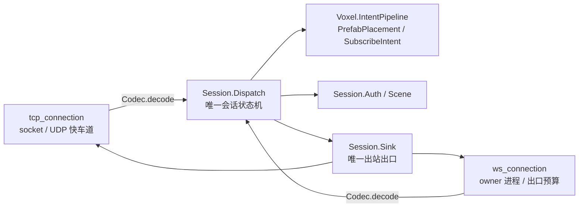

# Gate 工作进程运行时边界

本目录包含组成 Gate 传输层的运行时工作进程。

## 关键工作进程

- `interface.ex`
  - 服务发现，以及下游 `scene_server`、`world_server`、`auth_server` 节点查找
- `tcp_acceptor.ex`
  - 接收新的 TCP 套接字
- `tcp_connection.ex`
  - 每个 TCP 客户端的**传输**进程：socket 接管、`{:tcp, ...}` 语义、UDP 快车道、Scene 回推转发
- `ws_connection.ex`
  - 每个浏览器 WebSocket 客户端的**传输**进程：owner 进程收发、关闭语义归一、per-observer 出口预算
- `udp_acceptor.ex`
  - UDP 快速通道的共享收发进程
- `fast_lane_registry.ex`
  - UDP 绑定用的票据和会话注册表

## 传输进程与会话层的边界

`tcp_connection.ex` / `ws_connection.ex` **只拥有各自的传输差异**；会话状态机与业务语义
在 `../session/`（见该目录 README）与 `../voxel/` 的共享模块里，两条链路共用同一份实现。

新增上行消息处理一律加在 `Session.Dispatch`；只有当行为**真的**只属于某一条传输
（如 UDP 快车道票据、WebSocket 出口预算）时，才允许留在连接进程里，并在 state 里用显式
能力字段（如 `fast_lane: :enabled | :unsupported`）表达，而不是靠两份拷贝各自演化。

## 设计规则

这里的工作进程必须保持传输和会话职责。权威玩法状态属于 Gate 之外。

体素区块订阅要先向 `WorldServer.Voxel.MapLedger` 查询当前租约，再向 Scene 建立真实订阅；
后续区块变化由 Scene 推送到 Gate，Gate 只负责转发。体素退订必须同步清理 Gate 订阅表和
Scene 区块订阅者。
订阅表必须保存 World 路由返回的区域、租约、owner 纪元和 Scene 节点；迁移后重绑定时，
连接进程会重新查询 World，并在新路由不同的时候重新向 Scene 订阅。

体素冲击意图也要先校验连接角色和服务端技能表，再经过 World 路由，最后由 Scene 带租约
执行写入并通过 DataService 持久化。这样 Gate 可以被观察为路由器和协议适配器，而不会
变成体素权威。
