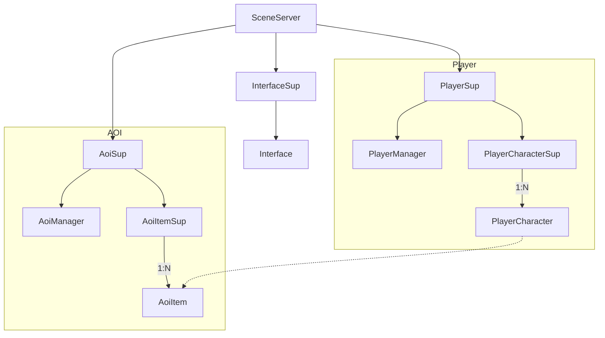

# SceneServer

Scene server for the game.

## Features

+ Player character management
+ Movement syncing
+ AOI management

## Run in Debug

```bash
iex --name <name> --cookie <cookie> -S mix
```

Documentation can be generated with [ExDoc](https://github.com/elixir-lang/ex_doc)
and published on [HexDocs](https://hexdocs.pm). Once published, the docs can
be found at <https://hexdocs.pm/scene_server>.

## The Supervision Tree

