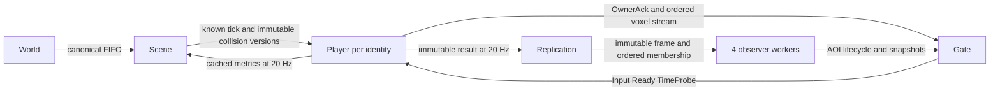

# Movement module map

M3 keeps the shared P1/Rapier kernel and the M1 wire contract. `Scene` owns
canonical collision publication and the public 60 Hz clock. Each `Player`
owns one authenticated identity's InputSlots, state, simulation tick and ACK.
`Replication` consumes immutable Player results and distributes frames to four
workers, each owning a disjoint set of observers' derived AOI relations.
Legacy actor/NPC callers below remain separate from this production path.

## Production composition and routes

`SceneServer.Application` starts the configured `Scene`. Scene starts its own
linked DynamicSupervisor for temporary Players and one linked Replication
dispatcher, which starts four linked ReplicationWorkers. Scene exit invalidates the Players; a Player failure closes its session
without restarting from a Gate or AOI snapshot. Configuration remains the
explicit D1 `voxim-m1-demo-v1` asset export; no profile or terrain defaults
were added. Each join reserves a spawn probe and consumes only the authorized
character ID, never a saved position.

`Scene.join(scene, identity, character, gate)` returns `{:ok, player_pid}` or
`{:error, :closed}` after queuing the existing close reason. Gate stores the
returned route and calls `Player.input/3`, `ready/4`, `time_probe/3` directly.
`Scene.leave/3` removes membership; old identities cannot remove a rejoin.
The listener orders old leave before new join and allocates a new identity.

## Timeline and fixed steps

CollisionUpdates consumes the existing ordered transaction/marker FIFO,
installs at most one occupancy transaction per public tick, and publishes
`{tick, revision, readonly_world}`. The NIF setter returns a new immutable
world. Scene sends each completed prefix asynchronously, never waits for a
Player step, and can then retire its old resource references. Each Player
retains and retires its own exact historical versions. A stalled player can
therefore replay R while another player queries R+1. Versions in a delayed
mailbox also retain their references until that prefix is consumed.

A Player consumes only contiguous real InputSlots whose assigned ticks are
no later than its known public prefix. Input arrival may wake consumption of
already published time; message count cannot create time or physics steps.
Missing input waits without substitution. Joining zero-input physics remains
the existing explicit pre-InputStart behavior. Ready confirms the exact
bootstrap N/R; after TimeProbe and joining physics catch up, InputStart
freezes origin=anchor+30. No state or ACK is emitted for a future unknown
collision prefix.

`Clock` owns integer microsecond-to-60Hz conversion and deadlines. TimeReply
pairs server time and clock tick from the same monotonic sample, including
when an old queued probe resumes after a Player pause. This clock estimate is
separate from the published collision watermark used to authorize physics.
ACK continues every third known public tick, with distinct world and actual
simulation ticks. A completed input arriving between those opportunities is
acknowledged at the next one. Bootstrap, transactions, CollisionApplied and
TimelineFence for one identity all originate from its Player in order.

The runtime follows OTP's independent process ownership and same-sender
signal ordering described in [OTP processes](https://www.erlang.org/doc/system/ref_man_processes.html)
and [DynamicSupervisor](https://hexdocs.pm/elixir/DynamicSupervisor.html).
There is no cross-player barrier or physics RPC through Scene. Cross-sender
arrival at Replication is allowed: a publication can use the latest already
received result without pretending a slow Player reached the new public tick.

## AOI and observation

AOI remains a pure 32m-grid, 30/34m-hysteresis algorithm. Input entities carry
actual `simulation_tick` and `collision_revision`. EntityEnter anchors its
state at that actual tick. Snapshots group records by their actual tick and
preserve each record's revision. Replication validates results against the
current member route and ignores older simulation results; removed identities
cannot be revived by delayed results. Gate batches compatible records using
the existing codec and the negotiated complete-datagram byte limit.

The 200-player ramp exposed repeated per-observer sorting and rebuilding in
this derived path. AOI now reuses sorted candidates per occupied grid cell,
retains each observer's sorted relation keys until membership changes, and
builds actual-tick groups directly. Lifecycle and packet order remain equal
to the prior algorithm. Lists accumulate by prepending and reversing once,
following the [Erlang list handling guidance](https://www.erlang.org/doc/system/listhandling.html).
The isolated `Docs/M3/tools/aoi-run.py --out <directory>` benchmark in Voxim
compares the saved prior algorithm and checks mixed ticks, leave and reconnect
equivalence. It also drives the real Replication owner and Gate sink into
200 receiving processes at 20 Hz; codec, QUIC and shared live physics load
remain the responsibility of the real load run.

The live 200-player rerun still overloaded a single relation owner. Per M3's
observer partition, Replication now builds the shared immutable spatial frame
once and sends it to four workers at each existing 20 Hz opportunity. The
Scene's consecutive entity epoch modulo four assigns each observer to exactly
one worker; database entity IDs in the real 200-player sample occupied only
two modulo-four buckets. Each worker owns
its relations, generation counters and Gate routes; all targets remain visible
to each partition. Join, frame and leave originate from the dispatcher in
order. Leave reaches every partition and deletes both target relations and
the departing observer. No worker waits for another worker or Player. The
dispatcher rejects removed routes' stale results before building any frame.
Normal Scene termination stops its Player supervisor and replication root;
normal dispatcher termination stops its workers; linked failures propagate.

The 32-scheduler isolated sink benchmark measured 200 mixed-tick p95 of
18.14/10.31/6.84/5.43 ms for 1/2/4/8 workers. Four is the fixed production
choice; eight saved only another 1.4 ms while doubling frame copies. This
measurement does not establish live capacity. `Replication.metrics/1` returns
dispatcher and worker `pid`, `message_queue_len`, `memory`, and `reductions`
through `Process.info`, without worker calls or relation enumeration.

`Scene.observe/1` and `metrics/1` return the public tick, collision FIFO/build
metrics and cached 20Hz character facts. Character fields include identity,
entity ID/epoch, `player_pid`, `gate_pid`, state, origin/simulation ticks,
processed sequence, pending count, collision revision, cumulative physics
steps and step microseconds, and `published_tick`. These are cached facts,
not a guarantee every Player finished Scene.tick. Scene aggregation does not
synchronously call Players or enumerate all AOI relations. `Player.observe/1`
provides one owner's instantaneous values; `Replication.observe/1` explicitly
returns the complete diagnostic relation view when required by a test.

Scene `region_tick` timing now measures public collision publication rather
than whole-scene physics. Player cumulative `step_us` brackets its synchronous
NIF calls, including dirty-scheduler wait and return; it is not kernel CPU time.
Input rows remain DEBUG; lifecycle and one Scene summary per second remain
INFO. Default observation never serializes occupancy or collision resources.

## Targeted verification

The sibling Voxim `Docs/M3/tools/test-player.exs` runner compiles current
modules into an isolated VM and loads the existing production P1 NIF, without
booting the umbrella or touching the live Demo. Tests use public routes and
explicit diagnostic waits instead of adding a production synchronization
barrier. `runtime_observation.exs` centralizes those test-only waits.

`voxim_player_test.exs` pauses P for approximately 400ms while Q consumes 24
real commands across R to R+1, then compares P's recovery exactly against a
per-tick serial native baseline. It also covers duplicate jump suppression,
unknown future prefixes, reconnect/crash isolation and queued TimeProbe clock
pairing. Scene, collision timeline, AOI and Gate tests cover their changed
seams. Real two-UE and load acceptance are recorded in sibling Docs/M3; test
success alone does not establish 200-player capacity.

## Legacy and NPC responsibilities

- `Profile` - shared movement tuning parameters
- `InputFrame` - one sanitized fixed-step input sample
- `State` - authoritative movement state at a tick
- `Ack` - controlling-client reconciliation payload
- `RemoteSnapshot` - AOI broadcast payload for remote observers
- `Engine` - stable Elixir API over the Rustler movement math
- `VoxelCollision` - stateless read-only adapter from movement AABBs to
  authoritative voxel occupancy queries
- `Integrator` - readable Elixir reference implementation for tests/docs

## Authority / reconciliation contract

- `PlayerCharacter` owns the authoritative player movement state. Gate
  connections only forward sanitized input frames and encoded acks.
- `VoxelCollision` does not own actor or voxel state. It converts the
  `PlayerCharacter` center-anchor movement state into voxel samples and asks
  `ChunkDirectory` / `ChunkProcess` for read-only occupancy truth. Ground
  contact is half-open: a center at `terrain_top + avatar_half_height` is clear,
  while descending into the terrain resolves back to that center height.
- `ChunkProcess` remains the only owner of hot voxel storage. Movement receives
  occupied samples and returns corrected movement state plus
  `CorrectionFlags.collision_push/0` when terrain blocks replay.
- `Engine.build_ack_with_intent/5` is the preferred player hot-path ack builder
  when the input frame that produced the state is available. It preserves
  server correction intent such as collision push; `build_ack/4` remains the
  legacy snapshot-only path and intentionally emits zero correction flags.
- `Ack.auth_tick` is the client reconciliation timeline. `ack_seq` identifies
  the last accepted input command, but clients should anchor replay to
  `auth_tick` first and use `ack_seq` only as a fallback lookup.
- `RemoteSnapshot` is created from authoritative actor state. AOI workers may
  add observer-specific priority metadata before fan-out; movement actors do
  not own observer priority.

## Jump / airborne contract

- `InputFrame.movement_flags` uses `0x0004` as a one-shot jump request.
- Only `:grounded` actors can consume that request and enter `:airborne`.
- `State.ground_z` is owned by the movement state so an airborne arc can land
  back on the ground height it launched from, independent of current Z.
- `Profile` owns airborne tuning: `jump_impulse`, `gravity`, `air_control`,
  `air_accel`, and `max_fall_speed`. The default `jump_impulse=900` gives an
  apex of roughly 4.1m under `gravity=980`, so players can escape multi-block
  voxel traps while collision testing.

## Relationship to actors

- `SceneServer.PlayerCharacter` consumes network input and steps movement here
- `SceneServer.Npc.Actor` builds its own input via `Npc.Navigation` and steps
  movement here

This shared layer is what keeps player and NPC motion on the same authority
rules.
