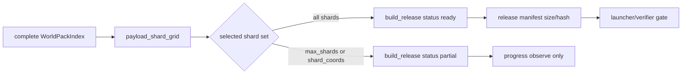

# WorldServer 体素边界

## 2026-06-28 stale scene owner repair

`MapLedger.route_chunk_with_lease/3` and the ensuring route path now verify that
an existing `assigned_scene_node` is still present in
`SceneNodeRegistry.snapshot/1` before returning the route to Gate. If a persisted
region assignment points at a stale node from an older dev cluster name, the
ledger asks `SceneNodeRegistry.reassign_region/2` for the next live scene node,
persists the updated region owner, issues a fresh lease, and emits
`voxel_region_scene_owner_reassigned`.

This keeps World as the routing truth source while preventing Gate subscription
fan-out from repeatedly targeting an unavailable Scene node after a local server
restart or node-name change. If no live scene node is registered, routing remains
explicitly failed with `:scene_node_unassigned` instead of silently inventing an
owner.

## 2026-06-28 world-pack materialization

`WorldServer.Voxel.WorldPackMaterializer` is the production-named
deployment-time entry point for a newly deployed voxel world. It does not
define a dev footprint and it is not called by Gate subscription, Scene
runtime, or client repair paths. Deployment tooling passes the planned chunk
range in bounded batches; the materializer routes those chunks through
`MapLedger`, obtains normal World lease fences, and calls
`SceneServer.Voxel.WorldGenMaterializer.put_snapshot/4` to write canonical
chunk snapshots. Derived LOD projection rows are still written inline by
default, but full-pack import tooling can pass
`materializer_opts: [lod_projection?: false]` and rebuild the derived
heightmap projection explicitly after the authoritative snapshot range is
complete.

`WorldServer.Voxel.WorldPackBootstrapper` is the supervised server-side
orchestrator for that path. It is disabled by default and enabled explicitly by
`VOXEL_WORLD_PACK_GENERATE=1`. On startup it reads
`VOXEL_WORLD_PACK_CHUNK_MIN` / `VOXEL_WORLD_PACK_CHUNK_MAX`, enforces
`VOXEL_WORLD_PACK_MAX_CHUNKS`, materializes the range in
`VOXEL_WORLD_PACK_BATCH_SIZE` batches, and publishes
`:auth_server, :voxel_world_pack` as `:ready` only after the canonical store has
been written. While it runs, the manifest stays `materializing`; failures publish
`failed` and keep scene entry blocked.

`WorldServer.Voxel.WorldPackArtifactBuilder` owns the offline `.vxpack` artifact
write step after canonical snapshots exist. It verifies the complete
`MmoContracts.WorldPackIndex` first, then can build one full payload shard from
`payload_shard_grid/1` / `payload_shard_plan/2`, build a bounded release batch,
or build the complete release payload set with `build_release/2`. Bounded builds
return `status: :partial` and do not emit a ready manifest; only a complete shard
set returns `status: :ready`. This is still a deployment/launcher artifact step,
not a Gate subscription fallback.



`WorldServer.Voxel.WorldPackReleaseVerifier` owns the release-readiness check
for generated `.vxpack` payload sets. It verifies the complete expected shard
set and manifest hash/size first, using streaming file hash checks instead of
holding every shard in memory. Each shard must also expose a footer entry set
whose count and local coord bounds match that shard's complete expected chunk
coverage; a self-consistent manifest for a partial shard is not enough. A
provided manifest must also contain exactly the expected shard path set, with no
extra or duplicate shard entries. The verifier then samples normal
sliding-window payload reads through `.vxpack` footer-table random access. A
missing shard, hash mismatch, incomplete shard footer, invalid manifest shard
set, invalid payload frame, or out-of-bounds window returns an explicit
`:world_pack_release_invalid` error; the verifier never calls materialization or
runtime snapshot generation to repair the pack.

`WorldServer.Voxel.WorldPackAuthorityCoverage` owns the canonical-store
readiness probe before `.vxpack` artifact generation. It compares
`DataService.Voxel.ChunkSnapshotStore.coverage/4` with a complete
`MmoContracts.WorldPackIndex`, then samples payload shards and normal
sliding-window centers through canonical `get_snapshot/2` reads. The result is
`:ready` only when the full bounds count is present, no out-of-bounds chunks are
seen for that logical scene, and sampled shards/windows are complete. Missing
canonical snapshots remain an explicit `:incomplete` report.

CLI probes:

- `mix run --no-start scripts/world_pack_authority_coverage.exs`
  reports current canonical snapshot coverage for the default full32km index and
  samples normal radius=3 windows. Incomplete authority data returns a non-zero
  exit code and writes JSON under `.demo/observe/world-pack-authority-coverage/`.
- `mix run --no-start scripts/world_pack_release_build.exs --pack-root <pack_root>`
  writes `.vxpack` release payloads. Add `--max-shards N` or
  `--shard-coords "sx,sy,sz;..."` for bounded progress probes; partial status is
  not release readiness.
- `mix run --no-start scripts/world_pack_release_verify.exs --pack-root <pack_root>`
  validates the complete expected payload set and samples normal sliding-window
  loads. Missing full-pack payloads return a non-zero exit code.

The world-pack `content_version` must be published only after the entire planned
world range has been materialized and verified. Runtime missing-snapshot,
missing-pack, hash-mismatch, or broken-diff-chain cases remain explicit
pre-scene validation failures. They must not be hidden by ad-hoc WorldGen,
runtime snapshots, or client-side repair.

## 2026-06-28 dev baseline bootstrap

Update: `DevSeed.ensure_default_region/1` also accepts
`baseline_materializer: :worldgen` plus `baseline_footprint_chunks`. This path
routes the requested chunks through `MapLedger`, obtains the normal World lease
fence, and then asks `SceneServer.Voxel.WorldGenMaterializer` to write canonical
WorldGen snapshots into DataService. It is an explicit pre-scene
materialization/import helper, not a Scene runtime fallback. The default dev
bootstrap still uses empty baseline chunks unless the caller opts into
`:worldgen`.

`DevSeed` is intentionally limited to local demo/smoke bootstrapping. It is not
the production launcher/world-pack materialization route; production uses
`WorldPackMaterializer`.

`DefaultRegionBootstrapper` 现在把“可订阅近场基线”和“开发地形种子”分开：

- 默认 baseline footprint 是以 `{0,0,0}` 为中心、半径 3 chunk 的 `7x7x7 = 343`
  个 chunk。每个 chunk 必须有权威 snapshot；缺失时由 dev bootstrap 用租约围栏显式写入
  empty version-0 snapshot。
- 默认 terrain footprint 仍只写出生点附近 `5x5`、`y=0` 的开发地形。baseline 扩大不会把
  地形写成竖向 `7x7x7` 墙。
- 这条路径只属于本地开发/demo materialization。生产 launcher/world-pack 缺包、hash
  不匹配、diff chain 断裂时不能用 runtime snapshot 兜底，必须在入场前校验失败。
- bootstrap summary 暴露 `baseline.chunk_count`、`terrain.chunk_count` 和
  `lod_projection`，便于 stdio CLI/observe 直接判断是 baseline、terrain 还是 LOD
  projection 问题。

本目录拥有 World 侧体素控制面。控制面指决定“谁拥有区域、谁能写、请求要路由到哪里”的
低频权威逻辑，不保存完整区块内容，也不执行逐帧体素规则。

- `MapLedger` 拥有区域分配、租约签发、路由查询、Gate / Scene 当前租约查询，以及事务参与者规划。
  传 `persistence_path: <file>` 启动时，每次 state 突变都会原子写入该文件
  （`<path>.tmp` → `rename`），下次启动时自动 `binary_to_term/2` 还原 assignments、
  leases、chunk_summaries、migrations。文件路径未给则保持纯内存行为，外层 supervisor /
  application 可决定是否启用。这一版只支持单节点本地文件；多节点 / Postgres 持久化是
  后续切片（保留同一接口边界即可平滑替换）。
  另外可传 `scene_invalidator: fn attrs -> result end`（1-arity 函数），`attrs` 形如
  `%{logical_scene_id, chunk_coord, reason}`。在 `cutover_migration/2` 成功之后，ledger 会
  在 `affected_chunk_min .. affected_chunk_max`（半开）内的每一个 chunk_coord 上调用一次
  invalidator，`reason` 固定为 `0x01`（`:migration_cutover`）。默认 `nil` 表示不触发任何
  Scene 侧失效广播；invalidator 异常或返回 `{:error, _}` 不会回滚切换，只会在 observe
  日志里记录（事件 `voxel_migration_cutover_invalidate_emitted` /
  `voxel_migration_cutover_invalidate_failed`）。这样让 World 控制面保持不直接耦合
  `scene_server`，由 `AuthorityObserve` 等上层 runner 注入实际 `ChunkDirectory.invalidate_chunk/2`。
- `RegionAssignment` 是可持久化的区域拥有者记录。
- `SceneLease` 是发给某个 Scene 实例的热写入授权；租约过期或纪元不匹配时，Scene 不能写。
- `LeaseWriteToken` 是从租约派生出的 DataService 写入围栏；DataService 用它拒绝旧拥有者写入。
- `MigrationPlan` 是 World 拥有的分阶段区域迁移交接状态机。它记录源 / 目标 Scene 引用、
  新旧租约、受影响区块范围、预热切片和当前迁移阶段。目标 Scene 预热时读取交接载荷；
  World 只在切换阶段改变路由并发布新的写入令牌。
- `TransactionParticipant` 和 `BuildTransaction` 描述可恢复的跨区域工作。
  **Phase 3-bis：`BuildTransaction` 加 `intents_by_participant` 字段**
  （形态 `%{ participant_key => %{chunk_coord => [intent_attrs]} }`，对齐
  `TransactionExecutor.execute/4` 第三参数）。该字段随 transactions map 一并持久化进
  既有 `voxel_transaction_coordinator_snapshots` 单行 snapshot,coordinator 重启 reload
  后字段完整保留,使 `TransactionRecoveryWatcher` 能直接重发 commit dispatch。
  `begin_fingerprint` 不算 intents，同 transaction_id 的 replay 仍判定为同笔。
- `TransactionCoordinator` 拥有 World 侧 `BuildTransaction` 状态机。它记录参与者准备确认，
  并为每个 `transaction_id + decision_version` 记录唯一提交 / 放弃决策。调用方负责把
  prepare/commit/abort 真的送到 Scene；coordinator 本身不做 RPC，只承担状态机和幂等账本。
  **持久化（Phase 3-1 起）**：通过启动选项 `:persist_fn` / `:load_fn` 注入；生产路径在
  `WorldSup` 里注入 `DataService.Voxel.TransactionCoordinatorStore`，每次 state 变更后单行
  upsert 写 `voxel_transaction_coordinator_snapshots` 表，节点重启时 `init/1` 自动加载。
  无文件持久化路径（Phase 3-1 后已移除），测试场景下不传 `:persist_fn` / `:load_fn` 即可
  纯内存运行。
- `TransactionExecutor` 是驱动 `TransactionCoordinator` 的并行 dispatcher。它对 participants
  用 `Task.async_stream` 同时调 Scene 侧 `BuildTransactionApplier.prepare/4`、把每个返回的
  `:prepared` / `:failed` 转成 `prepare_ack`，然后按 coordinator 的最终状态再并行调
  `commit/3` 或 `abort/3`，最后回写 `commit_decision` 或 `abort_decision`。每个 participant
  有 `:per_participant_timeout_ms`（prepare 默认 5_000ms，commit / abort 可单独配
  `:commit_timeout_ms` / `:abort_timeout_ms`），整个 executor pass 还有
  `:transaction_timeout_ms`（默认 30_000ms）的整体期限。超时、`{:exit, _}` 或 `{:error, _}` 一律
  作为 `:failed` ack 上报，结构化失败原因（`:timeout` / `:transaction_timeout` /
  `{:participant_crashed, _}`）记入 `prepare_results`。executor 对 scene caller 的返回值用
  `try/rescue/catch` 包了一层，单个 participant 抛异常 / `exit` 不会拖垮 executor 进程。
  对已经决定的事务做 replay 时短路返回，不重复触发 Scene 侧动作。**Phase 3-bis：`:prepared`
  fast-path** —— 当 coordinator 状态已是 `:prepared`（典型场景：节点重启 reload）时
  executor 跳过 prepare phase 与 record_prepare_acks，直接进 `run_commit`,
  `prepare_results` 由 `derive_prepare_results_from_prepared_state/1` 从
  `transaction.participants.prepare_status` 推导(prepared → `{:ok, %{resumed?: true}}`,
  failed → `{:error, :prepare_failed_before_resume}`)。executor 在 Phase 3 由 Gate
  进程同步驱动（Gate 拿 `{TransactionCoordinator, world_node}` ref，跨节点 prepare/commit
  ack；scene call 通过 `chunk_directory: {ChunkDirectory, scene_node}` opt 跨节点路由），
  Gate 0x67 dispatch 等执行结果直接成包回客户端。
- `TransactionRecoveryWatcher` 是 Phase 3-2 加入的一次性恢复扫描器，与
  `TransactionCoordinator` 一起被 `WorldSup` 启动。它在 init 时读取 coordinator 当前
  snapshot，对 `:preparing` / `:aborting` 状态的 in-flight 事务自动调 `abort_decision/3`
  滚回；对 `:committed` / `:aborted` 状态跳过。**Phase 3-bis：对 `:prepared` 自动重发 commit
  dispatch** —— Watcher 通过 `:scene_opts_resolver`（0-arity fn,WorldSup 注入实现走
  `BeaconServer.Client.lookup(:scene_server)` 找到 scene_node 并构造
  `{:ok, [scene_opts: [chunk_directory: {ChunkDirectory, scene_node}]]}`）拿到 executor opts,
  调 `TransactionExecutor.execute/4` 走 fast-path,emit
  `voxel_transaction_recovery_resumed_commit`。BeaconServer 未就绪 / lookup `:error` 时
  resolver 返回 `{:error, :scene_unavailable}`,Watcher 退化为旧 :pending_commit 行为 + emit
  `voxel_transaction_recovery_scene_opts_unavailable`。commit dispatch 中部分 participant
  失败时 emit `voxel_transaction_recovery_resume_partial`(coordinator 已 prepared 不能反悔,
  partial 信号供运维诊断)。`intents_by_participant` 为空(老 transaction 没带字段)时同样
  退化为 :pending_commit。所有动作幂等,watcher 自身被 supervisor restart 时重放扫描也无副作用。
- `BoundaryVoxelEvent` 记录 Scene 到 Scene 规则传播必须携带的租约字段。
- `DefaultRegionBootstrapper` 是 World 监督树里的默认区域准备工人。开发 / demo 配置启用时，
  它在服务端启动后通过 `DevSeed` 路由出生点 footprint、续发租约、经 Scene 写 starter
  chunk snapshots，并默认触发 LOD projection rebuild；Scene 还没注册时会重试。这样浏览器打开页面后
  只负责登录、入场、订阅读取格子状态，不再负责创建或修复世界。
- `AuthorityObserve` 是 `mix world_server.voxel_observe` 使用的非 GUI 验收运行器。它启动或复用真实
  ledger / token-store 进程，发布租约、路由区块、开始分阶段迁移、规划预热切片、读取交接载荷、
  标记预热、切换、完成迁移，并把写入令牌校验结果写入结构化日志，供 CLI 和测试检查。
  额外可选项：`:scene_invalidator` 直接传 1-arity 函数；`:scene_chunk_directory` 传一个
  `SceneServer.Voxel.ChunkDirectory` 的 pid/name，runner 会用 `scene_directory_invalidator/1`
  构造一个调用 `ChunkDirectory.invalidate_chunk/2` 的 invalidator 注入到内部启动的
  ledger。两者只在 runner 自己创建 ledger 时生效；调用方自带 `:ledger` 时由调用方决定。
- `DevSeed` 是本地网页 / CLI 冒烟使用的幂等 materialization 函数。它通过
  `MapLedger.route_chunks_with_leases_ensuring/3` 物化 footprint 所在 region、续发开发租约和
  DataService 写入令牌，然后逐 chunk 走 Scene 的批量 intent 路径写 canonical snapshots。
  `ChunkSnapshotStore.put_snapshot` 会在同一事务维护 LOD projection；需要回填旧快照时可显式打开
  LOD projection rebuild。它不绕过 Scene，也不是生产 runtime 的缺块兜底。

`route_chunk_with_lease/3` 是 Gate 向 Scene 请求区块快照前使用的控制面交接函数。它让客户端路径
先对齐 World 权威，同时仍然把完整区块真相留在 Scene。

`begin_migration/4`, `plan_next_migration_slice/2`, `migration_handoff/2`,
`mark_slice_prewarmed/3`, `mark_prewarmed/2`, `mark_slice_final_caught_up/3`,
`cutover_migration/2` 和 `complete_migration/2` 是可观测迁移 API。
`migration_handoff/2` 返回给目标 Scene 的交接载荷，不改变 World 状态；载荷包含
`migration_id`、逻辑场景和区域 id、当前迁移阶段、源 / 目标 Scene 引用、旧租约、待切换的
新租约、写入令牌版本、受影响区块边界、已规划的预热切片、下一切片索引和总切片数。
`mark_prewarmed/2` 只在全部预热切片已经规划、并通过 `mark_slice_prewarmed/3` 收到目标 Scene
逐切片 ACK 后成功；目标 Scene 仍要通过自己的预热适配器读取 DataService 快照并准备热区块，
World 不直接搬运区块内容。
`cutover_migration/2` 还要求每个切片都通过 `mark_slice_final_caught_up/3` 提交最终追平 ACK；
最终追平指源 Scene 已把切换前最后一版热区块写入 DataService，目标 Scene 已重新加载这些
最新快照。这样预热完成到租约切换之间的写入不会只留在旧 owner 内存里。
`migrate_region/4` 保持旧调用方兼容，但内部走同一条“建计划、预热、切换、完成”路径，并保留
已完成的迁移快照用于观察。

**Phase 4：object_id 分配 + scene_objects 持久化** ——
`BuildTransaction.scene_objects` 字段携带本笔事务要创建的对象实例
（已分配 `object_id`、初始 `part_states`、`covered_chunks` 等）。

- `TransactionCoordinator.begin_transaction/2/3` attrs 接受 `:scene_objects`
  种子列表；默认由 coordinator 同步从
  `voxel_scene_object_id_seq`（Postgres SEQUENCE）取 `next_object_id`
  逐条分配，写入 `BuildTransaction.scene_objects`。Gate prefab hot path
  如果已经为了 layer provenance 预分配了 `object_id`，seed 可以携带该 id；
  coordinator 会保留它而不是二次分配，并统一补入 transaction 的
  `logical_scene_id`，避免 micro layer owner 与注册对象分叉。
- 同 `transaction_id` 的 begin_transaction 二次调用走 replay 路径，**不再
  分配 ID**（避免 sequence 浪费）；`begin_fingerprint` 也不含
  `scene_objects`（allocations 不是 transaction identity 的一部分）。
- 分配失败（DB 不可达 / sequence 异常）→ begin_transaction 立即拒绝
  `:object_id_unavailable`。
- 持久化沿用既有 `voxel_transaction_coordinator_snapshots` 单行 snapshot
  路径，`scene_objects` 字段随 transaction 一起 `term_to_binary` 落盘，
  coordinator 重启 reload 完整保留。
- `TransactionExecutor.run_commit/7` 在 `commit_decision` 之后调
  `scene_caller.register_scene_objects(transaction.scene_objects, scene_opts)`
  把对象实例 upsert 到 Scene 端 `ObjectRegistry`（`function_exported?` +
  `safely_invoke` 守门，旧 scene_caller 兼容、失败非阻塞）。

实例字段（`BuildTransaction.scene_objects` 内每条）：

```text
%{
  object_id, blueprint_id, blueprint_version, parcel_id,
  anchor_world_micro, rotation, owner_actor_id,
  covered_chunks, part_states,
  state_flags, object_attribute_ref, object_tag_set_ref, object_version
}
```

`part_states` 是 `[%{part_id, health, state_flags}, ...]`（plain map 形态，
Scene 侧 ObjectRegistry 会归一化为 `%PartState{}` struct）。

**Phase A4 跨 region prefab 多 participant 事务**(2026-05-10 落地，2026-05-11 收口):

- `BuildTransaction.participants` 现在是 N 个 `TransactionParticipant`(每个
  必须含 `participant_key` / `assigned_scene_node` / `affected_chunks` /
  完整 `chunk_owners`)。
  Gate `build_prefab_plan` 按具体 Scene owner `{ChunkDirectory, scene_node}`
  分组成 multi-participant；一个 participant 可以覆盖多个 lease，并用
  `chunk_owners` 保存每个 chunk 的真实 `{region_id, lease_id}`。
- `TransactionExecutor.execute/4` 接受 `:scene_opts_by_participant`
  `%{ participant_key => keyword_list }`。`run_prepare` / `run_commit` /
  `run_abort` 内只按 `participant_key` 取对应 scene_opts,自然支持跨 region
  不同 chunk_directory / scene_node 的 transaction 路径。
- `MapLedger.route_chunks_with_leases/3` 是 prefab placement 的批量路由入口:
  Gate 一次拿到所有 touched chunks 的 assignment + lease。若任何 assignment
  缺 `assigned_scene_node`,Gate 直接拒绝该 intent,不再通过
  `owner_scene_instance_ref` 推测 Scene server。`MapLedger.put_region/2` 本身也不再
  存储无 Scene owner 的 region:没有 registry assignment 且调用方未显式传
  `assigned_scene_node` 时返回 `{:error, :scene_node_unassigned}`。World 仍是路由事实来源;真正
  split-owner 的计划才进入 `TransactionCoordinator` / `TransactionExecutor`。
- `register_scene_objects_after_commit/3` 给每个 obj **inflate**
  `:covered_chunks_by_region`(从 `transaction.participants.affected_chunks`
  + `chunk_owners` 反向推算 `chunk → {region_id, lease_id}` map),同时按
  首个 covered chunk 的 `participant_key` 分发到正确 Scene-owner participant。
  这里不再用 participant 自身 `{region_id, lease_id}` 兜底;缺 chunk owner
  是调用方契约错误。
  Scene 侧 `BuildTransactionApplier.register_scene_objects` 把
  `covered_chunks_by_region` 写入 `ObjectOwnerLookup`,让 cross-region damage /
  0x6C 广播能 cache 命中而不必走 SELECT。
- `voxel_scene_objects` 加 `owner_region_id` / `owner_lease_id` 列(Phase A4-3,
  D6 字典序首 covered chunk 所在 region 是 owner);**不**持久化
  `covered_chunks_by_region`(动态信息,改运行时 cache,见 ObjectOwnerLookup)。
- `TransactionRecoveryWatcher.scene_opts_resolver` 改为 1-arity 接 participants
  list；resume 只有在所有 participant 都能解析 scene_node 时才继续，缺任一
  participant 会把事务留在 parked pending-commit 状态，避免半恢复。
文末 A4-bis-cluster 段。

WorldServer 不保存完整区块真相，也不运行高频体素规则。它只决定拥有者，并发布写入围栏，
防止迁移后的旧 Scene 进程继续写入。
