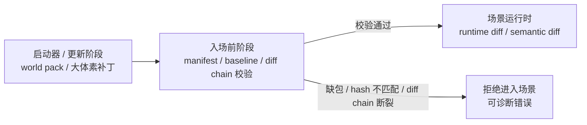

# 体素世界与远景渲染 · 当前真相（整合文档）

> **这是本主题的规范入口 / 唯一"当前状态"文档（living）。** 下列各原始文档是它的明细引用；当状态变化时**更新本文**，不要让读者去逐篇对比原始文档拼真相。
> 最近整合：2026-06-28。范围：体素世界真值源、近/远渲染分层、远景 LOD、近/远拼接、远程交互方向。

---

## 2026-06-28 update: client terrain baseline gate

The Voxia client now models scene entry as two explicit stages:

1. **Pre-scene terrain baseline**: request
   `GET /ingame/voxel/world_manifest`, verify that the server has a ready
   WorldGen-materialized world pack, compare the local persistent baseline
   `content_version`, and, when it differs, page
   `GET /ingame/voxel/world_diff` until the full voxel diff is persisted
   locally.
2. **Scene runtime streaming**: after the baseline is ready, consume
   authoritative runtime messages (`ChunkSnapshot`, `ChunkDelta`,
   `VoxelIntentResult`, object/field deltas) as diffs over the validated
   baseline.

`ChunkSnapshot` and runtime resync are not allowed to replace a missing or
untrusted baseline. Missing pack, hash mismatch, or broken diff chain is a
pre-scene validation failure and must reject scene entry. There is no accepted
client-side bypass for production scene entry: the local baseline must match the
manifest `content_version`, or the client must finish `/world_diff`
pagination and persist that version before opening the Gate connection.

Server-side support added in this slice:

- `AuthServerWeb.IngameController.voxel_world_manifest/2` reports the phase
  contract, configured world-pack status/content version, startup sync policy,
  and diagnostic development materialization coverage. It never generates
  terrain.
- `AuthServerWeb.IngameController.voxel_world_diff/2` pages canonical
  `voxel_chunks` snapshot payloads for startup baseline persistence. It refuses
  requests while the world pack is not ready and never runs WorldGen.
- `SceneServer.Voxel.WorldGenMaterializer` can explicitly materialize WorldGen
  chunks into canonical snapshots and LOD projection rows under a normal
  World-issued lease fence. It is an import/pre-scene helper, not a runtime
  fallback.
- `WorldServer.Voxel.WorldPackMaterializer` is the formal deployment-time
  entry point for a new server world pack. It routes the target chunk range
  through `MapLedger`, obtains World lease fences, and invokes Scene's
  WorldGen materializer to write canonical snapshots and LOD rows. Deployment
  tooling must publish the pack `content_version` only after this whole planned
  range is materialized and verified.
- `WorldServer.Voxel.DevSeed` remains a local smoke/demo helper only. It is not
  the production world-pack path.

## 2026-06-28 运行验收补充：Voxia 真实客户端

本轮针对“绿色可操作区域不随角色刷新、绿色区域内也无法破坏/放置、LOD/真实网格远离后丢失”的根因修复后，已用真实 Voxia 客户端 + stdio CLI 验证：

- World 路由修复：`MapLedger` 在返回已有 route 前检查 `assigned_scene_node` 是否仍是当前 live scene node；stale/nil owner 会重新分配，不能再把 Gate 订阅 fan-out 到旧节点或 nil。
- Dev bootstrap 分离：默认近场 baseline 为 `7x7x7 = 343` chunk；开发地形仍只种 `5x5, y=0`，baseline 不再形成体素墙。
- LOD projection 修复：343 个 baseline chunk 按 X/Z column coalesce 为 `7x7 = 49` projection cells；dev 验证用 `-VoxiaHeightmapLod=16x7` 匹配该显式覆盖范围。生产默认 `{2x256,4x256,8x256,16x1000}` 仍要求 launcher/world-pack 预先 materialize 对应 projection rows，缺失时必须显式失败，禁止 runtime 噪声或 snapshot 兜底。
- 真实客户端验收命令：

```powershell
node clients/Voxia/scripts/voxia_stdio_cli.js `
  --gate 127.0.0.1:21202 `
  --username voxia_player `
  --cid 245794565263369 `
  --token "<dev-session-token>" `
  --ue-arg "-VoxiaHeightmapLod=16x7" `
  --cmd "until_in_scene 120000; until_near_full 120000; until_hit 60000; until_editable 60000; snapshot; break; wait 3000; snapshot; place; wait 3000; snapshot; request_lod; until_lod 60000 1; lod; snapshot"
```

验收结果：近场 `confirmed=343 / missing=0 / center_confirmed=true`；命中框 `chunk_confirmed=true / in_current_window=true / editable=true`；破坏请求 `sent_block_break` 后 `occupied_macros 32258 -> 32257`；放置请求 `sent_material_place` 后 `32257 -> 32258`；LOD 返回 `tier_count=1`、`stride=16`、`count=7x7`、`cell_count=49`、`material_count=49`。

移动跟随验收：从出生点连续 `move 1700 0 0` 两次后，客户端到达
`current_stream_chunk=[2,0,0]`，`last_subscribed_chunk=[2,0,0]`，
`transport_active_window.center=[2,0,0]`，中心 chunk confirmed，命中仍
`editable=true`。此时 `missing=98` 是因为当前 dev baseline 只显式 materialize
`[-3..3]`，窗口右侧请求到 x=4/5 的权威数据时按设计显式缺失；这不是绿色区域不刷新。传回
`[0,0,0]` 后窗口恢复 `[0,0,0]` 且 `confirmed=343 / missing=0`。

视觉验收补充：同一真实客户端可加 `-VoxiaShot -VoxiaEditShot`，生成
`clients/Voxia/Saved/voxia_edit_before.png`、`clients/Voxia/Saved/voxia_edit_after.png`、
`clients/Voxia/Saved/voxia_edit_broken.png`。本轮日志记录了 5 次 `place` 和 5 次
`break`，均为 `bHasHit=1`；三张图经人工检查非空，HUD/选区/放置后石块/破坏后结果均可见。

## 0. 状态总览（一眼看清）

图例：🟢 已上线 · 🟡 机制在但未建全/有缺陷 · 🔴 已诊断未修 · 🔵 已决策未实现 · ⚪ 设计方向

| # | 子系统 / 能力 | 状态 | 一句话 | 明细文档 |
|---|---|---|---|---|
| 1 | 近场全细节 3D 体素流式 | 🟢 | 订阅半径 3 chunk（±48 m），greedy mesh + micro，带碰撞/可编辑 | §A、[远景LOD稿] |
| 2 | 流式窗口跟随 | 🟢 | 移动后置中心、center-first、缺块重试、skip 对齐订阅半径 | [streaming-follow] |
| 3 | 远景 LOD（heightmap） | 🟢 | `0x6A/0x6B`，服务端权威高度图，±8 km，离屏 greedy mesh | §B、[远景LOD稿] |
| 4 | 远景取数源 | 🟡 | `0x6A` 默认读 `LodHeightmapStore` 持久化 projection；chunk snapshot 写入同事务更新 projection；projection row 已派生 top material；`0x6B` 追加 material section，Voxia 已 decode/debug 并用于 LOD vertex color；开发/demo materialization 桥可 rebuild LOD；Voxia 权威编辑会标记 LOD dirty 并重拉 0x6A；chunk 缺快照会显式失败；仍缺正式 launcher/world-pack/完整 dirty 调度 | §C、[唯一事实源] |
| 5 | 多 tier LOD 级联 | 🟡 | 已配置 `{2,256},{4,256},{8,256},{16,1000}`；仍待实机性能和画面验证 | §D、[远景LOD稿] |
| 6 | 近/远拼接缝隙 | 🟡 | inner skirt 已实现并补 AutomationTest；仍待 UE Automation / 实机截图验证 | §E、[远景LOD稿§6-7] |
| 7 | 世界真值源原则 | 🟡 | 权威体素唯一真值已部分落地；噪声降一次性 migration；未来换真实地图 | §C、[唯一事实源] |
| 8 | 启动器 / 入场 / 运行时三阶段 | 🔵 | 大体素包和全量 tile 更新属于启动器或入场前；场景内只流已验证基线上的 diff | §1.1、[唯一事实源] |
| 9 | Tile 预算口径 | 🔵 | `1 tile = 7×7×7 chunks`；`27 tiles = 3×3×3 tiles`；数据量问题后期遇到瓶颈再按 observe 量化 | §1.2、[生产架构] |
| 10 | LOD = 体素派生 mip | 🔵 | LOD 应是 store 的持久化派生 mip + 编辑 dirty 维护（替代噪声重算） | §C/§D、[唯一事实源 D-2] |
| 11 | 远程交互 detail-on-demand | ⚪ | 望远镜看远处细节 / 远程导弹：焦点订阅 + 服务端权威 raycast/模拟 | §F |

---

## 1. 唯一事实源原则（地基，统领全篇）

**权威体素数据是服务器整个生命周期里唯一的事实源。** WorldGen 噪声只是一次性 world-seed migration（dev 占位，与"真实地图导入"互换），跑完即弃、不进运行时、不进发布。chunk 服务、远景 LOD、raycast 等一切**只读/派生自权威体素**，每个派生物**显式维护**它对体素的一致性（编辑→dirty→重建）。

为何（详见 [唯一事实源]）：现远景 LOD 在运行时重跑噪声=第二份没人维护的真值，编辑后与权威静默分叉；且"生成函数当真值"无法接纳未来的真实地图（真实地图没有生成函数）。把噪声降为 migration，世界来源即可插拔、runtime 无感。

> 这条原则**已部分在代码落地**（见 §C 状态）：严格 chunk materialization、LOD projection store 和开发/demo bootstrapper 桥已经有了；但正式 launcher/world-pack/materialization、真实地图导入和完整 dirty scheduler 仍未完成。它仍是后续所有体素相关设计的判据。

### 1.1 启动器 / 入场 / 场景运行时边界（已决策，未全实现）

大体素包、世界基线、大范围重写和资源补丁不进入 scene runtime 热路径。
运行时只负责已验证基线之上的 runtime diff、semantic diff、prefab/object/event diff。



硬约束：

- 客户端本地 `world pack / region manifest / chunk baseline / diff chain` 必须在进入场景前校验。
- 缺包、hash 不匹配、diff chain 断裂代表客户端数据不可被信任，必须拒绝进入场景。
- 禁止用运行时 `ChunkSnapshot`、resync、自愈逻辑或静默 fallback 绕过基线校验。
- `ChunkSnapshot` 在运行时只能作为已验证基线上的权威同步消息之一，不能当 baseline 兜底。

### 1.2 Tile 预算口径（2026-06-28 决策记录）

后续讨论 tile、窗口、diff 数据量时统一使用以下口径：

| 单位 | 定义 |
| --- | --- |
| chunk | `16×16×16` macro cell，边长 `16m`，共 `4096` cells |
| tile | `7×7×7` chunks，边长 `112m`，共 `343 chunks / 1,404,928 cells` |
| 近场生产预算窗口 | `27 tiles = 3×3×3 tiles = 9,261 chunks / 37,933,056 cells` |
| 跨 tile 边界新增 | 旧窗口保留时只新增一片 `3×3 = 9 tiles` |
| 穿过一个 tile 时间 | 按 `6m/s`，约 `18.67s` |

本轮拍板：先按这个口径继续设计和排查当前 streaming / editability 问题，不再把“同步数据量可能很大”作为当前缺陷的默认解释。
数据量大的问题后期实际碰到再说；当前只作为后续工程风险记录，不能提前当作当前“可操作区域不刷新 / 编辑无效”的主因或阻塞项。
一旦实际碰到吞吐瓶颈，必须先通过 observe / CLI 统计 `tiles_changed`、`chunks_changed`、`ops`、
`bytes`、`encode_ms`、`send_queue_bytes`，再设计压缩、分片、channel 或预算策略。
独立决策记录见 [`docs/30-reference/protocol/2026-06-28-voxel-tile-budget-runtime-diff-decision.md`](../30-reference/protocol/2026-06-28-voxel-tile-budget-runtime-diff-decision.md)。

---

## 2. 当前架构（A–F）

### A. 近场（中心高分辨率，🟢）

- 服务端权威 3D 体素 chunk；订阅半径 `SubscribeRadius=3`（7×7×7 chunk ≈ ±48 m），带碰撞、可编辑。
- 客户端 `FVoxiaGreedyMesher`：solid↔air 才出面、同外观共面合并、内部面剔除、跨 chunk 邻居遮挡避免双墙、未加载邻居当 air；refined macro 8³ micro 细节。
- 权威 chunk = 已材化 store 基线 ⊕ runtime diff；流式发的是含编辑的权威态。WorldGen 噪声只保留为显式 dev/migration 材化入口，不再是生产 runtime 的隐式基底。
- 关键常量：`SubscribeRadius=3`（`VoxiaPawn.h:184`）；1 macro=100cm、16 macro/chunk、8 micro/macro（`VoxiaCoords.h:9`/`types.ex:13`）。

### B. 远景（8 km 背景，🟢 形态 / 🟡 取数源工程化）

- 服务端权威 2.5D 高度图，仅视觉、无碰撞、不可编辑。
- 流：`Voxia 0x6A 请求 → gate 校验(stride≤4096,cells≤1,048,576) → SceneServer.Voxel.AuthoritativeHeightmap → ChunkSnapshotStore / Storage scan → 0x6B(big-endian u16,X 最快) → HeightmapTiers[stride], ++HeightmapRevision → AVoxiaWorldActor::RebuildLodTerrain(离屏 mesh→主线程上传)`。
- 客户端 `FVoxiaHeightmapMesher`：阶梯地表（同行等高 run 合并平顶 + 高差处竖墙 riser）。
- 取数源已从运行时噪声切到 `DataService.Voxel.LodHeightmapStore` 持久化 projection；projection rows 由 `SceneServer.Voxel.LodProjection` 从权威 chunk storage/snapshot 派生 height 与 top material，chunk snapshot 持久化时同事务 upsert；`0x6B` 在固定 `heights:u16[]` 后追加 typed material section，Voxia decoder/debug/heightmap mesher 已消费该 top material；`SceneServer.Voxel.LodProjection.Rebuilder` 可显式从 canonical snapshots backfill；开发/demo `DefaultRegionBootstrapper` 可触发 starter materialization 与 projection rebuild。仍缺正式 launcher/world-pack/materialization 流程与跨 chunk/大 stride dirty 调度完整工程。
- Voxia 客户端已补表现侧衔接：权威 `ChunkDelta` 应用成功或 `VoxelIntentResult` authoritative cell 修正 confirmed store 时，transport 标记 `lod_dirty_revision` 并写 `voxel_lod_dirty`；pawn 按 `VoxiaLodDirtyRefreshSeconds` 去抖后以当前 streaming 位置重拉所有 heightmap tier，写 `voxel_lod_refresh_requested`。订阅填充 snapshot 不触发该 dirty，避免初始 343 chunk 填充造成 0x6A 请求风暴。

### C. 世界真值源：现状 vs 决策（🔴→🔵）

- **当前已改**：`0x6A` heightmap 请求不再调用 `WorldGen.heightmap_region`，而是走 `SceneServer.Voxel.AuthoritativeHeightmap` 读取 `DataService.Voxel.LodHeightmapStore`。`LodProjection` 从权威 chunk storage/snapshot 派生 stride cells，projection row 已写入 height 与 top material；`ChunkSnapshotStore.put_snapshot` 可在同一 DB transaction 内写 chunk snapshot 与 projection rows，projection 失败会回滚 snapshot；`LodProjection.Rebuilder` 可从 canonical snapshots 显式重建 projection；`ChunkProcess` 生产默认只接受持久化 snapshot / provided storage，缺失、损坏或 store 不可用会启动失败并 emit `voxel_chunk_materialization_failed`；开发/demo `DefaultRegionBootstrapper` 默认通过 `DevSeed` 写 starter chunk snapshots 并 rebuild LOD projection；Voxia 在权威编辑改变 confirmed store 后标记 `lod_dirty_revision` 并自动重拉 0x6A tier。
- **仍未完成**：`generate_chunk_storage` 仍保留为显式 dev opt-in / migration helper；正式 launcher/world-pack/materialization 接线、真实地图导入、跨 chunk/大 stride dirty 调度还未落地。LOD material 的 projection→wire→Voxia decode/debug/vertex-color 消费已接通；当前 Voxia dirty refresh 是客户端表现侧及时重拉，不等同于完整服务端 dirty scheduler。
- **决策（[唯一事实源]）**：
  - D-1 `heightmap_region` 改为从权威体素派生（列顶 + 顶面材质），不碰噪声。
  - D-2 远景 LOD 改为**持久化派生 mip 金字塔** + 编辑 dirty 维护；mip 各层即多 tier 级联。
  - D-3 chunk 服务只读 store；缺块=错误，不静默现生成。
  - D-4 噪声搬入 dev world-seed migration；真实地图导入为生产兄弟 migration。
  - D-5 默认 eager 全量首次材化（lazy-but-permanent 仅 dev 优化）。
  - D-6 放弃"只发种子客户端自生成"，一律流权威数据。
- **收益**：near/far 自动一致、远景含编辑、LOD 天然多 tier、可换真实地图——全部归一到"从一个 store 派生"。

### D. 多 tier LOD 级联（🟡 代码已配，待验证）

- 多 tier 管线**已全实现**：请求按 `HeightmapLodTiers` 数组迭代 + 对齐最粗 stride 同一网格（`VoxiaPawn.cpp:748/755`）、`MaybeRefreshHeightmap` 按最细 tier、`RebuildLodTerrain` 逐 tier 嵌套挖洞(`InnerSkipCells`)/逐层下沉(`Sink`)/重叠(`Overlap`)、传输按 stride 分槽。
- **当前配置**：`HeightmapLodTiers = { {2,256},{4,256},{8,256},{16,1000} }`（±256m/±512m/±1km/±8km）。
- 该配置仍共享世界原点和 16-macro chunk 对齐网格；代码层已消除单层 stride16 的突变来源。
- **仍需验证**：UE Automation / 实机画面 / 性能；各 tier 现在走持久化 projection 读路径，但 backfill/materialization 不完整时缺行会显式失败。

### E. 近/远拼接缝隙破洞（🟡 代码已修，待验证）

- 现象：拼接处外围 LOD 方块"朝向中心那一面"没有面、看穿。
- 根因（四方交叉验证：人工+codex+3 路对抗）：**不是 greedy 合并问题**，是经典 LOD 接缝缺 skirt，三因素叠加——① `SinkCm`(≥100cm) 把 LOD 顶下沉，制造垂直空带（主控）；② `VoxiaHeightmapMesher.cpp:82/104` riser `if(IsSkip||IsSkip)continue` 抑制内边界竖墙，且 riser 只补相邻列高差不向下封；③ 近处边界墙法线朝外、单面背剔，从中心看不见。→ 空带两侧都无"朝中心正面"。
- 当前修复：已新增内边界 skirt（X/Y 双轴、法线朝中心、**顶部锚定未下沉真实高度**、向下封 `Sink+余量`、只用 mesher 自有数据）。仅删 `continue` 的旧方案未采用。
- 测试：AutomationTest 已补“洞边界有朝内竖直 quad / 顶部未下沉 / 底部低于 sunk plateau”断言；仍待 UE Automation 和实机截图。

### F. 远程交互 detail-on-demand（⚪ 设计方向）

场景：超远魔法/望远镜看远处细节 + 远程导弹攻击。本质：**细节需求与身体位置解耦**（跟焦点走，不跟身体走）。拆三件正交事：

- **看**：按需焦点订阅。轻档=把 `0x6A` 指向 look-at 取更细 heightmap patch（今天即可）；重档=按需流真 chunk（view-only/无碰撞，订阅中心=焦点）。⚠️ 看"别人建的/炸过的"远处必须流真 chunk（或 §C 落地后远景 mip 已含编辑→粗尺度免费）。
- **瞄**：服务端权威 raycast（客户端发射线，服务端对 store 求交回命中）；heightmap 无碰撞本就不能本地瞄。
- **打**：服务端模拟（导弹=服务端权威实体；客户端发 intent，服务端在全量世界模拟飞行/碰撞/伤害/破坏，回流 `ChunkDelta`/实体事件；客户端仅在有焦点订阅处渲染）。
- 重构：把"细节供给"从"绑定玩家位置"升级为"服务 N 个兴趣焦点"。身体是焦点之一；望远镜/小地图/观战各注册焦点。
- 已有可复用机制：任意 origin heightmap 请求、任意 center chunk 订阅（现总以玩家为中心）、服务端权威编辑通道。需新增：焦点驱动+生命周期、view-only 订阅档、服务端长程 raycast、远程实体 AOI。

---

## 3. 落地路线（建议顺序）

1. **§C 唯一事实源（地基先行）**：`heightmap_region` 改派生自体素（D-1），LOD 落为持久化派生 mip + dirty 维护（D-2）；噪声搬 migration（D-4）。这一步让远景含编辑、且为级联/缝隙打好正确底座。
2. **§E 缝隙 skirt**：修内边界 skirt + 补 AutomationTest。多 tier 的前置。
3. **§D 多 tier 级联**：在派生 mip 上挂多层（或配置 `HeightmapLodTiers` 级联），消除割裂感。
4. **§F 远程交互**：焦点订阅 + 服务端长程 raycast + 导弹 intent/delta（独立玩法线，可后置）。
5. chunk 服务生产默认已改为缺块即错误（D-3）；eager 材化/真实地图导入（D-5）继续按存储工程推进。

> 本仓纪律：每步先决策稿、逐 step commit、不 push、不留兼容层（见 repo 工作纪律）。

---

## 4. 原始文档索引

- [唯一事实源] [`docs/10-active/voxel-authority/2026-06-28-权威体素唯一事实源-噪声降为migration.md`](../10-active/voxel-authority/2026-06-28-权威体素唯一事实源-噪声降为migration.md) — 地基决策稿
- [远景LOD稿] [`clients/Voxia/docs/2026-06-28-远景LOD-heightmap-设计与拼接缝隙根因.md`](../../clients/Voxia/docs/2026-06-28-远景LOD-heightmap-设计与拼接缝隙根因.md) — 远景设计 + 缝隙根因/修复 + 视频对照 + codex 评估
- [streaming-follow] [`clients/Voxia/docs/2026-06-28-streaming-window-follow-fix.md`](../../clients/Voxia/docs/2026-06-28-streaming-window-follow-fix.md) — 流式窗口跟随修复
- [tile-diff-decision] [`docs/30-reference/protocol/2026-06-28-voxel-tile-budget-runtime-diff-decision.md`](../30-reference/protocol/2026-06-28-voxel-tile-budget-runtime-diff-decision.md) — tile 预算与运行期 diff 决策
- [`docs/30-reference/engineering/2026-06-25-voxel-world-production-architecture.md`](../30-reference/engineering/2026-06-25-voxel-world-production-architecture.md) — 体素生产级架构（8 阶段）
- [`docs/30-reference/overview/2026-06-27-架构设计指导思想-系统正交.md`](../30-reference/overview/2026-06-27-架构设计指导思想-系统正交.md) — 指导思想（判据）
- 参考视频字幕：`clients/Voxia/docs/reference/voxel-perf-video.{zh,en}.srt`

## 5. 关键文件 / 常量（速查）

**服务端**：`gate_server/codec.ex`(0x6A:94/0x6B:95)、`gate_server/worker/tcp_connection.ex`(dispatch:788, 上限:53-54)、`scene_server/voxel/world_gen.ex`(heightmap_region:95, column_height:68, generate_chunk_storage:121)、`scene_server/native/world_gen_noise/src/lib.rs`(heightmap_region:176, column_height_impl:142)、`scene_server/voxel/storage.ex`、`scene_server/voxel/types.ex`(16/8)。

**Voxia 客户端**：`Net/VoxiaProtocol.{h,cpp}`(FVoxiaHeightmapRegion .h:381-397)、`Net/VoxiaTransportSubsystem.{h,cpp}`(0x6B :757-778, RequestHeightmap :444)、`Gameplay/VoxiaPawn.{h,cpp}`(HeightmapLodTiers .h:207, SubscribeRadius .h:184, RequestHeightmapAround/对齐 .cpp:748/755)、`Gameplay/VoxiaWorldActor.{h,cpp}`(RebuildLodTerrain .cpp:141-211, StreamedSkipMacros .h:64, Sink .cpp:167-168)、`Voxel/VoxiaHeightmapMesher.cpp`(riser 抑制 :82/104, HCm :51)、`Voxel/VoxiaGreedyMesher.cpp`(EmitQuad 单面背剔 :114-131)。

**常量**：SubscribeRadius=3 · LOD tiers `{2,256},{4,256},{8,256},{16,1000}` · StreamedSkipMacros=48 · Sink 100+250/层 · Overlap=0 · 上限 stride≤4096/cells≤1,048,576 · seed 1337/sea_level 64/max_height 1600。

---

## 6. 维护说明

本文件是该主题的**当前真相**。任何相关改动落地后，请在此更新 §0 状态表与对应小节，并把新的设计/修复稿登记进 §4。原始文档保留为不可变的"当时记录"，本文反映"此刻为真"。
