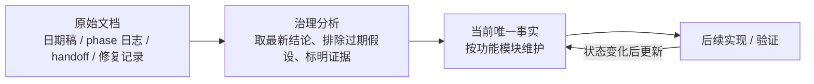

# 当前唯一事实入口

> **本目录 = 五层文档结构中的 `00-current-truth`（当前事实·唯一权威）。** 想知道"现在到底是什么样"只信这里；上层文档地图与其它四层见 [`../README.md`](../README.md)。
>
> 本目录记录“此刻为真”的项目状态。日期型设计稿、阶段日志、handoff 和问题复盘仍保留在原位置，作为原始操作日志和证据源；读者需要判断当前状态时，优先读本目录。
> **形态约定（用体素术语）**：本目录 = snapshot（合并态投影），原始日期文档 = delta 库（事件历史），[source_index.md](source_index.md) = delta 库的索引。合并发生在写入时——本目录任何文档只呈现合并后的当前状态，不含改动记录。

## 文档治理模型

- **原始文档**：记录当时的设计、实现、验证和误判；不要求彼此一致。
- **当前唯一事实**：从原始文档和当前工作树归纳出的稳定状态；同一主题只在这里给一个当前答案。
- **维护原则**：新事实落地后更新本目录，并把新原始文档登记到 [source_index.md](source_index.md)。
- **冲突处理**：若原始文档与本目录冲突，以本目录为读者入口；原始文档保留为证据和历史上下文。

## 功能模块入口

| 模块 | 当前事实文档 | 主要职责 |
| --- | --- | --- |
| 文档治理与证据索引 | [source_index.md](source_index.md) | 原始文档归类、被取代结论、当前事实入口关系 |
| 服务端控制面 | [design/server/world-region-routing.md](design/server/world-region-routing.md) | World / Region / Scene / Chunk 关系、路由、租约、迁移、stale owner repair |
| 体素真值与基线 | [design/voxel/README.md](design/voxel/README.md) | 权威体素唯一事实源、WorldGen migration、launcher/入场校验、runtime diff 边界 |
| 客户端可操作区域 | [design/voxel/client_active_region.md](design/voxel/client_active_region.md) | 近场可编辑窗口、订阅跟随、debug overlay、点击生效条件 |
| 客户端流式与远景 | [design/client/streaming-lod.md](design/client/streaming-lod.md) | Voxia 唯一 Mock 根、完整 XYZ near/Pure3D far、逐 Tile 交接、共享外观与阶段 2 宏格挖放；Online provider 后置 |
| 局部场与涌现 | [design/field/runtime.md](design/field/runtime.md) | FieldLayer / FieldRegion / FieldKernel / FieldRuntime / FieldSource / FieldEffect 状态 |
| 正交涌现系统 | [design/emergence/orthogonal-systems.md](design/emergence/orthogonal-systems.md) | 材料属性向量、光、化学、结构、客户端外观边界 |
| 建设 / Prefab / Surface | [design/voxel/building-prefab-surface.md](design/voxel/building-prefab-surface.md) | 建设原语、Prefab transaction、Object provenance、SurfaceElement |
| 实现状态速查 | [impl/README.md](impl/README.md) | 当前代码边界、主模块路径、默认验证入口 |
| 已知缺口 | [impl/known_gaps.md](impl/known_gaps.md) | 当前明确未完成、待设计或待验证项 |

## 当前最高层事实

1. **服务端权威优先仍是全局铁律**：移动、AOI、战斗、体素、object state、field truth 均以服务端 authority 为准；客户端只能预览、呈现或发 intent。
2. **体素确认态只来自服务端权威结果**：在线客户端确认态只能吃 `ChunkSnapshot` / `ChunkDelta` / `VoxelIntentResult` / `ObjectStateDelta` / `FieldRegionSnapshot`。
3. **体素基线校验必须硬失败**：进入场景前必须校验本地 world pack、region manifest、chunk baseline 和 diff chain；缺包或 hash 不匹配不能靠运行时 snapshot/resync 兜底进入场景。
4. **World/Scene/Gate 边界清晰**：Gate 负责协议 decode、鉴权、连接状态和转发；World 负责 region/scene 路由、租约、事务和迁移控制面；Scene / ChunkProcess 拥有 chunk hot truth 与 field runtime；DataService 保存 canonical persistence。
5. **完整 3D 是体素流式与 LOD 的唯一现行空间契约**：公共契约是 `chunk_xyz -> canonical 3D chunk/page`，near 为 XYZ cube，far 为稀疏 cube shell；不得向 streaming、LOD、cache 或 renderer 暴露 heightmap、column、terrain-only 或 `Y=0`。Voxia 的 near XYZ 与 Pure3D far 已在唯一开发根 live；Online authority production cutover 仍未开始，隔离 probe 不等于第二生产路径。
6. **Voxia 阶段 1 lifecycle/near-far ownership、阶段 2 宏格 authority/receipt、Far LOD 材质语义/最终绑定与流送精确身份均已收口**：`-VoxiaWorldGenPreview` 只启动 `AVoxiaUnifiedVoxelWorldActor` / `production_all_features` 根。完整 XYZ Tile、真实 fence、target latch、有界 near queue、shared `M_VoxelWorldAligned` 与 canonical AO/sky 的门禁继续有效。VXP5 surface-coverage v4 把粗 occupancy 与精确外露材质解耦，旧 page/schema/cache 显式拒绝；现场 near/far LOD0–4 actual material witness 全部 `exact=LOD=final=1`，三类 unresolved/mismatch 为 0。SceneHost 从合法 `Material/MIC` 父级创建 ownership MID，复制质量参数后再叠加 atlas 参数；三个共享实例父链必须 `3/3` 有效才能 installed，非法父级显式失败。handoff 按 generation 冻结真实 renderer near owner，为 live 与最终 target 的完整 XYZ 并集生成六面 far boundary；transition identity 贯穿异步 stale gate 与 hidden commit permit。near settled-source policy 继续拒绝仍在加载、空 revision 或尚未 settled 的流式批次，但完整且尚未激活的 speculative successor 不再反向阻塞当前 active coverage；同一逻辑窗口在 `Preparing` 中重建 candidate 时，latch 会刷新到最新非零 generation，旧 generation 不再永久钉住提交。far live 与 root/CLI readiness 必须精确匹配 desired `center + transition Tile count + fingerprint`，同 center 的 stale scene 不再冒充 settled。最新 Development build、完整 Voxia Automation `155/155`（153 Success + 2 项现有 expected warnings）、Node `84/84` 与 Phase 1/2 Null-RHI 均通过；Real-RHI 实际触发 near candidate `6→7`，最终 near/far generation=`7/6`、center=`[12,0,-51]`、Tile=`27/0/0/27`，desired/in-flight/live count/fingerprint 精确一致，gap/seam/orphan 与 30 个 surface witness mismatch 全为 0。阶段 3 prefab 的本组前置阻断已全部关闭但尚未启动，Online authority 与里程碑 B/C 仍未开始。
7. **Voxia 是唯一现役客户端，Web / Bevy 已逻辑归档**：默认客户端设计、实现、协议消费验证、联调、CI 与进度判断只看 Voxia；归档目录只保留历史证据，只有用户显式点名时才临时纳入。阶段 2 普通宏格交互与 Far LOD 外露材质归约/最终 ownership 绑定已经 closeout；下一客户端阶段可按已批准计划实施阶段 3 prefab runtime，但本轮没有开始。Online 生产化仍需独立服务端设计与实施。
8. **局部场 Phase 7 已进入运行时扩展阶段**：温度、电导、电热、热烟、闭合电路、电介质击穿等第一批能力已形成可操作入口；source owner 存活、预算消耗、batched effect、跨 chunk 大范围编排和 Phase 8 结算仍未完成。
9. **被取代的 XZ column 设计统一进入 `docs/20-archive/**`**：它们可以保留历史证据和 append-only decoder 测试，但不能继续留在 current/default/launcher/CLI acceptance 路由。
10. **Online 客户端仍是 snapshot/delta-only 消费者，离线 Mock 也保持 adapter 边界**：近窗消费 canonical chunks，远区消费 XYZ source pages/cube shell；Phase 2 点击只发 intent，Mock authority 私有裁决后以类型化事件驱动唯一 confirmed mirror，presentation 不能回写 truth。旧 0x6A/0x6B heightmap、VHI 与 v1 column source 只保留协议历史兼容，不是生产终态。
11. **运行时根事实与文档根事实同样唯一**：参数可单独验证子系统，但只有一个包含全部已批准成果的组合根可以承担联合调试和效果验收。任何新成果未接入该根、未通过根级 readiness/CLI 前，只能写成 probe/地基；开发根通过也不能冒充在线 authority cutover。

## 维护规则

- **snapshot 纪律（硬性）**：本目录只保存合并态。禁止按日期追加「YYYY-MM-DD 更新 / 补充 / 后续更正」式叙事条目；新事实直接**改写**正文对应段落，旧表述被覆盖而非并列。决策与事实允许携带日期属性（如「2026-07-06 拍板」），但日期不得作为条目的组织方式。演进过程、逐日证据、被覆盖的旧状态一律留在原始日期文档（delta 库），由 source_index.md 指路。
- 新增模块事实时，先加到本页模块表，再落对应子文档。
- 子文档必须写“当前事实 / 证据源 / 被取代结论 / 后续缺口”。
- 文档内涉及流程、所有权、阶段边界时使用 Mermaid 图解释。
- 不把截图或单次视觉观察当唯一证据；需要对应 CLI、日志、代码路径或阶段文档。
