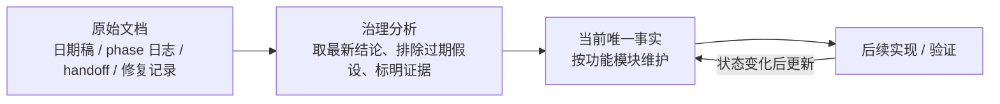

# 当前唯一事实入口

> **本目录 = 五层文档结构中的 `00-current-truth`（当前事实·唯一权威）。** 想知道"现在到底是什么样"只信这里；上层文档地图与其它四层见 [`../README.md`](../README.md)。
>
> 本目录记录“此刻为真”的项目状态。日期型设计稿、阶段日志、handoff 和问题复盘仍保留在原位置，作为原始操作日志和证据源；读者需要判断当前状态时，优先读本目录。
> **形态约定（用体素术语）**：本目录 = snapshot（合并态投影），原始日期文档 = delta 库（事件历史），[source_index.md](source_index.md) = delta 库的索引。合并发生在写入时——本目录任何文档只呈现合并后的当前状态，不含改动记录。

## 文档治理模型

- **原始文档**：记录当时的设计、实现、验证和误判；不要求彼此一致。
- **当前唯一事实**：从原始文档和当前工作树归纳出的稳定状态；同一主题只在这里给一个当前答案。
- **维护原则**：新事实落地后更新本目录，并把新原始文档登记到 [source_index.md](source_index.md)。
- **冲突处理**：若原始文档与本目录冲突，以本目录为读者入口；原始文档保留为证据和历史上下文。

## 功能模块入口

| 模块 | 当前事实文档 | 主要职责 |
| --- | --- | --- |
| 文档治理与证据索引 | [source_index.md](source_index.md) | 原始文档归类、被取代结论、当前事实入口关系 |
| 服务端控制面 | [design/server/world-region-routing.md](design/server/world-region-routing.md) | World / Region / Scene / Chunk 关系、路由、租约、迁移、stale owner repair |
| 体素真值与基线 | [design/voxel/README.md](design/voxel/README.md) | 权威体素唯一事实源、WorldGen migration、launcher/入场校验、runtime diff 边界 |
| 客户端可操作区域 | [design/voxel/client_active_region.md](design/voxel/client_active_region.md) | 近场可编辑窗口、订阅跟随、debug overlay、点击生效条件 |
| 客户端流式与远景 | [design/client/streaming-lod.md](design/client/streaming-lod.md) | Voxia 完整 XYZ near cube / Pure3D far cube shell、唯一联合根、增量流送、原子 presentation、历史归档与 A10 缺口 |
| 局部场与涌现 | [design/field/runtime.md](design/field/runtime.md) | FieldLayer / FieldRegion / FieldKernel / FieldRuntime / FieldSource / FieldEffect 状态 |
| 正交涌现系统 | [design/emergence/orthogonal-systems.md](design/emergence/orthogonal-systems.md) | 材料属性向量、光、化学、结构、客户端外观边界 |
| 建设 / Prefab / Surface | [design/voxel/building-prefab-surface.md](design/voxel/building-prefab-surface.md) | 建设原语、Prefab transaction、Object provenance、SurfaceElement |
| 实现状态速查 | [impl/README.md](impl/README.md) | 当前代码边界、主模块路径、默认验证入口 |
| 已知缺口 | [impl/known_gaps.md](impl/known_gaps.md) | 当前明确未完成、待设计或待验证项 |

## 当前最高层事实

1. **服务端权威优先仍是全局铁律**：移动、AOI、战斗、体素、object state、field truth 均以服务端 authority 为准；客户端只能预览、呈现或发 intent。
2. **体素确认态只来自服务端权威结果**：在线客户端确认态只能吃 `ChunkSnapshot` / `ChunkDelta` / `VoxelIntentResult` / `ObjectStateDelta` / `FieldRegionSnapshot`。
3. **体素基线校验必须硬失败**：进入场景前必须校验本地 world pack、region manifest、chunk baseline 和 diff chain；缺包或 hash 不匹配不能靠运行时 snapshot/resync 兜底进入场景。
4. **World/Scene/Gate 边界清晰**：Gate 负责协议 decode、鉴权、连接状态和转发；World 负责 region/scene 路由、租约、事务和迁移控制面；Scene / ChunkProcess 拥有 chunk hot truth 与 field runtime；DataService 保存 canonical persistence。
5. **完整 3D 是体素流式与 LOD 的唯一现行空间契约**：公共契约是 `chunk_xyz -> canonical 3D chunk/page`，near 为 XYZ cube，far 为稀疏 cube shell；不得向 streaming、LOD、cache 或 renderer 暴露 heightmap、column、terrain-only 或 `Y=0`。Voxia 的 P3a near XYZ transaction 正在切换，P3b shell generation、P4 materialization 与 P5 production cutover 未完成；hidden probe 不等于 live。
6. **Voxia 当前仍处于扩展后的里程碑 A，并已有唯一全要素联合根、S1b-1 根级唯一 source identity、Pure3D far 增量链和 H-gated 本地 request provider**：普通 `-VoxiaWorldGenPreview` 默认启动 `AVoxiaUnifiedVoxelWorldActor` / `production_all_features`，由一个顶层 root 同时持有成熟 near 滑窗/数据泵和 Pure3D far，根级 CLI 只有在 near window settled、far live、XYZ center 一致时才 ready；高空 near 全空气按 resolved zero geometry 处理，下方 Pure3D far 继续覆盖。S1b-1 已让 root 只解析一次 `FVoxiaVoxelWorldSourceIdentity` 并下发给 far，同时诚实报告 near 仍独立消费 WorldGen；其 automation 尚未补齐。Pure3D far 的 WorldGen 与 `local_disk` provider 共用 page diff/residency、cooperative cancellation、依赖感知 artifact cache 与绝对 XYZ stable-patch transaction；默认本地包冷启动读取 `33752` 页，随后相邻移动只读 `1517` 个 enter 页、复用 `32235` 个 resident 页并保留 `175/216` far patch。错误 manifest H 会使根级 `source_authorized=false`，不创建 generation 且不回退 WorldGen。S4 已把 resolved-surface 工作并行化，把制品缓存改成 source-bound immutable shared refs，以 `TFuture::Consume()` 移交结果，并把 coverage 规划与旧 lease 回收移出单帧重负载；相邻 Real-RHI worker 约 `0.91-0.95s`，far 的 GameThread prepare/finalize/publish 各约 `4.5-7.5ms`。near/far 共享 provider/residency/coverage transaction、完整三轴长巡航/HUD、增量/full oracle 和完整材质族仍未完成，完整移动仍观察到偶发 `16ms+` 离群帧，详见 [A10](../10-active/voxel-far-field/2026-07-12-a10-cancellable-incremental-voxel-shell-streaming.md)。服务器/HTTP/在线 authority provider 与 launcher 真包仍未实现；**里程碑 B/C 均未开始。**
7. **Voxia 是唯一现役客户端，Web / Bevy 已逻辑归档**：默认客户端设计、实现、协议消费验证、联调、CI 与进度判断只看 Voxia；归档目录只保留历史证据，只有用户显式点名时才临时纳入。当前仍在 Milestone A / A10 本地完善模块设计、统一 near/far 与渲染效果，B/C 均未开始。
8. **局部场 Phase 7 已进入运行时扩展阶段**：温度、电导、电热、热烟、闭合电路、电介质击穿等第一批能力已形成可操作入口；source owner 存活、预算消耗、batched effect、跨 chunk 大范围编排和 Phase 8 结算仍未完成。
9. **被取代的 XZ column 设计统一进入 `docs/20-archive/**`**：它们可以保留历史证据和 append-only decoder 测试，但不能继续留在 current/default/launcher/CLI acceptance 路由。
10. **客户端仍是 snapshot-only 消费者，但 projection 的空间形态已升级为纯 3D**：近窗消费 `0x62/0x63` canonical chunks，远区消费 XYZ source pages/cube shell；配方不跨 wire。旧 0x6A/0x6B heightmap、VHI 与 v1 column source 只保留协议历史兼容，不是生产终态。术语仍以 [`glossary.md`](../30-reference/protocol/glossary.md) 为准，当前实施裁决以 [`pure-3D 作战任务`](../10-active/voxel-far-field/2026-07-12-pure-3d-voxel-shell-migration.md) 为准。
11. **运行时根事实与文档根事实同样唯一**：参数可单独验证子系统，但只有一个包含全部已批准成果的组合根可以承担联合调试和效果验收。任何新成果未接入该根、未通过根级 readiness/CLI 前，只能写成 probe/地基；开发根通过也不能冒充在线 authority cutover。

## 维护规则

- **snapshot 纪律（硬性）**：本目录只保存合并态。禁止按日期追加「YYYY-MM-DD 更新 / 补充 / 后续更正」式叙事条目；新事实直接**改写**正文对应段落，旧表述被覆盖而非并列。决策与事实允许携带日期属性（如「2026-07-06 拍板」），但日期不得作为条目的组织方式。演进过程、逐日证据、被覆盖的旧状态一律留在原始日期文档（delta 库），由 source_index.md 指路。
- 新增模块事实时，先加到本页模块表，再落对应子文档。
- 子文档必须写“当前事实 / 证据源 / 被取代结论 / 后续缺口”。
- 文档内涉及流程、所有权、阶段边界时使用 Mermaid 图解释。
- 不把截图或单次视觉观察当唯一证据；需要对应 CLI、日志、代码路径或阶段文档。
