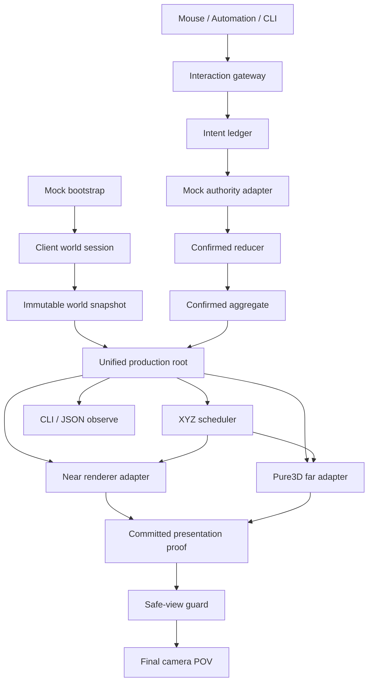

# Voxia 客户端流送与完整 3D LOD 当前事实

> 本文是 Voxia 近场流送、Pure3D far、完整 XYZ coverage、presentation 与场景生命周期的合并态
> 真值，并包含阶段 2 普通宏格交互与 confirmed presentation 的当前边界。阶段 1 规格与完成证据已归档到
> [`阶段 1 PRD`](../../../20-archive/client/2026-07-15-voxia-phase1-world-rendering-lifecycle-prd.md)和
> [`阶段 1 closeout`](../../../20-archive/client/2026-07-15-voxia-phase1-world-lifecycle-closeout.md)。

## 当前结论

- **离线 Mock 阶段 1 已完成。** Voxia 从唯一正式入口创建只读 Mock session，进入唯一
  `AVoxiaUnifiedVoxelWorldActor` 生产根；首次加载、连续流送、safe-view、恢复加载、retry、返回
  菜单和新游戏均已接线并通过三入口验收。
- **离线 Mock 阶段 2 已完成。** 同一正式根已接入 profile-neutral intent ledger、Mock authority、
  confirmed aggregate、普通宏格 place/break、near/far exact presentation receipt、会话 HUD 与四个只读
  `world` 诊断命令。普通世界没有微格编辑；微格只留给阶段 3 prefab footprint。
- **唯一空间口径是完整 XYZ。** 一个 tile 为 `7×7×7=343 chunks`；near radius 1 为
  `3×3×3=27 tiles=9261 chunks`。任一单轴跨 tile 时，entered/exited=`9 tiles=3087 chunks`，
  retained=`18 tiles=6174 chunks`。
- **相邻 tile 权威交接是后台流送，不是全世界重建。** 首次 presentation proof 后 session readiness
  保持单调；进入新 tile 立即准备 staging，旧 committed `3×3×3` XYZ coverage 继续可玩且不显示
  全屏 overlay。只有玩家越出旧 coverage 的 XYZ/L∞ depth 达到 `3`、staging 仍未提交时才进入
  “权威覆盖流送超时”全屏恢复；确定性 authority/H/source/proof 错误仍立即失败。
- **near/far 共享世界事实，不共享可变隐式状态。** 会话冻结一个 world snapshot/source identity；
  两个 renderer 都消费 `root_world_snapshot`。near 的 active CPU store/tile batch 与 far 的 page
  residency/artifact cache 仍由各自系统自维护，根只通过 generation、center、readiness 与
  presentation proof 协调，不把一个系统的内部 cache 暴露给另一个系统。
- **材质族与有界发布已收口。** opaque/translucent/emissive slot 贯穿 canonical artifact、
  DynamicMesh、scene host 与预算指纹。默认 WorldGen 内容仍以 opaque 为主；测试 fixture 证明
  family contract，不代表内容资产已经美术丰富化。
- **Online authority 尚未开始。** 阶段 2 的 Mock adapter 只在离线 session 内拥有 authority；WorldGen/local
  pack 都不是 Online 服务端 confirmed truth。后续只能替换 adapter/bootstrap/provider，不得新建第二条客户端主干或在 Online 失败时回退 Mock。
- **Voxia 是唯一现役客户端。** Web / Bevy 保持逻辑归档，不进入本状态、CI 或完成度判断。

## 当前数据流与所有权

所有权边界：

- `UVoxiaClientFlowSubsystem`：session、流程状态、viewport overlay 与用户命令；不拥有 renderer。
- `FVoxiaClientWorldSnapshot`：session id、runtime profile、source identity、snapshot id、authority
  kind、revision；创建后只读。
- `AVoxiaUnifiedVoxelWorldActor`：唯一根、snapshot binding、near/far child 生命周期、coverage
  plan、presentation proof、safe-view 输入、retry/leaving cleanup。
- `AVoxiaWorldActor`：完整 XYZ near 数据泵、confirmed/mock store 的 renderer-neutral CPU mesh、
  tile × material family active batch；不创建 far truth。
- `AVoxiaPure3DVoxelWorldActor`：far request/diff/residency/cancellation/artifact/stable patch；不创建
  near truth。stale/cancel/fail/publish-fail 归还 reusable canonical batch 时不得覆盖更新
  owner；已脱离 UObject 的大纯数据在单条最低优先级 far worker 上释放，EndPlay 必须先
  drain 再销毁 worker。
- `UVoxiaVoxelPresentationSceneHost`：hidden/live/retiring UObject、材质、预算、真实 render fence、
  可见切换与分帧退役；不解释 provider 或世界规则。
- `UVoxiaConfirmedWorldSubsystem`：唯一客户端 confirmed mirror；只允许 reducer candidate-then-publish。
- `UVoxiaWorldIntentSubsystem`：ledger、authority adapter、类型化事件 correlation 与 acknowledged history；
  不拥有 Gameplay selection 或 renderer。
- `FVoxiaBuildInteractionController`：完整 signed64 XYZ 宏格选择与 place/break intent；不直接写 confirmed truth。
- `AVoxiaUnifiedVoxelWorldActor` 的 transaction driver：从 freeze frame 和 exact owner reservation stage near/far，
  fence 完成后 ack receipt，再 commit finalize；失败进入可诊断 recovery。

## 生命周期与安全视图

正式状态包括 `bootstrapping`、`initial_loading`、`playable`、`streaming`、`safe_view_hold`、
`streaming_recovery_loading`、`retrying`、`leaving`、`menu_idle` 与 `failed`。

- 初始会话先绑定 snapshot，再 deferred spawn 唯一根；near/far/snapshot/ownership/fence 一致并提交
  首个 proof 后才进入 playable，此后正常 staging 不撤销 session readiness。
- 玩家进入新 tile 立即开始后台 staging；只要玩家仍在旧 committed bounds 内，flow 保持可玩、overlay
  隐藏，相机正常跟随。candidate coverage 未提交时不得改写 committed bounds。
- 玩家离开旧 bounds 后，safe-view guard 按完整 XYZ/L∞ 深度工作且不修改 pawn、control rotation、
  velocity 或几何。depth `1..2` 只显示非阻塞提示；depth `>=3` 且 staging pending 才进入恢复加载。
  当前 generation 后续提交时可自动恢复，也可主动 retry 或返回菜单。
- retry 为 single-flight，复用同一 snapshot、创建新 presentation generation；stale completion
  只能被拒绝。新游戏结束旧 session 后创建新 snapshot/root。
- 阶段 2 已按[世界占用与 Prefab runtime 设计](../../../10-active/cross-cutting/2026-07-21-voxia-phase2-phase3-world-occupancy-and-prefab-runtime-design.md)完成。宏格编辑只在 active、Playable、confirmed coverage 内开放；`micro_edit` 固定返回 `micro_edit_not_supported`，prefab 固定返回 `feature_not_available_phase3`。

## 流送与表现实现

### Near

- 数据窗口、mesh、readiness、active batch 与 far hole 都消费同一 `FVoxiaNearVoxelWindow`。
- authority/update 粒度仍是 chunk；live 绘制按完整 XYZ tile × material family 合批，默认上限
  `27×3=81` 个 active-near component。
- worker 只读冻结的 CPU mesh 输入，不接触 UObject；source epoch 变化会拒绝 stale result。
- WorldGen tile generation 使用后台低优先级线程池；observe 只写首批、每 8 批与末批 checkpoint，
  避免同步日志制造 GameThread 尖峰。

### Far

- cube-shell planner、canonical v2 page、六向 material mip、coverage-resolved surface 与
  canonical→UE adapter 都只认 XYZ。
- incremental plan 维护 required/keep/enter/exit/provider dirty；worker 支持 cooperative cancel，
  superseded/stale generation 不得发布。
- material/surface cache 与 source identity 绑定；far worker 使用后台低优先级队列。
- logical stable patch 保持低组件帧占比；超大 patch 再按 quad 预算切 render shard。scene host 按
  creation→registration→fence→visibility→retirement 分帧推进。

### 根级正确性

每个已提交 proof 必须满足：snapshot/revision/generation/center 一致，near/far center 对齐，
`gap_count=0`、`overlap_count=0`、`stale_commit_count=0`。queue depth 最大为 1；旧 live 在新代真实
fence 与可见切换完成前保持可见。

## 性能口径与结果

`frame_perf` 同时输出：

- `frame_ms`：raw delta，包含帧率上限、窗口调度、渲染/驱动等待和 GC 环境长帧；
- `game_thread_ms`：排除等待后的 GameThread CPU，用于阶段 1 streaming 门禁。

短 Real-RHI 窗口隔离 UE 周期性 pending-kill purge；30 分钟 soak 保留默认 GC。最终结果：

| 场景 | GameThread p95 | GameThread max | `>16.67ms` | 结果 |
|---|---:|---:|---:|---|
| 1280×720 move | 4.70ms | 12.44ms | 0 | pass |
| 1280×720 return | 4.56ms | 14.52ms | 0 | pass |
| 1600×900 move | 4.46ms | 16.01ms | 0 | pass |
| 1600×900 return | 4.60ms | 13.66ms | 0 | pass |

1600×900 长稳态运行 30 分钟，完成 96 条 route completion、93 个资源样本；residency、material、
surface、resource set、retiring set 与 component 均未出现严格单调增长。第二段 raw frame max
`65.41ms` 被保留为默认 GC/渲染环境证据，其 GameThread max 仅 `13.66ms`，不能误归因为 streaming。

## 验证入口与证据

| 入口 | 当前结果 |
|---|---|
| `VoxiaEditor Win64 Development` | build success |
| `Automation RunTests Voxia` | `141/141` success，0 failed / not-run |
| Node runner/governance | `75/75` pass |
| Phase 2 Null-RHI 联合闭环 | material 6、X/Y/Z 各 80 tiles 往返、最终 empty/parity/menu pass |
| Phase 2 1920×1080 Real-RHI | 30 分钟、49 样本、105 far commits、release pending=0、cache 有界、0 fatal/authority/GPU error |
| 1280×720 Real-RHI 全路线 | 25 条路线 pass，含截图 |
| 1600×900 Real-RHI 长稳态 | 30 分钟 pass，无资源单调增长 |

主要产物：

- `.demo/observe/voxia_phase1_automation_2026-07-16T00-17-07/`
- `.demo/observe/voxia_phase1_2026-07-15T14-55-37-788Z_null_rhi_1280x720/`
- `.demo/observe/voxia_phase1_2026-07-15T15-30-59-504Z_real_rhi_1280x720/`
- `.demo/observe/voxia_phase1_2026-07-15T15-44-42-482Z_real_rhi_1600x900/`
- `.demo/observe/voxia_phase2_2026-07-21T19-04-35-074Z_null_rhi_1280x720/`
- `.demo/observe/voxia_phase2_2026-07-21T19-06-27-954Z_visible_rhi_1920x1080/`

结构化入口包括 `client_flow_state`、轻量 `client_flow_probe`、`safe_view_state`、
`voxel_streaming_profile`、`voxel_world_root_state`、`frame_perf` 与 `render_perf`。

## 2026-07-18 权威窗口非阻塞交接复验

- `voxel_world_root_state` / `client_flow_probe` 已追加 `session_ready`、staging 与
  `authority_coverage`，其中包含 committed bounds、玩家 chunk、XYZ 分轴深度、L∞ 深度与固定阈值 `3`。
- 全量 `Automation RunTests Voxia` 为 `70/70` Success；Null-RHI 全路线为 25 routes pass、clean exit、
  far release=`11/11/0`。
- Null-RHI 与 Real-RHI 的首个相邻 `+X` 换窗都从 center `[11,0,-51]` 提交到 `[12,0,-51]`，明确
  观察到 `nonblocking_staging=true`、`recovery=false`。Real-RHI observe 显示开始时玩家 chunk
  `[84,3,-355]` 仍在旧 bounds `[70,-7,-364]..[90,13,-344]` 内，depth=`0`，随后 staging 原子提交。
- Real-RHI 25 条功能路线完成且 0 `LogVoxia: Error`；严格性能门禁仍为红：第二 streaming 窗
  GT p95=`1.480ms`、max=`52.351ms`、`>16.67ms=2`。这不回写成功，也不与功能修复混淆。

证据分别位于：

- `.demo/observe/voxia_authority_streaming_final_20260718_122257/`
- `.demo/observe/voxia_phase1_2026-07-18T04-24-07-621Z_null_rhi_1280x720/`
- `.demo/observe/voxia_phase1_2026-07-18T04-26-34-025Z_real_rhi_1280x720/`

## 2026-07-17 审查硬化候选复验

`clients/Voxia@500248e + 97d5002` 在上述阶段 1 完成基线上收口了 far 纯数据所有权：

- reusable canonical batch 在 plan、residency 与 build 的 stale/cancel/fail 路径均会归还
  actor owner；owner 已持有不同 batch 时显式拒绝覆盖并记录
  `voxel_pure3d_reusable_batch_restore_rejected`。
- launch plan、build result、retired coverage、publish 失败/替换的 artifact cache 与 EndPlay
  剩余 residency/cache/provider 等大纯数据统一进入 far worker 释放队列。UE 5.8
  `FQueuedThreadPool::Destroy()` 会放弃未开始任务，因此 EndPlay 先用条件事件 drain，再销毁线程池。
- `pure3d_world_state.far_release` 与 observe 同步暴露 `queued/completed/pending`。EndPlay 成功发出
  `voxel_pure3d_far_release_drained`，失败发出 `voxel_pure3d_far_release_drain_failed`；根级 runner
  只接受本次 quit 之后、同一 `world_snapshot_id`、输出流 close 且进程退出码为 0 的成功终态。

## 2026-07-21 远景 RG0–RG6 与性能门禁收口

远景现役数据流为 canonical XYZ → coverage-resolved surface → immutable AO/sky lighting → stable patch
mesh → atomic scene host → 唯一 `production_all_features` 根。固定质量策略只存在
`performance_natural` 与同根的 `quality_natural`，不创建第二世界入口。

1920×1080 Real-RHI 完整生命周期 25 条路线通过；两段 streaming 窗 frame p99=`7.693/7.692ms`、
GPU p95=`3.172/3.197ms`，最大帧 `27.338/26.182ms`。30 分钟生命周期完成 113 条路线、110 个
资源样本，无单调增长。RG6 30 分钟把七路线各驻留 `257142ms`，相邻时序仍以 `125ms` 短突发采集；
固定地形可见闪烁比最大 `0.000027`，最坏 frame p95/p99=`5.035/6.495ms`、GT p95=`1.591ms`、
GPU p95=`4.387ms`，gap/overlap/stale 均为零。

2026-07-21 又从本次 Voxia 工作树启动 1600×900 可见游戏窗口，保留 UDS，使用 WorldGen 与唯一
`production_all_features` 根。根级 observe 确认 `ready/session_ready/centers_aligned=true`；用户
确认“效果不错”并批准合入默认生产主线。这条人工结论不依赖服务端运行或状态。

Editor-only `performance_runtime_barrier` 在 frame reset 前等待 compilation/DDC/render quiescence 并回收
旧世界 PendingKill；一次性回收耗时被报告但不进入新根稳定态窗口。

## 当前缺口

1. 阶段 3：prefab catalog、24 orientation、instance directory、精确微格投影/命中、原子放置/移除/替换与 refined near/far；设计/计划已完成，阶段 2 前置门禁已满足，但尚未实施。
2. Online authority provider 与本地 production 包/launcher。
3. 正式天气策略和更丰富的透明/发光内容。
4. 低配置硬件、发布包与更多驱动的发布性能分档。

## 被取代结论

- “A10 唯一根仍缺完整三轴 route、材质族、full oracle、GameThread 离群帧与长稳态”已被阶段 1
  完成证据取代。
- “near 尚未消费 root source identity、存在第二份 WorldGen truth”已被统一 snapshot binding 与
  root `source_consumption` 证明取代。near/far 各自保留派生 cache 是系统正交，不是第二份 truth。
- 旧 XZ column、有限 Y band、VHI、heightmap、v1 column page、raymarch 与 near-only/far-only
  验收继续只属归档/probe，不得恢复为正式路径。
