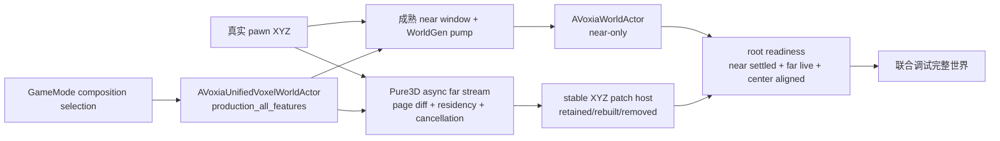

# Voxia 客户端流送与完整 3D LOD 当前事实

> 本文是 Voxia 近场流送、远景 LOD、完整三维 coverage 与 presentation 的合并态真值。阶段过程与诊断证据保留在归档文档；当前推进只认本文、[`纯 3D 立方壳上位阶段`](../../../10-active/voxel-far-field/2026-07-12-pure-3d-voxel-shell-migration.md)与[`A10 WorldGen 完整客户端滑动世界作战任务`](../../../10-active/voxel-far-field/2026-07-12-a10-cancellable-incremental-voxel-shell-streaming.md)。

## 当前结论

- **当前仍是里程碑 A，里程碑 B 尚未开工。** 原 A1-A5 的四环分级、分组件 StaticDraw、greedy merge、seam/fade/collar、紧凑顶点与 cache 卫生已完成；A 的目标现已扩展为“客户端完整 3D 近/远 LOD + 可持续流送数据流 + 原子 presentation”。
- **唯一生产/联合调试根已经落地。** 普通 `-VoxiaWorldGenPreview` 现在默认由 `AVoxiaUnifiedVoxelWorldActor` 启动 `production_all_features` 组合：成熟 `AVoxiaWorldActor` 只拥有 near 滑窗、数据泵与 per-chunk 呈现，`AVoxiaPure3DVoxelWorldActor` 只拥有 Pure3D far；GameMode 只生成一个顶层 world root。根只有在 active near window 已完成呈现结算、Pure3D far 已 live、且两者 XYZ center 相等时才 `ready=true`；near 全空气时以“settled but zero geometry”处理，不误判为 missing。
- **唯一根已经把 Pure3D far 的增量链用于正式联合调试，尚未解决 near/far 同一事务。** 当前 near 与 far 仍由两个迁移期实现模块分别构建；Pure3D far 已使用请求差集、immutable residency/lease、cooperative cancellation、依赖 artifact cache 与 stable XYZ patch transaction，相邻 center 不再全量请求或重建约 3.3 万 pages，统一根也不再生成或注册被隐藏的 Pure3D near aggregate。两侧尚未共享 source identity、canonical page residency、coverage generation 与原子 scene transaction，因此 A10 仍未完成。
- **在线 authority provider 尚未接唯一根。** 不带 WorldGen provider 时仍选择 `online_compatibility` 的 `AVoxiaWorldActor`；它包含 `svo_source_pages_v1`、heightmap/VHI、`CenterTile.Y=0` 与 XZ near-skip 等迁移期实现。该路径不是第二个生产根，只是服务器接入前的显式兼容状态。
- **客户端 WorldGen 与 H-gated `local_disk` 已共用请求式 provider 契约，但目前都只接入 Pure3D far。** WorldGen 只 materialize `enter/dirty` page；本地 provider 在启动时用外部 manifest SHA-256 与 expected identity 打开不可变 entry table，再只读取请求页并逐页校验。keep-clean page 均从公共 residency 复用，两者都响应 generation cancellation；scripted provider 运行同一 conformance 契约。成熟 near 数据泵尚未消费这套 provider/residency，所以本地根必须报告 `mixed_near_worldgen_far_local_disk`。
- **A10 已完成本地磁盘 request provider 与首轮性能收敛，服务器 provider 仍不实现。** `FVoxiaCanonicalVoxelPages::LoadExpectedBatch` 保持 exact-set 原子 batch 语义；live 子集读取由独立 `OpenExpectedManifest` + `FVoxiaLocalDiskCanonicalVoxelPageProvider` 完成，禁止 manifest 自报 H、禁止失败回退 WorldGen。resolved surface 已按 page 并行，material/surface cache 使用 source-bound immutable shared refs；future 结果以 move-consume 移交，coverage diff 在 worker 执行，旧 generation lease 按页预算回收。near/far 统一 transaction、自动 XYZ 长巡航与材质收口仍须在客户端独立完成；以后接服务器只能新增 provider adapter。

## 唯一正式根与隔离路径

| 路径 | 当前用途 | 已证明 | 尚未证明 |
| --- | --- | --- | --- |
| `AVoxiaUnifiedVoxelWorldActor` / `production_all_features` | **唯一正式客户端联合调试与效果验收根**；`-VoxiaWorldGenPreview` 默认选择，可显式令 Pure3D far 使用 `local_disk` | 正常入场即同时运行成熟 near 数据泵/滑窗与 Pure3D far；自动跟随真实 pawn XYZ；根级中心一致性/readiness；WorldGen/本地 far 请求差集、residency、cooperative cancellation、artifact 复用、stable patch 事务；地面/相邻移动/高空 Real-RHI | near/far 共享 provider/residency/coverage generation 与原子 transaction；完整三轴长巡航；在线 authority provider |
| `AVoxiaWorldActor` standalone | 无 WorldGen 时的 `online_compatibility`，或显式 `-VoxiaLegacyVoxelWorldProbe` / 专用旧预览地图 | near hot path、patch-native 旧 far、双向 ownership handoff、长距离活性、兼容路径性能 | 纯 XYZ far coverage、生产 v2 pages、统一根在线接线；不得作为全要素验收 |
| `AVoxiaPure3DVoxelWorldActor` standalone | 显式 `-VoxiaPure3DProbe`（兼容旧名 `-VoxiaPure3DWorld`）的隔离 probe | 单 generation Pure3D near/far、resolved surface、真实 fence、手工换代 | 成熟 near 数据泵与全要素场景；不得作为生产根证据 |
| `AVoxiaVoxelSurfacePreviewActor` | 独立材质/表面调试 | ±8km、洞穴、混合材质、无绝对 mesh UV | 生产材质族和在线资源生命周期 |

参数和专用地图可以隔离验证，但只有 `production_all_features` 根可以承担客户端联合调试、效果测试和里程碑主流程证据。dev WorldGen 截图既不能替代 baseline/H gate、wire parity 或服务端 confirmed truth 验收，也不能替代根级结构化 readiness 与真实玩家移动验收。

## 当前数据流与所有权

当前根统一了启动入口、可视职责和联合 readiness。Pure3D far 子模块已经按 required/keep/enter/exit 请求 page，复用 resident page 与 dependency artifact，只为变化的 absolute XYZ patch 构建 replacement mesh；旧 live generation 在新代提交前持续可见，取消或 stale 结果不能发布。相邻 default 本地移动的 artifact stage 已由 `6-9s` 降到约 `0.55-0.60s`，完整 worker 约 `0.91-0.95s`；coverage 规划、共享 cache 转交、future consume 和旧 lease 回收均不再形成单个 O(N) GameThread 提交。当前缺口是 near 仍走成熟但独立的数据泵与 per-chunk 呈现，两侧还没有共用 source identity、residency、coverage generation 和原子 transaction。

边界不变量：

1. `FVoxiaFarFieldCubeShellPlanner` 只决定 XYZ cell/span/LOD、量化 anchor、underlap 唯一 owner 与预算；不读取 source 或 renderer。
2. `FVoxiaCanonicalVoxelShellSceneBuilder` 先从 plan 生成 far shell + near halo 的 required page set，再只消费一个已验证、身份绑定的 canonical batch；它不知道 WorldGen、磁盘、HTTP 或 UObject。
3. `FVoxiaVoxelShellResolvedSurfaceStager` 用 near 优先、far 最细 ring 优先的唯一 owner 解析页外采样；missing、coverage 外 unresolved 与 resolved air 是三种不同状态。
4. `FVoxiaVoxelPresentationGenerationCoordinator` 只在 near、far、ownership、render fence 属于同一 generation 且全部 ready 时允许 commit；stale、superseded 或失败信号不得改变旧 live。
5. `UVoxiaVoxelPresentationSceneHost` 只管理 hidden/live/retiring `UDynamicMeshComponent` 与真实 fence；source、WorldGen 和体素算法不得进入 host。

## 里程碑 A 已完成部分

### A1-A5：原始渲染正确性与容量

- 显式 tier 契约与 7/14/28/56m 四环、3.5m collar 已落地；旧全细分 8km 几何显著收敛。
- 远景采用分 patch `UDynamicMeshComponent + StaticDraw`，组件级剔除、后台 prepare、逐帧 bounded submit 已落地。
- per-cell masked greedy merge、跨 depth coverage 检查、互补 fade、近远共享 UV 数值契约、约 91B/quad 紧凑格式与 persistent cache LRU/容量/孤儿清理已完成。
- raymarch 已明确退出当前路线：真实 RHI dispatch/readback 后仍复现 D3D12 3D/Compute 队列超时；现行验收不得传入任何 `VoxiaSvoRaymarch*` 参数。

### A6-A7：客户端数据流送与近远交接

- WorldGen preview 的 near 数据改为单 producer 连续 generate/apply；默认 batch/high-water/reveal 为 `256/512/0`，请求级 column cache 复用 X/Z 高度计算。
- confirmed store 对整块同材质 chunk 使用紧凑基底与稀疏例外；near renderer 改为 per-chunk 可复用组件，settled revision 使用小帧预算复核。
- far 默认走 patch-native dirty 更新；patch aggregation、bounds/fingerprint 与 `FDynamicMesh3` CPU build 在 ThreadPool，GameThread 只做 bounded UObject/material/register/`SetMesh` 提交。
- near pending 与 presentation-ready ledger 分离，垂直呈现带由玩家 Y 自维护；同一 voxel revision 下跨 Y 层也会主动补齐，不再依赖后续 revision 偶然恢复。
- 双向交接已实现：进入侧在 near submit 后由 XYZ ownership mask 接管；退出侧持有 retirement lease 并按 tile 合批，matching far live 后才释放；快速折返恢复原 near 组件。
- 默认兼容路径的完整 1600×900 near+far 相邻移动最终证据约为 137 FPS，20 秒 p50/p95/p99/max=`7.250/8.148/8.644/16.569ms`，无 `>16.67ms` 帧。该数字只代表当前验证机与既有兼容路径，不是所有硬件或纯 3D 新 builder 的承诺。

### A8-A9：完整 3D LOD 与原子 presentation 内核

- `FVoxiaFarFieldCubeShellPlanner` 已覆盖负坐标、X/Y/Z 六向边界、每环独立量化、无洞 underlap、唯一 owner、预算与溢出。
- `voxia_voxel_source_pages_v2` 使用 XYZ brick + X-fastest material lattice；内存 page 支持 `uniform_air / uniform_material / dense`，wire 仍确定性展开为 dense big-endian `u16`。
- 六向 material mip 与 exact surface 保存真实实体侧 material；mixed 不提供伪 fallback，greedy 不跨材质。
- shell 级 resolved surface 消除了同 LOD、跨 LOD、near/far page 内部假面，也不把 coverage 外部伪装为空气墙。
- source-neutral scene builder、generation coordinator、真实 resource-set fence、scene host 与 dev composition root 的**单 generation 构建/提交**已闭环；场景 lifecycle、连续滑窗与增量数据泵尚未闭环。
- 高空 Real-RHI 从 `[11,0,-51]` 切到 `[11,12,-51]`：新代 near 为 0 quads，far 仍有 `291021` quads；worker 期间旧代持续可见，提交后才退役。scene submit near/far/total=`0.482/3.099/3.599ms`。

### A10：WorldGen 驱动的完整客户端 3D 滑动世界（实施中）

当前主攻文档是 [`WorldGen 驱动的完整客户端 3D 滑动世界`](../../../10-active/voxel-far-field/2026-07-12-a10-cancellable-incremental-voxel-shell-streaming.md)。过去互斥的成熟 near 流送与 Pure3D far 已接入唯一 `production_all_features` 根；普通 WorldGen 场景无需手工 recenter 即能形成 near+far 联合世界。Pure3D far 的请求差集、page residency、cooperative cancellation、artifact 复用和 stable XYZ far-patch transaction 已实跑，但成熟 near 与 far 仍未共享同一 coverage generation/transaction。

已完成的根事实与地基：

- `FVoxiaVoxelWorldComposition` 使 `-VoxiaWorldGenPreview` 默认选择唯一正式根；`-VoxiaLegacyVoxelWorldProbe`、`-VoxiaPure3DProbe`/旧 `-VoxiaPure3DWorld` 只选择隔离路径，selector 冲突硬失败。
- `AVoxiaUnifiedVoxelWorldActor` 是 GameMode 唯一顶层 world root；它拥有 near-only `AVoxiaWorldActor` 与 far-only `AVoxiaPure3DVoxelWorldActor`。旧 heightmap/SVO far 请求在统一根中关闭，统一根不再构建或注册 Pure3D near mesh/component，消除双 owner 与隐藏 aggregate。
- `voxel_world_composition_state`、`voxel_world_root_state` 与 stdio `until_voxel_world_root_ready` 已形成根级 CLI 门槛；ready 要求 active near window、near revision settled、Pure3D far live 与 XYZ center 一致。near 全空气允许零 geometry，但不能缺 window。
- `FVoxiaCanonicalVoxelShellSceneBuilder::BuildPageRequest` 明确列出 far + near required pages；`Build` 只接受 identity-bound batch，并对 plan/coverage/source fingerprint 漂移硬失败。
- `FVoxiaWorldGenCanonicalVoxelPageProvider`、scripted provider 与 `FVoxiaLocalDiskCanonicalVoxelPageProvider` 实现同一 source-neutral request 契约；历史命名的 `FVoxiaWorldGenVoxelShellBuilder` 实际持有冻结 provider，只请求 enter/dirty page，并从 immutable residency 复用 keep-clean page。
- `FVoxiaVoxelShellIncrementalPlan` 输出 required/keep/enter/exit/provider-dirty；`FVoxiaCanonicalVoxelPageResidency` 维护 source 隔离、immutable entry、generation lease、512 MiB 容量与 LRU 指标。
- cancellation token 已贯穿 provider、material mip、resolved sampler 与 patch mesh；actor 使用 latest desired、stale reject、显式 scene phase 与有界 EndPlay。默认 profile 连续 supersede 实跑为 `cancel requested/acknowledged/stale rejected=2/2/2`，ack 约 `2ms`。
- material artifact 按 page content fingerprint 复用；surface artifact fingerprint 纳入实际 coverage owner、owner content、ring/candidate/unresolved。成功 generation 原子替换 cache，canceled/stale 结果不得发布。
- far scene 使用绝对 canonical XYZ `32³` tile patch；scene host v2 只创建 replacement 组件，在 commit 内转交 retained UObject，real render fence 后退役 removed/replaced 组件。
- `FVoxiaCanonicalVoxelPages::OpenExpectedManifest` 以外部 H + expected identity 打开不可变 manifest 超集；`FVoxiaLocalDiskCanonicalVoxelPageProvider` 只读取请求页并在 size/SHA-1/codec/brick identity 全部通过后原子发布。`LoadExpectedBatch` 继续服务 exact-set batch，不承担 live 子集语义。
- 默认 Real-RHI 根在地面中心 `[11,0,-51]` 达到 ready：near=`855 components / 78451 quads`，far=`33725 pages / 359397 quads`，far scene submit=`2.478ms`；稳定 5 秒 `frame_perf` p50/p95/p99/max=`5.385/6.705/7.368/7.761ms`。
- 飞到中心 `[8,13,-54]` 后，near window 完整结算为 `3087` 个 ready chunk、`0` geometry，far generation 2 仍有 `288445` quads，根再次 `ready=true`；高空截图没有旧二维 near-skip 柱洞。该次 far full build=`12682.556ms`，直接证明增量工作仍未完成。
- 当前相邻 +X `[11,0,-51]→[12,0,-51]` 的 default profile 为 `required/keep/enter/exit=33752/32235/1517/1517`，provider 只请求 `1517` 页；material `reused/rebuilt=32199/1526`，surface `29533/4219`；far patch `required/retained/rebuilt/removed=216/175/41/0`，`53/53` 有几何组件 visible。最新 Real-RHI 本地证据中 provider/artifact/mesh/total 约为 `150-174/553-563/195-211/910-949ms`；surface parallel work 约 `0.49-0.50s`，publish 约 `2-4ms`。GameThread prepare/finalize/publish 各约 `4.5-7.5ms`，完整移动 p50/p95/p99 约 `4.5/5.6/6.3ms`，仍观察到少量运行相关的 `16ms+` 离群帧。
- H-gated default 本地包包含 `35269` 个 route union page、payload=`336571434` bytes。唯一根冷启动读取 `33752` 页；最新 Real-RHI 冷启动 worker 约 `5.0-5.8s`，主要成本已转为磁盘 provider。相邻 +X 只读 `1517` 页，并复用 `32235` resident page、`32199` material、`29533` surface 与 `175/216` patch。VXP2 统一材质页解码后恢复 compact storage，冷窗 resident page material 约 `19MB`，不再因 dense 表示膨胀到约 `318MB` 并触发 derived-cell budget。
- 错误 manifest H 实跑中根契约为 `voxia_unified_voxel_world_root_v3`，`authorized=false`、`authorization.composition=true/source=false`，far generation/residency/artifact/scene component 均为零；provider kind 仍为 `local_disk`，错误直接出现在根级 `error`，没有 WorldGen fallback。

仍需在 A 内完成：

1. 把当前“一个根拥有两个迁移期模块”收敛为同一 scene lifecycle、source identity、coverage generation 与原子 transaction；抽取成熟 near pump/renderer 能力，而不是长期保留 actor 间隐式耦合。
2. 让成熟 near 与 Pure3D far 共用 source identity、page residency、coverage generation 与原子 transaction；当前增量 provider/residency 仅服务 Pure3D far。
3. 完成 artifact DAG 的第二轮增量化：共享 artifact ref 与并行 resolved-surface 已落地，但每代仍扫描完整 dependency fingerprint，并重建 `4219` 个 dirty-closure surface；需补反向依赖索引与增量/full oracle，继续压低约 `0.9s` desired→live 延迟及偶发帧尖峰。
4. 补 root HUD、prefetch/hysteresis 与 route driver，并完成出生、±X/±Y/±Z、对角、快速折返、传送、高空再回地面的长巡航；确认 queue、lease、retiring 和 cancellation 不积压。
5. 对 stable patch transaction 补 removed/changed 的完整 real-RHI 路线、gap/overlap 计数和跨 patch 边界移动；当前真实相邻 +X 证明 retained/rebuilt，但 required patch key 集未发生 removed。
6. 收敛 world-aligned material family 与同点 near/far audit；当前画面仍以单一浅色 terrain family 为主，不能作为完整材质族收口。
7. 网络/HTTP/服务器 authority provider、launcher 真包与默认在线切流不属于 A10；本地磁盘 provider 只消费开发/测试 pack，不冒充生产发布物。以后在线接入只能新增 provider adapter，不能创建另一条客户端主干。

当前 default 本地包冷启动 Real-RHI worker 约 `5.0-5.8s`，其中磁盘 provider 约 `3.3-4.0s`；相邻移动 worker 已降到约 `0.91-0.95s`，far GameThread prepare/finalize/publish 分段均低于约 `8ms`。因此当前根已具备可取消页差集、共享 immutable artifact、并行 surface、预算化 lease 回收和 stable far-patch 提交；仍缺 near/far 统一 transaction、完整路线、增量/full oracle和离群帧收口，不能把一次相邻移动外推为 A10 完成。

## 里程碑 B/C 边界

- **B 尚未开始。** B 才冻结生产 T-4 远景 page payload/规约、T-11 失效与分发语义、T-12 required-set/shard manifest，并把客户端变成固定 1m near + 7m far 投影的 fixture oracle。
- **C 才改服务端。** pages writer、dirty/mip 聚合、wire 失效 opcode、HTTP 分发、launcher/update 真包与默认在线切流都不属于当前 A。
- A 中已有的通用 v2 codec、H-gated 原子磁盘 batch、本地 request provider 和 source-neutral builder 是可复用的客户端开发地基，不等于生产 page contract 已冻结，更不授权修改 `apps/*`；服务器/HTTP/在线 authority adapter 仍后置。

## Authority 与 baseline gate

- 在线 near confirmed store 只应用服务端 `ChunkSnapshot 0x62`、`ChunkDelta 0x63`、`VoxelIntentResult 0x68` authoritative cells 与 `ChunkInvalidate 0x69`；客户端体素编辑不做 confirmed 乐观写入。
- `ConnectGate` / `EnterScene` 必须在本地 world pack / release manifest / shard size+SHA-256 / payload 校验通过后才允许继续；`ChunkSnapshot` 不能修补缺失 baseline。
- `-VoxiaWorldGenPreview` 与纯 3D dev actor 是明确例外，只用于开发 fixture 和表现验证；不能作为 H gate、decoder parity、编辑或服务端 authority 证据。

## 可观测与验证入口

| 入口 | 证明什么 |
| --- | --- |
| `voxel_shell_plan` | XYZ ring、anchor、span、cell 数、唯一 owner 与预算 |
| `voxel_worldgen_canonical_shell_probe` | WorldGen 只产 canonical batch；空气页显式存在；完整 stage 全有或全无 |
| `voxel_coverage_ownership_probe` | 高空/地面 sample 的 near/far/gap 与旧二维裁剪差异 |
| `voxel_presentation_generation_probe` | early commit、stale ready、failure、supersede 与恢复 |
| `voxel_world_composition_state` | 当前顶层选择、是否唯一正式根、WorldGen/legacy/Pure3D selector 与冲突错误 |
| `voxel_world_root_state` | `production_all_features` 根的 near/far 角色、readiness、XYZ 中心一致性与子模块快照 |
| `until_voxel_world_root_ready [timeout_ms]` | 联合根门槛：near settled、far live、中心一致；near 全空气不误报失败 |
| `pure3d_world_state` / `pure3d_stream_state` | scene phase、desired/observed/in-flight/live center、diff/residency/artifact cache、cancel、stable patch、worker/scene timing 与 fence |
| `pure3d_world_recenter x y z [small\|default]` | 显式三轴重心与重试 |
| `pure3d_stream_cancel` | 显式取消当前 worker，验证 acknowledgement 与 stale commit 拒绝 |
| `until_pure3d_scene_playable` / `until_pure3d_stream_settled` | stdio 可轮询的首窗 playable 与指定最小 generation 的 latest-only settle 门槛 |
| `frame_perf` | p50/p95/p99/max 与阈值超帧计数 |

现有自动化证据：

- `.demo/observe/voxia_voxel_world_composition_automation/` 与同名日志：`Voxia.Gameplay.VoxelWorldComposition` success / exit 0；
- `.demo/observe/voxia_unified_production_real_rhi.log`：默认窗口/默认 shell 唯一根地面 ready 与稳定帧数据；
- `.demo/observe/voxia_unified_production_real_rhi.png`：默认根 Real-RHI 画面，1280×720、14361 unique colors、像素审计通过；
- `.demo/observe/voxia_unified_production_flight_real_rhi.log` 与 `.png`：真实 pawn 高空中心 `[8,13,-54]`，near settled/zero geometry、far 288445 quads、中心一致、根 ready，PNG 26447 unique colors；
- `.demo/observe/voxia_a10_s3_default_cancel.log`：default profile 两次 supersede cancellation 均 acknowledgement，只有最终 generation commit；
- `.demo/observe/voxia_a10_s5_default_move_r2.log`：Null-RHI default profile 相邻 +X 的 page/artifact/patch 复用与最终根中心一致；
- `.demo/observe/voxia_a10_s5_real_rhi_move.log`：Real-RHI 同路线 `216/175/41/0` far patch transaction，`53/53` components visible；对应 PNG 为 `clients/Voxia/Saved/voxia_a10_s5_production_real_rhi.png` 与 `voxia_a10_s5_production_move_real_rhi.png`，非黑比例均 `1.0`，unique colors=`14377/15542`；
- `.demo/observe/a10_s5_scene_builder*.log`、`a10_s5_worldgen_builder.log`、`a10_s5_resolved_surface.log`、`a10_s5_resource_set.log`：stable patch、artifact reuse、resolved dependency 与真实 fence coordinator 定向 automation 全部 success；
- `voxia_pure3d_final_voxel.log`：`Voxia.Voxel` 41/41 success；
- `voxia_pure3d_final_presentation.log`：Presentation 5/5 success；
- `voxia_pure3d_source_neutral_builder.log`：Gameplay 10/10 success，含 `CanonicalVoxelShellSceneBuilder`；
- `.demo/observe/a10_s2l_manifest_open_gate_r2.log`、`a10_s2l_local_provider_r3.log`、`a10_s2l_source_neutral_builder_r2.log`：manifest open gate、WorldGen/scripted/local provider conformance 与 source-neutral Build 定向 automation success；
- `.demo/observe/a10_s2l_default_pack_build.log`、`a10_s2l_default_local_root_move_r2.log`：default 本地包生成、H gate、冷启动与相邻 +X 唯一根实跑；
- `.demo/observe/a10_s2l_local_root_wrong_h_r3.log`：错误 H 根级 source authorization 硬失败、零发布且无 WorldGen fallback；
- `.demo/observe/a10_s4_async_plan_full_move_real_rhi.log`：共享 cache、并行 surface、future consume、worker coverage plan 与预算化 lease 回收后的完整移动；相邻 worker=`939.854ms`，GameThread prepare/finalize/publish=`4.527/6.421/5.911ms`，frame p50/p95/p99/max=`4.507/5.591/6.260/19.767ms`；
- `.demo/observe/a10_s4_async_plan_rapid_return_null.log`：generation 2 在快速折返时 request/ack/stale=`1/1/1`，只有返回中心的 generation 3 提交；
- `.demo/observe/a10_s4_shared_cache_*.log` 与 `a10_s4_budgeted_residency_*.log`：共享 artifact cache、并行 resolved surface、source-neutral builder 与预算化 residency release 定向 automation success；
- 高空三帧 PNG：`pure3d_world_high_before_recenter.png`、`pure3d_world_high_during_recenter.png`、`pure3d_world_high_after_recenter.png`。

日志只证明对应工作树时点；当前 Voxia 代码仍有未提交改动。唯一根、S2-S5/S2L 增量链、本地 provider、共享 cache、并行 surface、异步 coverage plan 与预算化回收已在当前代码片通过 Development build、定向 automation、Null-RHI 快速折返和 Real-RHI default 本地冷启动/相邻移动；A10 后续仍须补完整 suite、三轴长路线、增量/full oracle、离群帧收口与统一 near/far transaction。

## 证据与阶段文档

- 当前 active：[`纯 3D 体素立方壳迁移 / 里程碑 A 扩展`](../../../10-active/voxel-far-field/2026-07-12-pure-3d-voxel-shell-migration.md)
- A10 主攻：[`可取消增量 3D 外壳流送与分块呈现`](../../../10-active/voxel-far-field/2026-07-12-a10-cancellable-incremental-voxel-shell-streaming.md)
- 原 A1-A5：[`VLOD-A4 收尾`](../../../20-archive/voxel-far-field/phase-vlod-a4-seam-fade-collar.md)
- 流送性能：[`远景时序稳定与无缝流送`](../../../20-archive/voxel-far-field/phase-far-temporal-stability-and-seamless-streaming.md)
- 双向交接：[`近远景呈现所有权交接`](../../../20-archive/voxel-far-field/2026-07-11-near-far-presentation-handoff.md)
- 被取代的旧三维窗口：[`2026-07-11-3d-lod-sliding-window.md`](../../../90-obsolete/voxel-far-field/2026-07-11-3d-lod-sliding-window.md)
- 长稳路线：[`Voxia LOD 分层与技术选型`](../../../30-reference/overview/2026-07-06-voxia-lod-layering-and-technology-design.md)
