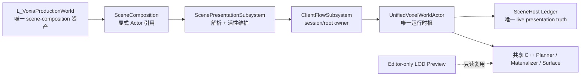
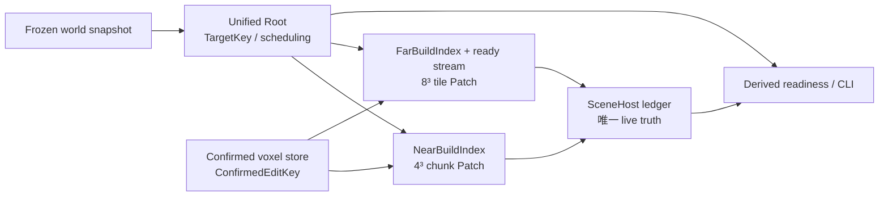
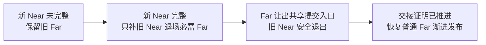

# Voxia 客户端流送与完整 3D LOD 当前事实

> 本文是唯一现役 Voxia 的 Near/Far 流送、完整 XYZ coverage、presentation ownership、
> 移动加载与 confirmed edit 呈现真值。历史 Tile handoff 证据不定义当前架构。

## 当前结论

- 唯一正式 scene-composition 入口是
  `/Game/Voxia/Maps/L_VoxiaProductionWorld`；只有场景绑定 ready 后才由 Flow 动态创建一个
  `AVoxiaUnifiedVoxelWorldActor`；
- 唯一空间是 canonical XYZ；
- 一个 tile=`7³=343 chunks`；
- 默认 Near=`3³=27 tiles=21³=9261 chunks`；
- Near Patch=`4³ chunks`；
- Far Patch=`8³ tiles`；
- `UVoxiaVoxelPresentationSceneHost` 的 `PresentationCommitLedger` 是唯一 live presentation truth；
- Online confirmed truth 只来自服务端，离线 Phase 2 truth 只来自 session-local Mock authority；
- baseline/H/manifest/hash/diff chain 不可信时拒绝入场，不使用运行时快照自愈；
- Web/Bevy 归档，不进入现役完成度或验证。

## 作者态场景与运行时世界边界

`L_VoxiaProductionWorld` 直接保存并显式引用 UDS、UDW、雾、后处理、四灯补光 Rig 和
editor-only 体素 LOD 预览。美术可以在 Outliner、Components 与 Details 中选择和调整这些
对象；`AVoxiaClientGameMode` 不再扫描、销毁或用代码生成环境。


```mermaid
flowchart LR
    Map["L_VoxiaProductionWorld\n唯一 scene-composition 资产"]
    Composition["SceneComposition\n显式 Actor 引用"]
    Scene["ScenePresentationSubsystem\n解析 + 活性维护"]
    Flow["ClientFlowSubsystem\nsession/root owner"]
    Root["UnifiedVoxelWorldActor\n唯一运行时根"]
    Preview["Editor-only LOD Preview"]
    Core["共享 C++ Planner / Materializer / Surface"]
    Host["SceneHost Ledger\n唯一 live presentation truth"]

    Map --> Composition --> Scene --> Flow --> Root --> Host
    Preview -.只读复用.-> Core
    Root --> Core
```

三种“真值”不得混淆：

- scene-composition truth 是新关卡及其显式绑定，只决定作者环境与 root 是否允许启动；
- confirmed world truth 仍只来自服务端（离线开发仅允许显式 Mock/WorldGen adapter）；
- editor preview 是可丢弃表现，不进入 confirmed store、cook、root readiness 或 SceneHost
  ledger。

旧 `Lvl_NearWindow` 已降为显式 `-VoxiaHeadlessEnvironment` /
`-VoxiaSceneProbe` 的 probe/compatibility 资产；无显式诊断参数会以
`legacy_production_map_retired` 拒绝。正式 runtime root 不保存进地图，仍由
`UVoxiaClientFlowSubsystem` 按 session 生命周期唯一生成和销毁。

当前 Patch-diff 无空洞改造已经完成核心代码、Development build、完整 Automation、原水平
Null-RHI 复现往返和竖直 Null/Real-RHI 针对性路线；发布级全方向至少 10 Tile、Relocate、
5 分钟以上资源平台、长稳与更多硬件尚未刷新，因此本轮只写成针对性修复闭环，不写成全部
发布门禁关闭。

## 唯一 Target 与 Owner

Root 只发布：

```text
FVoxiaPatchTargetKey {
  world_snapshot_id
  source_fingerprint
  desired_window_serial
  center_tile_xyz
  near_radius_tiles
}
```

confirmed voxel 更新使用独立 `FVoxiaConfirmedEditKey`，不会改变窗口 TargetKey，也不会给无关
Patch 改写 generation。

所有权：

- `AVoxiaUnifiedVoxelWorldActor`：TargetKey、调度、派生 readiness、loading；
- `AVoxiaWorldActor`：Near chunk CPU mesh/cache 与 NearBuildIndex；
- `AVoxiaPure3DVoxelWorldActor`：Far page/residency/artifact 与 FarBuildIndex；
- `UVoxiaVoxelPresentationSceneHost`：唯一 live PatchVersion、exact ownership、boundary、
  seam、component 与 fence；
- `UVoxiaConfirmedWorldSubsystem`：唯一 confirmed mirror；
- `UVoxiaWorldIntentSubsystem`：intent ledger 与 authority adapter。

Root、NearBuildIndex、FarBuildIndex 都不得保存可写 live Patch/ownership 镜像。


```mermaid
flowchart LR
    Snapshot["Frozen world snapshot"]
    Root["Unified Root\nTargetKey / scheduling"]
    Confirmed["Confirmed voxel store\nConfirmedEditKey"]
    Near["NearBuildIndex\n4³ chunk Patch"]
    Far["FarBuildIndex + ready stream\n8³ tile Patch"]
    Host["SceneHost ledger\n唯一 live truth"]
    Proof["Derived readiness / CLI"]

    Snapshot --> Root
    Root --> Near
    Root --> Far
    Confirmed --> Near
    Confirmed --> Far
    Near --> Host
    Far --> Host
    Host --> Proof
    Root --> Proof
```

## Near 流

玩家进入新 tile 时，Transport 立即发布新的 required Near 窗口与单调 target serial，
不等待 9261 chunks 全部加载。

`FVoxiaNearMesherStencil` 是 freeze、fingerprint 与 invalidation 的唯一 stencil：

- changed Chunk 固定影响 `3³=27` 个 mesh targets；
- 固定 source closure=`5³=125 chunks`；
- 映射到 `4³` Patch 网格最多命中 `2³=8` 个 Patch。

移动时，一个 Near Patch 的 exact owned chunks、CPU mesh 与合法 source 齐备后立即构造
`FVoxiaNearPatchVersion` 并提交，不等待完整 Tile。target source 尚未到达是事件驱动 Waiting；
planner 已完成仍缺 source 是 Fatal。

confirmed edit 不做客户端乐观预测：

1. 点击只发 intent；
2. 服务端/Mock authority 更新 confirmed store；
3. 产生 `FVoxiaConfirmedEditKey`；
4. 固定 stencil 映射出的 1–8 Patch ready 后作为一个 batch 原子提交；
5. receipt 匹配 edit key 与全部 PatchVersion 后才 presented。

## Far 流

Far 保留 canonical cube-shell、H-gated provider、page diff/residency、source-bound
material/surface/lighting cache、cooperative cancellation 与唯一 build 调度线程。当前
Target 的 Required provider/surface work 使用正常并行容量；单 worker/逐帧 pacer 只允许未来
Speculative 队列使用，不能套在当前必需加载上。

`FVoxiaFarPatchBuildStream` 移除完整 build-result 发布门槛：

1. builder 完成全部 target metadata、dependency fingerprint 与 boundary profile；
2. 一次性发布完整 target plan；
3. 按离目标中心最近、坐标稳定排序逐 Patch 构建 mesh；
4. 每完成一个 Patch 立即发布 stream item；
5. GameThread 收到后立即提交；
6. 完整 `FVoxiaWorldGenVoxelShellBuildResult` 结束后只归档 residency、artifact cache、
   coverage/observation generation。

因此 first Far Patch 不等待完整 Far target 或整次 BuildFuture。

2026-07-27 深入排查确认：固定 Far Patch 的
`6 face + 12 edge + 8 corner=26` after-images 只能表达 `8³ tiles` 装载盒外框，不能代表
Near/Far 与不同 Far LOD 的真实壳层交界。现役修复方向改为从逐 Tile owner/LOD 相邻关系
推导统一 canonical interface；Patch 只保留构建、缓存、预算和 physical batch 职责。
目标内尚未 live 的邻居、目标永久外侧、Near/Far 和 Far/Far LOD 都先进入同一个 boundary
resolver，同一空间 slot 只能有一个 after-image，禁止临时封口与真实接缝重叠。完整决策见
[真实壳层交界与目标原子发布设计](../../../10-active/voxel-far-field/2026-07-27-voxia-unified-layer-interface-and-target-publication-design.md)。

用户此前实跑确认过 Near/Far 朝内竖墙不可见。现役实现已改为从实际逐 Tile owner/LOD
关系生成 Near/Far 与 Far/Far LOD 的统一 `LayerFace`，并由候选 manifest 独立列出预期；
每个可见 Far Patch 在同一提交中持有自己的精确 coverage/层间墙凭证，目标历史轮换不能
提前撤销它。自动化与连续目标 Null-RHI 已通过，但修复后的 Real-RHI 用户可见复验尚未完成，
因此仍不能只凭 canonical slot、boundary batch、已注册组件或覆盖计数宣布视觉关闭。
层间面是否生成不受 `8³` Far Patch 网格限制；跨 Patch 的 Near/Far 面固定由实际 Far
一侧发布，Far/Far LOD 面固定由负方向一侧发布。交接期保留的旧 Near 只进入覆盖保护区，
不得进入新目标 owner/LOD 图并移动真实接缝位置。
每个边界采样另外携带独立 `owned` 位：`material=0` 只表示已确认空气，`owned=false`
才表示该采样已由 Near 或其他层接管。所有权切口允许从实体侧闭合；真实自然空气仍执行
严格表面合同。

## 固定可见事务

生产只允许：

```text
NearMoveCommit = 1 NearPatchVersion + exact ownership + seam
NearEditCommit = 1..8 NearPatchVersion + exact ownership + seam
FarPatchCommit = 1 FarPatchVersion + 26 outer boundary slots
               + actual LayerFace after-images + per-live manifest entry
```

SceneHost 在 commit 前验证完整 after-image；commit callback 开始后只做不可失败的同帧切换。
旧资源进入 retirement，并在真实 render fence 后回收。
`scene_host.patch_ownership` 同时公开 `live_layer_interfaces`、
`live_layer_interface_geometry`、`live_cross_patch_layer_interfaces`、
`live_near_far_interfaces` 与 `live_far_lod_interfaces`，用于直接核对真实层间面是否进入
当前画面，而不是只看外壳槽或组件总数。

固定 Near Patch 编号不等于固定窗口边缘范围。相邻窗口在同一个 Patch 内截取的 chunks
可能不同，因此 Near 构建明确区分两种不可变范围：

- 最终目标范围：精确组成新窗口的 `21³ = 9261 chunks`；
- 过渡可见范围：最终目标范围与该 Patch 当前 live chunks 的并集。

共享 Patch 先按过渡可见范围走完整隐藏准备、归属切换和 render fence。等目标 manifest
中的精确 Far 版本及其真实 renderer receipt 已覆盖旧边缘后，同一条事务管线再把该 Patch
原子收窄到最终目标范围。完全离开目标的旧 Patch 也只在相同 Far 证明成立后移除。
因此新目标完整时允许 Near 暂时拥有多于 9261 个 chunks，但绝不允许少于已承诺的旧、新
可见覆盖；`handoff_complete` 只有在收窄和移除都结束后才成立。

相邻换区的可见发布顺序由 Root 明确维护：


```mermaid
flowchart LR
    Keep["新 Near 未完整<br/>保留旧 Far"]
    Required["新 Near 完整<br/>只补旧 Near 退场必需 Far"]
    Retire["Far 让出共享提交入口<br/>旧 Near 安全退出"]
    Normal["交接证明已推进<br/>恢复普通 Far 渐进发布"]

    Keep --> Required --> Retire --> Normal
```

Far 后台构建不因可见发布暂停而停止。Root 对外区分三个事实：

- `playable`：玩家可以在已证明覆盖和 3-chunk 安全带内继续移动；
- `handoff_complete`：旧 Near 已退出，Near/Far/权威中心及根级画面证明都已推进到新目标；
- `settled`：包括剩余 speculative Far 在内的全部资源完全静止。

## 移动与加载

`FVoxiaPatchTransitionPlan` 只定义：

1. `Bootstrap`：无旧 live，在加载界面中逐 Patch 首显；
2. `AdjacentStep`：每轴差值 `-1/0/1`，先锁存候选；完整 manifest 校验后才发布 TargetKey；
3. `Relocate`：teleport、服务端大幅纠正、新游戏或显式重载。

动作策略：

- AdjacentStep 立即启动 required 加载但保持旧 live TargetKey，并以最后一个完整可见 Near
  窗口作为移动基准；正在准备的一步不会被更远 desired center 覆盖成 Relocate；
- 候选 chunk 在完整 XYZ 任一轴最多离开该窗口 3 chunks；继续向外进入第 4 个 chunk 时
  阻止该次位移；
- 返回窗口或沿边界移动始终允许；判定不读取等待秒数、队列长度或水平面特例；
- Relocate 在目标未收敛时显式阻塞动作并显示加载；
- Fatal 显示可诊断失败，不进入无限 loading；
- 旧 Near 尚未完全退出时不叠加第三个 AdjacentStep。

安全门只读取 SceneHost 的真实 renderer coverage 与最后完整 Near；它不修改流送队列，也不通过
wall clock 自动放行。新目标准备追不上移动时，玩家会停在安全带边缘，画面仍保持闭合。
SceneHost 因此把相邻交接范围沿完整 XYZ 六个面各外扩 3 chunks 纳入核对：稳定窗口核对
`27³`，三轴相邻切换最多核对 `34³`。外扩带必须由每个实际可见 Far 自带的精确 entry 与
真实 renderer receipt 证明，不能把“允许多走三格”实现成盲目放行，也不能依赖只保留
current/previous 两份目标 manifest 的历史假设。

第 4 格先按距离上限拒绝；只有候选仍在前三格保护带内时才检查其可见覆盖。冷启动阻塞加载
期间连续性计数尚未启动；最后完整 Near 与整个保护范围第一次同时干净后才开始逐帧累计，
历史坏帧不能被后续干净帧清零。

## Required 与 Speculative

- Required 有待派发时不启动新 Speculative；
- 在途 Speculative 在最近 chunk/page work-unit 边界 cancel；
- Required 可使用全部 worker/ready/staging 容量；
- Speculative 至少为 Required 保留一个物理槽；
- 相同 PatchVersion promotion，不复制结果；
- Speculative 只进入同一个 build cache，不能直接 visible。

## 容量

容量只从固定空间推导：

- Near stable/单轴/双轴/三轴 target union Patch：
  `216/288/336/368`；
- Near scene-wide component 上限：`2×368×3=2208`；
- Far target Patch 上限：`19³=6859`；
- Far transition PatchId 并集上限：`7886`；
- Far boundary incidence 保守上限：`26×7886=205036`；
- boundary artifact version 保守上限：`410072`。

超过静态合同是实现错误，Development `checkf`、session Fatal。禁止软扩容、动态倍增、
coarse fallback 或逐 Tick retry。

## 失败

内部结果只使用：

- `Ready`：可以继续；
- `Waiting`：等待明确异步输入；
- `Busy`：固定物理槽/fence 被合法占用；
- `Cancelled`：TargetKey/PatchVersion 被替代；
- `Fatal`：确定性输入、合同、资源或实现错误。

同一确定性输入不自动 retry。只有显式 session Retry 销毁并重建生产根。

## 可观测面

- Root：`target_key`、transition kind、required/speculative、`playable`、
  `handoff_complete`、`settled`、Far 可见发布优先级与 failure；
- Near/Far BuildIndex：target/retained/pending/in-flight/ready/fatal；
- Far stream：plan published/consumed、mailbox pending、ready、terminal、consumer failure；
- SceneHost：committed Patch maps、exact ownership、boundary slots、staged/retiring/free、
  fence、gap/overlap/seam/orphan、commit serial，以及从真实 Patch renderer receipt 统计的
  Far 几何可见 Patch 数、Far 组件总数和已注册可见组件数；覆盖证明只增量更新本次事务
  影响的 Patch、接缝与 ownership chunks，并公开完整重建、增量应用和显式回退累计数；
- Flow/Pawn：Relocate loading，以及候选/当前 chunk、完整 Near XYZ 范围、逐轴越界深度、
  renderer epoch、放行/阻止理由与累计计数；
- observe 输出 `.demo/observe/`，64 位身份使用十进制字符串。

现役 CLI：

- `voxel_world_root_state`
- `near_mesh`
- `pure3d_world_state`
- `until_near_patch_idle`
- `client_flow_probe`
- `world intent-status`
- `world macro-inspect`
- `world transaction-inspect`
- `world parity-check`

## 已删除的生产路径

- Near/Far Tile handoff coordinator；
- Near/Far chunk transaction coordinator；
- target latch、queued target 与 wall-clock watchdog；
- dynamic ownership atlas 扩容与 coarse gate；
- full-window fallback；
- no-far/Pure3DFarPending ownership adapter 与 sink 热换绑；
- receipt generation relabel 与零身份补值；
- deterministic completion repair/auto retry；
- legacy far runtime、production probe、旧 XZ identity/uploader；
- whole-generation Far mesh 可见提交门槛。

archive decoder/golden fixture 可以保留，但不得进入 production presentation owner。

## 验证状态

2026-07-27 新鲜证据：

- UE 5.8 Development build 成功；
- 完整 `Automation RunTests Voxia` 为
  `161 Success + 2 expected warnings = 163/163`，失败与未运行均为 `0`；
- 原水平复现点的 Null-RHI 往返已经完成交接期 confirmed break/place 两个子路由；
  这两个子路由的 `40` 个采样及同次执行在后续路线停止前累计的 `320` 个采样中，
  gap/overlap/orphan 与受保护失败帧均为 `0`，过渡 Near 最多保留 `12348` chunks，
  交接完成后精确回到 `9261`；
- Null-RHI 地面→全空气 Near→下降路线有 `1010` 个逐帧样本，最多 `5560` 个受保护帧；
  最终 Real-RHI 同路线有 `70` 个结构化采样，保护范围累计到 `8821` 帧；两者所有
  gap/overlap/orphan 及受保护失败帧均为 `0`；
- 高空完整 Near 为 `216 VerifiedEmpty / 0 GeometryReady`，仍有 `10` 个 Far 几何 Patch、
  `84` 个已注册可见组件；最终 Real-RHI 复跑进一步记录为 `66` 个 Far 几何 Patch、
  `225` 个已注册可见组件；下降后 Near 几何重新出现。两条路线的 retry、新游戏、clean exit
  与 Far release `3/3/0` 均通过。
- 独立移动安全门路线记录 `29` 个覆盖采样：前三格可进入、第四格被阻止、沿边界和返回
  均放行；保护帧从 `14117` 增至 `40523`，失败计数仍全部为 `0`。

发布级 closeout 仍要求：

- 完整全方向、连续至少 10 Tile、快速折返与 Relocate；
- first Near/Far Patch 不等完整 Tile/target 的更广路线时序证据；
- 5 分钟以上固定资源平台、发布硬件矩阵与长稳；
- 广路线当前在后续 `diagonal_yz` 处暴露一项独立的 canonical 外露材质覆盖失败；已完成的
  水平交接样本没有空洞，但整条广路线不能记为通过；
- Real-RHI 单 Tile 性能路线的无空洞计数通过，但新 Patch 发布下 frame p95=`17.378ms`、
  GameThread p95=`11.088ms`，尚未通过严格性能门。

上述剩余项不改变当前无空洞提交合同，也不得用针对性水平/竖直路线冒充已执行。

## 相关文档

- [Patch diff 流送设计](../../../10-active/voxel-far-field/2026-07-25-voxia-patch-diff-streaming-design.md)
- [无空洞 Near/Far 呈现设计](../../../10-active/voxel-far-field/2026-07-26-voxia-hole-free-near-far-presentation-design.md)
- [真实壳层交界与目标原子发布设计](../../../10-active/voxel-far-field/2026-07-27-voxia-unified-layer-interface-and-target-publication-design.md)
- [纯 3D 体素壳主线](../../../10-active/voxel-far-field/2026-07-12-pure-3d-voxel-shell-migration.md)
- [Far LOD 材质语义修复](../../../10-active/voxel-far-field/2026-07-23-far-lod-surface-material-semantic-repair.md)
- [系统正交](../../../30-reference/overview/2026-06-27-架构设计指导思想-系统正交.md)
