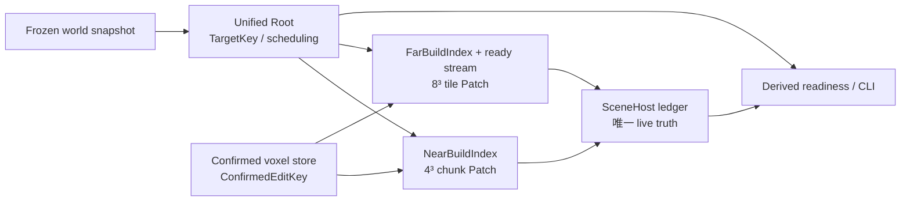

# Voxia 客户端流送与完整 3D LOD 当前事实

> 本文是唯一现役 Voxia 的 Near/Far 流送、完整 XYZ coverage、presentation ownership、
> 移动加载与 confirmed edit 呈现真值。历史 Tile handoff 证据不定义当前架构。

## 当前结论

- 唯一正式入口创建一个 `AVoxiaUnifiedVoxelWorldActor`；
- 唯一空间是 canonical XYZ；
- 一个 tile=`7³=343 chunks`；
- 默认 Near=`3³=27 tiles=21³=9261 chunks`；
- Near Patch=`4³ chunks`；
- Far Patch=`8³ tiles`；
- `UVoxiaVoxelPresentationSceneHost` 的 `PresentationCommitLedger` 是唯一 live presentation truth；
- Online confirmed truth 只来自服务端，离线 Phase 2 truth 只来自 session-local Mock authority；
- baseline/H/manifest/hash/diff chain 不可信时拒绝入场，不使用运行时快照自愈；
- Web/Bevy 归档，不进入现役完成度或验证。

当前 Patch-diff 改造已经完成核心代码、Development build 与定向自动化；完整 Automation、
Null-RHI、Real-RHI 连续移动和长稳证据正在刷新，因此本轮尚不写成最终 closeout。

## 唯一 Target 与 Owner

Root 只发布：

```text
FVoxiaPatchTargetKey {
  world_snapshot_id
  source_fingerprint
  desired_window_serial
  center_tile_xyz
  near_radius_tiles
}
```

confirmed voxel 更新使用独立 `FVoxiaConfirmedEditKey`，不会改变窗口 TargetKey，也不会给无关
Patch 改写 generation。

所有权：

- `AVoxiaUnifiedVoxelWorldActor`：TargetKey、调度、派生 readiness、loading；
- `AVoxiaWorldActor`：Near chunk CPU mesh/cache 与 NearBuildIndex；
- `AVoxiaPure3DVoxelWorldActor`：Far page/residency/artifact 与 FarBuildIndex；
- `UVoxiaVoxelPresentationSceneHost`：唯一 live PatchVersion、exact ownership、boundary、
  seam、component 与 fence；
- `UVoxiaConfirmedWorldSubsystem`：唯一 confirmed mirror；
- `UVoxiaWorldIntentSubsystem`：intent ledger 与 authority adapter。

Root、NearBuildIndex、FarBuildIndex 都不得保存可写 live Patch/ownership 镜像。


```mermaid
flowchart LR
    Snapshot["Frozen world snapshot"]
    Root["Unified Root\nTargetKey / scheduling"]
    Confirmed["Confirmed voxel store\nConfirmedEditKey"]
    Near["NearBuildIndex\n4³ chunk Patch"]
    Far["FarBuildIndex + ready stream\n8³ tile Patch"]
    Host["SceneHost ledger\n唯一 live truth"]
    Proof["Derived readiness / CLI"]

    Snapshot --> Root
    Root --> Near
    Root --> Far
    Confirmed --> Near
    Confirmed --> Far
    Near --> Host
    Far --> Host
    Host --> Proof
    Root --> Proof
```

## Near 流

玩家进入新 tile 时，Transport 立即发布新的 required Near 窗口与单调 target serial，
不等待 9261 chunks 全部加载。

`FVoxiaNearMesherStencil` 是 freeze、fingerprint 与 invalidation 的唯一 stencil：

- changed Chunk 固定影响 `3³=27` 个 mesh targets；
- 固定 source closure=`5³=125 chunks`；
- 映射到 `4³` Patch 网格最多命中 `2³=8` 个 Patch。

移动时，一个 Near Patch 的 exact owned chunks、CPU mesh 与合法 source 齐备后立即构造
`FVoxiaNearPatchVersion` 并提交，不等待完整 Tile。target source 尚未到达是事件驱动 Waiting；
planner 已完成仍缺 source 是 Fatal。

confirmed edit 不做客户端乐观预测：

1. 点击只发 intent；
2. 服务端/Mock authority 更新 confirmed store；
3. 产生 `FVoxiaConfirmedEditKey`；
4. 固定 stencil 映射出的 1–8 Patch ready 后作为一个 batch 原子提交；
5. receipt 匹配 edit key 与全部 PatchVersion 后才 presented。

## Far 流

Far 保留 canonical cube-shell、H-gated provider、page diff/residency、source-bound
material/surface/lighting cache、cooperative cancellation 与唯一 build 调度线程。当前
Target 的 Required provider/surface work 使用正常并行容量；单 worker/逐帧 pacer 只允许未来
Speculative 队列使用，不能套在当前必需加载上。

`FVoxiaFarPatchBuildStream` 移除完整 build-result 发布门槛：

1. builder 完成全部 target metadata、dependency fingerprint 与 boundary profile；
2. 一次性发布完整 target plan；
3. 按离目标中心最近、坐标稳定排序逐 Patch 构建 mesh；
4. 每完成一个 Patch 立即发布 stream item；
5. GameThread 收到后立即提交；
6. 完整 `FVoxiaWorldGenVoxelShellBuildResult` 结束后只归档 residency、artifact cache、
   coverage/observation generation。

因此 first Far Patch 不等待完整 Far target 或整次 BuildFuture。

Far/Far 边界由全局 canonical SlotId 唯一拥有。一个 Far transaction 只提交一个 Patch 与固定
`6 face + 12 edge + 8 corner=26` slot after-images。目标内尚未 live 的邻居使用临时闭合 wall，
目标外侧使用永久 outer wall；邻 Patch 后续替换同一个 SlotId。邻 profile 只读，不加入事务，
不存在依赖闭包或运行时扩散。

## 固定可见事务

生产只允许：

```text
NearMoveCommit = 1 NearPatchVersion + exact ownership + seam
NearEditCommit = 1..8 NearPatchVersion + exact ownership + seam
FarPatchCommit = 1 FarPatchVersion + 26 canonical boundary slots + seam
```

SceneHost 在 commit 前验证完整 after-image；commit callback 开始后只做不可失败的同帧切换。
旧资源进入 retirement，并在真实 render fence 后回收。

## 移动与加载

`FVoxiaPatchTransitionPlan` 只定义：

1. `Bootstrap`：无旧 live，在加载界面中逐 Patch 首显；
2. `AdjacentStep`：每轴差值 `-1/0/1`，立即发布 TargetKey；
3. `Relocate`：teleport、服务端大幅纠正、新游戏或显式重载。

动作策略：

- AdjacentStep 永不因 outside depth、等待秒数或队列长度阻塞动作；
- 一个 tile 单轴有 7 chunks，required 加载在进入新 tile 时已经提前启动；
- Relocate 在目标未收敛时显式阻塞动作并显示加载；
- Fatal 显示可诊断失败，不进入无限 loading；
- outside depth 保留为 CLI 观察数据，不能决定策略。

若下一 AdjacentStep 到来时旧 live 已超出固定相邻 union，是 Required 吞吐/活性合同失败；
应进入 Fatal 并修复根因，不扩大 atlas、不猜第三 previous center、不切 full-window fallback。

## Required 与 Speculative

- Required 有待派发时不启动新 Speculative；
- 在途 Speculative 在最近 chunk/page work-unit 边界 cancel；
- Required 可使用全部 worker/ready/staging 容量；
- Speculative 至少为 Required 保留一个物理槽；
- 相同 PatchVersion promotion，不复制结果；
- Speculative 只进入同一个 build cache，不能直接 visible。

## 容量

容量只从固定空间推导：

- Near stable/单轴/双轴/三轴 target union Patch：
  `216/288/336/368`；
- Near scene-wide component 上限：`2×368×3=2208`；
- Far target Patch 上限：`19³=6859`；
- Far transition PatchId 并集上限：`7886`；
- Far boundary incidence 保守上限：`26×7886=205036`；
- boundary artifact version 保守上限：`410072`。

超过静态合同是实现错误，Development `checkf`、session Fatal。禁止软扩容、动态倍增、
coarse fallback 或逐 Tick retry。

## 失败

内部结果只使用：

- `Ready`：可以继续；
- `Waiting`：等待明确异步输入；
- `Busy`：固定物理槽/fence 被合法占用；
- `Cancelled`：TargetKey/PatchVersion 被替代；
- `Fatal`：确定性输入、合同、资源或实现错误。

同一确定性输入不自动 retry。只有显式 session Retry 销毁并重建生产根。

## 可观测面

- Root：`target_key`、transition kind、required/speculative、derived readiness/failure；
- Near/Far BuildIndex：target/retained/pending/in-flight/ready/fatal；
- Far stream：plan published/consumed、mailbox pending、ready、terminal、consumer failure；
- SceneHost：committed Patch maps、exact ownership、boundary slots、staged/retiring/free、
  fence、gap/overlap/seam/orphan、commit serial；
- Flow/Pawn：Relocate loading 与 movement blocked；
- observe 输出 `.demo/observe/`，64 位身份使用十进制字符串。

现役 CLI：

- `voxel_world_root_state`
- `near_mesh`
- `pure3d_world_state`
- `until_near_patch_idle`
- `client_flow_probe`
- `world intent-status`
- `world macro-inspect`
- `world transaction-inspect`
- `world parity-check`

## 已删除的生产路径

- Near/Far Tile handoff coordinator；
- Near/Far chunk transaction coordinator；
- target latch、queued target 与 wall-clock watchdog；
- dynamic ownership atlas 扩容与 coarse gate；
- full-window fallback；
- no-far/Pure3DFarPending ownership adapter 与 sink 热换绑；
- receipt generation relabel 与零身份补值；
- deterministic completion repair/auto retry；
- legacy far runtime、production probe、旧 XZ identity/uploader；
- whole-generation Far mesh 可见提交门槛。

archive decoder/golden fixture 可以保留，但不得进入 production presentation owner。

## 验证状态

本轮最新已完成：

- UE 5.8 Development build；
- `Voxia.Gameplay.FarPatchBuildStream`；
- Near required-target 与 streaming policy 定向自动化。

最终 closeout 仍要求：

- 完整 `Automation RunTests Voxia`；
- Node `scripts/*.test.js`；
- Phase 1/2 Null-RHI；
- Real-RHI ±XYZ、连续至少 10 Tile、快速折返、Relocate；
- first Near/Far Patch 不等完整 Tile/target 的时序证据；
- 固定资源平台、gap/overlap/seam/orphan=0 与长稳。

## 相关文档

- [Patch diff 流送设计](../../../10-active/voxel-far-field/2026-07-25-voxia-patch-diff-streaming-design.md)
- [纯 3D 体素壳主线](../../../10-active/voxel-far-field/2026-07-12-pure-3d-voxel-shell-migration.md)
- [Far LOD 材质语义修复](../../../10-active/voxel-far-field/2026-07-23-far-lod-surface-material-semantic-repair.md)
- [系统正交](../../../30-reference/overview/2026-06-27-架构设计指导思想-系统正交.md)
