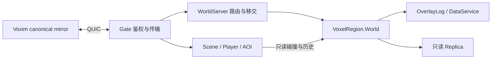

# Voxim 当前运行时边界

本文是 Global system 的实现索引。Voxim 为同级主客户端；Voxia、旧 ChunkProcess/FieldRuntime 和旧 launcher/pages 专题是 reference/legacy，不用于判断 Voxim 是否已联网。

## 当前事实

- `VoxelRegion.Application` 在配置 root/manifest 后先完成 Bake，再启动唯一 `VoxelRegion.World`。canonical 真值来自 GeneratedStore 的显式生成基底与 OverlayLog 持久化事务；World 拥有材料、库存、损伤、热、燃烧、相变与电路的读取和提交。只读 `Replica` 消费权威结果，缺失不能变为第二真值。
- `WorldServer` 提供 Scene/World 路由与受控移交编排；`SceneServer.Movement.Scene`、`Player` 与 `Replication` 分别维护场景成员、每玩家移动/碰撞历史与 AOI。它们从 canonical World 或本地只读副本构建碰撞派生物，不拥有第二份可写体素世界。
- `GateServer.Transport.QuicListener` 与 `Session.QuicConnection` 是当前正式网络入口。Hello/Join、鉴权、身份 epoch、Ready、可靠流与 DATAGRAM 都已有实现；`config/runtime.exs` 默认 `VOXIM_TRANSPORT=voxim_quic`，旧 TCP/WS 必须显式选择 `legacy_reference`，没有自动降级。
- `MmoContracts.Session`、`Movement` 与 `Voxel` 是当前字节契约。CanonicalBootstrap 的完整 L0 payload 进入客户端既有 canonical 管线；规定 L0 驻留、初始 collider 和同 T/N/R 的 TimelineFence 接纳完成后才发 Ready。

## 活跃兼容边界

旧 `SceneServer.Voxel.ChunkProcess`、`ChunkDirectory`、`FieldRuntime`、`FieldTickWorker` 仍服务旧协议、局部场与相关回归。保留它们的 owner、事务和只读接口，不按文件大小删除活调用；不得把这些旧 owner 描述为 Voxim canonical owner，也不得把旧状态作为 Voxim 缺失数据的兜底。退出条件是对应真实调用方完成迁移后再删除，不能仅凭主客户端已切 QUIC 推定整个 legacy 链路失活。

## 证据源与验收边界

- 源码组合配置：根 `config/runtime.exs`；`voxel_region`、`scene_server`、`gate_server` 各自 `Application`。分发包装组合这些全局系统，测试入口不成为运行时依赖。
- [M1 路线与验收入口](../../../../../Voxim/Docs/M1/plan.md)：bootstrap/Ready、移动与真实双客户端已实施；早期 G1 只抽字节 owner 的“待实施”记录不代表当前运行时。
- [M4a 验收](../../../../../Voxim/Docs/M4a/acceptance.md)：两 Scene、本地 Replica、并发编辑历史与真实双端受控移交已验收。同主机多 VM 的结果不能扩为跨主机时钟与故障接管验收。
- [R7 工程审计](../../../../../Voxim/Docs/R7/Engineering-audit-2026-09-19.md)：本轮整改、测试、Linux/CI 与分发剩余事项。单测、已有 Demo 与当前版本分发验收分别记录。

本轮已有本地 Linux QUIC `42 tests, 0 failures`，命令为在 `apps/gate_server` 执行
`mix test test/gate_server/quic_connection_test.exs --no-start --seed 0`，使用生成的 TLS 证书和
`VOXIM_TEST_QUIC_PORT=28443`。它覆盖真实传输与明确标注的回调组件测试，不替代双 UE 客户端验收。
原始脚本、日志和退出码在同级 Voxim `Saved/EngineeringAudit/20260919/ci-quic-linux*`，
是当次工作树的证据，后续变更按影响范围验证。

GitHub Actions 已启用且可访问；现有成功运行 `35415719776` 对应远端基线
`4c60f3a752f33645f175e7b212f51aeae56b8d80`，不覆盖本轮本地提交及未提交修改。
CI 仅由 push/pull_request 触发，没有 workflow_dispatch；未推送的整改不能声称通过远程 CI。

Qinglan 本地 Development BuildCookRun 已成功，原 IoStore 清单包含唯一项目地图 `L_Qinglan`，
也暴露了旧 B1 目录间接带入的 `/Game/Voxel/R7/B1/DA_TestAssembly`。
已通过 Unreal MCP 将 Qinglan 改接现行 Global system `DA_MaterialCoverageV1`（`5f79a057…`），
保存后回读确认移除 B1 目录依赖。修改后的 BuildCookRun 与 IoStore 列表均返回 0：
唯一项目地图仍是 Qinglan，新全局目录在包内，B1 目录与 TestAssembly 均不在包内；
已检查的测试 Actor/HUD、路线命令和人工延迟字段未出现在新包程序中。
证据为同级 Voxim `Saved/EngineeringAudit/20260919/qinglan-cook-fixed.log`、
`qinglan-iostore-fixed.csv`、`qinglan-cook-check.json` 与 `qinglan-asset-*.json`。
同版本镜像与打包客户端冒烟、最终分发版本清单和发布仍未完成；本地 cook 不代表已发布或通过分发验收。

被取代的结论是“M1 authority/QUIC/bootstrap 尚未实施”和“Scene/ChunkProcess 是 Voxim 体素 owner”。旧日期档案保留其历史上下文；现行索引以本页和上述实现/验收源为准。
