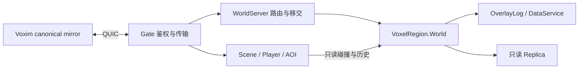

# Voxim 当前运行时边界

本文是 Global system 的实现索引。Voxim 为同级主客户端；Voxia、旧 ChunkProcess/FieldRuntime 和旧 launcher/pages 专题是 reference/legacy，不用于判断 Voxim 是否已联网。

## 当前事实

- `World.material_supply(server, cid, supply_id, %{material_id => integer_units})` 是 server-only 作者供给入口，未接 Gate。每角色/来源 ID 只授予一次，返回原 `{:ok, seq}` 的重试不会补料；来源、精确数量、相态焓与完整度和余额同笔持久化，日志重放与 compact 都保留收据。数量由作者资产/调用者指定；液相温度不低于转变点，固相不高于转变点，外部相态量/焓进入既有 `phase_authored_units` / `phase_authored_energy_j` 账。普通消费仍走原建造/工具事务。
- `publish_parameters` 允许修改液体 `side_threshold_units`（缺省 0），其他液体参数约束保持不变；改变阈值会唤醒现存液体并持久化工作集。发布新目录仍须将该版本作为下次启动的 `property_catalog_path`，与既有属性目录升级契约相同。即使没有属性实例，实际目录变化也追加事务。
- 上述局部集成验证使用独立 World、真实公开供给/交易入口及文件持久化；供给恢复还经过正式数据库元数据编解码，source/player 为显式替身。复跑：在 `apps/voxel_region` 执行 `MMO_DB_PORT=5433 mix test --no-start test/phase_world_test.exs test/liquid_world_test.exs test/parameter_publication_test.exs`。它证明精确增量、消费后幂等、重启/压实及阈值唤醒，不替代 Demo 双客户端验收。

- `VoxelRegion.Application` 在配置 root/manifest 后先完成 Bake，再启动唯一 `VoxelRegion.World`。canonical 真值来自 GeneratedStore 的显式生成基底与 OverlayLog 持久化事务；World 拥有材料、库存、损伤、热、燃烧、相变与电路的读取和提交。只读 `Replica` 消费权威结果，缺失不能变为第二真值。
- `WorldServer` 提供 Scene/World 路由与受控移交编排；`SceneServer.Movement.Scene`、`Player` 与 `Replication` 分别维护场景成员、每玩家移动/碰撞历史与 AOI。它们从 canonical World 或本地只读副本构建碰撞派生物，不拥有第二份可写体素世界。
- `GateServer.Transport.QuicListener` 与 `Session.QuicConnection` 是当前正式网络入口。Hello/Join、鉴权、身份 epoch、Ready、可靠流与 DATAGRAM 都已有实现；`config/runtime.exs` 默认 `VOXIM_TRANSPORT=voxim_quic`，旧 TCP/WS 必须显式选择 `legacy_reference`，没有自动降级。
- `MmoContracts.Session`、`Movement` 与 `Voxel` 是当前字节契约。CanonicalBootstrap 的完整 L0 payload 进入客户端既有 canonical 管线；规定 L0 驻留、初始 collider 和同 T/N/R 的 TimelineFence 接纳完成后才发 Ready。

## R8-07 散体增量 1（2026-09-24，分支 `r8-07-loose`，未合并，等客户端 Hello 23 增量）

决策正文见 Voxim `Docs/R8/Design-decisions.md` §4「散体决策 D1–D9」。服务端事实：

- **目录**：材料行 `loose_threshold_units`（整数 0..单格容量）即可倾倒；空气、液体、相态材料、地面花草不可，且须有液体步进参数（`Damage.load`）。可在线新增或调整、不可撤下（`ParameterEvolution`），改动唤醒全部有限格。样本目录 `7b69b79f…` = `b1aca503…` + 沙/煤 5/8 格、砾石/矿/产物 6/8 格。
- **真值**：格有 `liquid_units` 数量记录即散体；天然地形与建造格静止、是墙。`World.finite_volume/2` 是唯一有限体积（q / 容量，无记录为 1），用于最大 HP、热采样与几何、燃烧燃料与功率、转化体积、参数热重标。换了材料而无随笔数量的格删除记录（挖掉、热毁、作者覆盖）。
- **调度**：`advance_liquid` 按活跃邻域里出现的流动材料逐种调用同一 `Liquid.step_transfers`，侧向阈值按材料取；下落帧仍只发液体。散体不导电（D6）。
- **搬运**：格值 `{能量, 完整度, 已烧燃料, 火}` 随通量搬运（`Phase.transport`）；带火流入即燃烧，功率 = 每宏格功率 × 体积；燃料初始化／舀出按显式燃料前后差记 `fuel_initialized_j`／`discarded_fuel_j`，舀出显热记 `removed_j`，入库 `floor(moved × 剩余 / 满燃料)`。
- **意图**：工具 11/12 同时服务液体与散体；细分宏格回 `:needs_macro_opening`（D8）；散体格镐采／拆解回 `:use_liquid_tool`；转化接触按 1/8 m 实占用（下方散体不满 7/8 不接触），产物保留数量。
- **协议**：VXRC（版本 12）允许任何非空气、非细分宏格带数量；液体／相态仍按原版本编码。Hello 22 → 23（客户端增量镜像后合并）。
- 复跑：`apps/voxel_region` 下 `MMO_DB_PORT=5433 mix test test/loose_world_test.exs`（11 项）；本地炉模拟 `mix test test/loose_furnace_sim_test.exs --only sim`；100 m³ 倾倒 `mix test test/loose_pour_benchmark_test.exs --only benchmark`。只证明服务端范围，不代替双客户端实跑。

## 魔法增量 1：取能与远程点火（2026-09-25，分支 `magic-inc1`，未合并，等客户端 Hello 24 增量）

设计正文见 Voxim `Docs/Magic.md` §2、§4、§10。服务端事实：

- **目录**：`VoxelRegion.Magic.Catalog` 读取部署的魔法目录（app env / World opt `:magic_catalog_path`，部署同属性目录：UE `DA_MagicCatalogV1` Publish 的 `Content/Voxel/Magic/Published/<sha256>.json` 拷进服务端并在 entry 里 `put_env`），digest = 文件字节 sha256；只接受已实现动词 `energy.draw`、`act.heat`。有魔法目录的世界必须有热环境。
- **程序与成本**：`Magic.Program` 在信任边界解析 JSON IR（增量 1 只接受 aim / at_target / 1 步，失败一律 `:invalid_program`）；`Magic.Cost` 是成本、相干度、走火、取能分账的唯一实现，报价与施放共用。取能的控制开销从取得的能量里付（可支付 = 余额 + η·ΔE）。
- **真值**：施法者能量 `caster_energy`（cid ⇒ J）在 World，与蓄能石 `stored_j` 同一笔事务原子改变，随日志（`caster_energy` 增量）与检查点持久化，不自动回复。施法的热只经 `thermal.sources` 有限热源进世界：`act.heat` 在目标宏格建源（功率 = 槽 `power_w`，已有源拒 `heat_source_busy`）；控制开销、走火支出、取能损耗以 能量/0.5 s 的功率落脚下宏格／石格（同格并入）。
- **校验**（不扣能量）：施法间隔（同工具 GCRA，`cast_too_soon`）→ 眼睛射线 30 m 首个命中须为请求目标（`stale_target`）、格心距眼 ≤ 6 m（`out_of_domain`，无命中同）→ 脚下宏格须为带热容的未细分宏格（`no_footing`）→ 动词对象（`invalid_target`）→ 目标格与脚下宏格 `Protection.permitted?`（`protected_region`）。
- **账**（`thermal_accounting`）：`caster_drawn_j`、`draw_loss_j`、`cast_waste_j`、`spell_heat_j`；石减少 = caster_drawn_j + draw_loss_j，施法支出 = spell_heat_j + cast_waste_j。
- **协议**：上行 0x82 `voxel_spell_intent`、下行 0x83 `voxel_caster_state`（`MmoContracts.Voxel.Codec`，冻结样本 `magic_wire_test.exs`）；施放与走火回 0x68 accepted（reason `ok`／`misfire_energy`／`misfire_coherence`），拒绝回 0x68 rejected。QUIC 接纳 0x76 时经编辑 worker 下发一次 0x83。Hello 23 → 24。
- 复跑：`apps/voxel_region` 下 `mix test --no-start test/magic_test.exs test/magic_world_test.exs`；`apps/mmo_contracts` 下 `mix test test/mmo_contracts/magic_wire_test.exs`；`apps/gate_server` 下 `mix test --no-start test/gate_server/voxim_spell_dispatch_test.exs`。只证明服务端范围，不代替双客户端实跑。

## 活跃兼容边界

旧 `SceneServer.Voxel.ChunkProcess`、`ChunkDirectory`、`FieldRuntime`、`FieldTickWorker` 仍服务旧协议、局部场与相关回归。保留它们的 owner、事务和只读接口，不按文件大小删除活调用；不得把这些旧 owner 描述为 Voxim canonical owner，也不得把旧状态作为 Voxim 缺失数据的兜底。退出条件是对应真实调用方完成迁移后再删除，不能仅凭主客户端已切 QUIC 推定整个 legacy 链路失活。

## 证据源与验收边界

- 源码组合配置：根 `config/runtime.exs`；`voxel_region`、`scene_server`、`gate_server` 各自 `Application`。分发包装组合这些全局系统，测试入口不成为运行时依赖。
- [M1 路线与验收入口](../../../../../Voxim/Docs/M1/plan.md)：bootstrap/Ready、移动与真实双客户端已实施；早期 G1 只抽字节 owner 的“待实施”记录不代表当前运行时。
- [M4a 验收](../../../../../Voxim/Docs/M4a/acceptance.md)：两 Scene、本地 Replica、并发编辑历史与真实双端受控移交已验收。同主机多 VM 的结果不能扩为跨主机时钟与故障接管验收。
- [R7 工程审计](../../../../../Voxim/Docs/R7/Engineering-audit-2026-09-19.md)：本轮整改、测试、Linux/CI 与分发剩余事项。单测、已有 Demo 与当前版本分发验收分别记录。

本轮已有本地 Linux QUIC `42 tests, 0 failures`，命令为在 `apps/gate_server` 执行
`mix test test/gate_server/quic_connection_test.exs --no-start --seed 0`，使用生成的 TLS 证书和
`VOXIM_TEST_QUIC_PORT=28443`。它覆盖真实传输与明确标注的回调组件测试，不替代双 UE 客户端验收。
原始脚本、日志和退出码在同级 Voxim `Saved/EngineeringAudit/20260919/ci-quic-linux*`，
是当次工作树的证据，后续变更按影响范围验证。

GitHub Actions 已启用且可访问；现有成功运行 `35415719776` 对应远端基线
`4c60f3a752f33645f175e7b212f51aeae56b8d80`，不覆盖本轮本地提交及未提交修改。
CI 仅由 push/pull_request 触发，没有 workflow_dispatch；未推送的整改不能声称通过远程 CI。

Qinglan 本地 Development BuildCookRun 已成功，原 IoStore 清单包含唯一项目地图 `L_Qinglan`，
也暴露了旧 B1 目录间接带入的 `/Game/Voxel/R7/B1/DA_TestAssembly`。
已通过 Unreal MCP 将 Qinglan 改接现行 Global system `DA_MaterialCoverageV1`（`5f79a057…`），
保存后回读确认移除 B1 目录依赖。修改后的 BuildCookRun 与 IoStore 列表均返回 0：
唯一项目地图仍是 Qinglan，新全局目录在包内，B1 目录与 TestAssembly 均不在包内；
已检查的测试 Actor/HUD、路线命令和人工延迟字段未出现在新包程序中。
证据为同级 Voxim `Saved/EngineeringAudit/20260919/qinglan-cook-fixed.log`、
`qinglan-iostore-fixed.csv`、`qinglan-cook-check.json` 与 `qinglan-asset-*.json`。
同版本镜像与打包客户端冒烟、最终分发版本清单和发布仍未完成；本地 cook 不代表已发布或通过分发验收。

被取代的结论是“M1 authority/QUIC/bootstrap 尚未实施”和“Scene/ChunkProcess 是 Voxim 体素 owner”。旧日期档案保留其历史上下文；现行索引以本页和上述实现/验收源为准。

## P0 下落展示事务（2026-09-20，实施中）

Global system。依据当前 `Liquid.step_transfers` 的重力阶段通量、`World.apply_batch` 的同步追加后广播、
`PropertyObservation` 窗口投影与 `LogProjection` 源码，复用既有单向不可变事务；物理模型依据仍是
Liquid 模块引用的 Forsyth 格点水量模型，不增加速度或第二份数量真值。
Hello14 的事务粗格数组后可追加 `tag:u8=1, material:u16 LE, count:u32 LE, count * {x,y,z:i32 LE}`。
无尾段不更新展示；尾段是该材料本步所有实际重力目的格（排序去重），空数组清除旧帧。
World 只保留上一帧以在停止时清除一次；非空帧每个活跃步都发送，新订阅者下一步即得到完整帧。
净数量不变但展示有变化仍走正常 seq、日志提交和 canonical fanout，清除不产生几何／碰撞改动。
该字段仅用于实时展示，在追加持久化及内存历史正文时删除，不进入 snapshot 或区域补流；
客户端会话边界清空。部分观察者收到按其完整 XYZ 窗口过滤的整帧（包含空清除）。

最小充分验证：纯 wire 固定小端负坐标／无尾段／空清除／拒绝畸形尾段；纯通量含净零中间格与纯侧流；
独立 World 经有限 liquid_experiment 作者样本，公开 canonical 订阅验证四步下落、守恒、一次 metadata-only
清除及 timer 休眠、历史／冷恢复不激活展示。世界基底和玩家使用现有显式替身，停止生命周期使用真实隔离数据库，其他既有用例使用真实文件日志；
不以此代替真实双 UE 展示验收。命令及原始红绿证据：`.demo/observe/p0-liquid-falls/`，正常 Mix 构建图。

## P0 正式历史维护（2026-09-20，实施中）

Global system。复用已实测 Demo 止损方式：World 完整前缀 `compact_log`、原子 DB replace，
及 Erlang 官方 [Garbage Collection](https://www.erlang.org/doc/apps/erts/garbagecollection.html)
的 old heap/full-sweep 行为。历史多于单个检查点时安排一次 60 秒维护；成功压实取消计时器，
没有新事务就不再排队。显式 compact 使用同一边界；full GC 放到下一 handle_continue，旧 callback state
不再引用历史。日志记录 seq、压实前后保留笔数、同步暂停时间和 GC 后进程内存；World.stats
增加 retained_transactions、checkpoint_scheduled、checkpoints。不改变 seq、会话去重、世界量或焓。

同步检查点会暂停 World；此前真实 Demo 297ms 是明确性能限制，不声称无停顿或 MMO 验收。
本增量不增异步框架、可调阈值、重试或第二份世界。测试经公开有限供给/舀倒，实等生产60秒事件，
比较数量、库存焓、热学账、会话收据；验证休眠、再次改动唤醒、显式 compact 取消和冷恢复。
原始日志 `.demo/observe/p0-checkpoint/`，真实双端在线与工作负载停顿测量由 P0 联调另行记录。

P0 本轮局部验证结果：Hello14 固定字节与 Session／液体／燃烧协议回归 26 项通过；
World／通量／空间投影 20 项通过（真实隔离数据库清除提交、Replica转发与历史排除）；
现有 compact 的 region 基底、ring／seq、冷恢复与有限供给 4 个选中用例通过；
60秒生产计时器生命周期 1 项通过（61.4秒，34项未选中），不将排除项计为通过。
先红后绿证据与原始环境失败保留在上述目录。协议回归 `test-wire.sh`；流动回归 `test-world.sh`；
维护 `test-realtime.sh`；现有压实回归 `test-regression.sh`。
正常 Linux Mix prod 构建 gate_server/auth_server 完成，独立目录
`/home/dyz/.cache/voxim-p0-falls/build-checkpoint`，字节检查 Hello=14；源码/产物对应记录为目录内
`source-version.json`。此处仅“已实现／局部实跑”，真实双端展示与真实工作负载周期维护尚待联调。

P0 泄流尾部诊断：真实隔离服 `voxim-r8-p0-fall-02` 在 seq650 仍有一量子下落，
只读后续观察已到 seq664、active=0、scheduled=false。用该快照的数量、完整域内实体占用和发布参数
运行现有纯 Liquid，10步后休眠，每步守恒8,388,608量子，最终逐格数量与实服完全相等。
因此没有修改物理或增加等待来隐藏非终止；这是有限整数尾流。0.1秒参数对应1秒模拟时间，
不能当作含同步提交成本的墙钟上界。复现 `.demo/observe/p0-liquid-tail/replay.sh`。
新增合法前提的纯测试：先落入中间格，在仍为空的下游格新增支撑后水柱停止且16量子保留；
LiquidActivity文件5项通过。它不代表玩家能在已被水占用的位置放实体，后者仍遵守原建造规则。

P0 坡面修正（Hello15，替代上述 Hello14 展示格式）：用户要求水柱厚度反映实际流量，
不能在一量子尾流仍显示满宏格水柱。复用已有重力阶段 `{from,to,units}`，不修改 Liquid 的任何
数量计算或搬运；每个目的格只有正上方一个来源，按目的格排序输出
`liquid_falls: %{material: 21|22, transfers: [{{x,y,z},units}, ...]}`。
事务尾段改为 `tag:u8=2, material:u16LE, count:u32LE`，每项为 `x/y/z:i32LE, units:u32LE`，16字节。
Hello15 不接纳旧 tag1；无尾段／空整帧／停止清除／历史排除／checkpoint 语义不变。
空间投影成对过滤坐标和量子，不将其提升为世界数量真值。依据是上述已存在权威通量和单向事务源码。
验证：冻结负坐标、1量子和524288量子的wire、零量/旧tag拒绝、成对窗口筛选、实际World/Replica
四步通量及清除／隔离数据库冷恢复；只修改服务端，真实台阶坡和视觉厚度由配对客户端联调验证。
原始红绿日志 `.demo/observe/p0-liquid-flux/`；构建与已运行Hello14目录隔离。

Hello15 本轮结果：协议26项、通量/投影/真实隔离DB World/Replica22项通过；红例均在改动前证伪旧格式。
正常Mix prod gate_server/auth_server构建完成，验证Hello=15；目录
`/home/dyz/.cache/voxim-p0-ramp/build`，对应记录 `source-version.json`。
此前60秒检查点代码保留不变；本轮不重复宣称或重跑无关性能验收。未触碰已有live世界。
