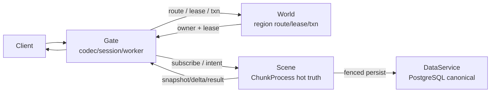
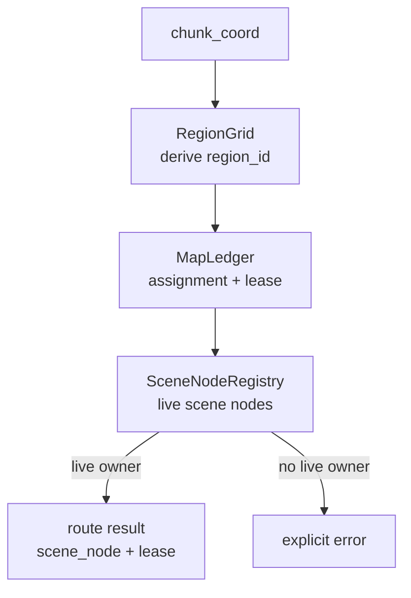

# 服务端控制面当前事实：World / Region / Scene / Chunk

> 当前唯一事实文档。原始阶段日志和实现记录见 [../../source_index.md](../../source_index.md)。

## 状态总览

| 子系统 | 当前事实 | 状态 |
| --- | --- | --- |
| Gate | 协议 decode、鉴权、连接状态、体素订阅 worker、消息转发；不拥有体素 truth | 已落地 |
| World | region 分配、路由、lease/write-token、迁移、跨 region transaction 控制面 | 已落地并持续演进 |
| Scene | `ChunkProcess` 热 truth、voxel mutation、field runtime、object provenance | 已落地 |
| DataService | PostgreSQL/Ecto canonical persistence，含 chunk snapshot、write token、region directory、scene object | 主路径 |
| Region | 当前为 `RegionGrid` 隐式 3D lattice，`region = f(chunk_coord)` | 已落地 |
| Scene owner | `SceneNodeRegistry` 仍是 join-order round-robin + sticky assignment；已补 stale owner repair | 部分 HA |

## 当前权威边界

- Gate 是客户端入口，不保存体素真相。体素订阅和编辑必须经 World 路由和租约约束后交给 Scene。
- World 是低频控制面，不保存完整 chunk truth，也不执行逐帧体素规则。
- Scene/ChunkProcess 是热真相所有者。一个 chunk 的 storage、field workers、subscribers 和版本推进都在 Scene 侧。
- DataService 是 canonical persistence 主路径；Mnesia 相关 app 是迁移期兼容组件，不应被当成最终主路径。

## Region 与路由

当前 region 模型已经从固定 dev 盒子演进到 `RegionGrid` 隐式 3D lattice：

- `region_id` 由 `logical_scene_id + region_index` 编码。
- `region_index = f(chunk_coord)`，默认取值见代码中的 `RegionGrid` 配置。
- Gate 使用 `route_chunk_with_lease_ensuring` / `route_chunks_with_leases_ensuring` 类路径；route miss 会触发 region lazy materialization。
- 没有可用 live Scene node 时仍显式失败，例如 `:scene_node_unassigned`；禁止静默发明 owner。

## Stale Scene Owner Repair

背景问题（已修复）：持久化 region assignment 可能仍指向旧 dev node 名，导致 Gate 订阅 fan-out 全部路由到不可用 Scene。

当前事实：

- `MapLedger.route_chunk_with_lease/3` 和 ensuring route path 返回路由前会检查 `assigned_scene_node` 是否仍存在于 `SceneNodeRegistry.snapshot/1`。
- 若 owner 陈旧，World 通过 `SceneNodeRegistry.reassign_region/2` 选一个 live scene node，持久化新 owner，发新 lease，并 emit `voxel_region_scene_owner_reassigned`。
- 若没有 live Scene node，仍显式失败，不降级。

## 订阅热路径

当前 Gate 订阅热路径已经从 connection 主进程剥离到 per-connection `SubscriptionWorker`：

- connection 接到订阅意图后交给 worker，避免 route/subscribe 慢 I/O 堵住 movement/edit frame。
- worker 是订阅集、pending set、Scene subscribe/unsubscribe 的唯一所有者。
- missing center 的重复重试现在重新发送完整 active window；自动 `radius=0` 会被服务端视为最新完整窗口并触发 prune，只保留给显式手动调试。
- worker 支持小批量、latest-wins，老中心 fan-out 没完成时可丢弃 stale box tail。
- 最新 reconcile 是该连接当前可编辑近场窗口的权威声明；worker promote 新窗口时会先退订同 scene 下所有不在新 box 内的旧 chunk，再继续订阅新窗口内缺失 chunk。
- `SubscriptionWorker.subscriptions/1` 因此表示当前 active/editable server window，而不是历史订阅累积集；绿色 debug 区域必须由这个窗口与客户端 confirmed store 共同解释。
- 窗口裁剪会写 `voxel_reconcile_pruned` observe，字段包含 `center_chunk`、`radius`、`desired_count`、`pruned_count`、`subscription_count` 和 `pruned_sample`，用于排查“玩家移动后绿色区域仍停在出生点”的问题。

这解决的是应用层 mailbox / 同步 call 阻塞，不把问题归因成 TCP 带宽不足。

## 事务与跨 Region

Prefab / 跨 chunk / 跨 region 建造路径当前按具体 `{ChunkDirectory, scene_node}` 分 participant：

- Gate 通过 World 批量路由 touched chunks。
- participant 必须携带 `participant_key`、`assigned_scene_node`、`affected_chunks` 和完整 `chunk_owners`。
- 缺 owner / participant / chunk owner 是调用方契约错误，应拒绝，不从 lease 或 object owner ref 推断。
- `TransactionCoordinator` 持久化事务状态；`TransactionExecutor` 并行 prepare/commit/abort participant。

## 持久化当前状态

- `ChunkSnapshotStore` 走 PostgreSQL row lock / advisory lock / `chunk_version` CAS。
- `WriteTokenStore` 用 write-token fence 防止旧 owner 写入。
- `RegionDirectoryStore` 已成为 MapLedger 目录持久化主路径，取代早期“WorldSup 未接 durable 后端”的状态。
- `SceneObjectStore` 保存 object provenance / owner region / owner lease。
- pending fence / transaction coordinator snapshot 仍是恢复路径的重要状态。

## 被取代的旧结论

| 旧结论 | 当前事实 |
| --- | --- |
| dev 世界固定 5×5×5=125 chunk，越界是终态 `:unassigned_chunk` | 当前目标和代码已转向 `RegionGrid` + ensuring route + 显式 materialization；缺 authoritative chunk 不再静默生成 |
| WorldSup 没给 MapLedger 接 durable 后端 | 当前已接 `DataService.Voxel.RegionDirectoryStore` |
| 订阅在 connection 内同步逐 chunk call | 当前已有 per-connection `SubscriptionWorker` |
| SceneNodeRegistry 掉线后 region 永久指死节点 | 仍非完整 HA，但 stale owner repair 已覆盖旧 dev node / 节点名变化场景 |
| WorldGen 噪声可以作为运行时 route fallback | 已废止；`ChunkProcess` 生产默认缺 authoritative snapshot 即失败，WorldGen 仅保留显式 dev/migration opt-in |

## 证据源

- [`AGENTS.md`](../../../../AGENTS.md)
- [`apps/world_server/lib/world_server/voxel/README.md`](../../../../apps/world_server/lib/world_server/voxel/README.md)
- [`apps/world_server/lib/world_server/voxel/region_grid.ex`](../../../../apps/world_server/lib/world_server/voxel/region_grid.ex)
- [`apps/world_server/lib/world_server/voxel/map_ledger.ex`](../../../../apps/world_server/lib/world_server/voxel/map_ledger.ex)
- [`apps/world_server/lib/world_server/voxel/scene_node_registry.ex`](../../../../apps/world_server/lib/world_server/voxel/scene_node_registry.ex)
- [`apps/gate_server/lib/gate_server/voxel/subscription_worker.ex`](../../../../apps/gate_server/lib/gate_server/voxel/subscription_worker.ex)
- [`apps/gate_server/lib/gate_server/voxel/routing.ex`](../../../../apps/gate_server/lib/gate_server/voxel/routing.ex)
- [`apps/scene_server/lib/scene_server/voxel/chunk_process.ex`](../../../../apps/scene_server/lib/scene_server/voxel/chunk_process.ex)
- [`docs/30-reference/engineering/2026-06-25-voxel-world-production-architecture.md`](../../../30-reference/engineering/2026-06-25-voxel-world-production-architecture.md)
