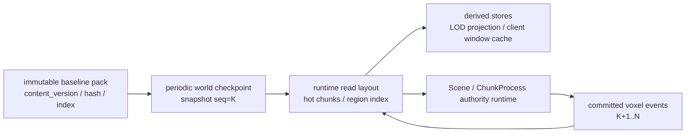
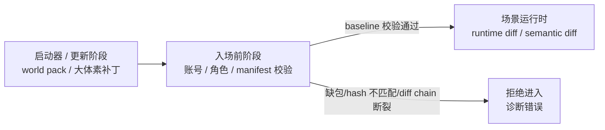

# 体素真值、基线与运行时 Diff 当前事实

> 当前唯一事实文档。它覆盖“世界是什么”的事实源、客户端基线校验、启动器/入场/运行时三阶段边界。

## 当前最高层原则

**权威体素数据是服务器生命周期里的唯一事实源。**

- WorldGen 噪声只应作为一次性 world-seed migration，开发期用于灌入权威 store。
- WorldGen 的公共边界是 `chunk_xyz -> canonical 3D chunk`；当前内容即使主要呈现地表，也不得向流送、LOD 或 renderer 暴露 heightmap、column、terrain-only 或 `Y=0` 语义。
- 真实地图导入未来应作为同层 migration，灌入同一个权威 store。
- chunk 服务、远景 LOD、raycast、碰撞、远程交互都应只读或派生自权威体素。
- 派生物必须显式维护一致性，例如编辑后 dirty LOD mip，而不是依赖“源不会变”的隐式假设。
- **客户端是 snapshot-only 消费者（2026-07-06 投影路线终态）**：配方（`base ⊕ overlay`）只在服务端内部使用，跨 wire 的一律是投影（近窗 1m `0x62/0x63` + 远区 7m source pages）；客户端 WorldGen 永久定位 dev preview / fixture 源。术语口径见 [`glossary.md`](../../../30-reference/protocol/glossary.md)，裁决见 [`2026-07-06-projection-route-final-decision.md`](../../../30-reference/contracts/2026-07-06-projection-route-final-decision.md)。
- Voxia 在扩展里程碑 A 中已完成 `IVoxiaCanonicalVoxelSource`、XYZ cube-shell、`voxia_voxel_source_pages_v2`、六向 material mip、coverage-resolved exact surface、source-neutral scene builder、dev 原子 presentation、唯一 `production_all_features` 组合根，以及 WorldGen/scripted/H-gated `local_disk` 三种 request provider。downstream 必须区分 source unavailable、missing、resolved air 与 solid；内容身份只含 scene/content/source/diff/material，不含 WorldGen、磁盘或 renderer kind。`LoadExpectedBatch` 保持 exact-set 原子 batch 语义；live 本地 provider 则用外部 manifest SHA-256 + expected identity 打开不可变 entry table，只读请求子集并原子发布。当前根把成熟 near 数据泵与 Pure3D far 联合起来，但本地 provider 只接 far，两侧尚未共享 provider/residency/generation；在线 authority provider 仍未实现。

## 当前世界事实模型

当前世界不应把“运行时可读布局”本身当成唯一不可恢复事实。长期权威恢复模型为：

```text
world(seq=N) = world_snapshot(seq=K) + committed_voxel_events(K+1..N)
```

其中：

- `world_snapshot` 是可校验的世界快照。最初版本可以来自 immutable world pack / baseline pack；后续应由定期 compact 生成新的 checkpoint snapshot。
- `committed_voxel_events` 是服务端裁决后已经提交的体素事实事件，而不是客户端原始 intent。它必须能按序 replay，或者已经被后续 checkpoint 覆盖。
- 运行时可读布局、近场 hot chunk、LOD projection、客户端本地窗口缓存都是 `snapshot + events` 的物化结果或派生索引。它们可以为运行时读写优化，但不能成为唯一不可恢复事实。
- 服务端向客户端 ACK 成功前，必须保证对应 voxel event、事务结果或等价 checkpoint/snapshot 已 durable；否则崩溃后会丢失已经确认给玩家的世界变化。



恢复和修复规则：

- 如果损坏的是运行时布局、hot cache、LOD projection 或本地 active-window cache，可以删除后从最近 checkpoint 加后续 events 重建。
- 如果损坏的是 checkpoint / baseline pack / committed event log，则属于权威数据损坏，不能用运行时 snapshot 或客户端缓存静默修复。
- 定期 compact 的目标是把 `old snapshot + many events` 压成新的 checkpoint，并记录 event high-watermark；旧 events 可以归档，但不能在 checkpoint 验证完成前丢弃。
- 初始 world pack 与后续 checkpoint 在逻辑上都是 `world_snapshot`，差别只是初始包面向分发安装，checkpoint 面向减少恢复 replay 成本。

## 三阶段边界



当前设计要求：

- 大体素包、广域重写、全量 tile 更新不进入 scene runtime 热路径。
- 本地 `world pack / region manifest / chunk baseline / diff chain` 必须在进入场景前校验。
- 校验失败视为客户端数据不可被信任，必须拒绝进入场景。
- 禁止用运行时 `ChunkSnapshot`、resync、自愈逻辑或静默兜底绕过基线校验。
- 进入场景后只流送已验证基线之上的 runtime diff、语义 diff、prefab/object/event diff。

## Tile 预算口径

生产流式预算已经冻结如下：

| 单位 | 定义 |
| --- | --- |
| chunk | `16×16×16` macro cell，边长 `16m`，共 `4096` cells |
| tile | `7×7×7` chunks，边长 `112m`，共 `1,404,928` cells |
| 近场窗口 | `27 tiles = 3×3×3 tiles = 9,261 chunks = 37,933,056 cells` |
| 跨 tile 边界新增 | 若旧窗口保留，只新增一片 `3×3 = 9 tiles` |
| 穿过一个 tile 时间 | 按 `6m/s`，约 `18.67s` |

该口径已拍板冻结：“同步数据量可能很大”不作为当前缺陷的默认解释，不能提前当作可操作区域不刷新或编辑无效的主因；只登记为后续风险。实际碰到吞吐瓶颈时，必须先用 observe/CLI 统计 `tiles_changed`、`chunks_changed`、`ops`、`bytes`、`encode_ms`、`send_queue_bytes` 再针对性设计。

该口径的独立决策记录见
[`docs/30-reference/protocol/2026-06-28-voxel-tile-budget-runtime-diff-decision.md`](../../../30-reference/protocol/2026-06-28-voxel-tile-budget-runtime-diff-decision.md)。

## 当前实现与目标的差异

| 主题 | 当前实现/状态 | 目标事实 |
| --- | --- | --- |
| 近场 chunk truth | Scene / ChunkProcess 持热 truth，server snapshot/delta authoritative | 保持 |
| 远景 LOD 数据源 | `0x6A` 默认在线兼容路径仍读取 `LodHeightmapStore`，默认 source-pages 仍是旧列 identity。唯一联合根的 Pure3D far 已真消费 WorldGen 或 H-gated `local_disk` XYZ pages；两者共用 required/keep/enter/exit diff、immutable residency/lease、cooperative cancellation、source-bound shared artifact cache、parallel resolved surface 与 absolute XYZ stable patch transaction，不再按 center 全量请求/聚合。coverage diff 在 worker 运行，旧 lease 按页预算回收；相邻 Real-RHI worker 约 `0.91-0.95s`。成熟 near 尚未共享该 provider/residency/coverage transaction，所以本地根报告 mixed source mode | A10 继续统一 near/far source identity、residency、coverage generation 与 scene transaction，并补反向依赖/full oracle、离群帧和三轴路线；后续生产 XYZ source pages 只新增服务器 provider，缺 page/chunk/hash/schema 硬失败且不回退 WorldGen |
| WorldGen | 服务端与客户端 dev 副本仍暴露 column/heightmap；客户端只允许 preview/fixture，生产不以它重算 baseline | 服务端迁移/离线生成器只公开 `chunk_xyz -> canonical 3D chunk`；当前地表实现只是内部 `density(x,y,z)` 算子。更换算法只改变 content version，不改变 streaming/LOD/render 路径 |
| chunk runtime materialization | `ChunkProcess` 生产默认只接受持久化 snapshot / provided storage；缺失、损坏或 store 不可用会启动失败并 emit `voxel_chunk_materialization_failed`；`DefaultRegionBootstrapper` 开发/demo 默认通过 `DevSeed` 写 starter chunk snapshots；测试/dev 可显式 opt-in 旧 WorldGen | 懒物化只调用 3D canonical materializer；未修改 chunk 可由 generator+H 恢复，但 materializer 之后所有系统只读 canonical store |
| 客户端 baseline | 入场前强校验 + 服务端 ready manifest + UE 本地随机访问 pack 加载已接入；`-VoxiaWorldGenPreview` 可跳过 pack 只生成本地预览世界 | **客户端 snapshot-only（2026-07-06 终态）**：launcher/update 传已验证投影包（近窗 world pack + 远区 source pages）+ H 凭证，运行时增量走 0x62/0x63（近窗）与 pages HTTP 拉取（远区）；"seed+maps+D+H 本地重算"目标已关闭，同构路线仅存为定向优化选项（五条件 + 负载画像） |
| **baseline 形态与流送边界** | **当前处于全量物化过渡**（WorldPackBootstrapper/shard 装 chunk payload）；新边界决策已定待迁移 | **确定性 3D WorldGen + 设计师 delta D + hash 凭证 H**；WorldGen 只在 materialization 边界出现，storage ∝ 修改量 |
| runtime snapshot | 当前订阅路径仍会发 snapshot | 长期只作为已验证基线上的正常权威同步之一，不允许当 baseline 兜底 |
| 当前世界恢复模型 | 当前已有 canonical chunk snapshot、runtime delta 和持久化 projection 的局部能力，但 checkpoint + committed event log 尚未形成统一恢复链 | `world_current = latest checkpoint + committed voxel events after checkpoint`；运行时布局是物化视图，可重建但 ACK 前必须 durable |

## 被取代的旧结论

| 旧结论 | 当前事实 |
| --- | --- |
| 客户端可以只拿 seed 自生成远景基线 | 被真实地图/权威 store 方向取代；客户端不应持第二真值 |
| 远景 heightmap 可长期按运行时噪声生成 | 已诊断为平行真值缺陷，后续改派生 mip |
| WorldGen v1 可以把 2.5D heightmap/column 作为公共内容维度 | 已被纯 3D canonical chunk 契约取代；height/column 只能作为待删除实现细节，不能进入 streaming、LOD、cache identity 或 renderer |
| 缺 chunk 可静默跑噪声 fallback | 已废止：正式运行时缺块启动失败并输出 `voxel_chunk_materialization_failed`；噪声/空 chunk 只能显式 dev/test opt-in |
| baseline 缺失可 snapshot/resync 自愈 | 必须拒绝入场，不允许兜底 |
| 运行时布局就是唯一不可删事实 | 运行时布局应是 `checkpoint + committed voxel events` 的物化结果；只有 checkpoint/event log 等 durable truth 完整时才允许删除并重建运行时布局 |
| 只靠初始压缩母包即可恢复当前世界 | 只能恢复初始世界；玩家造成的当前世界变化必须来自 committed event log 或后续 checkpoint |
| 客户端长期应 seed+maps+D+H 本地重算 baseline（同构路线，6-29/6-30 原计划） | 2026-07-06 投影路线终态：客户端 snapshot-only（近窗 1m + 远区 7m 双分辨率投影）；配方留服务端（懒物化仍是服务端存储目标）；同构路线降格为"处女地基底本地生成"定向加法，五条件 + 负载画像全命中才评估 |

## 证据源

- [`AGENTS.md`](../../../../AGENTS.md)
- [`docs/10-active/voxel-authority/2026-06-28-权威体素唯一事实源-噪声降为migration.md`](../../../10-active/voxel-authority/2026-06-28-权威体素唯一事实源-噪声降为migration.md)
- [`docs/20-archive/client/2026-06-28-体素世界与远景渲染-历史整合.md`](../../../20-archive/client/2026-06-28-体素世界与远景渲染-历史整合.md)（历史整合证据）
- [`docs/00-current-truth/impl/2026-06-29-world-pack-streaming-handoff.md`](../../impl/2026-06-29-world-pack-streaming-handoff.md)
- [`docs/30-reference/protocol/2026-06-28-voxel-tile-budget-runtime-diff-decision.md`](../../../30-reference/protocol/2026-06-28-voxel-tile-budget-runtime-diff-decision.md)
- [`docs/30-reference/engineering/2026-06-25-voxel-world-production-architecture.md`](../../../30-reference/engineering/2026-06-25-voxel-world-production-architecture.md)
- [`clients/Voxia/docs/2026-06-28-streaming-window-follow-fix.md`](../../../../clients/Voxia/docs/2026-06-28-streaming-window-follow-fix.md)
- [`docs/30-reference/protocol/2026-06-29-voxel-baseline-streaming-boundary.md`](../../../30-reference/protocol/2026-06-29-voxel-baseline-streaming-boundary.md)
- [`docs/30-reference/protocol/glossary.md`](../../../30-reference/protocol/glossary.md)
- [`docs/30-reference/contracts/2026-07-06-projection-route-final-decision.md`](../../../30-reference/contracts/2026-07-06-projection-route-final-decision.md)
- [`docs/20-archive/voxel-far-field/2026-07-06-voxia-lod-layering-and-technology-design.md`](../../../20-archive/voxel-far-field/2026-07-06-voxia-lod-layering-and-technology-design.md)（历史 LOD 分层证据）
- [`docs/10-active/voxel-far-field/2026-07-12-pure-3d-voxel-shell-migration.md`](../../../10-active/voxel-far-field/2026-07-12-pure-3d-voxel-shell-migration.md)（完整 XYZ 唯一现役作战主线；远景纯 3D 壳尚未生产接线）
