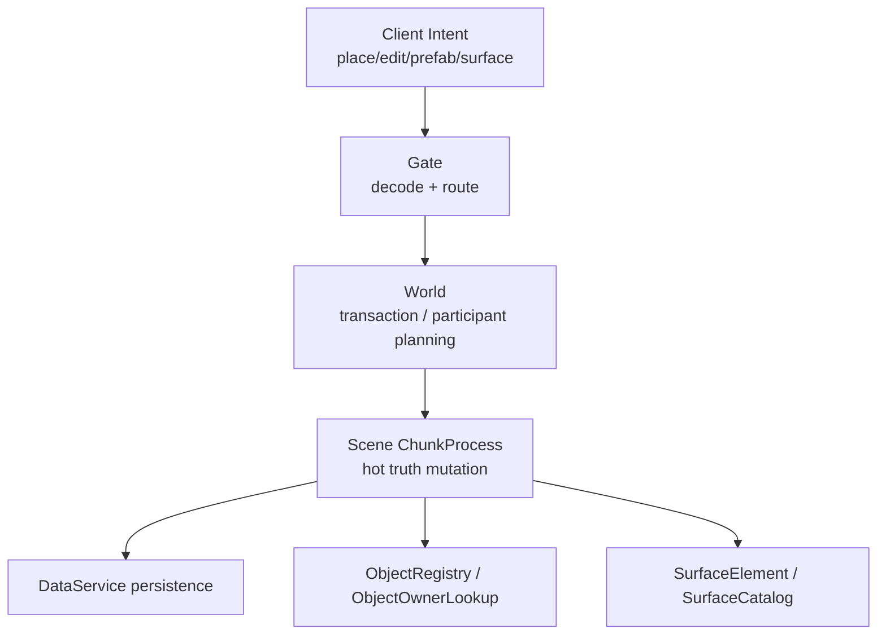

# 建设、Prefab、Object 与 SurfaceElement 当前事实

> 当前唯一事实文档。覆盖服务端建造原语、prefab 事务、object provenance、surface element 层。

## 模块关系

## Prefab / Object 当前事实

- Prefab v2 transaction 已落地。
- Fence persistence + auto-resume commit 已落地。
- Object provenance、局部破坏、整体销毁已落地。
- ObjectStateDelta 推送链路和客户端碎屑消费已落地。
- 跨 region prefab 多 participant transaction 主体已落地。
- Cross-region damage / `0x6C` owner-driven fan-out 主体已落地。

当前边界：

- object 只应承载跨多 cell / 多 chunk、多 part、生命周期、owner 逻辑实体。
- 单宏格面级装饰/功能层不应被塞成 object；应走 SurfaceElement / terrain-bypass。
- `covered_chunks_by_region` 是运行时 inflate/cache 信息，不应误读为持久列。

## 建设系统当前事实

- 服务端建造原语已具备。
- C1/C2/C3/C4a/C5/C5.2/C5.1/C5.3/C5.4 已落地。
- 深半导体 C4b（二极管/三极管更完整系统）仍待专门设计。
- 构件系统应继续遵守“正交物理系统 + 材料属性向量”原则，不回退到 per-device 特判。

## SurfaceElement 当前事实

服务器侧数据与 wire 已通：

- `SurfaceCatalog`
- `SurfaceElement`
- Storage 面槽
- ChunkProcess 权威 ops
- ChunkSnapshot TLV `0x08`

仍未完成：

- 物理参与。
- 客户端完整渲染/解码。
- delta 专用 op。
- 与 field / light / chemistry / structure 的统一 participant projection。

## 事务边界

- 跨 chunk / 跨 region 工作由 World transaction coordinator 规划 participant。
- Scene 负责 prepare/commit/abort 中的 hot truth mutation。
- DataService 通过 write-token fence 和 snapshot CAS 保证旧 owner 不能写。
- Gate 不应绕过 World 直接推断 region owner 或 transaction participant。

## 被取代的旧结论

| 旧结论 | 当前事实 |
| --- | --- |
| Prefab 只是客户端形状预览 | Prefab 已是服务端 transaction + object provenance 路径 |
| 单格表面能力都应变成 object | SurfaceElement 是 terrain-bypass 面层，object 用于跨 cell/chunk 生命周期实体 |
| Cross-region prefab 仍只是设计 | 主体已落地，HA/双 BEAM 等仍是后续 |
| 深半导体已经完成 | C4b 仍待专门设计 |

## 证据源

- [`docs/20-archive/voxel-authority/phase-3-prefab-v2-transactions.md`](../../../20-archive/voxel-authority/phase-3-prefab-v2-transactions.md)
- [`docs/20-archive/voxel-authority/phase-3-bis-fence-and-resume.md`](../../../20-archive/voxel-authority/phase-3-bis-fence-and-resume.md)
- [`docs/20-archive/voxel-authority/phase-4-object-provenance.md`](../../../20-archive/voxel-authority/phase-4-object-provenance.md)
- [`docs/20-archive/voxel-authority/phase-4-bis-object-state-delta-push.md`](../../../20-archive/voxel-authority/phase-4-bis-object-state-delta-push.md)
- [`docs/20-archive/voxel-authority/phase-A4-cross-region-prefab.md`](../../../20-archive/voxel-authority/phase-A4-cross-region-prefab.md)
- [`docs/10-active/voxel-authority/2026-06-17-unit-morphology-and-surface-element-layer.md`](../../../10-active/voxel-authority/2026-06-17-unit-morphology-and-surface-element-layer.md)
- [`docs/20-archive/field-emergence/2026-06-23-construction-system-fixed-component-list.md`](../../../20-archive/field-emergence/2026-06-23-construction-system-fixed-component-list.md)
