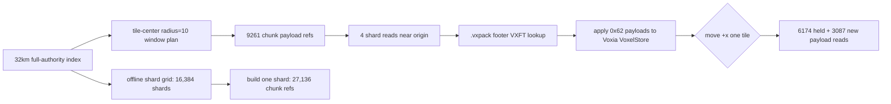

# 2026-06-29 体素 world-pack / streaming 当前交接

> 本文记录本次提交前的真实状态。它不是完整设计稿，只用于接手时快速判断已经做到哪里、验证到哪里、哪里还没有开始。

> **2026-07-13 完整 XYZ 取代声明**：本文中带 2026-06-29/07-01 日期的
> `radius=3`、343 chunks 与 Y=`-3..102` 只能作为旧实跑证据。当前共享契约以
> `MmoContracts.VoxelSpatialContract` 为准：tile `(0,0,0)` 的中心 chunk 为
> `(3,3,3)`，近场 `radius_l_inf=10`，窗口 `[-7..13]^3`、共 9261 chunks。
> full32km Y 边界平移为 `-7..98`，保持 106 层、`444,596,224` chunks 和
> `16x106x16` shard 形状不变；旧 pack/index/local-Y 不兼容，必须以
> `worldgen-32km-xyz-window@2` 重产。

## 当前已落地

- 服务端已经有正式的 `WorldPackBootstrapper` / `WorldPackMaterializer` 路径，可在显式环境变量开启时按 chunk bounds 批量调用真实 `WorldGen`，写入 canonical chunk snapshot。LOD heightmap projection 默认仍可 inline 维护；full-pack materialization 可通过 `materializer_opts: [lod_projection?: false]` 先只落 authoritative snapshots，再显式 rebuild 派生 LOD。
- world-pack 生成状态已进入 auth manifest：只有物化成功后发布 `ready`，失败或不可重试错误不会伪装成功。
- `DefaultRegionBootstrapper` 与 world-pack 生成路径已经拆开：开启正式 world-pack 生成时，默认 dev seed 不再抢占同一批 chunk。
- DataService 增加 LOD heightmap projection 存储；Scene 侧 chunk snapshot 写入可派生/刷新 LOD projection；远景 LOD 数据源已从运行时噪声迁移到持久化 projection。
- UE Voxia 客户端已接入本地 baseline chunk pack：启动/进场前可以从 `Saved/Voxia/Baseline/scene_<id>/chunks/*.vcsnap` 读取本地 pack，并预填 confirmed voxel store。
- UE Voxia debug/stdio CLI 已支持 baseline 与 streaming 相关观测命令，例如 `baseline_load`、near confirmed/missing 统计、LOD/overlay 状态检查。
- “缺本地包、hash 不匹配、diff chain 断裂”不允许靠 runtime snapshot/resync 兜底进场的要求已经写入当前事实文档和实现边界。
- auth manifest / world_diff 现在要求 `world_pack.generated.chunk_count` 与 canonical `voxel_chunks` 实际持久化数量一致，且在有声明 bounds 时校验 min/max chunk bounds；`status: :ready` 但 DB 只有局部 chunk 会被判为 `world_pack_incomplete`，不得进场或分页 diff。
- `MmoContracts.WorldPackIndex` 已提供 32km full-authority pack/index 的紧凑覆盖校验：不枚举 `444,596,224` 个 chunk，也能校验 index bounds、region chunk_count、重叠和覆盖总数；当前 production probe 使用 tile-center `radius=10` 完整 XYZ 窗口与整 tile 平移计数。
- auth manifest 已能接受 verified `pack_index` 作为完整权威 baseline 证明，并把 `startup_sync.endpoint` / `world_pack.baseline_endpoint` 指向 `/ingame/voxel/world_pack`，格式标为 `world_pack_index_v1`。
- `world_diff` 在 `pack_index` baseline 场景下只允许承担已完成 baseline 之后的运行时空 diff；当客户端试图用 `base_version=""` 拉完整 baseline 时返回 `world_pack_baseline_not_served_by_world_diff`，避免空 DB page 伪装成功。
- Voxia 本地 baseline 缓存现在以 `content_version + expected_chunks + persisted_chunks` 共同判定。只匹配 `content_version` 不再足够；同版本但只落了局部窗口的缓存会被标记为 incomplete 并重建/重下。
- auth 已实现 `/ingame/voxel/world_pack` compact index 端点，返回 `world_pack_index_v1`、完整 32km bounds/count、region hash、index hash 与 `center=(3,3,3) / radius=10 / shape=21³ / count=9261` 滑动窗口契约；generated/index bounds 不覆盖 `[-7..13]^3` 时 integrity 显式为 `active_window_bounds_mismatch`，禁止入场。
- `MmoContracts.WorldPackIndex` 现在带 `payload_layout`、`payload_shard_grid/1`、`payload_shard_plan/2` 与 `window_payload_plan/3`：完整 32km index 下可得到 `128 x 1 x 128 = 16,384` 个 `.vxpack` shard 摘要，单 shard 展开 `16 x 106 x 16 = 27,136` 个 chunk refs，runtime 窗口只规划当前 9261 个 near payload refs/shards，不枚举全世界。
- `MmoContracts.WorldPackIndex.payload_shard_summaries/1` 已补齐全 shard 轻量摘要入口：完整 32km pack 只枚举 `16,384` 个 shard 摘要，不展开 `444,596,224` 个 chunk refs，也不会为每个 shard 重算完整 grid。
- `MmoContracts.WorldPackShard` 已定义 `.vxpack` footer-table 二进制契约：payload blob 后接 `local_coord + offset + size` entries，末尾为 little-endian entry count 与 `VXFT` magic。
- `WorldServer.Voxel.WorldPackArtifactBuilder` 已有离线 artifact 基本单位：先校验完整 `WorldPackIndex`，再可按单 shard 写 `.vxpack`；也能在完整 32km index 下为连续 runtime 滑动窗口构建 union payload pack，并报告每步 held/new chunk。
- `WorldServer.Voxel.WorldPackArtifactBuilder.build_release/2` 已补齐 release 构建入口：默认按完整 shard grid 逐 shard 写入；也可通过 `max_shards` / `shard_coords` 构建 bounded batch。bounded batch 返回 `status: :partial`、`manifest: nil`，不能被当作完整 release ready。
- `MmoContracts.WorldPackShard.fetch_file/2` 已支持从 `.vxpack` 文件尾部 footer table 随机读取目标 payload，不需要整 shard 载入内存；`footer_summary_file/1` 可读取 entry count 与 local coord set，用于 release 完整性校验。
- `WorldServer.Voxel.WorldPackReleaseVerifier` 已有发布包级验证入口：先按完整 index 校验所有预期 `.vxpack` shard 文件、manifest 精确 shard path set、manifest size/hash、每个 shard footer entry count 与 local coord 边界覆盖，再抽样执行正常滑动窗口 payload 读取（文件级 footer random access）；缺 shard、manifest 额外/重复 shard、hash mismatch、footer 不完整、payload frame 错误都会显式失败，不会 runtime 生成缺失 baseline。
- 新增可复现 probe：`mix run --no-start scripts/world_pack_release_verify.exs --pack-root <pack_root>`。默认使用 full32km compact index，写 observe JSON 到 `.demo/observe/world-pack-release/`；失败时返回非零。
- 新增可复现 build probe：`mix run --no-start scripts/world_pack_release_build.exs --pack-root <pack_root>`。默认使用 full32km compact index 与 canonical DataService snapshot store；`--max-shards` / `--shard-coords` 可用于 bounded batch 进度探针，observe JSON 写入 `.demo/observe/world-pack-release-build/`。
- `DataService.Voxel.ChunkSnapshotStore.coverage/4` 与 `WorldServer.Voxel.WorldPackAuthorityCoverage` 已补齐 canonical-store 覆盖验证入口：不枚举 `444,596,224` 个 chunk、不 materialize 缺块，只用 DB 聚合统计 full bounds 覆盖，并抽样 payload shard 与 tile-center `radius=10` 完整 XYZ 窗口。
- 新增可复现 authority coverage probe：`mix run --no-start scripts/world_pack_authority_coverage.exs`。默认使用 full32km compact index，输出 `.demo/observe/world-pack-authority-coverage/`，authority 不完整或 DB 不可用时返回非零。
- `WorldGenMaterializer.put_snapshot/4` 已支持 `lod_projection?: false`，`WorldPackMaterializer` / `WorldPackBootstrapper` 已支持 `materializer_opts` 透传到 arity-4 materializer。这样 full-pack 导入可以先只写 canonical chunks，避免每个垂直 chunk 重复扫描/写同一 X/Z column 的 LOD projection；运行时 `ChunkProcess` persistence 默认路径不变。
- `WorldServer.Voxel.WorldPackSvoSourceMaterializer` 已补齐 SVO confirmed-source 级服务端入口：用与 Voxia `FVoxiaFarFieldCoveragePlanner` 同构的 tile/macro-cell coverage 规划统计 canonical `expected/present/missing`，预算内通过 `WorldPackBootstrapper` / `WorldGenMaterializer` 写 bounded canonical snapshots，并在 materializer 成功但复查仍 incomplete 时显式失败。它是部署/工具路径，不是客户端 runtime 缺包兜底。
- 新增可复现 SVO source probe：`mix run --no-start scripts/world_pack_svo_source_materialize.exs --dry-run ...` 只读统计 coverage；去掉 `--dry-run` 时走 bounded materialization。observe JSON 写入 `.demo/observe/world-pack-svo-source/`；incomplete 或超预算返回非零，ready 返回 0。
- Voxia 现在会读取 manifest 的 `baseline_format` / `baseline_endpoint` 并暴露到 `TerrainBaselineSnapshot()`。遇到 `world_pack_index_v1` 时会请求 `/ingame/voxel/world_pack`，校验 compact index，落盘 `scene_<id>_world_pack_index.json` 和本地 manifest，并进入 `index_ready`。`LoadTerrainBaselineWindow` 已能按当前 radius 窗口从 `.vxpack` footer-table 读取 0x62 payload，校验 scene/chunk 后应用进 confirmed `VoxelStore`；成功 seed 当前窗口后才转为 `ready`，不会继续走 `world_diff` 兜底。

## 已验证证据

### 2026-07-13 当前完整 XYZ 证据

- `MIX_ENV=test mix test apps/mmo_contracts/test/mmo_contracts/voxel_spatial_contract_test.exs apps/mmo_contracts/test/mmo_contracts/world_pack_index_test.exs --no-start` 通过，`13 passed`；覆盖 tile `(0,0,0)` 中心 `(3,3,3)`、`[-7..13]^3` / 9261 chunks、单 chunk 平移 `8820/441/441`、整 tile 平移 `6174/3087/3087`，以及 full32km `Y=-7..98`。
- `MIX_ENV=test mix test apps/world_server/test/world_server/voxel/default_region_bootstrapper_test.exs apps/world_server/test/world_server/voxel/world_pack_materializer_test.exs apps/world_server/test/world_server/voxel/world_pack_artifact_builder_test.exs --no-start` 通过，`25 passed`；默认 bootstrap、materializer preflight 和三窗口 artifact union 都使用 9261-chunk 立方体。
- `MIX_ENV=test mix test apps/world_server/test/world_server/voxel/world_pack_materializer_test.exs apps/world_server/test/world_server/voxel/world_pack_authority_coverage_test.exs --no-start` 通过，`16 passed`；默认 authority probe 使用中心 `(3,3,3)`、`(10,3,3)`、`(17,3,3)` 与 radius 10。
- `MIX_ENV=test mix test apps/auth_server/test/auth_server_web/controllers/voxel_world_manifest_controller_test.exs --no-start` 通过，`9 passed`；旧 radius-3/343 pack 即使标记 ready 也会被 `active_window_bounds_mismatch` 门禁拒绝，只有覆盖 `[-7..13]^3` 的 pack 才允许入场。
- `MIX_ENV=test mix run --no-start scripts/world_pack_release_verify.exs --index small-release-test --build-small-fixture --pack-root .demo/observe/world-pack-release/xyz-contract-small-test` 通过；通用小 fixture 仍验证 `.vxpack` 文件契约，但 production full32km 默认已切到 `worldgen-32km-xyz-window@2`、`Y=-7..98` 与 radius 10。

### 2026-06-29 至 07-01 迁移前证据

> 以下记录保留当时工具链、性能和失败模式的证据价值；其中 radius 3、343-chunk
> 近场、中心 Y=0 与 `Y=-3..102` 均不是当前验收口径。

- 2026-06-29 15:02-15:06 刷新验证：`mix format --check-formatted` 覆盖 world-pack/index/shard/materializer/release/probe 相关 `.ex/.exs` 文件，通过。
- 2026-06-29 15:02-15:06 刷新验证：`mix compile` 退出 0；仍有仓库既有 warning。
- 2026-06-29 15:02-15:06 刷新验证：`MIX_ENV=test mix test apps\mmo_contracts\test\mmo_contracts\world_pack_index_test.exs apps\mmo_contracts\test\mmo_contracts\world_pack_shard_test.exs --no-start` 通过，`13 passed`。
- 2026-06-29 15:02-15:06 刷新验证：`MIX_ENV=test mix test apps\world_server\test\world_server\voxel\world_pack_artifact_builder_test.exs apps\world_server\test\world_server\voxel\world_pack_authority_coverage_test.exs apps\world_server\test\world_server\voxel\world_pack_release_verifier_test.exs apps\world_server\test\world_server\voxel\world_pack_materializer_test.exs --no-start` 通过，`27 passed`。
- 2026-06-29 15:02-15:06 刷新验证：`MIX_ENV=test mix test apps\scene_server\test\scene_server\voxel\world_gen_materializer_test.exs --no-start` 通过，`2 passed`。
- 2026-06-29 15:08 刷新验证：`MIX_ENV=test mix test apps\auth_server\test\auth_server_web\controllers\voxel_world_manifest_controller_test.exs --no-start` 通过，`9 passed`，覆盖 manifest/world_pack gate 与 `world_diff` 禁止 baseline fallback。
- 2026-06-29 15:02-15:06 刷新验证：`MIX_ENV=test mix run --no-start scripts\world_pack_release_verify.exs --index small-release-test --build-small-fixture` 通过；observe 为 `.demo/observe/world-pack-release/world_pack_release_small-release-test_20260629T070234459000.json`，报告 `expected_shards=2`、`verified_shards=2`、`authority_expected_chunks=36`、首窗 `27 loaded`、x+1 后 `9 loaded / 18 held`。
- 2026-06-29 15:02-15:06 刷新验证：`MIX_ENV=test mix run --no-start scripts\world_pack_release_verify.exs --pack-root .demo\observe\world-pack-release\missing-full32km-pack` 按预期返回非零；observe 为 `.demo/observe/world-pack-release/world_pack_release_full32km_20260629T070249591000.json`，报告 `expected_shards=16384`、`verified_shards=0`、`missing_shard_count=16384`。
- 2026-06-29 15:02-15:06 刷新验证：`MIX_ENV=test mix run --no-start scripts\world_pack_authority_coverage.exs` 按预期返回非零；observe 为 `.demo/observe/world-pack-authority-coverage/world_pack_authority_coverage_full32km_20260629T070305702000.json`，报告 full32km `expected_chunk_count=444,596,224`、canonical `total_scene_chunk_count=0`、`missing_in_bounds_chunk_count=444,596,224`，三个 radius=3 sampled windows 均 `missing_chunk_count=343`。
- 2026-07-01 刷新验证：`MIX_ENV=test mix test apps/world_server/test/world_server/voxel/world_pack_svo_source_materializer_test.exs --no-start` 通过，`3 passed`，覆盖 8km SVO source budget preflight、materializer 后 coverage 复查失败显式报错、read-only coverage 计数。
- 2026-07-01 刷新验证：`MIX_ENV=test mix run --no-start scripts/world_pack_svo_source_materialize.exs --dry-run --radius-tiles 72 --near-skip-radius-tiles 1 --macro-cell-tiles 1 --max-chunks 3000 --no-migrate` 按预期返回非零；observe 为 `.demo/observe/world-pack-svo-source/world_pack_svo_source_coverage_20260701T035443944000.json`，报告 `macro_cell_count=21016`、`expected_source_chunk_count=7,208,488`、`present_source_chunk_count=0`、`missing_source_chunk_count=7,208,488`、`planned_materialization_chunk_count=7,208,488`。
- 2026-07-01 刷新验证：`MIX_ENV=test mix run --no-start scripts/world_pack_svo_source_materialize.exs --logical-scene-id 919998 --radius-tiles 0 --near-skip-radius-tiles -1 --macro-cell-tiles 1 --max-chunks 400 --batch-size 64 --no-migrate` 通过；observe 为 `.demo/observe/world-pack-svo-source/world_pack_svo_source_materialize_20260701T035544052000.json`，报告单 tile `343` chunks inserted、`final_present_source_chunk_count=343`、`final_missing_source_chunk_count=0`、status `ready`。
- 2026-06-29 15:02-15:06 刷新验证：`node --check clients\Voxia\scripts\voxia_stdio_cli.js` 通过。
- 2026-06-29 15:02-15:06 刷新验证：`D:\Epic Games\UE_5.8\Engine\Binaries\Win64\UnrealEditor-Cmd.exe "...\clients\Voxia\Voxia.uproject" -ExecCmds="Automation RunTests Voxia.Net.TerrainBaselinePackIndex; Quit" -unattended -nullrhi -nosound` 退出 0；`clients\Voxia\Saved\Logs\Voxia.log` 记录 `Test Completed. Result={Success} Name={TerrainBaselinePackIndex}` 与 `TEST COMPLETE. EXIT CODE: 0`。
- 2026-06-29 15:02-15:06 刷新验证：`git diff --check` 通过。
- 2026-06-29 15:02-15:06 组合测试注意事项：一次性把 mmo_contracts/world_server/scene_server 多个 umbrella app 的测试放进同一个 `mix test` 命令，会碰到现有 `test_helper` 重复启动 `DataService.Repo` 的 `already_started` 副作用；本轮最终验收已按 app 拆开执行。
- `mix compile` 通过。
- `mix test apps/world_server/test/world_server/voxel/world_pack_materializer_test.exs --no-start` 通过。
- `MIX_ENV=test mix test apps/mmo_contracts/test/mmo_contracts/world_pack_shard_test.exs apps/mmo_contracts/test/mmo_contracts/world_pack_index_test.exs --no-start` 通过：32km count、incomplete region、overlap、radius=3 平移、payload shard grid、单 shard refs、window payload refs 规划、`.vxpack` footer-table 编码/读取均覆盖。
- `MIX_ENV=test mix test apps/world_server/test/world_server/voxel/world_pack_artifact_builder_test.exs --no-start` 通过：从完整 32km index 构建单个 full shard、连续三次 radius=3 窗口 union pack、incomplete authority index 拒绝、missing snapshot 显式失败均覆盖。
- `MIX_ENV=test mix test apps/world_server/test/world_server/voxel/world_pack_artifact_builder_test.exs --no-start` 追加覆盖：完整 release 构建会写出所有 expected shards 并生成 manifest；bounded release batch 只写 selected shard，返回 `partial` 且 verifier 对同目录缺 shard 返回非零。
- `MIX_ENV=test mix test apps/world_server/test/world_server/voxel/world_pack_release_verifier_test.exs --no-start` 通过：完整 release manifest + 两步滑动窗口抽样、缺任一 expected shard 即失败、manifest 额外/重复 shard 拒绝、manifest hash mismatch 在窗口验证前失败、JSON decoded manifest 兼容、存在但 footer 不完整的 shard 拒绝均覆盖。
- `MIX_ENV=test mix test apps/mmo_contracts/test/mmo_contracts/world_pack_shard_test.exs --no-start` 追加覆盖：`.vxpack` 文件级 footer random access 能按 local coord 读取 payload，缺 coord 返回 `:not_found`，footer summary 能读出 entry count 与 local coord set。
- `MIX_ENV=test mix run --no-start scripts/world_pack_release_build.exs --index small-release-test --snapshot-mode synthetic-term` 通过：生成 2 个 shard，返回 `status=ready`、`expected_shards=2`、`written_chunks=36`，observe 写入 `.demo/observe/world-pack-release-build/`。
- `MIX_ENV=test mix run --no-start scripts/world_pack_release_build.exs --index small-release-test --snapshot-mode synthetic-term --max-shards 1 --pack-root .demo/observe/world-pack-release/small-release-test-partial-pack` 通过：返回 `status=partial`、`built_shards=1`、`remaining_shards=1`、`manifest=null`。
- `MIX_ENV=test mix run --no-start scripts/world_pack_release_verify.exs --index small-release-test --pack-root .demo/observe/world-pack-release/small-release-test-partial-pack` 返回非零：报告 `reason=missing_pack_shards`、`missing_shard_count=1`，证明 partial batch 不会被 verifier 假绿。
- **迁移前历史 probe（不得作为当前边界预期）**：`MIX_ENV=test mix run --no-start scripts/world_pack_release_build.exs --pack-root .demo/observe/world-pack-release/full32km-build-probe --max-shards 1` 当时返回非零，第一 shard `packs/tile_0_0_0.vxpack` 的首个 chunk 是旧边界 `[-1024,-3,-1024]`。当前同一 shard 必须从 `[-1024,-7,-1024]` 开始；该旧结果只证明当时 canonical store 缺少 payload，不能验证现役完整 XYZ pack。
- `MIX_ENV=test mix test apps/data_service/test/data_service/voxel/chunk_snapshot_store_test.exs apps/world_server/test/world_server/voxel/world_pack_authority_coverage_test.exs --no-start` 通过：`ChunkSnapshotStore.coverage/4` 的 total/in-bounds/out-of-bounds 聚合、`WorldPackAuthorityCoverage` 的 full index 对账、sampled shard 与 sampled sliding window 缺块报告均覆盖。
- `MIX_ENV=test mix run --no-start scripts/world_pack_authority_coverage.exs` 返回非零：observe JSON 报告 full32km `expected_chunk_count=444,596,224`，当前 canonical `total_scene_chunk_count=0`、`missing_in_bounds_chunk_count=444,596,224`；sampled shards `tile_0_0_0`、`tile_63_0_63`、`tile_127_0_127` 均为 `missing_chunk_count=27,136`；窗口中心 `(0,0,0)`、`(1,0,0)`、`(2,0,0)` 的 radius=3 窗口均为 `missing_chunk_count=343`，`LASTEXITCODE=1`。
- `mix run --no-start scripts/world_pack_authority_coverage.exs` 在 dev 环境返回 DB 不可用报告：本机 `mmo_dev` 数据库不存在，observe JSON 写入 `.demo/observe/world-pack-authority-coverage/world_pack_authority_coverage_full32km_20260629T062845529000.json`，因此 dev canonical 覆盖未被验证。
- `MIX_ENV=test mix test apps/scene_server/test/scene_server/voxel/world_gen_materializer_test.exs --no-start` 通过：覆盖 `lod_projection?: false` 只写 canonical snapshot、不写 LOD rows；默认路径仍写 stride=16 LOD row。
- `MIX_ENV=test mix test apps/world_server/test/world_server/voxel/world_pack_materializer_test.exs --no-start` 通过：覆盖 arity-4 materializer opts 透传、对不支持 opts 的 arity-3 materializer 显式失败、bootstrapper 通过 `materializer_opts: [lod_projection?: false]` 调用默认 WorldGen materializer。
- `MIX_ENV=test mix test apps/auth_server/test/auth_server_web/controllers/voxel_world_manifest_controller_test.exs --no-start` 通过：9 个 manifest/world_diff/world_pack gate 测试覆盖 DB snapshot baseline、pack_index full-authority baseline、world_pack compact index 端点和 world_diff 禁止 baseline fallback。
- `MIX_ENV=test mix run --no-start scripts/world_pack_release_verify.exs --index small-release-test --build-small-fixture` 通过：生成 2 个 `.vxpack` shard、验证 36 个 authority chunks、两个 radius=1 窗口统计为首窗 27 loaded、x+1 后 9 loaded / 18 held。
- `MIX_ENV=test mix run --no-start scripts/world_pack_release_verify.exs --pack-root .demo/observe/world-pack-release/missing-full32km-pack` 返回非零：observe JSON 报告 `expected_shards=16384`、`missing_shard_count=16384`、`verified_shards=0`，证明完整 32km payload 缺失不会假绿；优化后缺根目录内部验证耗时约 `47 ms`。
- `git diff --check` 通过。
- `node --check clients\Voxia\scripts\voxia_stdio_cli.js` 通过。
- `D:\Epic Games\UE_5.8\Engine\Build\BatchFiles\Build.bat VoxiaEditor Win64 Development -Project="...\clients\Voxia\Voxia.uproject" -WaitMutex` 通过。
- `D:\Epic Games\UE_5.8\Engine\Binaries\Win64\UnrealEditor-Cmd.exe "...\clients\Voxia\Voxia.uproject" -ExecCmds="Automation RunTests Voxia.Net.TerrainBaselinePackIndex; Quit" -unattended -nullrhi -nosound` 通过：compact index 解析、本地 index manifest、payload layout、radius=3 window plan、`.vxpack` footer-table reader、0x62 payload apply 到 `VoxelStore`、首窗 343 loaded 与 x+1 平移后 294 held / 49 loaded 均覆盖。
- 迁移前曾新增旧 32km bounds 的预算拒绝测试：`x=-1024..1023, y=-3..102, z=-1024..1023` 共 `444,596,224` chunks；现役测试已经平移为 `y=-7..98`，仍必须在 `max_chunks=10,000` 下于 materializer 之前拒绝，不能写局部数据后发布 ready。
- 已新增 manifest incomplete 测试：配置声明 full 32km style `chunk_count=444,596,224` 但 DB 只有 1 个 snapshot 时，`scene_entry_allowed=false`，`reject_reason=world_pack_incomplete`，`world_diff` 返回 409。
- 已新增可复现 pressure probe：`scripts/world_pack_pressure_probe.exs`。它走真实 `WorldPackBootstrapper.materialize_once/1` / `WorldGenMaterializer` / canonical DB snapshot + LOD projection 路径，不是数学空算。
- pressure 产物：
  - `.demo/observe/world-pack-pressure/world_pack_pressure_20260629T034022353000.json`
  - `.demo/observe/world-pack-pressure/world_pack_pressure_20260629T034329054000.json`
  - `.demo/observe/world-pack-pressure/world_pack_pressure_20260629T063832280000.json`（deferred LOD single）
  - `.demo/observe/world-pack-pressure/world_pack_pressure_20260629T063855633000.json`（deferred LOD vertical100）
- 迁移前 pressure 使用旧 bounds `x=-1024..1023, y=-3..102, z=-1024..1023`；现役 bounds 是 `x=-1024..1023, y=-7..98, z=-1024..1023`。两者同为 106 层、`444,596,224` 个 3D chunks，因此旧样本的数量级与写放大结论仍可比较，但旧坐标不能作为当前验收：水平列 `4,194,304`，最终 LOD projection rows `356,515,840`；inline 路径约 `37,790,679,040` 次 LOD upsert attempt，deferred rebuild 理论上约少 `106x`。
- 实测样本：
  - `single`: 1 chunk，466 ms，约 2.15 chunks/s，snapshot payload `159,853` bytes，LOD rows 85。
  - `cube64`: 64 chunks，17,951 ms，约 3.57 chunks/s，snapshot payload `10,230,592` bytes，LOD rows 1,360。
  - `vertical100`: 100 chunks，292,974 ms，约 0.34 chunks/s，snapshot payload `8,751,240` bytes，最终 LOD rows 85；暴露垂直列 + LOD projection 的写放大/扫描瓶颈。
  - `plane256`: 256 chunks，43,389 ms，约 5.90 chunks/s，snapshot payload `40,922,368` bytes，LOD rows 21,760。
  - `tile343`: 343 chunks，154,054 ms，约 2.23 chunks/s，snapshot payload `54,829,579` bytes，LOD rows 4,165。
- deferred LOD 新样本：
  - `single`: 1 chunk，550 ms，约 1.82 chunks/s，snapshot payload `159,853` bytes，LOD rows 0（等待后置 rebuild）。
  - `vertical100`: 100 chunks，8,298 ms，约 12.05 chunks/s，snapshot payload `8,751,240` bytes，LOD rows 0；相同样本旧 inline 路径为 292,974 ms / 0.34 chunks/s，说明主要瓶颈来自每个垂直 chunk 重复 LOD projection，而不是 canonical snapshot 本身。
- 以 `plane256` / `tile343` 样本外推，当前 per-chunk snapshot payload 约 `71 TB`；如果客户端仍以每 chunk 一个 `.vcsnap` 文件落盘，则需要 `444,596,224` 个文件，这不是可接受的 32km full pack 布局。
- 本轮 pressure test 留下的 test DB 数据已经清理：scene `971000`、`972000`、`973000..973003` 在 `voxel_outbox`、`voxel_command_log`、`voxel_lod_heightmap_cells`、`voxel_chunks`、`voxel_write_tokens`、`voxel_region_epochs`、`voxel_region_directory` 中复查均为 0。
- 真实临时服务端 smoke 使用 scene `940123`、1 个真实 worldgen chunk，生成结果为：
  - `voxel_world_pack_materialization inserted: 1 errors: 0`
  - `voxel_world_pack_generation_ready content_version: "worldgen-real-smoke-940123" chunk_count: 1`
  - manifest 与 world_diff HTTP 请求均返回 200。
- UE 客户端本地 baseline smoke 之前只验证过旧 343-chunk 窗口持久化/加载成功；该证据已被完整 XYZ 契约取代，必须重跑 9261-chunk baseline 验收后才能作为当前证据。

## 滑动窗口语义

- “全量测试”的正确含义是：权威 baseline 覆盖完整 32km bounds；运行时只订阅/加载玩家附近完整 XYZ active/editable 窗口，不把全世界一次性加载进客户端。
- production window 固定为 tile-center `radius=10`，即 `21x21x21 = 9261` chunks。玩家单轴跨一整个 tile 时保留 `6174`、离开 `3087`、进入 `3087` chunks；逐 chunk presentation transaction 可以分帧提交，entered set 不是同帧原子单元。
- 出生 tile `(0,0,0)` 的中心是 `(3,3,3)`、bounds 是 `[-7..13]^3`；连续两个 `+X` tile center 为 `(10,3,3)`、`(17,3,3)`，三窗 union 的 X bounds 为 `-7..27`。
- full32km 当前抽样中心是 `(3,3,3)`、`(10,3,3)`、`(17,3,3)`、`(1011,3,3)`、`(1011,3,1011)`、`(-1012,3,-1012)`；这些窗口都应落在 `X/Z=-1024..1023, Y=-7..98` 内。

## 当前未完成

- 截至 2026-07-01 的刷新验证，真实 full32km canonical 权威数据仍未落齐：coverage probe 曾报告 canonical scene chunk 为 `0 / 444,596,224`；对应完整 release pack 也不存在，verifier 报告 `0 / 16,384` shard verified。SVO confirmed-source 级 8km dry-run 也报告 canonical source 为 `0 / 7,208,488`。当前能确认的是缺失会显式非零失败，不会被局部包、空 DB 或 runtime fallback 伪装成 ready。
- 用户要求的“权威数据为 32km 完整数据，运行时仍按滑动窗口 diff / loading / streaming 验证”尚未完成真实全量 payload 产物的完整跑批；当前完成的是防止局部数据伪装成 32km full ready 的硬门禁、客户端缓存完整性检查、真实 materialization pressure 外推、canonical-store coverage probe、单 shard `.vxpack` 产物生成基本单位、完整 index 下连续滑动窗口 union pack 验证、逐 shard release 构建入口、bounded batch probe、发布包级 manifest/shard verifier、缺完整 full32km payload 时的非零 CLI probe，以及 Voxia 用 32km compact index 从本地 `.vxpack` 按滑动窗口 seed `VoxelStore` 的客户端闭环。
- 目前 `pack_index` 已证明完整权威 baseline 覆盖，并让 manifest/world_diff/world_pack 走正确门禁；compact index 下载和落盘已实现，payload layout/window plan、payload shard grid、线性 full-shard summary、单 shard artifact builder、release verifier、`.vxpack` footer reader 和 Voxia `LoadTerrainBaselineWindow` 应用 payload 到 `VoxelStore` 已实现。但真实 32km 的 `16,384` 个 shard payload 全量跑批、launcher 下载、hash/range 校验仍未完成，因此还不能声称真实 32km full pack 已完成端到端生产/下载/校验闭环。
- 32km 级世界不能直接盲跑旧 full cuboid job：真实 pressure 证明 DB per-chunk snapshot + 每 chunk `.vcsnap` + 旧逐 chunk LOD projection 写入布局会落到数十 TB payload、数亿小文件和数百天级生成时间。当前已切出 deferred LOD 导入入口，并补了 SVO source 级 bounded materialization 工具，但还没有完成真实 8km/32km canonical snapshot 全量跑批、分区 LOD rebuild、以及最终 launcher pack 下载验证。
- launcher/update 层还没有完成真实 world-pack 下载、hash/index 校验、region manifest、diff chain 校验 UI 与流程。
- baseline JSONL/world_diff 与客户端长期随机访问 pack/index 的最终格式仍需补齐；当前 UE 已能加载本地 `.vcsnap` chunk pack，也能下载/校验/落盘 `world_pack_index_v1` compact index，并能从 `.vxpack` shard payload seed 当前窗口，但完整 launcher pack storage 还不是最终形态。`world_pack_index_v1` 在 Voxia 侧先停在 `index_ready`，只有 `LoadTerrainBaselineWindow` 成功后才转为 `ready`。
- 当前 `world_diff` 仍是 offset/cursor 分页并按 chunk 文件落本地 `.vcsnap`；这能验证小/中窗口和局部包，但不是 32km 完整包的最终落盘结构。full pack 需要先定聚合 pack/index 或 region pack，否则数亿级小文件不可接受；实现后再验证 Voxia 从本地 pack 随 tile-center 窗口只加载 9261 个 active chunks。
- 运行时 streaming channel、diff priority、TCP/UDP 分流和移动同步优化仍是后续设计项，尚未按最终网络架构重排。

## 下一步建议

1. 先把 `WorldPackSvoSourceMaterializer` 从单 tile bounded smoke 推进到 8km 生产级批调度：分区队列、背压、resume、预算窗口、并发度、失败重试和最终 coverage 验证都必须可观测；每批仍不能由 runtime 客户端触发。
2. 再完成真实 32km canonical snapshot 物化/导入，用 `scripts/world_pack_authority_coverage.exs` 证明 canonical `total_scene_chunk_count=444,596,224` 且 sampled windows/shards 都 ready；然后用 `scripts/world_pack_release_build.exs --pack-root <pack_root>` 基于 `payload_shard_grid/1` 逐 shard 跑批生成 `16,384` 个 `.vxpack`。
3. 补齐 launcher/update 层：下载完整权威 pack、校验 manifest/hash/index/range，再让 Voxia 使用本地 pack 进场；只有本地 pack/index 完整才允许进入 Gate/Scene。
4. 将 full-pack materialization 默认切到 deferred LOD：先用 `materializer_opts: [lod_projection?: false]` 落齐 canonical chunks，再按 column/tile/shard 分区运行 `LodProjection.Rebuilder` 或后续批量 rebuilder，避免回到 `37,790,679,040` 级 inline upsert attempt。
5. 在新 pack/index 上补 launcher 验证闭环：启动器更新完整权威包 -> 校验 manifest/hash/index -> Voxia 进场前确认 baseline 完整 -> 进场后只流 runtime diff。
6. 保留 `scripts/world_pack_pressure_probe.exs` 与 `scripts/world_pack_svo_source_materialize.exs` 作为回归工具；每次改 pack/materializer 后重跑相关 bounded 样本，并继续记录 observe JSON。
