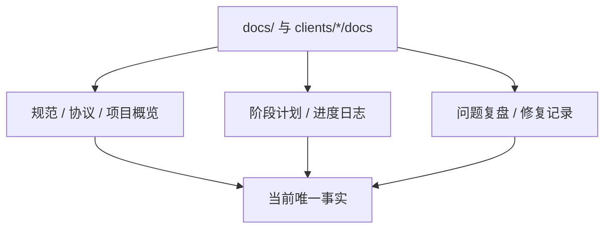

# 原始文档归类索引

> 本文件把原始文档归类为证据源。它不是当前状态本身；当前状态见 [README.md](README.md) 和各模块文档。

> **体素空间当前口径（2026-07-21）**：完整 XYZ 是唯一权威设计。默认近场 `3×3×3 tiles = 27 tiles = 9261 chunks`；单轴跨越一整个 tile 时，进入/退出各为 `3×3×1 = 9 tiles = 3087 chunks`，保留为 `18 tiles = 6174 chunks`。所有 XZ tile column、有限 Y 呈现带、固定 `Tile.Y=0` 的文档均已降为历史证据。Pure3D far 已接入唯一 `production_all_features` 开发根并完成 RG0–RG6 渲染治理；Online authority cutover 仍未开始，开发 WorldGen 根不得冒充在线生产事实源。

## 分类规则

- **规范类**：冻结架构、协议规范、项目概览，提供长期约束。
- **阶段类**：Phase、roadmap、implementation plan，提供能力落地顺序和状态证据。
- **复盘类**：bug 根因、修复记录、handoff，提供“为什么现在这样”的证据。
- **当前事实类**：`docs/00-current-truth/`，提供此刻唯一答案。

## 核心证据源

| 分类 | 文档 | 当前用途 |
| --- | --- | --- |
| 冻结规范 | [`docs/30-reference/overview/HEMIFUTURE-MMO-架构设计规范-v2.0.1-冻结稿.md`](../30-reference/overview/HEMIFUTURE-MMO-架构设计规范-v2.0.1-冻结稿.md) | 最高层架构约束和合规判据 |
| 项目概览 | [`docs/30-reference/overview/2026-04-10-项目概览.md`](../30-reference/overview/2026-04-10-项目概览.md) | Umbrella 应用、项目定位、早期服务划分 |
| 协议 | [`docs/30-reference/protocol/2026-04-10-线协议规范.md`](../30-reference/protocol/2026-04-10-线协议规范.md) | 自定义二进制协议的长期参考 |
| 可观测性 | [`docs/30-reference/engineering/2026-04-12-cli-observability-debugging.md`](../30-reference/engineering/2026-04-12-cli-observability-debugging.md) | CLI / 日志优先的调试纪律 |
| 体素权威主索引 | [`docs/10-active/cross-cutting/voxel-server-authority-phase-overview.md`](../10-active/cross-cutting/voxel-server-authority-phase-overview.md) | Phase 1-8 状态索引 |
| 生产级体素世界 | [`docs/30-reference/engineering/2026-06-25-voxel-world-production-architecture.md`](../30-reference/engineering/2026-06-25-voxel-world-production-architecture.md) | region/world/streaming 目标架构与 tile 口径 |
| 正交设计原则 | [`docs/30-reference/overview/2026-06-27-架构设计指导思想-系统正交.md`](../30-reference/overview/2026-06-27-架构设计指导思想-系统正交.md) | 系统正交、自维护不变量、bug 诊断判据 |
| 体素唯一事实源 | [`docs/10-active/voxel-authority/2026-06-28-权威体素唯一事实源-噪声降为migration.md`](../10-active/voxel-authority/2026-06-28-权威体素唯一事实源-噪声降为migration.md) | WorldGen 噪声降级为 migration 的地基决策 |
| 体素/远景历史整合 | [`docs/20-archive/client/2026-06-28-体素世界与远景渲染-历史整合.md`](../20-archive/client/2026-06-28-体素世界与远景渲染-历史整合.md) | 历史近场/远景/LOD/skirt/远程交互整合稿；不再提供当前空间契约 |
| Voxia streaming 历史证据 | [`clients/Voxia/docs/2026-06-28-streaming-window-follow-fix.md`](../../clients/Voxia/docs/2026-06-28-streaming-window-follow-fix.md) | 旧近场窗口跟随、debug overlay、stdio CLI 与 route repair 证据；不定义当前 XYZ 窗口 |
| 远景 LOD 历史根因 | [`clients/Voxia/docs/2026-06-28-远景LOD-heightmap-设计与拼接缝隙根因.md`](../../clients/Voxia/docs/2026-06-28-远景LOD-heightmap-设计与拼接缝隙根因.md) | heightmap LOD 和拼接缝隙历史根因；取数源、空间与生产路线均已被后续决策取代 |
| baseline 边界决策 | [`docs/30-reference/protocol/2026-06-29-voxel-baseline-streaming-boundary.md`](../30-reference/protocol/2026-06-29-voxel-baseline-streaming-boundary.md) | 确定性 WorldGen + committed delta + hash 凭证；存储/流送/计算三边界；垂直分层 + 范围声明 |
| baseline / streaming 历史实施计划 | [`docs/20-archive/voxel-authority/2026-06-30-voxel-generation-streaming-client-plan.md`](../20-archive/voxel-authority/2026-06-30-voxel-generation-streaming-client-plan.md) | 历史 Phase 0-8 执行序列；H、H gate、canonical 术语仍可查证，旧窗口形状不再是当前契约 |
| WorldGen v1 旧算法稿 | [`docs/20-archive/voxel-authority/2026-06-30-worldgen-v1-deterministic-terrain-design.md`](../20-archive/voxel-authority/2026-06-30-worldgen-v1-deterministic-terrain-design.md) | 历史 2.5D 算法输入；已被纯 3D canonical chunk 契约取代 |
| 旧同步 / 窗口 / 渲染设计 | [`docs/20-archive/voxel-authority/2026-06-29-voxel-sync-window-and-render-design.md`](../20-archive/voxel-authority/2026-06-29-voxel-sync-window-and-render-design.md) | 历史 HOW 证据；其中 XZ column、有限 Y 与旧窗口预算不再有效 |
| 里程碑 A 扩展：完整 3D 与客户端流送 | [`docs/10-active/voxel-far-field/2026-07-12-pure-3d-voxel-shell-migration.md`](../10-active/voxel-far-field/2026-07-12-pure-3d-voxel-shell-migration.md) | **唯一现役上位主线**；完整 XYZ、canonical source、Pure3D far、原子 presentation、跨 LOD exact-surface material 与遗留退役均已在客户端开发根收口；B/C 未开始 |
| A10 WorldGen 完整客户端 3D 滑动世界 | [`docs/10-active/voxel-far-field/2026-07-12-a10-cancellable-incremental-voxel-shell-streaming.md`](../10-active/voxel-far-field/2026-07-12-a10-cancellable-incremental-voxel-shell-streaming.md) | 客户端执行证据：唯一根、root-owned source identity、H-gated local provider、far diff/residency/cancel/shared-artifact/parallel-surface/stable-patch、full oracle、三轴 route、target-latch 活性、逐 Tile transaction 与 VXP5 surface-coverage v4 已实跑 |
| Voxia 近远景 Tile 交接修复 | [`docs/10-active/voxel-far-field/2026-07-22-near-far-tile-handoff-repair.md`](../10-active/voxel-far-field/2026-07-22-near-far-tile-handoff-repair.md) | 2026-07-22 双显/缺墙证据及真实 renderer sink、target latch、有界 near mesh、shared renderer contract 的 closeout；actual LOD material-id 后续由 2026-07-23 专项独立关闭 |
| Voxia Far LOD 表面材质语义修复 | [`docs/10-active/voxel-far-field/2026-07-23-far-lod-surface-material-semantic-repair.md`](../10-active/voxel-far-field/2026-07-23-far-lod-surface-material-semantic-repair.md) | 已完成；VXP5 exact surface coverage reducer、live material receipt、旧产物拒绝、最终 ownership MID，以及 near boundary、completed-successor、same-window candidate refresh 与 exact far live identity 的全量、Null-RHI、Real-RHI 和严格审查证据 |
| Voxia 远景渲染 RG0–RG6 | [`docs/10-active/voxel-far-field/2026-07-21-voxia-far-render-governance-design.md`](../10-active/voxel-far-field/2026-07-21-voxia-far-render-governance-design.md) · [`implementation plan`](../10-active/voxel-far-field/2026-07-21-voxia-far-render-governance-implementation-plan.md) | 当前客户端渲染真相：原子提交、稳定 UV、AO/sky、唯一环境、自然材质、冻结质量档与 RG6 Real-RHI/30 分钟证据 |
| Voxia 阶段 2/3 世界占用与 Prefab runtime | [`design`](../10-active/cross-cutting/2026-07-21-voxia-phase2-phase3-world-occupancy-and-prefab-runtime-design.md) · [`阶段 2 plan`](../10-active/cross-cutting/2026-07-21-voxia-phase2-macro-voxel-interaction-implementation-plan.md) · [`阶段 3 plan`](../10-active/cross-cutting/2026-07-21-voxia-phase3-prefab-world-runtime-implementation-plan.md) | 普通宏格先行、微格只服务 prefab、唯一 confirmed aggregate、Mock 先行、Online 后置；阶段 2 已实现并经 fresh 双审 closeout，阶段 3 尚未实施 |
| Voxia SVO 预览设计（历史） | [`docs/20-archive/voxel-far-field/2026-06-30-voxia-svo-preview-design.md`](../20-archive/voxel-far-field/2026-06-30-voxia-svo-preview-design.md) | 历史 3D occupancy preview 与性能目标证据；不定义当前 shell/page/live 契约 |
| Voxia 近场窗口内核与 SVO 路线 | [`docs/20-archive/voxel-far-field/2026-06-30-voxia-near-window-kernel-and-svo-roadmap.md`](../20-archive/voxel-far-field/2026-06-30-voxia-near-window-kernel-and-svo-roadmap.md) | 按系统正交剥离 `3x3x3 tile` 近场窗口契约，并记录后续 subsystem / renderer / SVO page 化升级目标 |
| 体素 LOD 历史生产路线 | [`docs/20-archive/voxel-far-field/2026-07-05-voxia-voxel-lod-production-route.md`](../20-archive/voxel-far-field/2026-07-05-voxia-voxel-lod-production-route.md) | 历史 L0-L4 路线；其中 XZ/column 运行时和 raymarch 候选口径已被当前纯 3D 作战主线取代 |
| LOD 外部方案评审 | [`docs/20-archive/voxel-far-field/2026-07-06-gpt55-lod23-proposal-review.md`](../20-archive/voxel-far-field/2026-07-06-gpt55-lod23-proposal-review.md) | GPT-5.5 远景方案对抗评审：数据源裁决、16 条采纳矩阵、UE 5.8 能力边界实证、LOD 预算数学 |
| Terrain-only / tile pop / 材质统一（历史） | [`docs/20-archive/voxel-far-field/phase-terrain-only-tilepop-material-unify.md`](../20-archive/voxel-far-field/phase-terrain-only-tilepop-material-unify.md) | 历史列源与材质迁移证据；不得恢复为当前空间模型 |
| 远景时序稳定 / 无缝流送（历史） | [`docs/20-archive/voxel-far-field/phase-far-temporal-stability-and-seamless-streaming.md`](../20-archive/voxel-far-field/phase-far-temporal-stability-and-seamless-streaming.md) | 历史 2.5D live 管线的时序、增量与预取证据 |
| LOD 分层与技术选型（历史） | [`docs/20-archive/voxel-far-field/2026-07-06-voxia-lod-layering-and-technology-design.md`](../20-archive/voxel-far-field/2026-07-06-voxia-lod-layering-and-technology-design.md) | 历史分层选型与预算证据；当前空间与切流契约以纯 3D 作战主线为准 |
| 数据源终态裁决 | [`docs/30-reference/contracts/2026-07-06-projection-route-final-decision.md`](../30-reference/contracts/2026-07-06-projection-route-final-decision.md) | 投影路线为终态；同构路线降格为定向优化选项；客户端 WorldGen 永久 preview/fixture 定位 |
| 体素数据链路术语表 | [`docs/30-reference/protocol/glossary.md`](../30-reference/protocol/glossary.md) | base / delta / overlay / truth / snapshot 统一口径；Online 客户端 snapshot/delta-only 推论；远区修改回流回路 |
| Field roadmap | [`docs/10-active/field-emergence/2026-05-16-phase7-local-field-runtime-roadmap.md`](../10-active/field-emergence/2026-05-16-phase7-local-field-runtime-roadmap.md) | Phase 7+ 局部场当前推进基准 |
| Field kernel | [`docs/10-active/field-emergence/2026-05-14-phase7-field-kernel-architecture.md`](../10-active/field-emergence/2026-05-14-phase7-field-kernel-architecture.md) | FieldKernel / FieldRegion / FieldLayer / FieldEffect 架构背景 |

## 按功能归档视图

### 服务端控制面

- [`docs/30-reference/engineering/2026-06-25-voxel-world-production-architecture.md`](../30-reference/engineering/2026-06-25-voxel-world-production-architecture.md)
- [`apps/world_server/lib/world_server/voxel/README.md`](../../apps/world_server/lib/world_server/voxel/README.md)
- [`docs/20-archive/voxel-authority/phase-A4-cross-region-prefab.md`](../20-archive/voxel-authority/phase-A4-cross-region-prefab.md)
- [`docs/10-active/cross-cutting/_session-handoff.md`](../10-active/cross-cutting/_session-handoff.md)

### 体素权威与存储

- [`docs/30-reference/protocol/2026-04-29-server-authoritative-voxel-data-protocol-design.md`](../30-reference/protocol/2026-04-29-server-authoritative-voxel-data-protocol-design.md)
- [`docs/20-archive/voxel-authority/phase-1a-refined-cell-domain.md`](../20-archive/voxel-authority/phase-1a-refined-cell-domain.md)
- [`docs/20-archive/voxel-authority/phase-1b-typed-edit-intent.md`](../20-archive/voxel-authority/phase-1b-typed-edit-intent.md)
- [`docs/20-archive/voxel-authority/phase-1c-refined-mutation.md`](../20-archive/voxel-authority/phase-1c-refined-mutation.md)
- [`docs/20-archive/voxel-authority/phase-1d-canonical-persistence.md`](../20-archive/voxel-authority/phase-1d-canonical-persistence.md)
- [`docs/10-active/voxel-authority/2026-06-28-权威体素唯一事实源-噪声降为migration.md`](../10-active/voxel-authority/2026-06-28-权威体素唯一事实源-噪声降为migration.md)
- [`docs/30-reference/protocol/2026-06-29-voxel-baseline-streaming-boundary.md`](../30-reference/protocol/2026-06-29-voxel-baseline-streaming-boundary.md)
- [`docs/20-archive/voxel-authority/2026-06-29-voxel-sync-window-and-render-design.md`](../20-archive/voxel-authority/2026-06-29-voxel-sync-window-and-render-design.md)（历史）
- [`docs/20-archive/voxel-authority/2026-06-30-voxel-generation-streaming-client-plan.md`](../20-archive/voxel-authority/2026-06-30-voxel-generation-streaming-client-plan.md)（历史）
- [`docs/20-archive/voxel-authority/2026-06-30-worldgen-v1-deterministic-terrain-design.md`](../20-archive/voxel-authority/2026-06-30-worldgen-v1-deterministic-terrain-design.md)（历史）
- [`docs/10-active/voxel-far-field/2026-07-12-pure-3d-voxel-shell-migration.md`](../10-active/voxel-far-field/2026-07-12-pure-3d-voxel-shell-migration.md)（现役）
- [`docs/10-active/voxel-far-field/2026-07-12-a10-cancellable-incremental-voxel-shell-streaming.md`](../10-active/voxel-far-field/2026-07-12-a10-cancellable-incremental-voxel-shell-streaming.md)（A10 执行稿）
- [`docs/30-reference/contracts/2026-07-06-projection-route-final-decision.md`](../30-reference/contracts/2026-07-06-projection-route-final-decision.md)
- [`docs/30-reference/protocol/glossary.md`](../30-reference/protocol/glossary.md)

### 体素事务、Prefab、Object

- [`docs/20-archive/voxel-authority/phase-3-prefab-v2-transactions.md`](../20-archive/voxel-authority/phase-3-prefab-v2-transactions.md)
- [`docs/20-archive/voxel-authority/phase-3-bis-fence-and-resume.md`](../20-archive/voxel-authority/phase-3-bis-fence-and-resume.md)
- [`docs/20-archive/voxel-authority/phase-4-object-provenance.md`](../20-archive/voxel-authority/phase-4-object-provenance.md)
- [`docs/20-archive/voxel-authority/phase-4-bis-object-state-delta-push.md`](../20-archive/voxel-authority/phase-4-bis-object-state-delta-push.md)
- [`docs/20-archive/voxel-authority/phase-A4-cross-region-prefab.md`](../20-archive/voxel-authority/phase-A4-cross-region-prefab.md)

### 局部场与涌现

- [`docs/10-active/field-emergence/2026-05-16-phase7-local-field-runtime-roadmap.md`](../10-active/field-emergence/2026-05-16-phase7-local-field-runtime-roadmap.md)
- [`docs/10-active/field-emergence/2026-05-14-phase7-field-kernel-architecture.md`](../10-active/field-emergence/2026-05-14-phase7-field-kernel-architecture.md)
- [`docs/10-active/field-emergence/2026-05-19-prefab-field-participant-projection.md`](../10-active/field-emergence/2026-05-19-prefab-field-participant-projection.md)
- [`docs/20-archive/field-emergence/2026-06-14-emergence-reaction-layer.md`](../20-archive/field-emergence/2026-06-14-emergence-reaction-layer.md)
- [`docs/30-reference/overview/2026-06-16-orthogonal-systems-architecture.md`](../30-reference/overview/2026-06-16-orthogonal-systems-architecture.md)
- [`docs/20-archive/field-emergence/2026-06-17-S4-chemistry-oxidation-system.md`](../20-archive/field-emergence/2026-06-17-S4-chemistry-oxidation-system.md)
- [`docs/20-archive/field-emergence/2026-06-21-emergent-optics-thermal-incandescence.md`](../20-archive/field-emergence/2026-06-21-emergent-optics-thermal-incandescence.md)
- [`docs/20-archive/field-emergence/2026-06-23-light-as-orthogonal-system.md`](../20-archive/field-emergence/2026-06-23-light-as-orthogonal-system.md)
- [`docs/20-archive/field-emergence/2026-06-23-mechanical-stress-structural-collapse.md`](../20-archive/field-emergence/2026-06-23-mechanical-stress-structural-collapse.md)
- [`docs/20-archive/field-emergence/2026-06-24-c4b-deep-semiconductor.md`](../20-archive/field-emergence/2026-06-24-c4b-deep-semiconductor.md)

### 建设 / Prefab / Surface

- [`docs/20-archive/voxel-authority/phase-3-prefab-v2-transactions.md`](../20-archive/voxel-authority/phase-3-prefab-v2-transactions.md)
- [`docs/20-archive/voxel-authority/phase-4-object-provenance.md`](../20-archive/voxel-authority/phase-4-object-provenance.md)
- [`docs/20-archive/voxel-authority/phase-A4-cross-region-prefab.md`](../20-archive/voxel-authority/phase-A4-cross-region-prefab.md)
- [`docs/10-active/voxel-authority/2026-06-17-unit-morphology-and-surface-element-layer.md`](../10-active/voxel-authority/2026-06-17-unit-morphology-and-surface-element-layer.md)
- [`docs/20-archive/field-emergence/2026-06-23-construction-system-fixed-component-list.md`](../20-archive/field-emergence/2026-06-23-construction-system-fixed-component-list.md)

### 客户端与渲染

- [`clients/Voxia/docs/2026-06-28-streaming-window-follow-fix.md`](../../clients/Voxia/docs/2026-06-28-streaming-window-follow-fix.md)
- [`clients/Voxia/docs/2026-06-28-远景LOD-heightmap-设计与拼接缝隙根因.md`](../../clients/Voxia/docs/2026-06-28-远景LOD-heightmap-设计与拼接缝隙根因.md)
- [`clients/Voxia/docs/2026-06-26-voxel-perf-optimization-directive.md`](../../clients/Voxia/docs/2026-06-26-voxel-perf-optimization-directive.md)
- [`docs/90-obsolete/voxel-far-field/2026-06-30-voxia-vhi-experiment-plan.md`](../90-obsolete/voxel-far-field/2026-06-30-voxia-vhi-experiment-plan.md)
- [`docs/20-archive/voxel-far-field/2026-06-30-voxia-svo-preview-design.md`](../20-archive/voxel-far-field/2026-06-30-voxia-svo-preview-design.md)
- [`docs/90-obsolete/client/2026-06-15-bevy-client-mainline-architecture.md`](../90-obsolete/client/2026-06-15-bevy-client-mainline-architecture.md)
- [`docs/20-archive/client/2026-04-25-bevy-client-web-parity-voxel-migration.md`](../20-archive/client/2026-04-25-bevy-client-web-parity-voxel-migration.md)
- [`docs/20-archive/voxel-far-field/2026-07-05-voxia-voxel-lod-production-route.md`](../20-archive/voxel-far-field/2026-07-05-voxia-voxel-lod-production-route.md)（历史）
- [`docs/20-archive/voxel-far-field/2026-07-06-gpt55-lod23-proposal-review.md`](../20-archive/voxel-far-field/2026-07-06-gpt55-lod23-proposal-review.md)
- [`docs/20-archive/voxel-far-field/2026-07-06-voxia-lod-layering-and-technology-design.md`](../20-archive/voxel-far-field/2026-07-06-voxia-lod-layering-and-technology-design.md)（历史）
- [`docs/20-archive/voxel-far-field/2026-07-11-3d-lod-sliding-window.md`](../20-archive/voxel-far-field/2026-07-11-3d-lod-sliding-window.md)（历史过渡设计）
- [`docs/20-archive/voxel-far-field/2026-07-11-near-far-presentation-handoff.md`](../20-archive/voxel-far-field/2026-07-11-near-far-presentation-handoff.md)（历史交接实现证据）
- [`docs/10-active/voxel-far-field/2026-07-12-pure-3d-voxel-shell-migration.md`](../10-active/voxel-far-field/2026-07-12-pure-3d-voxel-shell-migration.md)（唯一现役作战主线）
- [`docs/10-active/voxel-far-field/2026-07-21-voxia-far-render-governance-design.md`](../10-active/voxel-far-field/2026-07-21-voxia-far-render-governance-design.md)（现役渲染治理真相）
- **VLOD A1-A5（历史实现证据）**：[`phase-vlod-a1-explicit-tiering.md`](../20-archive/voxel-far-field/phase-vlod-a1-explicit-tiering.md) · [`phase-vlod-a2-partitioned-staticdraw.md`](../20-archive/voxel-far-field/phase-vlod-a2-partitioned-staticdraw.md) · [`phase-vlod-a3-per-cell-greedy-merge.md`](../20-archive/voxel-far-field/phase-vlod-a3-per-cell-greedy-merge.md) · [`phase-vlod-a3b-per-cell-greedy-merge.md`](../20-archive/voxel-far-field/phase-vlod-a3b-per-cell-greedy-merge.md) · [`phase-vlod-a4-seam-fade-collar.md`](../20-archive/voxel-far-field/phase-vlod-a4-seam-fade-collar.md) · [`phase-terrain-only-tilepop-material-unify.md`](../20-archive/voxel-far-field/phase-terrain-only-tilepop-material-unify.md)。它们完成不代表扩展后的 A10 已完成。
- **Voxia A6-A7（历史实现证据）**：[`phase-far-temporal-stability-and-seamless-streaming.md`](../20-archive/voxel-far-field/phase-far-temporal-stability-and-seamless-streaming.md) · [`2026-07-11-near-far-presentation-handoff.md`](../20-archive/voxel-far-field/2026-07-11-near-far-presentation-handoff.md)。A8-A9 为 pure-3D 单 generation 基础；A10 当前执行见 [`WorldGen 完整客户端滑动世界作战任务`](../10-active/voxel-far-field/2026-07-12-a10-cancellable-incremental-voxel-shell-streaming.md)。

### 已明确被后续文档取代的结论

| 旧结论 | 当前结论 | 替代证据 |
| --- | --- | --- |
| 远景 heightmap 可长期运行时重跑噪声作为事实源 | 噪声只能是一次性 migration；远景 LOD 应派生自权威体素 store | [`2026-06-28-权威体素唯一事实源-噪声降为migration.md`](../10-active/voxel-authority/2026-06-28-权威体素唯一事实源-噪声降为migration.md) |
| 运行时 snapshot/resync 可作为本地基线缺失兜底 | 本地基线校验失败必须拒绝入场，不允许 snapshot 兜底 | [`AGENTS.md`](../../AGENTS.md) §3、[`2026-06-25-voxel-world-production-architecture.md`](../30-reference/engineering/2026-06-25-voxel-world-production-architecture.md) §3.2.0 |
| 移动导致挖放失效 | 根因判据应按订阅覆盖与活性正交分析；移动常是红鲱鱼 | [`2026-06-27-架构设计指导思想-系统正交.md`](../30-reference/overview/2026-06-27-架构设计指导思想-系统正交.md) |
| 27 tile 可按 27 chunk 估算，或相邻移动只进入 3 个 XZ columns | 1 tile = `7×7×7 = 343 chunks`；近场 `3×3×3 = 27 tiles = 9261 chunks`。单轴跨一 tile 的进入/退出面各为 `9 tiles = 3087 chunks`，保留 `18 tiles = 6174 chunks` | [`2026-07-12-pure-3d-voxel-shell-migration.md`](../10-active/voxel-far-field/2026-07-12-pure-3d-voxel-shell-migration.md) |
| `state_flags` 承载 burning/frozen/wet/charred 外观 | 客户端外观应为 material/tag/field 的纯函数，`state_flags` 不作为通用涌现外观位 | [`clients/Voxia/docs/2026-06-27-voxia-emergence-render-design.md`](../../clients/Voxia/docs/2026-06-27-voxia-emergence-render-design.md) |
| 客户端长期应本地重算 Online confirmed baseline（seed+maps+D+H，跨端 bit-exact） | 投影路线为终态：Online 客户端 snapshot/delta-only（近窗 1m + 远区 7m 投影），配方不跨 wire；离线 Mock 是显式 session-local authority，不改变生产路线 | [`docs/30-reference/contracts/2026-07-06-projection-route-final-decision.md`](../30-reference/contracts/2026-07-06-projection-route-final-decision.md) |
| 远景 2.5D heightmap / VHI 是生产终态形态 | 当前唯一目标是完整 XYZ cube-shell + 3D canonical pages + exact surface；旧 2.5D 方案仅归档。A10 开发根已 live，但在线 production 尚未接线，不能把开发根或 probe 当 authority cutover | [`2026-07-12-pure-3d-voxel-shell-migration.md`](../10-active/voxel-far-field/2026-07-12-pure-3d-voxel-shell-migration.md) |
| WorldGen/streaming 可以保留 2.5D heightmap 或全高度 column 作为公共内容模型 | WorldGen 只公开三维 canonical chunk；streaming/LOD/cache/render 全部使用 XYZ cell/page identity，旧列路径只允许作为归档证据，不是兼容运行时 | [`2026-07-12-pure-3d-voxel-shell-migration.md`](../10-active/voxel-far-field/2026-07-12-pure-3d-voxel-shell-migration.md) |
| 原 A1-A5 完成后应立即进入里程碑 B | A 已扩展至 A10；唯一根、source identity、增量链、三轴 route、presentation transaction 与 Far LOD 外露材质归约均已实跑关闭。阶段 3 尚未启动；Online/B/C 仍须独立开工 | [`2026-07-23-far-lod-surface-material-semantic-repair.md`](../10-active/voxel-far-field/2026-07-23-far-lod-surface-material-semantic-repair.md) |
| raymarch 作为 L4 defer 或 B 的 AB 保温任务 | 真实 RHI 再次复现 3D/Compute 队列超时后，raymarch 已退出当前路线与 backlog；L4 仅保留需求触发器，renderer 重新选型 | [`2026-07-06-voxia-lod-layering-and-technology-design.md`](../20-archive/voxel-far-field/2026-07-06-voxia-lod-layering-and-technology-design.md) |
| 8km device-removal 根因 = 远景几何 overdraw 超 TDR，靠 merge（A3）根治；FPS 门槛受 overdraw 物理约束不可达 | **归因经 A3.0 反转**：真凶是 raymarch probe dispatch × proxy-mesh go-live 的 GPU 跨队列时序竞态（潜伏 UB），与 overdraw/quad 数正交；修复 = raymarch 默认关（`Voxia@1fc93d2`），已达成 8km 默认 Lumen 稳态无 device-removal；merge 迁出为 A3b 纯几何优化。FPS 实为像素-bound、Lumen GI 为最大杠杆 | [`phase-vlod-a3-per-cell-greedy-merge.md`](../20-archive/voxel-far-field/phase-vlod-a3-per-cell-greedy-merge.md) §8/§9、[`phase-vlod-a3b-per-cell-greedy-merge.md`](../20-archive/voxel-far-field/phase-vlod-a3b-per-cell-greedy-merge.md) |
