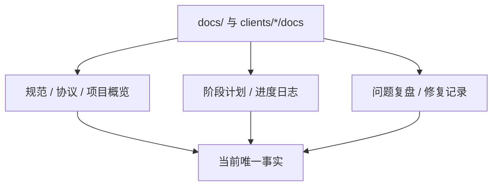

# 原始文档归类索引

> 本文件把原始文档归类为证据源。它不是当前状态本身；当前状态见 [README.md](README.md) 和各模块文档。

## 分类规则

- **规范类**：冻结架构、协议规范、项目概览，提供长期约束。
- **阶段类**：Phase、roadmap、implementation plan，提供能力落地顺序和状态证据。
- **复盘类**：bug 根因、修复记录、handoff，提供“为什么现在这样”的证据。
- **当前事实类**：`docs/00-current-truth/`，提供此刻唯一答案。

## 核心证据源

| 分类 | 文档 | 当前用途 |
| --- | --- | --- |
| 冻结规范 | [`docs/30-reference/overview/HEMIFUTURE-MMO-架构设计规范-v2.0.1-冻结稿.md`](../30-reference/overview/HEMIFUTURE-MMO-架构设计规范-v2.0.1-冻结稿.md) | 最高层架构约束和合规判据 |
| 项目概览 | [`docs/30-reference/overview/2026-04-10-项目概览.md`](../30-reference/overview/2026-04-10-项目概览.md) | Umbrella 应用、项目定位、早期服务划分 |
| 协议 | [`docs/30-reference/protocol/2026-04-10-线协议规范.md`](../30-reference/protocol/2026-04-10-线协议规范.md) | 自定义二进制协议的长期参考 |
| 可观测性 | [`docs/30-reference/engineering/2026-04-12-cli-observability-debugging.md`](../30-reference/engineering/2026-04-12-cli-observability-debugging.md) | CLI / 日志优先的调试纪律 |
| 体素权威主索引 | [`docs/10-active/cross-cutting/voxel-server-authority-phase-overview.md`](../10-active/cross-cutting/voxel-server-authority-phase-overview.md) | Phase 1-8 状态索引 |
| 生产级体素世界 | [`docs/30-reference/engineering/2026-06-25-voxel-world-production-architecture.md`](../30-reference/engineering/2026-06-25-voxel-world-production-architecture.md) | region/world/streaming 目标架构与 tile 口径 |
| 正交设计原则 | [`docs/30-reference/overview/2026-06-27-架构设计指导思想-系统正交.md`](../30-reference/overview/2026-06-27-架构设计指导思想-系统正交.md) | 系统正交、自维护不变量、bug 诊断判据 |
| 体素唯一事实源 | [`docs/10-active/voxel-authority/2026-06-28-权威体素唯一事实源-噪声降为migration.md`](../10-active/voxel-authority/2026-06-28-权威体素唯一事实源-噪声降为migration.md) | WorldGen 噪声降级为 migration 的地基决策 |
| 体素/远景整合 | [`docs/00-current-truth/2026-06-28-体素世界与远景渲染-当前真相-整合.md`](2026-06-28-体素世界与远景渲染-当前真相-整合.md) | 近场/远景/LOD/skirt/远程交互当前整合草稿 |
| Voxia streaming | [`clients/Voxia/docs/2026-06-28-streaming-window-follow-fix.md`](../../clients/Voxia/docs/2026-06-28-streaming-window-follow-fix.md) | UE 客户端近场窗口跟随、debug overlay、stdio CLI、server route repair |
| 远景 LOD 根因 | [`clients/Voxia/docs/2026-06-28-远景LOD-heightmap-设计与拼接缝隙根因.md`](../../clients/Voxia/docs/2026-06-28-远景LOD-heightmap-设计与拼接缝隙根因.md) | heightmap LOD 和拼接缝隙根因；取数源部分已被唯一事实源取代 |
| baseline 边界决策 | [`docs/30-reference/protocol/2026-06-29-voxel-baseline-streaming-boundary.md`](../30-reference/protocol/2026-06-29-voxel-baseline-streaming-boundary.md) | 确定性 WorldGen + committed delta + hash 凭证；存储/流送/计算三边界；垂直分层 + 范围声明 |
| baseline / streaming 实施计划 | [`docs/10-active/voxel-authority/2026-06-30-voxel-generation-streaming-client-plan.md`](../10-active/voxel-authority/2026-06-30-voxel-generation-streaming-client-plan.md) | 体素生成、流送、Voxia 本地加载与渲染迁移的 Phase 0-8 执行序列；含 H、H gate、canonical 等名词解释 |
| WorldGen v1 旧算法稿 | [`docs/10-active/voxel-authority/2026-06-30-worldgen-v1-deterministic-terrain-design.md`](../10-active/voxel-authority/2026-06-30-worldgen-v1-deterministic-terrain-design.md) | 历史 2.5D 算法输入；已被纯 3D canonical chunk 契约取代 |
| 纯 3D 体素立方壳迁移 | [`docs/10-active/voxel-far-field/2026-07-12-pure-3d-voxel-shell-migration.md`](../10-active/voxel-far-field/2026-07-12-pure-3d-voxel-shell-migration.md) | 当前主线；cube-shell、canonical source、3D occupancy/material mip、exact surface、世界对齐 renderer adapter、原子 presentation 与遗留退役 |
| Voxia VHI 实验 | [`docs/90-obsolete/voxel-far-field/2026-06-30-voxia-vhi-experiment-plan.md`](../90-obsolete/voxel-far-field/2026-06-30-voxia-vhi-experiment-plan.md) | 新关卡试验 Voxel Hierarchical Impostor；旧 WorldGen preview 与 heightmap LOD 保留 |
| Voxia SVO 预览设计 | [`docs/20-archive/voxel-far-field/2026-06-30-voxia-svo-preview-design.md`](../20-archive/voxel-far-field/2026-06-30-voxia-svo-preview-design.md) | 新关卡试验 3D occupancy Sparse Voxel Octree leaf surface；目标为窗口边缘连续、约 8km 远景和 120 FPS 预算 |
| Voxia 近场窗口内核与 SVO 路线 | [`docs/20-archive/voxel-far-field/2026-06-30-voxia-near-window-kernel-and-svo-roadmap.md`](../20-archive/voxel-far-field/2026-06-30-voxia-near-window-kernel-and-svo-roadmap.md) | 按系统正交剥离 `3x3x3 tile` 近场窗口契约，并记录后续 subsystem / renderer / SVO page 化升级目标 |
| 体素 LOD 生产路线 | [`docs/30-reference/overview/2026-07-05-voxia-voxel-lod-production-route.md`](../30-reference/overview/2026-07-05-voxia-voxel-lod-production-route.md) | 拍板 L0 近景 + L1-L3 SVO mesh 默认生产渲染 + L4 raymarch 可选；VHI 冻结为 2.5D 过渡 baseline |
| LOD 外部方案评审 | [`docs/20-archive/voxel-far-field/2026-07-06-gpt55-lod23-proposal-review.md`](../20-archive/voxel-far-field/2026-07-06-gpt55-lod23-proposal-review.md) | GPT-5.5 远景方案对抗评审：数据源裁决、16 条采纳矩阵、UE 5.8 能力边界实证、LOD 预算数学 |
| Terrain-only / tile pop / 材质统一 | [`docs/10-active/voxel-far-field/phase-terrain-only-tilepop-material-unify.md`](../10-active/voxel-far-field/phase-terrain-only-tilepop-material-unify.md) | WorldGen terrain-only、列源 Y identity、patch 原子换入、近远 UV/FlatShading/CastShadow/dither 材质统一及真实 RHI 证据 |
| 远景时序稳定 / 无缝流送 | [`docs/10-active/voxel-far-field/phase-far-temporal-stability-and-seamless-streaming.md`](../10-active/voxel-far-field/phase-far-temporal-stability-and-seamless-streaming.md) | TSR/dither/VSM A/B、patch-native 真增量、预测预取、生产 source-page/artifact pack 的当前实施稿 |
| LOD 分层与技术选型 | [`docs/30-reference/overview/2026-07-06-voxia-lod-layering-and-technology-design.md`](../30-reference/overview/2026-07-06-voxia-lod-layering-and-technology-design.md) | v2.5 主体已拍板：四环 7/14/28/56m + collar、每层选型、page payload/失效契约、三列里程碑（A/B/C） |
| 数据源终态裁决 | [`docs/30-reference/contracts/2026-07-06-projection-route-final-decision.md`](../30-reference/contracts/2026-07-06-projection-route-final-decision.md) | 投影路线为终态；同构路线降格为定向优化选项；客户端 WorldGen 永久 preview/fixture 定位 |
| 体素数据链路术语表 | [`docs/30-reference/protocol/glossary.md`](../30-reference/protocol/glossary.md) | base / delta / overlay / truth / snapshot 统一口径；客户端 snapshot-only 推论；远区修改回流回路 |
| Field roadmap | [`docs/10-active/field-emergence/2026-05-16-phase7-local-field-runtime-roadmap.md`](../10-active/field-emergence/2026-05-16-phase7-local-field-runtime-roadmap.md) | Phase 7+ 局部场当前推进基准 |
| Field kernel | [`docs/10-active/field-emergence/2026-05-14-phase7-field-kernel-architecture.md`](../10-active/field-emergence/2026-05-14-phase7-field-kernel-architecture.md) | FieldKernel / FieldRegion / FieldLayer / FieldEffect 架构背景 |

## 按功能归档视图

### 服务端控制面

- [`docs/30-reference/engineering/2026-06-25-voxel-world-production-architecture.md`](../30-reference/engineering/2026-06-25-voxel-world-production-architecture.md)
- [`apps/world_server/lib/world_server/voxel/README.md`](../../apps/world_server/lib/world_server/voxel/README.md)
- [`docs/20-archive/voxel-authority/phase-A4-cross-region-prefab.md`](../20-archive/voxel-authority/phase-A4-cross-region-prefab.md)
- [`docs/10-active/cross-cutting/_session-handoff.md`](../10-active/cross-cutting/_session-handoff.md)

### 体素权威与存储

- [`docs/30-reference/protocol/2026-04-29-server-authoritative-voxel-data-protocol-design.md`](../30-reference/protocol/2026-04-29-server-authoritative-voxel-data-protocol-design.md)
- [`docs/20-archive/voxel-authority/phase-1a-refined-cell-domain.md`](../20-archive/voxel-authority/phase-1a-refined-cell-domain.md)
- [`docs/20-archive/voxel-authority/phase-1b-typed-edit-intent.md`](../20-archive/voxel-authority/phase-1b-typed-edit-intent.md)
- [`docs/20-archive/voxel-authority/phase-1c-refined-mutation.md`](../20-archive/voxel-authority/phase-1c-refined-mutation.md)
- [`docs/20-archive/voxel-authority/phase-1d-canonical-persistence.md`](../20-archive/voxel-authority/phase-1d-canonical-persistence.md)
- [`docs/10-active/voxel-authority/2026-06-28-权威体素唯一事实源-噪声降为migration.md`](../10-active/voxel-authority/2026-06-28-权威体素唯一事实源-噪声降为migration.md)
- [`docs/30-reference/protocol/2026-06-29-voxel-baseline-streaming-boundary.md`](../30-reference/protocol/2026-06-29-voxel-baseline-streaming-boundary.md)
- [`docs/10-active/voxel-authority/2026-06-30-voxel-generation-streaming-client-plan.md`](../10-active/voxel-authority/2026-06-30-voxel-generation-streaming-client-plan.md)
- [`docs/10-active/voxel-authority/2026-06-30-worldgen-v1-deterministic-terrain-design.md`](../10-active/voxel-authority/2026-06-30-worldgen-v1-deterministic-terrain-design.md)
- [`docs/30-reference/contracts/2026-07-06-projection-route-final-decision.md`](../30-reference/contracts/2026-07-06-projection-route-final-decision.md)
- [`docs/30-reference/protocol/glossary.md`](../30-reference/protocol/glossary.md)

### 体素事务、Prefab、Object

- [`docs/20-archive/voxel-authority/phase-3-prefab-v2-transactions.md`](../20-archive/voxel-authority/phase-3-prefab-v2-transactions.md)
- [`docs/20-archive/voxel-authority/phase-3-bis-fence-and-resume.md`](../20-archive/voxel-authority/phase-3-bis-fence-and-resume.md)
- [`docs/20-archive/voxel-authority/phase-4-object-provenance.md`](../20-archive/voxel-authority/phase-4-object-provenance.md)
- [`docs/20-archive/voxel-authority/phase-4-bis-object-state-delta-push.md`](../20-archive/voxel-authority/phase-4-bis-object-state-delta-push.md)
- [`docs/20-archive/voxel-authority/phase-A4-cross-region-prefab.md`](../20-archive/voxel-authority/phase-A4-cross-region-prefab.md)

### 局部场与涌现

- [`docs/10-active/field-emergence/2026-05-16-phase7-local-field-runtime-roadmap.md`](../10-active/field-emergence/2026-05-16-phase7-local-field-runtime-roadmap.md)
- [`docs/10-active/field-emergence/2026-05-14-phase7-field-kernel-architecture.md`](../10-active/field-emergence/2026-05-14-phase7-field-kernel-architecture.md)
- [`docs/10-active/field-emergence/2026-05-19-prefab-field-participant-projection.md`](../10-active/field-emergence/2026-05-19-prefab-field-participant-projection.md)
- [`docs/20-archive/field-emergence/2026-06-14-emergence-reaction-layer.md`](../20-archive/field-emergence/2026-06-14-emergence-reaction-layer.md)
- [`docs/30-reference/overview/2026-06-16-orthogonal-systems-architecture.md`](../30-reference/overview/2026-06-16-orthogonal-systems-architecture.md)
- [`docs/20-archive/field-emergence/2026-06-17-S4-chemistry-oxidation-system.md`](../20-archive/field-emergence/2026-06-17-S4-chemistry-oxidation-system.md)
- [`docs/20-archive/field-emergence/2026-06-21-emergent-optics-thermal-incandescence.md`](../20-archive/field-emergence/2026-06-21-emergent-optics-thermal-incandescence.md)
- [`docs/20-archive/field-emergence/2026-06-23-light-as-orthogonal-system.md`](../20-archive/field-emergence/2026-06-23-light-as-orthogonal-system.md)
- [`docs/20-archive/field-emergence/2026-06-23-mechanical-stress-structural-collapse.md`](../20-archive/field-emergence/2026-06-23-mechanical-stress-structural-collapse.md)
- [`docs/20-archive/field-emergence/2026-06-24-c4b-deep-semiconductor.md`](../20-archive/field-emergence/2026-06-24-c4b-deep-semiconductor.md)

### 建设 / Prefab / Surface

- [`docs/20-archive/voxel-authority/phase-3-prefab-v2-transactions.md`](../20-archive/voxel-authority/phase-3-prefab-v2-transactions.md)
- [`docs/20-archive/voxel-authority/phase-4-object-provenance.md`](../20-archive/voxel-authority/phase-4-object-provenance.md)
- [`docs/20-archive/voxel-authority/phase-A4-cross-region-prefab.md`](../20-archive/voxel-authority/phase-A4-cross-region-prefab.md)
- [`docs/10-active/voxel-authority/2026-06-17-unit-morphology-and-surface-element-layer.md`](../10-active/voxel-authority/2026-06-17-unit-morphology-and-surface-element-layer.md)
- [`docs/20-archive/field-emergence/2026-06-23-construction-system-fixed-component-list.md`](../20-archive/field-emergence/2026-06-23-construction-system-fixed-component-list.md)

### 客户端与渲染

- [`clients/Voxia/docs/2026-06-28-streaming-window-follow-fix.md`](../../clients/Voxia/docs/2026-06-28-streaming-window-follow-fix.md)
- [`clients/Voxia/docs/2026-06-28-远景LOD-heightmap-设计与拼接缝隙根因.md`](../../clients/Voxia/docs/2026-06-28-远景LOD-heightmap-设计与拼接缝隙根因.md)
- [`clients/Voxia/docs/2026-06-26-voxel-perf-optimization-directive.md`](../../clients/Voxia/docs/2026-06-26-voxel-perf-optimization-directive.md)
- [`docs/90-obsolete/voxel-far-field/2026-06-30-voxia-vhi-experiment-plan.md`](../90-obsolete/voxel-far-field/2026-06-30-voxia-vhi-experiment-plan.md)
- [`docs/20-archive/voxel-far-field/2026-06-30-voxia-svo-preview-design.md`](../20-archive/voxel-far-field/2026-06-30-voxia-svo-preview-design.md)
- [`docs/90-obsolete/client/2026-06-15-bevy-client-mainline-architecture.md`](../90-obsolete/client/2026-06-15-bevy-client-mainline-architecture.md)
- [`docs/20-archive/client/2026-04-25-bevy-client-web-parity-voxel-migration.md`](../20-archive/client/2026-04-25-bevy-client-web-parity-voxel-migration.md)
- [`docs/30-reference/overview/2026-07-05-voxia-voxel-lod-production-route.md`](../30-reference/overview/2026-07-05-voxia-voxel-lod-production-route.md)
- [`docs/20-archive/voxel-far-field/2026-07-06-gpt55-lod23-proposal-review.md`](../20-archive/voxel-far-field/2026-07-06-gpt55-lod23-proposal-review.md)
- [`docs/30-reference/overview/2026-07-06-voxia-lod-layering-and-technology-design.md`](../30-reference/overview/2026-07-06-voxia-lod-layering-and-technology-design.md)
- **VLOD 里程碑 A（2026-07-07/08，已完成）**：[`phase-vlod-a1-explicit-tiering.md`](../20-archive/voxel-far-field/phase-vlod-a1-explicit-tiering.md) · [`phase-vlod-a2-partitioned-staticdraw.md`](../20-archive/voxel-far-field/phase-vlod-a2-partitioned-staticdraw.md) · [`phase-vlod-a3-per-cell-greedy-merge.md`](../20-archive/voxel-far-field/phase-vlod-a3-per-cell-greedy-merge.md)（A3.0 诊断/归因反转）· [`phase-vlod-a3b-per-cell-greedy-merge.md`](../20-archive/voxel-far-field/phase-vlod-a3b-per-cell-greedy-merge.md) · [`phase-vlod-a4-seam-fade-collar.md`](../10-active/voxel-far-field/phase-vlod-a4-seam-fade-collar.md) · [`2026-07-07-voxia-render-pipeline-camera-lod.md`](../20-archive/voxel-far-field/2026-07-07-voxia-render-pipeline-camera-lod.md) · [`phase-terrain-only-tilepop-material-unify.md`](../10-active/voxel-far-field/phase-terrain-only-tilepop-material-unify.md)

### 已明确被后续文档取代的结论

| 旧结论 | 当前结论 | 替代证据 |
| --- | --- | --- |
| 远景 heightmap 可长期运行时重跑噪声作为事实源 | 噪声只能是一次性 migration；远景 LOD 应派生自权威体素 store | [`2026-06-28-权威体素唯一事实源-噪声降为migration.md`](../10-active/voxel-authority/2026-06-28-权威体素唯一事实源-噪声降为migration.md) |
| 运行时 snapshot/resync 可作为本地基线缺失兜底 | 本地基线校验失败必须拒绝入场，不允许 snapshot 兜底 | [`AGENTS.md`](../../AGENTS.md) §3、[`2026-06-25-voxel-world-production-architecture.md`](../30-reference/engineering/2026-06-25-voxel-world-production-architecture.md) §3.2.0 |
| 移动导致挖放失效 | 根因判据应按订阅覆盖与活性正交分析；移动常是红鲱鱼 | [`2026-06-27-架构设计指导思想-系统正交.md`](../30-reference/overview/2026-06-27-架构设计指导思想-系统正交.md) |
| 27 tile 可按 27 chunk 估算 | 生产口径中 1 tile = `7×7×7` chunks；27 tiles = `3×3×3` tiles | [`2026-06-25-voxel-world-production-architecture.md`](../30-reference/engineering/2026-06-25-voxel-world-production-architecture.md) §3.2.0 |
| `state_flags` 承载 burning/frozen/wet/charred 外观 | 客户端外观应为 material/tag/field 的纯函数，`state_flags` 不作为通用涌现外观位 | [`clients/Voxia/docs/2026-06-27-voxia-emergence-render-design.md`](../../clients/Voxia/docs/2026-06-27-voxia-emergence-render-design.md) |
| 客户端长期应本地重算 confirmed baseline（seed+maps+D+H，跨端 bit-exact） | 投影路线为终态：客户端 snapshot-only（近窗 1m + 远区 7m 投影），配方不跨 wire；同构路线降格为定向优化选项 | [`docs/30-reference/contracts/2026-07-06-projection-route-final-decision.md`](../30-reference/contracts/2026-07-06-projection-route-final-decision.md) |
| 远景 2.5D heightmap / VHI 是生产终态形态 | VHI 冻结为 2.5D 过渡 baseline；生产远景 = L1-L3 SVO leaf-surface mesh（source pages 驱动），分带 7/14/28/56m + collar，L4 raymarch defer | [`docs/30-reference/overview/2026-07-05-voxia-voxel-lod-production-route.md`](../30-reference/overview/2026-07-05-voxia-voxel-lod-production-route.md)、[`2026-07-06-voxia-lod-layering-and-technology-design.md`](../30-reference/overview/2026-07-06-voxia-lod-layering-and-technology-design.md) |
| WorldGen/streaming 可以保留 2.5D heightmap 或全高度 column 作为公共内容模型 | WorldGen 只公开三维 canonical chunk；streaming/LOD/cache/render 全部使用 XYZ cell/page identity，旧列路径只作显式迁移缺口 | [`2026-07-12-pure-3d-voxel-shell-migration.md`](../10-active/voxel-far-field/2026-07-12-pure-3d-voxel-shell-migration.md) |
| 8km device-removal 根因 = 远景几何 overdraw 超 TDR，靠 merge（A3）根治；FPS 门槛受 overdraw 物理约束不可达 | **归因经 A3.0 反转**：真凶是 raymarch probe dispatch × proxy-mesh go-live 的 GPU 跨队列时序竞态（潜伏 UB），与 overdraw/quad 数正交；修复 = raymarch 默认关（`Voxia@1fc93d2`），已达成 8km 默认 Lumen 稳态无 device-removal；merge 迁出为 A3b 纯几何优化。FPS 实为像素-bound、Lumen GI 为最大杠杆 | [`phase-vlod-a3-per-cell-greedy-merge.md`](../20-archive/voxel-far-field/phase-vlod-a3-per-cell-greedy-merge.md) §8/§9、[`phase-vlod-a3b-per-cell-greedy-merge.md`](../20-archive/voxel-far-field/phase-vlod-a3b-per-cell-greedy-merge.md) |
