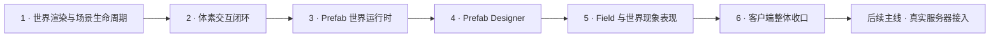
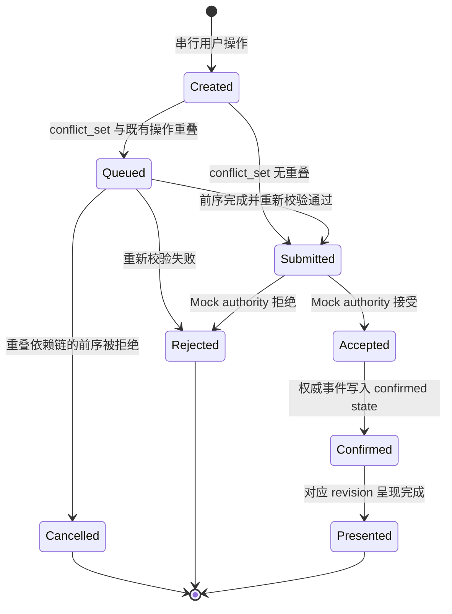
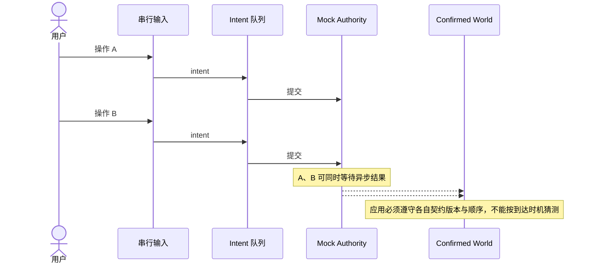

# Voxia 客户端网络无关功能收口与可替换权威源设计

> 状态：`跨阶段总纲 / 六阶段路线已批准`
> 日期：2026-07-14
> 范围：唯一现役客户端 `clients/Voxia`
> 当前阶段：`阶段 1 · 世界渲染与场景生命周期` 待单独收敛设计；尚未批准任何阶段的实现计划，不得据此宣称客户端功能已完成。

## 1. 本稿用途

本稿滚动记录本轮 `$grill-me` 已经确认的产品与架构约束，避免长对话中的决定只存在于会话上下文。每个后续确认项都应追加到“已确认决策”，仍未确认的内容只进入“待继续确认”，不得混写成既定事实。

本稿只保留跨阶段不变量、阶段依赖和已经确认的产品决策。每个阶段另行完成设计、自审、书面批准与实施计划；总稿不直接转成一份覆盖全部功能的单体实施计划。

## 2. 目标与边界

### 2.1 目标

本轮客户端主线先把 Voxia 中与网络无关的功能完整收口，使用户可以在明确标识的 Mock profile 中完成真实操作、看到异步结果、验证近远景一致性，并通过真实输入、自动化和 CLI / 结构化日志三类入口复现行为。

客户端模块必须从一开始就考虑未来切换到服务器权威源时的复用，避免联调阶段重新设计用户操作、确认态存储、近远景呈现、HUD 和可观测性链路。

### 2.2 权威边界

- 生产环境唯一事实源只能是服务器。
- 客户端只读取、缓存和呈现服务器确认内容，不能成为 confirmed truth 来源。
- 当前 WorldGen 及其上层 Mock authority 只用于服务端接入前的开发验证。
- Mock 模式生成的“确认态”只在该 Mock 会话内成立，不得被描述成生产权威数据。
- 体素点击即使在 Mock 模式中也不能直接修改 confirmed world；它必须走与未来在线模式一致的异步意图生命周期。

### 2.3 本阶段不做

- 不接入真实服务器。
- 不把客户端 WorldGen 搬到或复制到服务端。
- 不实现服务端权限、经济、地块和反作弊规则。
- 不开发或验证已归档的 `clients/web_client`、`clients/bevy_client`。
- 不允许连接失败后自动切换到 Mock。
- 不实现 Mock / Online 运行时热切换。
- 不把本稿当成实施计划或完成证明。

### 2.4 已批准的六阶段路线



| 阶段 | 用户可见范围 | 独立完成门禁 |
| --- | --- | --- |
| 1 · 世界渲染与场景生命周期 | 唯一生产根下的完整 XYZ WorldGen Mock 世界、滑动窗口、near / far LOD、材质连续性、加载 / 重试 / 返回主菜单 | 玩家可以稳定进入并游览世界；移动跨窗时无逻辑空洞或重叠，LOD 与材质连续，超时恢复可操作；真实操作、automation、CLI / 日志三入口均能复现 |
| 2 · 体素交互闭环 | 体素选择、挖掘、放置、pending / confirmed / rejected 反馈与 Mock session overlay | 一次操作从输入到确认呈现闭环；结果跨 unload / reload 与 near / far 切换保持；失败不伪装成功 |
| 3 · Prefab 世界运行时 | catalog、跨宏格放置、24 向旋转、嵌套 ancestry、父级选择、整组移除与主动替换 | prefab 可以跨 chunk 原子放置、选择、移除和替换；完整 ancestry、冲突集合及异步反馈一致 |
| 4 · Prefab Designer | 造型与组合、拓扑 / 材质校验、draft、undo / redo、本地保存 / outbox、Mock 发布和单 active 编辑生命周期 | 玩家能设计、恢复、保存、同步并发布一个 prefab，再在世界运行时使用；非法设计显式阻止发布 |
| 5 · Field 与世界现象表现 | 网络无关的局部场可视化，以及场对材质、环境和现象表现的输入 | 玩家能理解关键场状态和现象结果；表现只消费同一 Mock confirmed state，错误与缺数据显式可见 |
| 6 · 客户端整体收口 | 统一 HUD、菜单、错误反馈、性能门禁、唯一生产根和全客户端联合验收 | 阶段 1–5 在同一正式入口联合运行；无第二生产路径；完整测试矩阵、预算和三入口证据通过 |

阶段 1 是下一台电脑唯一需要展开的设计范围。阶段 2–6 当前只冻结名称、依赖和完成方向，不继续追问内部细节；真实服务器接入不属于六阶段中的任何一段，只有阶段 6 收口后才另开主线。

## 3. 当前代码与产品现状审计

以下结论用于定义收口起点，不代表这些缺口已经修复。

1. `AVoxiaUnifiedVoxelWorldActor` 已是现役唯一组合根，当前由成熟 near 与 Pure3D far 两个迁移期模块组成；正式验收必须继续从该唯一根进行。
2. WorldGen 已能为完整 XYZ 近场与远景提供开发数据，但它当前是 dev provider，不是生产 confirmed truth。
3. 当前本地体素编辑和 prefab 操作仍依赖 `UVoxiaTransportSubsystem` 的 `InScene` 网络阶段；纯 WorldGen Mock 运行不能形成完整的“用户输入 → pending → result → confirmed → remesh”闭环。
4. `UVoxiaTransportSubsystem` 当前同时承担连接、协议解码、状态应用和部分 WorldGen 驱动职责。未来 Mock / Online 共用哪些模块仍需在方案比较阶段正式确定。
5. near 与 Pure3D far 尚未消费完全统一的 provider、residency、coverage 与 generation transaction；不能把当前同屏显示等同于单一 Mock 世界状态已经建立。
6. 当前 prefab 已能以 refined voxel 几何呈现并保留单一 owner id，`anchor_world_micro` 与摆放预览也已经按微格坐标工作，因此现有形状可以跨越宏格边界；但客户端内置 catalog 仍把每个定义限制为单个 `8³` 宏格内的 occupancy mask，每个 occupied micro 的 `Owner[slot]` 也只能保存一个 id。现役客户端尚未表达多宏格定义、组合嵌套、完整 prefab 实例祖先链与跨宏格 footprint，也没有闭环离线 Mock 确认、跨范围恢复与原子生命周期。field 数据虽已进入 store，但实际表现只消费其中一部分；HUD 现状与 README 中部分 Fancy HUD 描述存在偏差。这些都属于客户端功能完整性清单，而不是单纯网络问题。通用 `ObjectStateDelta` 及其代理呈现不属于本稿的 voxel / prefab 范围。
7. 当前客户端 prefab catalog 只有七个 C++ 硬编码、单宏格 mask；sphere / cylinder / stairs 等由一次性 predicate 生成，junction 的 union 也是硬编码逻辑。现役 Voxia 没有可复用 primitive / Boolean 表达、组合编辑界面、blueprint draft 或保存入口。
8. 已有较多模块级 automation，但仍缺少不依赖服务器的真实输入到确认态、重建、流送离开与返回的端到端验收。

相关现役入口：

- [`clients/Voxia/README.md`](../../../clients/Voxia/README.md)
- [`clients/Voxia/Source/Voxia/Net/VoxiaTransportSubsystem.h`](../../../clients/Voxia/Source/Voxia/Net/VoxiaTransportSubsystem.h)
- [`clients/Voxia/Source/Voxia/Gameplay/VoxiaUnifiedVoxelWorldActor.h`](../../../clients/Voxia/Source/Voxia/Gameplay/VoxiaUnifiedVoxelWorldActor.h)
- [`clients/Voxia/Source/Voxia/Voxel/VoxiaVoxelStore.h`](../../../clients/Voxia/Source/Voxia/Voxel/VoxiaVoxelStore.h)
- [`clients/Voxia/Source/Voxia/Voxel/VoxiaPrefabCatalog.h`](../../../clients/Voxia/Source/Voxia/Voxel/VoxiaPrefabCatalog.h)
- [`clients/Voxia/Source/Voxia/Voxel/VoxiaFieldStore.h`](../../../clients/Voxia/Source/Voxia/Voxel/VoxiaFieldStore.h)

## 4. 已确认决策

| 编号 | 决策 | 已确认语义 |
| --- | --- | --- |
| D-001 | 先客户端、后联调 | 先收口客户端所有网络无关功能，再讨论前后端连接，避免两侧问题叠加。 |
| D-002 | 服务器唯一事实源 | 生产环境只认服务器权威；服务端接入前客户端一律运行 Mock，WorldGen 只是开发数据源。 |
| D-003 | 为未来替换设计 | 当前功能必须通过稳定边界组织，使未来 Online authority 可以替换 Mock authority，并最大限度复用用户操作、状态归约、呈现和观测模块；具体拆分方案仍需比较后批准。 |
| D-004 | Mock 世界会话持久性 | Mock world overlay、已确认 session prefab 与世界操作结果只在当前客户端世界会话内持续存在，跨 tile unload / reload 后仍可恢复；这些世界态本阶段不要求写入磁盘。D-051 的 Prefab Designer 本地 draft / outbox 是独立创作资料，不属于该世界会话边界。 |
| D-005 | Mock 也走异步确认 | 操作生命周期为 `pending → accepted/rejected → confirmed`；点击不能直接改变 confirmed world。 |
| D-006 | Mock 只模拟客户端可观察的结构规则 | Mock 负责 coverage、目标状态、版本与顺序、prefab 邻接、幂等和显式拒绝；权限、经济、地块、反作弊等服务端业务只通过可配置拒绝场景验证客户端表现，不在客户端复制实现。 |
| D-007 | Profile 显式选择 | Mock 与 Online 必须显式区分并在运行时清楚展示。开发启动器可默认 Mock；Online 连接失败必须显式报错，禁止自动 fallback；第一阶段不支持热切换。 |
| D-008 | Mock 世界状态唯一 | Mock profile 只有一份逻辑世界状态：`WorldGen base + session sparse overlay`。near 与 far 都从这份状态派生，编辑必须在预算内反映到 far，并在重新进入 near 后保持。 |
| D-009 | 近远景原子交接 | replacement / ownership 交接以对应 confirmed world revision 与 render fence 为门禁；新 owner 未就绪前保留旧 owner，禁止空洞、重叠闪烁或回退到未叠加编辑的 WorldGen。该门禁只约束发生交接的局部集合，不要求所有 LOD 同频、全量重建或在同一帧全部更新。 |
| D-010 | 用户输入与提交串行 | UE GameThread 上的用户输入和 intent 创建、提交顺序严格串行。异步结果未返回时，后续操作仍可按序产生，因此允许互不冲突的 intent 同时处于 in-flight 等待状态；这不等于并行执行用户操作。 |
| D-011 | 重叠操作按序排队 | 影响资源重叠的 intent 按 `input_sequence` 排队。只有完整影响集合与动作都相同、且尚未提交的重复操作可以合并；前一个结果到达后，必须基于最新 confirmed state 重新校验队首，再决定提交或显式拒绝。 |
| D-012 | 有序依赖链失败即取消后续 | 重叠依赖链中的前序操作被拒绝时，取消该链上全部有序后续操作，不再逐项尝试提交；取消原因必须指向被拒绝的前序 intent。不相关影响集合不受影响，继续各自独立校验和推进。 |
| D-013 | 按完整影响集合判断冲突并原子确认 | 每个 intent 以完整 `conflict_set` 描述其会影响的 voxel 与 prefab instance 资源。两个操作只要影响集合有任意重叠，就必须按全局用户输入顺序进入同一有序依赖关系；不能只看点击主目标，也不能粗化为整个 chunk。一次操作的完整影响集合必须作为同一 confirmed revision 原子应用和发布，不能先确认或显示其中一部分。 |
| D-014 | Mock 默认使用确定性非零延迟 | 普通 Mock 游玩使用短暂、确定、可复现的非零响应延迟，避免把本地直接修改伪装成异步确认；慢响应、无冲突操作乱序、拒绝与重复消息通过显式测试场景启用。禁止始终随机延迟导致不可复现。 |
| D-015 | 先独立收口可游玩的体素世界渲染 | 客户端渲染按可验收能力分层推进：第一层先完成唯一根下的体素世界 near/far 渲染以及 voxel / prefab 操作闭环；field 与完整 HUD 在其后分别收口，但仍必须在真实服务端接入前完成，不能被延期成联调问题。 |
| D-016 | 复用既有分块、分 LOD 调度 | 不重新设计成“每次变化等待 near/far 全量同步重建”。继续以 near chunk、far page / surface / stable patch 为工作与缓存粒度；不同 LOD 使用不同空间 span、量化锚点和更新节奏，未变化内容保持 retained。revision / fence 只约束 changed replacement 与 ownership handoff。 |
| D-017 | 流送滞后不限制玩家移动 | 玩家移动连续性优先。即使 desired/live 暂时分离，也不因渲染未收敛而减速、钳制或暂停玩家移动；旧 live 世界保持原有世界坐标与可见状态，直到新 transaction ready 后再切换。禁止为追随玩家而平移、复制或重解释旧 live 几何。 |
| D-018 | 未知区域采用固定安全视域 | 生产默认不使用覆盖约 8 km 可视范围的流送雾幕，也不向玩家暴露技术化的未解析网格。玩家越出旧 live 的安全视域时，相机暂留最后一个完整、已确认的安全视域；玩家与世界位置仍按 D-017 推进。该状态必须依靠流送优化、严格性能门禁和显式超时保持为短暂异常，不能成为常态，也不能借机移动旧几何或伪造未知世界。未解析网格只可保留为 debug / probe 表现。 |
| D-019 | 固定安全视域硬超时后进入加载恢复态 | 固定安全视域达到硬超时后，当前场景不展示“失败界面”，而是进入统一的 `streaming_recovery_loading` 加载界面，不继续伪装为可玩。技术失败原因仍进入 CLI / 结构化日志，但玩家只看到加载与恢复动作。客户端不得回滚或改写玩家权威位置，也不得生成替代世界；未来 Online 必须重新获取服务端权威状态后才能恢复呈现。 |
| D-020 | 加载恢复界面只提供不限次数的重试与返回主菜单 | 加载界面只提供“重试”和“返回主菜单”。用户主动重试次数不设上限，每次有效重试都从既有 confirmed truth 创建新的 presentation generation，不能继续发布前次 generation 的半成品；系统不在界面背后隐藏循环自动重试。“返回主菜单”表示用户放弃等待并结束当前场景 / 本次游戏流程。硬超时前调度器仍可在可观测预算内取消陈旧工作、合并与追赶，这属于正常自维护。 |
| D-021 | 固定安全视域计时从首次相机发布受阻起算 | 软提示阈值为 `250 ms`，硬超时为 `2 s`；两者使用同一个单调计时起点。起点不是玩家跨 tile、desired center 变化、generation 创建或 worker 启动，而是根级 safe-view guard 第一次证明“下一帧预期相机完整姿态无法由当前 committed live coverage / ownership / render fence 安全呈现”，因而拒绝相机继续跟随并锁存最后安全视域的时刻。desired 被后续移动替换、部分 staging 就绪或玩家停止移动都不能重置计时；只有预期相机视域重新获得完整 live 证明、相机恢复跟随，或场景退出/进入加载恢复态时才结束本次计时。 |
| D-022 | 重试次数无限但严格 single-flight | 加载界面允许用户在一次尝试结束后无限次继续重试，但同一时刻只能存在一个有效 retry attempt / presentation generation。重试执行期间按钮显示“重试中”且不再创建、取消或排队新的重试；本次尝试未恢复可玩态后按钮重新可用。禁止连续点击制造并行 generation，也禁止每次点击取消并重启正在推进的 generation。 |
| D-023 | 返回主菜单结束并销毁当前 Mock 会话 | “返回主菜单”是 Mock 会话的明确终止边界：退出当前场景 / 本次游戏时销毁内存中的 `SessionSparseOverlay`、pending intent、retry attempt 与会话派生缓存；再次进入必须创建新的 Mock 会话。presentation 重试不结束会话，因此重试仍读取同一 confirmed world / overlay。该清理只影响客户端 Mock，会话退出不能被抽象成未来 Online 删除服务端世界真值。 |
| D-024 | 当前阶段启动即自动创建 Mock 会话并进场 | 在真实服务端接入前，正式客户端启动流程不先要求用户选择“离线模拟”，而是由 bootstrap 自动创建新的 Mock 会话并直接进入统一加载流程。`runtime_profile=mock`、scenario、seed 与 session id 仍必须显式可观察，不能因为自动进入就隐藏数据来源。未来 Online 只替换 bootstrap / entry routing 与 authority adapter，confirmed state、presentation、near/far、HUD 和加载恢复流程不得重做；运行中仍禁止 Mock / Online 热切换。 |
| D-025 | 主动返回后停留主菜单 | 进程首次启动可以按 D-024 自动创建 Mock 会话并进场；但用户选择“返回主菜单”后必须停留在主菜单，不得再次自动进场。主菜单只提供“开始新游戏”和“退出客户端”：前者创建全新的 Mock 会话并进入统一加载流程，后者结束客户端进程。主菜单不提供恢复已销毁会话的入口。 |
| D-026 | 不提供第二套场内 Mock 重置入口 | 真实用户清空 Mock 世界并创建新会话的唯一流程是“返回主菜单 → 开始新游戏”。游玩中不增加“重置离线世界”按钮或快捷键，避免绕过会话结束、资源回收和加载门禁。CLI / automation 可以提供直接重建命令，但必须执行同一会话终止与新建语义，并明确标记为测试入口，不能成为第二条生产 UI 路径。 |
| D-027 | far 保留 material family 与关键视觉语义 | near / far 必须消费同一稳定 material identity，并在所有正式 LOD 中保持 opaque / translucent / emissive 分类可辨、主要颜色关系和 world-aligned 尺度一致。far 可以对纹理细节、法线、透明层次和光照成本做确定性的 LOD 聚合或简化，不要求逐像素复制 near；但不能退化成单一地表材质，也不能让发光、透明或主要材质身份在跨 LOD 时无故消失。 |
| D-028 | near / far 材质交接使用限时互补 dither | 逻辑 ownership、confirmed revision 与可见提交仍保持原子；新旧两侧都 ready 并通过 fence 后，允许使用最长 `100 ms` 的确定性 world-space 互补 dither 消除材质 popping。旧/新遮罩在同一采样点互补，不能做叠加透明或长时间双绘。过渡资源不获得第二份逻辑 ownership；过渡建立失败时保留旧 live 并显式报告，不能以硬切、空洞或鬼影兜底。 |
| D-029 | 当前实体范围只含 voxel 与 prefab | 本稿中的 prefab 只指由稳定 blueprint 定义、最终通过 confirmed voxel occupancy / material 呈现的放置实例；prefab 实例身份及其祖先链只服务于层级聚类、选择、移除、冲突判断和来源追踪，不建立通用 object 框架。当前 wire / store 中的 `owner_object_id` 只能在 voxel 边界作为单层 prefab provenance 的兼容输入，不能被当成完整祖先链，也不能外推为所有物体共用的客户端模型。通用 `ObjectStateDelta`、NPC、掉落物、载具、机关及未来其他对象类型全部不在本阶段范围，后续按各自规则单独设计。 |
| D-030 | 本阶段 prefab 生命周期保持纯体素能力 | prefab 的用户能力收口为放置预览、允许的旋转、放置、整组选择和整组移除。损伤、动画、开关状态、独立运动及其他专用对象行为不进入当前 prefab 生命周期；未来出现这些需求时必须单独划定对象契约。 |
| D-031 | prefab 是可组合嵌套的跨宏格微格对象 | prefab 定义与放置都以微格为最小空间单位：根锚点落在整数 world-micro 坐标，不能强制宏格对齐，也不能限制定义或实例只占一个宏格。prefab 可以由其他 prefab 组合和嵌套；所有叶级 occupancy 经层级变换后形成完整 world-micro footprint。该 footprint 可以跨任意宏格、chunk 与流送边界，并作为同一 intent 的完整影响集合原子确认和呈现。 |
| D-032 | 拍平几何但保留每个微格的完整 prefab 祖先链 | confirmed voxel geometry 可以按宏格 / chunk 拍平存储和渲染，但每个 occupied micro 必须逻辑关联从 root 到 leaf 的完整稳定 `prefab_instance_id` 路径。命中任一微格后，客户端必须能取得整条路径，并按其中任意层级 id 聚合该 prefab 子树在所有宏格 / chunk 中的已确认微格，供层级选择、范围高亮、修改影响分析以及未来攻击归因使用。物理编码可以对重复路径做目录化或引用压缩，但解码后的语义不能缺失、截断或只保留 leaf / root。该 provenance 要现在进入客户端稳定契约，即使损伤玩法不属于 D-030 的当前实现范围。 |
| D-033 | 命中默认选择 leaf，允许显式逐级选择祖先 | raycast 命中 prefab-owned 微格后，默认选中 ancestry 中最深的 leaf prefab，以最小化误操作范围。玩家可以显式沿当前 `prefab_instance_path` 逐级切换到父 prefab 直至 root；高亮必须始终覆盖当前层级 id 聚类出的完整 confirmed subtree，跨 macro / chunk 的部分也属于同一选择。修改与整组移除只作用于当前明确选中的层级 id，不能因为路径中存在 root 就自动扩大范围。 |
| D-034 | 选择层级只在当前 subtree 内保持 | 准星移动到另一 occupied micro 后，只要新命中的 `prefab_instance_path` 仍包含当前 `selected_prefab_instance_id`，就保持当前父级 / root 选择与完整 subtree 高亮，不因命中同一子树的不同 leaf 而跳回最深层。新路径不再包含当前 id 时，立即把选择重置为新命中的 leaf；移出有效 confirmed 命中时清空选择，之后重新命中也从 leaf 开始。选择层级不是跨目标保留的全局深度偏好。 |
| D-035 | Alt + 滚轮切换 prefab 选择层级 | 准星具有有效 `prefab_instance_path` 时，按住 Alt 并向上滚轮会从当前层级逐级选择 parent 直至 root，按住 Alt 并向下滚轮会逐级返回 child 直至 leaf；到达两端后钳制，不循环跳转。未按 Alt 的滚轮继续只切换热栏。HUD 必须显示完整 ancestry breadcrumb、当前层级与聚类范围，CLI / automation 提供等价层级切换和状态观察入口。该组合避开现有 Ctrl 下降、Shift 冲刺、普通滚轮热栏和左键挖除。 |
| D-036 | non-leaf 整组移除使用 `0.6 s` 圆环长按确认 | leaf prefab 保持左键直接提交移除；当前选择为 non-leaf parent / root 时，按下左键只启动确认，不立即创建 intent。准星附近从空弧开始显示圆形进度，持续按住 `0.6 s` 时弧线增长为完整圆环；同时保持完整 selected subtree 高亮。期间松开左键、准星离开该 subtree、选择层级变化或 confirmed revision 变化都会取消并清空进度。只有圆环完整时才创建一次原子整组移除 intent，继续按住也不得重复提交；不使用模态确认框。 |
| D-037 | 移除圆环贯穿异步结果直到真正呈现 | non-leaf 圆环完整并提交 remove intent 后，不立即消失，而是切换为持续旋转的等待圆环。`submitted / accepted` 都保持中性等待，`accepted` 不能伪装成成功；confirmed state 已更新但对应 presentation 尚未完成时仍继续等待。只有达到 `presented` 后圆环才变绿、短促扩散并消失；`rejected / cancelled` 时变红、断开、显示简短原因后消失。同一 prefab scope 等待期间禁止重复移除，其他 `conflict_set` 无交集的操作继续独立推进。 |
| D-038 | prefab 使用完整 24 种轴对齐正交方向 | 正式 prefab orientation 定义为立方网格保持手性的 `24` 种正交旋转，不支持任意角度，也不把镜像混入 rotation。每个 blueprint 声明自己允许的 orientation 子集；root placement 使用稳定 orientation id，嵌套 child 保存局部 orientation 并与 parent 确定性组合。放置预览、贴面、完整 footprint、冲突校验、Mock authority、session overlay、near / far 与未来 Online adapter 必须消费同一方向变换结果。现有 `0..3 yaw` 只是待迁移旧限制，不能成为完整 XYZ 的正式契约。 |
| D-039 | 命中面自动定主方向，`R` 循环面内方向 | blueprint 定义局部放置基准面与朝上方向。放置预览把基准面自动贴合准星命中的世界表面，由六个轴向命中面确定主方向；玩家按 `R` 时只绕当前表面法线按 `90°` 循环面内方向，最多处理四档，由“六个命中面 × 四个面内方向”覆盖全部 24 orientation。循环只经过 blueprint 允许的方向；当前命中面没有任何允许方向时显示红色无效预览并禁止提交，不能静默换向。 |
| D-040 | 游戏内提供独立 Prefab Designer | 客户端完成口径必须包含专门的游戏内 prefab 设计界面，而不是只消费预置 catalog。Designer 内置基础微格形状、空间变换和 Boolean / 组合函数，允许玩家拼接、嵌套已有 prefab 并制作新的 composite prefab。“保存草稿”按 D-051 原子写入本地 durable draft store 并进入同步 outbox；“创建 prefab”才走与未来 Online 共用的异步 prefab-create intent / confirmation 边界，只有 confirmed prefab 才进入当前 catalog 并可预览、摆放。本地 draft / outbox 跨世界会话与客户端重启保留；Mock session prefab、世界 overlay、编译派生缓存和世界 pending 状态仍按 Mock 会话生命周期清理。Prefab Designer 作为独立客户端子系统单独设计和验收，但仍必须接入唯一生产组合根并在真实服务端联调前完成。 |
| D-041 | prefab 保存采用非破坏表达树与不可变编译产物双层契约 | prefab definition 的可编辑真值是非破坏 `expression_tree`，节点只表达 primitive、整数微格变换、Boolean / 组合运算和精确 `prefab_id` 的嵌套引用；编辑器重新打开 prefab 时恢复该树，撤销 / 重做也作用于树，而不是反推拍平 mask。预览与世界运行时只消费由树确定性生成的不可变 compiled footprint、material 与逐微格 ancestry。Mock 使用版本化确定性 compiler 生成并确认结果；未来 Online 必须在服务端按同一语义重新编译和确认，客户端提交的 compiled data 只能作诊断或缓存提示，不能成为权威真值。每个 confirmed prefab 绑定 `expression_hash`、`compiler_algorithm_version`、`compiled_footprint_hash` 与精确 nested prefab ids，防止算法或依赖变化静默改变既有 prefab。 |
| D-042 | `NOT` 只在显式有限 `design_bounds` 内求补 | 每个 prefab expression 都有整数微格 `design_bounds`。`NOT(A)` 只表示该有限边界内的补集，禁止无限补集；常规减料操作优先表达为 `Difference(A, B)`。尚未使用 `NOT` 或其他边界相关运算时，Designer 可以让 bounds 自动贴合有效内容；一旦存在边界相关运算，bounds 必须在界面中显式可见并进入 expression、新 prefab identity 与 hash。修改 bounds 是可撤销 / 重做、会重新编译并改变预览的正常编辑；编译器不得静默扩张边界。 |
| D-043 | 每次 prefab 更新都创建新的不可变 prefab，族只负责归组 | confirmed prefab 不原地升级，也不存在会改变旧内容的“同一 prefab 新版本”；任何修改保存后都产生新的 `prefab_id`。新 prefab 可以用稳定 `prefab_family_id` 与可读族名称归入同一族，使关联成果集中显示并提供“存在更新候选”提示，但 family 不能成为自动替换指令或可变真值。嵌套组件和已放置实例都继续精确引用原 `prefab_id`；玩家要采用同族中的新 prefab，必须主动执行替换。Designer 中的组件替换会产生新的 parent draft，重新编译、预览并保存为另一个新 prefab；禁止静默级联更新。 |
| D-044 | prefab 族允许分支且不存在自动“最新版” | 新 prefab 可以在同一 `prefab_family_id` 内记录一个可选、精确且不可变的 `derived_from_prefab_id`；一个 predecessor 可以有多个直接后继，因此 family lineage 是可分支谱系，不是强制线性版本号。族内不维护会自动生效的唯一 latest 指针。“存在更新”只表示当前 prefab 在该谱系中拥有后继候选，不能把无继承关系的同族成员都当作升级；界面展示候选分支和差异，由玩家明确选择替换目标。新 prefab 只能派生自已确认且同族的既有 prefab；不可变 id 加这一约束共同排除环。 |
| D-045 | 世界中的 prefab 替换使用保锚定预览与原子事务 | 玩家从当前明确选中的 `prefab_instance_id` 层级发起替换，并显式选择目标 `prefab_id`。预览默认保留旧实例的世界微格 anchor 与 orientation，不自动平移、缩放或裁切；以不同视觉状态标出 retained / added / removed micros、材质变化和已知冲突。目标不支持当前 orientation 时预览无效，玩家必须主动选择允许方向。提交后形成一个 replace intent，其 `conflict_set` 覆盖旧 footprint 与目标 footprint 的完整并集；Mock 或未来 Online authority 根据最新 confirmed truth 重新校验，只能在一个 confirmed revision 中全部替换或完全保持原状，禁止半拆半装。客户端预览不构成确认态。 |
| D-046 | Prefab Designer 首版冻结最小完备造型节点集 | 首版 primitive 为 `Box`、`Ellipsoid`、`Cylinder`、`Frustum`、`Wedge`；单微格、sphere 与 cone 分别作为这些节点的参数特例，不另造不一致算法。内容节点可以用精确 `PrefabRef(prefab_id)` 嵌套已确认 prefab。变换只含整数微格 `Translate`、D-038 的 24 向 `Rotate` 和显式 `MirrorX / MirrorY / MirrorZ`；mirror 是建模运算，不混入 orientation。`Union`、`Intersection`、`Difference` 与 D-042 的 bounded `NOT` 只作用于纯几何 `ShapeMask`。尺寸与位置参数全为整数微格，曲面栅格化受 `compiler_algorithm_version` 约束；首版不支持任意角度、连续缩放或隐式自动变形。 |
| D-047 | Boolean 遮罩可以临时重叠，最终 prefab 组件禁止重叠且必须六面连通 | primitive、transform 与 Boolean 子树先计算不带 material / ancestry 所有权的纯 `ShapeMask`，因此遮罩操作数可以临时重叠，`Intersection / Difference` 仍有有效语义。`PrefabRef` 及最终形成 prefab 的本地几何属于实际组件；任意两个组件不得占用同一微格，最终每个 occupied micro 只能解析为一个 material 和一条完整 ancestry。最终 compiled footprint 必须是单一六面邻接连通体：共享面算连通，只接触棱或角不算；多个组件可以经其他组件形成连通路径，不要求两两直接接触。编辑期间允许出现红色的 overlap / disconnected 无效 draft，也允许按 D-053 保存该本地草稿，但“创建 prefab”入口必须阻止提交；CLI 绕过 UI 的非法 intent 仍由 Mock / Online authority 拒绝。任何 Boolean 结果若最终留下多个孤岛，同样不能创建 confirmed prefab。 |
| D-048 | `Materialize` 是 ShapeMask 成为本地组件的唯一边界 | `ShapeMask` 始终只有几何；`Materialize(mask, material_id)` 才把它转换为本地 prefab component，使其每个 occupied micro 获得唯一 material，ancestry 归属于当前 prefab root。多材质本地结构由多个互不重叠、整体仍六面连通的 Materialize components 组成。`PrefabRef` 已携带原 prefab 的逐微格 material 与 ancestry，不重复 Materialize；如需改色，只能使用显式 `MaterialOverride(component, selector_mask, mapping)`，selector 只选择已有微格，override 不改变 geometry / ancestry。不存在材质优先级、隐式覆盖或微格内混合；任何抵达最终 root 的未 Materialize mask、未解析 material 或 component overlap 都使保存无效。最终逐微格 material map 进入 compiled hash。 |
| D-049 | 每个 PrefabRef occurrence 使用稳定 component slot，运行时实例 id 只由 authority 确认 | 每个 `PrefabRef` expression node 创建时获得在当前 prefab definition 内唯一、稳定的 `component_slot_id`；重复引用同一 `prefab_id` 也必须拥有不同 slot。平移、旋转、镜像或表达树重排不改变 slot，复制 / 新建引用产生新 slot；从旧 prefab 派生新 prefab 时，未替换节点可以保留 slot 以支持结构 diff，但派生结果仍有全新 `prefab_id`，slot 也不冒充全局身份。世界 placement 时，Mock / Online authority 为 root 和每个 nested occurrence 分配 confirmed `prefab_instance_id`，并按完整 `component_slot_path` 返回 provisional → confirmed 映射；客户端不得自行把预测 id 当成 confirmed truth。Materialize 本地几何只属于 root，不生成伪 child。重复组件因此拥有不同 runtime ids，每个微格最终保存 `[root_instance_id,...,leaf_instance_id]` 完整 ancestry。 |
| D-050 | 多 draft 使用 durable local checkpoint，但 Designer 同时只允许一个 active working draft | 客户端磁盘中可以持久保留多个 draft，但 Designer 任一时刻只能有 `0..1` 个 active working draft，不能并行打开或编辑两个 prefab。编辑命令、undo / redo 先更新唯一 working copy，玩家显式保存或 autosave 触发时再通过稳定 `PrefabDraftWorkspace` 命令 / 事件边界原子写入本地 durable checkpoint。关闭 Designer、返回世界、结束世界会话或重启客户端都不丢已落盘内容；新建、打开或切换到另一个编辑目标前，当前目标必须先进入 D-058 的关闭流程。draft list 显示名称、最后编辑时间、dirty / invalid、本地保存与同步状态及缩略预览。丢弃必须由玩家显式操作并二次确认。local checkpoint 只恢复编辑现场，不能让 draft 进入 confirmed catalog。Designer UI 只能调用 profile-neutral 的 create / open / list / apply-command / undo / redo / request-close / save-local / discard / sync / submit contract，不能直接读写文件、Mock 容器或网络；当前与未来 Online 共用同一 workspace / producer-consumer 边界，只替换 authority adapter。 |
| D-051 | prefab draft 使用本地 durable producer / outbox 与后台 authority consumer | 手动保存或 autosave 的 producer 必须先把 draft snapshot 与待同步 outbox record 原子、持久地写入本地磁盘，成功后才向玩家显示“草稿已保存到本地”；该提示不等于已同步、已发布或已进入 confirmed catalog。后台 consumer 从 durable outbox 按序向当前 authority adapter 推送，收到确认后把与 draft id / content hash / authority namespace 绑定的 sync receipt 持久化。当前 Mock 也走完全相同的 producer / outbox / consumer / receipt 接口，只把远端替换为 Mock authority；未来 Online 只换 adapter。Prefab Editor 常驻小型同步状态控件，至少区分 `saving_local / saved_pending_sync / syncing / synced / sync_failed`。退出客户端时如仍有 pending / in-flight item，玩家可选择“等待同步”或“立即退出”：等待时留在同步等待状态且可改为立即退出；立即退出只停止 consumer，不删除本地 draft / outbox，下次启动自动续传。服务端仍是共享 draft、confirmed prefab 与正式 catalog 的唯一事实源；本地磁盘只保存工作副本和待同步队列。本地 draft 跨 Mock 世界会话与客户端重启存在。 |
| D-052 | outbox 按 draft 合并未发送 snapshot，但 pin 精确发布版本 | 对同一 `draft_id + authority_namespace`，durable outbox 最多保留一个不可变 in-flight snapshot 与一个最新 unsent snapshot。新 manual / autosave 只有在新 snapshot 与 outbox record 已原子落盘后，才可替换更旧的 unsent item；in-flight item 不修改、不取消，完成后若存在更新 snapshot 再继续发送。不同 draft 独立同步。undo / redo 历史属于 durable draft 文件，不依赖 outbox revision 历史。任何被 prefab-create 引用的 exact content hash 都必须 pin 对应 snapshot，直到 sync receipt 与 create outcome 明确，pin item 不得被合并删除。每个上传使用跨重启稳定的 idempotency key，使超时和重试不会创建重复服务端 draft revision。 |
| D-053 | autosave 使用 2 秒 idle 与 30 秒最大脏时间，离开编辑目标必须经过关闭门禁 | 手动保存按钮或 `Ctrl+S` 立即触发本地原子保存。autosave 从最后一个完整编辑命令结束开始计算 `2 s` idle debounce；若玩家持续编辑，则从第一个未保存完整命令开始累计最多 `30 s`，到点后在最近的完整命令边界强制保存，不能被持续输入无限推迟。拖拽、旋转等连续手势只在提交后形成可保存命令，不写入半次操作。关闭 Designer、新建 / 打开 / 切换编辑目标或返回世界时必须先经过 D-058 的关闭流程；选择保存的分支必须完成本地落盘后才能释放当前 active draft，只等待磁盘，不等待 authority sync。应用挂起前仍强制本地落盘。invalid draft 同样可保存。写盘失败不得显示成功，也不得激活下一个编辑目标：普通界面转换只提供重试或取消转换；退出客户端时另允许玩家明确放弃本次尚未落盘的 working changes 后退出。 |
| D-054 | Prefab Designer 使用三栏工作台作为生产默认布局 | 游戏内 Designer 的默认信息结构采用用户在视觉伴侣中确认的 A：顶部全局栏，左侧草稿 / primitive / prefab 素材区，中间 3D 微格工作区，右侧 expression tree / component hierarchy / selected-node properties。顶部同时呈现返回世界、当前 draft 身份、undo / redo、本地保存、同步状态和“创建 prefab”；同步状态使用 D-051 的常驻小控件。中间视口承担空间编辑、selection 与拓扑 / 材质诊断叠加；右侧让非破坏表达、嵌套 ancestry 和属性在同一上下文中对照。默认不采用视口悬浮抽屉或 graph-first 布局；复杂表达可以从右栏按需展开，不能强迫普通玩家离开 3D 创作上下文。 |
| D-055 | Designer 使用独立输入上下文与标准 3D 视角控制 | 进入 Prefab Designer 后必须切换到独立 input context，暂停挖掘、放置、热栏等世界操作，任何 Designer 鼠标 / 键盘事件都不能泄漏为世界 intent。左键选择，右键拖动绕当前 pivot 旋转，中键拖动平移，滚轮缩放；按住右键时使用 `WASD / QE` 自由移动。`F` 聚焦当前选择，`Home` framing 完整 prefab；视图角提供方向立方体切换六个轴向正交视图，并可显式切换 perspective / orthographic。pivot 默认是 selection bounds center，无选择时是完整 prefab bounds center。相机操作不进入 expression、compiled hash 或 undo / redo；每个 draft 可以把最后视角作为纯本地 UI state 单独保存。 |
| D-056 | Designer 使用共享 selection，并提供三种父级 prefab 选择入口 | 视口命中 nested prefab micro 时默认选择最深 `component_slot_id` occurrence；玩家可用 `Alt + MouseWheelUp / Down` 沿当前 `component_slot_path` 逐级选择 parent / child，普通滚轮仍只 zoom，也可直接点击 ancestry breadcrumb 或右侧 component hierarchy 的任意层级。父级 / root 选择高亮完整 subtree；继续点击仍属于该 subtree 的其他 micro 时保持当前层级，点击 subtree 外的新 micro 才重置为新 leaf，点击空白清除。expression tree 同步定位创建该 occurrence 的 `PrefabRef`；当前 draft root 显示 root definition summary，不制造虚假节点。本地几何 micro 定位所属 Materialize，component hierarchy 仍是 root。primitive / Boolean / ShapeMask selection 只高亮中间 mask。所有修改、替换与 focus 只作用于当前明确层级；selection、breadcrumb、tree expansion 和右栏 tab 都是 local UI state，不进入 expression 或 undo / redo。 |
| D-057 | undo / redo 以完整编辑命令为事务，并随 durable draft 恢复 | 新增、删除、复制、替换、重排节点各形成一个 command；一次 gizmo 平移 / 旋转或其他连续拖拽从按下到释放只产生一个 command，拖动期间只更新 live preview，`Esc` 取消时不入历史；数值输入在 Enter、显式确认或失焦提交时形成一个 command，不按字符拆分；显式批量属性修改、material mapping 或 `design_bounds` 修改各形成一个 command。selection、camera、panel state、本地保存、autosave、sync 与 receipt 不属于 undo / redo。撤销一个已本地保存或已同步的修改只会生成新的 dirty working revision，后续按正常 producer / outbox 流程保存与同步，不撤回既有 receipt；confirmed prefab 始终不可变，撤销 draft 不能删除或改写它。undo 后产生新编辑必须清空 redo。command history 与 draft checkpoint 一起持久化，客户端重启后可继续 undo / redo。 |
| D-058 | Prefab Designer 只允许一个 active 编辑目标，切换目标前必须关闭当前目标 | durable store 可以保存多个 prefab draft，但同一时刻只能有一个 prefab 处于 active editing。用户请求新建、打开或切换到另一个 prefab 时，系统先把当前 prefab 视作待关闭并进入显式 close guard；当前目标没有完成关闭前，不得激活新目标，也不得出现两个 working copy。dirty 当前目标必须询问是否保存等关闭选择，不能静默覆盖、自动另开并行编辑或把未完成 working changes 偷带到新 prefab。只有关闭选择完成且所需本地写盘成功后，才释放当前 editor state 并激活下一个目标；取消关闭则完整留在当前 prefab。 |
| D-059 | 当前 draft 发布成功后关闭编辑目标，失败则保留完整现场 | “创建 prefab”作为把当前 draft 发布为 confirmed prefab 的动作，绑定一个精确、已落盘并 pin 的 draft revision。Mock / Online authority 确认成功并返回新的 immutable `prefab_id` 后，该 prefab 进入 catalog，当前 active editing target 随即关闭，不继续在原 draft 上编辑下一版本；若发布被拒绝、失败或取消，则不得关闭或清空当前目标，保留 expression、selection、undo / redo、camera 与诊断现场，并显示可操作原因。发布成功与否都不能静默切换到另一个 prefab；后续新建或打开仍走 D-058 的单 active 关闭 / 激活边界。 |
| D-060 | prefab-create 等待期间保留只读编辑现场 | 当前 draft 完成本地落盘并开始 prefab-create 流程后，Designer 进入只读等待状态：继续显示当前模型、视角、selection 与诊断，但禁止任何 expression 修改、新建、打开或切换编辑目标。authority 成功后按 D-059 关闭当前目标；拒绝、失败或取消后在同一现场解除只读并恢复编辑。等待期间不能通过打开另一个 prefab 绕过单 active 约束，也不能把后续输入偷偷累积成未显示修改。 |
| D-061 | 客户端收口改为阶段化推进，总稿只保留跨阶段总纲 | “所有网络无关客户端功能收口”不再作为一份规格一次问完或一次实施。先确定若干有依赖顺序、用户可见结果和独立验收门禁的阶段；随后每次只对当前阶段完成设计、书面确认、实施计划、实现与验收，当前阶段未收口前不展开后续阶段细节。本稿保留服务端权威、Mock 边界、阶段依赖和已经确认的跨阶段决策，不能继续膨胀成所有阶段的单体实施规格。 |
| D-062 | 六阶段纵向功能闭环已批准，先从世界渲染开始 | 依次推进：`1 世界渲染与场景生命周期 → 2 体素交互闭环 → 3 Prefab 世界运行时 → 4 Prefab Designer → 5 Field 与世界现象表现 → 6 客户端整体收口`。每个阶段必须交付玩家可见闭环并独立通过真实操作、automation、CLI / 日志门禁；不能按底层数据、渲染、UI 横向铺开后长期没有可玩的结果。当前只启动阶段 1 的设计收敛，阶段 2–6 细节全部暂停；真实服务端连接在六阶段之后另行立项。 |

## 5. 已确认的状态模型约束

### 5.1 Mock 世界

```text
MockWorld = FrozenWorldGenBase + SessionSparseOverlay
```

- `FrozenWorldGenBase` 为当前 Mock 会话提供确定性的基础世界。
- `SessionSparseOverlay` 只记录当前会话的确认变更，不复制整个世界。
- unload 只能释放呈现和受预算管理的派生缓存，不能丢失 overlay 中的确认结果。
- near、far、raycast、碰撞及后续客户端消费方不得各自维护互相漂移的“编辑后世界”。
- `streaming_recovery_loading` 中的 presentation 重试不创建新 Mock 会话，仍从当前 confirmed world / overlay 重建。
- 选择“返回主菜单”、显式结束本次游戏或退出客户端会终止当前 Mock 会话并清空 overlay；下一次进入从新的会话身份和空 overlay 开始。
- 该 Mock 会话边界不能外推为 Online 世界生命周期；未来 Online 返回主菜单后，服务端世界是否持续存在仍完全由服务端权威状态决定。

### 5.2 Intent 生命周期



`accepted` 不能被 UI 或 renderer 当成已经可见；只有确认事件进入 confirmed state，并由对应 revision 完成呈现后，操作才达到用户可见的完成态。

`cancelled` 与 `rejected` 必须区分：前者表示该 intent 因同一有序依赖链的前序失败而没有提交，后者表示该 intent 自身在客户端结构校验或 Mock authority 处理中被拒绝。取消记录至少包含 `predecessor_intent_id` 与稳定原因码 `predecessor_rejected`。

### 5.3 串行输入与并存 pending



影响集合无交集的操作可以同时等待结果；影响集合重叠的操作只能按用户输入顺序逐个推进。

### 5.4 完整影响集合

- 单体素操作至少以精确 voxel XYZ 作为影响资源。
- prefab 操作必须包含该 prefab 本次放置实际覆盖或占用的完整 voxel 集合，以及用于层级聚类、整组选择 / 移除与顺序约束的完整 `prefab_instance_path`；其中每一层都是稳定 `prefab_instance_id`，放置确认前使用可确定映射的 provisional path。
- `prefab_instance_path` 只是 voxel / prefab 域内的层级来源与事务身份，不是通用 object ancestry，也不能让其他对象类型自动继承本节规则。
- 多资源操作的 `conflict_set` 是不可拆分的整体。它必须等待所有重叠的前序操作完成，不能只占用其中一部分后提前提交，也不能在确认或呈现阶段暴露部分成功的 prefab。
- 多条原本互不相关的链被一个跨集合操作连接时，统一按 `input_sequence` 确定先后，禁止因内部遍历顺序产生不确定行为。
- `conflict_set` 无交集的操作继续独立校验和推进。

### 5.5 Mock 调度

- 默认场景使用固定且可复现的非零延迟。
- 影响集合重叠的操作仍受有序依赖链约束，测试场景不能用结果乱序破坏已经确认的串行语义。
- 影响集合无交集的操作可以在显式场景中以不同延迟返回，用于验证客户端不会把到达顺序误当成用户输入顺序。
- 拒绝、重复确认和慢响应都必须由具名场景显式启用；场景名称与参数进入 CLI / 结构化快照。
- 普通 Mock 游玩不使用不受控随机数。需要变化时使用显式 seed，并把 seed 写入观察产物以便复现。

### 5.6 prefab 微格空间与跨宏格边界

- prefab 的 root anchor 使用完整 XYZ `world_micro` 整数坐标；宏格、chunk 与 tile 只是由该坐标推导出的存储和流送分区，不是 prefab 对齐单位。
- prefab 定义可以包含本地微格 occupancy 与嵌套 child prefab。child 的本地微格变换逐层组合后，必须能确定性得到所有叶级 occupied world-micro。
- footprint 必须按最终 world-micro 拆分到所有受影响宏格与 chunk；不能截断到 anchor 所在宏格，也不能因某个目标 chunk 当前未加载而把它从影响集合中删掉。
- prefab orientation 只能从 24 种保持手性的轴对齐方向中选择；方向变换必须保持整数微格坐标。child local orientation 与 parent world orientation 的组合结果仍落在同一集合中，不能经过浮点欧拉角重新取整。
- blueprint 的 allowed-orientation 集合属于版本化定义。预览若找不到与当前贴面 / 操作匹配的允许方向，必须显示无效并拒绝提交，不能静默换成未展示的方向。
- blueprint 的 placement frame 至少包含局部基准面法线与局部 up。当前命中面先决定 world mount normal，`R` 再只改变绕该 normal 的 quarter-turn；玩家不需要在线性序列中遍历全部 24 orientation。
- `R` 只循环当前命中面上允许的 orientation 并在集合内回绕。命中面改变时重新以该面的默认允许 orientation 建立预览；若允许集合为空，预览必须保留明确的无效状态和原因。
- 预览、冲突校验、Mock authority 确认、session overlay、near / far 失效与重新进入后的恢复，必须针对同一完整 footprint；禁止这些阶段各自栅格化出不同结果。
- 跨宏格、跨 chunk 的放置或整组移除只有整体 accepted / rejected / confirmed，不能按宏格逐个成功，也不能在画面上短暂出现半个 prefab。
- 拍平后的每个 occupied world-micro 都必须能反查完整 `prefab_instance_path=[root,...,leaf]`。以路径中任一 id 聚类时，结果是所有 ancestry 包含该 id 的 confirmed micro，不能只扫描当前宏格、当前 chunk 或当前 live LOD。
- 同一条 ancestry 可以用共享目录 / path ref 压缩，但目录身份、路径顺序和每层 id 都属于 confirmed provenance；unload / reload、near / far 切换和 session overlay 更新不能使其退化成单一 owner。
- 初次命中选择 path 最末端的 leaf；只有玩家显式改变选择层级后，当前选择才沿同一 path 上移。层级高亮与实际操作目标必须读取同一个 `selected_prefab_instance_id`，禁止画面显示 leaf、操作却提交 parent / root。
- 每帧 raycast 更新时先检查新 path 是否仍包含 `selected_prefab_instance_id`：包含则保持当前层级；不包含则切换到新 path 的 leaf；无有效 confirmed path 则清空选择。不能按“上次选了第 N 层”把相同深度套到无关 prefab。
- Alt + MouseWheelUp / MouseWheelDown 只沿当前 ancestry 移动一个层级，并在 root / leaf 端点钳制；无有效 ancestry 时不得偷换成其他操作。松开 Alt 后，滚轮立即恢复热栏语义，不能让一次滚轮事件同时改变层级与热栏。
- non-leaf 左键按下后创建绑定 `{selected_prefab_instance_id, selection_fingerprint, confirmed_world_revision}` 的 hold-confirm token；`hold_progress` 从 `0` 连续增长到 `1`，UI 以空弧到完整圆环表达同一进度。
- hold-confirm token 在 `0.6 s` 前不产生 intent。松开左键、selection fingerprint / world revision 改变或新命中 path 不再包含 selected id 时，token 立即取消，圆弧归零且不排队补发。
- `hold_progress=1` 时只创建一个 remove intent 并销毁 token；持续按住不能再次触发。圆环、subtree 高亮、提交 intent 的 scope 与 fingerprint 必须完全一致。
- hold-confirm 圆环完成后转交给对应 intent 的 feedback state，不把 UI 重置为 idle：`submitted / accepted / confirmed-awaiting-presentation` 使用持续旋转的中性圆环，`presented` 使用绿色完成扩散，`rejected / cancelled` 使用红色断环与简短原因。
- 圆环只能跟踪创建它的 intent id 与 selection fingerprint；后续命中或选择变化不能把旧结果反馈错误挂到新目标上。结果反馈结束后才释放同一 prefab scope 的 remove single-flight 门禁。
- 通用对象状态不由这套 footprint 模型承载。组合嵌套只证明 voxel / prefab 的空间与来源关系，不自动产生 NPC、机关或其他对象语义。

## 6. 未来 Online 复用必须满足的约束

本节只记录已经确认的复用目标，不提前冻结尚未比较的模块方案。

1. 用户输入层不能知道结果来自 WorldGen Mock 还是真实网络。
2. pending / accepted / rejected / confirmed 的产品语义在 Mock 与 Online 中必须一致。
3. near、far、prefab 交互、field、HUD 和 CLI 只能消费稳定的确认态与显式运行状态，不能直接依赖 socket 回调或 WorldGen 内部对象。
4. Mock 可以直接生成类型化的权威事件，不要求伪造 WebSocket 字节；wire codec 正确性由独立 codec / golden fixture 测试覆盖。
5. Online 接入时，网络与 codec 的职责是把服务端消息转换为相同的类型化权威事件，而不是再造一套客户端状态应用路径。
6. 所有 source/profile 切换都必须显式，错误必须可诊断，不得静默降级。

> 说明：上述是目标约束。具体采用单一 reducer、分域 reducer 或其他边界，要在后续 2–3 种整体方案比较后由用户批准。

## 7. 必须具备的可观测面

后续设计至少要让真实操作、automation、stdio CLI 和结构化日志共同观察以下字段：

- `runtime_profile=mock|online`
- `mock_scenario`、有效延迟参数与显式 seed
- `intent_id`、`input_sequence`、`conflict_set` 及其稳定 fingerprint
- `prefab_id`、`prefab_family_id`、族显示名、`derived_from_prefab_id`、直接后继 / 后代候选 ids、分支数量与完整 `prefab_instance_path`、provisional → confirmed path 映射、完整 affected-voxel fingerprint
- 每个 `PrefabRef` 的 `component_slot_id`、完整 `component_slot_path`、引用的 `prefab_id`、slot-preserved / new 原因、slot-path → runtime-instance-id 确认映射与重复引用数量
- `prefab_draft_id` / `prefab_draft_revision`、`expression_hash`、表达节点数、撤销 / 重做 revision 与精确 nested prefab id 集
- draft workspace profile / adapter、draft 总数、active draft id、dirty / invalid、working / local-checkpoint revision、local-save state / reason、last-edited monotonic time、discard-confirm state
- autosave idle / max-dirty 起点与剩余时间、最近完整 command revision、当前 continuous gesture state、save trigger `manual|idle|max_dirty|close_designer|switch_draft|return_world|app_suspend`、local-write failure 与 transition gate state
- Designer input-context active / capture reason、camera mode、position / orientation、pivot source / bounds、zoom、view-cube direction、最近 camera action 与 world-input-suppressed count
- Designer selection kind / source、expression node id、selected `component_slot_id` / full slot path、ancestry level / count、selected subtree micro / component count、breadcrumb path、selection-preserved / reset reason、tree / viewport cross-link result
- `edit_command_id` / type、`edit_command_state=previewing|committed|cancelled`、continuous `gesture_id`、preview event count、command 前后 working revision / expression hash、dirty reason、undo / redo depth、最近 undo / redo target command，以及 durable history checkpoint revision / hash
- `active_edit_target_count=0|1`、active / requested-next draft id、`close_guard_state=idle|prompting|saving|blocked|closed|cancelled`、close reason `new|open|switch|return_world|close_designer|publish`、dirty-at-close、玩家关闭选择、本地写盘结果与 next-target activation gate
- prefab-create 绑定的 draft revision / content hash、`publish_editor_state=editing|preparing|awaiting_result|closed_success|restored_failure`、authority outcome、成功后 active-target release revision，以及失败后 expression / selection / undo / camera restore fingerprint
- durable outbox depth / bytes、oldest pending age、每 draft in-flight / latest-unsent content hash / authority namespace、coalesced item count、pinned hash / pin reason、稳定 idempotency key、sync receipt revision / hash、retry count / last error、退出时 pending 数与 `exit_sync_choice=none|wait|exit_now`
- `compile_state=idle|dirty|compiling|compiled|rejected`、`compiler_algorithm_version`、`compiled_footprint_hash` 与编译错误节点 / 原因
- `design_bounds_min_micro` / `design_bounds_max_micro`、`design_bounds_mode=auto_fit|explicit`、边界相关节点数与最近一次 bounds 修改来源
- primitive / `PrefabRef` / transform / Boolean 各节点数，primitive kind 与整数参数、mirror axis、Boolean kind、曲面 rasterization fingerprint
- `shape_mask_overlap_micro_count`、最终 component overlap count / coordinates、六面邻接 component count、face-adjacency edge count、`topology_valid` 与 `topology_invalid_reason=component_overlap|disconnected|edge_or_corner_only|empty`
- `materialize_node_count`、各节点 material id / occupied-micro 数、`material_override_node_count`、selector / mapping fingerprint、unmaterialized output count、unresolved material count、最终 material histogram / map fingerprint
- prefab root `anchor_world_micro`、层级 / footprint 版本、嵌套深度、叶级 occupied-micro 数量、受影响 macro / chunk 集合及各自 fingerprint
- root / child `orientation_id`、允许 orientation 集合版本、组合后的整数 basis 与 orientation / footprint fingerprint
- placement frame、hit-face normal、当前 face-twist index、`R` 循环结果与 `orientation_invalid_reason`
- replace source instance / selected-level id、source / target `prefab_id`、保留或显式调整后的 anchor / orientation、retained / added / removed micro 数量、material diff、union conflict-set fingerprint 与 `replace_invalid_reason`
- raycast 命中的 `world_micro`、完整 ancestry path、当前选择层级 id、该 id 的聚类 micro / macro / chunk 数量、selection fingerprint 与 `selection_reset_reason=none|new_subtree|no_confirmed_hit`
- `selection_level_index`、`selection_level_count`、最近一次 `selection_level_action=none|parent|child|clamped_root|clamped_leaf` 及输入来源 `real_input|automation|cli`
- `hold_confirm_state=idle|holding|cancelled|submitted`、`hold_progress`、`hold_elapsed_ms`、`hold_target_prefab_instance_id`、selection / revision fingerprint 与取消原因
- `remove_feedback_state=none|waiting_result|waiting_presentation|presented|rejected|cancelled`、绑定 intent id、feedback elapsed 与最终 UI reason
- `intent_state=queued|submitted|accepted|rejected|cancelled|confirmed|presented`
- `rejection_code` 与可读原因
- `cancellation_code` 与 `predecessor_intent_id`
- `confirmed_world_revision`
- `world_base_identity` 与 `session_overlay_revision`
- `mock_session_id`、`mock_session_state=active|ending|ended` 与结束原因
- `bootstrap_entry=auto_mock|menu_new_game|online_entry` 与本次自动进场原因
- `mock_session_start_reason=process_boot|menu_new_game|cli_rebuild|automation_rebuild`
- near / far 当前消费的 world revision
- near / far material family histogram、material LOD policy / algorithm version 与身份 fingerprint
- material handoff transition id、elapsed / budget、互补遮罩版本与过渡失败原因
- ownership generation、render fence 与 presentation readiness
- queue depth、in-flight 数量、重复动作合并计数
- root readiness 及其未就绪原因
- `last_safe_view_revision`、固定安全视域持续时间与硬超时预算
- `safe_view_hold_started_at`、起算原因、当前预期相机姿态与 coverage proof 结果
- `streaming_recovery_reason`、进入加载界面时的 desired / live 差距与恢复阶段
- `loading_action=none|retry|return_to_main_menu`、`retry_attempt_serial`、触发来源与新 presentation generation
- `retry_in_flight`、当前 retry generation、被 single-flight 门禁吸收的重复点击数

观察产物默认写入 `.demo/observe/`，不能只靠截图判断结果。

## 8. 最终验收必须覆盖的入口

每项涉及用户交互的能力都必须具备：

1. 真实用户操作入口；
2. 自动化测试入口；
3. stdio CLI / 结构化日志验证入口。

### 8.1 第一层：可游玩的体素世界渲染

只有同时满足以下条件，第一层才允许写成“体素世界渲染已收口”：

1. 唯一 `AVoxiaUnifiedVoxelWorldActor` 生产组合根同时拥有 near 与 far，probe 不能充当正式验收入口。
2. near 与 far 消费同一份 Mock 世界状态和明确的 confirmed world revision，不再各自生成互相漂移的世界事实。
3. 玩家沿完整 XYZ 连续移动或飞行时，near 与 far 持续流送；允许真实空气产生零 near 几何，但不允许因此挖掉下方 far 地表。
4. session overlay 中的编辑结果会反映到当前 owner，并在 LOD 变化、tile unload / reload 和离开后返回时保持一致。
5. ownership、replacement 与 render fence 保证无空洞、无双显闪烁、无旧 WorldGen 内容回退。
6. 当前正式材质族在 near / far 中具有一致身份和可接受的 LOD 表现；不能只以单色或诊断材质证明完成。
7. loading、streaming、playable、同步滞后、失败与旧 live 保留状态对用户可见，并可由 CLI / 日志等价读取。
8. 完整三轴路线、编辑跨 LOD 路线、快速往返、失败保旧 live 与 Real-RHI 性能门禁都有可复现验收产物。

#### 8.1.1 现役增量调度基线

这一部分是从现役文档与代码核验得到的既有机制，不是需要重新询问的产品偏好：

- near 以 chunk 为呈现与 replacement 粒度。普通 build 默认预算为每帧 `4 ms / 512 chunks`；滑动流送 revision 默认进一步收紧到 `0.5 ms / 32 chunks`，并默认每帧最多产生 `1` 个可见 mutation。冷启动可以使用独立口径，不能拿冷启动吞吐冒充稳态流送预算。
- near streaming revision 可以合并，队列默认每 `120 ms` 或队列耗尽时刷新；presentation fingerprint 未变的 chunk 直接复用，不重建。
- Pure3D far 默认 ring 为 `radius/span/lod = 4/1/0, 8/1/1, 24/2/2, 40/4/3, 72/8/4`。LOD 越远，cell span 越大；每个 ring 按自己的 span 量化 XYZ anchor，因此玩家跨近层 tile 不等于所有远层内容都失效。
- far auto-follow 当前在观测中心稳定 `3` 帧后更新 desired center；coverage planner 计算 `keep/enter/exit/dirty`，provider 只读取 `enter/dirty`，未变化 page、artifact 与 component 继续 retained。
- Pure3D far 当前以绝对 XYZ `32×32×32 tiles` bucket 作为 stable patch；changed patch 分块构建和 hidden staging，retained patch 始终可见。只有 required changed 集全部 ready 且 ownership proof / fence 通过后，replacement 与 removal 才在同一提交点切换。
- “分块构建”不等于把半个 desired generation 渐进暴露给玩家；它表示工作、缓存、取消和资源复用以 chunk / page / surface / patch 为单位，而可见 replacement 仍遵守局部原子交接。

#### 8.1.2 已确认的迁移缺口

旧 LOD 分层设计已经提出“越远失效粒度越粗、更新频率越慢”，并给出 L1 即时、L2 批量合并、L2.5/L3 低频 coalesce 的原则；但该稿现已归档，其中旧 SVO / XZ 假设不能直接恢复为现役契约。

现役 Pure3D 已迁入完整 XYZ ring span、量化 anchor、page diff、artifact reuse 与 stable patch transaction，但还没有把以下两项完整收口：

1. 各 LOD 独立的更新 cadence / priority / coalesce 上界尚未形成现役 Pure3D profile 契约；当前主要依赖 span 量化、三帧中心稳定与 diff 复用。
2. A10 设计要求 `patch_span_tiles` 与 LOD page span 对齐并由 profile 冻结；当前实现仍统一使用 `32³ tiles` far patch。是否保留统一值或改为 per-LOD 值必须由完整 XYZ Real-RHI 的 component、quad、byte、submit 与延迟数据决定，不能照搬旧二维实现，也不能继续留成未说明的常量。

这两项属于当前客户端渲染收口工作，不得推迟到服务端联调。

#### 8.1.3 当前体素渲染完整性矩阵

本矩阵核验基线为嵌套 Voxia 仓库 `master@ad442c6`（已合并 A10 与 near/far ownership 两条开发线，核验时工作树干净）。状态中的“已有”只表示该能力的现役基础真实存在，不代表整个体素渲染已经完成。

| 用户可感知能力 | 当前状态 | 当前事实 | 收口条件 |
| --- | --- | --- | --- |
| 唯一可玩世界入口 | 已有基础 | `AVoxiaUnifiedVoxelWorldActor` 是唯一正式组合根，同时拉起成熟 near 与 Pure3D far；独立入口只作 probe | 所有后续能力都进入该根，并由根级 readiness / CLI 联合验收 |
| near 分块流送与呈现 | 已有基础 | 按完整 XYZ active window 和 chunk transaction 工作，具有预算化 build、visible mutation 与 retirement | 改为消费根统一的世界/source/generation，同时保持现有逐 chunk 预算与交接行为 |
| Pure3D far 增量流送 | 部分完成 | 已有 ring span、量化锚点、`keep/enter/exit/dirty`、residency、取消、artifact 复用与 `32³` stable patch | 补 per-LOD cadence/profile、反向依赖/full oracle、per-patch 预算和完整路线证据 |
| near/far 同一逻辑世界 | 缺失 | 根快照仍明确报告 far 使用 `root_source_identity`，near 为 `independent_worldgen_pending_migration` | near 与 far 都只读同一个 `WorldGen base + session overlay` Mock 世界视图，不再各自生成内容 |
| near/far 统一 coverage 与 ownership 交接 | 缺失 | near 使用自身 chunk transaction，far 使用自身 generation scene host；尚无统一 coverage generation / fence | 保留分层调度，但 changed replacement 与 ownership handoff 进入同一根级事务和可观测门禁 |
| Mock 编辑后可见并跨 LOD 保持 | 缺失 | `EditVoxel` / `SendBlockEdit` / `SendPrefabPlace` 仍要求网络 `InScene`；当前没有 session sparse overlay 或 Mock authority 路径 | 真实输入经异步 Mock 确认后更新统一 overlay，near/far、离开返回与 raycast 看到同一结果 |
| prefab 微格对齐、组合嵌套、祖先链、24 向旋转与跨宏格事务 | 部分完成 | wire 与摆放预览已使用 `anchor_world_micro`，现有单宏格形状可以微格对齐并跨宏格；客户端 catalog 仍只有单个 `8³` occupancy，每个 micro 只解码一个 owner id，未表达嵌套 child、完整 ancestry 或任意多宏格 footprint；真实摆放固定发送 `Rotation=0`，现有 raster 只接受 `0..3 yaw`；当前整组移除也不是跨宏格原子确认 | 组合 / 嵌套定义生成唯一确定 footprint 与逐 micro 完整 ancestry；24 向整数 orientation 在 preview / child composition / confirmation 中一致；overlay、near/far、层级聚类与整组移除消费同一结果；跨 macro / chunk 不半落地、不半删除、不丢上层 id |
| 不同 LOD 的尺寸与更新节奏 | 部分完成 | cell/page span 已按 LOD 分层，量化 anchor 会减少粗环失效；现役 Pure3D 尚未冻结各层 cadence / priority / coalesce 上界 | 用完整 XYZ Real-RHI 数据冻结 profile，并证明近环优先、远环最终收敛且队列不增长 |
| near/far 完整材质族 | 部分完成 | near 已区分 opaque / translucent / emissive；Pure3D scene host 目前只为所有 far patch 绑定一个 presentation material | 正式 material family / pass 进入 stable patch identity；所有 LOD 保持分类、主色和 world-aligned 尺度可辨，far 只做确定性聚合而不丢失材质身份 |
| 无洞、无双显、失败保旧 live | 部分完成 | ownership、hidden replacement、真实 fence 与旧 live 保留基础存在 | 正式提交路径逐帧强制并记录 `gap_count=0 && overlap_count=0`；材质交接只允许 ≤`100 ms` 的互补 dither，不产生第二逻辑 owner；失败/取消/陈旧代均不能污染 live |
| loading / streaming / playable / failure 用户反馈 | 部分完成 | Pure3D far 与 CLI 已有 phase、desired/live、queue、cancel 等状态；当前 HUD 未消费统一根完整状态 | 根统一生命周期；最低限度 HUD 与 CLI 同时显示 phase、provider、desired/live、lag、失败和旧 live 保留原因 |
| 任意完整 XYZ 连续巡航 | 部分完成 | 已有地面、高空、相邻 +X、快速折返等分散证据 | 真实 pawn 完成 ±X/±Y/±Z、对角、地面→高空→返回、快速折返和长巡航，队列/lease/retiring 不积压 |
| 预算硬失败与取消上界 | 缺失关键护栏 | 总量预算和合作取消存在，但取消 quantum 仍有硬编码，`ProviderInvalidated` 未接入，per-patch component/quad/byte 硬预算缺失 | 参数可配置且可观察；超预算在 hidden staging 前失败；取消后最多继续一个声明 quantum |
| 增量结果等价干净全量结果 | 部分完成 | material/surface cache 与 dependency fingerprint 已有，反向依赖及完整 full-build oracle 未闭环 | surface、quad、material histogram 与 fingerprint 在增量/全量之间完全一致 |
| Real-RHI 性能门禁 | 部分完成 | 相邻 far worker 已约 `0.91–0.95s`，GT 分段约 `4.5–7.5ms`，但仍观察到 `16ms+` 离群帧 | 当前验证机流送 `p95 ≤ 8.33ms` 且没有流送导致的 `>16.67ms` 帧；输出完整分位数与 desired-to-live 报告 |

因此，“体素世界渲染已收口”至少要求上表所有“缺失”归零，所有“部分完成”通过正式唯一根的真实操作、automation 与 CLI / 日志三入口验收。单独模块、probe、截图或旧路径性能不能替代该门禁。

#### 8.1.4 流送滞后时的移动边界

玩家移动不会因渲染流送滞后而受到客户端限制。此时必须同时维护以下约束：

1. `desired` 继续跟随玩家，调度器允许取消或合并陈旧工作并优先追赶最新目标。
2. `live` 只表示已经完整提交的世界范围；旧 live 保持固定世界坐标，不跟随相机平移，也不复制成未知区域。
3. 旧 live 未被新 transaction 替换前继续可见；陈旧、失败或半完成结果不得抢先发布。
4. UI / CLI 明确显示 desired/live 分离、距离、持续时间和最近失败原因。
5. 未知空间不能静默当作空气，也不能使用未叠加 session overlay 的 WorldGen 临时填充。

玩家离开旧 live 可安全覆盖的视域后，生产默认采用“固定安全视域”：相机保留最后一帧完整、已确认且没有 coverage 空洞的世界视图，不再追入未知区域；玩家与权威位置继续推进。该视图是旧 live 的原位观察结果，不得把旧 live 平移到玩家周围，也不得复制成新的世界坐标内容。

选择该策略的理由是：覆盖完整约 8 km 可视范围的雾幕会破坏远景价值；显式未解析网格虽然语义直接，但技术感过强，会损害生产沉浸感。网格表现仍可用于 debug / probe。固定安全视域必须由性能优化与硬超时共同约束，不能成为正常游玩状态。

达到硬超时后，场景必须结束“仍可玩”的外观并进入统一的 `streaming_recovery_loading` 加载界面，而不是向玩家展示“失败界面”。最后安全画面只可作为被加载 UI 覆盖的静态背景，不能再宣称代表当前玩家位置。该转换不回滚玩家位置、不发布半成品、不用旧 WorldGen 或其他本地内容补洞。Mock 重试从当前会话的 confirmed world / session overlay 重新构建；未来 Online 重试前必须重新取得服务端权威状态。

加载恢复动作只能由用户显式触发。选择“重试”会创建新的 presentation generation，从当前可用的 confirmed truth 重新建立 desired / live 与 ownership；前一次 generation 的 hidden staging 先作废，不能继续偷跑提交。重试总次数不设上限。选择“返回主菜单”表示不再等待并结束当前场景 / 本次游戏流程。系统不能在加载界面背后自动循环重试；硬超时之前对陈旧任务的取消、合并和追赶仍属于调度器自身维护的不变量。

重试采用严格 single-flight：一次有效点击创建一个 retry attempt，并在其完成前占有唯一重试槽。执行期间按钮进入“重试中”；后续重复点击只记录为被门禁吸收的 UI 操作，不排队、不取消当前 attempt，也不创建并行 generation。当前 attempt 恢复可玩态则离开加载界面；若未恢复，清空重试槽并重新允许用户点击。该循环不设累计次数上限。

#### 8.1.4.1 固定安全视域计时语义

现役 Pure3D 会在玩家中心稳定 `3` 帧后更新 `DesiredCenter`，并在新 generation 未完成时继续保留旧 `LiveGeneration`；组合根当前只检查 near / far center 是否一致，尚没有相机视域级 safe-view guard。因此，`desired != live` 只能表示后台正在追赶，不能直接作为玩家卡顿计时起点。

新增计时契约按以下顺序工作：

1. 根级 safe-view guard 在提交下一帧相机姿态前，用当前 committed live generation 的 coverage、唯一 ownership 和 render fence 证明该完整视域可安全呈现。
2. 证明通过时，相机正常跟随；后台即使存在新的 desired / hidden generation，也不启动固定安全视域计时。
3. 证明首次失败时，根拒绝发布该相机姿态，锁存最后一帧已证明安全的完整相机位置、朝向和投影，并在同一时刻记录单调时间 `safe_view_hold_started_at`。
4. 从该时刻累计 `250 ms` 后显示轻量“世界同步中”；累计 `2 s` 时进入 D-019 的 `streaming_recovery_loading` 加载界面。
5. desired supersede、取消陈旧 worker、部分 page / patch ready、玩家停止移动或相同失败连续跨帧都不得重置起点，避免靠持续替换工作无限延后硬超时。
6. 只有当前预期相机完整视域重新获得同一 committed live 契约证明，并且相机实际恢复跟随时，才结束并清零本次 hold。显式构建失败、source 失效等已有确定错误不等待这 `2 s`，直接进入同一加载恢复界面，并把技术原因写入观察面。

冷启动仍使用独立的 loading / readiness timeout；固定安全视域计时只适用于已经进入 playable 后的增量流送。

### 8.1.5 当前阶段的 Mock 启动入口

真实服务端接入前，客户端进程启动后由 bootstrap 直接创建新 Mock 会话，并进入与未来 Online 共用的 loading / readiness / playable 状态流；不额外展示“离线模拟”选择页。该便利只属于 entry routing：Mock authority 仍通过稳定的类型化确认事件驱动 confirmed state，renderer 与 HUD 不得直接读取 bootstrap 或 WorldGen 内部状态。

未来接入 Online 时，替换的是启动路由、登录 / 选服入口和 authority adapter；场景加载、状态应用、near/far 呈现、加载恢复界面及 CLI 观察契约继续复用。启动自动进入 Mock 不授权运行时热切换，也不允许 Online 失败后静默回退 Mock。

主动返回主菜单后，bootstrap 进入 `menu_idle`，不会再次触发初次启动的 auto-Mock 路由。用户选择“开始新游戏”时创建新的 Mock session id、空 `SessionSparseOverlay` 和新的 loading generation；选择“退出客户端”时结束进程。由于 D-023 已销毁旧会话，主菜单没有“继续游戏”或恢复旧 overlay 的入口。

生产 UI 不提供场内 Mock 重置。stdio CLI / automation 的直接重建只为可复现测试服务；它们必须先完成与“返回主菜单”等价的旧 session ending / cleanup，再以新的 session id、空 overlay 和 loading generation 创建会话，不能原地清表后继续冒充同一会话。

### 8.1.6 near / far 材质完整性

体素 world state 中的稳定 material identity 是 near / far 的共同输入，不由 renderer 根据距离重新猜测。near 可以使用完整材质 pass；far 使用显式版本化的 material LOD policy 对同一 family 做聚合。聚合允许降低纹理、法线、透明排序和局部光照成本，但必须维持以下用户可感知不变量：

1. opaque、translucent、emissive 在正式 far LOD 中仍能区分；
2. 主要颜色关系、发光存在性与世界对齐纹理尺度不会因 owner / LOD 切换而突然改变；
3. 聚合结果、policy / algorithm version 与 material histogram 进入 surface / stable patch identity，材质变更能精确使受影响产物失效；
4. near / far 对同一 confirmed revision 的材质语义一致，禁止 far 绕过 session overlay 或继续显示编辑前的 family；
5. 单一诊断材质只能用于 probe，不能作为生产根的材质完成证据。

材质交接不采用硬切或长透明 crossfade。新旧 representation 都 ready 且 ownership / render fence 可提交时，逻辑 owner 在同一 transaction 中原子切换；旧 representation 只作为限时 transition resource 保留。两侧使用同一 world-space seed 和互补 dither 阈值，使任一采样点只由一侧贡献，最长 `100 ms` 后旧资源必须跨过 retirement fence 并释放。该视觉过渡不得改变 `gap_count=0 && overlap_count=0` 的逻辑 coverage 判定。过渡无法建立或被新 generation supersede 时保留最近完整 old live，并记录稳定错误；禁止硬切兜底。

### 8.1.7 已放置 prefab 的主动替换

世界内替换不是 catalog 指针更新，而是玩家对一个已确认 prefab instance 层级发起的新原子世界操作：

1. 操作目标是 D-033 至 D-035 当前明确选中的 `prefab_instance_id` 层级；选择 root 会替换整个 root，选择 child 只替换该 child subtree；
2. 选定目标 `prefab_id` 后，预览默认复用源实例的世界微格 anchor 与 orientation，并以 retained / added / removed 三类显示完整跨 macro / chunk footprint，同时展示 material diff 与冲突；
3. 系统不得为了让目标“放得下”而自动平移、缩放、裁切或换向。目标不允许当前 orientation 时保持无效预览，直到玩家主动选择允许方向；
4. 客户端只根据当前 confirmed truth 提供预览和已知无效提示。有效提交仍必须由 Mock / Online authority 针对最新 confirmed revision 重算完整 footprint、ancestry 与冲突；
5. replace intent 的 `conflict_set` 是旧、目标 footprint 的并集。删除旧实例、写入新实例及生成新 ancestry 必须在同一 confirmed revision 中全有或全无；
6. intent 进入既有 queued / submitted / accepted / rejected / confirmed / presented 流程，不能在 accepted 或局部 renderer 完成时提前显示替换成功。

### 8.2 Prefab Designer 子系统

Prefab Designer 是 voxel / prefab 第一层完成口径的一部分，但其编辑器职责与世界运行时职责必须分离：

1. 游戏内专门界面的首版 primitive 固定为 `Box`、`Ellipsoid`、`Cylinder`、`Frustum` 与 `Wedge`，另有精确 `PrefabRef(prefab_id)` 内容节点；sphere、cone 和单微格只作为既有 primitive 的参数特例；
2. 首版变换固定为整数微格 `Translate`、24 向 `Rotate` 和显式 `MirrorX / MirrorY / MirrorZ`；mirror 不属于 orientation；任意角度、连续缩放和隐式自动变形不在首版范围；
3. primitive、transform、`Union`、`Intersection`、`Difference` 与 bounded `NOT` 只产生纯几何 `ShapeMask`。Boolean 输入遮罩可以临时重叠，但 mask 不携带 prefab ancestry 或最终 material 所有权；
4. `Materialize(mask, material_id)` 是 ShapeMask 转成本地 component 的唯一边界；它给每个命中微格赋予唯一 material，本地微格 ancestry 只归当前 prefab root。多材质本地几何使用多个互不重叠的 Materialize components；
5. `PrefabRef` 已携带原 prefab 的逐微格 material 与 ancestry，不得再次 Materialize。`MaterialOverride(component, selector_mask, mapping)` 可以显式改写 selector 命中的 material，但不得改变 geometry 或 ancestry；
6. 不存在材质优先级、隐式覆盖或微格内混合。未 Materialize mask、未解析 material 或 component overlap 抵达最终 root 时，draft 无效且不能创建 confirmed prefab，但仍可按 durable draft 规则本地保存与同步；
7. `PrefabRef` 和 Materialize 结果才是组件。组件之间不得占用同一微格，最终每个 occupied micro 必须只有一条 ancestry 和一个 material；
8. 每个 `PrefabRef` occurrence 拥有 definition-scope 唯一 `component_slot_id`；对同一 prefab 的重复引用也使用不同 slot。变换 / 重排保留 slot，复制 / 新建引用生成新 slot；派生新 prefab 时未替换节点可以保留 slot 供 diff 使用；
9. placement confirmation 由 authority 返回完整 `component_slot_path → prefab_instance_id` 映射。客户端只能在等待期间使用可映射 provisional ids；Materialize 本地几何只属于 root，重复 `PrefabRef` occurrence 则获得互不相同的 child runtime ids；
10. 最终 footprint 必须是单一六面邻接连通体。多个组件可以通过共享面的组件链连通，只接触棱 / 角或完全分离都无效；Boolean 切割造成的孤岛也必须在保存前消除；
11. 编辑期间只产生可撤销的本地 draft `expression_tree`；primitive、整数变换、Boolean、Materialize / MaterialOverride 节点和精确 `prefab_id` 的 nested reference 都保留为可重编的非破坏节点，重新打开和撤销 / 重做不得依赖从拍平 mask 猜回编辑意图；
12. Designer UI 只调用稳定、profile-neutral 的 `PrefabDraftWorkspace` command / event contract：create、open、list、apply command、undo、redo、save-local、discard、sync、submit。它不得直接访问文件、Mock session map、socket 或 codec；
13. 客户端可以保留多个 durable draft，但只允许一个 active working draft。编辑命令、undo / redo 更新该唯一 working copy；手动保存或 `Ctrl+S` 立即触发保存，autosave 在完整命令后 idle `2 s` 或持续 dirty `30 s` 时触发。连续手势只在提交为完整命令后保存。关闭 Designer、新建 / 打开 / 切换目标或返回世界先进入 close guard；选择保存时必须完成本地 flush 才能离开，取消则留在当前目标，app suspend 前仍强制本地 flush。producer 把 snapshot 与 outbox record 原子落盘后才能显示“草稿已保存到本地”，只等待磁盘而不等待 sync。写盘失败时阻止转换并提供重试或取消，退出客户端另允许明确放弃尚未落盘 working changes；invalid draft 仍可保存；
14. durable local checkpoint 只恢复编辑现场，不产生 confirmed prefab。draft list 展示名称、最后编辑时间、dirty / invalid、local-save / sync 状态与 preview；显式 discard 仍需要二次确认；
15. 后台 consumer 从 durable outbox 向当前 authority adapter 推送并持久化 content-hash-bound receipt。Mock / Online 使用相同 commands、events、status 与 receipt semantics，只替换 adapter；
16. 每个 draft / authority namespace 只保留不可变 in-flight 与最新 unsent snapshot。新 snapshot 原子落盘后才能 coalesce 旧 unsent；不同 draft 独立同步；in-flight 完成后再发送最新 snapshot；
17. prefab-create 引用的 exact content hash 必须 pin 到 sync receipt 与 create outcome 都明确，不能被 coalesce；upload idempotency key 跨重启稳定，超时重试不能重复创建服务端 revision；
18. Prefab Editor 常驻小型状态控件，至少显示 saving local、saved pending sync、syncing、synced、sync failed，并允许查看最近错误；
19. 退出客户端时若仍有 pending / in-flight sync，玩家选择等待或立即退出。等待时留在同步等待状态且可以改选立即退出；立即退出仅停止 consumer，本地 draft / outbox 不删除，下次启动自动续传；
20. draft 可以暂时处于 overlap / disconnected / unresolved-material 无效态并以红色诊断显示，但 UI 禁止创建 prefab；无效 draft 仍允许本地保存和后台同步，Mock 与未来 Online authority 必须拒绝任何非法 prefab-create intent；
21. 每棵 expression tree 都拥有有限整数微格 `design_bounds`。`NOT(A)` 只在该边界内求补，常规减料优先使用 `Difference(A, B)`；无边界相关节点时 bounds 可以自动贴合内容，首次加入此类节点后必须显式显示并版本化。修改 bounds 是可撤销编辑且必须重新编译，编译器不能静默扩张；
22. 版本化 deterministic compiler 把表达树编译成不可变 footprint、逐微格 material 与 ancestry。编辑器预览和世界运行时只读该 compiled result，不能各自解释表达树而产生漂移；
23. “创建 prefab”操作创建 prefab-create intent，绑定精确已落盘并 pin 的 draft revision、`expression_hash`、`compiler_algorithm_version`、`compiled_footprint_hash` 和精确 nested prefab ids，经 Mock authority 异步接受或拒绝，再由类型化确认事件把拥有新 `prefab_id` 的结果加入当前 session catalog。成功后关闭当前 active editing target；拒绝、失败或取消则保留并恢复完整编辑现场；
24. Mock authority 按同一版本化算法确定性重编并校验结果。未来 Online 改为服务端重编和确认；客户端 compiled data 不能成为权威输入，也不能让服务端跳过校验；
25. 只有 confirmed prefab 可以进入热栏 / catalog、参与世界放置和成为其他 draft 的嵌套输入。每次修改并创建都会产生新的不可变 `prefab_id`；可选 `prefab_family_id` / 族名称只负责把关联 prefab 集中显示并提供更新候选提示；
26. 同族新 prefab 可以记录一个可选 `derived_from_prefab_id`。一个 predecessor 可以产生多个后继分支，族内没有唯一 latest；更新提示只沿当前 prefab 的后继谱系查找，界面列出候选及差异，不能用族成员身份直接触发替换；
27. 嵌套节点和已放置实例始终精确引用原 `prefab_id`。采用同族新 prefab 必须由玩家显式替换；组件替换形成新的 parent draft，并在确认创建后产生另一个新 `prefab_id`，不得原地改写或自动级联；
28. 返回主菜单、退出本次游戏或结束 Mock session 时清除 session prefab、世界关联编译派生缓存与 pending world state，但不删除 durable local draft / outbox；
29. 未来 Online 接入只替换 draft / prefab authority adapters、catalog hydrate 与确认来源，Designer UI、local store / outbox、producer-consumer、command model、draft view state、compiler contract、预览、错误反馈和观察面继续复用；
30. 真实界面、automation 和 stdio CLI / 结构化日志必须能够分别完成和证明“新建多个 draft → 完整 command / continuous gesture 提交与取消 → undo / redo → undo 后分叉并清空 redo → manual / `2 s` idle / `30 s` max-dirty autosave → 离开前本地 flush 与写盘失败门禁 → 原子落盘与 outbox coalesce → 关闭 / 重启后恢复 draft 与 command history → stable-idempotency Mock consumer sync / receipt → 撤销已同步修改并产生新 working revision → pin exact prefab-create hash → Boolean mask → Materialize / MaterialOverride → 重复 PrefabRef slot → 组件组合 / 拓扑校验 → 编译 → 创建新 prefab → confirmed catalog / family 归组 → 创建分支派生 → 查看后继候选 → 显式替换组件 → placement slot-path 确认映射 → 摆放 → pending sync 的等待 / 立即退出与下次续传”。

#### 8.2.1 三栏工作台

生产默认布局固定为：

1. 顶部全局栏：返回世界、draft 名称 / 状态、undo / redo、本地保存、D-051 同步状态控件与“创建 prefab”；
2. 左栏：多 draft 列表、primitive 工具与 confirmed prefab catalog，供新建、切换和拖入内容；
3. 中栏：主要 3D 微格工作区，显示编辑结果、选择、gizmo、拓扑 / material 无效诊断和最终 compiled preview；
4. 右栏：expression tree、component hierarchy 与当前节点 / component properties，使 Boolean、Materialize、PrefabRef slot 和 ancestry 可以互相定位；
5. graph-first 不是默认模式；复杂表达可以从右栏按需展开，但不能把 3D 工作区降为次要预览。

#### 8.2.2 3D 视角与输入上下文

1. Designer 打开期间独占自己的 input context，世界挖掘、放置、移动热键和热栏输入不得同时触发；
2. 左键 selection；右键拖动 orbit；中键拖动 pan；滚轮 zoom；右键按住时 `WASD / QE` fly；
3. `F` frame selection，`Home` frame all；方向立方体提供六轴 orthographic snap，并可切换 perspective / orthographic；
4. camera pivot 使用 selection bounds center；无 selection 时使用完整 prefab bounds center；
5. camera / pivot / view mode 是 per-draft local UI state，不属于 expression，不改变 compiled hash，也不产生 undo / redo command。

#### 8.2.3 expression、component 与视口 selection 联动

1. 视口点击 nested prefab micro 默认选 deepest component occurrence；点击 local geometry micro 定位其 Materialize，component hierarchy 仍保持 root；点击空白清除；
2. `Alt + MouseWheelUp / Down` 沿当前 component-slot ancestry 逐级选择 parent / child，端点钳制；普通滚轮继续 zoom。ancestry breadcrumb 与 component hierarchy 点击提供同等直接跳转；
3. 选择 parent / root 后高亮完整 subtree；后续命中仍在该 subtree 内时保持当前层级，命中外部目标才重置为新 leaf；
4. component selection 反向定位创建 occurrence 的 `PrefabRef` expression node；当前 draft root 显示 definition summary，不创建伪 node；
5. expression 中的 primitive / Boolean / ShapeMask selection 只显示中间 mask；Materialize 高亮其本地 component；PrefabRef 高亮其完整 nested subtree；
6. 所有编辑动作以当前显式 selection scope 为准；selection、breadcrumb、tree expansion 与 tab 状态都只是 per-draft local UI state，不产生 expression edit 或 undo / redo command。

#### 8.2.4 编辑 command 与 undo / redo

1. expression tree 的新增、删除、复制、替换与重排节点都是离散 command；一次显式批量属性修改、material mapping 或 `design_bounds` 修改也各自构成一个 command；
2. gizmo 平移 / 旋转和其他连续拖拽在按下时开启临时 transaction，期间只更新可丢弃的 live preview；释放时才把起点到终点提交为一个 command，`Esc` 取消则恢复起点且不改变 undo / redo depth；
3. 数值字段只有在 Enter、显式确认或失焦提交时才生成一个 command，输入过程中的每个字符不是独立历史项；无实际值变化的提交不得制造空 command；
4. selection、camera、pivot、tree expansion、panel / tab、本地保存、autosave、outbox sync 与 receipt 都不改变 expression，因此不进入 undo / redo；
5. undo / redo 只移动当前 draft 的 working expression revision。若目标修改已经本地保存或同步，undo 仍只产生新的 dirty working revision；后续保存 / 同步把它作为新 snapshot 推进，不能撤回已持久化 receipt；
6. confirmed prefab 由 immutable `prefab_id` 标识，任何 draft undo 都不能删除、覆盖或修改既有 confirmed prefab；要发布撤销后的内容，仍需显式创建另一个新 prefab；
7. undo 后执行任何新 expression edit 都清空 redo。command history 与最近 working revision 一起进入 durable draft checkpoint，重启客户端后可以在相同 draft 上继续 undo / redo；
8. automation 与 CLI 必须能观察 command preview / commit / cancel、前后 expression hash、undo / redo depth、history checkpoint，并证明连续手势只产生一个 command、取消手势不产生 command。

#### 8.2.5 单 active prefab 与关闭门禁

1. 本地 draft library 可以同时保存多个 prefab，但编辑器只维护一个 active working draft；draft list 是资料库和切换入口，不是多文档并行编辑器；
2. 新建、打开或切换请求先记录 requested-next target，再对当前 active target 发起 close guard。current 未关闭前 requested-next 不能获得输入、working copy 或 autosave timer；
3. 当前 target 为 dirty 时必须显示保存相关选择；取消关闭会丢弃 requested-next 请求并完整返回当前编辑现场。具体按钮集合与放弃未保存修改的确认层级仍需继续确认；
4. 选择保存的路径只等待 durable local write，不等待后台 authority sync；写盘失败时停留在当前 target 并进入可诊断 blocked 状态，不得假装已经切换；
5. current target 完成关闭后，清理其 transient selection、gesture、camera capture 与 compile preview，再激活 requested-next target；durable checkpoint、outbox、receipt 与 history 按各 draft 身份保留；
6. real input、automation 和 CLI / 日志必须证明 `active_edit_target_count` 从不超过 `1`，并覆盖 dirty 保存、取消关闭、写盘失败阻断和成功切换。
7. 将当前 draft 发布为 confirmed prefab 时，已提交的 active target 进入只读等待：保留模型、视角、selection 与诊断，但禁止编辑、新建、打开和切换。只有 authority 成功确认才真正释放 active target；拒绝、失败或取消必须在同一现场解除只读并恢复编辑。成功关闭后不会自动打开新 draft，也不会让原 draft 继续承载下一版本编辑。

```text
游戏内 Prefab Designer
  → 本地非破坏 expression tree
  → manual / autosave atomic local draft + durable outbox
  → background Mock / Online authority sync + persisted receipt
  → ShapeMask Boolean / component topology validation
  → deterministic compile / immutable footprint
  → 本地 preview
  → prefab-create intent
  → Mock authority recompile + accepted / rejected
  → confirmed session prefab with new prefab_id
  → session catalog / hotbar
  → 世界 placement intent
  → confirmed voxel footprint + ancestry
```

### 8.3 后续客户端渲染层

voxel / prefab 世界渲染与交互收口后，再分别定义并完成：

1. field 的用户可理解表现，明确哪些场量需要直接可视化、哪些只作为材质或现象输入；
2. 完整 HUD 与交互反馈，包括操作状态、选择、错误、场景阶段和必要的世界流送状态。

这些后续层可以拆分验收，但都属于“客户端网络无关部分”，必须在进入真实服务端联调前完成。

通用 object 呈现不在本稿范围。未来新增 NPC、掉落物、载具、机关或其他对象时，必须先按其独立状态、移动、交互和 authority 需求重新划定边界；不能因为当前 prefab 带有归属身份，就默认复用 voxel / prefab 的呈现与生命周期规则。

体素编辑和 prefab 的最低端到端路径为：

```text
真实输入
  → intent 创建与排队
  → Mock authority 异步接受或拒绝
  → 类型化确认事件
  → session overlay / confirmed store
  → near 与 far 对同一 revision 重建
  → ownership fence 后原子呈现
  → 离开覆盖范围
  → 重新进入后结果仍存在
```

## 9. 待继续确认

以下问题已经路由到对应阶段，只有当前阶段的问题可以继续展开：

- **阶段 1 当前待确认**：世界渲染与场景生命周期的精确功能清单、现有代码与缺口映射、2–3 种模块边界方案、加载 / 超时状态、完整 XYZ LOD 调度和独立测试矩阵。
- **阶段 2 暂停**：Mock authority 具名场景、延迟、CLI 配置，以及体素操作的完整验收细节。
- **阶段 3 暂停**：prefab 世界运行时的 catalog、放置、选择、移除与替换细节。
- **阶段 4 暂停**：“创建 prefab”的 sync pin / 取消 / 成功去向、family lineage 与 dirty close guard 精确按钮；D-029 至 D-060 作为后续输入保留，不再在当前总稿追问。
- **阶段 5 暂停**：Field 与世界现象的具体可视化和表现清单。
- **阶段 6 暂停**：统一 HUD、全客户端性能预算和最终联合验收矩阵。

## 10. 滚动维护规则

- 用户每确认一个选项，就更新“已确认决策”与受影响章节。
- 新问题只允许一次询问一个决策点，并给出推荐答案。
- 尚未确认的推论必须留在“待继续确认”。
- 完整设计分段批准前不进入实现。
- 总范围阶段图批准后，本稿降为跨阶段总纲；每次只展开一个阶段，并为该阶段单独完成 brainstorming、规格、计划、实现和验收。
- 完整设计批准后执行占位符、矛盾、范围和歧义自审，再由用户审阅书面稿。
- 用户批准书面稿后，才调用 `writing-plans` 制定实施计划。

## 11. 当前进度与换机续接点

- 已完成：完整阅读现役 Voxia current-truth、代码与既有 WorldGen / near / far / prefab 路径；通过 `$grill-me` 确认 D-001 至 D-062；批准六阶段路线。
- 尚未完成：任何阶段的最终规格、自审、实施计划或代码实现。本文中的 Prefab Designer 细节是阶段 4 的输入，不代表阶段 4 可以越过阶段 1 提前开工。
- 下一步：只为“阶段 1 · 世界渲染与场景生命周期”建立独立设计稿。先把当前可运行能力、真实缺口和玩家可见完成门禁对齐，再比较 2–3 种边界方案；不得继续询问阶段 2–6 的产品细节。
