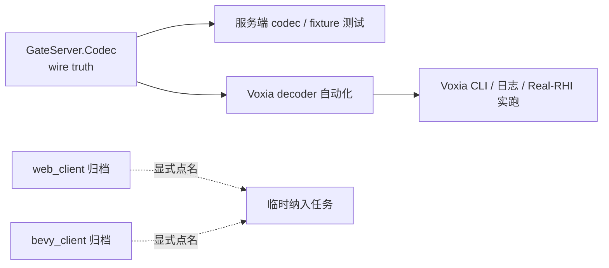

# Web / Bevy 客户端逻辑归档决策

> 状态：已批准，已实施（实施改动保留在当前工作树，尚未提交）
> 决策日期：2026-07-14  
> 适用范围：`clients/web_client`、`clients/bevy_client` 及其默认开发、验证、CI、发布入口

## 1. 决策

`clients/Voxia` 是仓库唯一现役客户端，也是默认开发、联调、协议消费验证和里程碑验收对象。

`clients/web_client` 与 `clients/bevy_client` 自本决策起进入**逻辑归档**：代码和历史资料保留原位，但不再参与默认架构设计、功能实现、协议 parity、测试矩阵、CI、发布或进度判断。只有用户显式点名其中一个客户端时，相关工作才可以临时重新进入任务范围。

这次归档不移动目录、不删除代码，也不把历史证据改写成当前实现。

## 2. 当前客户端边界

| 客户端 | 状态 | 默认职责 |
|---|---|---|
| `clients/Voxia` | 现役 | 唯一产品客户端；承担用户入口、自动化入口、CLI / 日志入口与客户端实跑验收 |
| `clients/web_client` | 归档 | 仅保留历史实现和证据；显式点名时才读取、运行或修改 |
| `clients/bevy_client` | 归档 | 仅保留历史实现和证据；显式点名时才读取、运行或修改 |

协议真值仍由 `apps/gate_server/lib/gate_server/codec.ex` 持有。服务端 codec / golden fixture 测试负责 wire contract，Voxia decoder 自动化与实跑负责现役客户端消费验证；Web / Bevy parity 不再是默认门禁。

## 3. 默认工作流

默认任务不得因为 Web / Bevy 未同步、未构建或测试失败而阻塞。新增功能、协议字段、运行时调试面和验收证据只要求落到服务端契约与 Voxia 现役路径。

## 4. 自动化与脚本处理

实施时按以下规则收口：

1. 默认 CI 不再运行 `bevy_client` 测试。
2. Web 客户端不再随 `master` 路径变更自动发布；发布 workflow 只保留手动触发。
3. 根级通用客户端入口不得继续默认启动 Web 或 Bevy；应显式失败并指向 Voxia 当前入口，不能静默重定向到不同运行时。
4. 名称已明确包含 `web`、`browser` 或 `bevy` 的专用脚本可以保留。直接调用这些脚本视为对归档客户端的显式选择。
5. 归档客户端自己的测试、构建和工具保持可运行，但不进入默认验证清单。
6. 日常服务端部署不得隐式发布归档 Web 客户端；只有显式归档部署开关与非空镜像同时成立时才允许进入该发布分支。

## 5. 文档治理

- 根 `AGENTS.md`、根 `README.md`、`docs/00-current-truth/**` 和活跃实现索引必须使用本决策的现役 / 归档口径。
- 两个归档客户端的 README 顶部必须显示归档说明、默认不维护声明和显式启用条件。
- `docs/20-archive/**`、`docs/30-reference/**`、审计记录及日期型历史实施文档继续按当时事实保留；引用 Web / Bevy 不代表恢复其现役身份。
- 仍位于 `docs/10-active/**` 的文档若把 Web / Bevy 写成后续交付目标，应标明该客户端部分已退出默认范围；服务端部分和历史证据不因此失效。

## 6. 重新启用条件

以下任一行为都不能隐式解冻归档客户端：读取旧代码、修复服务端兼容性、保留 decoder、运行历史回归或维护构建可复现性。

只有用户明确要求重新考虑、开发、验证或发布某个归档客户端时，才能在该任务内临时纳入；若要恢复为长期现役客户端，必须新增或更新客户端策略决策，并同步根准则、current-truth、CI 和默认验证入口。

## 7. 验收标准

实施完成需同时满足：

- 根准则与 current-truth 只把 Voxia 列为现役客户端。
- 默认协议验收不再依赖 Web / Bevy parity。
- 默认 CI 不运行 Bevy；Web 发布不再由普通 push 自动触发。
- 日常服务端升级默认跳过归档 Web 静态包，显式开关缺失时不得拉取或替换客户端资源。
- 通用启动入口不再启动归档客户端。
- 两个客户端目录和历史证据均被保留。
- 全仓现役引用扫描后，剩余 Web / Bevy 引用要么是显式归档入口，要么是清楚标识的历史 / 参考证据。
