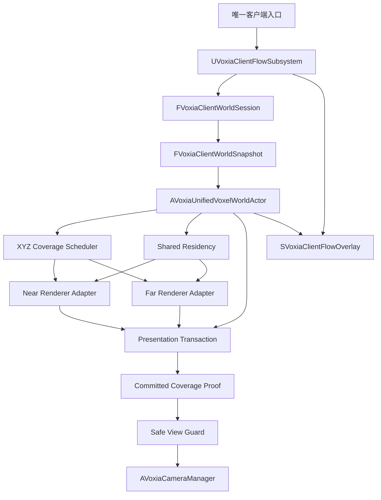

# Voxia 阶段 1 PRD：世界渲染与场景生命周期

## 1. 产品结果

阶段 1 要把 Voxia 收敛为一个可长期扩展的离线 Mock 世界客户端，而不是继续维护“近场系统”和“远景系统”两条并行事实。玩家首次启动客户端后自动创建 Mock 会话，进入唯一生产 world root；可在完整 XYZ 空间连续移动，近场与远景始终消费同一份世界快照，并能经历加载、流式更新、短时安全视图、显式失败、重试和返回主菜单。

未来接入 Online 时，只替换会话 bootstrap 与权威数据 provider，不重写世界调度、渲染提交、相机安全视图和生命周期 UI。

## 2. 范围与阶段边界

### 2.1 阶段 1 必须交付

- 唯一生产入口与唯一 `AVoxiaUnifiedVoxelWorldActor` 组合根。
- 会话级共享、只读的 world snapshot、source identity、provider、revision 契约。
- 完整 XYZ 的近场窗口、远景 LOD、调度、驻留和切换事务。
- opaque、translucent、emissive 三类材质的近远景连续表达。
- 根级生命周期状态机、可诊断失败、相机 safe-view、人工重试和返回主菜单。
- 真实用户入口、自动化入口、CLI / 结构化日志入口与 Real-RHI 证据。

### 2.2 明确后置

- 阶段 2：挖掘、放置、pending UI、confirmed overlay、会话 HUD。
- 阶段 3：prefab、模型、体素混合场景。
- 阶段 4：设计器与内容制作工作流。
- 阶段 5：局部场与环境现象。
- 阶段 6：最终 HUD、性能和产品化收口。
- 后续 Online：服务端 bootstrap、权威 snapshot / delta 与在线会话。

阶段 1 的 `ConfirmedRevision` 固定为 `0`。所有编辑入口必须隐藏或禁用；若通过测试或 CLI 误触发，必须返回 `feature_not_available_phase2`，不得静默修改本地世界。

这里的 `0` 只是为未来 Online 接口预留的兼容占位，不得把离线 WorldGen 或本地包称为服务端 confirmed truth。`mock_local_disk` 必须在入场前通过 manifest、page、identity 与 H gate；`mock_worldgen` 必须冻结并校验 algorithm version、seed、配置与 source identity。任一校验失败都拒绝入场，且两种 provider 之间不得静默 fallback。

### 2.3 不进入本阶段

- 不修改 `apps/**`、线协议、HTTP API 或服务端权威路径。
- 不读取、开发或验证归档的 Web / Bevy 客户端。
- 不把旧 WorldGen transport 结果继续当作第二份生产 truth。
- 不引入 raymarch、VHI、XZ column、有限 Y 带或 `Y=0` 兼容路径。
- 不以 near-only、far-only、专用地图或参数 probe 代替生产组合根验收。

## 3. 玩家故事与体验规则

### 3.1 首次进入

1. 客户端启动后自动创建 Mock 会话，不要求玩家选择服务器或存档。
2. UI 进入 `initial_loading`，根取得 world snapshot 后开始计算进度。
3. 只有 near、far、snapshot revision、ownership 与 presentation fence 全部一致时，才进入 `playable`。
4. 加载期间不允许控制 pawn，也不展示“半个世界”。

### 3.2 连续游玩

- 玩家可以沿正负 X、Y、Z，斜向和跨多个 tile 连续移动。
- 单轴跨越一个 tile 时必须满足 `entered/exited = 9 tiles = 3087 chunks`、`retained = 18 tiles = 6174 chunks`。
- 近场窗口固定为 `3×3×3 tiles = 27 tiles = 9261 chunks`。
- 某一帧近场允许没有几何，但远景不得因此被清空；两者均来自同一 snapshot。
- A→B→A、高空→地面→高空和 teleport 后，内容 identity、材质分类与 revision 必须可复现。

### 3.3 安全视图

当候选相机视锥不能被已提交世界覆盖时，只保持最后一个安全相机视图；不得冻结 pawn、篡改 control rotation、移动几何或把未知区域当空气。

- 持续不足 `250 ms`：只记录结构化事件。
- 达到 `250 ms`：展示非阻塞“正在同步世界”。
- 达到 `2 s`：进入恢复加载界面，提供“重试”和“返回主菜单”。
- provider 无效、snapshot 不一致、预算拒绝等显式硬错误立即失败，不等待阈值。

### 3.4 恢复与主菜单

- 重试为 single-flight，次数不限，不自动重试。
- 重试保持同一 session snapshot，但必须创建新的 presentation generation。
- 重试连续 `30 s` 没有新的 progress epoch 时失败为 `retry_stalled`。
- 返回主菜单必须结束世界会话；主菜单阶段 1 只提供“开始新游戏”和“退出”。

## 4. 当前基线与缺口

| 能力 | 当前事实 | 阶段 1 缺口 |
|---|---|---|
| 唯一组合根 | 已有 `AVoxiaUnifiedVoxelWorldActor` | 仍主要包装两个独立 actor |
| 近场 | `AVoxiaWorldActor` 可运行 | 仍从 transport / `FVoxiaVoxelStore` 取得独立 WorldGen truth |
| 远景 | Pure-3D actor、diff、取消与 stable patch 已存在 | provider、驻留和根状态仍未统一 |
| 同一世界 | root 可发布 source identity | 尚无 near / far 共用的 snapshot / residency |
| 生命周期 | far 有局部状态枚举 | 没有会话级、根级状态机 |
| 流式提交 | 各子系统有自己的准备与提交 | 没有统一 generation / ownership / fence 事务 |
| safe-view | 无 | 缺根级 proof 与相机最终发布 guard |
| UI | HUD 主要是诊断 Canvas | 缺加载、恢复、重试和菜单流程 |
| 材质 | near 有多 bucket，far 主要是一种 presentation material | 缺 material family 连续性 |
| 调度 / oracle | far 有部分能力 | 缺完整 XYZ 根级 profile、full oracle 与长航行证据 |

## 5. 方案裁决

采用“根级协调器 + 共享 world snapshot / provider / residency”方案：保留已经验证过的 near / far renderer 实现，把数据来源、覆盖规划、事务提交、生命周期和安全视图提升到唯一组合根。

不采用以下方案：

1. **继续做薄 wrapper**：改动小，但会保留两份 truth、两套生命周期和不可证明的帧间边界。
2. **一次性重写全部 renderer**：长期形态整洁，但风险集中，无法复用当前 far diff / cancel / stable patch 与 near material bucket 的验证成果。

## 6. 目标架构

### 6.1 会话与共享快照

`UVoxiaClientFlowSubsystem` 是 `UGameInstanceSubsystem`，只负责 profile、会话创建 / 销毁、流程状态与 UI 命令，不拥有 renderer 或世界 UObject。

`FVoxiaClientWorldSession` 持有只读 `FVoxiaClientWorldSnapshot`：

- `session_id`
- `runtime_profile = mock`
- `source_identity`
- `world_snapshot_id`
- `confirmed_revision = 0`
- 共享 provider
- `authority_kind = mock_worldgen | mock_local_disk`

provider 选择与授权校验是会话级决策；residency、presentation artifact 和世界 UObject 属于组合根。重试复用 snapshot，返回菜单结束 session，禁止跨 session 不安全复用。

### 6.2 组合根职责

`AVoxiaUnifiedVoxelWorldActor` 独占以下职责：

- 绑定并校验 snapshot。
- 计算完整 XYZ desired coverage。
- 维护共享 residency、generation、ownership 与 root transaction。
- 汇总 near / far 角色 readiness、进度和错误。
- 发布生命周期、safe-view proof、CLI state 与结构化事件。
- 执行 retry、leaving 与 `EndPlay` 清理。

根状态固定为：

`bootstrapping → initial_loading → playable ↔ streaming → safe_view_hold → streaming_recovery_loading → retrying / leaving → menu_idle`。

### 6.3 Near / Far adapter

Near adapter 通过 renderer-neutral view 消费 canonical snapshot / residency。Mock 生产路径不再使用 transport WorldGen baseline；未来 Online 迁移期可以保留 transport adapter，但必须显式标记来源，且不得失败后回退到本地 WorldGen。

Far adapter 保留既有 diff、cancel、artifact 与 stable patch 能力，但 provider / residency 从根注入；`ProviderInvalidated`、预算拒绝与 stale completion 必须上报根，far 不再拥有第二套生产生命周期。

### 6.4 完整 XYZ 调度 profile

Scheduler 只做纯规划，不执行 IO，也不创建 UObject。阶段 1 默认 profile：

| 路由 | 半径 / 步长 | 稳定延迟 | 优先级 |
|---|---:|---:|---:|
| near | `3×3×3` / tile radius 1 | `0 ms` | 0 |
| far L0 | 4 / 1 | `0 ms` | 1 |
| far L1 | 8 / 1 | `50 ms` | 2 |
| far L2 | 24 / 2 | `150 ms` | 3 |
| far L3 | 40 / 4 | `300 ms` | 4 |
| far L4 | 72 / 8 | `600 ms` | 5 |

普通移动需连续 3 帧稳定后提交新计划；initial load、teleport、retry、source revision 变化立即计划。每个 band 最多一个 in-flight generation 与一个 latest pending generation。

现有 `32×32×32` stable patch 先成为显式 profile 字段，不凭经验立即改写；只有 Real-RHI 与 versioned full-oracle 证据支持时才调整。

### 6.5 根级 presentation transaction

每次事务必须包含：snapshot id、revision、generation、role / band、required、retained、replacement、removal、ownership、resource budget 与 presentation fence。

同一 changed set 全有或全无；不同 far band 可以独立收敛，但任一可见帧必须满足：

- `coverage_gap_count = 0`
- `coverage_overlap_count = 0`
- `stale_commit_count = 0`

### 6.6 Safe-view guard

Safe-view guard 是可单测的纯状态机。组合根发布 committed coverage proof；camera manager 在最终发布 view 前，使用与 scheduler 相同的完整 XYZ 量化规则，把候选 frustum 映射到 required coverage，再决定发布候选 view 或保持 last-safe view。

## 7. 生命周期、超时与清理语义

### 7.1 初次加载

冷启动计时从组合根取得 snapshot 并开始第一个 generation 时开始，不包含引擎启动、shader 初始化或 root 创建前的地图加载。显式硬错误立即结束；无显式错误时，`300 s` 仍未进入 playable 则失败。

### 7.2 重试

重试开始时取消旧 generation、清理 hidden / retiring presentation，并创建新的 presentation generation。旧 generation 的 completion 必须被 stale guard 丢弃。`30 s` progress epoch 不变即 `retry_stalled`；provider、预算、snapshot 校验等明确错误立即结束重试。

### 7.3 返回菜单

`leaving` 先触发取消与 renderer cleanup handshake，最长等待 `5 s`。超时必须记录 `leaving_cleanup_timeout`，随后销毁世界 UObject 与 session，但不得在日志或 UI 中声称 clean shutdown。

## 8. UI 与输入

阶段 1 使用 `SVoxiaClientFlowOverlay` 通过 `UGameViewportClient` 覆盖生产 world；不创建第二张生产菜单地图。

| 状态 | UI | 输入模式 |
|---|---|---|
| `initial_loading` | 进度、当前阶段、可诊断错误 | UI only |
| `playable` / `streaming` | 默认无流程遮罩 | Game only |
| `safe_view_hold` < 250 ms | 无视觉提示 | Game only |
| `safe_view_hold` ≥ 250 ms | 非阻塞同步提示 | Game only |
| `streaming_recovery_loading` | 重试、返回主菜单 | UI only |
| `retrying` | 进度；按钮禁用 | UI only |
| `menu_idle` | 开始新游戏、退出 | UI only |

阶段 1 必须隐藏编辑 affordance。若未来引入阻塞式 `LoadMap`，才考虑使用 MoviePlayer 承担引擎级加载画面；当前 world-session 流程由 viewport overlay 统一承载。

## 9. 材质连续性

Near 至少稳定支持三类 family：

- opaque
- translucent：冰、水、蒸汽等
- emissive：按现有内容优先级接入

Far patch artifact 必须保存 material id / family、material histogram、world scale、policy version 与 algorithm version。far presentation 不得把所有材料压成单一 pass，至少按三类 family 生成独立 pass / component。

近远景交接使用世界空间互补 dither，持续不超过 `100 ms`；新 presentation 失败时继续保留旧 live presentation，不得先删旧内容再暴露空洞。

## 10. 资源预算、性能与正确性

### 10.1 显式预算

Streaming profile 必须公开并冻结：

- residency page / bytes 上限
- live / hidden / retiring component 上限
- 单 patch quad / vertex / bytes 上限
- game-thread stage / commit / retire 预算
- cancellation quantum
- 各 band queue 与 deadline

单 patch 上限由 clean full-route 实跑最大值加 `25%` 余量得出并写入版本化 profile；运行时不得学习、动态增长或自抬预算。超限必须在 hidden publish 前显式失败。

### 10.2 阶段 1 性能门禁

在当前验收机 Real-RHI、`1280×720` 与 `1600×900` 下：

- root streaming 相关 game-thread 工作 `p95 ≤ 8.33 ms`。
- 不出现由 streaming 引起的 `> 16.67 ms` 帧。
- 每个 band `queue_depth ≤ 1`。
- 30 分钟航行无单调增长的 residency、component、artifact 或 pending generation。
- safe-view hold 是异常保护，不得成为正常移动的常态。

### 10.3 Full oracle

离线 full oracle 必须精确比较：coverage owner、surface fingerprint、quad / vertex 数、material histogram、patch key、gap 与 overlap。oracle 只作为自动化真值，不得成为运行时 fallback。

## 11. 可观测性契约

### 11.1 CLI

阶段 1 必须提供：

- `client_flow_state`
- `voxel_world_root_state`（扩展为 session / snapshot / revision / generation / root phase / progress / error）
- `voxel_streaming_profile`
- `safe_view_state`
- `client_flow_retry`
- `client_flow_return_to_menu`
- `client_flow_start_new_game`
- `until_client_playable [timeout_ms]`

near / far 专用命令继续存在，但只标为 probe，不构成生产完成证明。

### 11.2 结构化事件

至少包含：

- `client_session_created | ending | destroyed`
- `client_flow_state_changed`
- `world_snapshot_bound | rejected`
- `coverage_desired | superseded | committed | failed`
- `presentation_transaction_staged | committed | failed | retired`
- `safe_view_hold_started | soft_notified | recovered | hard_failed`
- `retry_started | blocked | succeeded | failed`
- `return_to_menu_started | completed`
- `material_transition_started | committed | failed`
- `resource_budget_rejected`

公共字段至少包括 `session_id`、`snapshot_id`、`revision`、`generation`、`source_identity`、`desired_coverage`、`live_coverage`、`reason` 与单调时间戳。

观察产物统一写入 `.demo/observe/voxia_phase1_*`，机器汇总使用 JSON。

## 12. 验收矩阵

| 场景 | 真实用户 | 自动化 | CLI / 日志 | Real-RHI |
|---|:---:|:---:|:---:|:---:|
| 首次启动自动进入 Mock world | ✓ | ✓ | ✓ | ✓ |
| 正负 X / Y / Z 单轴移动 | ✓ | ✓ | ✓ | ✓ |
| 斜向与连续跨多 tile | ✓ | ✓ | ✓ | ✓ |
| A→B→A 内容复现 |  | ✓ | ✓ | ✓ |
| 地面→高空→地面 | ✓ | ✓ | ✓ | ✓ |
| teleport 与 stale generation 抑制 |  | ✓ | ✓ | ✓ |
| H 缺失 / 错误 / snapshot 不一致 |  | ✓ | ✓ |  |
| resource budget 超限 |  | ✓ | ✓ |  |
| safe-view 250 ms / 2 s 阈值 | ✓ | ✓ | ✓ | ✓ |
| retry single-flight / stalled | ✓ | ✓ | ✓ | ✓ |
| 返回菜单→开始新游戏 | ✓ | ✓ | ✓ | ✓ |
| opaque / translucent / emissive 近远连续 | ✓ | ✓ | ✓ | ✓ |
| 30 分钟完整 XYZ 航行 |  | ✓ | ✓ | ✓ |

所有生产验收必须从唯一 root 启动，并同时读取 near + far root-level proof。截图仅作辅助，不替代 CLI、日志、自动化与 Real-RHI 指标。

## 13. 实施切片边界

本节只定义可独立验收的产品切片，不替代后续 implementation plan：

1. **P1-A：Session / flow / observe** — 会话模型、根流程状态与 CLI 只读面。
2. **P1-B：共享 snapshot / provider / residency** — 根绑定契约并迁移 near Mock 数据入口。
3. **P1-C：scheduler / transaction / safe-view** — 完整 XYZ 规划、统一提交和相机保护。
4. **P1-D：materials / budgets / full oracle** — 三类材质、冻结预算与精确 oracle。
5. **P1-E：UI / retry / menu** — viewport overlay、恢复、会话销毁与新游戏。
6. **P1-F：全路径收口** — 完整 XYZ Real-RHI、30 分钟 soak 与根级 readiness。

每个切片必须同时交付 build、自动化、CLI / 日志证据，并形成独立 commit；未通过根级联合门禁时，只能报告“子模块完成”，不得报告阶段 1 完成。

## 14. 系统正交自查

| 系统 | 自己维护的不变量 | 禁止依赖的隐式假设 |
|---|---|---|
| Flow | session 生命周期、UI 命令 single-flight | renderer 会自行结束 session |
| Snapshot | source / revision / provider identity 稳定 | near / far 恰好生成相同内容 |
| Scheduler | 完整 XYZ desired coverage 与 supersession | renderer 自己猜 coverage |
| Residency | owner、引用与预算 | 子 actor 永远按某顺序销毁 |
| Transaction | generation、fence、全有或全无提交 | completion 到达顺序稳定 |
| Safe-view | last-safe view 与阈值 | pawn 停止等于画面安全 |
| UI | 状态投影与输入模式 | HUD 或地图加载自然同步 |

## 15. Unreal Engine 边界依据

- [`UGameInstanceSubsystem`](https://dev.epicgames.com/documentation/unreal-engine/API/Runtime/Engine/UGameInstanceSubsystem?lang=en-US) 与 [`UGameInstance`](https://dev.epicgames.com/documentation/en-us/unreal-engine/API/Runtime/Engine/UGameInstance)：用于跨 world 的客户端 flow / session 生命周期。
- [`APlayerCameraManager`](https://dev.epicgames.com/documentation/en-us/unreal-engine/API/Runtime/Engine/APlayerCameraManager)：用于最终 camera view 发布前的 safe-view guard。
- [`UGameViewportClient`](https://dev.epicgames.com/documentation/unreal-engine/API/Runtime/Engine/UGameViewportClient)：用于 world-session 级流程 overlay。
- [`MoviePlayer`](https://dev.epicgames.com/documentation/unreal-engine/API/Runtime/MoviePlayer?lang=en-US) 与 [`FLoadingScreenAttributes`](https://dev.epicgames.com/documentation/en-us/unreal-engine/API/Runtime/MoviePlayer/FLoadingScreenAttributes)：仅保留给未来阻塞式地图加载。
- [`FCoreUObjectDelegates`](https://dev.epicgames.com/documentation/en-us/unreal-engine/API/Runtime/CoreUObject/FCoreUObjectDelegates)：用于核对 map / world 生命周期事件边界。

## 16. 自检结论

- 本 PRD 的产品问题均已有明确裁决，无临时标记。
- 阶段 1 只读 snapshot 与阶段 2 编辑 overlay 已明确隔离。
- 阶段 3 prefab 未混入阶段 1 验收。
- 没有修改服务端、wire 或归档客户端边界。
- 完整 XYZ、唯一组合根、服务端权威兼容方向和显式失败均得到保持。
- 方案状态为 `approved`：书面规格已由用户最终确认，阶段 1 实现获准开始；在全部门禁通过前仍不得报告阶段完成。

## 17. 审批记录

用户已于 2026-07-15 确认阶段 1 的推荐方向、范围与默认参数，并在审阅本文后授权自行编写计划和执行，目标为阶段 1 实施与验证完成。当前只展开阶段 1；阶段 2–6 保持冻结。
