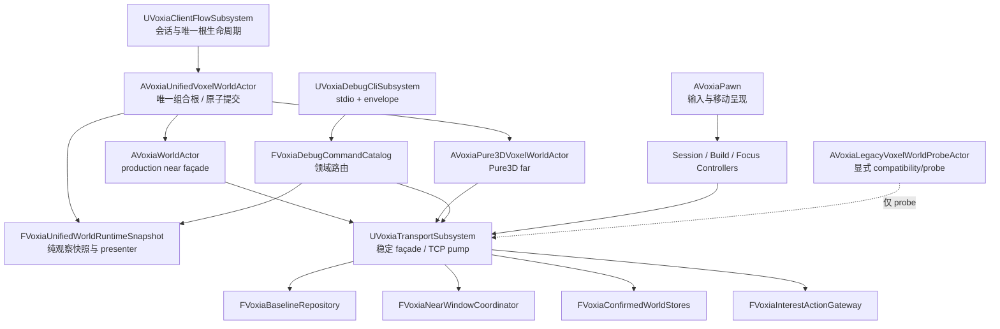

# Voxia 工业级代码审查与无行为变化治理设计

## 1. 结论先行

Voxia 当前唯一 `production_all_features` 根已经具备可运行、可自动化和可观察的完整 XYZ
流送闭环；本轮审查没有发现需要回滚现有权威窗口行为的功能性错误，也没有发现后台任务直接持有
失效 UObject 的确凿证据。当前主要风险是：生产路径继续扩展时，少数超大对象同时承担过多系统职责，
显式契约逐渐退化为 owner 类型、全局命令行和手工 JSON 之间的隐式约定。

推荐采用**分阶段的契约缝抽取**：先用特征测试冻结现有行为，再抽取纯状态投影、CLI 路由和显式
运行时配置，最后迁移 near/legacy、Transport 和 Pawn 的所有权。第一批修复不改协议、不改可见效果、
不改流送阈值、不增加第二个生产根，也不把物理拆文件伪装成架构完成。

当前已发布基线：

- 服务端/总仓：`origin/master@9134368c`。
- Voxia 候选分支：`origin/codex/voxia-phase1-hardening-closeout@a37dfeb`。
- 自动化：`Voxia` 70/70 成功，证据在
  `.demo/observe/voxia_authority_streaming_final_20260718_122257/`。
- Null-RHI 全路线：25 条路线通过，证据在
  `.demo/observe/voxia_phase1_2026-07-18T04-24-07-621Z_null_rhi_1280x720/`。
- Real-RHI 功能路线：25 条路线完成且 `LogVoxia` error 为 0；第二性能窗口仍有
  GameThread `>16.67ms=2`，因此性能门禁保持未关闭。证据在
  `.demo/observe/voxia_phase1_2026-07-18T04-26-34-025Z_real_rhi_1280x720/`。

## 2. 审查范围与原则

### 2.1 纳入范围

- 唯一生产组合根：`AVoxiaUnifiedVoxelWorldActor`、`UVoxiaClientFlowSubsystem`。
- 直接运行时依赖：`AVoxiaWorldActor`、`AVoxiaPure3DVoxelWorldActor`、
  `UVoxiaTransportSubsystem`、`AVoxiaPawn`。
- 非 GUI 等价观察面：`UVoxiaDebugCliSubsystem`、`FVoxiaObserve`、各类 snapshot/probe。
- 相关自动化、目录 README、Build.cs 与当前阶段设计文档。

### 2.2 排除范围

- 归档 Web/Bevy 客户端。
- 新协议、新玩法、新渲染效果和线上 confirmed provider 接入。
- 为了缩短文件而进行的机械搬运，除非它同时建立了明确所有权和可测试边界。
- 旧 VHI/heightmap/SVO 的功能增强；它们只允许作为显式 compatibility/probe 迁移或删除对象。

### 2.3 不变量

1. 唯一生产根、完整 XYZ、服务端权威和 confirmed truth 边界不变。
2. 玩家进入新 tile 后后台 staging，不撤销已提交 readiness；超出旧 committed coverage 后第
   1～2 个 chunk 保持 safe view，第 3 个 chunk 才进入全屏恢复加载。
3. CLI 命令名、顶层 `ok` 语义、关键 JSON 字段和 observe event 名不变。
4. baseline/H gate 继续硬失败，不能以运行时 snapshot、自愈或 WorldGen 静默兜底。
5. 现有 async cancellation、mailbox、generation/serial 和 game-thread commit 语义不变。
6. 不创建并列 GameMode/world root，不让 probe 进入正式 readiness。

## 3. 事实证据

下表使用物理行数和当前源文件的直接静态统计；数值用于说明变更半径，不单独作为重构理由。

| 对象 | `.cpp` 行数 | 类方法定义 | `FCommandLine::Get()` | `FString::Printf` | 已确认职责 |
|---|---:|---:|---:|---:|---|
| `AVoxiaUnifiedVoxelWorldActor` | 786 | 18 | 2 | 6 | 子 actor 生命周期、coverage/proof、safe-view、flow 通知、observe/JSON |
| `AVoxiaWorldActor` | 8,748 | 118 | 51 | 44 | production near、旧 SVO/VHI/heightmap、上传/fade/ownership、probe |
| `UVoxiaTransportSubsystem` | 8,362 | 151 | 74 | 313 | TCP/auth、HTTP baseline、pack 持久化、near prepare、confirmed stores、movement、Interest/remote action、旧 far build |
| `UVoxiaDebugCliSubsystem` | 5,166 | 11 | 6 | 131 | stdio 生命周期、性能采样、117 个左右的跨域命令、actor/subsystem 定位、JSON |
| `AVoxiaPawn` | 3,226 | 69 | 39 | 52 | 输入/移动、启动订阅、prefetch、编辑、focus/remote action、overlay、demo/stress |

其他证据：

- `AVoxiaWorldActor::BeginPlay` 通过
  `Cast<AVoxiaUnifiedVoxelWorldActor>(GetOwner()) == nullptr` 推断自己是 production near
  还是 standalone legacy；同一类的 Tick 再由 `bFarPresentationEnabled` 维护两套生命周期。
- `AVoxiaWorldActor.h` 同时公开 near readiness 与 SVO raymarch/VHI/far backend，并持有大量旧
  far 组件、缓存、上传器、fade、mask 和统计状态。
- `UVoxiaTransportSubsystem.h` 的公共面同时暴露登录、baseline、窗口准备、TCP 发送、移动、
  voxel 编辑、Interest、remote action、VHI/SVO 与 confirmed stores。
- `UVoxiaDebugCliSubsystem::ExecuteCommand` 从约第 3091 行延伸到文件末尾，采用长 `if` 链分派
  所有领域；当前自动化没有直接引用 unified root 或 debug CLI router。
- 模块共有 89 个 automation test 声明，但集中在纯算法和子系统 reducer；组合根和命令目录
  主要依赖 smoke 间接覆盖。
- 至少 11 个 `.cpp` 各自实现 `JsonEscape`/`JsonString`。`Voxia.Build.cs` 为避免 unity blob 内
  匿名命名空间同名助手冲突而全模块设置 `bUseUnity=false`，这是重复基础设施已经影响构建策略的
  直接证据。
- 生产根的 `ProbeJson` 与 `SnapshotJson` 重复采集 near/far/staging/proof，并重复同一段嵌套三元
  streaming-state 判定；一次逻辑观察内多次读取 live state，缺少冻结的观察快照。
- 注释语言未统一：`AVoxiaPawn.cpp/.h` 的纯英文注释分别约为 164/182、60/71，Transport 头文件
  也有 52/81；不符合仓库“代码注释统一中文”的约束。
- `Gameplay/README.md` 已达 633 行，同时承载当前生产职责与大量 SVO/raymarch 历史细节，现役
  契约被迁移史淹没。

## 4. 分级审查结论

### 4.1 高优先级：所有权与生命周期边界

#### H1 — production near 与 legacy far 共享一个 Actor

根因不是 `VoxiaWorldActor.cpp` 太长，而是一个 actor 依据 owner 类型推断角色，随后维护两套互斥
运行时。owner 类型是构造细节，不是稳定契约；新增入口、测试宿主或 spawn 方式都可能改变角色
判定。生产 near 也被迫编译、持有和理解旧 far 状态，增加释放、Tick 和回归半径。

治理方向：先引入显式、BeginPlay 前冻结的角色绑定；再保留 `AVoxiaWorldActor` 作为 production
near 的稳定外观，把旧 far 迁入只允许 probe 创建的 `AVoxiaLegacyVoxelWorldProbeActor`。不能反过来
让 production root 依赖 legacy actor，也不能同时创建两条生产路径。

#### H2 — Transport 是跨领域可变状态汇合点

Transport 同时拥有会话、HTTP/磁盘 baseline、窗口 worker、confirmed stores、行为 outbox 和旧
far build。任何一个领域的 Tick、reset、disconnect 或命令行解析都可能影响其他领域，难以证明
“一个系统自行维护自己的时间性不变量”。

治理方向：保留 `UVoxiaTransportSubsystem` 作为兼容 façade 和唯一 GameInstance 生命周期入口，
逐步委托给可单测组件；先抽 baseline repository/near-window coordinator，再抽 confirmed store
聚合和 Interest/action gateway。TCP session/pump 最后保留在 façade，避免一次性重写网络主路径。

#### H3 — CLI 目录没有可验证的稳定路由合同

CLI 是正式验收面，但命令发现、帮助、参数处理、对象定位和业务执行都在一条长分支中。增加命令时
无法自动证明无重名、help 与实现一致、归档命令仍硬拒绝、未知命令稳定失败。

治理方向：建立不可变 `FVoxiaDebugCommandSpec` 目录和按领域 handler；Subsystem 只负责 stdio、
排队、结果 envelope 和路由。命令 token 与 payload 由特征测试冻结，handler 不拥有 confirmed truth。

### 4.2 中优先级：可读性、配置与观察一致性

#### M1 — 全局命令行在运行时被重复解析

`WorldActor`、`Transport`、`Pawn` 合计至少 164 处直接读取全局命令行。配置来源和解析时机分散，
同一进程内的对象无法证明消费的是同一冻结配置，也很难对非法组合做一次性校验。

治理方向：由最早启动边界解析 `FVoxiaClientRuntimeConfig`，记录 source/validation，并以只读绑定
传入根、near、far、Transport 和 Pawn controller。`FVoxiaPreviewRuntimeProfile` 继续只负责 legacy
启动门禁，不能膨胀成新的全局 service locator。

#### M2 — 观察投影重复且非原子

组合根在 probe、snapshot 和 event 中分别读取 live 子状态并重复派生 phase。即使 game thread 当前
大多串行，这仍让字段一致性依赖调用顺序，未来异步边界扩大后更难维护。

治理方向：每次观察先生成纯值 `FVoxiaUnifiedWorldRuntimeSnapshot`，再由 presenter 派生 phase、
authority coverage、probe、full snapshot 和 observe fields。domain 决策保持纯结构，序列化集中在
observer/presenter 边界。

#### M3 — JSON 基础设施重复并绑架构建模式

多个匿名命名空间各自维护 escape/string helper，行为细节已有差异，例如 `\r` 是丢弃还是转义。
为了规避同名符号，整个模块关闭 unity build，降低增量构建可扩展性。

治理方向：先引入单一、带自动化的 JSON value/writer helper，逐域迁移并保持 schema；只有所有
同名 helper/WriteU8 家族完成盘点且 unity 编译通过后，才能删除 `bUseUnity=false`。第一批不直接
翻转构建开关。

#### M4 — Pawn 混合用户控制、会话维护和测试驱动

Pawn 既是输入/移动呈现对象，又维护订阅/预取/lease、登录启动、编辑/focus、HUD debug 与自动
demo/stress 状态。它使“站着不动也必须续租”的活性不变量看起来依赖 Pawn tick，容易重演由调用方
碰巧维护 lease 的历史问题。

治理方向：订阅/lease 属于独立 session controller；build/focus 属于交互 controller；demo/stress
属于 debug scenario driver。Pawn 只保留输入绑定、移动呈现和把意图交给 controller。

### 4.3 规范与文档问题

- 公共接口注释和大量实现注释仍是英文，需要在触达文件时按领域改为中文；不能做没有语义审查的
  全仓机器翻译。
- `Gameplay/README.md` 应只保留当前职责、依赖、入口和验证，历史性能/旧 renderer 迁入
  `docs/20-archive/` 或对应历史设计。
- 各大对象缺少“允许依赖/禁止依赖”和 reset/liveness ownership 表，后续 README 必须补齐。

## 5. 未发现或暂不成立的问题

- Transport 的 pack worker 使用线程安全 mailbox；WorldGen/VHI/SVO 回投普遍通过
  `TWeakObjectPtr` 重新校验 UObject。当前未发现 worker 直接捕获裸 `this` 并跨生命周期使用的
  证据。同步 lambda 中出现 `[this]` 不能据此定性为悬空问题。
- 现有权威窗口阈值、单调 readiness 和 safe-view 行为已有纯 helper、automation 与两种 RHI
  smoke 证据，不应在本轮重构中重新设计。
- 文件行数不是故障；如果只拆 `.cpp` 而类仍共享同一组可变成员和隐式角色，风险不会下降。

## 6. 方案比较

### 方案 A：只拆 translation unit

把大 `.cpp` 按函数区域改成多个 `.cpp`，保持所有类和成员不变。

- 优点：改动表面较小，单文件更短。
- 缺点：所有权、配置、测试和生命周期耦合完全保留；公共头仍巨大；容易制造“已经治理”的错觉。
- 结论：只可作为完成契约抽取后的物理整理，不单独采用。

### 方案 B：分阶段契约缝抽取（推荐）

先冻结行为，再抽纯值/纯路由，保持现有 façade；随后按依赖方向迁移所有权。

- 优点：每步都有可回退边界，兼容当前蓝图/UCLASS/CLI，能够用 automation 和 smoke 证明无行为变化。
- 缺点：过渡期会暂时存在 façade 委托和旧接口，必须用进度表和退出条件防止半迁移永久化。
- 结论：符合大型生产项目的增量治理方式，推荐。

### 方案 C：重写 WorldActor/Transport/Pawn

新建完整运行时后一次切换。

- 优点：最终形态干净。
- 缺点：同时改动网络、baseline、窗口、渲染、输入和观察合同，无法隔离回归；会形成第二条生产路径，
  违反唯一组合根规则。
- 结论：拒绝。

## 7. 推荐目标结构

依赖必须单向：纯配置、纯状态和 reducer 不依赖 Actor/Subsystem；façade 可以依赖组件，组件不能回查
façade；probe 可以复用纯算法，但不能被生产 readiness 消费。

## 8. 分阶段修复计划

### R0：特征测试与结构门禁

1. 为 streaming phase 派生、root probe schema 和 authority observe fields 建立纯值特征测试。
2. 为 CLI command catalog 建立 token 唯一、help 完整、legacy hard reject、unknown command 测试。
3. 建立不允许 production root 生成多个 near/far owner 的结构测试或运行时断言。
4. 保存当前代表性 CLI JSON 作为可解析 schema fixture；只冻结合同字段，不冻结无意义的字段顺序。

退出条件：所有测试先在旧实现上通过；后续每个抽取提交都跑同一组测试。

### R1：组合根观察快照与 presenter

1. 新建 `FVoxiaUnifiedWorldRuntimeSnapshot`，单次采集 proof、player、near/far center、staging、error、
   readiness 和 source identity。
2. 新建纯 presenter，唯一派生 `initial_loading/preparing/safe_view_hold/overdue/ready/failed`。
3. `ProbeJson`、`SnapshotJson` 和 observe event 复用同一冻结快照；删除重复嵌套三元和重复 live lookup。
4. 根仍负责 spawn、bind、Tick、commit 和 flow notification，不在此阶段改变生命周期。

退出条件：root 文件显著收敛；所有现有字段与事件通过特征测试和 phase1 smoke。

### R2：CLI 命令目录与领域 handler

1. 建立 command spec（token、aliases、domain、availability、legacy policy、help）。
2. 按 `flow/runtime`、`voxel/presentation`、`interest/action`、`player/input`、`engine/perf` 分 handler。
3. Subsystem 只保留 stdin thread、队列、Tick/Pump、result envelope 和 dispatch。
4. handler 显式接收只读/可变 context，禁止在匿名 helper 中重新成为 service locator。

退出条件：`ExecuteCommand` 不再是跨域长分支；help 由目录生成；代表性命令逐字节或逐字段等价。

### R3：统一 JSON 与冻结运行时配置

1. 先统一 JSON escape/string/value writer 并覆盖控制字符测试；逐域迁移，禁止一次全仓替换。
2. 盘点 `WriteU8` 等 unity 冲突家族；确认所有冲突移除后单独验证 unity build，再决定是否恢复。
3. 建立 `FVoxiaClientRuntimeConfig`，按 startup、network、near、far、input/debug 子结构一次解析和校验。
4. 配置通过 Bind/constructor 进入 owner；运行中不得再次读取全局命令行，明确标记真正允许热变更的 tuner。

退出条件：生产根及其直接依赖不再散读命令行；配置 snapshot 可由 CLI/observe 输出且不含凭据。

### R4：production near 与 legacy actor 分离

1. 先用显式 `EVoxiaWorldActorRole`/Bind contract 替代 owner cast；未绑定、重复绑定和 BeginPlay 后绑定
   均硬失败。
2. 把旧 SVO/VHI/heightmap renderer 状态迁入 `AVoxiaLegacyVoxelWorldProbeActor`。
3. `AVoxiaWorldActor` 保留 production near façade 和现有根调用面，逐步缩小头文件。
4. 迁移旧地图/CLI probe 后，删除 `bFarPresentationEnabled` 双生命周期和退出兼容分支。

退出条件：production near 的头/实现不引用旧 far renderer；legacy actor 无法注册为生产根子模块。

### R5：Transport façade 组件化

按以下顺序迁移，每次只移动一个 owner：

1. baseline HTTP/磁盘仓库；
2. near-window prepare/worker/liveness coordinator；
3. confirmed voxel/field/remote actor/object stores；
4. Interest/remote action gateway；
5. 删除 Transport 内旧 VHI/SVO build runtime。

`UVoxiaTransportSubsystem` 在全部调用方迁移前保留原方法签名并委托。每个组件必须自行维护 timeout、
retry、lease、reset 和 generation 不变量，并提供纯 snapshot。

### R6：Pawn controller 与文档收口

1. 抽 subscription/session controller，确保 lease 不依赖玩家移动或某个输入 Tick。
2. 抽 build/focus/remote interaction controller。
3. 抽 demo/stress/edit-shot driver 到 Debug。
4. Pawn 保留输入、移动呈现和 controller 编排。
5. 将触达代码的英文注释改成中文；拆分 Gameplay README 的当前真值与历史证据。

## 9. 第一批建议实施范围

为控制回归面，第一次获得设计批准后只实施 `R0 + R1 + R2`，并同步清理触达文件的中文注释和
README 当前职责。它们能直接解决本轮新功能附近的重复状态投影、CLI 可维护性和测试盲区，同时不碰
Transport/WorldActor/Pawn 的核心生命周期。

`R3～R6` 继续保留在同一治理主线，但每个阶段都需要独立实现计划和新鲜验证。尤其不能在第一次
提交中同时拆 Transport 和 WorldActor；那会把“无行为变化”变成无法证明的口号。

第一批明确不做：

- 不改 3-chunk overdue 阈值与 safe-view 状态机。
- 不改 wire codec、baseline 格式、HTTP/TCP、worker 或渲染算法。
- 不改 UCLASS 名称、不迁移资产、不删除 legacy probe。
- 不翻转 `bUseUnity`，不进行性能参数调优。
- 不把当前 Real-RHI 性能门禁失败写成通过。

## 10. 验证矩阵

| 层级 | 验证 | 通过条件 |
|---|---|---|
| 静态 | `git diff --check`、注释语言抽查、命令目录唯一性 | 无格式错误；新增/修改注释为中文；无命令冲突 |
| 编译 | VoxiaEditor Win64 Development | 编译/链接成功；不新增 warning/error |
| 单元 | `Automation RunTests Voxia` | 全量成功；root presenter 与 CLI catalog 新测试成功 |
| CLI 合同 | help、unknown、flow、streaming、voxel、interest、player、perf 代表命令 | token、顶层结果语义和合同字段不变 |
| Null-RHI | phase1 全路线 | 25 路线、staging/safe-view/recovery/退出均通过 |
| Real-RHI 功能 | phase1 全路线 | 25 路线完成、0 `LogVoxia` error、唯一生产根 |
| Real-RHI 性能 | 独立性能窗口 | 单独报告；未满足 p95/长帧门禁时不得宣称关闭 |
| 释放 | far release drain | 现有 release 计数与失败语义不退化 |

所有观察产物继续写入 `.demo/observe/`。实现结论必须分别列出“结构修复已验证”和“性能门禁状态”，
不得用功能通过覆盖性能失败。

## 11. 进度日志

### 2026-07-18

- 用户已批准 R0～R6 总体治理方案；按阶段独立实施、验证和提交，只有突破协议、功能行为、
  可见效果或唯一生产根边界时才重新申请批准。
- 已提交并推送 authority streaming 候选实现与总仓状态文档。
- 已完成生产根及直接依赖的第一轮只读审查和静态指标采集。
- 已确认高风险集中在 actor 角色推断、Transport 职责汇合、CLI 路由合同和配置/观察重复。
- 已核对主要 async 路径，暂未发现裸 UObject 跨 worker 生命周期使用的证据。
- R0 开工基线：Voxia Development 编译成功，`Automation RunTests Voxia` 为 `70/70 Success`，
  证据位于 `.demo/observe/voxia_governance_baseline_20260718/`。
- R0 已建立纯值 root phase contract、CLI command contract、可解析 schema fixture 与唯一
  near/far owner 反射门禁；Development 编译成功，全量 Automation 为 `72/72 Success`、
  0 test warning/error，最终证据位于 `.demo/observe/voxia_governance_r0_final_20260718/`。
- R0 没有修改 `AVoxiaUnifiedVoxelWorldActor` 或 `UVoxiaDebugCliSubsystem` live 调用点；R1/R2
  才允许在同一特征门禁下切换 presenter 与 router。
- R1 已引入 `FVoxiaUnifiedWorldRuntimeSnapshot` 与纯 presenter；唯一生产根的 probe、full
  snapshot、root observe 和 authority observe 现在都从一次冻结采样投影，Actor 继续独占
  spawn、bind、Tick、commit、safe-view 与 flow notification。
- R1 Development 编译成功，全量 Automation 为 `73/73 Success`、0 failure、0 warning，证据在
  `.demo/observe/voxia_governance_r1_automation_20260718/`；Null-RHI 生命周期 25 条路线通过，
  证据在 `.demo/observe/voxia_phase1_2026-07-18T15-43-14-725Z_null_rhi_1280x720/`。
- R1 客户端提交为 `1875183`（`refactor(governance): project root state from one snapshot`）。
- R2 已让 live stdio CLI 只认 R0 catalog/router，并把 96 个 production 业务块拆入五个显式
  context handler；重复 help、legacy list 与 unknown JSON 拼接已删除，入口不再含业务 token 比较。
- R2 Development 编译成功，全量 Automation 为 `74/74 Success`、0 failure、0 warning，证据在
  `.demo/observe/voxia_governance_r2_automation_20260718/`；Null-RHI 25 路通过，证据在
  `.demo/observe/voxia_phase1_2026-07-18T16-02-35-576Z_null_rhi_1280x720/`。
- R2 客户端提交为 `c98f67d`（`refactor(governance): route CLI through domain handlers`）；
  提交前最终全量证据 `.demo/observe/voxia_governance_r2_final_20260718/` 仍为 74/74。
- R3 已建立 `Core/FVoxiaJson`，并完成 Debug、root presenter 与 Interest 的第一批逐域迁移；
  既有转义、schema、字段和 CLI 顶层语义由 R0～R2 合同测试继续锁定。
- `FVoxiaClientRuntimeConfig` 现在冻结进程命令行，13 个现役源文件不再直接读取全局
  `FCommandLine`；GameMode 在启动 gate 前输出无凭据 `client_runtime_config_frozen` observe。
  自动化追加命令行夹具只能通过 `WITH_DEV_AUTOMATION_TESTS` 显式刷新边界生效。
- R3 Development 编译成功，全量 Automation 为 `76/76 Success`、0 failure、0 warning，证据在
  `.demo/observe/voxia_governance_r3_full_retry_20260718/`；Null-RHI 25 路通过，证据在
  `.demo/observe/voxia_phase1_2026-07-18T16-22-17-750Z_null_rhi_1280x720/`，独立 CLI smoke clean exit。
- unity 冲突库存仍有 33 个局部 JSON helper 声明/定义和 7 个 `WriteU8` 定义；R3 不翻转
  `bUseUnity=false`，后续只能在逐域 schema 门禁与同名家族清零后单独决策。
- R3 客户端提交为 `c89eadd`（`refactor(governance): freeze runtime config and unify JSON`）。
