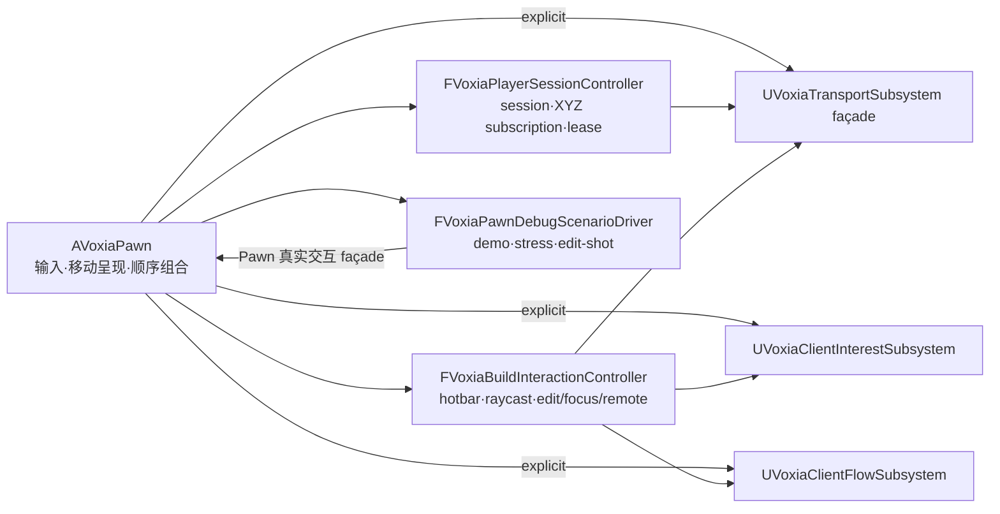

# Voxia R6 Pawn controller 与文档收口实施计划

> **For agentic workers:** REQUIRED SUB-SKILL: Use superpowers:executing-plans,
> superpowers:test-driven-development and superpowers:systematic-debugging task-by-task.

**Goal:** 保留 `AVoxiaPawn` 的输入、移动呈现、公共 CLI/HUD façade 与现有逐帧调用顺序，把
subscription/session、build/focus/remote interaction、demo/stress/edit-shot 的可变状态和领域逻辑迁入
三个显式 owner；同步收口中文注释与 Gameplay 当前真值文档。

**Architecture:** Pawn 只创建相机/移动组件、绑定输入、执行本地移动呈现并按原顺序调用 controller。
controller 通过显式的 Pawn host 与 Transport 参数执行原外部操作，不反向寻找 GameInstance subsystem；原
公共方法保留为薄委托。session controller 自行维护 bootstrap、完整 XYZ subscription、prepare/prefetch、
lease 与 readiness clock；build controller 自行维护 hotbar、raycast/edit gate、focus/remote action 与 overlay；
debug scenario driver 只使用公开交互入口和显式 host 能力。所有 token、JSON、observe、错误文本、阈值、
默认值、用户输入、wire 与唯一生产根保持不变。

## 不变边界

- 不修改 codec/opcode/body、Transport public contract、confirmed truth、完整 XYZ coverage 或 baseline H gate。
- 不修改输入键位、CLI token/envelope/schema、snapshot/observe 字段、错误 reason、计时阈值与可见效果。
- session controller 的 lease 检查每个 runtime tick 都执行，不能以移动输入、chunk 改变或 debug driver 为前置。
- build/focus/remote controller 只能通过 Transport/Interest 的现有公共 API 读写，不能生成 confirmed truth。
- scenario driver 必须继续调用真实 edit/focus/remote 入口，不建立测试专用生产路径。
- Pawn 只允许持有三个 owner 聚合；owner 的可变状态不得散回 Pawn。
- 触达代码注释统一为中文；Gameplay README 只保留当前职责、依赖、入口与验证。

### Task 1：R6 owner 与 façade 合同

- [x] 先增加三个 owner 的稳定 contract label、reset/状态快照测试。
- [x] 增加 Pawn ownership 静态门禁：三个 owner 各一个，旧 session/build/scenario 状态字段不得回散。

### Task 2：subscription/session controller

- [x] 引入 `FVoxiaPlayerSessionController`，迁移 login/connect/enter-scene、preview spawn、ready clock、
  XYZ subscribe/prepare/prefetch/lease 与全部相关 identity/retry 状态。
- [x] Pawn 在 Transport pump 后无条件编排 session controller；移动发送仍由 Pawn 负责，lease reducer 不读取
  PendingForward/PendingRight 或 `bWasMoving`。
- [x] `DebugSubscribeCurrent`、订阅 getter 与 snapshot 保持原公共签名和 schema，只改为委托。

### Task 3：build/focus/remote interaction controller

- [x] 引入 `FVoxiaBuildInteractionController`，迁移 hotbar、raycast selection、editable gate、break/place、
  focus hydrate、remote action、overlay 与所有最近一次交互证据。
- [x] 鼠标/键盘与 Debug CLI 入口保留在 Pawn 作为薄适配；controller 继续调用同一 Transport/Interest API。

### Task 4：Debug scenario driver

- [x] 在 `Debug/` 引入 `FVoxiaPawnDebugScenarioDriver`，迁移 AutoEdit、Demo、Glow、Stress、EditShot、自动截图与
  FPS 日志状态。
- [x] driver 复用真实 build handler、confirmed store 与显式相机一次性 framing；不复制 wire/编辑逻辑。

### Task 5：Pawn 与注释收口

- [x] Pawn 只保留组件创建、输入、移动呈现、视觉调参、公共 façade 与 controller 顺序编排。
- [x] 将 Pawn 与新 controller/driver 中触达的英文注释按语义改为中文，保留 identifier/contract 名称。
- [x] 更新 Gameplay/Debug 目录 README，补允许依赖、禁止依赖、reset/liveness ownership 表。

### Task 6：Gameplay README 历史拆分

- [x] Gameplay README 只保留现役完整 XYZ、唯一根、controller 职责、入口与验证。
- [x] 将旧 XZ SVO/raymarch/历史性能证据迁入 `docs/20-archive/client/`，保留来源与“不得作为现役验收”声明。

### Task 7：验证与分仓提交

- [x] Development build；覆盖三个 owner 的 focused ownership Automation。
- [x] 全量 Automation 不少于 R5 的 83 项、0 failure/warning。
- [x] 唯一生产根 Null-RHI 25 路、production CLI、显式 legacy probe CLI。
- [x] build/focus/remote 的真实输入等价入口由既有 smoke/Automation 覆盖；CLI snapshot schema 门禁通过。
- [x] `git diff --check`，client 与 outer 分仓独立提交并记录证据。

## 实施结果（2026-07-19）

- 客户端提交：`6d6d22f refactor(governance): extract pawn controllers`、
  `f1c0b4d refactor(governance): pass pawn controller dependencies`。
- 三个 owner 均已接入原 Pawn Tick/输入/CLI 路径；二次边界审计把 Interest/Flow 改为
  Pawn 显式解析后传入，并以静态门禁禁止 controller 内 `GetGameInstance` / `GetSubsystem`。
- Development build 最终成功；`Voxia.Gameplay.PawnControllerOwnership` 先用 RED 证明可捕获反向
  service locator，最终 GREEN 证据位于
  `.demo/observe/voxia_governance_r6_explicit_dependency_green_final_20260719/`。
- 最终全量 Automation 为 `84/84 Success`、0 failed/not-run，证据位于
  `.demo/observe/voxia_governance_r6_full_final_20260719/`。
- 最终唯一生产根 Null-RHI 为 25/25 routes、`passed=true`，证据位于
  `.demo/observe/voxia_phase1_2026-07-18T18-30-20-151Z_null_rhi_1280x720/`。
- 交互 CLI 实跑覆盖 land/look/raycast/select/focus/remote-action/place/break；命中保持 confirmed 与
  interactive，focus/remote 继续进入原 hydrate/outbox，阶段 1 挖放仍显式拒绝
  `feature_not_available_phase2`。证据为
  `.demo/observe/voxia_governance_r6_interaction_cli_final_20260719.log`。
- 显式 legacy probe 仍报告 `mode=legacy_probe`、`production_root=false` 且 `near_mesh.present=true`，
  证据为 `.demo/observe/voxia_governance_r6_legacy_probe_cli_final_20260719.log`。
- 旧 XZ/VHI/SVO/raymarch 与历史性能段落已完整迁入
  `docs/20-archive/client/2026-07-19-voxia-gameplay-legacy-renderer-and-performance-evidence.md`。
