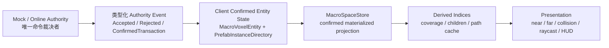
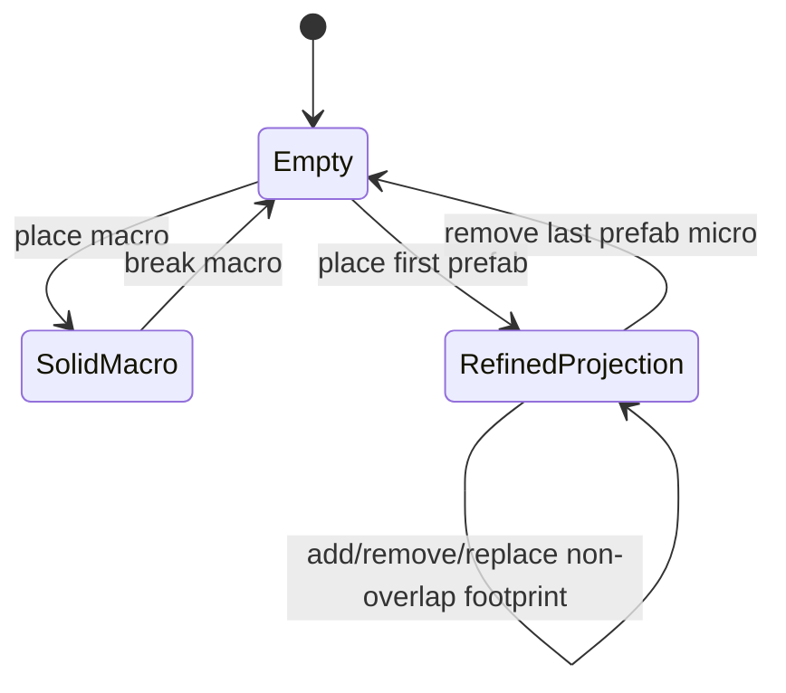
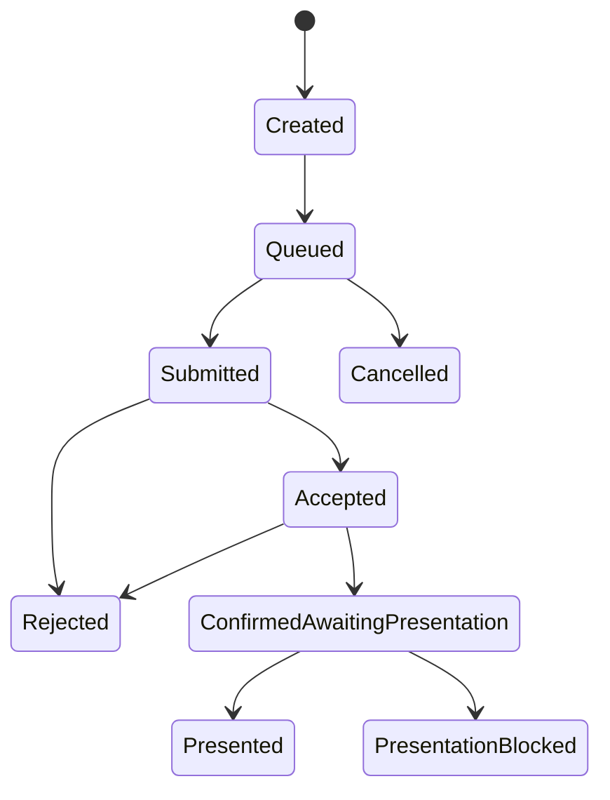
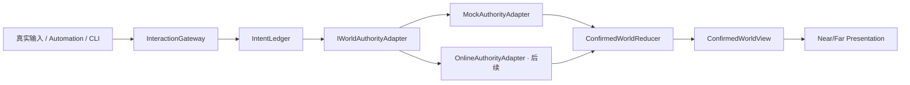

# Voxia 阶段 2/3：世界占用与 Prefab 运行时设计

- **日期**：2026-07-21
- **状态**：用户批准，三路专家审计完成；实施尚未开始
- **现役客户端**：`clients/Voxia`（UE 5.8）
- **客户端审计基线**：`origin/master@d5a27f7`
- **主仓审计基线**：`master@6559a212`
- **唯一正式入口**：`production_all_features` / `AVoxiaUnifiedVoxelWorldActor`
- **阶段顺序**：阶段 2 普通宏格交互 → 阶段 3 Prefab 世界运行时 → 后续真实 Online authority

## 1. 结论

本设计冻结以下产品语义：

1. 普通世界地形以完整宏格为玩家可操作实体，支持挖除和放置；其稳定身份是
   `{authority_namespace, world_snapshot_id, world_macro_xyz}`，不额外分配 prefab instance id。
2. 微格只用于 prefab 的 footprint、材质、命中、碰撞和渲染；不存在普通微格编辑，客户端、CLI、
   Mock 与未来 Online 均不得暴露单微格 place/break。
3. 普通实心宏格占据整个宏格体积；它与该范围内任意 prefab 微格互斥。
4. 多个 prefab 可以处于同一宏格范围，只要它们的实际 world-micro footprint 不重叠。
5. prefab 可以跨任意宏格、chunk、tile、region 与流送边界；一次放置、子树移除或替换必须全有或全无。
6. 当前先在客户端以 `MockAuthority` 完成数据、交互和渲染闭环；正式生产中服务端始终是唯一权威，
   未来只替换 authority adapter，不重写 confirmed reducer、selection、near/far 或 HUD。

批准的方案不是“客户端拥有世界真值”，而是同一套逻辑合同的三种所有权：



`PrefabInstanceDirectory` 与 `MacroSpaceStore` 不能成为两个平级可写真值源。客户端只有一个
revisioned confirmed aggregate；单一 reducer 在不可见 candidate 中同时更新实体、空间投影和派生索引，
校验成功后一次发布。renderer、Gameplay、Mock adapter 和 Transport 均不得直接修改该 aggregate。

## 2. 范围与阶段边界

### 2.1 阶段 2：普通宏格交互闭环

阶段 2 交付：

- 普通宏格选择、挖除、放置和材质；
- `WorldGen base + SessionSparseOverlay` 的会话内 confirmed 世界；
- profile-neutral intent、冲突集合、pending ledger 和 single reducer；
- 确定性非零延迟的 Mock authority；
- `queued → submitted → accepted/rejected → confirmed → presented`；
- near/far 对同一 confirmed revision 的失效、重建、ownership 与 presentation proof；
- unload/reload、重试和返回主菜单的正确生命周期；
- 真实输入、Automation、stdio CLI/结构化日志三入口。

阶段 2 声明 `RefinedProjection` 与空 `PrefabInstanceDirectory` 的稳定类型边界，但不开放 prefab 热栏、
微格命中、24 向旋转、ancestry UI 或 prefab mutation。

### 2.2 阶段 3：Prefab 世界运行时

阶段 3 在阶段 2 的 reducer、adapter、overlay、revision 与 presentation 管线上增加：

- immutable confirmed prefab catalog 与 compiled footprint；
- 任意整数 world-micro anchor 和完整 24 种轴对齐正交方向；
- 跨宏格/chunk/tile 的 prefab 放置预览与原子确认；
- `PrefabInstanceDirectory`、runtime occurrence tree、精确 leaf provenance；
- 同宏格多个不重叠 prefab；
- 精确微格 raycast/collision，但没有微格编辑；
- leaf/parent/root 选择、完整子树高亮和一次性原子移除；
- 保锚点/方向的原子 prefab 替换；
- near/far 对 refined geometry 的一致 surface 与版本化 LOD 归约。

Prefab Designer、draft/outbox、expression tree 编辑和 prefab-create 发布仍属于阶段 4，不进入阶段 3。

### 2.3 当前明确非目标

- 本轮不实现真实 Online 接入，不修改服务端 app、wire、数据库或生产订阅。
- 不把当前 `0x67`、`0x70` 或 `ObjectStateDelta` 假设成阶段 3 完整协议。
- 不实现 prefab 损伤、动画、开关、独立运动、结构坍塌或通用 object 框架。
- 不让 Web/Bevy 归档客户端进入设计、实现或验证。
- 不建立第二个生产 world root 或测试专用交互实现。

## 3. 专家审计结论与 P0 门禁

2026-07-21 并行完成三路只读审计：Voxia 客户端数据/渲染、Elixir/OTP 服务端权威/协议、跨端领域模型/
一致性。方案 A 可行，但以下现有实现不得被当作目标模型继续扩展：

| P0 | 当前事实 | 本设计裁决 |
| --- | --- | --- |
| 客户端 store 混层 | `FVoxiaVoxelStore`、wire DTO、实体来源和渲染查询耦合 | 新增 profile-neutral confirmed aggregate；wire DTO 只在 adapter 边界存在 |
| 单 owner 假设 | `FVoxiaRefinedMicro::Owner[512]`、`AnyOwner()` | projected micro 保存唯一 material + leaf instance id；完整 path 由目录恢复 |
| 宏格级 refined 命中 | refined 空隙也会命中，随后取第一个 owner | refined macro 内继续执行 micro traversal，返回精确 world-micro/leaf/revision |
| 逐宏格 prefab 删除 | `GatherPrefabInstanceCells()` 后发送 N 个 block break | 删除只提交一次 prefab subtree intent；客户端不得拆分 |
| truth 依赖 residency | prefab 聚类扫描 resident chunks，裁剪后信息丢失 | session truth/index 与 resident materialization/presentation 生命周期分离 |
| Mock 无独立端口 | Build controller 直接依赖 Transport/InScene | controller 依赖 confirmed query + interaction gateway；Mock 不伪造 socket |
| Gate 越界 | WS/TCP 在 Gate 内做 ID、catalog、raster 和事务编排 | 未来 Online 由 World authority API 统一；Gate 只 decode/auth/forward |
| 服务端假终局 | participant commit 失败后仍可能记录 committed，recovery 不重驱 | Online 前引入 durable decision/completion/ack 状态机；未完成不得冒充成功 |
| 身份 best-effort | chunk 投影成功后才 best-effort 注册 object | 实例目录和空间投影进入同一 durable transaction |
| opcode 冲突 | codec 已冻结 `0x66=SurfaceElementIntent`，旧文档仍写 BlueprintCreate | 以 codec/golden 为准；BlueprintCreate 不得复用 0x66 |

这些是实施和未来 Online cutover 的硬门禁，不改变“先客户端 Mock、后服务器”的阶段策略。

## 4. 分层领域模型

### 4.1 坐标与标识

所有 world-micro、world-macro 与 anchor 使用 signed 64-bit 完整 XYZ。唯一换算合同来自
`Gameplay/VoxiaCoords.h`，禁止复制局部版本：

```text
macro = floor_div(world_micro, 8)
slot  = floor_mod(world_micro, 8)       // 恒为 0..7
chunk = floor_div(macro, chunk_size_in_macro)
```

三轴必须完全对称。至少覆盖：

```text
-1 → macro -1 / slot 7
-8 → macro -1 / slot 0
-9 → macro -2 / slot 7
```

instance key 使用：

```text
{authority_namespace, world_snapshot_id, confirmed_instance_id}
```

confirmed instance id 在同一 namespace/snapshot 内不复用。provisional id 使用不同静态类型或 namespace，
永远不能进入 confirmed projection。

### 4.2 查询状态与世界占用状态

`Empty | SolidMacro | RefinedProjection` 只描述已经解析的宏格。查询层必须保留来源状态：

```text
MacroSpaceLookup
├─ SourceUnavailable
├─ Missing
└─ Resolved
   ├─ Empty
   ├─ SolidMacro
   └─ RefinedProjection
```

物理 sparse map 的 key absence 不能自动解释成 `Empty`：

- Mock 先查询 frozen WorldGen base，再应用 session overlay；
- Online 先通过 baseline/H/source 完整性门禁，再应用服务端确认事件；
- 显式 empty tombstone 可以覆盖 base solid，不能因 overlay key 被误删而重新露出旧 base。

### 4.3 普通宏格实体

普通实心宏格是领域实体，但不需要额外 opaque id：

```text
MacroVoxelEntity
  key = {authority_namespace, world_snapshot_id, world_macro_xyz}
  material_id
  state / health / tags（按已有稳定语义）
  entity_version
```

`Empty` 表示该坐标已确认不存在实心宏格实体，不是一个独立实体。session overlay 中的 explicit-empty
tombstone 只是覆盖 base 的存储表示。

### 4.4 PrefabDefinition

阶段 3 catalog 只包含 immutable confirmed definitions 或只读 builtin fixtures：

```text
PrefabDefinition
  prefab_id
  definition_schema_version
  content_hash
  compiler_algorithm_version
  allowed_orientation_set
  local_bounds_micro
  direct_materialized_cells
  nested PrefabRef occurrences
```

每次内容变化产生新 `prefab_id`；schema version 不是可变内容版本。definition 依赖可以形成无环 DAG，
同一 prefab 可被多个 `PrefabRef` 重用；每个 `PrefabRef` occurrence 拥有 definition-scope 稳定
`component_slot_id`。一次世界放置展开为 runtime occurrence tree，不允许多个 parent 共享同一个 runtime child。

### 4.5 PrefabInstanceDirectory

```text
PrefabInstanceRecord
  instance_key
  prefab_id
  root_instance_id
  parent_instance_id?
  component_slot_id?
  anchor_world_micro
  orientation_id
  instance_version
  direct_footprint_by_macro
```

`direct_footprint_by_macro` 只保存该 occurrence 直接拥有的几何；父级可以没有 direct geometry，仅作为 grouping
instance。每个 direct micro 只有 material，不具有独立实体身份。

完整 ancestry 由 immutable parent 链恢复。必须满足：

- parent 存在、同 root、无环；
- 任一 leaf 在有界步数内恢复 `[root,...,leaf]`；
- root/local geometry 的 path 为 `[root]`；
- 重复 `PrefabRef` occurrence 分配不同 child instance id；
- instance 删除后 id 不复用，迟到事件不得命中新实例。

### 4.6 MacroSpaceStore

`MacroSpaceStore` 是 confirmed aggregate 内的物化空间投影，不是第二真值源：

```text
MacroSpaceRecord
├─ Empty
├─ SolidMacro
│  └─ MacroVoxelEntityRef
└─ RefinedProjection
   ├─ occupied_mask[512]
   └─ occupied slot → {material_id, leaf_instance_id}
```

逻辑不变量：

1. `SolidMacro.material_id != 0`。
2. `RefinedProjection.occupied_mask != 0`；最后一个 prefab micro 移除后规范化为 `Empty`。
3. slot occupied 当且仅当 material 非零且 leaf instance id 有效。
4. 一个 slot 只能有一个 material 和一个 leaf owner。
5. 同一宏格可包含多个 prefab，只要它们的 masks 两两不交。
6. `SolidMacro` 存在时，该宏格 prefab coverage 必为空。
7. ownerless refined micro 非法；普通地形不能用 refined projection 表达。

允许的正常状态转换：



`SolidMacro ↔ RefinedProjection` 不允许由普通 place 隐式覆盖；未来若需要跨类型 replace，必须另立原子 intent。

### 4.7 派生索引

```text
ChildrenByInstance
  parent_instance_id → direct child ids

CoverageByInstance
  instance_id → sorted {macro_coord, inclusive_subtree_mask[512]}

PathCache
  leaf_instance_id → [root,...,leaf]
```

索引可由 directory 的 direct footprints 和 parent tree 重建，不是第二真值源。任一 instance 的 inclusive
coverage 必须等于自身 direct footprint 与全部 active descendants direct footprints 的并集。

选择、移除和替换禁止扫描 resident chunks。chunk/tile unload 只能删除 materialization 和 presentation cache，
不得删除 session directory、direct footprint、coverage 或 path 事实。索引不一致时 fail-closed 并从同一
confirmed entity snapshot 重建，禁止回退为“当前可见多少就操作多少”。

## 5. 唯一 Confirmed Aggregate 与 Reducer

### 5.1 Authority 事件

profile-neutral confirmation envelope 至少具有：

```text
ConfirmedWorldTransaction
  authority_namespace
  world_snapshot_id
  event_id
  intent_id
  mutation_group_id
  base_world_revision
  new_world_revision
  mutation_hash
  macro_entity_ops
  prefab_instance_ops
  provisional_to_confirmed_instance_mapping
  affected_macro_set / fingerprint
```

阶段 2 的 prefab ops 为空；阶段 3 复用同一事件结构。Online wire 如何承载该 envelope 在后续协议设计中裁决，
当前 Mock 不复制旧 `0x67` 字节布局。

### 5.2 唯一写入口

```text
ApplyConfirmedTransaction(CurrentSnapshot, AuthorityEvent)
  → Applied(NewSnapshot, ChangeSet)
  | Duplicate
  | BufferedOutOfOrder
  | RejectedMalformed
  | ResyncRequired
```

reducer 必须：

1. 校验 namespace、snapshot、event id、base revision 与 mutation hash；
2. 在不可见 candidate 中更新实体；
3. 从实体 mutation 物化 MacroSpace patches；
4. 更新 children、coverage 和 path index；
5. 校验全部实体—投影—索引不变量；
6. 一次发布 snapshot、change set 和 revision；
7. 任一步失败都保持旧 snapshot、revision、dirty set 和 live presentation 不变。

发布时必须满足：

```text
entity_revision
  == macro_space_revision
  == index_revision
  == confirmed_world_revision
```

worker 只能捕获 immutable snapshot/revision，不能持有 reducer 正在修改的 `TMap` 引用。

### 5.3 顺序、重复与重排

阶段 2/3 使用单调 world revision：

- 正常事务为 `base=N, new=N+1`；
- 相同 event id + 相同 hash 是 duplicate no-op；
- 相同 event id + 不同 hash 是硬错误；
- `base > current` 进入最多 64 个事件的有界 reorder buffer；
- `base < current` 且不是已知 duplicate 时进入 `ResyncRequired`，禁止覆盖；
- event dedupe window 默认保留最近 4096 个事务；session/snapshot 切换使旧 namespace 全部失效。

互不冲突 intent 可同时 in-flight，accepted 可乱序；confirmed transaction 仍按 world revision 应用。

## 6. Conflict Algebra

每个 intent 使用精确、类型化 conflict set：

```text
ConflictSet
  SpaceClaims
    macro_coord → mask[512]
  EntityClaims
    MacroEntity(macro_coord)
    PrefabInstance(instance_id)
  ValidationReadClaims
    resource + observed version/fingerprint
```

空间相交的唯一规则：

```text
same macro && (mask_a & mask_b).any()
```

- 普通宏格 place/break 使用 `All512`；
- prefab place 使用实际 footprint masks；
- prefab remove 使用 selected subtree 的完整 inclusive masks；
- prefab replace 使用 old subtree 与 new subtree 的完整并集；
- remove/replace 同时 claim 受影响 subtree instance ids；
- fingerprint 只用于诊断、缓存和重复识别，不能代替 exact claims。

由此保证：普通宏格与任意 prefab micro 冲突；同一宏格内两个不重叠 prefab 可以并存并并行等待；只重叠
一个微格也必须整体拒绝；parent/root remove 与 child mutation 即使 parent 无 direct geometry 也会通过
entity claims 冲突。

当前“必须接触已有内容/no-floating”只作为 placement-time validation，不是持续结构支撑不变量。支撑邻域进入
`ValidationReadClaims`；后续支撑被移除时，本阶段不自动坍塌、级联删除或移动 prefab。

## 7. Intent 生命周期与 Authority Adapter



不变量：

- `accepted` 只表示 authority 已承担有界、可诊断的处理责任，不修改 entity、projection、collision 或 mesh；
- Mock 的 accepted 由确定性调度器产生；未来 Online 的 accepted 必须建立在 durable operation/decision 上；
- `confirmed` 只在 reducer 原子提交成功后出现；
- confirmed 后 presentation 失败不能回滚成 rejected，必须保留 truth 并进入恢复态；
- `presented` 绑定 exact `{intent_id, confirmed_world_revision, mutation_group_id}`；
- pending preview 永不进入 raycast/collision/confirmed store。

稳定端口：

```text
IWorldAuthorityAdapter::Submit(WorldIntent)

AuthorityAdapterEvent
  Accepted
  Rejected
  ConfirmedWorldTransaction
  TransportFailure
```

依赖方向：



Gameplay/Input 不得知道 socket、codec、WorldGen 内部容器或 runtime profile 分支。Mock 私有 authority state 与
client confirmed mirror 是显式 authority/replica 边界；near/far 只能读取 mirror。Online 失败不得 fallback Mock，
session 中禁止热切换。

## 8. Session、Residency 与 Presentation

必须分开三种生命周期：

1. **Session logical truth**：FrozenWorldGenBase + SessionSparseOverlay + PrefabInstanceDirectory + derived indices；
   只有结束 Mock session 时销毁。
2. **Resident materialization**：active/prepared chunk/page 缓存，可以随完整 XYZ coverage 裁剪并重建。
3. **Presented resources**：near/far mesh、collision、component、generation/fence，可以独立退役。

`residency_revision` 不得冒充 `confirmed_world_revision`。重新进入区域必须从同一 base + overlay + directory
重建相同 occupancy、material、leaf id 和 ancestry。

一次 mutation 的 presentation obligation 只覆盖确认时当前 committed live ownership 与 affected set 的交集；
非驻留部分计入 `deferred_nonresident_count`，不让 intent 永久等不到 presented，后续加载直接从最新 confirmed
snapshot 构建。当前 live affected group 未全部通过 fence 前保留旧 owner，不允许出现半个 prefab。

confirmed 已推进而 presentation 尚未完成时：

- 受影响范围内的交互读取一致的 presented view，并返回 `presentation_pending`，不得对旧画面偷偷按新 truth 命中；
- 不受影响范围继续交互；
- authority 对任何新 intent 仍按最新 confirmed state 重验。

## 9. 阶段 2 详细设计

### 9.1 SessionSparseOverlay

阶段 2 overlay 的存储态：

```text
MacroOverlayEntry
  InheritBase
  ExplicitEmptyTombstone
  SolidMacroOverride
```

这是 base 合成实现，不是第四种 `MacroSpace` 世界状态。删除 base solid 必须留下 tombstone；放置后再挖除时，
是否恢复 base 由操作历史决定，不能仅通过 sparse key absence 猜测。

### 9.2 普通宏格操作

```text
MacroPlaceIntent
  target_world_macro
  material_id
  observed_world_revision
  input_sequence
  idempotency_key

MacroBreakIntent
  target_world_macro
  observed_world_revision
  input_sequence
  idempotency_key
```

place 只允许目标解析为 Empty；遇到 Solid 拒绝 `occupied_by_solid_macro`，遇到 Refined 拒绝
`occupied_by_prefab`。break 只允许 Solid；遇到 Refined 拒绝 `target_is_prefab_projection`。不存在 Micro intent。

### 9.3 阶段 2 完成门禁

- 玩家可在唯一生产根完成普通宏格六面选择、挖除和放置；
- pending 期间 confirmed raycast/collision/mesh 不变；
- rejected 保持原世界且原因可操作；
- 同一宏格连续操作按 input sequence 排队并在前序后重验；
- 不相交宏格允许并存 pending 和结果乱序；
- 编辑后离开 tile、卸载、返回仍恢复同一结果；
- near/far 无 overlay 回退、gap、overlap 或 accepted 即成功；
- retry 保留 session truth，返回主菜单才销毁；
- 真实输入、Automation、CLI/observe 三入口通过。

## 10. 阶段 3 详细设计

### 10.1 Orientation24

orientation 是保持手性的三维 signed permutation matrix，行列式必须为 `+1`，总数严格为 24。冻结：

- orientation id 的逻辑枚举、整数 basis、组合、逆和 face-normal 映射；
- root placement 使用稳定 orientation id；
- child local orientation 与 parent 确定性组合；
- transform 只使用整数 world-micro 和半开 bounds；
- anchor + transformed local coordinate 溢出时硬拒绝；
- mirror 属于阶段 4 建模操作，不混入 runtime orientation。

Mock 的 orientation id 不绑定现有 `0x67` wire ordinal；Online capability/version 设计前不得假定 `4..23` 已协商。

### 10.2 Placement

```text
PrefabPlaceIntent
  prefab_id
  anchor_world_micro
  orientation_id
  observed_world_revision
  input_sequence
  idempotency_key
```

客户端 preview 使用同一纯 compiler/transform 语义，但只用于视觉和已知冲突提示。Mock authority 必须重新取得
definition、重新展开 occurrence tree、重新计算 footprint/conflict、分配 confirmed ids，然后一次产生
ConfirmedWorldTransaction。客户端提交的 compiled footprint 不是权威输入。

### 10.3 Raycast 与 collision

- `SolidMacro` 使用完整宏格 AABB；
- 射线进入 `RefinedProjection` 后继续做精确 micro traversal；若未击中 occupied slot，继续宏格 DDA；
- refined hit 返回 world-micro、face、material、leaf instance id、完整 path 和 presented/confirmed revision；
- 玩家 AABB 对 refined 使用精确 micro occupancy 或等价合并盒，不能把任意 refined macro 膨胀成完整 1m 实心块；
- 查询必须区分 `Unavailable | Air | Occupied`，unknown 不得静默当 air；
- 命中微格后的操作对象是明确 prefab instance 层级，而不是微格本身。

### 10.4 Selection

- 新 prefab path 默认选择 leaf；
- Alt+滚轮沿当前 path parent/child 切换，到 root/leaf 钳制；
- 新命中 path 仍包含当前 selected id 时保持层级，否则重置到新 leaf；
- 高亮从 `CoverageByInstance` 读取完整 inclusive subtree，不扫描 resident chunks；
- 当前 selected subtree 有任何 coverage/index/parity 错误时 fail-closed。

输入上下文：阶段 3 中 `R` 只在有效 prefab preview context 旋转；其他上下文保留现有 remote action。Alt+滚轮被
selection 消费后不得继续切换热栏。Automation 和 CLI 必须调用同一 controller/gateway。

### 10.5 Remove 与部分 realization

- leaf remove 删除 leaf record 与 direct footprint；
- non-leaf remove 删除完整 subtree records 与 inclusive coverage；
- 只提交一次 `{selected_instance_id, observed_world_revision, idempotency_key}`；
- authority 重新计算 subtree，目录、投影和索引在同一 transaction 更新；
- 同宏格其他 prefab slots 完全保留；最后一个 slot 清除后 macro 规范化为 Empty。

child subtree 被移除后，parent instance 保留，`prefab_id` 只表示其来源 definition；runtime realization 可以是
该来源的显式部分实现。`instance_version`、active children 和 footprint identity 表达当前 realization，不能用
`prefab_id` 暗示完整 definition 仍全部存在。

### 10.6 Replace

replace 计算：

```text
candidate = current_state - old_selected_subtree + new_target_subtree
conflict  = old_inclusive_footprint ∪ new_inclusive_footprint
```

- 默认保留世界 anchor 和 orientation；目标不允许该 orientation 时预览无效；
- 不自动平移、缩放、裁切或换向；
- old 删除、新实例 id 分配、新 ancestry、空间 projection 和索引一次提交；
- 被替换 subtree 的旧 instance ids tombstone 且永不复用；新 target root 获得新 confirmed id；
- child replace 保留外层 ancestors 与 attachment `component_slot_id`，新 root 挂入同一 slot；
- root replace 产生新 root id；authority 返回 provisional→confirmed 与 old→new selection mapping；
- 不允许先删后放或失败补偿。

### 10.7 Near/Far surface

near surface query 必须跨 macro/chunk 查询六邻 micro：

- SolidMacro 在查询时等价全 512 occupied，但不物化为 512 个持久实体；
- solid↔refined 边界按 refined mask 切分未遮挡面；
- refined↔refined、跨 chunk seam 不产生重复内面、裂缝或 z-fighting；
- active halo unavailable 时等待依赖/ownership handoff，不得当 air。

far 不得继续使用“refined 取第一个非零 material 并当整宏格实心”。far 从同一 confirmed snapshot 派生版本化
occupancy/material histogram 与 footprint hash；LOD 可以确定性归约，但算法版本与 histogram 必须进入 artifact
identity，不能把细线、楼梯或多材质 prefab 静默膨胀成普通实心宏格。

### 10.8 阶段 3 完成门禁

- 同一宏格两个不重叠 prefab 正确共存；任一 micro 重叠整体拒绝；
- prefab 与 SolidMacro 双向互斥，无隐式覆盖；
- 任意 anchor、负坐标、24 orientation、跨 macro/chunk/tile footprint 一次确认；
- repeated PrefabRef occurrence ids/path/coverage 正确；
- raycast 穿过第一个 prefab 空隙可命中后方真实微格；
- 稀疏 prefab 空隙可通过，occupied micro 正确阻挡；
- leaf/parent/root remove 与 root/child replace 全有或全无；
- resident 裁剪、unload/reload 不截断 directory/coverage；
- near/far 不出现半 prefab、旧 WorldGen 回退或 refined 放大；
- 三入口与唯一生产根门禁全部通过。

## 11. 自维护一致性与诊断

每个 transaction 后执行增量校验；Automation/debug 可执行全量 parity rebuild：

1. 从 `PrefabInstanceDirectory` 重建 refined MacroSpace hash；
2. 从 direct footprints + parent tree 重建 CoverageByInstance hash；
3. 所有 projected leaf ids 必须存在；
4. direct footprint 在 projection 中拥有相同 material/leaf id；
5. 无 Solid/refined 共存、micro overlap 或 ancestry cycle；
6. entity/projection/index revision 完全一致。

检测失败时阻断新 mutation、保留最后合法 confirmed snapshot、发出结构化错误并允许明确重建/恢复；禁止继续
“尽量工作”。

核心 observe/CLI 字段：

- `runtime_profile`、`authority_adapter`、`authority_namespace`、`world_snapshot_id`、`mock_session_id`；
- `intent_id/input_sequence/intent_state/idempotency_key`、accepted/rejected/cancelled reason；
- `space_claim_fingerprint/entity_claim_fingerprint/validation_read_fingerprint`；
- `confirmed_world_revision/entity_revision/projection_revision/index_revision/residency_revision`；
- `mutation_group_id`、affected macro/micro/chunk、nonresident/presentation obligation；
- macro lookup/source 状态、MacroSpace kind、material、leaf instance/path；
- directory/coverage/path counts、dangling/overlap/cycle、parity hashes、rebuild count/reason；
- near/far consumed/presented revision、generation、ownership、fence、blocked reason；
- reorder depth、dedupe count、oldest pending age、session overlay bytes/high-water。

建议追加 stdio 命令：

```text
world intent-status <intent-id>
world macro-inspect <x> <y> <z>
world transaction-inspect <revision>
world parity-check
prefab instance-inspect <instance-id>
prefab micro-trace <world-micro-x> <world-micro-y> <world-micro-z>
prefab coverage-inspect <instance-id>
```

命令必须进入现有 CLI router catalog，保持 additive JSON envelope，不在 `ExecuteCommand` 建第二路由。

## 12. 初始安全上限

阶段 2/3 v1 使用显式硬上限，超出时 authority 显式拒绝，不允许无界展开：

| 项目 | v1 上限 |
| --- | --- |
| 同时 pending intents | 128 |
| confirmed reorder buffer | 64 events |
| event dedupe window | 4096 transactions |
| prefab runtime nesting depth | 16 |
| 单 placement runtime instances | 1024 |
| 单 prefab occupied micros | 65,536 |
| 单 prefab covered macros | 4,096 |
| 单 prefab covered chunks | 256 |
| 单 transaction affected macros | 4,096 |

这些值是阶段 v1 行为合同，必须进入 config snapshot、CLI 和测试；调整需要版本化设计与 fresh 预算证据。

## 13. 未来 Online Authority 边界

当前客户端实现不等待服务端重构，但从第一天冻结逻辑合同。正式 Online 目标 ownership：

| 层 | 唯一职责 |
| --- | --- |
| `mmo_contracts` | definition identity、Orientation24、整数 transform、instance/ancestry、MacroSpace 与 command/result 纯契约 |
| `data_service` | immutable definitions、PrefabInstanceDirectory、operation journal、participant ack/outbox 的 durable store |
| `world_server` | place/remove/replace authority、幂等、ID、raster plan、region participants、durable decision/recovery |
| `scene_server` | chunk hot MacroSpace、precondition、fenced participant prepare/commit、projection provenance、chunk delta |
| `gate_server` | decode、auth、actor/session 注入、World API 转发、结果编码与连接投递 |
| Voxia | intent、confirmed AOI mirror、preview、selection、presentation；不提供 Online truth |

Online 前必须另立协议/事务设计，至少关闭：

1. Gate 中 WS/TCP 重复的 prefab ID、raster、transaction 领域编排；
2. `commit_decided` 与 `completed` 混同、participant ack 不耐久和 recovery 不重驱；
3. instance identity 在 projection 后 best-effort 注册；
4. cold chunk、跨 region subtree remove/replace 的假成功；
5. PrefabInstance snapshot/spawn/delta/despawn 与 hydrate-before-projection；
6. subscription desired/confirmed、lease/owner epoch 与迁移自维护；
7. delta watermark、gap/resync 和 directory—projection parity。

目标 durable 状态机：

```text
received → planning → prepared → commit_decided → committing → completed
                           └────→ abort_decided → aborting → aborted
```

commit 决策后只能幂等重驱到 completed；客户端只有在 durable accepted 或完整 confirmed 语义成立时收到相应状态，
不得把部分 commit、best-effort identity 或超时猜测成成功。

### 13.1 Wire 兼容裁决

- `0x66` 永久按 codec/golden 冻结为 `VoxelSurfaceElementIntent`；`BlueprintCreate` 对该值作废。
- `0x70` 旧字节布局保留；Macro granularity 可用于未来普通宏格 Online，用户 Micro granularity 明确拒绝。
- `0x67` legacy `0..3 yaw` 保持解码兼容；现阶段不冻结 `4..23` 的 wire ordinal，也不盲目尾部追加字段。
- definition hash、instance closure、transaction boundary 和 AOI hydrate 使用未来新 opcode/versioned envelope/capability；
  adapter 不得从旧单 owner 数据猜 ancestry。
- 当前 `ObjectStateDelta` 不足以 hydrate PrefabInstanceDirectory，不能被文档写成已完成方案 A。

## 14. 被否决方案

1. MacroSpaceStore 与 PrefabInstanceDirectory 各自可写，后台 reconcile。
2. accepted 时先改画面，失败再回滚。
3. prefab 跨宏格按 chunk/macro 分批确认或客户端逐宏格删除。
4. 把普通宏格持久展开成 512 个微格实体。
5. 每个 micro 重复保存完整 ancestry 数组。
6. 只保留 root/leaf owner，却没有不可变 instance directory。
7. 通过扫描 resident chunks 聚合 prefab。
8. conflict 粗化为 chunk/整个 macro，或只按 micro 而不给普通宏格 `All512` claim。
9. provisional ids 进入 confirmed projection。
10. Mock/renderer/WorldGen 直接修改 client confirmed store。
11. Online adapter 猜测缺失 ancestry、失败后 fallback Mock 或 session 内热切换。
12. 把 Stage 4 Designer 混入 Stage 3 runtime。

## 15. 模块边界建议

阶段 2 建立最终骨架：

```text
clients/Voxia/Source/Voxia/Voxel/WorldModel/
  README.md
  VoxiaWorldDomainTypes.h
  VoxiaWorldIntent.h
  VoxiaWorldConflictSet.h/.cpp
  VoxiaConfirmedWorldState.h
  VoxiaConfirmedWorldReducer.h/.cpp
  VoxiaMacroSpaceStore.h/.cpp
  VoxiaIntentLedger.h/.cpp

clients/Voxia/Source/Voxia/Authority/
  README.md
  VoxiaWorldAuthorityAdapter.h
  VoxiaMockWorldAuthorityAdapter.h/.cpp
```

阶段 3 追加：

```text
clients/Voxia/Source/Voxia/Voxel/PrefabRuntime/
  README.md
  VoxiaPrefabDefinition.h
  VoxiaPrefabOrientation.h/.cpp
  VoxiaPrefabInstanceDirectory.h/.cpp
  VoxiaPrefabCoverageIndex.h/.cpp
  VoxiaPrefabFootprint.h/.cpp
  VoxiaPrefabPlacementPlanner.h/.cpp
  VoxiaPrefabSelectionModel.h/.cpp
```

依赖门禁：

```text
Gameplay Input → InteractionGateway → Authority Port
Mock / Net Adapter → Typed Events → World Reducer
World Snapshot → Canonical Source / Selection → Presentation

Presentation ─X→ Authority / Mock / Net
Gameplay ─X→ MacroSpace public mutator
UnifiedProduction ─X→ SendBlockEdit / SendPrefabPlace 旧直连路径
```

现有 `FVoxiaVoxelStore` 可以作为迁移期 projection backend 或 Online compatibility input，但不能继续作为第二个
public confirmed owner。`FVoxiaRefinedMicro` 收敛为 wire DTO，`AnyOwner()` 和生产根
`GatherPrefabInstanceCells()` 必须退役。

## 16. 验收矩阵摘要

| 领域 | 场景 | 阶段 |
| --- | --- | --- |
| Macro 状态 | Empty→Solid→Empty、换材质、Refined target 拒绝 | 2 |
| Intent | 非零延迟、accepted/rejected、duplicate、乱序、前序失败 | 2 |
| XYZ | ±X/±Y/±Z、`-1/-8/-9`、跨 chunk/tile | 2 |
| 流送 | 编辑后 unload/reload、near/far handoff、retry/menu teardown | 2 |
| Adapter | scripted Mock/Online typed trace 归约等价 | 2 |
| 同宏格 prefab | 两个不重叠接受，一个 slot 重叠整体拒绝 | 3 |
| Macro/prefab | 双向互斥、无隐式覆盖 | 3 |
| Nested | 重复 PrefabRef、root/parent/leaf、空 direct parent | 3 |
| Cross-boundary | 负坐标、24 orientation、跨 macro/chunk/tile | 3 |
| Remove/replace | leaf/parent/root、child/root replace、故障中点 | 3 |
| Ray/collision | refined 空隙、后方命中、精确阻挡 | 3 |
| Surface | solid↔refined、refined↔refined、chunk seam、far histogram | 3 |
| Index | resident 裁剪、故意破坏、全量重建 parity | 3 |
| 三入口/唯一根 | 鼠标、Automation、CLI 都走同一 gateway；probe 不冒充生产 | 2/3 |

详细任务、文件、TDD 步骤和验证命令分别进入阶段 2 与阶段 3 实施计划。阶段 3 计划依赖阶段 2 closeout，
不得并行越过阶段 2 的玩家可见闭环。

## 17. 审计记录与后续状态

- 客户端专家：确认 R0–R6 边界可复用，但 single owner、resident scan、宏格 refined 命中、逐宏格 remove、
  near/far refined surface 与 far 首材质归约均为阻断。
- 服务端专家：确认当前 prefab transaction、Gate ownership、best-effort identity 和 0x66 文档冲突不能作为
  Online 完成证据。
- 领域模型专家：确认方案 A 成立的前提是唯一 confirmed aggregate、单 reducer、精确 conflict algebra、
  nonresident-independent directory/coverage 和 adapter-only replacement。
- 本设计已经吸收全部 P0/P1 裁决；没有遗留会改变阶段 2/3 产品结果的未决项。
- 未来 Online wire、DB schema、分片、opcode 和 durable transaction 物理实现仍是独立后续设计，不由当前
  客户端计划猜测。
