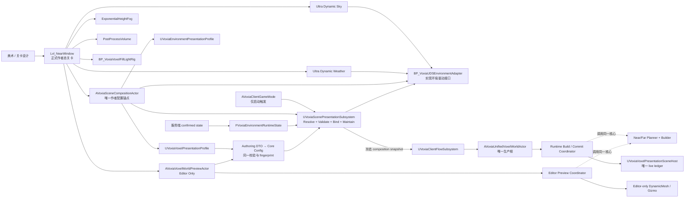
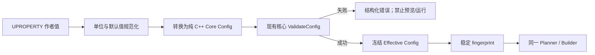

# Voxia 编辑器可创作场景、环境绑定与体素 LOD 预览设计

## 1. 结论先行

本设计采用已经确认的**路线 B：编辑器创作外壳 + C++ 核心运行时**。

Voxia 不把体素规划、完整 XYZ 空间契约、Near/Far LOD 生成、权威状态消费或渲染提交算法搬进
Blueprint；同时也不再让 `GameMode::BeginPlay` 独占场景搭建。正式关卡将直接保存可由美术在
Outliner 与 Details 面板中选择、拖放和调整的 UDS、UDW、雾、后处理、补光 Rig 与场景组合
Actor。world-scoped 场景表现 Subsystem 在进入场景时负责**显式解析、校验、绑定和持续维护运行态
驱动**，不再按类名扫描并销毁关卡环境，也不再用硬编码资源路径静默生成第二套环境。

体素编辑器预览由一个 editor-only 的 `AVoxiaVoxelWorldPreviewActor` 提供。它只是一层可视化门面：
将反射后的作者配置转换为现有纯 C++ 配置，继续调用同一套 Planner、Builder、Surface Artifact
和 SceneHost 规则。它可以查看近景样本、完整 XYZ coverage、所有远景 LOD 代表切片以及受预算
约束的局部实景，但不持有 confirmed truth，不参与 PIE 正式 readiness，也不能成为第二个生产根。

最终责任边界是：

> 美术在 UE 资产和关卡中决定“看起来怎样”；C++ 核心决定“空间、数据和提交为什么正确”；
> 服务端决定“世界确认态是什么”。

## 2. 状态、基线与用途

- **路线状态**：路线 B 已由用户确认；本文等待书面复核。
- **实现状态**：尚未据本文修改 Voxia C++、Blueprint 或 `.umap/.uasset`。
- **总仓审计基线**：`71a6b3f3fd44ce8f1b5487f5b0eaa22d0f622ccf`。
- **Voxia 子仓审计基线**：`5e9f6b12871c9f56dee4d18bbe8d51e9121c6bba`。
- **适用范围**：现役 `clients/Voxia` 唯一生产入口、正式近远景地图、环境表现、体素呈现参数与
  编辑器预览。
- **不适用范围**：归档 Web/Bevy 客户端、服务端协议扩展、confirmed voxel truth 变更、
  Prefab Designer 功能实现。

本文是阶段决策稿，不是完成证明，也不是可直接执行的任务清单。书面复核通过后再拆分实施计划和
逐阶段验收门禁。

## 3. 已确认现状与问题

### 3.1 编辑器中的正式关卡本身接近空壳

[`DefaultEngine.ini`](../../../clients/Voxia/Config/DefaultEngine.ini) 将
`/Game/Voxia/Maps/Lvl_NearWindow` 同时设为游戏默认地图与编辑器启动地图。该地图由
[`create_near_window_level.py`](../../../clients/Voxia/scripts/create_near_window_level.py)
创建时只配置了 `AVoxiaClientGameMode`，没有建立一套可在编辑状态下直接观察和调整的环境 Actor
组合。

因此当前“进入关卡后一片漆黑”首先是**作者态场景为空**：编辑器尚未运行 `BeginPlay`，自然也
看不到运行时临时生成的天空、灯光、雾与体素世界。侧边栏看不到这些对象不是 UE 编辑器能力不足，
而是当前生产路径没有把它们作为关卡资产保存。

### 3.2 GameMode 在运行时清场并重建环境

[`VoxiaClientGameMode.cpp`](../../../clients/Voxia/Source/Voxia/Gameplay/VoxiaClientGameMode.cpp)
的 `BeginPlay` 调用 `SetupEnvironment()`。该函数当前会：

1. 遍历世界中的 Actor；
2. 依据类名字符串包含 `DirectionalLight`、`SkyLight`、`SkyAtmosphere`、
   `ExponentialHeightFog`、`VolumetricCloud`、`SkySphere` 或 `PostProcessVolume`
   判断环境对象；
3. 销毁命中的对象；
4. 通过硬编码路径加载并生成 `Ultra_Dynamic_Sky`；
5. 以反射属性名和硬编码数值设置天空、太阳、雾和曝光；
6. 动态生成多盏补光，失败时再生成另一套 fallback 环境。

这条路径导致两项确定性后果：

- 美术即使把环境对象放进关卡，PIE 开始时也可能被销毁；
- 编辑器里调出的值与运行时最终值没有稳定契约，运行时 C++ 会覆盖或替换它们。

按类名子串识别所有权也会误伤概念上无关的 Actor，违反“系统只管理自己明确拥有的资源”原则。

### 3.3 唯一生产根的生命周期本身应保留

[`VoxiaClientFlowSubsystem.cpp`](../../../clients/Voxia/Source/Voxia/Gameplay/VoxiaClientFlowSubsystem.cpp)
的 `SpawnBoundRoot` 延迟生成 `AVoxiaUnifiedVoxelWorldActor`；后者再于
[`VoxiaUnifiedVoxelWorldActor.cpp`](../../../clients/Voxia/Source/Voxia/Gameplay/VoxiaUnifiedVoxelWorldActor.cpp)
中生成 Near 与 Pure3D Far 子 Actor。

这条动态生命周期属于会话、source identity、baseline gate、readiness、失败恢复和销毁语义，
不能为了“编辑器里能看见”就改成把另一个正式体素根常驻关卡。否则会形成关卡 Actor 与 Flow
Subsystem 争夺所有权的双根路径。

### 3.4 已有预览 Actor 能复用核心，但缺少 UE 作者面

当前已有：

- [`VoxiaVoxelSurfacePreviewActor`](../../../clients/Voxia/Source/Voxia/Gameplay/VoxiaVoxelSurfacePreviewActor.h)；
- [`VoxiaVoxelShellPresentationPreviewActor`](../../../clients/Voxia/Source/Voxia/Gameplay/VoxiaVoxelShellPresentationPreviewActor.h)。

它们已经复用 DynamicMesh 与部分真实构建链，是正确的技术种子；但核心操作仍是普通 C++ 方法，
没有 `UFUNCTION(CallInEditor)`，参数也没有形成完整的 `UPROPERTY` 作者配置。结果是 Actor 即使
可以生成，也无法像正式 UE 工具那样在 Details 面板完成“配置—验证—重建—清理—导出”的闭环。

### 3.5 视觉与 LOD 配置过多地藏在 C++ 和命令行

当前代码中仍存在：

- `FVoxiaVisualTuner` 的硬编码雾、曝光、Lumen 与补光默认值；
- `AVoxiaPure3DVoxelWorldActor` 的硬编码材质资源路径；
- `FVoxiaFarFieldCubeShellPlanner::DefaultConfig` 的默认 LOD rings；
- Gameplay、FarField 与 Voxel 范围内大量 `FParse::Param/Value` 入口；
- 少量真正可由编辑器调整的 `EditAnywhere` 属性。

命令行适合自动化和诊断，不适合作为美术调参的唯一来源。与此同时，直接把所有空间与构建参数改成
Blueprint 变量又会复制核心算法和校验规则。本设计要建立的是单向的
“UE 作者配置 DTO → 纯 C++ 核心配置”边界。

### 3.6 两类“黑”必须分开治理

当前至少有两类不同问题：

| 现象 | 根因范围 | 本设计作用 |
| --- | --- | --- |
| 编辑状态下整张关卡黑、Outliner 没有环境对象 | 正式地图没有保存环境；环境只在 `BeginPlay` 动态生成 | 直接解决 |
| 运行时部分程序化体素立面接近纯黑 | 动态程序化网格、Lumen、距离场/表面表示与补光策略的组合限制 | 提供可调和可复现入口，但不宣称根治 |

第二类问题已在
[`2026-06-26-voxel-terrain-black-faces-lumen.md`](../../../clients/Voxia/docs/engineering-notes/2026-06-26-voxel-terrain-black-faces-lumen.md)
与
[`2026-06-26-lumen-nanite-terrain-option.md`](../../../clients/Voxia/docs/engineering-notes/2026-06-26-lumen-nanite-terrain-option.md)
记录。补光 Rig 在当前阶段仍有必要，但必须从不可见的运行时临时对象迁成可选、可调、可验证的正式
场景对象。

## 4. 目标与非目标

### 4.1 目标

1. 打开 `Lvl_NearWindow` 时无需 PIE，就能看到并选择天空、天气、灯光、雾、后处理与体素示意；
2. 美术可以用 UE 原生 Outliner、Details、Blueprint 组件和 vendor preset 调整表现；
3. PIE 不销毁或静默覆盖美术放置的环境对象；
4. 运行时只通过明确类型、对象引用和接口绑定环境，不使用类名子串和硬编码资源路径猜测；
5. Near/Far 核心规划、完整 XYZ、mesh/surface 构建与 SceneHost 提交仍只有一套 C++ 实现；
6. 在不生成整个 `3×3×3 tiles = 9261 chunks` 高精网格的情况下，一次预览能覆盖近景、每个远景
   LOD 与完整三维 coverage；
7. 预览、正式运行和 CLI 观察面使用同一 profile fingerprint 与核心验证结果；
8. 缺少场景组合、重复组合、失效引用、非法 LOD 或资源缺失都显式失败；
9. 真实操作、Automation、CLI/结构化日志三类入口都能验证最终行为。

### 4.2 非目标

1. 不把 Planner、Builder、权威 reducer、baseline 校验或 renderer transaction 改写成 Blueprint；
2. 不允许编辑器预览写入 confirmed store、生成服务端 truth 或绕过 world-pack/baseline 校验；
3. 不把 `AVoxiaSceneCompositionActor` 变成第二个 `AVoxiaUnifiedVoxelWorldActor`；
4. 不用 World Partition/HLOD 替代自定义体素 Near/Far 流送；
5. 不在本阶段改变 wire codec、服务端 authority、voxel intent 或 object/field truth；
6. 不因为环境可编辑就宣称程序化体素的 Lumen 黑面问题已经解决；
7. 不让 Construction Script 或 `OnConstruction` 自动生成全量高成本体素场景；
8. 不允许生产模式在 UDS、材质或 profile 缺失时静默退回一套“能亮就行”的环境。

## 5. 不可破坏的不变量

### 5.1 权威与空间

- confirmed voxel truth 仍只来自服务端 `ChunkSnapshot`、`ChunkDelta`、
  `VoxelIntentResult` 等正式链路；
- 编辑器预览明确标记为 `preview`，不得进入 confirmed store；
- Near、Far、coverage、LOD、cache 与 handoff 一律使用完整 `FIntVector` XYZ；
- 正式 Near 继续遵守 `3×3×3 tiles = 27 tiles = 9261 chunks`；
- 任何可编辑 LOD ring 都必须通过核心三维单调、覆盖、预算和 ownership 校验。

### 5.2 唯一生产组合根

- `UVoxiaClientFlowSubsystem` 继续拥有会话级 root 生成与销毁；
- `AVoxiaUnifiedVoxelWorldActor` 继续是唯一生产 voxel world root；
- `UVoxiaScenePresentationSubsystem` 维护关卡组合解析、冻结快照、环境 driver 绑定及其运行态
  活性；GameMode 只触发启动，不持有长期天气状态；
- `AVoxiaSceneCompositionActor` 是关卡内的**作者配置锚点**，没有 Tick，不生成体素根，不持有 live
  presentation truth；
- editor-only preview Actor 在 PIE 前隐藏或清理，cook 后不存在，不进入 readiness；
- `UVoxiaVoxelPresentationSceneHost` 继续拥有唯一 live presentation ledger。

### 5.3 配置与算法

- UE 反射类型只负责作者输入、单位、范围、资产引用与说明；
- DTO 必须转换为现有纯 C++ core config，再调用同一 `ValidateConfig`；
- validation 成功后生成不可变 effective config 与 fingerprint；
- preview 与 runtime 必须消费相同 converter、validator、planner 与 builder；
- Blueprint 只负责组合、vendor 适配和表现逻辑，不执行大规模体素遍历。

## 6. 总体架构



架构中刻意存在两条不同的数据出口：

- runtime core artifact 只能提交到生产 SceneHost；
- preview core artifact 只能提交到 preview actor 自己的 editor-only transient components。

两者共享计算，不共享 live 状态。

## 7. 正式关卡的作者态组成

### 7.1 `Lvl_NearWindow` 从空壳变为正式场景壳

正式地图至少保存以下 Actor：

| Outliner 建议目录 | 对象 | 作者职责 |
| --- | --- | --- |
| `00_System` | `AVoxiaSceneCompositionActor` | 引用和验证本关卡使用的环境、体素 profile 与 adapter |
| `00_System` | `PlayerStart` | 明确 PIE/正式出生参考；不代替服务端位置 |
| `10_Environment` | `Ultra_Dynamic_Sky` | UDS 自带的天空、太阳和大气作者面 |
| `10_Environment` | `Ultra_Dynamic_Weather` | UDW 自带的天气作者面 |
| `10_Environment` | `BP_VoxiaUDSEnvironmentAdapter` | 将项目级环境状态映射到 vendor Actor |
| `10_Environment` | `ExponentialHeightFog` | UE 原生雾作者面 |
| `10_Environment` | unbound `PostProcessVolume` | 曝光、色调映射与项目级后处理 |
| `20_Lighting` | `BP_VoxiaVoxelFillLightRig` | 当前程序化体素所需的可调补光组件 |
| `90_EditorPreview` | `AVoxiaVoxelWorldPreviewActor` | editor-only 近远景/LOD 预览 |

美术可以直接拖入 UDS/UDW vendor Actor 并使用其原生 Details 与 preset。项目代码不复制 vendor
的全部参数，也不要求美术回到 C++ 修改太阳高度、云量、曝光或补光强度。

### 7.2 `AVoxiaSceneCompositionActor`

该 Actor 是薄配置锚点，建议具有：

- `EnvironmentDriver`：必须实现 `IVoxiaEnvironmentDriver` 的 Actor 引用；
- `EnvironmentProfile`：`UVoxiaEnvironmentPresentationProfile`；
- `VoxelPresentationProfile`：`UVoxiaVoxelPresentationProfile`；
- `FillLightRig`、`HeightFog`、`PostProcessVolume` 的显式同关卡引用；
- `SceneId`、`SchemaVersion` 和作者说明；
- editor-only 的校验状态、图标与边界可视化；
- `Validate Scene` 和 `Export Composition Snapshot` 的 `CallInEditor` 操作。

它不应具有：

- Tick；
- 网络连接；
- confirmed store；
- voxel root/near/far 的生成或销毁；
- 运行时 renderer ledger；
- 按标签、类名子串或“找第一个 Actor”建立隐式所有权。

正式生产地图必须恰好存在一个 composition actor。解析使用明确 C++ 类型，结果为零或多于一个都在
root 生成前硬失败。

### 7.3 `UVoxiaScenePresentationSubsystem`

该 `UWorldSubsystem` 是 runtime 场景表现契约的持续维护者：

- 在所有关卡 Actor 可解析的 world-begin-play 阶段按强类型查找 composition；
- 校验恰好一个 composition、全部 profile、adapter 和显式 Actor 引用；
- 冻结 `FVoxiaSceneCompositionSnapshot`，向 Flow Subsystem 发布 ready/failed 状态；
- 订阅当前模式唯一的环境状态源，并通过 `IVoxiaEnvironmentDriver` 应用；
- 维护 driver object identity、最近 revision、apply result 与错误状态；
- driver 被销毁、引用失活或状态 revision 逆退时立即进入可诊断失败，不依赖一次性绑定后永远有效
  的假设；
- world teardown 时显式解除订阅和引用。

它不生成或销毁 voxel root，也不拥有 confirmed environment truth。Flow Subsystem 在生成 root 前
调用 `RequireValidatedSnapshot`；snapshot 未 ready 或已 failed 时立即返回结构化错误，不使用 Tick
轮询或固定等待。GameMode 只选择明确的 world mode 并启动这条协调链，不继续保存长期环境状态。

### 7.4 环境 vendor adapter

UDS/UDW 属于第三方 Blueprint 资产，项目核心不应长期依赖其内部属性显示名。引入
`IVoxiaEnvironmentDriver` 作为稳定项目契约，并由
`BP_VoxiaUDSEnvironmentAdapter` 实现：

- adapter 在 Details 中显式引用 UDS 和 UDW 实例；
- Blueprint 层只做项目语义到 vendor API/preset 的薄映射；
- C++ 只发送 `ApplyRuntimeState`、`ApplyPreviewState`、`Snapshot` 与 `ValidateBinding`；
- vendor 升级导致字段或函数变化时，只修改 adapter 和对应验证，不污染体素核心；
- adapter 不拥有 authority，只消费已标注来源的环境状态。

如果 vendor 提供稳定的 C++/Blueprint 类型，应使用强类型引用；否则可以在 adapter 内使用明确的
封装函数，但禁止在 GameMode 中继续通过字符串反射批量修改未知 Actor。

### 7.5 补光 Rig

当前补光不是任意 fallback，而是程序化体素呈现的正式迁移期表现部件。建议建立
`BP_VoxiaVoxelFillLightRig`：

- 每盏 Directional Light 是可在 Blueprint Components 面板看到的组件；
- 公开强度、色温/颜色、俯仰、各方位 yaw、阴影开关与启用 profile；
- 编辑状态和运行时复用同一个 Rig；
- profile 只保存项目级 baseline，关卡实例可以有显式 override；
- snapshot 同时报告 baseline、instance override 与最终 effective 值；
- 将来底层 Lumen/mesh representation 根修复后，可通过 profile 显式关闭，而不是删除散落的
  runtime spawn 代码。

## 8. 环境状态的所有权拆分

天气与光照不能简单归为“全部美术”或“全部服务端”。设计将其拆成三层：

| 层 | 例子 | 真值与所有者 |
| --- | --- | --- |
| 作者态表现 | 云材质、曝光曲线、雾色、天气 preset 映射、补光风格 | UE 关卡、Blueprint、Data Asset；美术所有 |
| 运行态环境状态 | 时间、天气类型、强度、过渡起点、区域/field 输入 | Online 模式由服务端/confirmed field 提供；Mock 明确标注 mock |
| 编辑器预览状态 | 在编辑器里选择“正午晴天”“黄昏暴雨” | 仅 preview actor/adapter；永不写 confirmed truth |

`FVoxiaEnvironmentRuntimeState` 应携带至少：

- `SourceKind`：`OnlineConfirmed`、`MockConfirmed` 或 `EditorPreview`；
- `StateRevision`/`ContentVersion`；
- 时间、天气、强度和过渡参数；
- 服务端或 Mock 的 source identity；
- 应用结果与错误原因。

优先级不是“最后写入者胜出”，而是按模式明确选择唯一动态状态源：

1. Editor 非 PIE：只允许 `EditorPreview`；
2. PIE Mock：只允许 `MockConfirmed`；
3. Online：只允许 `OnlineConfirmed`；
4. Headless：使用明确的 `HeadlessEnvironmentProfile`，可以不创建渲染对象，但仍输出验证结果；
5. 任一模式缺少所需状态或绑定时显式失败，不自动切换到别的来源。

运行态只覆盖被契约声明为动态拥有的字段，例如时间、天气 preset 和过渡进度；美术拥有的材质、
曝光曲线与静态风格参数不能被整套重置。

## 9. Data Asset 与配置边界

### 9.1 `UVoxiaEnvironmentPresentationProfile`

该资产保存可复用的项目级表现语义，而不是镜像 UDS 的全部 Details：

- `ProfileId`、`SchemaVersion`、`ContentVersion`；
- vendor preset/项目 wrapper 资产引用；
- 天气语义到 vendor preset 的映射；
- 补光 baseline；
- 雾与后处理的项目级 baseline/曲线；
- 哪些字段由 runtime state 驱动的 control mask；
- Null-RHI/headless 行为；
- 资产依赖与 validation 规则。

若暂时不需要 Asset Manager 的异步发现、bundle 或主资产 ID，首版使用普通 `UDataAsset`；只有
出现明确的按 ID 加载和生命周期需求后才升级为 `UPrimaryDataAsset`。

### 9.2 `UVoxiaVoxelPresentationProfile`

该资产保存体素**呈现策略**：

- near/far 材质映射与允许的 override；
- LOD fade、dither、debug color 和可视化开关；
- 完整 XYZ shell 的作者配置；
- profile 允许的 preview source；
- editor preview 的 chunk、page、triangle、内存和构建时间预算；
- schema/content version、依赖版本和 fingerprint 输入；
- production/profile classification。

Near 的 `3×3×3 tiles`、完整 XYZ、page identity 与 ownership 等架构契约不能通过美术 profile
关闭。可调 ring 必须经过核心验证；被批准用于生产的 profile 还必须有固定 fingerprint 和预算
验收。开发 profile 可以更小，但必须标记 `preview/probe`，不能被 production root 接受。

### 9.3 作者 DTO 到核心配置

反射层新增类似 `FVoxiaVoxelShellAuthoringConfig`、
`FVoxiaVoxelShellRingAuthoringConfig` 的 `USTRUCT`，只用于 Details/Blueprint/Data Asset。转换过程：



核心 config 继续保持普通 C++ 类型，不依赖 `UObject`，以便现有 Automation、后台构建和确定性
fingerprint 继续工作。不得让 preview 和 runtime 分别解释作者 DTO。

### 9.4 覆盖与可追踪性

最终有效值按固定层级生成：

1. profile baseline；
2. composition actor 明确允许的 per-map override；
3. 冻结的测试/启动配置 override；
4. 动态环境状态只覆盖 control mask 指定的运行态字段。

每个 snapshot 必须同时报告：

- profile asset path；
- schema/content version；
- baseline fingerprint；
- override 字段集合及来源；
- effective fingerprint；
- core validation 结果。

命令行不再是隐藏的最高优先级。只有预先登记在冻结 runtime config 中的测试 override 可以覆盖，
并且必须进入 fingerprint 与日志。

## 10. 体素编辑器预览

### 10.1 角色与边界

`AVoxiaVoxelWorldPreviewActor` 是 editor-only façade：

- 可以被拖入 `Lvl_NearWindow`；
- Details 展示 profile、中心、预览模式、source 与预算；
- 调用正式 converter、validator、planner、builder；
- 将结果发布到自己拥有的 transient editor-only DynamicMesh/Gizmo components；
- 不注册 `UVoxiaClientFlowSubsystem`；
- 不生成 `AVoxiaUnifiedVoxelWorldActor`；
- 不写 `UVoxiaVoxelPresentationSceneHost` 的生产 live ledger；
- `IsEditorOnly()` 为真，cook 时剔除；
- PIE 开始前隐藏或清理预览组件，防止与正式世界重叠。

### 10.2 可编辑属性

建议至少公开：

| 属性 | 说明 |
| --- | --- |
| `PresentationProfile` | 与正式运行共用的体素表现 profile |
| `CenterTileXYZ` | 完整 `FIntVector` 预览中心 |
| `PreviewMode` | `Representative`、`Coverage`、`FocusedLOD`、`BudgetedLocalScene` |
| `FocusedLOD` | 单独查看某一 LOD 时的 ring/index |
| `PreviewSource` | `DeterministicFixture`、`MockWorldGen` 或 `ValidatedLocalPack` |
| `Fixture/Pack Reference` | source 所需的显式引用和版本 |
| `ShowNear/ShowFar/ShowSeams` | 分层可见性 |
| `ShowBounds/Ownership/MaterialIds` | debug overlay |
| `MaterialOverrides` | 仅允许的预览材质覆盖，进入 snapshot |
| `BuildBudget` | 来自 profile 的上限，可在更严格方向下调 |

任何 profile、source 或中心变化只把状态标记为 `DirtyNeedsRebuild`。`PostEditChangeProperty` 与
`OnConstruction` 只能更新便宜的 bounds、label 和 gizmo，不能直接启动全量 mesh build。

### 10.3 预览模式

#### Representative

默认作者模式。生成：

- 一个可识别的高精 Near 样本；
- 每个有效 Far LOD 至少一个代表 page/切片；
- Near/Far 接缝、skirt/stitch 的代表样本；
- 材质、debug color、fade/dither 与补光可见效果。

该模式保证“要素齐全”，但不声称展示完整 coverage。

#### Coverage

绘制完整 XYZ Near `3×3×3 tiles`、所有 Far rings、page/cell ownership 与预算估算的
box/wireframe，不为 9261 个 Near chunks 全部生成高精网格。它用于确认空间范围、LOD 分层、
中心变化与边界是否正确。

#### FocusedLOD

只生成一个指定 LOD 的代表区域，同时显示相邻 LOD 边界，便于调整材质、法线、fade、stitch 与
debug 参数。

#### BudgetedLocalScene

在显式按钮触发后，按 profile 预算生成一个较完整的局部场景。预算不足时在开始前失败并报告
预计 pages/chunks/triangles/内存，不通过卡死编辑器来“尽量生成”。若需要完整生产规模验证，
仍走正式 PIE/Null-RHI/Real-RHI runner，而不是把编辑器预览冒充全量验收。

### 10.4 Details 操作

首版通过 `UFUNCTION(CallInEditor)` 提供：

- `Validate Preview`；
- `Rebuild Preview`；
- `Clear Preview`；
- `Export Preview Snapshot`。

后续 `VoxiaEditor` 模块可以增加 custom details、进度条、取消按钮、LOD 可见性列表和
Editor Utility Widget，但不能改变首版的核心边界。

重建必须：

1. 验证 profile/source/baseline；
2. 冻结 effective config 与 fingerprint；
3. 估算并验证预算；
4. 以 generation id 启动可取消后台构建；
5. 只在 Game Thread 发布仍为当前 generation 的结果；
6. 用 editor transaction 管理可撤销的作者配置变化；
7. 只保存配置，不把大体积生成网格序列化进 `.umap`；
8. 输出结构化 snapshot。

### 10.5 预览 source 的信任等级

- `DeterministicFixture`：用于算法、材质和接缝的可复现样本；
- `MockWorldGen`：用于离线开发效果，必须明确标记 mock；
- `ValidatedLocalPack`：只读已通过 manifest/baseline/diff-chain 校验的本地包；
- Online confirmed world 不在首版编辑器预览中反向写入或缓存为作者资产。

本地包缺失、hash 不一致或 diff chain 断裂时必须拒绝预览；不得借预览功能引入运行时 snapshot
自愈或绕过进入场景前的 baseline 硬门禁。

## 11. 运行时生命周期

### 11.1 从 `SetupEnvironment` 迁移到场景表现 Subsystem

`AVoxiaClientGameMode` 的职责从“创建整个环境”变为只确定显式 world mode，并启动
`UVoxiaScenePresentationSubsystem`。后者负责：

1. 识别当前启动模式：production authored、explicit headless 或 explicit probe；
2. production authored 模式按强类型解析恰好一个 composition actor；
3. 调用 composition、profile 与 adapter validation；
4. 生成冻结的 `FVoxiaSceneCompositionSnapshot`；
5. 将环境动态状态绑定到 `IVoxiaEnvironmentDriver`；
6. 持续维护环境状态订阅、driver identity、revision 和 apply result；
7. 将 voxel presentation snapshot 传给 Flow Subsystem；
8. validation 全部成功后，才允许创建唯一 production root。

明确删除：

- 按类名子串销毁环境 Actor；
- `LoadClass` 硬编码 UDS 路径；
- 隐式生成 fallback 天空、雾、后处理与补光；
- 运行时遍历未知属性并批量覆盖美术值。

### 11.2 Root 注入

`UVoxiaClientFlowSubsystem::SpawnBoundRoot` 保持唯一创建入口，但在
`FinishSpawning` 前注入一个不可变启动上下文：

- source/world/session identity；
- validated voxel profile snapshot；
- effective config fingerprint；
- scene composition id/version；
- production/probe/headless classification。

`AVoxiaUnifiedVoxelWorldActor` 和 Near/Far 子 Actor 不持有可变 Data Asset 作为运行中真值，而是
消费冻结 snapshot。运行中若资产被编辑，现有 root 不自动变更；需要明确重启/重建会话，避免
同一 generation 内配置漂移。

### 11.3 Headless 与 probe

Null-RHI、commandlet 或自动化可以不加载渲染环境，但必须通过明确的
`HeadlessEnvironmentProfile`/启动模式声明。禁止通过“没找到 UDS，所以大概是 headless”推断。

probe 地图和参数仍可存在，但必须：

- 标记 `probe/compatibility`；
- 不注册为 production root；
- snapshot 报告 mode；
- 不参与正式 readiness；
- 不让 probe profile 被 production map 接受。

## 12. UE 模块边界

### 12.1 Runtime 模块

`Voxia` runtime 模块保存：

- profile 的 runtime-safe 数据定义；
- 作者 DTO → core config converter；
- core validation/fingerprint；
- scene composition snapshot；
- `UVoxiaScenePresentationSubsystem` 的解析、活性维护与 Flow gate；
- `IVoxiaEnvironmentDriver` 契约；
- runtime bind 与唯一 root 注入。

Runtime 模块不得依赖 `UnrealEd`、LevelEditor、PropertyEditor 或 editor subsystem。

### 12.2 Editor 模块

首个可用版本可以只靠 runtime-safe `UPROPERTY`、`UDataAsset` 与 `CallInEditor`，降低迁移半径。
当需要 custom details、component visualizer、commandlet 辅助或 asset validator 时，再新增
`VoxiaEditor`，`Type=Editor`：

- `AVoxiaVoxelWorldPreviewActor` 的编辑器增强；
- composition/profile Data Validation；
- LOD/coverage visualizer；
- Editor Utility Widget；
- preview snapshot 导出与状态 UI。

编辑器模块只依赖 runtime 模块，runtime 绝不反向依赖 editor 模块。

## 13. World Partition、Data Layers 与 OFPA

UE 的 World Partition/HLOD 适合管理**作者放置的静态 POI、建筑、植被、道具和场景装饰**。它们
可以在后续按地图规模采用 Data Layers 与 One File Per Actor，减少美术协作冲突。

它们不拥有：

- voxel confirmed truth；
- Near/Far page identity；
- 自定义完整 XYZ coverage；
- SceneHost live ledger；
- authority object state。

如果未来 `Lvl_NearWindow` 转为 World Partition：

- composition、UDS/UDW、adapter、fog、PPV 与补光 Rig 必须放在 Always Loaded 层；
- editor preview 放在 Editor-only Data Layer；
- voxel runtime 继续由唯一 root 与自定义流送管理；
- authored POI 与 voxel authority 通过稳定 placement/object contract 交互。

## 14. 显式失败与诊断

### 14.1 生产启动错误

至少定义以下稳定 reason code：

| reason | 条件 |
| --- | --- |
| `scene_composition_missing` | production authored map 没有 composition |
| `scene_composition_duplicate` | production authored map 有多个 composition |
| `scene_composition_invalid` | 引用、schema 或分类非法 |
| `environment_driver_missing` | 没有显式 driver |
| `environment_binding_invalid` | UDS/UDW/fog/PPV/rig 引用或接口校验失败 |
| `environment_profile_invalid` | profile 版本、依赖或 control mask 非法 |
| `voxel_presentation_profile_invalid` | 材质、LOD、完整 XYZ 或预算校验失败 |
| `profile_classification_mismatch` | probe/preview profile 被 production 使用 |
| `headless_profile_required` | 无渲染模式没有显式 headless profile |
| `preview_baseline_invalid` | 本地预览包校验失败 |
| `preview_budget_exceeded` | 预计构建成本超过 profile 上限 |

错误发生时不得生成 root 后再假装 loading，也不得用临时默认值继续。UI、CLI 和结构化日志必须看到
相同 reason 与依赖路径。

### 14.2 编辑器错误

编辑器 validation 失败时：

- composition/preview actor 显示明确的 invalid 状态；
- `Rebuild Preview` 不执行；
- Data Validation 返回 Error 而非 Warning；
- 导出的 snapshot 包含全部失败项；
- 不删除美术 Actor、不改写其值、不自动创建 fallback。

## 15. 可观测面

### 15.1 CLI

新增或扩展以下命令：

#### `scene_composition`

返回：

- map path、world mode；
- composition count/id/schema；
- profile paths、classification、versions；
- adapter 与环境 Actor 的明确对象路径；
- baseline/effective fingerprints；
- validation state/reason；
- unique root count 与 root binding state。

#### `environment_state`

返回：

- source kind、source identity、revision；
- driver 类型与 binding state；
- UDS/UDW/fog/PPV/rig 引用；
- runtime-owned 字段与 artist-owned 字段；
- baseline、override、effective 值；
- 最近一次 apply result/error。

#### `voxel_editor_preview_state`

编辑器/commandlet 中返回：

- preview actor path、mode、source、center XYZ；
- profile/effective fingerprint；
- 每个 LOD 的计划 pages、已生成 artifacts、triangle/内存/时间；
- full coverage bounds；
- dirty/building/ready/failed/cancelled；
- generation id、validation reason；
- snapshot 输出路径。

打包运行时调用该 editor-only 命令时必须返回明确的 `unsupported_in_runtime`，不能伪造空成功。

### 15.2 结构化日志与产物

建议事件：

- `scene_composition_resolved`；
- `scene_composition_rejected`；
- `environment_binding_applied`；
- `environment_binding_rejected`；
- `voxel_preview_build_started`；
- `voxel_preview_build_cancelled`；
- `voxel_preview_build_completed`；
- `voxel_preview_build_rejected`。

预览观察产物写入：

```text
.demo/observe/voxia_editor_preview/<timestamp>/
  composition.json
  environment.json
  preview.json
  lod_manifest.json
  validation.json
```

截图可以作为视觉附件，但不能替代这些结构化证据。

## 16. 验证矩阵

| 层 | 验证 | 通过条件 |
| --- | --- | --- |
| 纯 C++ | DTO converter、core validation、fingerprint 测试 | preview/runtime 同输入得到同 core config 与 fingerprint |
| Profile | Data Validation | 缺材质、非法 ring、非完整 XYZ、错误分类与失效资产全部失败 |
| Composition | Automation map test | production map 恰好一个 composition，所有显式引用有效 |
| 环境 | PIE functional test | 启动前后 UDS/UDW/fog/PPV/rig 对象 identity 不变，没有被销毁或重复生成 |
| Root | Flow/组合根测试 | root 数始终为 1；preview/composition 不注册为 root |
| Preview | Automation | Representative 含 Near、所有 Far LOD 与 seam；Coverage 含完整 XYZ bounds |
| Preview | 取消/预算测试 | 旧 generation 不发布；超预算在构建前失败 |
| Preview source | baseline 测试 | 缺包、hash 错误与 diff-chain 断裂全部拒绝 |
| Cook | packaged asset audit | editor preview actor/components 不进入 cooked map |
| Headless | Null-RHI/commandlet | 只有显式 headless profile 能跳过环境渲染，仍输出 composition validation |
| CLI | stdio CLI | 三个命令字段稳定，错误 reason 与日志一致 |
| Real-RHI | 正式 map smoke | 环境可见、唯一 root ready、Near/Far/LOD/补光联合呈现 |
| 用户操作 | UE Editor | 能拖放 UDS/UDW、调 Details、重建预览、PIE 后保留设置 |

真实编辑器验收必须覆盖：

1. 打开 `Lvl_NearWindow`，不 PIE 即能看到天空和预览；
2. 在 UDS/UDW、Fog、PPV、Fill Rig 上修改一个可见参数；
3. 调整 preview center/LOD/profile 并点击 `Rebuild Preview`；
4. 查看近景、各级远景与 coverage；
5. 点击 PIE，确认环境 Actor 没被替换、正式 root 只有一个；
6. 用 CLI/日志导出与眼前配置一致的 fingerprint 和引用路径。

## 17. 分阶段迁移

### 阶段 E0：冻结现状与观察面

- 为当前 `SetupEnvironment`、root count、环境 Actor count 和 profile 来源建立 characterization；
- 先定义三个 CLI snapshot 与 reason code；
- 记录编辑器整图黑和运行时体素黑面的不同复现；
- 不改可见行为。

### 阶段 E1：场景组合契约与环境 adapter

- 增加 composition actor、Scene Presentation Subsystem、environment interface、profile 和 validation；
- 增加明确 headless/probe 分类；
- 建立不可变 scene composition snapshot；
- 仍可暂时让旧环境路径存在，但 production 测试必须能比较两者。

### 阶段 E2：正式地图作者化

- 在 UE 编辑器中把 UDS、UDW、adapter、fog、PPV、Fill Rig、composition 与 preview 放入
  `Lvl_NearWindow`；
- 设置清晰 Outliner 目录；
- 用 Data Validation 验证资产引用；
- 将 `SetupEnvironment` 替换为 `ResolveAndBindEnvironment`；
- 删除 destructive scan、硬编码 UDS load 与环境 fallback；
- Real-RHI 证明画面与运行生命周期可用。

### 阶段 E3：呈现 profile 注入

- 将材质路径、补光 baseline、可调视觉参数和批准的 shell policy 迁入 Data Asset；
- 建立 DTO → core config 单向转换；
- root 只消费冻结 snapshot；
- 保留完整 XYZ、Near 尺寸和生产 profile 分类门禁；
- CLI 报告 effective fingerprint。

### 阶段 E4：统一体素预览 façade

- 合并/包装现有两个 preview actor 的能力；
- 增加 Representative、Coverage、FocusedLOD、BudgetedLocalScene；
- 增加 `CallInEditor`、预算、取消、transient artifact 与 snapshot；
- 自动化证明 preview/runtime 复用同一核心。

### 阶段 E5：编辑器体验增强

- 按实际需要新增 `VoxiaEditor`；
- custom details、component visualizer、LOD 列表、进度/取消 UI；
- Data Validation commandlet 与 Editor Utility Widget；
- 若 authored content 规模需要，再为静态场景采用 Data Layers/OFPA。

每阶段都必须保持唯一 production root 可运行；不得以一个仅供预览的新 GameMode 或地图代替正式
组合根验收。

## 18. 验收标准

路线 B 完成必须同时满足：

1. `Lvl_NearWindow` 在编辑状态下不是黑色空壳，关键环境对象全部出现在 Outliner；
2. UDS、UDW、雾、后处理、补光可以通过 UE 原生面板调整；
3. PIE 不销毁、重复生成或按字符串覆盖这些对象；
4. production 地图的 composition 缺失/重复/失效会在 root 生成前硬失败；
5. Null-RHI 只通过显式 headless profile 跳过环境；
6. `AVoxiaUnifiedVoxelWorldActor` 仍只有一个，SceneHost ledger 仍只有一份；
7. preview actor 被 cook 剔除，不进入 readiness，不写 confirmed store；
8. preview 一次可看 Near、所有 Far LOD 代表效果、seam 与完整 XYZ coverage；
9. preview/runtime 对同 profile 得到相同 core config/fingerprint；
10. 非法 LOD、预算超限、baseline 失效和资源缺失均有稳定 reason code；
11. 用户操作、Automation、CLI/日志三入口全部通过；
12. 运行时黑面问题若仍存在，按独立 Lumen/程序化网格主线记录，不用补光“看起来改善”冒充根修复。

## 19. 风险与控制

### 19.1 Vendor Blueprint 升级

风险：UDS/UDW 内部函数或属性变化。

控制：依赖收敛在 `BP_VoxiaUDSEnvironmentAdapter`；composition 和 C++ 只认项目接口；升级时执行
binding validation 与 Real-RHI smoke。

### 19.2 编辑器预览卡顿

风险：属性变化触发 9261 chunks 或更大 Far shell 重建。

控制：Construction 只画 bounds；重建只由明确按钮触发；先估算预算；后台可取消；旧 generation
不发布；默认 Representative/Coverage。

### 19.3 Preview 与 Runtime 漂移

风险：预览看起来正确，正式运行使用另一套默认值或算法。

控制：只保留一个 converter/validator/planner/builder；比较 fingerprint；自动化对同输入比较 plan
manifest；preview 不复制算法。

### 19.4 双重环境控制

风险：美术、UDS 内部时钟和服务端天气同时写同一属性。

控制：control mask 明确 artist-owned/runtime-owned 字段；每种运行模式只有一个动态状态源；
snapshot 公开来源和最后一次应用。

### 19.5 资产改动难以代码审查

风险：`.umap/.uasset` 是二进制，文本 diff 不直观。

控制：composition/profile snapshot 与 Data Validation 成为可审查证据；启用 OFPA 只服务规模化
作者内容；资产改动在 UE 编辑器中完成并以自动化/CLI 清单验证。

### 19.6 配置自由度破坏生产契约

风险：把 LOD 参数暴露后，开发 profile 被误用到 production 或改成 2.5D。

控制：profile classification、完整 XYZ core validation、固定 Near 契约、production fingerprint
与预算门禁；probe profile 不能被 production root 接受。

## 20. 被否决的替代路线

### 路线 A：最小改动，只把少量参数暴露到 GameMode/WorldActor

优点是初始改动少；缺点是正式关卡仍为空、环境仍由运行时创建、GameMode 继续承担美术组合职责，
也无法形成近远景统一预览。它只能改善几个数字的可编辑性，不能解决所有权错误，因此不采用。

### 路线 C：把体素生成和 LOD 大量迁入 Blueprint/Construction Script

优点是表面上所有参数都能在编辑器看到；缺点是会复制 Planner/Builder、阻塞编辑器、削弱自动化
和确定性、增加 Blueprint 与 runtime 漂移，并很容易形成第二条正式世界路径，因此不采用。

### 把 production root 直接保存进关卡

这样编辑器可以看到一个 root Actor，但会与 Flow Subsystem 的会话生命周期、baseline gate、
source identity 和失败恢复争夺所有权。作者态 preview 足以满足可视化，不需要牺牲唯一根，因此
不采用。

### 用 World Partition/HLOD 接管体素流送

World Partition/HLOD 适合作者静态内容，不表达当前服务端权威 voxel truth、动态 delta、完整 XYZ
page identity 与 SceneHost transaction。两者应正交组合，不相互替换。

## 21. 架构自查

| 自查项 | 本设计答案 |
| --- | --- |
| 谁拥有 confirmed world truth？ | 服务端；客户端 confirmed store 只消费 |
| 谁拥有生产 root 生命周期？ | `UVoxiaClientFlowSubsystem` |
| 谁拥有 live voxel presentation truth？ | `UVoxiaVoxelPresentationSceneHost` |
| 谁拥有场景作者配置？ | 关卡、composition actor、Blueprint 与 Data Asset |
| 谁持续维护 runtime 场景绑定？ | `UVoxiaScenePresentationSubsystem` |
| 谁拥有动态天气状态？ | 当前模式唯一的 Online/Mock/EditorPreview source |
| Preview 是不是第二份 truth？ | 不是；只持有可丢弃的 editor-only artifact |
| 预览和运行时算法会不会分叉？ | 不允许；共用 converter/validator/planner/builder |
| 缺少 UDS 或 profile 怎么办？ | production root 生成前显式失败 |
| 是否仍为完整 XYZ？ | 是；所有中心、coverage、ring 和预算都按三维定义 |
| 是否创建第二生产路径？ | 否；composition/preview 都不生成或注册 root |
| 美术能否直接使用 UE 编辑器？ | 能；环境、Rig、profile 与 preview 都有正式作者面 |
| GUI 是否为唯一验收？ | 否；Automation、CLI、结构化日志和 snapshot 等价覆盖 |

## 22. 参考

### 22.1 本仓当前依据

- [系统正交设计纲领](../../30-reference/overview/2026-06-27-架构设计指导思想-系统正交.md)
- [体素服务端权威阶段总览](voxel-server-authority-phase-overview.md)
- [当前客户端流送与 LOD 真值](../../00-current-truth/design/client/streaming-lod.md)
- [纯 3D 体素壳迁移](../voxel-far-field/2026-07-12-pure-3d-voxel-shell-migration.md)
- [Voxia 工业级代码审查与治理设计](2026-07-18-voxia-industrial-code-review-and-remediation-design.md)
- [Voxia 客户端 README](../../../clients/Voxia/README.md)

### 22.2 Unreal Engine 5.8 官方依据

- [Actors](https://dev.epicgames.com/documentation/en-us/unreal-engine/actors-in-unreal-engine)
- [Components](https://dev.epicgames.com/documentation/en-us/unreal-engine/components-in-unreal-engine)
- [Data Assets](https://dev.epicgames.com/documentation/en-us/unreal-engine/data-assets-in-unreal-engine)
- [Exposing C++ to Blueprints](https://dev.epicgames.com/documentation/en-us/unreal-engine/exposing-cplusplus-to-blueprints-visual-scripting-in-unreal-engine)
- [UFunctions 与 Call In Editor](https://dev.epicgames.com/documentation/unreal-engine/ufunctions-in-unreal-engine?lang=en-US)
- [Scripting the Unreal Editor](https://dev.epicgames.com/documentation/en-us/unreal-engine/scripting-the-unreal-editor-using-blueprints)
- [Blueprint Best Practices](https://dev.epicgames.com/documentation/unreal-engine/blueprint-best-practices-in-unreal-engine?lang=en-US)
- [Data Validation](https://dev.epicgames.com/documentation/en-us/unreal-engine/data-validation-in-unreal-engine)
- [Mesh Distance Fields](https://dev.epicgames.com/documentation/en-us/unreal-engine/mesh-distance-fields-in-unreal-engine?lang=en-US)
- [World Partition](https://dev.epicgames.com/documentation/en-us/unreal-engine/world-partition-in-unreal-engine)
- [One File Per Actor](https://dev.epicgames.com/documentation/unreal-engine/one-file-per-actor-in-unreal-engine?lang=en-US)
