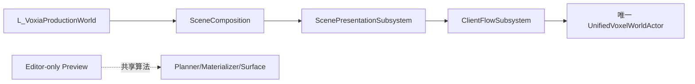

# Voxia Editor-Authored Production Scene and LOD Preview Implementation Plan

> **For agentic workers:** REQUIRED SUB-SKILL: Use superpowers:executing-plans to implement this plan task-by-task. Steps use checkbox (`- [ ]`) syntax for tracking.

**Goal:** 新建 `/Game/Voxia/Maps/L_VoxiaProductionWorld` 作为唯一 production 场景组合根，让
UDS、UDW、雾、后处理、补光与 Near/Far LOD 代表预览可在 UE 编辑器直接调整，同时保留唯一
`AVoxiaUnifiedVoxelWorldActor`、完整 XYZ 和服务端 confirmed truth。

**Architecture:** 用纯 C++ 启动策略和组合校验器建立 fail-closed 边界；关卡内只保存薄
`AVoxiaSceneCompositionActor`、环境 Actor、可编辑补光 Rig 与 editor-only preview。
Preview 只从现有 default cube-shell plan 选取 Near 加每层一个代表 page，继续复用 WorldGen
materializer、surface artifact 和 DynamicMesh adapter，不复制 LOD 算法。

**Tech Stack:** Unreal Engine 5.8、C++20/Unreal Reflection、Unreal Automation、
DynamicMesh、Unreal Python、Ultra Dynamic Sky/Weather、PowerShell、Node stdio CLI。

## Global Constraints

- 唯一 production 地图固定为 `/Game/Voxia/Maps/L_VoxiaProductionWorld`。
- `Lvl_NearWindow` 只保留为显式 `probe/compatibility`；无显式 probe/headless 参数时必须返回
  `legacy_production_map_retired`。
- `UVoxiaClientFlowSubsystem` 继续唯一生成和销毁 `AVoxiaUnifiedVoxelWorldActor`。
- `UVoxiaVoxelPresentationSceneHost` 继续是唯一 live presentation ledger。
- Preview 是 editor-only、可丢弃表现，不进入 confirmed store、root readiness 或生产 ledger。
- confirmed voxel/world truth 只来自服务端；Mock/WorldGen 必须显式标识。
- Near/Far、coverage、sample identity 和 bounds 全部使用完整 XYZ。
- 正式 Near 保持 `3×3×3 tiles = 27 tiles = 9261 chunks`。
- 新增代码注释统一使用中文。
- 每项行为变更严格遵守 RED → GREEN → REFACTOR。
- Web/Bevy 客户端不进入实现或验证。
- 首批不引入 Data Asset、Asset Manager 或在线天气协议；美术先直接编辑关卡 Actor/组件属性。

---

## File Map

### Voxia 子仓新增

| 文件 | 单一职责 |
| --- | --- |
| `Source/Voxia/Gameplay/VoxiaSceneLaunchPolicy.h/.cpp` | 纯函数解析 production/headless/probe/rejected 场景启动模式 |
| `Source/Voxia/Gameplay/VoxiaSceneLaunchPolicyAutomationTest.cpp` | 锁定新地图唯一性和旧地图拒绝语义 |
| `Source/Voxia/Gameplay/VoxiaVoxelEditorPreviewPlan.h/.cpp` | 从正式完整 XYZ shell plan 选择有界代表样本与 coverage |
| `Source/Voxia/Gameplay/VoxiaVoxelEditorPreviewPlanAutomationTest.cpp` | 锁定 Near + LOD0–4、负坐标与预算 |
| `Source/Voxia/Gameplay/VoxiaVoxelWorldPreviewActor.h/.cpp` | editor-only Details/CallInEditor 预览门面与临时 DynamicMesh |
| `Source/Voxia/Gameplay/VoxiaSceneCompositionContract.h/.cpp` | 纯组合绑定验证与稳定 snapshot/reason code |
| `Source/Voxia/Gameplay/VoxiaSceneCompositionContractAutomationTest.cpp` | 锁定缺失、重复、失效引用与 headless 语义 |
| `Source/Voxia/Gameplay/VoxiaVoxelFillLightRig.h/.cpp` | 四盏可在 Components 面板编辑的补光组件 |
| `Source/Voxia/Gameplay/VoxiaSceneCompositionActor.h/.cpp` | 关卡内唯一作者配置锚点和显式 Actor 引用 |
| `Source/Voxia/Gameplay/VoxiaScenePresentationSubsystem.h/.cpp` | world-scoped 解析、冻结 snapshot 和活性维护 |
| `Source/Voxia/Gameplay/VoxiaSceneAuthoringAutomationTest.cpp` | 锁定 CDO 组件、editor-only 与 snapshot 行为 |
| `scripts/validate_production_world.py` | 加载并验证新地图、Actor 引用、默认地图和预览状态 |
| `scripts/create_production_world.py` | 确定性创建唯一 production 地图及其作者 Actor |
| `Content/Voxia/Maps/L_VoxiaProductionWorld.umap` | 唯一 production 场景组合资产 |

### Voxia 子仓修改

| 文件 | 修改 |
| --- | --- |
| `Source/Voxia/Gameplay/VoxiaClientGameMode.h/.cpp` | 删除 destructive `SetupEnvironment`，接入场景策略/Subsystem |
| `Source/Voxia/Gameplay/VoxiaClientFlowSubsystem.cpp` | root 生成前要求有效场景 snapshot |
| `Source/Voxia/Debug/VoxiaDebugCliSubsystem.cpp` | 增加 composition/environment/editor-preview 命令 |
| `Source/Voxia/Gameplay/VoxiaPreviewRuntimeProfileAutomationTest.cpp` | 将普通 production 用例切到新地图 |
| `Config/DefaultEngine.ini` | Game/Editor 默认地图切到新资产 |
| `scripts/voxia_stdio_cli.js` | stdio 默认地图切到新资产 |
| `scripts/run_xyz_near_window_smoke.js` | 正式三轴 smoke 切到新资产 |
| `README.md` | 记录唯一 production 地图和编辑器工作流 |
| `Source/Voxia/Gameplay/README.md` | 记录场景组合所有权和 preview 边界 |
| `Source/Voxia/Debug/README.md` | 记录新 CLI 与默认地图 |

### 总仓修改

| 文件 | 修改 |
| --- | --- |
| `docs/10-active/cross-cutting/2026-07-27-voxia-editor-authored-scene-and-preview-design.md` | 写入新地图决策 |
| `docs/00-current-truth/design/client/streaming-lod.md` | 收口唯一 production 场景组合根与预览边界 |

---

### Task 1: 场景启动策略与旧地图硬拒绝

**Files:**

- Create: `Source/Voxia/Gameplay/VoxiaSceneLaunchPolicy.h`
- Create: `Source/Voxia/Gameplay/VoxiaSceneLaunchPolicy.cpp`
- Create: `Source/Voxia/Gameplay/VoxiaSceneLaunchPolicyAutomationTest.cpp`

**Interfaces:**

- Produces:
  `Voxia::Gameplay::FVoxiaSceneLaunchPolicy::Evaluate(const FString&, const TCHAR*)`
- Produces: `EVoxiaSceneLaunchMode::{Rejected, AuthoredProduction, HeadlessProbe, CompatibilityProbe}`
- Produces: stable reasons `legacy_production_map_retired`, `production_scene_map_required`

- [ ] **Step 1: 写出会被“旧地图继续放行”这一错误击中的失败测试**

```cpp
IMPLEMENT_SIMPLE_AUTOMATION_TEST(
	FVoxiaSceneLaunchPolicyAutomationTest,
	"Voxia.Gameplay.SceneAuthoring.LaunchPolicy",
	EAutomationTestFlags::EditorContext | EAutomationTestFlags::EngineFilter)

bool FVoxiaSceneLaunchPolicyAutomationTest::RunTest(const FString&)
{
	using namespace Voxia::Gameplay;

	const FVoxiaSceneLaunchDecision Production = FVoxiaSceneLaunchPolicy::Evaluate(
		TEXT("/Game/Voxia/Maps/L_VoxiaProductionWorld.L_VoxiaProductionWorld"),
		TEXT(""));
	TestEqual(TEXT("新地图是唯一作者态 production"),
		Production.Mode, EVoxiaSceneLaunchMode::AuthoredProduction);
	TestFalse(TEXT("新地图不被拒绝"), Production.bRejected);

	const FVoxiaSceneLaunchDecision Legacy = FVoxiaSceneLaunchPolicy::Evaluate(
		TEXT("Lvl_NearWindow"),
		TEXT(""));
	TestTrue(TEXT("旧地图不能再伪装 production"), Legacy.bRejected);
	TestEqual(TEXT("旧地图拒绝原因稳定"),
		Legacy.ReasonCode, FString(TEXT("legacy_production_map_retired")));

	const FVoxiaSceneLaunchDecision Headless = FVoxiaSceneLaunchPolicy::Evaluate(
		TEXT("Lvl_NearWindow"),
		TEXT("-VoxiaHeadlessEnvironment"));
	TestEqual(TEXT("旧地图只可作为显式 headless probe"),
		Headless.Mode, EVoxiaSceneLaunchMode::HeadlessProbe);

	const FVoxiaSceneLaunchDecision Probe = FVoxiaSceneLaunchPolicy::Evaluate(
		TEXT("L_WorldGenPreview"),
		TEXT("-VoxiaWorldGenPreview -VoxiaSceneProbe"));
	TestEqual(TEXT("显式 probe 不成为第二 production"),
		Probe.Mode, EVoxiaSceneLaunchMode::CompatibilityProbe);

	const FVoxiaSceneLaunchDecision Unknown = FVoxiaSceneLaunchPolicy::Evaluate(
		TEXT("L_AccidentalMap"),
		TEXT(""));
	TestTrue(TEXT("未知地图不能成为隐式 production"), Unknown.bRejected);
	TestEqual(TEXT("未知地图要求正式场景根"),
		Unknown.ReasonCode, FString(TEXT("production_scene_map_required")));
	return true;
}
```

- [ ] **Step 2: 构建并运行测试，确认 RED 来自缺少新策略**

Run:

```powershell
& "C:\Program Files\Epic Games\UE_5.8\Engine\Build\BatchFiles\Build.bat" `
  VoxiaEditor Win64 Development -Project="$PWD\Voxia.uproject" -WaitMutex -NoLiveCoding
```

Expected: build fails because `VoxiaSceneLaunchPolicy.h`/symbols do not exist.

- [ ] **Step 3: 实现最小纯策略**

```cpp
namespace Voxia::Gameplay
{
enum class EVoxiaSceneLaunchMode : uint8
{
	Rejected,
	AuthoredProduction,
	HeadlessProbe,
	CompatibilityProbe
};

struct FVoxiaSceneLaunchDecision
{
	EVoxiaSceneLaunchMode Mode = EVoxiaSceneLaunchMode::Rejected;
	bool bRejected = true;
	bool bLegacyNoSkyAlias = false;
	FString MapName;
	FString ReasonCode;

	const TCHAR* ModeLabel() const;
	FString SnapshotJson() const;
};

class FVoxiaSceneLaunchPolicy
{
public:
	static FVoxiaSceneLaunchDecision Evaluate(
		const FString& MapName,
		const TCHAR* CommandLine);
	static FString NormalizeMapName(FString MapName);
};
}
```

Implementation decision order:

1. normalize PIE/package/map suffixes;
2. exact `L_VoxiaProductionWorld` always selects `AuthoredProduction`;
3. `-VoxiaHeadlessEnvironment` selects `HeadlessProbe`;
4. existing `-VoxiaNoSky` remains a visible migration alias for headless and sets
   `bLegacyNoSkyAlias=true`;
5. `-VoxiaSceneProbe` selects `CompatibilityProbe`;
6. exact `Lvl_NearWindow` rejects with `legacy_production_map_retired`;
7. every other implicit map rejects with `production_scene_map_required`.

- [ ] **Step 4: 验证 GREEN**

Run build, then:

```powershell
& "C:\Program Files\Epic Games\UE_5.8\Engine\Binaries\Win64\UnrealEditor-Cmd.exe" `
  "$PWD\Voxia.uproject" /Engine/Maps/Entry -unattended -nop4 -nullrhi `
  "-ExecCmds=Automation RunTests Voxia.Gameplay.SceneAuthoring.LaunchPolicy" `
  "-TestExit=Automation Test Queue Empty"
```

不要在 `ExecCmds` 中追加 `Quit`：它会在 Automation 队列真正执行前退出。Expected: one test
succeeds; no `Automation Test Failed`。

- [ ] **Step 5: 提交**

```powershell
git add Source/Voxia/Gameplay/VoxiaSceneLaunchPolicy*
git commit -m "feat(voxia): enforce the production scene map"
```

---

### Task 2: 有界 Near/Far LOD 代表预览

**Files:**

- Create: `Source/Voxia/Gameplay/VoxiaVoxelEditorPreviewPlan.h`
- Create: `Source/Voxia/Gameplay/VoxiaVoxelEditorPreviewPlan.cpp`
- Create: `Source/Voxia/Gameplay/VoxiaVoxelEditorPreviewPlanAutomationTest.cpp`
- Create: `Source/Voxia/Gameplay/VoxiaVoxelWorldPreviewActor.h`
- Create: `Source/Voxia/Gameplay/VoxiaVoxelWorldPreviewActor.cpp`

**Interfaces:**

- Consumes: `FVoxiaFarFieldCubeShellPlanner::DefaultConfig/Plan`
- Consumes: `FVoxiaWorldGenCanonicalPageMaterializer`
- Consumes: `FVoxiaVoxelSurfaceArtifactBuilder` and `FVoxiaVoxelSurfaceMeshAdapter`
- Produces:
  `FVoxiaVoxelEditorPreviewPlanner::BuildRepresentative(const FIntVector&, FVoxiaVoxelEditorPreviewPlan&)`
- Produces: placeable editor-only `AVoxiaVoxelWorldPreviewActor`

- [ ] **Step 1: 写出会被“只显示 Small/LOD0”这一错误击中的失败测试**

```cpp
IMPLEMENT_SIMPLE_AUTOMATION_TEST(
	FVoxiaVoxelEditorPreviewPlanAutomationTest,
	"Voxia.Gameplay.SceneAuthoring.VoxelEditorPreviewPlan",
	EAutomationTestFlags::EditorContext | EAutomationTestFlags::EngineFilter)

bool FVoxiaVoxelEditorPreviewPlanAutomationTest::RunTest(const FString&)
{
	using namespace Voxia::Gameplay;
	FVoxiaVoxelEditorPreviewPlan Plan;
	TestTrue(TEXT("代表预览可构建"),
		FVoxiaVoxelEditorPreviewPlanner::BuildRepresentative(
			FIntVector(11, -7, -51), Plan));
	TestTrue(TEXT("计划 ready"), Plan.bReady);
	TestEqual(TEXT("Near 加五层 Far，一共六个 mesh 样本"), Plan.Samples.Num(), 6);
	TestEqual(TEXT("完整 Far ring 数"), Plan.Rings.Num(), 5);

	const int32 ExpectedLods[] = {0, 0, 1, 2, 3, 4};
	for (int32 Index = 0; Index < Plan.Samples.Num(); ++Index)
	{
		TestEqual(*FString::Printf(TEXT("样本 %d 的 LOD"), Index),
			Plan.Samples[Index].BrickId.LodLevel, ExpectedLods[Index]);
	}
	const int32 ExpectedOuterRadii[] = {4, 8, 24, 40, 72};
	for (int32 Index = 0; Index < Plan.Rings.Num(); ++Index)
	{
		TestEqual(*FString::Printf(TEXT("ring %d 使用正式半径"), Index),
			Plan.Rings[Index].OuterRadiusTiles, ExpectedOuterRadii[Index]);
	}
	TestTrue(TEXT("负 XYZ 中心原样保留"),
		Plan.CenterTile == FIntVector(11, -7, -51));
	TestTrue(TEXT("正式 shell fingerprint 非零"), Plan.ShellFingerprint != 0);
	TestTrue(TEXT("预览预算固定有界"), Plan.Samples.Num() <= 6);
	return true;
}
```

- [ ] **Step 2: 构建确认 RED**

Expected: build fails because preview plan/actor symbols do not exist.

- [ ] **Step 3: 实现纯 preview plan**

```cpp
struct FVoxiaVoxelEditorPreviewSample
{
	FString Role;
	int32 RingIndex = INDEX_NONE;
	Voxia::Voxel::FVoxiaVoxelBrickId BrickId;
	FVector3d DisplayOriginCm = FVector3d::ZeroVector;
};

struct FVoxiaVoxelEditorPreviewPlan
{
	bool bReady = false;
	FIntVector CenterTile = FIntVector::ZeroValue;
	uint64 ShellFingerprint = 0;
	TArray<Voxia::FarField::FVoxiaFarFieldCubeShellRingPlan> Rings;
	TArray<FVoxiaVoxelEditorPreviewSample> Samples;
	FString Error;
	FString SnapshotJson() const;
};
```

`BuildRepresentative` 必须：

- 调用正式 `DefaultConfig(Center, Center, 1)` 与 `Plan`；
- 添加一个 Near LOD0 sample；
- 每个 ring 从正式 `Plan.Cells` 选择一个离 `center + X * outer_radius` 最近的确定性 cell；
- 同距离按 `OriginTile.X/Y/Z`、span、LOD 排序；
- 比较条中每个 sample 使用固定 `1600cm` 展示格和 `400cm` 间距；
- coverage ring 保留真实 `4/8/24/40/72` XYZ 半径；
- 任何 ring 缺 sample 时整体失败，不生成部分结果。

- [ ] **Step 4: 实现 editor-only Actor**

```cpp
UCLASS(BlueprintType)
class VOXIA_API AVoxiaVoxelWorldPreviewActor final : public AActor
{
	GENERATED_BODY()
public:
	AVoxiaVoxelWorldPreviewActor();
	virtual bool IsEditorOnly() const override { return true; }
	virtual void OnConstruction(const FTransform& Transform) override;

	UPROPERTY(EditAnywhere, BlueprintReadWrite, Category="Voxia|Preview")
	FIntVector PreviewCenterTile = FIntVector(11, 0, -51);

	UPROPERTY(EditAnywhere, BlueprintReadWrite, Category="Voxia|Preview",
		meta=(ClampMin="400.0", ClampMax="10000.0"))
	double SampleExtentCm = 1600.0;

	UPROPERTY(EditAnywhere, BlueprintReadWrite, Category="Voxia|Preview")
	bool bShowCoverage = true;

	UPROPERTY(EditAnywhere, BlueprintReadWrite, Category="Voxia|Preview")
	TObjectPtr<UMaterialInterface> PreviewMaterial;

	UFUNCTION(CallInEditor, BlueprintCallable, Category="Voxia|Preview")
	void RebuildPreview();

	UFUNCTION(CallInEditor, BlueprintCallable, Category="Voxia|Preview")
	void ClearPreview();

	UFUNCTION(BlueprintCallable, Category="Voxia|Preview")
	FString SnapshotJson() const;
};
```

Actor 的有界 rebuild：

1. 生成六样本 plan；
2. 只 materialize 六个 selected brick ids；
3. 每页调用真实 surface builder/mesh adapter；
4. 用 normalized comparison-strip local origin 合并为一个 DynamicMesh；
5. 六个 `UBoxComponent` 显示 Near 和五个完整 XYZ coverage bounds；
6. snapshot 报告 sample role/id、rings、quad/triangle、material、ready/error；
7. `OnConstruction` 仅在 editor world 且 mesh 尚未 ready 时执行一次 bounded rebuild；
8. 不创建 SceneHost、不注册 Flow、不写 confirmed store。

- [ ] **Step 5: 运行 GREEN 与 actor CDO 断言**

在同一 automation 文件追加：

```cpp
const AVoxiaVoxelWorldPreviewActor* Defaults =
	GetDefault<AVoxiaVoxelWorldPreviewActor>();
TestTrue(TEXT("预览 actor 在 cook 时剔除"), Defaults->IsEditorOnly());
TestTrue(TEXT("默认中心是完整 XYZ"),
	Defaults->PreviewCenterTile == FIntVector(11, 0, -51));
```

Run `Voxia.Gameplay.SceneAuthoring.VoxelEditorPreviewPlan`.

- [ ] **Step 6: 提交**

```powershell
git add Source/Voxia/Gameplay/VoxiaVoxelEditorPreview*
git add Source/Voxia/Gameplay/VoxiaVoxelWorldPreviewActor*
git commit -m "feat(voxia): add bounded editor LOD preview"
```

---

### Task 3: 场景组合契约、补光 Rig 与 world-scoped 维护者

**Files:**

- Create: `Source/Voxia/Gameplay/VoxiaSceneCompositionContract.h`
- Create: `Source/Voxia/Gameplay/VoxiaSceneCompositionContract.cpp`
- Create: `Source/Voxia/Gameplay/VoxiaSceneCompositionContractAutomationTest.cpp`
- Create: `Source/Voxia/Gameplay/VoxiaVoxelFillLightRig.h`
- Create: `Source/Voxia/Gameplay/VoxiaVoxelFillLightRig.cpp`
- Create: `Source/Voxia/Gameplay/VoxiaSceneCompositionActor.h`
- Create: `Source/Voxia/Gameplay/VoxiaSceneCompositionActor.cpp`
- Create: `Source/Voxia/Gameplay/VoxiaScenePresentationSubsystem.h`
- Create: `Source/Voxia/Gameplay/VoxiaScenePresentationSubsystem.cpp`
- Create: `Source/Voxia/Gameplay/VoxiaSceneAuthoringAutomationTest.cpp`

**Interfaces:**

- Consumes: `FVoxiaSceneLaunchDecision`
- Consumes: `AVoxiaVoxelWorldPreviewActor`
- Produces: `FVoxiaSceneCompositionSnapshot`
- Produces: `UVoxiaScenePresentationSubsystem::OnWorldBeginPlay` and frozen scene snapshot

- [ ] **Step 1: 写出 fail-closed 组合契约测试**

```cpp
IMPLEMENT_SIMPLE_AUTOMATION_TEST(
	FVoxiaSceneCompositionContractAutomationTest,
	"Voxia.Gameplay.SceneAuthoring.CompositionContract",
	EAutomationTestFlags::EditorContext | EAutomationTestFlags::EngineFilter)

bool FVoxiaSceneCompositionContractAutomationTest::RunTest(const FString&)
{
	using namespace Voxia::Gameplay;
	FVoxiaSceneCompositionBindingView Valid;
	Valid.CompositionCount = 1;
	Valid.bSkyBound = true;
	Valid.bWeatherBound = true;
	Valid.bFogBound = true;
	Valid.bPostProcessBound = true;
	Valid.bFillRigBound = true;
	Valid.bRequireEditorPreview = true;
	Valid.bPreviewBound = true;
	Valid.bAllActorsInSameWorld = true;

	const auto Ready = FVoxiaSceneCompositionContract::Validate(
		EVoxiaSceneLaunchMode::AuthoredProduction, Valid);
	TestTrue(TEXT("完整作者组合通过"), Ready.bReady);

	FVoxiaSceneCompositionBindingView Missing = Valid;
	Missing.bSkyBound = false;
	const auto MissingResult = FVoxiaSceneCompositionContract::Validate(
		EVoxiaSceneLaunchMode::AuthoredProduction, Missing);
	TestFalse(TEXT("缺 UDS 硬失败"), MissingResult.bReady);
	TestEqual(TEXT("缺 UDS reason 稳定"),
		MissingResult.ReasonCode, FString(TEXT("environment_sky_missing")));

	FVoxiaSceneCompositionBindingView Duplicate = Valid;
	Duplicate.CompositionCount = 2;
	const auto DuplicateResult = FVoxiaSceneCompositionContract::Validate(
		EVoxiaSceneLaunchMode::AuthoredProduction, Duplicate);
	TestEqual(TEXT("重复组合硬失败"),
		DuplicateResult.ReasonCode, FString(TEXT("scene_composition_duplicate")));

	FVoxiaSceneCompositionBindingView MissingAuthorPreview = Valid;
	MissingAuthorPreview.bPreviewBound = false;
	const auto MissingAuthorPreviewResult = FVoxiaSceneCompositionContract::Validate(
		EVoxiaSceneLaunchMode::AuthoredProduction, MissingAuthorPreview);
	TestEqual(TEXT("作者态缺 preview 硬失败"),
		MissingAuthorPreviewResult.ReasonCode,
		FString(TEXT("voxel_editor_preview_missing")));

	FVoxiaSceneCompositionBindingView CookedRuntime = Valid;
	CookedRuntime.bRequireEditorPreview = false;
	CookedRuntime.bPreviewBound = false;
	const auto CookedRuntimeResult = FVoxiaSceneCompositionContract::Validate(
		EVoxiaSceneLaunchMode::AuthoredProduction, CookedRuntime);
	TestTrue(TEXT("runtime 不依赖 cook 已剔除的 preview"), CookedRuntimeResult.bReady);

	const auto Headless = FVoxiaSceneCompositionContract::Validate(
		EVoxiaSceneLaunchMode::HeadlessProbe, {});
	TestTrue(TEXT("显式 headless 不要求渲染 Actor"), Headless.bReady);
	TestTrue(TEXT("headless snapshot 明示分类"), Headless.bHeadless);
	return true;
}
```

- [ ] **Step 2: 构建确认 RED**

Expected: missing contract symbols.

- [ ] **Step 3: 实现纯 contract 和稳定 snapshot**

`FVoxiaSceneCompositionContract::Validate` 按固定顺序返回：

1. production count 0 → `scene_composition_missing`;
2. count > 1 → `scene_composition_duplicate`;
3. sky/weather/fog/post-process/fill 各自 missing reason；
4. 只有 `bRequireEditorPreview=true` 时，preview missing →
   `voxel_editor_preview_missing`；Subsystem 永远传 false，`Validate Scene` 与地图验证器传 true；
5. 跨 world → `scene_composition_cross_world_reference`;
6. headless/probe 返回 ready，但 snapshot 分类不允许成为 production；
7. ready snapshot 包含全部对象 path、class、map、mode、
   `editor_preview_required/bound` 和 schema
   `voxia_scene_composition_v1`。

- [ ] **Step 4: 写出 actor/rig 的失败测试**

```cpp
IMPLEMENT_SIMPLE_AUTOMATION_TEST(
	FVoxiaSceneAuthoringAutomationTest,
	"Voxia.Gameplay.SceneAuthoring.AuthoringActors",
	EAutomationTestFlags::EditorContext | EAutomationTestFlags::EngineFilter)

bool FVoxiaSceneAuthoringAutomationTest::RunTest(const FString&)
{
	const AVoxiaVoxelFillLightRig* Rig = GetDefault<AVoxiaVoxelFillLightRig>();
	TestEqual(TEXT("补光 Rig 固定四个可编辑灯组件"),
		Rig->GetFillLightComponentCount(), 4);
	TestTrue(TEXT("补光 Rig 无 Tick"), !Rig->PrimaryActorTick.bCanEverTick);

	const AVoxiaSceneCompositionActor* Composition =
		GetDefault<AVoxiaSceneCompositionActor>();
	TestTrue(TEXT("组合 Actor 无 Tick"), !Composition->PrimaryActorTick.bCanEverTick);
	TestTrue(TEXT("空 CDO 显式 invalid"),
		Composition->SnapshotJson().Contains(TEXT("\"ready\":false")));
	return true;
}
```

- [ ] **Step 5: 实现可编辑 Rig 和 composition actor**

`AVoxiaVoxelFillLightRig`：

- 一个 `USceneComponent` root；
- 三个 `UDirectionalLightComponent` 侧向补光，默认 pitch `-18`、yaw
  `55/-125/-35`，强度 `1.3`，不投影；
- 一个 upward fill，默认 pitch `70`、强度 `0.65`，不投影；
- 所有组件是 default subobject，可在 Components/Details 直接编辑；
- `SnapshotJson` 从组件读取 effective 值，不维护重复数值源。

`AVoxiaSceneCompositionActor` 暴露：

```cpp
UPROPERTY(EditInstanceOnly, BlueprintReadOnly, Category="Voxia|Environment")
TObjectPtr<AActor> UltraDynamicSky;
UPROPERTY(EditInstanceOnly, BlueprintReadOnly, Category="Voxia|Environment")
TObjectPtr<AActor> UltraDynamicWeather;
UPROPERTY(EditInstanceOnly, BlueprintReadOnly, Category="Voxia|Environment")
TObjectPtr<AExponentialHeightFog> HeightFog;
UPROPERTY(EditInstanceOnly, BlueprintReadOnly, Category="Voxia|Environment")
TObjectPtr<APostProcessVolume> PostProcessVolume;
UPROPERTY(EditInstanceOnly, BlueprintReadOnly, Category="Voxia|Lighting")
TObjectPtr<AVoxiaVoxelFillLightRig> FillLightRig;
UPROPERTY(EditInstanceOnly, BlueprintReadOnly, Category="Voxia|Preview")
TObjectPtr<AVoxiaVoxelWorldPreviewActor> VoxelPreview;
```

并提供 `ValidateScene` (`CallInEditor`)、`BuildBindingView(bool bRequireEditorPreview)` 和
`SnapshotJson`。`ValidateScene` 传 true；runtime Subsystem 传 false，保证 preview 永不进入
root readiness。

- [ ] **Step 6: 实现 `UVoxiaScenePresentationSubsystem`**

```cpp
UCLASS()
class VOXIA_API UVoxiaScenePresentationSubsystem final : public UWorldSubsystem
{
	GENERATED_BODY()
public:
	virtual void OnWorldBeginPlay(UWorld& InWorld) override;
	bool IsReadyForRoot() const { return Snapshot.bReady; }
	const FVoxiaSceneCompositionSnapshot& GetSnapshot() const { return Snapshot; }
	FString SnapshotJson() const { return Snapshot.SnapshotJson(); }
	virtual void Deinitialize() override;
private:
	bool ResolveForWorld(
		UWorld& InWorld,
		const FVoxiaSceneLaunchDecision& Launch,
		FString& OutError);
	TWeakObjectPtr<AVoxiaSceneCompositionActor> ActiveComposition;
	FVoxiaSceneCompositionSnapshot Snapshot;
};
```

Runtime scan 只用 `TActorIterator<AVoxiaSceneCompositionActor>`，不按字符串、tag 或“第一个任意 Actor”
猜测。`OnWorldBeginPlay` 根据当前 map/command line 计算 launch decision，再调用私有
`ResolveForWorld`；此时关卡 Actor 已完成初始化。每次解析重新核验弱引用和 same-world；
`Deinitialize` 清理。禁止从 `GameMode::InitGame` 主动扫描 composition。

- [ ] **Step 7: 运行两个测试并提交**

Run:

```text
Voxia.Gameplay.SceneAuthoring.CompositionContract
Voxia.Gameplay.SceneAuthoring.AuthoringActors
```

Commit:

```powershell
git add Source/Voxia/Gameplay/VoxiaSceneComposition*
git add Source/Voxia/Gameplay/VoxiaVoxelFillLightRig*
git add Source/Voxia/Gameplay/VoxiaScenePresentationSubsystem*
git add Source/Voxia/Gameplay/VoxiaSceneAuthoringAutomationTest.cpp
git commit -m "feat(voxia): add authored scene composition contract"
```

---

### Task 4: GameMode、Flow gate 与 CLI 接线

**Files:**

- Modify: `Source/Voxia/Gameplay/VoxiaClientGameMode.h`
- Modify: `Source/Voxia/Gameplay/VoxiaClientGameMode.cpp`
- Modify: `Source/Voxia/Gameplay/VoxiaClientFlowSubsystem.cpp`
- Modify: `Source/Voxia/Debug/VoxiaDebugCliSubsystem.cpp`
- Modify: `Source/Voxia/Gameplay/VoxiaPreviewRuntimeProfileAutomationTest.cpp`

**Interfaces:**

- Consumes: launch decision and scene subsystem snapshot
- Produces CLI: `scene_composition`, `environment_state`, `voxel_editor_preview_state`

- [ ] **Step 1: 扩充 launch-policy 测试，先锁定 legacy `-VoxiaNoSky` 可见迁移**

```cpp
const FVoxiaSceneLaunchDecision LegacyAlias =
	FVoxiaSceneLaunchPolicy::Evaluate(
		TEXT("Lvl_NearWindow"),
		TEXT("-VoxiaNoSky"));
TestEqual(TEXT("旧 NoSky 只映射为 headless probe"),
	LegacyAlias.Mode, EVoxiaSceneLaunchMode::HeadlessProbe);
TestTrue(TEXT("旧 alias 必须可观测"), LegacyAlias.bLegacyNoSkyAlias);
```

Run targeted test and confirm it fails until alias behavior is wired.

- [ ] **Step 2: 删除 `SetupEnvironment`，按 UE 生命周期接入场景快照**

`InitGame`：

1. 保留现有 legacy far startup gate；
2. 计算 `SceneLaunchDecision`；
3. rejected 时复用统一 `RejectStartup(reason, map, detail)`，清空 Pawn/HUD；
4. 不扫描 composition，不读取尚未完成初始化的关卡 Actor。

`UVoxiaScenePresentationSubsystem::OnWorldBeginPlay`：

1. UE 已完成关卡 Actor 初始化后，按强类型解析恰好一个 composition；
2. 冻结 ready/failed snapshot，并输出 `scene_composition_resolved/rejected` observe；
3. 不依赖任意 Actor 的 `BeginPlay` 顺序。

`StartPlay`：

- 不遍历或销毁任何环境 Actor；
- 不加载 UDS class；
- 不生成 fog、light、sky 或 fallback；
- `Super::StartPlay()` 后读取 subsystem snapshot；
- snapshot invalid 时禁用交互并拒绝启动 voxel root/authority runtime；
- snapshot ready 时才执行原 `BeginPlay` 中的 voxel composition 选择和 authority
  presentation；
- 使用 one-shot guard，删除原有 `BeginPlay` 启动覆盖。

composition invalid 的硬失败发生在 voxel root/authority runtime 之前；不要为了追求“Pawn 创建前”
而把 Actor 扫描错误地前移到 `InitGame`。

- [ ] **Step 3: 给 Flow root 增加独立门禁**

在 `SpawnBoundRoot` 的第一段加入：

```cpp
UVoxiaScenePresentationSubsystem* Scene =
	World != nullptr ? World->GetSubsystem<UVoxiaScenePresentationSubsystem>() : nullptr;
if (Scene == nullptr || !Scene->IsReadyForRoot())
{
	OutError = TEXT("scene_composition_not_ready");
	return false;
}
```

这样绕过 GameMode 直接调用 `StartNewGame` 也不能创建未绑定 root。

- [ ] **Step 4: 增加真实 CLI handler**

Help 和 dispatch 增加：

```text
scene_composition
environment_state
voxel_editor_preview_state
```

行为：

- `scene_composition` 返回 subsystem snapshot；
- `environment_state` 返回 composition 中 sky/weather/fog/PPV/fill paths 和 fill snapshot；
- `voxel_editor_preview_state` 在 editor actor 存在时返回其 snapshot；不存在时返回
  `present=false`；非 editor/cooked 返回 `unsupported_in_runtime`；
- 三个命令不生成 Actor、不修复引用。

- [ ] **Step 5: 更新现有 map-name 自动化输入并运行回归**

把普通 production gate 用例的 `Lvl_NearWindow` 改为 `L_VoxiaProductionWorld`；保留一条旧地图
拒绝断言。运行：

```text
Voxia.Gameplay.PreviewRuntimeProfile
Voxia.Gameplay.SceneAuthoring
Voxia.Gameplay.ClientFlow
```

- [ ] **Step 6: 提交**

```powershell
git add Source/Voxia/Gameplay/VoxiaClientGameMode.*
git add Source/Voxia/Gameplay/VoxiaClientFlowSubsystem.cpp
git add Source/Voxia/Debug/VoxiaDebugCliSubsystem.cpp
git add Source/Voxia/Gameplay/VoxiaPreviewRuntimeProfileAutomationTest.cpp
git commit -m "feat(voxia): bind runtime to authored scene composition"
```

---

### Task 5: 先失败的地图验证器，再生成唯一 production 关卡

**Files:**

- Create: `scripts/validate_production_world.py`
- Create: `scripts/create_production_world.py`
- Create: `Content/Voxia/Maps/L_VoxiaProductionWorld.umap`
- Modify: `Config/DefaultEngine.ini`
- Modify: `scripts/voxia_stdio_cli.js`
- Modify: `scripts/run_xyz_near_window_smoke.js`

**Interfaces:**

- Consumes compiled C++ authoring classes
- Produces reproducible map asset and JSON validation artifact

- [ ] **Step 1: 先写地图验证器**

Validator loads `/Game/Voxia/Maps/L_VoxiaProductionWorld` and emits one JSON object containing:

```json
{
  "ok": false,
  "map": "/Game/Voxia/Maps/L_VoxiaProductionWorld",
  "default_map": "",
  "editor_startup_map": "",
  "counts": {
    "composition": 0,
    "uds": 0,
    "udw": 0,
    "fog": 0,
    "post_process": 0,
    "fill_rig": 0,
    "voxel_preview": 0,
    "player_start": 0
  },
  "references_valid": false,
  "preview_ready": false,
  "errors": ["production_map_missing"]
}
```

它必须通过真实 Unreal API 检查：

- map asset 存在并可加载；
- `GameDefaultMap` 和 `EditorStartupMap` 都是新地图；
- composition 恰好一个；
- UDS/UDW/fog/PPV/fill/preview/player start 各恰好一个；
- composition 的六个对象引用与扫描到的 identity 完全一致；
- PPV `unbound=true`；
- fill rig 四灯；
- preview `SnapshotJson().ready=true`；
- world settings default game mode 是 `VoxiaClientGameMode`。

- [ ] **Step 2: 运行 validator，确认 RED**

```powershell
& "C:\Program Files\Epic Games\UE_5.8\Engine\Binaries\Win64\UnrealEditor-Cmd.exe" `
  "$PWD\Voxia.uproject" /Engine/Maps/Entry -ExecutePythonScript="$PWD\scripts\validate_production_world.py" `
  -unattended -nop4 -nosplash -nullrhi
```

Expected: non-zero exit and `production_map_missing`.

- [ ] **Step 3: 编写确定性创建脚本**

`create_production_world.py`：

1. 若目标地图已存在则拒绝覆盖，要求显式删除资产后重建；
2. 用 `LevelEditorSubsystem.new_level` 创建地图；
3. 设置 world default game mode；
4. 生成并设置 folder/label：
   - `VoxiaSceneComposition` / `00_System`
   - `VoxiaPlayerStart` / `00_System`
   - `UltraDynamicSky` / `10_Environment`
   - `UltraDynamicWeather` / `10_Environment`
   - `VoxiaHeightFog` / `10_Environment`
   - `VoxiaPostProcess` / `10_Environment`
   - `VoxiaVoxelFillLightRig` / `20_Lighting`
   - `VoxiaVoxelWorldPreview` / `90_EditorPreview`
5. 设置 PPV unbound、fog 当前迁移参数；
6. 把六个精确 Actor 引用写入 composition；
7. 调用 preview `rebuild_preview()`；
8. 保存地图并输出创建 snapshot；
9. 不生成 `AVoxiaUnifiedVoxelWorldActor`。

- [ ] **Step 4: 切换默认入口并生成地图**

`DefaultEngine.ini`：

```ini
GameDefaultMap=/Game/Voxia/Maps/L_VoxiaProductionWorld.L_VoxiaProductionWorld
EditorStartupMap=/Game/Voxia/Maps/L_VoxiaProductionWorld.L_VoxiaProductionWorld
```

Node 默认：

```js
const productionMap =
  "/Game/Voxia/Maps/L_VoxiaProductionWorld?game=/Script/Voxia.VoxiaClientGameMode";
```

运行创建脚本（真实 editor RHI；不使用 `-nullrhi` 保存预览 DynamicMesh），然后关闭 editor。

- [ ] **Step 5: 运行 validator，确认 GREEN**

Expected:

- exit `0`;
- `ok=true`;
- 每个 count 为 `1`;
- `references_valid=true`;
- `preview_ready=true`;
- 地图和 editor startup path 都为新资产。

- [ ] **Step 6: 提交**

```powershell
git add scripts/create_production_world.py scripts/validate_production_world.py
git add Config/DefaultEngine.ini scripts/voxia_stdio_cli.js scripts/run_xyz_near_window_smoke.js
git add Content/Voxia/Maps/L_VoxiaProductionWorld.umap
git commit -m "feat(voxia): add the production authored world"
```

---

### Task 6: 文档真值、操作入口与迁移说明

**Files:**

- Modify: `README.md`
- Modify: `Source/Voxia/Gameplay/README.md`
- Modify: `Source/Voxia/Debug/README.md`
- Modify in total repo:
  `docs/00-current-truth/design/client/streaming-lod.md`
- Modify in total repo:
  `docs/10-active/cross-cutting/2026-07-27-voxia-editor-authored-scene-and-preview-design.md`

**Interfaces:**

- Documents exact operation and verification commands already implemented

- [ ] **Step 1: 更新 Voxia README**

必须明确：

- 新地图是唯一 production scene-composition root；
- 旧 NearWindow 只可加 `-VoxiaHeadlessEnvironment` 或 `-VoxiaSceneProbe`；
- Outliner 目录和可编辑对象；
- preview `Validate/Rebuild/Clear` 操作；
- 运行时 root 仍动态生成且只能有一个；
- 环境 authoring 不改变服务器 authority。

- [ ] **Step 2: 更新 Gameplay/Debug 目录 README**

Gameplay README 增加所有权图：



Debug README 记录三个新命令及 `unsupported_in_runtime`。

- [ ] **Step 3: 更新总仓 current truth**

写明：

- scene-composition truth 是新 map；
- confirmed world truth 仍是服务端；
- editor preview 不进入 live ledger；
- `Lvl_NearWindow` 已降为 probe/compatibility。

- [ ] **Step 4: 检查文档与提交**

Run:

```powershell
rg -n "Lvl_NearWindow" README.md Source/Voxia/Gameplay/README.md Source/Voxia/Debug/README.md
```

Expected: 每个剩余命中都明确写着 retired/probe/headless，不再写默认 production。

分别在 Voxia 子仓和总仓提交：

```powershell
git commit -am "docs(voxia): document the authored production world"
```

---

### Task 7: 完整验证与完成审查

**Files:**

- Evidence only under `.demo/observe/voxia_editor_authoring/`

**Interfaces:**

- Verifies all earlier tasks jointly without adding behavior

- [ ] **Step 1: 冷/增量编译**

```powershell
& "C:\Program Files\Epic Games\UE_5.8\Engine\Build\BatchFiles\Build.bat" `
  VoxiaEditor Win64 Development -Project="$PWD\Voxia.uproject" -WaitMutex -NoLiveCoding
```

Expected: `Result: Succeeded`.

- [ ] **Step 2: 运行相关 Automation**

```powershell
& "C:\Program Files\Epic Games\UE_5.8\Engine\Binaries\Win64\UnrealEditor-Cmd.exe" `
  "$PWD\Voxia.uproject" /Engine/Maps/Entry -unattended -nop4 -nullrhi `
  "-ExecCmds=Automation RunTests Voxia.Gameplay" `
  "-TestExit=Automation Test Queue Empty"
```

`TestExit` 负责在队列清空后退出，`ExecCmds` 不得追加提前退出的 `Quit`。Expected: all selected
tests succeed, zero failed/not-run.

- [ ] **Step 3: 运行 production map validator**

Run `validate_production_world.py`; save stdout/log under
`.demo/observe/voxia_editor_authoring/production_world_validation.json`.

- [ ] **Step 4: 运行显式 headless probe**

```powershell
node scripts/voxia_stdio_cli.js `
  --map "/Game/Voxia/Maps/Lvl_NearWindow?game=/Script/Voxia.VoxiaClientGameMode" `
  --ue-arg "-VoxiaHeadlessEnvironment" `
  --ue-arg "-VoxiaWorldGenPreview" `
  --cmd "scene_composition; voxel_world_composition_state"
```

Expected: `mode=headless_probe`,旧地图不被标记 production，命令成功且无 UDS fallback。

- [ ] **Step 5: 运行新地图 Real-RHI 联合入口**

```powershell
node scripts/voxia_stdio_cli.js `
  --visible-rhi `
  --ue-arg "-VoxiaWorldGenPreview" `
  --ue-arg "-VoxiaUnifiedVoxelWorld" `
  --cmd "scene_composition; environment_state; voxel_editor_preview_state; until_voxel_world_root_ready 300000; voxel_world_root_state"
```

Expected:

- map 为 `L_VoxiaProductionWorld`;
- composition ready；
- UDS/UDW/fog/PPV/fill/preview 引用全部存在；
- preview 六样本且 LOD 为 `0,0,1,2,3,4`；
- unique production root count 为 `1`；
- root ready；
- 没有 `scene_composition_*` 或 `environment_*` error。

- [ ] **Step 6: UE 编辑器真实操作验收**

打开新地图并确认：

1. 不 PIE 就能看到天空、雾、补光和六样本 preview；
2. Outliner 目录符合脚本；
3. 选择 UDS/UDW/fog/PPV/fill component 可编辑；
4. 修改 `PreviewCenterTile` 后点击 `RebuildPreview`，Near 与五级 Far 样本更新；
5. PIE 后环境 Actor identity 不变，没有被销毁或重复生成。

- [ ] **Step 7: 提交与工作区审查**

```powershell
git diff --check
git status --short
git log --oneline --decorate -8
```

Expected:

- 两个 worktree 无未提交改动；
- Voxia 分支含独立、可回退的小提交；
- 总仓分支只含设计、计划和 current-truth 文档；
- `.demo/`、`Binaries/`、`Intermediate/`、`Saved/` 未进入提交。
