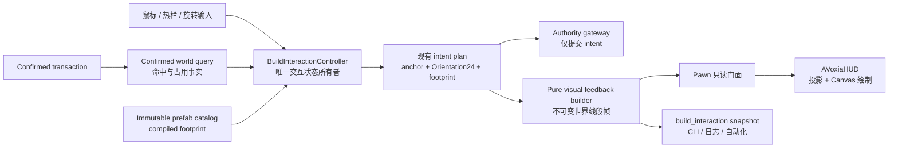
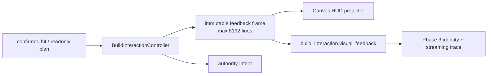

# Voxia 建造命中与 Prefab 放置预览反馈设计

- **日期**：2026-08-04
- **状态**：已实现，自动门禁通过；用户可见复核待确认
- **现役客户端**：`clients/Voxia`（UE 5.8）
- **唯一生产组合根**：`production_all_features` / `AVoxiaUnifiedVoxelWorldActor`
- **适用阶段**：Phase 2 宏格交互与 Phase 3 Prefab RuntimeMock

## 1. 结论

Voxia 应把建造命中反馈从流送 debug overlay 中彻底分离，改为正式 HUD 的世界锚定线框：

- 普通宏格命中显示贴合实际命中面的四边形；
- 热栏选中 prefab 时显示与最终 intent 完全同位姿、同 footprint 的预览线框；
- prefab 替换预览区分移除、保留和新增区域；
- 已放置 prefab 的删除选择继续显示整棵选中子树；
- 正常游戏无需 `-VoxiaDebugCanvasHUD` 或 `-VoxiaStreamDebug` 即可看到上述反馈；
- debug stream/tile overlay 仍只在显式 debug 开关下显示。

正式反馈由 `FVoxiaBuildInteractionController` 的同一份已确认命中和 prefab plan 派生，`AVoxiaHUD` 只负责投影与绘制。它不参与碰撞、不改 confirmed truth、不建立第二条射线检测或坐标换算路径，也不增加 actor、地图或生产 world root。

## 2. 当前问题与根因

现有 `FVoxiaBuildInteractionController::DrawOverlay` 已经包含若干 `DrawDebugHelpers` 线框：宏格命中面、prefab 放置、替换和删除选择。但调用链位于 `FVoxiaFocusRemoteInteractionController::DrawOverlay` 内，而该函数开头受 `AVoxiaPawn::IsVoxelDebugOverlayEnabled()` 限制。

因此在正常启动参数下会出现以下结果：

1. 命中与 prefab plan 实际存在；
2. 点击放置仍可工作；
3. 正式 HUD 没有消费这些状态；
4. 只有打开流送调试开关后才可能看到建造线框。

这不是几何算法缺失，而是建造交互反馈被错误挂到了概念上无关的流送诊断生命周期。直接放宽 debug guard 虽能暂时恢复可见性，但会继续混淆状态所有权、正式 UI 与调试工具，也无法可靠覆盖 shipping/Canvas 表现和 CLI 契约。

## 3. 目标与非目标

### 3.1 目标

1. 在正常 `production_all_features` 游戏流程中提供稳定、清晰的建造命中反馈。
2. 屏幕上显示的 prefab 位姿必须与提交 intent 使用的 anchor、`Orientation24` 和 compiled footprint 完全一致。
3. 无效候选仍应可见，并以红色和结构化原因明确说明不可放置。
4. 正式反馈与流送 debug overlay、远近景 LOD 调试和网络模式正交。
5. 提供真实输入、Automation、stdio CLI/结构化日志三种等价入口。
6. 对大 footprint 设置确定的线段预算，避免 HUD 绘制成本随内容无界增长。

### 3.2 非目标

- 不修改服务端、wire codec、authority adapter 或 confirmed reducer。
- 不引入客户端乐观确认；点击仍只提交 intent，真实世界仍等待 authority confirmed transaction。
- 不改变 prefab 碰撞、raycast、选择、替换和删除语义。
- 不新增第二个 world root、专用生产地图、反馈 actor 或可碰撞预览实体。
- 不实现 Prefab Designer、在线 authority 或新的美术资源管线。
- 不把 Web/Bevy 归档客户端纳入实现和验收。

## 4. 所有权与数据流



必须保持以下边界：

- `FVoxiaBuildInteractionController` 继续拥有当前命中、选中热栏项、旋转、prefab plan 和已放置 prefab 选择。
- 新的纯几何 builder 只接收上述状态的只读快照，产出不可变 `FVoxiaBuildVisualFeedbackFrame`；它不查询世界、不发 intent、不写 controller 状态。
- `AVoxiaPawn` 仅提供反馈帧的只读访问门面，不复制命中或 prefab 规划逻辑。
- `AVoxiaHUD` 不认识宏格/微格坐标算法，不重新 raycast，不重新校验 placement；它只把世界坐标线段投影到 Canvas。
- `FVoxiaFocusRemoteInteractionController` 只保留 focus/remote/stream 诊断职责，不再调用建造反馈绘制。

## 5. 反馈帧契约

建议新增 profile-neutral 的客户端内部值类型：

```text
EVoxiaBuildVisualFeedbackMode
  None
  MacroFace
  PrefabPlace
  PrefabReplace
  PrefabSelection

EVoxiaBuildVisualFeedbackStyle
  None
  Exact
  Simplified

EVoxiaBuildVisualLineRole
  Editable
  Invalid
  PreviewAdded
  PreviewRetained
  PreviewRemoved
  SelectedLeaf
  SelectedParent

FVoxiaBuildVisualLine
  start_world
  end_world
  role

FVoxiaBuildVisualFeedbackFrame
  mode
  visible
  valid
  style
  simplified
  reason
  anchor_world_micro
  orientation_id
  observed_world_revision
  lines[]
```

反馈帧是 presentation snapshot，不是 world truth。Controller 只在命中、热栏选择、旋转、placement plan、已确认 revision 或场景上下文变化时重建；HUD 每帧只读取最近的完整帧。任何重建失败都发布完整的不可见或红色无效帧，不保留旧候选伪装为当前结果。

Prefab 点击提交必须消费生成当前反馈帧的同一个缓存 `FVoxiaPrefabPlacementPlan` / replace plan，不得在点击路径重新规划另一份候选。提交前继续校验 `observed_world_revision`；revision 已变化时 fail-closed 并触发下一份 plan/反馈帧重建，不能提交一个用户从未看到的重规划结果。

### 5.1 模式优先级

同一时刻只发布一种主反馈模式，优先级如下：

1. 正在执行 prefab 替换：`PrefabReplace`；
2. 热栏选中可放置 prefab：`PrefabPlace`；
3. 删除/选择上下文命中已放置 prefab：`PrefabSelection`；
4. 普通材质宏格工具：`MacroFace`；
5. 无可靠命中或不在可交互场景：`None`。

优先级由现有交互上下文决定，不能由 HUD 自行推断。

## 6. 视觉语义

| 场景 | 几何 | 颜色角色 | 有效性语义 |
| --- | --- | --- | --- |
| 普通宏格命中 | 实际命中面的四条边 | `Editable` 为黄色 | 不可编辑时整面改为 `Invalid` 红色 |
| Prefab 放置 | 最终 plan 的旋转后 world-micro footprint | `PreviewAdded` 为绿色 | 冲突、无支撑或来源不可用时整组改为 `Invalid` 红色 |
| Prefab 替换 | 同一原子 replace plan 的三类 footprint | 移除红、保留黄、新增绿 | 整体 plan 无效时新增部分改为红色，移除/保留仍用于解释候选 |
| 已放置 prefab 选择 | 选中 leaf 或完整父级/根子树 coverage | leaf 青色、父级/根橙色 | 只表示将被删除的 confirmed coverage，不表示已经删除 |

宏格命中框沿命中法线向观察者方向偏移一个很小的纯视觉距离，避免与表面共面闪烁；该偏移不得进入 target 坐标或 intent。Prefab 线框按实际微格边界构建，不对 anchor 做视觉吸附修正。

宏格四边形直接使用现有 confirmed hit 中已经解析出的命中面和 face normal，不从相机方向二次猜测。它在透视投影后可能呈梯形，这是命中面的正确屏幕投影；“2D 方框”描述的是四条 Canvas 线组成的面轮廓，而不是脱离世界姿态的固定屏幕正方形。

HUD Canvas 线条采用世界锚定、屏幕空间绘制：摄像机运动和透视变化会正确改变位置，但线条不参与深度、碰撞和世界 truth。这样可保证命中反馈在复杂材质上仍清晰。投影失败或完全位于相机后的单条线段可跳过绘制，但结构化反馈帧仍保留原始线段和原因，便于诊断。

## 7. 精确线框与预算

### 7.1 精确模式

Prefab 精确线框使用最终 plan 的已旋转 world-micro cell 集合：

1. 将每个占用微格的边界转换为世界坐标；
2. 只为至少邻接一个外露面的边生成线段；
3. 以规范化端点键去重，避免相邻微格重复绘制同一条线；
4. 使用稳定排序保证相同输入得到相同线段顺序和可复现 snapshot；
5. replace 的颜色分类参与去重键，同色重复边合并；不同颜色区域的边界按 `Invalid > PreviewRemoved > PreviewAdded > PreviewRetained` 的固定优先级解析。

精确模式同时满足以下硬上限：

- 输入 footprint 不超过 2048 个占用微格；
- 去重后不超过 8192 条线段；
- 整个反馈帧不超过 8192 条线段。

一旦预估或构建将超过任一上限，就丢弃该次精确候选并整体进入简化模式，禁止发布被截断的半个 footprint。

### 7.2 简化模式

简化模式首先把 footprint 归并为占用宏格集合并绘制宏格级外轮廓，最多处理 512 个宏格、4096 条线段。若仍超过预算，则只绘制完整 footprint 的 world-space 包围盒，共 12 条线。

简化只改变 presentation 粒度：anchor、orientation、有效性和 intent plan 均保持不变。反馈帧必须设置：

```text
style = Simplified
simplified = true
reason = "exact_cell_budget" | "exact_line_budget" | "macro_line_budget"
validation_reason = 原始放置校验结果
```

## 8. 生命周期与失败行为

| 条件 | 可见结果 | 结构化结果 |
| --- | --- | --- |
| 场景 ready 且命中可靠 | 显示对应模式 | `visible=true`、`reason=ready` |
| 候选可计算但 placement 无效 | 红色候选仍可见 | `visible=true`、`valid=false`；精确帧由 `reason`、简化帧由 `validation_reason` 保留具体拒绝原因 |
| confirmed source/命中不可用 | 不显示旧候选 | `visible=false`、`reason=source_unavailable` 或 `no_confirmed_hit` |
| 切换热栏、旋转或命中目标 | 同一次状态更新后替换完整帧 | anchor/orientation/line_count 同步变化 |
| 离开场景、切 snapshot 或 EndPlay | 立即清空 | `mode=none`、`visible=false` |
| 单条线投影失败 | 只跳过该线 | 原始 frame 和 `line_count` 不变，HUD 可另计 projected count |

正常无效候选不得刷每帧日志。错误原因通过按需 CLI snapshot、Automation 断言和状态变化时的结构化 observe 事件暴露；只有状态转换或不变量破坏才写日志。

## 9. CLI 与可观测契约

现有 `build_interaction` snapshot 增加 `visual_feedback`，至少包含：

```json
{
  "visual_feedback": {
    "mode": "prefab_place",
    "visible": true,
    "valid": true,
    "style": "exact",
    "line_count": 84,
    "simplified": false,
    "reason": "ready",
    "validation_reason": "ready",
    "prefab_id": "8",
    "selected_instance_id": null,
    "role_counts": {
      "editable": 0,
      "invalid": 0,
      "preview_added": 84,
      "preview_retained": 0,
      "preview_removed": 0,
      "selected_leaf": 0,
      "selected_parent": 0
    },
    "anchor_world_micro": [128, -9, 24],
    "orientation_id": 7,
    "observed_world_revision": "42"
  }
}
```

约束如下：

- `mode` 只能是 `none|macro_face|prefab_place|prefab_replace|prefab_selection`；
- `style` 只能是 `none|exact|simplified`；
- `line_count` 是反馈帧中的世界线段数，不是当帧成功投影数；
- `role_counts` 固定包含七种线段角色，各值为 `0..8192`，总和必须等于 `line_count`；
- place/replace 的 `prefab_id`、`anchor_world_micro` 与 `orientation_id` 必须和现有 `prefab_preview` 中提交 intent 的 plan 一致；
- replace/selection 的 `selected_instance_id` 必须和当前 confirmed selection 一致；
- `observed_world_revision` 必须和当前缓存 plan 及提交 intent 的 revision 一致；
- `reason` 使用稳定机器可读枚举，不拼接自然语言；简化帧必须写入具体预算原因，`validation_reason` 独立保留候选有效性原因；
- `visible=false` 时不得残留上一候选的线段。

如需观察实际 Canvas 投影，可在已有 HUD snapshot 中补充 `projected_line_count` 和 `projection_skipped_count`，但它们只属于 presentation 诊断，不影响 `build_interaction` 的 plan 真值。

## 10. 实现边界

预计只修改 Voxia 客户端中的以下职责区域，具体文件可在实施计划中按现状细化：

- `Gameplay/VoxiaBuildInteractionController.*`：发布只读反馈帧，复用现有命中和 plan；
- 新的 `Gameplay/VoxiaBuildVisualFeedback.*`：纯值类型、几何生成和预算降级；
- `Gameplay/VoxiaPawn.*`：提供最小只读门面和生命周期清理；
- `Gameplay/VoxiaHUD.*`：投影、颜色、线宽和 Canvas 绘制；
- `Gameplay/VoxiaFocusRemoteInteractionController.*`：移除建造 overlay 调用，只保留 debug overlay；
- 对应 Automation 与 stdio smoke 断言；
- 最近的 Voxia README、current-truth、阶段进度和 session handoff。

不新增场景 actor 或组件，不修改地图资产。正式 HUD 继续由现有 `AVoxiaClientGameMode` 配置的 `AVoxiaHUD` 承载，因此不会形成第二个入口。

`AVoxiaHUD::DrawHUD` 应在确认 Canvas 和本地 Pawn 后、任何 transport/debug 诊断面板的提前返回之前绘制建造反馈；世界反馈先画，准星、hotbar 和文字面板后画，保证正式交互 UI 不依赖 transport 面板且准星始终位于最上层。

## 11. 测试与验收矩阵

### 11.1 纯逻辑 Automation

- 宏格六个命中方向都恰好生成四条位于正确平面的边；
- 负坐标下的宏格/微格边界遵守统一 floor-div/floor-mod 契约；
- prefab frame 的 anchor、`Orientation24` 和 footprint 与提交 plan 相同；
- 相邻微格线段稳定去重，相同输入顺序无关；
- 无效 placement 保持可见且全部使用红色角色；
- replace 正确区分移除、保留和新增；
- 2048 微格与 8192 线段边界前后分别进入 exact/simplified；
- 超大 footprint 最终降级为有界宏格轮廓或 12 线包围盒；
- no-hit、scene exit、snapshot switch 不保留 stale frame。

### 11.2 组合与架构回归

- `AVoxiaHUD` 在 `IsVoxelDebugOverlayEnabled()==false` 时仍绘制建造反馈；
- `FVoxiaFocusRemoteInteractionController` 不再拥有或调用 build feedback；
- HUD 不包含 raycast、placement validation 或坐标规划副本；
- Phase 2/Phase 3 既有 interaction、authority、selection 和 prefab runtime tests 全部继续通过；
- 点击 prefab 放置前后，世界只在 Mock authority confirmed transaction 后改变。

### 11.3 CLI / smoke

- `node clients/Voxia/scripts/voxia_stdio_cli.js --cmd "build_interaction"` 返回完整 `visual_feedback`；
- smoke 驱动宏格、prefab 放置、旋转、无效冲突、替换和删除选择，断言 mode、valid、style、line_count、reason；
- observe 产物写入 `.demo/observe/`，不得依赖截图作为唯一证据。

### 11.4 实跑

1. Development build；
2. focused Automation；
3. 全量 `Automation RunTests Voxia`；
4. Node/stdio CLI smoke；
5. Null-RHI 全链路，验证逻辑和 snapshot；
6. Real-RHI 正常启动且不带 stream/debug 参数，验证黄色命中面、绿/红 prefab 候选、旋转同步和删除选择；
7. `production_all_features` 可见窗口交给用户手动确认。

## 12. 验收标准

实现只有同时满足以下条件才可写成完成：

1. 正常启动无 debug 参数时，材质工具命中宏格可见四边形命中面。
2. 热栏选中 prefab 后，移动视角或旋转会立即更新精确候选线框，点击后出现的位置与预览一致。
3. 不可放置候选以红色显示，并通过 CLI 给出稳定原因。
4. 已放置 prefab 的 leaf/parent/root 删除范围仍有明确且不同的选择颜色。
5. 反馈不依赖 stream overlay，不创建 actor，不改变碰撞或 authority truth。
6. 大 prefab 不超过线段预算，且简化状态可观察。
7. 真实操作、Automation、CLI/日志三入口均有新鲜证据。
8. 所有相关回归通过，并在唯一生产组合根中完成 Real-RHI 可见验收。

## 13. 已裁决方案对比

| 方案 | 结论 | 原因 |
| --- | --- | --- |
| 直接解除现有 `DrawDebugHelpers` guard | 不采用 | 快，但继续把正式交互反馈混入 debug 生命周期，发布表现和可观测契约不稳定 |
| HUD 投影不可变世界线段帧 | **采用** | 复用唯一 plan，所有权清晰，正常游戏稳定可见，易于自动化和 CLI 验证 |
| 自定义 `UPrimitiveComponent` / scene proxy | 暂不采用 | 可做深度遮挡和复杂材质，但当前反馈规模不需要新增渲染组件、actor 生命周期和 scene proxy 维护成本 |

若后续产品明确需要深度遮挡、虚线材质、半透明实体 ghost 或编辑器可摆放的预览组件，再基于同一 `FVoxiaBuildVisualFeedbackFrame` 替换 renderer；不得改写命中与 placement plan 所有权。

## 14. 实施与验证结果（2026-08-04）

客户端分支 `codex/voxia-phase3-prefab-runtime` 已完成以下提交：

- `01230f8`：纯值 frame、宏格/微格/coverage 几何、稳定去重与 exact/macro/AABB 预算；
- `3eebf91`：controller 单一发布与生命周期失效、Phase 2/3 请求同身份断言；
- `003ea99`：HUD 投影/颜色/Canvas renderer，并从 stream/focus debug 生命周期移除；
- `aff7180`：stdio validator、Phase 3 trace 与最近 README；
- `94a0b65`：修复合法初始 revision `0` 被 JSON 丢成 `null`，保持为精确字符串 `"0"`；
- `195add6`：关闭独立审阅发现的三项缺口：预算原因可诊断、无效 replace 保留 removed/retained 语义，以及 stdio 对全部反馈模式、角色计数和 prefab/selection identity 的硬校验；
- `740c1c0`：关闭最终复核发现的诊断缺口；内部损坏 footprint 在没有上游校验原因时，同时发布明确的 geometry `reason` 与 `validation_reason`，且不覆盖已有 placement validation reason。



最终新鲜证据：

| 门禁 | 结果 | 产物 |
| --- | --- | --- |
| Development build | 当前工作树 UBT success | `VoxiaEditor Win64 Development`，exit 0 |
| 定向 RED/GREEN | RED 精确失败于 `validation_reason=not_updated`；修复后 `2/2` | `.worktrees/voxia-phase3-prefab-runtime/.demo/observe/voxia-build-feedback/minor-diagnostic-red-20260804/`、`minor-diagnostic-green-20260804/` |
| 全量 UE Automation | `215/215`：214 success + 1 外部 HTTP timeout warning，0 failed/not-run | `.worktrees/voxia-phase3-prefab-runtime/.demo/observe/voxia-build-feedback/final-all-20260804/index.json` |
| 全部 Node tests | `130/130` | `node --test clients/Voxia/scripts/*.test.js` |
| Phase 3 Null-RHI | `20/20`；35 条反馈覆盖六类语义、6 次 mutation、XYZ reload/continuous streaming 全部闭合 | `.demo/observe/voxia_phase3_2026-08-04T01-58-00-659Z_null_rhi_1280x720/` |
| Phase 3 Real-RHI | `20/20`；35 条反馈；1920×1080 viewport；frame p95/p99 `6.350/6.864ms`，GT/GPU p95 `6.416/3.596ms` | `.demo/observe/voxia_phase3_2026-08-04T02-07-26-751Z_visible_rhi_1920x1080/` |

Real-RHI 首次冷启动在约 42 秒才发出 CLI ready，超过 smoke 的 30 秒启动门并正常退出；日志中
scene composition、launch contract 和唯一根均正常。缓存预热后的同参数重跑进入完整路线并通过，
独立最终复核为 Critical/Important/Minor 全部 `0`、`Ready: Yes`。
未修改 timeout 或加入固定等待。该现象作为本机冷启动证据保留，不冒充功能失败或已解决的发布级
启动性能结论。

自动化已经证明颜色角色映射、绘制顺序、debug 解耦、预算上限、stale 清理和 plan 身份；Real-RHI
结构化路线也在无 `-VoxiaDebugCanvasHUD` / `-VoxiaStreamDebug` 参数下通过。但黄色/红色宏格面、
绿色 place、replace 红黄绿、leaf 青/parent 橙及准星/hotbar 层叠仍需用户在可见窗口中最终确认，
因此本文状态明确保留为“用户可见复核待确认”。Online authority/wire、Prefab Designer、正式内容
发布与 confirmed world truth 边界均未改变。
