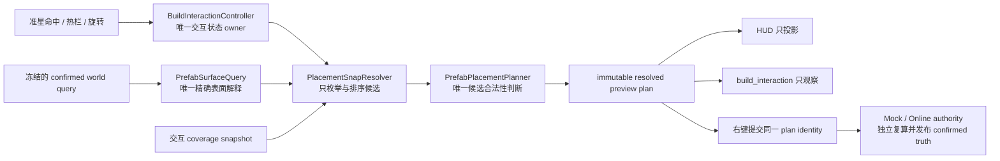
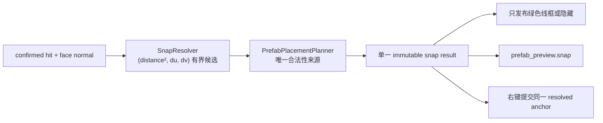

# Voxia Prefab 最近合法位置吸附设计

> 状态：已完成。自动门禁全部通过，用户已于 2026-08-06 在 1920×1080 可见生产根窗口确认吸附手感（"手感目前看起来不错"）。实施结果见 §11。
>
> 关系：本文是 [`2026-08-04-voxia-build-targeting-feedback-design.md`](2026-08-04-voxia-build-targeting-feedback-design.md) 的交互增量。它只替换“无效 prefab place/replace 显示红框”的目标行为，不改变宏格二维命中面、合法 replace 差分颜色、selection 颜色或 confirmed authority 边界。

## 1. 背景与已批准决策

现役实现先从准星命中面计算唯一 prefab anchor，再由
`FVoxiaPrefabPlacementPlanner` 判断该 anchor 是否可放置。合法候选显示绿色 exact 线框；无效候选仍显示红色线框。

用户批准将普通 place 改为以下语义：

1. 原始 anchor 合法时保持零偏移；
2. 原始 anchor 无效时，在同一命中面附近确定性搜索最近合法 anchor；
3. 只显示可直接提交的绿色线框；范围内没有确定合法位置时隐藏；
4. replace 保留被选实例的 anchor、Orientation24、父级与 component slot，不进行位置吸附；无效 replace 隐藏；
5. HUD、CLI 与右键 intent 必须消费同一个最终 immutable plan；
6. 不新增地图、GameMode、反馈 Actor 或第二个 production root。

合法 replace 仍用红/黄/绿表达 removed/retained/added 差分；这里移除的是“无效候选整体标红”，不是删除 replace 的差分语义。material/macro 的二维命中反馈不在本轮范围内。

## 2. 目标与非目标

### 2.1 目标

- 普通 place 只产生 `direct`、`snapped` 或 `hidden` 三种结果；可见结果一定合法。
- “最近”按完整 XYZ world-micro 空间中的固定面内距离定义，同一输入永远返回同一 anchor。
- 屏幕线框、CLI snapshot 与 intent 的 prefab id、resolved anchor、orientation、revision 和 exact conflict set 同源。
- 搜索严格有界，候选数量和耗时可观测，不让 30Hz hover 更新形成无界工作。
- confirmed 数据未知时 fail-closed，不把未知候选当作不可放置后绕过去。
- 连续移动、coverage 变化和 revision 推进会主动失效旧吸附结果。

### 2.2 非目标

- 不改变 `FVoxiaPrefabPlacementPlanner` 的占用、支撑、footprint 或 conflict 语义。
- 不修改 Mock/Online authority、wire codec、confirmed reducer 或 presentation transaction。
- 不做三维自由搜索，不吸附到墙后、地下、背面或另一层表面。
- 不把 replace 降格成“删除旧 prefab，再到附近另放一个”。
- 不引入客户端乐观 confirmed truth、实体 ghost、碰撞预览或新的生产入口。
- 不为本轮实现 Prefab Designer、在线服务端 prefab 协议或归档客户端 parity。

## 3. 正交职责与唯一事实



必须保持以下不变量：

- `PlacementSnapResolver` 属于客户端 Gameplay 交互策略，只决定“按什么顺序询问候选”；它不得复制 world occupancy、no-floating、footprint overlap 或 conflict set 算法。
- `FVoxiaPrefabPlacementPlanner` 继续是客户端候选合法性的唯一来源；resolver 只能接受完整 planner 结果，不能用简化 AABB 冒充合法。
- `FVoxiaPrefabSurfaceQuery` 继续是 SolidMacro/RefinedProjection 的唯一精确 surface 解释器；resolver 不自行展开另一套体素读取语义。
- `FVoxiaPrefabPreviewState` 中的最终 resolved plan 是本地预览唯一事实。place 分支只拥有一份 `PrefabPlacementSnapResult`，其内部只拥有一份 `placement_plan`；既有 `Plan`/anchor 字段应迁移为该结果的只读访问，而不是保留第二份可变副本。HUD 不重新 raycast，CLI 不重新规划，点击不从当前准星重新拼装另一份 anchor。
- place snap result 与 replace plan 由显式模式互斥；切换模式时必须清空非活动分支，禁止两份 plan 同时看似可提交。
- 本地 resolved plan 仍只是 preview truth；confirmed truth 只由 authority 对当前 revision 独立复算后发布。
- 唯一运行事实仍为 `/Game/Voxia/Maps/L_VoxiaProductionWorld`、`VoxiaClientGameMode` 与 `AVoxiaUnifiedVoxelWorldActor`。定向 Automation 可以使用纯值 fixture，但不得生成第二个生产 root。

## 4. 值契约

新增纯值结果，具体 C++ 命名可在实施计划中按现有目录约定落位：

```text
SnapState
  Direct
  Snapped
  Hidden

PrefabPlacementSnapResult
  state
  source_anchor_world_micro
  resolved_anchor_world_micro?
  offset_world_micro?
  face_normal_world_micro
  search_radius_micro
  tested_candidate_count
  reason
  terminal_detail
  placement_plan?
```

约束：

- `Direct` 必须有合法 `placement_plan`，resolved 等于 source，offset 为 `[0,0,0]`。
- `Snapped` 必须有合法 `placement_plan`，resolved 等于 source 加 offset，offset 只能位于命中面的两个切向轴。
- `Hidden` 不得携带可提交 plan、footprint 线段或残留 resolved anchor；它仍保留稳定机器原因。
- `tested_candidate_count` 范围为 `0..1024`，包括原始 `(0,0)` 候选。
- 可提交状态的 anchor 只从 `placement_plan` 所属 snap result 读取并表示最终 resolved anchor；原始 anchor 通过同一结果中的独立字段观察，不能用两个状态字段分别维护同一最终坐标。

## 5. 确定性搜索契约

### 5.1 面内坐标系

输入 face normal 必须是完整 world-micro XYZ 中恰有一个分量为 `+1` 或 `-1` 的单位轴向量。切向基固定为：

| 法向轴 | U 轴 | V 轴 |
| --- | --- | --- |
| X | Y | Z |
| Y | X | Z |
| Z | X | Y |

法向正负不改变 U/V 的排序，因此相同 world-micro 输入不依赖相机、分辨率或帧时序。

### 5.2 半径与候选顺序

先按当前 Orientation24 编译一次相对 footprint，计算 U/V 上实际占用微格跨度 `span_u/span_v`：

```text
radius = clamp(max(span_u, span_v), 1, 16)
```

候选整数偏移满足：

```text
du * du + dv * dv <= radius * radius
```

按元组 `(distance_squared, du, dv)` 升序排序，`(0,0)` 必须为首项。`radius=16` 的圆形候选域少于 1024 项；实现仍保留 `1024` 硬门，生成器若越界则以 `snap_candidate_budget_exceeded` 隐藏并报告不变量破坏。

这个半径足以让当前单宏格 builtin 在面内越过自身跨度，也覆盖当前最大 `16×8×11` assembly 的最长面内跨度；未来更大内容仍受 16 微格产品预算约束，不得静默扩大 hover 成本。

### 5.3 候选验证

对每个候选按以下顺序处理：

1. 以 checked signed64 加法把 `(du,dv)` 应用到原始命中 surface micro；溢出立即终止。
2. 通过 `FVoxiaPrefabSurfaceQuery::QueryFace` 确认该位置仍是相同法向的已确认 exposed surface；确定为空气或 occluded 时继续下一候选。
3. 复用唯一 face-alignment helper 计算 candidate anchor；resolver 不实现第二套 bounds 对齐公式。
4. 调用现有 `FVoxiaPrefabPlacementPlanner::PlanPlace` 得到完整 footprint、support read claim 与 conflict set。
5. planner 合法后，要求全部 affected macro 在当前 `IVoxiaInteractiveCoverageQuery` 中可交互；满足后立即返回首个结果。

由于候选已按距离排序，第一个合法结果就是本设计候选域内的最近合法位置。

## 6. 失败分类

| 分类 | 例子 | 行为 |
| --- | --- | --- |
| 确定不可放置 | `occupied_by_solid_macro`、`occupied_by_prefab_micro`、`prefab_floating`、surface air/occluded | 继续下一候选 |
| 当前不可交互 | candidate plan 合法，但任一 affected macro 不在 interactive coverage | 继续下一候选 |
| 未知 confirmed truth | `world_query_unavailable`、`world_macro_missing`、`prefab_world_projection_invalid`、surface unavailable | 立即隐藏为 `snap_search_indeterminate`，保留底层 `terminal_detail` |
| 结构错误 | definition/orientation 非法、编译失败、signed64 溢出、候选预算不变量破坏 | 立即隐藏并保留具体 reason |
| 候选耗尽 | 所有有界候选均确定不可用 | 隐藏为 `no_valid_anchor_within_snap_budget` |

未知候选不能被当作“确定无效”后继续选择更远位置，否则客户端无法证明结果确实最近。

replace 不进入上述搜索。合法 replace 继续发布 exact removed/retained/added 差分；任何 invalid、stale、outside-interest 或 unknown replace 只发布 hidden feedback，并保留原 planner/controller reason。

## 7. 生命周期、缓存与性能

- 每次 30Hz hover refresh 继续使用同一份冻结 world query 和同一 coverage view，禁止在单次搜索中跨 snapshot 读取。
- snap source identity 至少包含 prefab id、Orientation24、hit world micro、face normal、confirmed revision 和 coverage snapshot identity。
- 没有显式 coverage identity 时不得跨 refresh 缓存 snap 结果；可以复用当前已有的最终 visual-frame 几何缓存，但不能让它跳过新一轮 plan/coverage 状态更新。
- 若实施时为 `IVoxiaInteractiveCoverageQuery` 增加版本身份，该身份只描述只读 coverage snapshot，不得让 Gameplay 反向拥有 Interest 或 renderer 状态。
- 搜索命中首个合法候选即停止；候选上限为 1024，不允许时间、摄像机或哈希迭代顺序改变结果。
- 公开 tested count、radius、outcome 与 CPU 样本；正常 30Hz 无效悬停不刷逐帧日志，只在状态变化或不变量破坏时写结构化 observe。
- Phase 3 Real-RHI 必须继续通过现有 frame/GT/GPU 门禁；不得用降低流送质量、关闭碰撞或放宽门槛交换吸附功能。

## 8. HUD 与可观测契约

普通 prefab place：

| snap state | HUD | intent |
| --- | --- | --- |
| `direct` | 绿色最终 footprint | 可提交同一 plan |
| `snapped` | 绿色最终 footprint | 可提交同一 plan |
| `hidden` | 无 prefab 线框 | 不得提交 |

invalid place/replace 不再生成 `Invalid` 角色线段。宏格二维命中反馈、普通 selection 颜色和合法 replace 的 removed 红色角色保持不变。

`build_interaction.prefab_preview` 至少扩展：

```json
{
  "snap_state": "snapped",
  "source_anchor_world_micro": [128, -9, 24],
  "resolved_anchor_world_micro": [130, -9, 24],
  "offset_world_micro": [2, 0, 0],
  "face_normal_world_micro": [0, 1, 0],
  "search_radius_micro": 8,
  "tested_candidate_count": 9,
  "reason": "nearest_valid_anchor"
}
```

并满足：

- `prefab_preview.anchor_world_micro`、`visual_feedback.anchor_world_micro` 与最终 intent anchor 必须等于 `resolved_anchor_world_micro`；
- hidden 时 resolved/offset 使用 JSON `null`，`visual_feedback.visible=false`、`style=none`、`line_count=0`；
- 64 位坐标和 revision 继续使用精确 JSON 表达，禁止经 JavaScript Number 丢精度；
- 不序列化最多 1024 个候选或最多 8192 条世界线，只公开有界计数与最终身份；
- Node validator 对 unknown state、越界计数、非切向 offset、source/resolved 算术不闭合和可见 hidden frame 全部硬失败。

## 9. 测试与验收矩阵

### 9.1 Automation

- 先写 RED：原 anchor 被占用、相邻位置合法时，当前红框行为必须失败。
- `direct` 零偏移；阻挡后选择最近 `snapped`；等距候选按 `(du,dv)` 稳定排序。
- 六种法向、负坐标、跨 macro/chunk、当前 builtin 全部 Orientation24。
- 同面 surface air/occluded 跳过，unknown surface 在更近候选处使搜索 fail-closed。
- prefab/solid overlap、floating、coverage 边缘、半径耗尽、candidate budget 与 signed64 溢出。
- world revision、coverage identity、热栏、旋转、teleport 和 EndPlay 失效旧结果。
- invalid replace 保持原 anchor/层级语义，hidden、零 invalid line，右键不发 intent。
- valid replace 差分颜色与现有 remove/retained/add identity 不回归。
- HUD/CLI/click 三者 resolved identity 完全相同。

### 9.2 Node、CLI 与唯一生产根

- stdio validator 覆盖 `direct|snapped|hidden` 以及 JSON 精确坐标、偏移算术和候选预算。
- Phase 3 smoke 构造一个原 anchor 阻挡、最近面内 anchor 可放的确定场景；证明绿色 frame、`prefab_preview` 和最终 intent 同锚点。
- 构造预算内无解与 invalid replace；证明均 hidden 且没有 intent。
- 持续 XYZ 移动、Near/Far 流送、卸载/重载后不得保留 stale snap。
- 使用同一 `/Game/Voxia/Maps/L_VoxiaProductionWorld`、默认 Mock profile 和 `AVoxiaUnifiedVoxelWorldActor` 完成 Null-RHI 与可见 Real-RHI；probe 不得冒充生产完成。
- 最终验收同时包含真实鼠标操作、Automation 与 CLI/结构化产物，截图不能替代机器门禁。

## 10. 实施范围与完成条件

预计只触及 Voxia 客户端：

- `Gameplay/`：新增 snap resolver 纯值边界，controller 组合最终 preview plan，HUD 隐藏 invalid prefab；
- `Voxel/PrefabRuntime/`：只在需要暴露现有纯 helper 或避免重复编译时做最小接口整理，不改变 planner 语义；
- `Debug/` 与 `scripts/`：扩展 snapshot、validator 和 Phase 3 路线；
- 最近 `README.md`、本设计进度与 `docs/00-current-truth/`：仅在实跑完成后同步现状。

以下条件全部满足才算完成：

1. 普通 place 可见线框永远对应一个当前 revision、当前 coverage 下可提交的 exact plan；
2. invalid place/replace 不显示红框，不发送 intent；
3. 最近排序、预算、失败分类和完整 XYZ 契约由 Automation 冻结；
4. HUD、CLI、真实输入只消费一个 resolved preview plan；
5. 全量 Automation、Node、Phase 3 Null-RHI/Real-RHI 与持续流送门禁通过；
6. 唯一 production root 与 server-authoritative confirmed truth 边界未改变；
7. 用户在最新可见窗口确认吸附手感后，才把状态从“待可见复核”改为完成。

## 11. 实施与验证结果（2026-08-06）

客户端分支 `codex/voxia-phase3-prefab-runtime` 的实施提交：

- `cfd4ece`：纯值 `FVoxiaPrefabPlacementSnapResult`、固定切向基、有界候选枚举、共享 face-alignment 与失败分类；
- `fb96946`：`FVoxiaPrefabPreviewState` 改为 place/replace 互斥单一事实，隐藏不可提交 place 与无效 replace，右键只提交 resolved plan；
- `ceb9ace`：`prefab_preview.snap` 可观测面、`placement_snap` CPU 计时与 Node validator；
- `6d2e5ef`：Phase 3 smoke 的封闭竖井确定性 snapped/hidden 路线；
- `1a64b45`：客户端 README 与目录文档同步。



### 11.1 与设计的两处显式偏差

1. **CLI 键名命名空间**：§8 示例把 snap 字段平铺进 `prefab_preview`，其中 `reason` 与既有
   `prefab_preview.reason`（placement 校验原因）冲突。实施改为嵌套
   `prefab_preview.snap.{state,source_anchor_world_micro,resolved_anchor_world_micro,offset_world_micro,face_normal_world_micro,search_radius_micro,tested_candidate_count,reason,terminal_detail}`；
   字段集合与语义与设计一致，只消除键名歧义。
2. **隐藏帧不携带锚点**：§8 要求 `visual_feedback.anchor_world_micro` 等于
   `resolved_anchor_world_micro`。该约束仅对可见帧成立；隐藏帧统一输出 `[0,0,0]`，以满足
   §4「Hidden 不得残留 resolved anchor」。`prefab_preview.anchor_world_micro` 仍保留分支锚点，
   因此无效 replace 不移动被选实例仍可直接观察。validator 按 `visible` 分别硬校验这两条规则。

### 11.2 门禁

| 门禁 | 结果 | 产物 |
| --- | --- | --- |
| Development build | UBT success，exit 0 | `VoxiaEditor Win64 Development` |
| 定向 mutation 自审 | 把 planner 未知原因从 fail-closed 改成跳过后，`Voxia.Gameplay.PrefabPlacementSnap` 精确失败于 terminal detail 与候选计数两条断言 | 已回滚，最终 `1/1` |
| 全量 UE Automation | `216/216`：215 success + 1 外部 `generate_204` HTTP timeout warning，0 failed/not-run | `.demo/observe/voxia-prefab-snap/all-20260805/index.json` |
| Node | `134/134` | `node --test clients/Voxia/scripts/*.test.js` |
| Phase 3 Null-RHI | `20/20`；封闭竖井 797 候选全拒 → 隐藏且零 intent；球体 25 候选吸附到唯一合法锚点，偏移 `[2,0,2]` | `.demo/observe/voxia_phase3_2026-08-06T14-01-48-543Z_null_rhi_1280x720/` |
| 1920×1080 Real-RHI | `20/20`；frame p95/p99=`5.958/7.044ms`、GT p95=`5.852ms`、GPU p95=`3.680ms` | `.demo/observe/voxia_phase3_2026-08-06T14-08-08-594Z_visible_rhi_1920x1080/` |

对比实施前的同路线基线（frame p95/p99=`6.350/6.864ms`、GT p95=`6.416ms`、GPU p95=`3.596ms`）：
frame p95 与 GT p95 改善，p99 上升约 `0.18ms`，`>8.33ms` 帧 1/437。

### 11.3 已知成本与后续项

- **吸附搜索 CPU**：`prefab runtime-metrics.placement_snap` 在 Real-RHI 路线上为 2315 个样本、
  均值 `1.92ms`、峰值 `5.60ms`。峰值来自 builtin assembly 在 `radius=16` 下的 797 个候选，
  其中约 64 个进入完整 `PlanPlace`。当前仍在既有帧门禁内，但这是一次 30Hz 悬停刷新的实际
  代价。设计 §7 允许在为 `IVoxiaInteractiveCoverageQuery` 增加只读 coverage 身份后按 snap
  source identity 跨 refresh 缓存；本轮没有实施该缓存，因此每次 hover refresh 都会重算。
- **独立于本增量的运行时缺口**：把 prefab 放进「刚挖开且四周被岩层完全封闭」的地下口袋时，
  intent 会停在 `accepted`，`receipt.acknowledged=false`、`obligated=0`，`confirmed_revision`
  始终为 `0`，presentation 不再推进。证据见
  `.demo/observe/voxia_phase3_2026-08-06T13-53-30-895Z_null_rhi_1280x720/`（intent `10`）。
  该路径不经过吸附代码：客户端提交的 plan、锚点与 observed revision 都正确且被 authority 接受。
  本轮因此把竖井路线限定为「只验证预览与不提交」，把已提交的 snapped 证明放在地表
  `unrelated_b` 放置上（`committed_snap_state=snapped`）。该缺口需要独立定位，不得由本增量冒充解决。
- **live place-hidden 覆盖**：竖井路线已确定性产出 `prefab_place_hidden`；`no_valid_anchor_within_snap_budget`
  之外的隐藏原因（`snap_search_indeterminate`、结构错误）仅由 Automation 冻结，未在实跑路线中构造。

### 11.4 用户可见复核（已确认）

2026-08-06 用户在 1920×1080 可见窗口（`run_voxia_3d_world.ps1`，唯一生产根
`production_all_features`，`voxel_world_root_ready` / `centers_aligned=true`）实际试玩吸附行为，
确认"手感目前看起来不错"。§10 完成条件第 7 项闭合，本设计状态改为完成。

后续独立事项（非本增量阻塞项）：

- §11.3 的吸附搜索 CPU 缓存优化（需先为 `IVoxiaInteractiveCoverageQuery` 增加只读 coverage 身份）；
- §11.3 的封闭地下口袋 presentation 停滞缺口，需作为独立议题定位（吸附会让用户更容易撞上它）。

Online authority/wire、Prefab Designer 与 confirmed world truth 边界均未改变。
