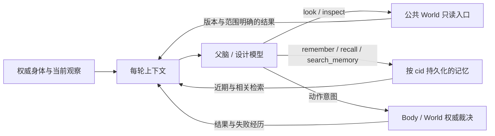

# NPC 模型输入、能力与记忆契约

分类：全局系统功能。范围是通用父脑与住宅设计会话；Jev 是分类器，不是另一个自主执行者。

## 当前缺陷与改动契约

D2 的失败不能仅归因于模型能力：父脑没有身体尺寸，设计会话只有半高/半径/台阶高度，
只有固定两层场地观察且不能主动查询 World；记忆只有最近五条经历与精确键读写。
本增量补齐共享身体说明、设计期间的真实环境查询、按内容检索和逐轮记忆注入。
保持现有 authority、模型、预算和住宅验收门槛，不改变移动算法或生成场地。

1. **自身**：权威 Session/Scene profile 提供全高、半高、半径、直径、速度、加减速、台阶高度；
   明确米/秒、Y-up、中心位置和脚点含义。物理参数不等于已开放动作（例如有跳跃参数不代表 move_to 会跳）。
2. **能力**：每次实际请求的 `tools` 是当前可调用接口清单，含参数、单位、范围、作用与失败语义。
   父脑可移动、观察、操作世界和调用技能；设计会话可观察、编辑草稿、检查、发布及读写记忆，
   世界写入交回父脑的 build/Body，由 World 裁决。不得描述一个实际不能调用的工具。
3. **环境**：look/inspect 在父脑和设计中复用同一范围校验与公共 World 查询。
   look 保留世界版本、完整 XYZ 查询边界、细化格精确 micro 坐标；窗口外未知，附件另查 inspect。
   原有两层 site 只是初始样本，选择门外起点前应查足脚下支撑、身体宽度及头顶高度。
4. **记忆**：永久 cid 隔离的 PostgreSQL 笔记和经历；每次决策现查近期经历、近期笔记和目标/新结果相关记忆。
   `remember` 保存/更新，`recall` 精确键读取，`search_memory` 不要求先知道键。
   检索先用英文词与中文相邻字片段匹配，按命中数与时间排序；不宣称同义词语义搜索，不新增向量服务。
   每条检索结果带来源类别、键、时间、地点；缺失与数据库错误明确区分。
   新承诺、计划和经验应主动保存；技能结束自动记录目标、状态、原因及最近检查诊断，不能只写完成/失败。
5. **真值边界**：记忆和旧工具结果都是历史观察；时间或 world_seq 不能证明仍然有效。行动前刷新相关环境，
   以权威动作结果认定成功。不会自动把整段模型思考或推测写成事实。

## 验证范围

先用冻结模型应答验证真实请求、工具结果回传和下一轮记忆刷新；World/Scene 与 PostgreSQL 用真实模块，
角色站位与模型输出是显式夹具。旧相关笔记超过近期窗口、中文检索、角色隔离、写后读、错误不能冒充空结果、
门口初始观察外的障碍与精确 micro 坐标是必测反例。共享 Body/World 接缝做相应回归。
这些检查不代表自然语言造房子已验收，也不证明 UE 画面、双客户端、性能或分发版本。

## 依据

- [OpenAI function calling](https://developers.openai.com/api/docs/guides/function-calling)：工具调用必须执行并把结果回传，循环可继续调用；保留 Responses 推理与 call_id。
- [LangGraph memory](https://docs.langchain.com/oss/python/langgraph/memory)：线程上下文与跨会话持久记忆分开，按 namespace 隔离，事实和经历分开管理；仅借鉴职责，不引入框架。
- [PostgreSQL text search](https://www.postgresql.org/docs/16/textsearch-controls.html)：词元查询受词典影响；本轮不假设英文全文搜索能正确分词中文，使用明确披露的片段匹配。

## 进度

2026-09-22 已实现并验证父脑/设计会话接线。身体示例（来自实际测试 profile，非提示词常量）：
身高 1.8m、半径 0.35m、直径 0.7m、速度上限 8m/s、台阶高度 1m、设计离散净空 15 micro。
`move_to` 当前仍使用宏格寻路，细化格保守阻挡，不能把设计检查的 micro 可达性当成真实 Body 行走验收。
设计每轮刷新角色当前位置与记忆；工具查询仍重新验证当前会话。预算、usage 缺失和 HTTP 失败保留最近检查摘要。

验证命令在各 app 目录运行，数据库端口 `MMO_DB_PORT=5433`，原始日志统一在
`Voxim/Saved/Gameplay/prefab-designer-20260922/`：

- DataService：`mix.bat test --no-start test/data_service/npc_memory_test.exs`，3 passed，`memory-search-final.log`。
- Gate：`mix.bat test --no-start test/gate_server/npc_skill_design_test.exs test/gate_server/npc_memory_test.exs test/gate_server/npc_brain_llm_test.exs test/gate_server/npc_skills_test.exs test/gate_server/npc_skill_brain_test.exs`，46 passed，`context-suite3.log`。
- Body/World/技能中断：`mix.bat test --no-start test/gate_server/npc_skill_brain_test.exs test/gate_server/npc_body_test.exs test/gate_server/npc_body_world_test.exs`，27 passed、7 项付费/规模用例按默认排除，`context-body-regression.log`。
- 新增真实 Body→模型身体字段断言单独复验：`mix.bat test --no-start test/gate_server/npc_body_world_test.exs:768`，1 passed，`context-real-body-final.log`。原首次失败是把服务器浮点速度 8.0 写成了模式匹配整数 8，按 Session profile 契约修正期望类型；没有放宽容差。
- 新增 journal 内容与检索故障检查通过，见 `context-seams-final.log` 的相关 11 项；其中上述整数/浮点断言的原始失败保留。更早 `context-red.log` 证明原请求缺少全高；`context-suite2.log` 中旧记忆替身缺新 API 的失败已在 suite3 修正。

真实模型仅运行一轮两层屋：`DESIGN_LIVE_CASE=two_storey mix.bat test --no-start test/gate_server/npc_skill_design_live_test.exs --include live_llm`。
保持 `gpt-5.6-terra/high`、12 轮/240000 token/每次 4096 输出/60s HTTP 限制。
证据目录 `d2-live-two_storey-1790044778184-13314/`：request-1 含完整身体字段与10个可调用工具；
模型先 slice 门框、slice 楼梯，第3轮主动 look 世界 macro 闭盒 `[10,0,13]..[14,3,17]`，
request-4 已带回真实 seq=2 的地形与上方空间。第4次 HTTP 请求超时，测试 exit 2；
3 个已返回响应累计已知 30906 token，`usage_complete=false`，未编辑、发布或放置房屋。没有自动重试。

这是“真实模型可自主感知”的实跑证据，不是 D2 房屋通过。D2 仍未验收；未验证新版本 UE 双客户端行走、性能或分发。
旧 Builder 一次性蓝图规划和 Jev 分类器没有被扩展为自由多轮对话；本契约适用于当前父脑与设计及后续对话式决策入口。
