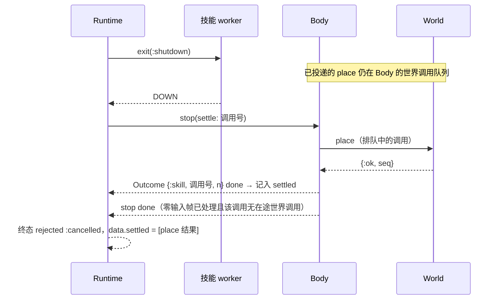

# NPC 共用运行层与评审修复记录（2026-10-06）

分类：全局系统功能，阶段记录。契约正文在 [`apps/gate_server/lib/gate_server/npc/README.md`](../../../apps/gate_server/lib/gate_server/npc/README.md)
与 `GateServer.Npc.Brain` 的 moduledoc；本文件只记目标、决策、验证与剩余项。

## 1. 共用运行层增量（`npc-shared-runtime-20261006`，提交 509d4614）

用户批准方向：功能模块通过稳定契约供 LLM、行为树和脚本复用。先完成技能调用闭环，再扩展后端和玩家能力。
该增量保持 Player / World 真值、移动输入和原子动作裁决不变；不接入身体交互、施法或正式聊天。

- 将长技能启动、内部 Outcome 路由、中断、停止确认和结束记录从 Llm 提取到 Runtime。
- 技能提供公共描述与执行契约；调度通过独立策略接口调用，Jev 为现有实现，无配置时不产生模型请求。
- 非 LLM 后端完成同一个 build，拒绝原因和事务序号原样返回；非 LLM 也能调用已有 Memory 工具。

真实模块回归发现 Scene.drop 原顺序先停止 Player、后发 mmo_close，NPC 会先收到 DOWN(:normal)，
导致会话关闭原因丢失；调整为先通知 owner 再停止 Player。原失败在 `Voxim/Saved/npc-runtime-world1.log`，
启动时序用例改前失败在 `npc-runtime-readiness-red.log`。

验证（Windows 原生 Mix，`MIX_ENV=test`，测试库 127.0.0.1:26909）：gate_server NPC 套件 93 通过、9 排除
（`npc-runtime-final.log`）；scene_server 会话退出相关 35 通过（`npc-runtime-scene-regression.log`）；
补验 20 通过（`npc-runtime-contract-final.log`）。9 个排除项是真实模型或规模场景，不计通过。
没有付费模型调用、UE 双客户端实跑、性能验收或分发验证。

## 2. 评审修复（分支 `npc-review-fixes-20261006`，基于 509d4614）

来源：同日对 NPC 模块的设计与实现评审。用户要求全部修复。

| 问题 | 根因 | 修复 |
| --- | --- | --- |
| 一次批量会话丢失让所有 NPC 永久消失 | 会话丢失（积压、Scene 结束会话、Player 结束、移交失败、claim 失败）都靠 Body 退出、由 NpcSup 重启；同时退出超过 3 个即超出重启强度，监督者连同子进程终止，动态子进程不会恢复 | Body 自己维护会话：丢失后 1 秒重新 claim，Brain / Runtime / 在途技能保留；`restart: :transient`；被同 cid 顶替（原因 2）正常结束 |
| 取消后世界仍被改，结果被丢 | 取消只等 worker 退出与移动停稳；已投递、未执行的世界调用在终态后才执行，结果被 Runtime 丢弃 | `stop` 带 `settle: 调用号`，Body 等该调用的在途世界调用全部回结果才确认；期间落定的结果进终态 `data.settled` |
| Jev 中断检查问法错误、配置耦合、易误杀 | `heard` 是布尔，被拼成 “A player is addressing the NPC: false.”；`scheduler` 配置隐式开启中断检查；低置信度与网络错误都中断 | `heard` 改为听到的话（新在前）；只有 `interrupt_policy` 开启检查；拿不准等同继续，策略失败记 `scheduler_error_count` 并继续 |
| LLM 大脑可能永久沉默或无限重试 | 应答无工具调用时 `dirty` 永远为假；请求失败每秒重试；没有询问上限 | 无工具调用与失败按 1–60 秒指数退避重问；每 NPC 每小时 `max_requests_per_hour`（缺省 600） |
| 模型输出格式错误会让 NPC 崩溃重建 | `Jason.decode!`、`List.to_tuple` 直接作用于模型输出；Body 对非 map 的 target 调 `Map.take` | 统一经 `Responses.function_calls/1` 解析，参数错误 / 未知工具在本地回报拒绝；Body 拒绝非身份 map 的 target |
| 设计技能邮箱无界增长 | Runtime 每 50 ms 把 Observation 转给技能 worker，设计会话从不接收 | 技能用可选 `observations?/0` 声明是否需要；只有 wilderness 声明 |
| Observation 不会唤醒 LLM | 只有 Outcome / heard / wait 到期会置 `dirty` | 有实体走进 6 米（离开 8 米才算走远）即唤醒 |
| 重复实现 | Builder 大脑壳与荒野技能壳两套；Responses 解析三处；原子动作工具描述手写在 Llm 里 | 删除 Builder 大脑壳，`Brain.Builder` 更名为纯状态机 `GateServer.Npc.Builder`；新增 `Responses`、`Actions`；Llm 的 look / inspect 改用 `Perception.command/2` |
| 通用名字下的住宅专用技能 | `design` 的发布条件是住宅验收 | 技能名改为 `design_house`，模块 `Skills.HouseDesign` |
| 记忆表无界 | 经历只追加；每轮检索对该 NPC 全部行做正则切分 | 每 cid 保留 200 条笔记、1000 条经历，上限只在 `DataService.NpcMemory.limits/0` |
| `cancel_skill` 对不上时无结果 | 取消沿用原调用号，不匹配时静默无操作，逐条等结果的后端会卡死 | 取消命令带自己的 id 与 `call:`，受理 / `no_active_skill` / `already_cancelling` 都有 Outcome |

依据见 npc README「依据」一节：OTP 监督者重启强度与动态子进程不随监督者重启恢复、仓库 AGENTS.md §2.1
「自维护不变量」、Responses 应答的 `incomplete` 状态、指数退避重试。

### 2.1 验证

环境：Windows 原生正式 Mix 构建图，`MIX_ENV=test`，测试库 `voxim-pg-p0-body-20261005`（127.0.0.1:26909，
既有测试入口按 VM 隔离）。日志在 `../Voxim/Saved/npc-review-fixes-20261006/`。

- 基线（509d4614，未改）：gate_server NPC 11 个文件 98 通过、9 排除，`baseline.log`。
- 改前红灯：把新用例放到 509d4614 的临时 worktree 上跑，gate_server 23 项失败（新增的 17 项回归 +
  6 项按新契约更新的旧用例），`red-gate.log`；data_service 保留上限用例失败（`limits/0` 不存在），`red-data-service.log`。
  关键失败方式：一次 Scene 同时结束 4 个 NPC 会话后成员里一个都不剩；settle stop 在 place 落定前就报完成；
  排队调用遇 Player 结束时 Body 退出；无工具调用的应答之后再也不询问。
- 改后：gate_server 同一 11 个文件（测试文件已随更名）全部通过、9 排除，`green-gate.log`；
  data_service `npc_memory_test.exs` 4 通过，`green-data-service.log`。
  真实 Session / Scene / Player / World 覆盖：会话批量丢失后重新入场、积压重建、Scene 结束会话后重新入场、
  被同 cid 顶替时正常结束、冻住 World 时 settle stop 等待排队 place（对照组普通 stop 同期完成）、
  Player 结束时排队调用 `session_lost` 且 Body 重新入场、双 Scene 移交。

排除项：`live_llm`、`live_jev`（付费外部模型）与 `npc_scale`（规模测量）未运行，不计通过；
`builder_live` 已改为脚本后端调用 wilderness 技能，但同样属于 `live_llm`，本轮未实跑。
没有替换 Demo 镜像、没有 UE 双客户端实跑或分发验证。

### 2.2 剩余

- 世界变化（例如自己的建筑被拆）唤醒大脑、住宅以外的设计技能、正式聊天，仍是后续功能。

## 3. 观察与目标接口（Attention / Sight，2026-10-07 合入）

来源：2026-10-06 某个已结束会话在主工作区完成、未提交的增量，在线会话均未认领；用户批准接手，
在独立 worktree 上放到合入评审修复后的 master 上。契约正文见 npc README「观察与目标」，这里只记合并决策与验证。

- 新增 `Attention`（13 个命令的目录与纯状态）、`Sight`（视野 / 瞄准 → World 只读射线）、
  `World.sight_snapshot/3`、`Damage.trace/5`（共用 DDA，额外返回首次进入实占用微格的距离）、
  `Player.eye_position/1`（眼点偏移只此一处）。
- 合并决策：LLM 工具目录与译码接到评审修复后的链路——`Attention.tools/0` 进 `tools/1`，
  `Attention.command/3` 排在 `Actions` / `Perception` 之后、`Memory` / `Skills` 之前；参数不是对象仍在本地拒绝。
  原增量把“眼睛在 self.position 上方 0.6 米”换成了 view 说明，合并时两句都保留。
- 合并时发现并修复：评审修复新增的 `lose_session` 只清空已同步实体、不清关注；重新入场后对方实体代次已变，
  而 EntityEnter 只在已知实体换代时清理，旧代次成员会永久留在组里。改为与换场景相同，一并重置关注。
  改前红灯 `session-red.log`（`get_targets` 仍含旧代次成员），改后通过。

验证（同 §2.1 环境，日志在 `../Voxim/Saved/npc-attention-20261007/`，原始增量补丁 `wip-from-main-worktree.patch`，
原作者日志 `../Voxim/Saved/npc-attention-*.log`）：gate_server NPC 13 个文件 125 通过、10 排除（`gate-final.log`），
其中真实 Session / Player / World 的观察用例 `--only attention` 2 通过（`attention-world.log`）；
voxel_region `damage_test.exs` 6 通过（`damage.log`）。排除项同 §2.1，不计通过；未做付费模型、UE 双客户端或 Demo 镜像实跑。
