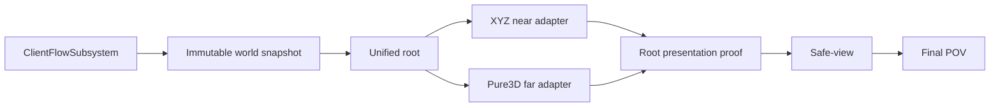

# 当前会话接力：Voxia 阶段 1 已完成

> 当前产品总纲：[`Voxia 客户端网络无关功能分阶段收口`](2026-07-14-voxia-client-offline-mock-closure-design.md)。
> 阶段 1 规格与结果已归档：[`PRD`](../../20-archive/client/2026-07-15-voxia-phase1-world-rendering-lifecycle-prd.md) ·
> [`closeout`](../../20-archive/client/2026-07-15-voxia-phase1-world-lifecycle-closeout.md)。

## 当前状态

- **阶段 1“世界渲染与场景生命周期”已实施并通过自动化、CLI/日志和 Real-RHI 门禁。**
- 独立 Voxia 仓库：`clients/Voxia master@6de74ec`，合并提交为
  `merge: complete phase one world lifecycle`；本地相对 `origin/master` 为 ahead 10，未推送。
- 最终实现提交：`271e612 feat(voxia): complete phase one world lifecycle`。
- 外层仓库只收口 PRD/current-truth/known-gaps/closeout/plan/handoff 文档；不修改 `apps/**`、wire、
  Web 或 Bevy。
- 阶段 2–6 继续冻结。自动化完成后的最后动作是以可见窗口启动同一正式组合根，交给用户手动
  确认；不得在本接力中自行展开阶段 2。

## 用户可见能力

1. 启动后自动创建一个只读 Mock session，并只生成一个 `AVoxiaUnifiedVoxelWorldActor` 正式根。
2. 首次加载期间阻断游戏输入；near/far/snapshot/ownership/fence 一致后才进入 playable。
3. 玩家可沿正负 X/Y/Z、斜向和多 tile 连续移动；高空 near 零几何时 far 仍保留世界覆盖。
4. coverage 未提交时保持 last-safe view；超过阈值进入恢复加载，可自动恢复、主动 retry 或返回菜单。
5. 菜单只提供 New Game / Exit；新游戏结束旧 session，创建新 snapshot 与根。
6. 阶段 2 编辑 affordance 隐藏；CLI/测试误触返回 `feature_not_available_phase2`。

## 关键实现边界



- near/far 都绑定 `root_world_snapshot`；各自维护派生 cache、worker 与原子提交，不共享可变隐式状态。
- near 固定 `27 tiles=9261 chunks`；单轴换窗 entered/exited=`3087`、retained=`6174`。
- near active 绘制按 XYZ tile × material family 合批；far 使用增量 page/artifact/stable patch 与
  render shard。后台构建和 GameThread creation/registration/fence/visibility/retirement 分阶段错峰。
- opaque/translucent/emissive slot 贯穿 artifact、DynamicMesh、scene host 与预算指纹。默认 WorldGen
  内容主要是浅色 opaque terrain；不要把 runtime family contract 误写成美术内容已完成。
- `frame_perf` 同时报告 raw `frame_ms` 与 `game_thread_ms`；阶段 1 streaming 门禁只认后者，但 raw
  环境长帧必须保留。短门禁隔离周期性 pending-kill purge，soak 保留默认 GC。

## 最终证据

| 门禁 | 结果 | 产物 |
|---|---|---|
| Development build | success，exit 0 | UnrealBuildTool 最终运行 |
| `Automation RunTests Voxia` | `68/68` success，0 warning / failed / not-run | `.demo/observe/voxia_phase1_automation_2026-07-16T00-17-07/` |
| Null-RHI 全路线 | 25 routes，pass | `.demo/observe/voxia_phase1_2026-07-15T14-55-37-788Z_null_rhi_1280x720/` |
| 1280×720 Real-RHI 全路线 | 25 routes，pass | `.demo/observe/voxia_phase1_2026-07-15T15-30-59-504Z_real_rhi_1280x720/` |
| 1600×900 Real-RHI soak | 30 分钟、96 route completion、93 资源样本、无单调增长 | `.demo/observe/voxia_phase1_2026-07-15T15-44-42-482Z_real_rhi_1600x900/` |

GameThread p95：1280×720=`4.70/4.56ms`，1600×900=`4.46/4.60ms`；四段
`>16.67ms` 均为 0。长稳态第二段 raw frame max=`65.41ms`，对应 GameThread max=`13.66ms`，
记录为默认 GC/渲染环境长帧，不归因于 streaming CPU。

## 复现命令

```powershell
cd clients/Voxia
& 'D:\Epic Games\UE_5.8\Engine\Build\BatchFiles\Build.bat' VoxiaEditor Win64 Development `
  "-Project=$PWD\Voxia.uproject" -WaitMutex -NoUBA -MaxParallelActions=2

node scripts/run_phase1_world_lifecycle_smoke.js --real-rhi --res 1280x720
node scripts/run_phase1_world_lifecycle_smoke.js --real-rhi --performance-only --res 1600x900 --soak-minutes 30
```

全量 automation 使用绝对 `.uproject` 路径；相对 `./Voxia.uproject` 可能被 Unreal 按引擎目录解析并
在进入测试前失败。

## 后续边界

1. 当前只需保持可见程序运行，等待用户手动确认阶段 1 效果。
2. 若用户确认后启动阶段 2，应先从阶段 2 PRD 收敛挖/放、pending UI、confirmed overlay 与 HUD，
   不要顺带修改服务端。
3. Online 仍需独立主线完成 bootstrap、production H-gated pages、snapshot/delta、lease、重连与
   source revision；不得用本地 WorldGen 或 runtime snapshot 兜底。
4. `.demo/`、`Saved/` 与 observe 产物是本地证据，不提交、不清理用户其它工作树内容。
