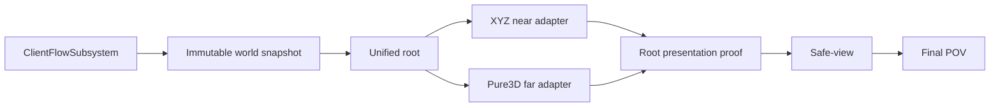

# 当前会话接力：Voxia R5 已完成，下一阶段 R6

## 2026-07-19 R5 Transport façade 组件化完成

- 当前继续在 client 与 outer 的 `codex/voxia-r0-r6-governance` 分支推进；R5 client 提交为
  `5f9e741 refactor(governance): componentize transport facade`。
- Transport 仍独占 GameInstance 生命周期、TCP pump、HTTP callback 与原公共 API；baseline、near-window、
  confirmed stores、Interest/action、legacy far build 的可变状态已迁入五个独立 owner。
- 每个 owner 都有稳定 contract label、reset/reducer 与纯 snapshot；near coordinator 还自行维护 timeout、
  worker ownership、迟到结果隔离和 lease 计数。
- `Voxia.Net.TransportFacadeOwnership` 防止 owner 字段重新散回 Transport；wire codec、CLI token/envelope/schema、
  observe 字段、GameMode、统一生产根和 production actor 均未改。
- Development build 成功；全量 Automation `83/83 Success`；唯一生产根 Null-RHI 25 路通过、clean exit、
  far release=`11/11/0`；production CLI 的 root/session ready 与 single root 成立；legacy probe CLI 的 near
  present/rendered 成立。
- 最终证据：
  - `.demo/observe/voxia_governance_r5_timeout_owner_full_final_20260719/`
  - `.demo/observe/voxia_phase1_2026-07-18T17-43-53-305Z_null_rhi_1280x720/`
  - `.demo/observe/voxia_governance_r5_timeout_owner_production_cli_20260719.log`
  - `.demo/observe/voxia_governance_r5_timeout_owner_legacy_probe_cli_20260719.log`

下一步直接进入 R6：按批准设计拆分 subscription/session、build/focus/remote interaction 与
demo/stress/edit-shot controller，Pawn 只保留输入、移动表现和 controller 编排；继续保持 lease 独立活性、wire
不变、行为与可见效果不变、唯一生产根不变，并按阶段测试后分别提交 client 与 outer。


> 当前产品总纲：[`Voxia 客户端网络无关功能分阶段收口`](2026-07-14-voxia-client-offline-mock-closure-design.md)。
> 阶段 1 规格与结果已归档：[`PRD`](../../20-archive/client/2026-07-15-voxia-phase1-world-rendering-lifecycle-prd.md) ·
> [`closeout`](../../20-archive/client/2026-07-15-voxia-phase1-world-lifecycle-closeout.md)。

## 2026-07-18 权威窗口后台流送与 3-chunk 超期恢复

### 远端与审查状态

- 外层 `master` 已推送；审查前状态基线为 `origin/master@9134368c`，本轮审查设计与状态更新
  位于本节所在提交。
- Voxia 候选分支已推送到
  `origin/codex/voxia-phase1-hardening-closeout@a37dfeb`，尚未合并客户端 `master`。
- 第一轮只读审查已经完成，结论与分阶段治理边界见
  [`Voxia 工业级代码审查与无行为变化治理设计`](2026-07-18-voxia-industrial-code-review-and-remediation-design.md)。
  已确认的高优先级问题是 production near/legacy far 共享 Actor、Transport 跨领域汇合和 CLI
  路由缺少稳定目录合同；设计批准前不改代码。后续不使用历史阶段 1 通过记录替代修复后的 fresh 验证。

### 当前代码点

- 独立 Voxia worktree/branch：`.worktrees/voxia-phase1-hardening-closeout` /
  `codex/voxia-phase1-hardening-closeout`。
- 本轮客户端提交：
  `454267b feat(streaming): define committed authority coverage bounds`、
  `b9f329b feat(streaming): commit authority coverage with presentation proof`、
  `68e4689 fix(streaming): gate safe-view recovery by coverage depth`、
  `881980c fix(streaming): separate playable flow from coverage recovery`、
  `ee99655 fix(streaming): keep root playable across authority handoff`、
  `f2898c9 test(streaming): cover nonblocking authority handoff`、
  `a37dfeb docs(streaming): document authority coverage handoff`。
- 外层设计/计划基线：`0dc86335` 与 `10b69b8a`；本节及 current-truth 记录实际结果。

### 已实现行为

- 首次 presentation proof 后 session readiness 单调；near/far 正常 desired/live 分离不再让唯一根回退
  InitialLoading。
- 玩家进入新 tile 时立即跟踪 staging target，旧 committed `3×3×3` XYZ coverage 与输入继续有效；
  普通 `streaming` overlay 隐藏。
- presentation proof 原子提交 committed bounds；safe-view 以 canonical player chunk 对旧 bounds 计算
  XYZ/L∞ depth。depth `1..2` 为非阻塞 hold，depth `>=3` 且 pending 才全屏恢复。
- 确定性 snapshot/revision/H/source/provider/ownership/fence/proof 错误仍立即 hard fail；没有本地 fallback。
- root/flow JSON 与 observe 暴露 committed/staging、bounds、玩家 chunk、分轴深度、L∞ 深度、固定阈值
  与 `voxel_authority_stream_*` / `voxel_authority_safe_view_held` 事件。

### 新鲜验证证据

| 门禁 | 结果 | 产物 |
|---|---|---|
| Development build | pass，UBT exit 0 | 2026-07-18 fresh build |
| 全量 automation | `70/70` Success，0 non-success / Voxia automation error / warning | `.demo/observe/voxia_authority_streaming_final_20260718_122257/` |
| Null-RHI 全路线 | 25 routes pass；相邻 `+X` staging=true/recovery=false；clean exit；release=`11/11/0` | `.demo/observe/voxia_phase1_2026-07-18T04-24-07-621Z_null_rhi_1280x720/` |
| 1280×720 Real-RHI | 25 条功能路线完成；相邻 `+X` staging=true/recovery=false；0 `LogVoxia: Error` | `.demo/observe/voxia_phase1_2026-07-18T04-26-34-025Z_real_rhi_1280x720/` |
| Real-RHI 严格性能 | 未闭合：第二窗 GT p95=`1.480ms`、max=`52.351ms`、`>16.67ms=2` | 同上 |

Real-RHI runner 的最终 `passed=false` 仅来自既有严格帧预算断言；功能路线、相邻换窗观察与性能窗口
均保留在同一 index 中，必须继续分层解读。下一步发布硬化仍是在没有外部 D3D12/DXGI stall 的环境
复跑连续性能门禁；不得过滤尖峰或回退本次权威窗口语义。

## 2026-07-17 最终审查与复验

### 当前代码点

- 独立 Voxia worktree/branch：`.worktrees/voxia-phase1-hardening-closeout` /
  `codex/voxia-phase1-hardening-closeout`，基于 `5e9f6b1`。
- 候选由两个提交组成：
  `500248e fix(streaming): harden far pure-data ownership` 与
  `97d5002 fix(streaming): close far release ownership gaps`。
- 最终只读审查已经三轮收口；Critical / Important / Minor 均为 0。主仓与
  `clients/Voxia` master 均未合并或推送，worktree 当前干净。

### 实现边界

- reusable canonical batch 在 stale plan、residency cancel/fail、build cancel/fail/stale 路径均
  归还 actor owner；不同 owner 冲突显式拒绝，不允许旧 generation 覆盖新 owner。
- launch/build result、retired coverage、失败/替换的 artifact cache 和 EndPlay 遗留纯数据统一进入
  单条 `TPri_Lowest` far worker。EndPlay 等待在途工作、drain release queue 后才销毁 UE 线程池。
- observe 新增 `voxel_pure3d_far_release_drained` / `voxel_pure3d_far_release_drain_failed` 与
  `world_snapshot_id`。runner 只接受本次 quit 后、输入序号更新、同一 snapshot、stdout/stderr
  close、进程退出码 0 的成功终态，并显式拒绝失败终态。
- release automation 用阻塞动作占住唯一 worker，将两项析构排在其后；`DrainStarted/DrainReturned`
  证明 drain 真正进入且不能在 worker 放行前伪完成。

### 最终证据矩阵

| 门禁 | 结果 | 产物 |
|---|---|---|
| Development build | pass，UE 5.8 UBT exit 0 | worktree `97d5002` 对应二进制 |
| `Automation RunTests Voxia` | `69/69` pass，0 failed | `.demo/observe/voxia_phase1_review_fixes_20260718_0052/automation_all_voxia_final.log` |
| Null-RHI 全路线 | 25/25 pass，clean exit，release=`11/11/0` | `.demo/observe/voxia_phase1_2026-07-17T17-58-12-947Z_null_rhi_1280x720/` |
| 1600×900 Real-RHI soak | 30 分钟，120 routes、95 资源样本，`growing_keys=[]`；queued/completed=`14→390`、pending=`0`；最终 `391/391/0` | `.demo/observe/voxia_phase1_2026-07-17T17-20-55-320Z_real_rhi_1600x900/` |
| 1280×720 performance-only | 一红一绿；失败轮回程 GT max=`424.536ms`、`>16.67ms=3`；通过轮 GT `>16.67ms=0/0` | `.demo/observe/voxia_phase1_2026-07-17T17-17-41-539Z_real_rhi_1280x720/`、`.demo/observe/voxia_phase1_2026-07-17T17-19-10-704Z_real_rhi_1280x720/` |
| 1280×720 Real-RHI 全路线 | 24 条功能路线后首个性能窗出现一个 `16.98ms` GT 帧，严格失败 | `.demo/observe/voxia_phase1_2026-07-17T17-10-09-719Z_real_rhi_1280x720/` |

长稳态中 95 个 release 样本的 `pending` 最大值为 0；未命中 owner conflict、GameThread fallback、
drain failure 或 `LogVoxia: Error`。两段 soak GT p95=`1.490/1.503ms`、max=`5.119/6.012ms`、
`>16.67ms=0/0`。

### 仍未关闭的门禁

- 当前不能勾选 Task 7 Step 3–5，也不启动可见人工验收。最新两轮 strict performance-only
  没有连续通过；完整 Real-RHI 复验也有一个轻微越线窗。
- 失败 performance-only 仍复现 RHI 初始化约 58–60 秒后的周期性长帧。先前定向 hitch 树将
  `423.086ms` 归因于 D3D12 `STAT_D3DUpdateVideoMemoryStats` 内 DXGI
  `QueryVideoMemoryInfo`；本轮一红一绿说明同一 raw 400ms 尖峰会在不同运行中落到 GT 或
  render/RHI。runner 不做豁免。
- 下一步应在没有该外部 D3D12 stall 的环境直接跑连续两次 performance-only；两次都通过后，
  再 fresh build、focused/full automation、short Null/Real 路线并勾选 Task 7 Step 3–5，最后启动
  可见 `production_all_features` 交给用户手动确认。

## 2026-07-17 本机硬化候选初轮复验（由上节最终复验取代）

### 本次实施结果

- 独立 Voxia worktree/branch：`.worktrees/voxia-phase1-hardening-closeout` /
  `codex/voxia-phase1-hardening-closeout`。候选提交：
  `500248e fix(streaming): harden far pure-data ownership`，基于 WIP checkpoint `5e9f6b1`。
- reusable canonical batch 在 stale plan、residency cancel/fail、build cancel/fail/stale 路径均归还
  actor owner；owner 已持有不同 batch 时拒绝覆盖，并发出
  `voxel_pure3d_reusable_batch_restore_rejected`。
- launch plan、build result、publish success/fail 与 EndPlay 遗留的
  residency/artifact/cache/coverage/provider/snapshot 大纯数据统一在单条
  `TPri_Lowest` far worker 释放。UE 5.8 `FQueuedThreadPool::Destroy()` 会 abandon 队列中
  未开始任务，因此 EndPlay 先条件式 drain，再销毁 worker。
- `pure3d_world_state.far_release` 与 observe 暴露 `queued/completed/pending`；smoke/soak 断言
  `completed <= queued`、`pending = queued - completed` 与 `pending <= 1`。英文参数注解与
  “后台四线程”旧注释已清理。

### 新鲜验证证据

| 门禁 | 结果 | 产物 |
|---|---|---|
| Development build | pass，exit 0 | UE 5.8 UBT，本机 AutoSDK MSVC 14.44 |
| `Automation RunTests Voxia` | `69/69` pass | `.demo/observe/voxia_phase1_hardening_closeout_20260717_2324/automation_all_voxia.log` |
| Null-RHI 全路线 | 25/25 pass | `.demo/observe/voxia_phase1_2026-07-17T15-49-41-681Z_null_rhi_1280x720/` |
| 1280×720 Real-RHI 全路线 | 25/25 pass；GT p95=`1.505/1.506ms`；max=`9.408/4.879ms`；`>16.67ms=0/0`；release=`6/6/0` | `.demo/observe/voxia_phase1_2026-07-17T15-52-34-671Z_real_rhi_1280x720/` |
| 1600×900 Real-RHI soak | 30 分钟；104 route completion；101 资源样本；无单调增长；release `8→208/8→208/0` | `.demo/observe/voxia_phase1_2026-07-17T15-59-31-501Z_real_rhi_1600x900/` |

上述全路线、soak 和 Null-RHI 均未命中 owner 冲突、GameThread 释放回退、release drain
失败或 `LogVoxia: Error`。

### 唯一剩余门禁与根因证据

- 两次独立 `--real-rhi --performance-only --res 1280x720` 都在 RHI 初始化约
  58–60 秒后出现 `422–425ms` GameThread/RHI 长帧，因此不符合“连续两次
  performance-only pass”。复现产物：
  `.demo/observe/voxia_phase1_2026-07-17T15-24-51-877Z_real_rhi_1280x720/` 与
  `.demo/observe/voxia_phase1_2026-07-17T15-29-47-230Z_real_rhi_1280x720/`。
- 定向 hitch 产物
  `.demo/observe/voxia_phase1_2026-07-17T15-36-15-707Z_real_rhi_1280x720/engine.log`
  在 Frame 6386 报告 RHIThread=`427.198ms`、
  `STAT_D3DUpdateVideoMemoryStats=423.086ms`，内部两次 DXGI `QueryVideoMemoryInfo`；同帧
  Voxia world tick 约 `1.4ms`，far build 尚未恢复，release=`4/4/0`。
- UE 5.8 本地引擎源码确认 D3D12 Development 在每个 `RHIEndFrame` 同步收集显存统计，
  没有可禁用或降频的 CVar。本机环境为 RTX 4080 SUPER / NVIDIA 591.86，并存
  向日葵虚拟显示/远控栈。不允许为了门禁自行停用用户远控服务，也不允许
  在 runner 中过滤该帧。

因此计划 Task 7 Step 3–5 保持未勾选，不把候选提交写成新的最终验收点，不启动
可见窗口。下次应在无该 DXGI 阻塞的 D3D12 环境直接重跑连续两次
performance-only；通过后再做最终 fresh build/focused suite/short route，勾选 Task 7 Step 3–5，
并启动可见 `production_all_features` 交给用户手动确认。

## 2026-07-17 跨机器检查点

### 本次停点

- 用户要求在代码审查硬化尚未全部收口时立即记录、提交并推送，供另一台电脑继续。因此，
  `clients/Voxia` 的本次提交是**明确的 WIP checkpoint**，不是新的阶段 1 最终验收点。
- `6de74ec merge: complete phase one world lifecycle` 仍是上一轮完整阶段 1 实现基线；本次检查点
  在其上追加性能屏障、near-first 调度、far worker、canonical page 复用、分帧 residency 与
  scene publication 硬化。
- 客户端检查点提交：`5e9f6b1 checkpoint(voxia): preserve phase one hardening progress`。外层仓库提交记录本页及既有 PRD、计划、
  current-truth 与 closeout 文档。
- 阶段 2–6 继续冻结；Web / Bevy、服务端、wire 与 Online authority 不在本次改动范围内。

### 已实现且在审查前通过实跑的硬化

1. `performance_runtime_barrier` 在 Real-RHI 采样前等待 shader/asset compilation、DDC 与 rendering
   command quiescence；smoke harness 在性能门禁前强制执行。
2. far 构建在 near baseline/presentation 稳定前显式 defer，恢复时发出结构化事件；far 使用一条
   `TPri_Lowest`、512 KiB 栈的专用线程，并在大批 page 组装中协作式让权。
3. canonical batch 跨 generation 复用，按 source/required/dirty 集合修剪；page residency 改为
   每 tick 最多 1024 页的显式事务，CLI 暴露游标、剩余量与最大 tick 耗时。
4. far scene 的注册粒度从 12000 quad 收紧到 1024 quad；成功 publish 后的大 build result 在 far
   worker 上释放，避免正常成功路径集中在 GameThread 析构。
5. 最近一次已完成验证（发生在下述“审查后未验证补丁”之前）：Development build 成功、
   `Automation RunTests Voxia` 为 `68/68`；1280×720 Real-RHI 全路线和 1600×900 默认 GC 30 分钟
   soak 均通过，Null-RHI 全路线通过。

| 证据 | 产物 / 关键结果 |
|---|---|
| 全量 automation | `.demo/observe/voxia_phase1_final3_automation_2026-07-16T02-32-36/`，68/68 |
| 1280×720 Real-RHI | `.demo/observe/voxia_phase1_2026-07-15T18-33-26-725Z_real_rhi_1280x720/`，25 routes；GT p95 4.212/4.296ms，`>16.67ms=0/0` |
| 1600×900 Real-RHI soak | `.demo/observe/voxia_phase1_2026-07-15T18-46-09-481Z_real_rhi_1600x900/`，30 分钟；73 route completion、48 资源样本、无单调增长；第二窗口 GT max 11.843ms；第一窗口有一次 25.575ms 离群帧 |
| Null-RHI | `.demo/observe/voxia_phase1_2026-07-15T19-30-34-803Z_null_rhi_1280x720/`，pass |

> 上表是本地 `.demo/observe/` 证据路径，不提交到 Git。旧 closeout 中较早的 96 routes / 93
> samples 数字仍是历史验收记录；继续工作时应先以本检查点列出的最新运行作为性能调查入口，
> 最终收口后再统一 current-truth 与 closeout 的“最终证据”表。

### 审查后已写入并完成最小验证的补丁

- reusable canonical batch 只有在当前 generation 的 `ResidentPages` lease 同时背书时才可复用；
  取消/失败 generation 遗留候选页会强制重新经过 provider。新增“provider 完成后取消，下一代
  重试必须重新 provider resolve 全部未提交页”的回归用例。
- batch 修剪改用 incremental plan 的 `RequiredPageIds` set，消除逐页 `TArray::Contains` 的 O(N²)。
- budgeted residency transaction 增加有序 page-id 指纹，拒绝“长度相同但 ID/顺序已变”的续批；
  新增失败后 lease 回滚测试。
- far DynamicMesh shard 新增按 quad 边界切分单个 oversized surface 的硬上限实现与 1024+17 quad
  回归用例，避免“只在 surface 之间切分”导致实际 shard 越过 1024。
- 上述四项已在本检查点完成 Development 增量编译，并分别通过
  `Voxia.Gameplay.WorldGenVoxelShellBuilder`、`Voxia.Gameplay.CanonicalVoxelShellSceneBuilder`、
  `Voxia.Voxel.CanonicalPageProvider` 三项定向 automation，三项均为 `Result={Success}`。
- 尚未对当前补丁重跑全量 68 项、Real-RHI 或 30 分钟 soak；接手者仍须把当前提交当成 WIP，
  不能引用前一轮 68/68 证明新补丁已完成最终验收。

### 下一台电脑的收敛顺序

1. 拉取外层仓库与 `clients/Voxia` 独立仓库，确认两个 `master...origin/master` 均为 `0 0`，并先读
   本节与 `AGENTS.md`。
2. 可先用 no-op build 和三项定向测试复核跨机环境；本机检查点已通过 Development build 及
   `Voxia.Gameplay.WorldGenVoxelShellBuilder`、`Voxia.Gameplay.CanonicalVoxelShellSceneBuilder`、
   `Voxia.Voxel.CanonicalPageProvider`。如跨机失败，按根因修复，不回退 residency-backed contract。
3. 完成审查尚未实现的最后一项：stale plan、residency cancel/fail、build cancel/fail、publish fail 与
   EndPlay 的大纯数据都走 far worker 后台释放；成功/失败分支均须保留已提交 reusable batch/cache。
4. 清理本轮新增的英文参数注解，并把 `VoxiaUnifiedVoxelWorldActor.cpp` 中“后台四线程”旧注释改为
   “单条最低优先级专用线程”。
5. 重跑 Development build、全量 `Voxia` automation、连续两次 Real-RHI performance-only、
   1280×720 全路线、1600×900 默认 GC 30 分钟 soak 和 Null-RHI；将新证据统一回写 closeout、
   current-truth、plan 与本 handoff。
6. 只有全部新验证通过后，才勾选计划 Task 7 Step 3–5，并可见启动正式组合根交给用户手动确认。

## 当前状态

- **阶段 1“世界渲染与场景生命周期”已实施并通过自动化、CLI/日志和 Real-RHI 门禁。**
- 独立 Voxia 仓库：上一轮完整阶段 1 基线为 `6de74ec`；本次跨机器 WIP checkpoint 为
  `5e9f6b1 checkpoint(voxia): preserve phase one hardening progress`。
- 最终实现提交：`271e612 feat(voxia): complete phase one world lifecycle`。
- 外层仓库只收口 PRD/current-truth/known-gaps/closeout/plan/handoff 文档；不修改 `apps/**`、wire、
  Web 或 Bevy。
- 阶段 2–6 继续冻结。自动化完成后的最后动作是以可见窗口启动同一正式组合根，交给用户手动
  确认；不得在本接力中自行展开阶段 2。

## 用户可见能力

1. 启动后自动创建一个只读 Mock session，并只生成一个 `AVoxiaUnifiedVoxelWorldActor` 正式根。
2. 首次加载期间阻断游戏输入；near/far/snapshot/ownership/fence 一致后才进入 playable。
3. 玩家可沿正负 X/Y/Z、斜向和多 tile 连续移动；高空 near 零几何时 far 仍保留世界覆盖。
4. coverage 未提交时保持 last-safe view；超过阈值进入恢复加载，可自动恢复、主动 retry 或返回菜单。
5. 菜单只提供 New Game / Exit；新游戏结束旧 session，创建新 snapshot 与根。
6. 阶段 2 编辑 affordance 隐藏；CLI/测试误触返回 `feature_not_available_phase2`。

## 关键实现边界



- near/far 都绑定 `root_world_snapshot`；各自维护派生 cache、worker 与原子提交，不共享可变隐式状态。
- near 固定 `27 tiles=9261 chunks`；单轴换窗 entered/exited=`3087`、retained=`6174`。
- near active 绘制按 XYZ tile × material family 合批；far 使用增量 page/artifact/stable patch 与
  render shard。后台构建和 GameThread creation/registration/fence/visibility/retirement 分阶段错峰。
- opaque/translucent/emissive slot 贯穿 artifact、DynamicMesh、scene host 与预算指纹。默认 WorldGen
  内容主要是浅色 opaque terrain；不要把 runtime family contract 误写成美术内容已完成。
- `frame_perf` 同时报告 raw `frame_ms` 与 `game_thread_ms`；阶段 1 streaming 门禁只认后者，但 raw
  环境长帧必须保留。短门禁隔离周期性 pending-kill purge，soak 保留默认 GC。

## 最终证据

| 门禁 | 结果 | 产物 |
|---|---|---|
| Development build | success，exit 0 | UnrealBuildTool 最终运行 |
| `Automation RunTests Voxia` | `68/68` success，0 warning / failed / not-run | `.demo/observe/voxia_phase1_automation_2026-07-16T00-17-07/` |
| Null-RHI 全路线 | 25 routes，pass | `.demo/observe/voxia_phase1_2026-07-15T14-55-37-788Z_null_rhi_1280x720/` |
| 1280×720 Real-RHI 全路线 | 25 routes，pass | `.demo/observe/voxia_phase1_2026-07-15T15-30-59-504Z_real_rhi_1280x720/` |
| 1600×900 Real-RHI soak | 30 分钟、96 route completion、93 资源样本、无单调增长 | `.demo/observe/voxia_phase1_2026-07-15T15-44-42-482Z_real_rhi_1600x900/` |

GameThread p95：1280×720=`4.70/4.56ms`，1600×900=`4.46/4.60ms`；四段
`>16.67ms` 均为 0。长稳态第二段 raw frame max=`65.41ms`，对应 GameThread max=`13.66ms`，
记录为默认 GC/渲染环境长帧，不归因于 streaming CPU。

## 复现命令

```powershell
cd clients/Voxia
& 'D:\Epic Games\UE_5.8\Engine\Build\BatchFiles\Build.bat' VoxiaEditor Win64 Development `
  "-Project=$PWD\Voxia.uproject" -WaitMutex -NoUBA -MaxParallelActions=2

node scripts/run_phase1_world_lifecycle_smoke.js --real-rhi --res 1280x720
node scripts/run_phase1_world_lifecycle_smoke.js --real-rhi --performance-only --res 1600x900 --soak-minutes 30
```

全量 automation 使用绝对 `.uproject` 路径；相对 `./Voxia.uproject` 可能被 Unreal 按引擎目录解析并
在进入测试前失败。

## 后续边界

1. 当前只需保持可见程序运行，等待用户手动确认阶段 1 效果。
2. 若用户确认后启动阶段 2，应先从阶段 2 PRD 收敛挖/放、pending UI、confirmed overlay 与 HUD，
   不要顺带修改服务端。
3. Online 仍需独立主线完成 bootstrap、production H-gated pages、snapshot/delta、lease、重连与
   source revision；不得用本地 WorldGen 或 runtime snapshot 兜底。
4. `.demo/`、`Saved/` 与 observe 产物是本地证据，不提交、不清理用户其它工作树内容。
