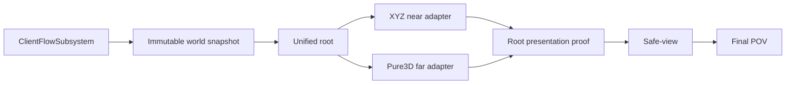

# 当前会话接力：Voxia 阶段 1 已完成，审查硬化待续

> 当前产品总纲：[`Voxia 客户端网络无关功能分阶段收口`](2026-07-14-voxia-client-offline-mock-closure-design.md)。
> 阶段 1 规格与结果已归档：[`PRD`](../../20-archive/client/2026-07-15-voxia-phase1-world-rendering-lifecycle-prd.md) ·
> [`closeout`](../../20-archive/client/2026-07-15-voxia-phase1-world-lifecycle-closeout.md)。

## 2026-07-17 跨机器检查点

### 本次停点

- 用户要求在代码审查硬化尚未全部收口时立即记录、提交并推送，供另一台电脑继续。因此，
  `clients/Voxia` 的本次提交是**明确的 WIP checkpoint**，不是新的阶段 1 最终验收点。
- `6de74ec merge: complete phase one world lifecycle` 仍是上一轮完整阶段 1 实现基线；本次检查点
  在其上追加性能屏障、near-first 调度、far worker、canonical page 复用、分帧 residency 与
  scene publication 硬化。
- 客户端检查点提交：`5e9f6b1 checkpoint(voxia): preserve phase one hardening progress`。外层仓库提交记录本页及既有 PRD、计划、
  current-truth 与 closeout 文档。
- 阶段 2–6 继续冻结；Web / Bevy、服务端、wire 与 Online authority 不在本次改动范围内。

### 已实现且在审查前通过实跑的硬化

1. `performance_runtime_barrier` 在 Real-RHI 采样前等待 shader/asset compilation、DDC 与 rendering
   command quiescence；smoke harness 在性能门禁前强制执行。
2. far 构建在 near baseline/presentation 稳定前显式 defer，恢复时发出结构化事件；far 使用一条
   `TPri_Lowest`、512 KiB 栈的专用线程，并在大批 page 组装中协作式让权。
3. canonical batch 跨 generation 复用，按 source/required/dirty 集合修剪；page residency 改为
   每 tick 最多 1024 页的显式事务，CLI 暴露游标、剩余量与最大 tick 耗时。
4. far scene 的注册粒度从 12000 quad 收紧到 1024 quad；成功 publish 后的大 build result 在 far
   worker 上释放，避免正常成功路径集中在 GameThread 析构。
5. 最近一次已完成验证（发生在下述“审查后未验证补丁”之前）：Development build 成功、
   `Automation RunTests Voxia` 为 `68/68`；1280×720 Real-RHI 全路线和 1600×900 默认 GC 30 分钟
   soak 均通过，Null-RHI 全路线通过。

| 证据 | 产物 / 关键结果 |
|---|---|
| 全量 automation | `.demo/observe/voxia_phase1_final3_automation_2026-07-16T02-32-36/`，68/68 |
| 1280×720 Real-RHI | `.demo/observe/voxia_phase1_2026-07-15T18-33-26-725Z_real_rhi_1280x720/`，25 routes；GT p95 4.212/4.296ms，`>16.67ms=0/0` |
| 1600×900 Real-RHI soak | `.demo/observe/voxia_phase1_2026-07-15T18-46-09-481Z_real_rhi_1600x900/`，30 分钟；73 route completion、48 资源样本、无单调增长；第二窗口 GT max 11.843ms；第一窗口有一次 25.575ms 离群帧 |
| Null-RHI | `.demo/observe/voxia_phase1_2026-07-15T19-30-34-803Z_null_rhi_1280x720/`，pass |

> 上表是本地 `.demo/observe/` 证据路径，不提交到 Git。旧 closeout 中较早的 96 routes / 93
> samples 数字仍是历史验收记录；继续工作时应先以本检查点列出的最新运行作为性能调查入口，
> 最终收口后再统一 current-truth 与 closeout 的“最终证据”表。

### 审查后已写入并完成最小验证的补丁

- reusable canonical batch 只有在当前 generation 的 `ResidentPages` lease 同时背书时才可复用；
  取消/失败 generation 遗留候选页会强制重新经过 provider。新增“provider 完成后取消，下一代
  重试必须重新 provider resolve 全部未提交页”的回归用例。
- batch 修剪改用 incremental plan 的 `RequiredPageIds` set，消除逐页 `TArray::Contains` 的 O(N²)。
- budgeted residency transaction 增加有序 page-id 指纹，拒绝“长度相同但 ID/顺序已变”的续批；
  新增失败后 lease 回滚测试。
- far DynamicMesh shard 新增按 quad 边界切分单个 oversized surface 的硬上限实现与 1024+17 quad
  回归用例，避免“只在 surface 之间切分”导致实际 shard 越过 1024。
- 上述四项已在本检查点完成 Development 增量编译，并分别通过
  `Voxia.Gameplay.WorldGenVoxelShellBuilder`、`Voxia.Gameplay.CanonicalVoxelShellSceneBuilder`、
  `Voxia.Voxel.CanonicalPageProvider` 三项定向 automation，三项均为 `Result={Success}`。
- 尚未对当前补丁重跑全量 68 项、Real-RHI 或 30 分钟 soak；接手者仍须把当前提交当成 WIP，
  不能引用前一轮 68/68 证明新补丁已完成最终验收。

### 下一台电脑的收敛顺序

1. 拉取外层仓库与 `clients/Voxia` 独立仓库，确认两个 `master...origin/master` 均为 `0 0`，并先读
   本节与 `AGENTS.md`。
2. 可先用 no-op build 和三项定向测试复核跨机环境；本机检查点已通过 Development build 及
   `Voxia.Gameplay.WorldGenVoxelShellBuilder`、`Voxia.Gameplay.CanonicalVoxelShellSceneBuilder`、
   `Voxia.Voxel.CanonicalPageProvider`。如跨机失败，按根因修复，不回退 residency-backed contract。
3. 完成审查尚未实现的最后一项：stale plan、residency cancel/fail、build cancel/fail、publish fail 与
   EndPlay 的大纯数据都走 far worker 后台释放；成功/失败分支均须保留已提交 reusable batch/cache。
4. 清理本轮新增的英文参数注解，并把 `VoxiaUnifiedVoxelWorldActor.cpp` 中“后台四线程”旧注释改为
   “单条最低优先级专用线程”。
5. 重跑 Development build、全量 `Voxia` automation、连续两次 Real-RHI performance-only、
   1280×720 全路线、1600×900 默认 GC 30 分钟 soak 和 Null-RHI；将新证据统一回写 closeout、
   current-truth、plan 与本 handoff。
6. 只有全部新验证通过后，才勾选计划 Task 7 Step 3–5，并可见启动正式组合根交给用户手动确认。

## 当前状态

- **阶段 1“世界渲染与场景生命周期”已实施并通过自动化、CLI/日志和 Real-RHI 门禁。**
- 独立 Voxia 仓库：上一轮完整阶段 1 基线为 `6de74ec`；本次跨机器 WIP checkpoint 为
  `5e9f6b1 checkpoint(voxia): preserve phase one hardening progress`。
- 最终实现提交：`271e612 feat(voxia): complete phase one world lifecycle`。
- 外层仓库只收口 PRD/current-truth/known-gaps/closeout/plan/handoff 文档；不修改 `apps/**`、wire、
  Web 或 Bevy。
- 阶段 2–6 继续冻结。自动化完成后的最后动作是以可见窗口启动同一正式组合根，交给用户手动
  确认；不得在本接力中自行展开阶段 2。

## 用户可见能力

1. 启动后自动创建一个只读 Mock session，并只生成一个 `AVoxiaUnifiedVoxelWorldActor` 正式根。
2. 首次加载期间阻断游戏输入；near/far/snapshot/ownership/fence 一致后才进入 playable。
3. 玩家可沿正负 X/Y/Z、斜向和多 tile 连续移动；高空 near 零几何时 far 仍保留世界覆盖。
4. coverage 未提交时保持 last-safe view；超过阈值进入恢复加载，可自动恢复、主动 retry 或返回菜单。
5. 菜单只提供 New Game / Exit；新游戏结束旧 session，创建新 snapshot 与根。
6. 阶段 2 编辑 affordance 隐藏；CLI/测试误触返回 `feature_not_available_phase2`。

## 关键实现边界



- near/far 都绑定 `root_world_snapshot`；各自维护派生 cache、worker 与原子提交，不共享可变隐式状态。
- near 固定 `27 tiles=9261 chunks`；单轴换窗 entered/exited=`3087`、retained=`6174`。
- near active 绘制按 XYZ tile × material family 合批；far 使用增量 page/artifact/stable patch 与
  render shard。后台构建和 GameThread creation/registration/fence/visibility/retirement 分阶段错峰。
- opaque/translucent/emissive slot 贯穿 artifact、DynamicMesh、scene host 与预算指纹。默认 WorldGen
  内容主要是浅色 opaque terrain；不要把 runtime family contract 误写成美术内容已完成。
- `frame_perf` 同时报告 raw `frame_ms` 与 `game_thread_ms`；阶段 1 streaming 门禁只认后者，但 raw
  环境长帧必须保留。短门禁隔离周期性 pending-kill purge，soak 保留默认 GC。

## 最终证据

| 门禁 | 结果 | 产物 |
|---|---|---|
| Development build | success，exit 0 | UnrealBuildTool 最终运行 |
| `Automation RunTests Voxia` | `68/68` success，0 warning / failed / not-run | `.demo/observe/voxia_phase1_automation_2026-07-16T00-17-07/` |
| Null-RHI 全路线 | 25 routes，pass | `.demo/observe/voxia_phase1_2026-07-15T14-55-37-788Z_null_rhi_1280x720/` |
| 1280×720 Real-RHI 全路线 | 25 routes，pass | `.demo/observe/voxia_phase1_2026-07-15T15-30-59-504Z_real_rhi_1280x720/` |
| 1600×900 Real-RHI soak | 30 分钟、96 route completion、93 资源样本、无单调增长 | `.demo/observe/voxia_phase1_2026-07-15T15-44-42-482Z_real_rhi_1600x900/` |

GameThread p95：1280×720=`4.70/4.56ms`，1600×900=`4.46/4.60ms`；四段
`>16.67ms` 均为 0。长稳态第二段 raw frame max=`65.41ms`，对应 GameThread max=`13.66ms`，
记录为默认 GC/渲染环境长帧，不归因于 streaming CPU。

## 复现命令

```powershell
cd clients/Voxia
& 'D:\Epic Games\UE_5.8\Engine\Build\BatchFiles\Build.bat' VoxiaEditor Win64 Development `
  "-Project=$PWD\Voxia.uproject" -WaitMutex -NoUBA -MaxParallelActions=2

node scripts/run_phase1_world_lifecycle_smoke.js --real-rhi --res 1280x720
node scripts/run_phase1_world_lifecycle_smoke.js --real-rhi --performance-only --res 1600x900 --soak-minutes 30
```

全量 automation 使用绝对 `.uproject` 路径；相对 `./Voxia.uproject` 可能被 Unreal 按引擎目录解析并
在进入测试前失败。

## 后续边界

1. 当前只需保持可见程序运行，等待用户手动确认阶段 1 效果。
2. 若用户确认后启动阶段 2，应先从阶段 2 PRD 收敛挖/放、pending UI、confirmed overlay 与 HUD，
   不要顺带修改服务端。
3. Online 仍需独立主线完成 bootstrap、production H-gated pages、snapshot/delta、lease、重连与
   source revision；不得用本地 WorldGen 或 runtime snapshot 兜底。
4. `.demo/`、`Saved/` 与 observe 产物是本地证据，不提交、不清理用户其它工作树内容。
