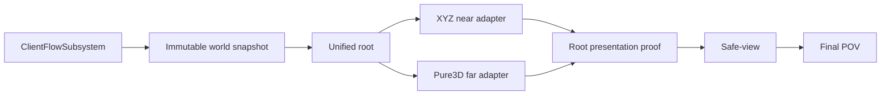

# 当前会话接力：Far LOD 材质与 near/far 精确流送身份均已修复，阶段 3 尚未启动

## 2026-07-24 same-window candidate refresh 与 exact far live identity closeout

- Voxia 工作树为 `.worktrees/voxia-phase2-macro-interaction`，分支
  `codex/voxia-phase2-macro-interaction`。最终修复提交
  `f02305e4dfa8af92bd83427236ad8857d1717a58` 已推送；本地 HEAD 与
  `origin/codex/voxia-phase2-macro-interaction` 已用 `git ls-remote` 核对一致，工作树 clean。
- CLI 继续追踪用户窗口后，锁定最后两个串联的流送身份缺口。第一，同一逻辑 near 窗口可在
  `Preparing` 期间由 candidate generation 6 重建为 7，旧 latch 只处理 `0→非零`，继续固定 generation
  6，后续逐 Tile 提交永远等不到已经被替代的 candidate。第二，far host 只要同 center 有任意 live
  scene，root/CLI 就可能把旧 transition count/fingerprint 误报为 settled；这会让 stale far receipt
  冒充当前请求已经可玩。
- `EvaluatePreparingCandidateRefresh()` 现在只在 `Preparing` 阶段把最新非零且不同的 candidate
  generation 刷入 latch；首次 candidate 不伪造进展，真正从旧非零 generation 换到新 generation
  才推进 watchdog progress，已经计划过的相同 generation 与 `CommittedToFinish` 均不重复刷新。
  逐 Tile ownership、staging/post fence、latest-wins target 和完整 XYZ 契约不变。
- `UVoxiaVoxelPresentationSceneHost::MatchesTransitionRequest()` 与
  `AVoxiaPure3DVoxelWorldActor::IsDesiredPresentationLive()` 把 far live 身份收紧为
  `center + transition_near_tile_count + transition_near_tile_fingerprint` 精确一致。root readiness、
  `scene_playable`、bootstrap/commit permit 和 stdio 的
  `until_pure3d_world_ready` / `until_pure3d_stream_settled` 都消费同一合同；JavaScript 端拒绝非
  safe-integer XYZ/count 与非十进制字符串 fingerprint，不再靠隐式类型转换给出 false green。
- RED/GREEN 覆盖同窗口旧→新 candidate、首次 candidate、重复 candidate、提交后禁止刷新，以及
  far center 相同但 count/fingerprint stale 的反例。严格审查补齐 CLI false-green 与 JS coercion
  两项缺口后，最终没有剩余 Critical/Important/Minor。
- fresh 验证：Development build 成功；完整 Voxia Automation `155/155` 无失败
  （153 Success + 2 项现有 expected warnings）；Node `84/84`；Phase 1/2 Null-RHI 均
  `passed=true`。产物为
  `.worktrees/voxia-phase2-macro-interaction/Saved/AutomationReport_Full_ReviewFinal_20260724/`、
  `.demo/observe/voxia_phase1_2026-07-24T04-59-51-166Z_null_rhi_1280x720/` 与
  `.demo/observe/voxia_phase2_2026-07-24T05-06-28-643Z_null_rhi_1280x720/`。
- 可见 D3D12 Development 唯一根通过 CLI 主动跨 X、第三轴并快速反向，实际触发同窗口 candidate
  `6→7`。最终 near/far center=`[12,0,-51]`、generation=`7/6`，
  live/staged/retiring/renderer=`27/0/0/27`；desired/in-flight/live count 均为 `27`，fingerprint
  均为 `"1679649817100860358"`；gap/seam-gap/orphan=`0/0/0`，far release=`22/22/0`。
  30 个 live surface witness 的 unresolved、exact→LOD、LOD→final 均为 0，near 与 far LOD0–4
  histogram 只含 material 1，且共同使用 `M_VoxelWorldAligned`。同机位 Lit 与关闭
  Lighting/Fog/PostProcessing 的截图、CLI 与 stderr 证据位于
  `.worktrees/voxia-phase2-macro-interaction/Saved/near_far_candidate_refresh_final_real_rhi_2026-07-24/`。
- 本轮没有引入第二材质、ring tint、shader 补色、表土增厚、硬编码等待、整窗 fallback 或第二生产根；
  完整 XYZ、服务端权威、逐 Tile ownership/fence 与阶段 2 宏格交互均保持不变。阶段 3 仍未启动。

## 2026-07-24 completed-successor active-near liveness closeout

- Voxia 工作树仍为 `.worktrees/voxia-phase2-macro-interaction`，分支
  `codex/voxia-phase2-macro-interaction`。本轮根修复与文档提交为
  `882831fdae50a14814637e09303002bbe5383fde`；本地与
  `origin/codex/voxia-phase2-macro-interaction` 已用 `git ls-remote` 核对一致，工作树 clean。
- 用户当前窗口“走到边缘仍不加载近景”经 stdio/CLI 定位为独立活性回归，不是材质、加载距离、
  authority coverage 缺失或 transition boundary miss。现场 active near center=`[8,0,-53]`、
  9261 chunks 完整，后继 `[8,0,-54]` 已 `ready_to_activate=true`，但 active presentation batch
  仍停在旧 center `[8,0,-52]`；root 卡在 `near_background_progress` /
  `near_active_batch_pending`，far dispatch 持续 deferred。
- 根因是 settled-source policy 同时拒绝 `load_in_flight` 与 `ready_to_activate`。前者表示后继
  source 仍在变化，必须 fail-closed；后者表示后继已完整停止变化但尚未改变 active coverage
  identity。旧判定反向阻塞当前 active-near candidate，far 又等待当前 near readiness，形成循环等待。
- `CanStartSettledPresentationCandidate()` 现仍拒绝 revision 0、仍在加载的后继，以及没有完整
  successor 时尚未发布 settled revision 的最后一个流式批次；仅允许
  `ready_to_activate=true && load_in_flight=false` 的完整后继不再阻塞当前窗口。调用点既有
  voxel/field/overlay/activation identity、mesh/transaction idle、逐 Tile ownership/fence 门禁均未放宽。
- RED `0/1` 精确锁定完整 successor 被旧策略拒绝；GREEN `1/1`。严格审查又补齐
  “load 与 ready flag 矛盾仍拒绝”和“revision 0 仍拒绝”两项防回归断言，最终没有剩余
  Critical/Important/Minor。
- fresh 验证：完整 327-action Development build 成功；Voxia Automation `151/151`、
  Node `83/83`；Phase 1 Null-RHI 25 routes 与 Phase 2 material 6 place/break、revision 1/2、
  X/Y/Z reload、最终 empty、Phase 3 拒绝合同均通过。产物为
  `.worktrees/voxia-phase2-macro-interaction/Saved/Logs/build_near_prefetch_liveness_final_20260724.stdout.log`、
  `.worktrees/voxia-phase2-macro-interaction/Saved/AutomationReport_NearPrefetchLivenessFinal_20260724/`、
  `.worktrees/voxia-phase2-macro-interaction/Saved/Logs/node_near_prefetch_liveness_final_20260724.log`、
  `.demo/observe/voxia_phase1_2026-07-24T01-19-51-514Z_null_rhi_1280x720/` 与
  `.demo/observe/voxia_phase2_2026-07-24T01-26-23-418Z_null_rhi_1280x720/`。
- 可见 D3D12 Development 唯一根由 CLI 从 `[11,0,-51]` 跨两个 Tile 到 `[13,0,-51]`，
  再精确反向跨一个 Tile 到 `[12,0,-51]`。单轴 transition 为
  entered/exited/retained=`3087/3087/6174`；最终 near/far generation=`3/3`，near
  presentation-ready=`9261`、retiring/stale=`0/0`，far queue/cancel/stale=`0/0/0` 且不再
  deferred，gap/overlap/seam-gap/orphan=`0/0/0/0`。stdio 证据位于
  `.worktrees/voxia-phase2-macro-interaction/Saved/near_prefetch_liveness_fix_real_rhi_2026-07-24/`。
- 本轮没有引入第二材质、ring tint、shader 补色、表土增厚、硬编码等待、第二生产根或整窗
  fallback；完整 XYZ、服务端权威、逐 Tile ownership/fence 与阶段 2 宏格交互保持不变。
  阶段 3 仍未启动。

## 2026-07-23 near/far transition boundary envelope closeout

- Voxia 工作树仍为 `.worktrees/voxia-phase2-macro-interaction`，分支
  `codex/voxia-phase2-macro-interaction`。精确 boundary miss 可观测面为 `d12f307`，核心修复为
  `509c91d365a8fca1c0773a5daaac9fe1c5c6001b`，最终文档收口为
  `802817d83753d6aa9b986df1d40294e012a11233`；本地与
  `origin/codex/voxia-phase2-macro-interaction` 已用 `git ls-remote` 核对一致，工作树 clean。
- 颜色修复后暴露的“走到边缘仍不加载近景”不是加载距离或构建耗时问题。confirmed revision
  改变后，玩家从旧中心 `[11,0,-51]` 快速跨多个 Tile 时，旧 near owner 仍可能持有 X=12；
  它的 +X seam 需要当前 source revision 的 far `[13,*,*]/NegX`。旧 far 请求只覆盖最终目标窗口
  与固定 slab，缺少这条边界，逐 Tile ownership 因
  `renderer_tile_ownership_far_boundary_missing` fail-closed，故画面一直保留旧 far。
- Unified Root 现在按 handoff generation 冻结真实 `RendererNearOwnedTiles`；source-neutral
  canonical builder 为“真实 live ∪ 最终 target”的完整 XYZ Tile 集合生成六面边界。center、
  transition count/fingerprint、coverage 与 source identity 共同进入 prepare、incremental plan、
  residency、worker build、hidden stage、root permit 与 live identity。相同 center 但包络变化会
  supersede 旧 hidden generation，并释放对应 residency/coverage；同一 handoff generation 的逐 Tile
  mutation 不会反复重启 far build。
- stdio/CLI 新增 requested/desired/in-flight/live transition count/fingerprint 与精确
  `last_far_boundary_miss`。fingerprint 作为十进制字符串输出，避免 JavaScript 把大于 `2^53`
  的 `uint64` 舍入。Phase 1 稳定根只接受一致的 cold bootstrap `0/"0"` 或生产
  `27/非零字符串`，并要求四个 fingerprint 完全相等、boundary miss 不存在。
- fresh 验证：Development build 成功；完整 Voxia Automation `151/151`、Node `83/83`；
  Phase 1 Null-RHI 25 条完整 XYZ 路线通过，`handoff_failed=0` 且 boundary miss true 为 0；
  Phase 2 Null-RHI 的 material 6 place/break、revision 1/2、X/Y/Z reload、最终 empty 与 Phase 3
  拒绝合同均通过。产物为
  `.worktrees/voxia-phase2-macro-interaction/Saved/AutomationReport_TransitionFinal_20260723/`、
  `.demo/observe/voxia_phase1_2026-07-23T16-48-33-789Z_null_rhi_1280x720/` 与
  `.demo/observe/voxia_phase2_2026-07-23T16-55-15-847Z_null_rhi_1280x720/`。
- 最新可见 D3D12 Development 唯一生产根仍保持运行。它从 `[11,0,-51]` 连续跨越多个 Tile，
  最终 near/far 对齐于 `[8,0,-52]`；live/staged/retiring/renderer=`27/0/0/27`，
  gap/overlap/seam-gap/orphan=`0/0/0/0`，requested/desired/in-flight/live fingerprint 均为
  `"9416127099811288665"`，`last_far_boundary_miss.present=false`。near 与 far LOD0–4
  histogram 只含 material 1，30 个 witness 的 unresolved、exact→LOD、LOD→final 均为 0。
  同机位 Lit/关闭 Lighting·Fog·PostProcessing/恢复 Lit 证据在
  `.worktrees/voxia-phase2-macro-interaction/Saved/near_far_transition_final_real_rhi_2026-07-23/`。
- 严格终审覆盖 identity 冻结、异步 stale gate、permit、整数边界、集合预算、失败清理、CLI JSON、
  逐 Tile ownership/fence 与阶段 2 回归；终审发现的 JS 精度缺口已先 RED 后修复，最终
  Critical/Important/Minor 均为 0。未引入第二套 far 材质、ring tint、shader 补色、表土增厚、
  固定等待或第二生产根；完整 XYZ、服务端权威和阶段 2 宏格交互保持不变。
- 阶段 3 的材质与 near/far transition 前置阻断均已关闭，但本次仍未开始阶段 3。Online
  authority/provider 也未开始，不得把 WorldGen/Mock 当在线 truth。

## 2026-07-23 Far LOD surface semantic + ownership binding closeout

- Voxia 工作树为 `.worktrees/voxia-phase2-macro-interaction`，分支
  `codex/voxia-phase2-macro-interaction`；本轮从 `284cefd` 继续，canonical surface 修复为
  `334ff7799aa97561749caa612285c00302e96cd5`，最终绑定 RED/修复为 `c09a9d0` / `1158d6b`，
  文档收口为 `88f4efa`。这是本节当时的提交状态；当前远端与最终工作树状态以上一节为准。
- 这是两个串联根因：
  1. WorldGen canonical page 的中心点降采样从 LOD1 起可能漏掉默认 4m 表层，使外露面
     material 1 走样为 material 2；
  2. 第一层修复后，SceneHost 又把动态 `VoxiaFarQualityMaterial` 直接作为 ownership MID
     父级。UE 创建出非空但 `Parent=None` 的实例，far component 因而回退默认灰。
- 第一层已经在 source-neutral canonical reducer 根修复：粗 occupancy 保持中心降采样，外露面
  material 只从精确 source surface coverage 归约。VXP5 page 携带 cell semantic、direct-face
  override 与受限 regional fallback；schema 为 `voxia_voxel_source_pages_v5` /
  `dense_material_u16_be_surface_coverage_v4` / `voxia_surface_material_coverage_v4`。
  VXP2/VXP3/VXP4 与旧 manifest/payload/material schema 显式拒绝；page SHA、artifact
  fingerprint、surface dependency、stage/cache 与 near/far boundary fingerprint 都绑定新语义。
- 第二层在 `UVoxiaVoxelPresentationSceneHost` 的材质组合边界根修复：动态输入先展开到合法
  `UMaterial/MIC` 父级，从该父级创建 ownership MID，复制质量参数后再写 ownership atlas
  参数。非法父链以 `renderer_ownership_material_parent_invalid` fail-closed；
  `shared_materials_installed` 只有三个实例全部存在且父链有效时才可为 true。
- CLI 可观测面现在同时覆盖内容与最终绑定：
  `voxel_surface_material_state` 输出 owner/ring/LOD/六向 histogram 和
  `exact source → canonical LOD → final artifact` witness；
  `voxel_world_root_state.renderer_ownership` 输出
  `shared_material_parent_valid_instances`、`shared_material_parent_valid` 与
  `shared_materials_installed`。真实 object dump 还能核对 ownership MID 的 `Parent` 与 far
  component slot 0。
- 最终绑定测试先红后绿：
  `Saved/AutomationReport_FarOwnershipParent_RED_20260723/` 为 `0/1`，精确复现 invalid parent
  warning、`Parent=None` 与质量参数丢失；
  `Saved/AutomationReport_FarOwnershipParent_GREEN_20260723/` 为 `1/1`，warning 为 0。
- fresh 最终验证：
  - Development build：success，exit 0；
  - 完整 `Automation RunTests Voxia`：`153/153` 无失败（151 Success + 2 expected warnings）；
  - Node：`82/82` pass，0 fail；
  - Phase 1 Null-RHI：`passed=true`，25 routes，clean exit，far release `11/11/0`；
  - Phase 2 Null-RHI：`passed=true`，place/break、X/Y/Z reload、最终 empty，Phase 3 拒绝合同通过；
  - 可见 D3D12：1600×900 唯一生产根，同机位 Lit/关闭 Lighting/Fog/PostProcessing，clean exit 0。
- 最终 Real-RHI 根 near geometry/far/Tile handoff 均 ready，中心为 `[11,0,-51]`，
  gap/overlap/seam-gap/orphan=`0/0/0/0`，far component `771/771` 可见。三个共享 MID 父链
  `3/3` 有效并 installed；quality MID、opaque ownership MID 的父级均为
  `M_VoxelWorldAligned`，far component slot 0 真绑定该 ownership MID，invalid parent warning
  为 0。
- 初始 live receipt 的 near histogram 为 material 1 `15933`，far LOD0–4 分别为 material 1
  `121343/82135/241505/129692/117527`；30 个 witness 的 unresolved/exact→LOD/LOD→final
  mismatch=`0/0/0`。关闭 Lighting/Fog/PostProcessing 后，near/far ROI 中位 RGB 分别为
  `[179,157,128]` 与 `[178,156,128]`，最大通道差 1，两侧灰色像素比例均为 0。
- 最终证据：
  - build：`.worktrees/voxia-phase2-macro-interaction/Saved/Logs/build_far_parent_closeout_20260723.stdout.log`；
  - Automation：`.worktrees/voxia-phase2-macro-interaction/Saved/AutomationReport_FarParentCloseout_20260723/`；
  - Node：`.worktrees/voxia-phase2-macro-interaction/Saved/Logs/node_far_parent_closeout_20260723.stdout.log`；
  - Phase 1/2：`.demo/observe/voxia_phase1_2026-07-23T14-12-48-405Z_null_rhi_1280x720/`、
    `.demo/observe/voxia_phase2_2026-07-23T14-19-39-157Z_null_rhi_1280x720/`；
  - Real-RHI：`.worktrees/voxia-phase2-macro-interaction/Saved/near_far_parent_chain_nearfar_2026-07-23/`。
- 独立终审覆盖 `334ff779..1158d6b`，确认 UE5.8 父级规则、参数覆盖顺序、三个材质族、
  fail-closed、UObject 生命周期、真实 SceneHost 反例及架构边界，Critical/Important/Minor 均为 0。
  没有新增第二套 far 材质、ring tint、shader 补色、增厚 `SoilDepthMacro`、等待型生产修复或
  第二组合根；完整 XYZ、服务端权威、逐 Tile ownership/fence 与阶段 2 宏格交互均保持不变。
- 正式决策与完整矩阵见
  [`Far LOD 外露表面材质语义修复`](../voxel-far-field/2026-07-23-far-lod-surface-material-semantic-repair.md)；
  客户端实现/证据见
  `.worktrees/voxia-phase2-macro-interaction/docs/engineering-notes/2026-07-23-far-lod-surface-material-aliasing.md`。
- 本项不再阻断阶段 3 Prefab，但本次没有启动阶段 3。后续仍需独立实施阶段 3，或继续 Online
  authority/provider、服务端 bootstrap/delta/续租/重连；不得把开发 WorldGen/Mock 当在线 truth。

## 2026-07-23 near/far Tile 交接、加载活性与渲染合同 closeout（材质最终结论已被上节修正）

- 用户可见问题包括：远→近阶段同一区域双显、进入/离开接缝缺竖墙、加载不流畅后卡死，以及 near/far
  颜色不一致。2026-07-22 的重开设计正确，但随后实跑又暴露 target supersede 活性、单 future near
  mesh 吞吐、重复 chunk 调度、确定性失败热重试和 UE/canonical 环境光轴映射等独立根因。
- Voxia 工作树仍为 `.worktrees/voxia-phase2-macro-interaction`，分支
  `codex/voxia-phase2-macro-interaction`。唯一 `production_all_features` 根现已安装真实 Pure3D renderer
  sink，以实际 Tile registry、canonical chunk atlas、seam component 与 staging/post fence 逐 Tile 交接；
  normal 单轴移动保留 18 Tile、逐个进入/退出 9 Tile，整窗只用于显式 teleport/预算 fallback。
- Voxia 本轮收口提交为 `92764d2`（实现、测试与门禁）和 `1cf7eac`（README、计划与工程笔记）；客户端
  工作树当前 clean，未合并、未推送。
- 根级 `FVoxiaNearFarHandoffTargetLatch` 在首次可见 mutation 后固定共同 near/far target，只保留一个
  latest-wins 后继目标；near/far/source 实际 fingerprint 维护 60 秒 watchdog。稳定 root ready 要求 latch
  idle、27 live/renderer、0 staged/retiring/ticket/queue，以及 gap/overlap/seam/orphan/error 全零。
- active-near 改为 4-worker/16-cap 最低优先级有界队列、serial 有序发布、pending chunk 去重与
  generation/version/revision/fingerprint stale gate；确定性失败锁存 voxel/field/activation，同一输入不再
  热重试；worker generation/chunk 身份异常会转换为同 serial 的显式失败，不能留下 ordered publish serial
  空洞。WorldGen activation 另发布最终 settled revision，renderer 不读取 loader 私有状态。
- near/far opaque 共同使用 `M_VoxelWorldAligned`、稳定世界格 UV0 与共享 canonical AO/sky。near 已修复
  UE Z-up 到 canonical Y-up 的轴/角点映射；`voxel_material_parity` 校验 asset、base color、ambient、
  range 与 invalid vertex。
- fresh 证据：Development build；Voxia Automation `148/148`；Node `82/82`；Phase 1 Null-RHI
  23 routes / 21 generations 全绿，clean exit、far release pending=0。最终 Tile
  `27/0/0/27`、gap/overlap/seam/orphan=0、near queue failure=0；Real-RHI ROI 的交接帧与稳定帧
  channel delta p95/p99 都为 `1/2`。主要产物：
  `.demo/observe/voxia_phase1_2026-07-23T01-44-43-737Z_null_rhi_1280x720/` 与
  `.worktrees/voxia-phase2-macro-interaction/.demo/observe/near_far_real_rhi_axis_fixed.log`。
- 服务端 authority、wire、Online provider、普通宏格 place/break 与 prefab 边界均未改变。当时“下一步是
  阶段 3”的结论已被本文件首节的新颜色证据取代；先关闭 Far LOD 材质语义门禁。不得新增普通微格编辑
  或第二生产根。

## 2026-07-21 阶段 2 实现与 closeout

- 用户确认普通世界地形支持完整宏格挖放；微格只作为 prefab footprint、材质、命中、碰撞和渲染的
  最小单位，不存在普通微格编辑。普通 SolidMacro 占满整个宏格并与任意 prefab 微格互斥；多个 prefab
  可以在同一宏格范围内占据互不重叠的任意微格。
- 用户批准“实体 mirror → MacroSpace confirmed projection → derived index → presentation”的方案 A，并确认
  当前先在客户端用 Mock authority 完成本地数据/渲染闭环，未来 Online 只替换 authority adapter；生产世界
  truth 始终由服务端拥有。
- 已完成三路并行只读专家审计：Voxia 客户端数据/渲染、Elixir/OTP 服务端权威/协议、跨端领域模型/一致性。
  结论是方案 A 可行，但现有单 owner/`AnyOwner()`、resident scan、逐宏格 prefab 删除、Gate 领域越界、
  服务端 participant 假终局和 identity best-effort 均不能直接延伸为正式实现。
- 正式设计：
  [`Voxia 阶段 2/3：世界占用与 Prefab 运行时设计`](2026-07-21-voxia-phase2-phase3-world-occupancy-and-prefab-runtime-design.md)。
- 独立计划：
  [`阶段 2 普通宏格交互实施计划`](2026-07-21-voxia-phase2-macro-voxel-interaction-implementation-plan.md)；
  [`阶段 3 Prefab 世界运行时实施计划`](2026-07-21-voxia-phase3-prefab-world-runtime-implementation-plan.md)。
- 阶段 2 已在 `.worktrees/voxia-phase2-macro-interaction` / `codex/voxia-phase2-macro-interaction`
  完成，最终实现固定 SHA 为 `15ab99476930f485460552914cb1744040dd2f72`。普通宏格 place/break、
  deterministic Mock authority、唯一 confirmed aggregate、near/far presentation、HUD 与只读 CLI 均已接入
  唯一 `production_all_features` 根；微格编辑继续稳定拒绝，prefab 仍为 Phase 3 gate。
- fresh 证据：Development build success；UE Automation `141/141`；Node `75/75`；Null-RHI runner 完成
  material 6 place、X/Y/Z 各 80 tiles unload/reload、break、projection parity 与返回菜单。产物位于
  `.demo/observe/voxia_phase2_2026-07-21T19-04-35-074Z_null_rhi_1280x720/`。
- 1920×1080 D3D12 Real-RHI 30 分钟长稳也已通过：49 个完成样本、105 次 far commit、release pending
  每代归零、artifact cache 有界、0 fatal/authority/GPU error，最终 break/parity/menu 闭合。产物位于
  `.demo/observe/voxia_phase2_2026-07-21T19-06-27-954Z_visible_rhi_1920x1080/`。
- 新固定 SHA 经两位独立专家最终复审，`Critical/Important/Minor=0/0/0`。审计期间发现的唯一 Minor
  （ledger 淘汰后的 lifecycle 误报完整）已用保守重建 `lifecycle_truncated=true` 和 4096 条交叉容量测试根因修复。
- 根工作树原有未跟踪 `.superpowers/` 保留不动；本轮没有修改 `apps/*`、wire codec 或归档 Web/Bevy。
- 两份旧协议参考中的 `0x66=BlueprintCreate` 已按 codec/golden 真值修正为
  `0x66=VoxelSurfaceElementIntent`；未来 prefab definition 发布必须另分配 append-only opcode/versioned envelope。

下一步：在用户批准后执行阶段 3 Prefab 世界运行时计划。阶段 3 必须复用阶段 2 的唯一 aggregate、adapter、
revision、conflict 与 presentation 骨架；不得新增普通微格编辑或第二生产根。Online authority 仍是后续独立阶段。

## 2026-07-21 远景渲染专题治理收口

- 客户端/外层分支均为 `codex/voxia-render-governance`；全程只使用 Voxia 本地 WorldGen，未启动、
  修改或验证服务端，协议、功能行为与唯一 `production_all_features` 根未改变。
- RG0–RG5 已按顺序提交；RG6 客户端收口提交为
  `a960f1e feat(rendering): close far render governance`。Voxia 是外层忽略的独立 Git 仓库，不存在
  submodule pointer。两个特性分支均已推送，Voxia PR 为
  [`#1`](https://github.com/dyzdyz010/Voxia/pull/1)，外层文档 PR 为
  [`#10`](https://github.com/dyzdyz010/ex_mmo_cluster/pull/10)。
- 发布结果：Voxia PR #1 已以 merge commit `e0d7c94` 合入客户端默认 `master`；外层文档 PR #10
  已以 merge commit `3cdcf3f` 合入主仓默认 `master`。RG0–RG6 的阶段提交历史均保留。
- 最终实现：far generation 原子可见切换、source UV、coverage-resolved AO/sky、唯一环境光与单主投影、
  natural material、`performance_natural|quality_natural` 冻结策略、terrain 双阈值时序诊断。
- fresh 验证：Development build；UE Automation `92/92`；Node `37/37`；Null-RHI 短烟测；
  1920×1080 Real-RHI 完整生命周期与 RG6 七路线；生命周期/视觉各 30 分钟长稳。
- 2026-07-21 可见人工验收从本次 Voxia 工作树启动 1600×900、UDS、WorldGen 与唯一
  `production_all_features` 根；日志确认 `ready/session_ready/centers_aligned=true`。用户确认
  “效果不错”，并明确批准合入生产主线。
- 关键证据：
  - `.demo/observe/voxia_phase1_2026-07-20T20-35-39-702Z_real_rhi_1920x1080/`
  - `.demo/observe/voxia_phase1_2026-07-20T20-52-19-830Z_real_rhi_1920x1080/`
  - `.demo/observe/voxia_far_render_2026-07-20T20-47-48-957Z/`
  - `.demo/observe/voxia_far_render_2026-07-20T21-56-29-664Z/`
- CI 事实：Voxia 仓库当前未配置远端 workflow/status check；外层文档 PR 自动 CI run `214`
  最终为 7/11 通过、4/11 失败。该矩阵不属于客户端渲染验收，本轮依照用户边界不下钻、不修改或
  验证服务端。两个 PR 均已按用户批准合入各自默认 `master`；最终发布状态以 PR 页面与远端
  `master` SHA 为准。

## 2026-07-19 R6 Pawn controller 与文档收口完成

- client 与 outer 继续使用 `codex/voxia-r0-r6-governance` 分支。R6 client 提交为
  `6d6d22f refactor(governance): extract pawn controllers` 与
  `f1c0b4d refactor(governance): pass pawn controller dependencies`。
- `FVoxiaPlayerSessionController` 独占 bootstrap、完整 XYZ subscription、prepare/prefetch、lease 与
  readiness clock；续租每 Tick 自维护，不依赖移动输入或 `bWasMoving`。
- `FVoxiaBuildInteractionController` 独占 hotbar、raycast/edit gate、focus/remote action 和 overlay；
  Interest/Flow 由 Pawn 显式传入，静态门禁禁止 controller 内反向 service locator。
- `FVoxiaPawnDebugScenarioDriver` 独占 AutoEdit/Demo/Glow/Stress/EditShot/截图/FPS 状态，并复用
  Pawn 真实点击 façade。`AVoxiaPawn` 只保留输入、移动呈现、相机、视觉调参与顺序组合。
- wire codec/opcode/body、CLI token/envelope/schema、observe/error 语义、用户键位、可见效果、GameMode 和
  `production_all_features` 唯一根均未改。
- Gameplay README 现只保留当前完整 XYZ/唯一根/controller 口径；旧 XZ/VHI/SVO/raymarch 与
  迁移前性能证据已迁入
  `docs/20-archive/client/2026-07-19-voxia-gameplay-legacy-renderer-and-performance-evidence.md`。
- 最终验证：Development build 成功；Automation `84/84 Success`；唯一生产根 Null-RHI
  25/25 routes；production 交互 CLI 覆盖 land/look/raycast/select/focus/remote/place/break；legacy probe
  显式报告 `production_root=false`。
- 最终证据：
  - `.demo/observe/voxia_governance_r6_explicit_dependency_green_final_20260719/`
  - `.demo/observe/voxia_governance_r6_full_final_20260719/`
  - `.demo/observe/voxia_phase1_2026-07-18T18-30-20-151Z_null_rhi_1280x720/`
  - `.demo/observe/voxia_governance_r6_interaction_cli_final_20260719.log`
  - `.demo/observe/voxia_governance_r6_legacy_probe_cli_final_20260719.log`

R0～R6 批准范围内已无未完成项。后续若要改变协议、功能行为、可见效果或唯一生产根，
必须作为新设计与新批准处理，不得借本治理主线扩展。


> 当前产品总纲：[`Voxia 客户端网络无关功能分阶段收口`](2026-07-14-voxia-client-offline-mock-closure-design.md)。
> 阶段 1 规格与结果已归档：[`PRD`](../../20-archive/client/2026-07-15-voxia-phase1-world-rendering-lifecycle-prd.md) ·
> [`closeout`](../../20-archive/client/2026-07-15-voxia-phase1-world-lifecycle-closeout.md)。

## 2026-07-18 权威窗口后台流送与 3-chunk 超期恢复

### 远端与审查状态

- 外层 `master` 已推送；审查前状态基线为 `origin/master@9134368c`，本轮审查设计与状态更新
  位于本节所在提交。
- Voxia 候选分支已推送到
  `origin/codex/voxia-phase1-hardening-closeout@a37dfeb`，尚未合并客户端 `master`。
- 第一轮只读审查已经完成，结论与分阶段治理边界见
  [`Voxia 工业级代码审查与无行为变化治理设计`](2026-07-18-voxia-industrial-code-review-and-remediation-design.md)。
  已确认的高优先级问题是 production near/legacy far 共享 Actor、Transport 跨领域汇合和 CLI
  路由缺少稳定目录合同；设计批准前不改代码。后续不使用历史阶段 1 通过记录替代修复后的 fresh 验证。

### 当前代码点

- 独立 Voxia worktree/branch：`.worktrees/voxia-phase1-hardening-closeout` /
  `codex/voxia-phase1-hardening-closeout`。
- 本轮客户端提交：
  `454267b feat(streaming): define committed authority coverage bounds`、
  `b9f329b feat(streaming): commit authority coverage with presentation proof`、
  `68e4689 fix(streaming): gate safe-view recovery by coverage depth`、
  `881980c fix(streaming): separate playable flow from coverage recovery`、
  `ee99655 fix(streaming): keep root playable across authority handoff`、
  `f2898c9 test(streaming): cover nonblocking authority handoff`、
  `a37dfeb docs(streaming): document authority coverage handoff`。
- 外层设计/计划基线：`0dc86335` 与 `10b69b8a`；本节及 current-truth 记录实际结果。

### 已实现行为

- 首次 presentation proof 后 session readiness 单调；near/far 正常 desired/live 分离不再让唯一根回退
  InitialLoading。
- 玩家进入新 tile 时立即跟踪 staging target，旧 committed `3×3×3` XYZ coverage 与输入继续有效；
  普通 `streaming` overlay 隐藏。
- presentation proof 原子提交 committed bounds；safe-view 以 canonical player chunk 对旧 bounds 计算
  XYZ/L∞ depth。depth `1..2` 为非阻塞 hold，depth `>=3` 且 pending 才全屏恢复。
- 确定性 snapshot/revision/H/source/provider/ownership/fence/proof 错误仍立即 hard fail；没有本地 fallback。
- root/flow JSON 与 observe 暴露 committed/staging、bounds、玩家 chunk、分轴深度、L∞ 深度、固定阈值
  与 `voxel_authority_stream_*` / `voxel_authority_safe_view_held` 事件。

### 新鲜验证证据

| 门禁 | 结果 | 产物 |
|---|---|---|
| Development build | pass，UBT exit 0 | 2026-07-18 fresh build |
| 全量 automation | `70/70` Success，0 non-success / Voxia automation error / warning | `.demo/observe/voxia_authority_streaming_final_20260718_122257/` |
| Null-RHI 全路线 | 25 routes pass；相邻 `+X` staging=true/recovery=false；clean exit；release=`11/11/0` | `.demo/observe/voxia_phase1_2026-07-18T04-24-07-621Z_null_rhi_1280x720/` |
| 1280×720 Real-RHI | 25 条功能路线完成；相邻 `+X` staging=true/recovery=false；0 `LogVoxia: Error` | `.demo/observe/voxia_phase1_2026-07-18T04-26-34-025Z_real_rhi_1280x720/` |
| Real-RHI 严格性能 | 未闭合：第二窗 GT p95=`1.480ms`、max=`52.351ms`、`>16.67ms=2` | 同上 |

Real-RHI runner 的最终 `passed=false` 仅来自既有严格帧预算断言；功能路线、相邻换窗观察与性能窗口
均保留在同一 index 中，必须继续分层解读。下一步发布硬化仍是在没有外部 D3D12/DXGI stall 的环境
复跑连续性能门禁；不得过滤尖峰或回退本次权威窗口语义。

## 2026-07-17 最终审查与复验

### 当前代码点

- 独立 Voxia worktree/branch：`.worktrees/voxia-phase1-hardening-closeout` /
  `codex/voxia-phase1-hardening-closeout`，基于 `5e9f6b1`。
- 候选由两个提交组成：
  `500248e fix(streaming): harden far pure-data ownership` 与
  `97d5002 fix(streaming): close far release ownership gaps`。
- 最终只读审查已经三轮收口；Critical / Important / Minor 均为 0。主仓与
  `clients/Voxia` master 均未合并或推送，worktree 当前干净。

### 实现边界

- reusable canonical batch 在 stale plan、residency cancel/fail、build cancel/fail/stale 路径均
  归还 actor owner；不同 owner 冲突显式拒绝，不允许旧 generation 覆盖新 owner。
- launch/build result、retired coverage、失败/替换的 artifact cache 和 EndPlay 遗留纯数据统一进入
  单条 `TPri_Lowest` far worker。EndPlay 等待在途工作、drain release queue 后才销毁 UE 线程池。
- observe 新增 `voxel_pure3d_far_release_drained` / `voxel_pure3d_far_release_drain_failed` 与
  `world_snapshot_id`。runner 只接受本次 quit 后、输入序号更新、同一 snapshot、stdout/stderr
  close、进程退出码 0 的成功终态，并显式拒绝失败终态。
- release automation 用阻塞动作占住唯一 worker，将两项析构排在其后；`DrainStarted/DrainReturned`
  证明 drain 真正进入且不能在 worker 放行前伪完成。

### 最终证据矩阵

| 门禁 | 结果 | 产物 |
|---|---|---|
| Development build | pass，UE 5.8 UBT exit 0 | worktree `97d5002` 对应二进制 |
| `Automation RunTests Voxia` | `69/69` pass，0 failed | `.demo/observe/voxia_phase1_review_fixes_20260718_0052/automation_all_voxia_final.log` |
| Null-RHI 全路线 | 25/25 pass，clean exit，release=`11/11/0` | `.demo/observe/voxia_phase1_2026-07-17T17-58-12-947Z_null_rhi_1280x720/` |
| 1600×900 Real-RHI soak | 30 分钟，120 routes、95 资源样本，`growing_keys=[]`；queued/completed=`14→390`、pending=`0`；最终 `391/391/0` | `.demo/observe/voxia_phase1_2026-07-17T17-20-55-320Z_real_rhi_1600x900/` |
| 1280×720 performance-only | 一红一绿；失败轮回程 GT max=`424.536ms`、`>16.67ms=3`；通过轮 GT `>16.67ms=0/0` | `.demo/observe/voxia_phase1_2026-07-17T17-17-41-539Z_real_rhi_1280x720/`、`.demo/observe/voxia_phase1_2026-07-17T17-19-10-704Z_real_rhi_1280x720/` |
| 1280×720 Real-RHI 全路线 | 24 条功能路线后首个性能窗出现一个 `16.98ms` GT 帧，严格失败 | `.demo/observe/voxia_phase1_2026-07-17T17-10-09-719Z_real_rhi_1280x720/` |

长稳态中 95 个 release 样本的 `pending` 最大值为 0；未命中 owner conflict、GameThread fallback、
drain failure 或 `LogVoxia: Error`。两段 soak GT p95=`1.490/1.503ms`、max=`5.119/6.012ms`、
`>16.67ms=0/0`。

### 仍未关闭的门禁

- 当前不能勾选 Task 7 Step 3–5，也不启动可见人工验收。最新两轮 strict performance-only
  没有连续通过；完整 Real-RHI 复验也有一个轻微越线窗。
- 失败 performance-only 仍复现 RHI 初始化约 58–60 秒后的周期性长帧。先前定向 hitch 树将
  `423.086ms` 归因于 D3D12 `STAT_D3DUpdateVideoMemoryStats` 内 DXGI
  `QueryVideoMemoryInfo`；本轮一红一绿说明同一 raw 400ms 尖峰会在不同运行中落到 GT 或
  render/RHI。runner 不做豁免。
- 下一步应在没有该外部 D3D12 stall 的环境直接跑连续两次 performance-only；两次都通过后，
  再 fresh build、focused/full automation、short Null/Real 路线并勾选 Task 7 Step 3–5，最后启动
  可见 `production_all_features` 交给用户手动确认。

## 2026-07-17 本机硬化候选初轮复验（由上节最终复验取代）

### 本次实施结果

- 独立 Voxia worktree/branch：`.worktrees/voxia-phase1-hardening-closeout` /
  `codex/voxia-phase1-hardening-closeout`。候选提交：
  `500248e fix(streaming): harden far pure-data ownership`，基于 WIP checkpoint `5e9f6b1`。
- reusable canonical batch 在 stale plan、residency cancel/fail、build cancel/fail/stale 路径均归还
  actor owner；owner 已持有不同 batch 时拒绝覆盖，并发出
  `voxel_pure3d_reusable_batch_restore_rejected`。
- launch plan、build result、publish success/fail 与 EndPlay 遗留的
  residency/artifact/cache/coverage/provider/snapshot 大纯数据统一在单条
  `TPri_Lowest` far worker 释放。UE 5.8 `FQueuedThreadPool::Destroy()` 会 abandon 队列中
  未开始任务，因此 EndPlay 先条件式 drain，再销毁 worker。
- `pure3d_world_state.far_release` 与 observe 暴露 `queued/completed/pending`；smoke/soak 断言
  `completed <= queued`、`pending = queued - completed` 与 `pending <= 1`。英文参数注解与
  “后台四线程”旧注释已清理。

### 新鲜验证证据

| 门禁 | 结果 | 产物 |
|---|---|---|
| Development build | pass，exit 0 | UE 5.8 UBT，本机 AutoSDK MSVC 14.44 |
| `Automation RunTests Voxia` | `69/69` pass | `.demo/observe/voxia_phase1_hardening_closeout_20260717_2324/automation_all_voxia.log` |
| Null-RHI 全路线 | 25/25 pass | `.demo/observe/voxia_phase1_2026-07-17T15-49-41-681Z_null_rhi_1280x720/` |
| 1280×720 Real-RHI 全路线 | 25/25 pass；GT p95=`1.505/1.506ms`；max=`9.408/4.879ms`；`>16.67ms=0/0`；release=`6/6/0` | `.demo/observe/voxia_phase1_2026-07-17T15-52-34-671Z_real_rhi_1280x720/` |
| 1600×900 Real-RHI soak | 30 分钟；104 route completion；101 资源样本；无单调增长；release `8→208/8→208/0` | `.demo/observe/voxia_phase1_2026-07-17T15-59-31-501Z_real_rhi_1600x900/` |

上述全路线、soak 和 Null-RHI 均未命中 owner 冲突、GameThread 释放回退、release drain
失败或 `LogVoxia: Error`。

### 唯一剩余门禁与根因证据

- 两次独立 `--real-rhi --performance-only --res 1280x720` 都在 RHI 初始化约
  58–60 秒后出现 `422–425ms` GameThread/RHI 长帧，因此不符合“连续两次
  performance-only pass”。复现产物：
  `.demo/observe/voxia_phase1_2026-07-17T15-24-51-877Z_real_rhi_1280x720/` 与
  `.demo/observe/voxia_phase1_2026-07-17T15-29-47-230Z_real_rhi_1280x720/`。
- 定向 hitch 产物
  `.demo/observe/voxia_phase1_2026-07-17T15-36-15-707Z_real_rhi_1280x720/engine.log`
  在 Frame 6386 报告 RHIThread=`427.198ms`、
  `STAT_D3DUpdateVideoMemoryStats=423.086ms`，内部两次 DXGI `QueryVideoMemoryInfo`；同帧
  Voxia world tick 约 `1.4ms`，far build 尚未恢复，release=`4/4/0`。
- UE 5.8 本地引擎源码确认 D3D12 Development 在每个 `RHIEndFrame` 同步收集显存统计，
  没有可禁用或降频的 CVar。本机环境为 RTX 4080 SUPER / NVIDIA 591.86，并存
  向日葵虚拟显示/远控栈。不允许为了门禁自行停用用户远控服务，也不允许
  在 runner 中过滤该帧。

因此计划 Task 7 Step 3–5 保持未勾选，不把候选提交写成新的最终验收点，不启动
可见窗口。下次应在无该 DXGI 阻塞的 D3D12 环境直接重跑连续两次
performance-only；通过后再做最终 fresh build/focused suite/short route，勾选 Task 7 Step 3–5，
并启动可见 `production_all_features` 交给用户手动确认。

## 2026-07-17 跨机器检查点

### 本次停点

- 用户要求在代码审查硬化尚未全部收口时立即记录、提交并推送，供另一台电脑继续。因此，
  `clients/Voxia` 的本次提交是**明确的 WIP checkpoint**，不是新的阶段 1 最终验收点。
- `6de74ec merge: complete phase one world lifecycle` 仍是上一轮完整阶段 1 实现基线；本次检查点
  在其上追加性能屏障、near-first 调度、far worker、canonical page 复用、分帧 residency 与
  scene publication 硬化。
- 客户端检查点提交：`5e9f6b1 checkpoint(voxia): preserve phase one hardening progress`。外层仓库提交记录本页及既有 PRD、计划、
  current-truth 与 closeout 文档。
- 阶段 2–6 继续冻结；Web / Bevy、服务端、wire 与 Online authority 不在本次改动范围内。

### 已实现且在审查前通过实跑的硬化

1. `performance_runtime_barrier` 在 Real-RHI 采样前等待 shader/asset compilation、DDC 与 rendering
   command quiescence；smoke harness 在性能门禁前强制执行。
2. far 构建在 near baseline/presentation 稳定前显式 defer，恢复时发出结构化事件；far 使用一条
   `TPri_Lowest`、512 KiB 栈的专用线程，并在大批 page 组装中协作式让权。
3. canonical batch 跨 generation 复用，按 source/required/dirty 集合修剪；page residency 改为
   每 tick 最多 1024 页的显式事务，CLI 暴露游标、剩余量与最大 tick 耗时。
4. far scene 的注册粒度从 12000 quad 收紧到 1024 quad；成功 publish 后的大 build result 在 far
   worker 上释放，避免正常成功路径集中在 GameThread 析构。
5. 最近一次已完成验证（发生在下述“审查后未验证补丁”之前）：Development build 成功、
   `Automation RunTests Voxia` 为 `68/68`；1280×720 Real-RHI 全路线和 1600×900 默认 GC 30 分钟
   soak 均通过，Null-RHI 全路线通过。

| 证据 | 产物 / 关键结果 |
|---|---|
| 全量 automation | `.demo/observe/voxia_phase1_final3_automation_2026-07-16T02-32-36/`，68/68 |
| 1280×720 Real-RHI | `.demo/observe/voxia_phase1_2026-07-15T18-33-26-725Z_real_rhi_1280x720/`，25 routes；GT p95 4.212/4.296ms，`>16.67ms=0/0` |
| 1600×900 Real-RHI soak | `.demo/observe/voxia_phase1_2026-07-15T18-46-09-481Z_real_rhi_1600x900/`，30 分钟；73 route completion、48 资源样本、无单调增长；第二窗口 GT max 11.843ms；第一窗口有一次 25.575ms 离群帧 |
| Null-RHI | `.demo/observe/voxia_phase1_2026-07-15T19-30-34-803Z_null_rhi_1280x720/`，pass |

> 上表是本地 `.demo/observe/` 证据路径，不提交到 Git。旧 closeout 中较早的 96 routes / 93
> samples 数字仍是历史验收记录；继续工作时应先以本检查点列出的最新运行作为性能调查入口，
> 最终收口后再统一 current-truth 与 closeout 的“最终证据”表。

### 审查后已写入并完成最小验证的补丁

- reusable canonical batch 只有在当前 generation 的 `ResidentPages` lease 同时背书时才可复用；
  取消/失败 generation 遗留候选页会强制重新经过 provider。新增“provider 完成后取消，下一代
  重试必须重新 provider resolve 全部未提交页”的回归用例。
- batch 修剪改用 incremental plan 的 `RequiredPageIds` set，消除逐页 `TArray::Contains` 的 O(N²)。
- budgeted residency transaction 增加有序 page-id 指纹，拒绝“长度相同但 ID/顺序已变”的续批；
  新增失败后 lease 回滚测试。
- far DynamicMesh shard 新增按 quad 边界切分单个 oversized surface 的硬上限实现与 1024+17 quad
  回归用例，避免“只在 surface 之间切分”导致实际 shard 越过 1024。
- 上述四项已在本检查点完成 Development 增量编译，并分别通过
  `Voxia.Gameplay.WorldGenVoxelShellBuilder`、`Voxia.Gameplay.CanonicalVoxelShellSceneBuilder`、
  `Voxia.Voxel.CanonicalPageProvider` 三项定向 automation，三项均为 `Result={Success}`。
- 尚未对当前补丁重跑全量 68 项、Real-RHI 或 30 分钟 soak；接手者仍须把当前提交当成 WIP，
  不能引用前一轮 68/68 证明新补丁已完成最终验收。

### 下一台电脑的收敛顺序

1. 拉取外层仓库与 `clients/Voxia` 独立仓库，确认两个 `master...origin/master` 均为 `0 0`，并先读
   本节与 `AGENTS.md`。
2. 可先用 no-op build 和三项定向测试复核跨机环境；本机检查点已通过 Development build 及
   `Voxia.Gameplay.WorldGenVoxelShellBuilder`、`Voxia.Gameplay.CanonicalVoxelShellSceneBuilder`、
   `Voxia.Voxel.CanonicalPageProvider`。如跨机失败，按根因修复，不回退 residency-backed contract。
3. 完成审查尚未实现的最后一项：stale plan、residency cancel/fail、build cancel/fail、publish fail 与
   EndPlay 的大纯数据都走 far worker 后台释放；成功/失败分支均须保留已提交 reusable batch/cache。
4. 清理本轮新增的英文参数注解，并把 `VoxiaUnifiedVoxelWorldActor.cpp` 中“后台四线程”旧注释改为
   “单条最低优先级专用线程”。
5. 重跑 Development build、全量 `Voxia` automation、连续两次 Real-RHI performance-only、
   1280×720 全路线、1600×900 默认 GC 30 分钟 soak 和 Null-RHI；将新证据统一回写 closeout、
   current-truth、plan 与本 handoff。
6. 只有全部新验证通过后，才勾选计划 Task 7 Step 3–5，并可见启动正式组合根交给用户手动确认。

## 当时状态（阶段 1 历史记录，已被文首 Phase 2 closeout 取代）

- **阶段 1“世界渲染与场景生命周期”已实施并通过自动化、CLI/日志和 Real-RHI 门禁。**
- 独立 Voxia 仓库：上一轮完整阶段 1 基线为 `6de74ec`；本次跨机器 WIP checkpoint 为
  `5e9f6b1 checkpoint(voxia): preserve phase one hardening progress`。
- 最终实现提交：`271e612 feat(voxia): complete phase one world lifecycle`。
- 外层仓库只收口 PRD/current-truth/known-gaps/closeout/plan/handoff 文档；不修改 `apps/**`、wire、
  Web 或 Bevy。
- 当时阶段 2–6 仍冻结；该限制已经由文首 Phase 2 closeout 取代，不再描述当前状态。

## 当时用户可见能力（阶段 1 历史记录）

1. 启动后自动创建一个只读 Mock session，并只生成一个 `AVoxiaUnifiedVoxelWorldActor` 正式根。
2. 首次加载期间阻断游戏输入；near/far/snapshot/ownership/fence 一致后才进入 playable。
3. 玩家可沿正负 X/Y/Z、斜向和多 tile 连续移动；高空 near 零几何时 far 仍保留世界覆盖。
4. coverage 未提交时保持 last-safe view；超过阈值进入恢复加载，可自动恢复、主动 retry 或返回菜单。
5. 菜单只提供 New Game / Exit；新游戏结束旧 session，创建新 snapshot 与根。
6. 当时阶段 2 编辑 affordance 尚未开放；该项已被文首 Phase 2 closeout 取代。

## 关键实现边界



- near/far 都绑定 `root_world_snapshot`；各自维护派生 cache、worker 与原子提交，不共享可变隐式状态。
- near 固定 `27 tiles=9261 chunks`；单轴换窗 entered/exited=`3087`、retained=`6174`。
- near active 绘制按 XYZ tile × material family 合批；far 使用增量 page/artifact/stable patch 与
  render shard。后台构建和 GameThread creation/registration/fence/visibility/retirement 分阶段错峰。
- opaque/translucent/emissive slot 贯穿 artifact、DynamicMesh、scene host 与预算指纹。默认 WorldGen
  内容主要是浅色 opaque terrain；不要把 runtime family contract 误写成美术内容已完成。
- `frame_perf` 同时报告 raw `frame_ms` 与 `game_thread_ms`；阶段 1 streaming 门禁只认后者，但 raw
  环境长帧必须保留。短门禁隔离周期性 pending-kill purge，soak 保留默认 GC。

## 最终证据

| 门禁 | 结果 | 产物 |
|---|---|---|
| Development build | success，exit 0 | UnrealBuildTool 最终运行 |
| `Automation RunTests Voxia` | `68/68` success，0 warning / failed / not-run | `.demo/observe/voxia_phase1_automation_2026-07-16T00-17-07/` |
| Null-RHI 全路线 | 25 routes，pass | `.demo/observe/voxia_phase1_2026-07-15T14-55-37-788Z_null_rhi_1280x720/` |
| 1280×720 Real-RHI 全路线 | 25 routes，pass | `.demo/observe/voxia_phase1_2026-07-15T15-30-59-504Z_real_rhi_1280x720/` |
| 1600×900 Real-RHI soak | 30 分钟、96 route completion、93 资源样本、无单调增长 | `.demo/observe/voxia_phase1_2026-07-15T15-44-42-482Z_real_rhi_1600x900/` |

GameThread p95：1280×720=`4.70/4.56ms`，1600×900=`4.46/4.60ms`；四段
`>16.67ms` 均为 0。长稳态第二段 raw frame max=`65.41ms`，对应 GameThread max=`13.66ms`，
记录为默认 GC/渲染环境长帧，不归因于 streaming CPU。

## 复现命令

```powershell
cd clients/Voxia
& 'D:\Epic Games\UE_5.8\Engine\Build\BatchFiles\Build.bat' VoxiaEditor Win64 Development `
  "-Project=$PWD\Voxia.uproject" -WaitMutex -NoUBA -MaxParallelActions=2

node scripts/run_phase1_world_lifecycle_smoke.js --real-rhi --res 1280x720
node scripts/run_phase1_world_lifecycle_smoke.js --real-rhi --performance-only --res 1600x900 --soak-minutes 30
```

全量 automation 使用绝对 `.uproject` 路径；相对 `./Voxia.uproject` 可能被 Unreal 按引擎目录解析并
在进入测试前失败。

## 当时后续边界（阶段 1 历史记录，已被文首取代）

1. 当时只需保持可见程序运行，等待用户手动确认阶段 1 效果；该动作已完成。
2. 当时阶段 2 尚待启动；该项已经完成并由文首 closeout 取代。
3. Online 仍需独立主线完成 bootstrap、production H-gated pages、snapshot/delta、lease、重连与
   source revision；不得用本地 WorldGen 或 runtime snapshot 兜底。
4. `.demo/`、`Saved/` 与 observe 产物是本地证据，不提交、不清理用户其它工作树内容。
