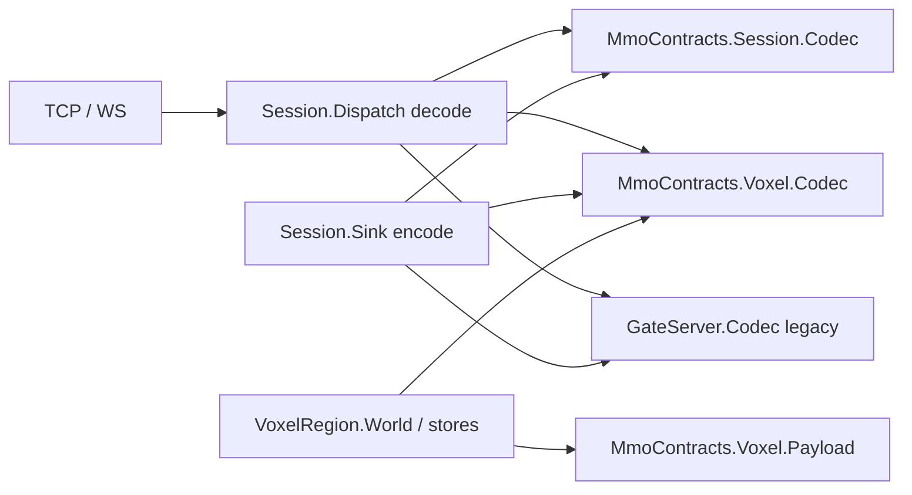

# Voxim M1：现行字节契约抽取与后续实施边界

当前主线是同级 `Voxim`，路线权威为 [`starter.md`](../../../../Voxim/starter.md)、
[`M1 plan`](../../../../Voxim/Docs/M1/plan.md) 和各任务 brief；`clients/Voxia` 仅作算法、行为与性能参考。
本页记录 G1 所属的现行字节抽取，不能代替 B1/B2/C1 的后续合同冻结，也不要求保留旧移动协议兼容。

G0 双端 golden 经独立 re-review PASS 后，G1 将 auth/enter/heartbeat 编解码移入
`MmoContracts.Session.Codec`，当前 edit/overlay/result 与 HTTP region/log/transaction 编解码移入
`MmoContracts.Voxel.Codec`，不可变 region CSR 载荷移入 `MmoContracts.Voxel.Payload`。
表皮值规范化为 `MmoContracts.Voxel.Skins` 的唯一规则，LOD reduction 仍在 `VoxelRegion.Reducer`。
函数 arity/返回类型列于 [`mmo_contracts README`](../../../apps/mmo_contracts/README.md)。

Gate 的 selector 只做路由，不持有新一份 byte logic；Reducer/World/会话状态仍属原业务 app。
Session 大端、嵌套 Voxel 与 HTTP 小端、旧 Enter 的 UE/cm 单位、HTTP body/zlib/skins/content_version 均未改变。
31 个冻结 fixture 与两个原 manifest 不重捕获、不改写、不重新封存；历史源路径归属与现行完整性检查分开。

剩余旧活调用方包括 `Session.Dispatch`/`Sink` 的 legacy 分支、UDP fast-lane，以及由会话/复制层产生的
旧移动、time-sync、玩家/NPC、聊天/战斗、Scene chunk/object/field/prefab 消息；这些字节没有迁入新 Movement。
原 `VoxelRegion.Codec`/`Payload` 无剩余调用方，现行 World、FileStore、OverlayLog、GeneratedStore 直接调用纯 owner。

**待实施**：Movement/C1 字段、固定 `1.0 / 60.0` authority/runtime、QUIC 生产集成、bootstrap runtime、
World 碰撞裁决和双端 M1 联调。G1 scoped codec/app 测试不构成上述验收；Q0 隔离 handshake 也不能替代。
T1 接手现有 `Session.Sink`；W1 接手业务 World/载荷调用，纯序列化保持在 contracts。
命令、原始输出、残余调用方、保护文件和本地提交见 [`G1 report`](../../../../Voxim/Docs/M1/reports/G1.md)。
