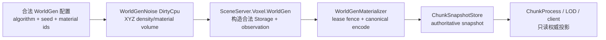
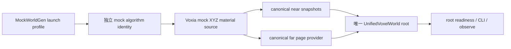
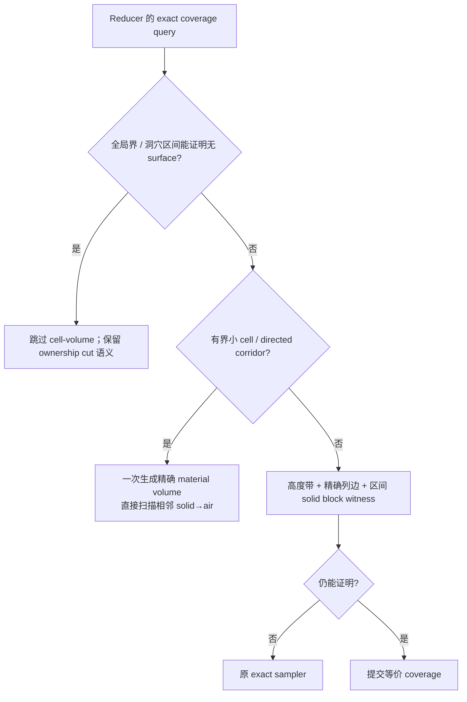
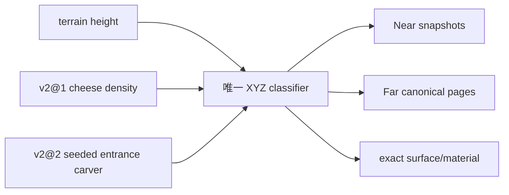

# 2026-08-24 WorldGen v2 三维密度物化

---
status: active
owner: SceneServer.Voxel.WorldGen / Voxia::Voxel::FVoxiaWorldGenV1（迁移期类型名）
algorithm_version: worldgen_density_v2@1
mock_algorithm_version: voxia_mock_density_v2@2
---

## 目标

把服务端 migration WorldGen 的生成边界从“Elixir 按 XZ 列高度填充 chunk”收敛为：

```text
worldgen_density_v2(seed, chunk_xyz) -> canonical 16x16x16 material volume
```

首个切片在现有地表高度体内加入世界坐标连续的三维 cheese-cave 空腔，并保持表土/岩石材质分层。
服务端生成结果只能由 `WorldGenMaterializer` 在 World-issued lease fence 下写入 canonical store；
在线 runtime、streaming、LOD 和 renderer 不得调用或复算服务端 WorldGen。

用户补充的第二切片升级 Voxia 当前默认 `MockWorldGen`，让服务器尚未完成 Online provider 接入时
仍能在唯一生产组合根中验证三维内容。它当前使用独立身份 `voxia_mock_density_v2@2`，不得冒充
`worldgen_density_v2@1` 或 confirmed truth；将来切到 H-gated local pack / Online provider 时，
仍由 source identity 变化触发完整失效和重建。

## 开工前自查

1. **WorldGen 承诺的不变量**：同一算法版本、seed、配置和完整 XYZ 坐标得到同一材质体；相邻
   chunk 在边界处采样同一世界连续场；NIF 失败显式返回；算法版本随形状语义变化而变。
2. **依赖契约**：WorldGen 只依赖 `MaterialCatalog` 的只追加 material id 和 canonical macro index
   顺序；materializer 只依赖合法 `Storage + observation`，不读取噪声内部状态。
3. **正交性**：洞穴生成不修改 World/Scene 路由、runtime chunk owner、客户端 provider、LOD 或
   field runtime。动态水、热、电、结构与物体仍由各自 authority owner 维护。
4. **排除红鲱鱼**：Voxia 当前画面来自 MockWorldGen，服务端算法完成不会自动改变客户端画面；
   客户端 mock 升级也不代表 Online canonical page provider 已接通。

## 依据与取舍

- Ken Perlin 的 SIGGRAPH 2002 improved-noise 官方参考以三维单位立方体八角采样、逐轴 fade 和
  三线性插值构造连续噪声。本实现沿用仓内 Squirrel hash，只扩展为世界坐标三维 value-noise；
  适用点是跨 chunk 连续，取舍是暂不引入新噪声依赖和第二套 seed/hash 体系。
  <https://mrl.cs.nyu.edu/~perlin/noise/>
- NVIDIA GPU Gems 对改进 Perlin 噪声的工程实现同样强调规则 lattice、平滑插值与可重复的
  gradient/permutation 数据。本项目只采用“绝对坐标连续采样 + 平滑插值”的适用部分，继续使用既有
  Squirrel value-noise；该资料不规定洞穴拓扑或自然入口分布，因此不能用来替代本项目的入口契约。
  <https://developer.nvidia.com/gpugems/gpugems/part-i-natural-effects/chapter-5-implementing-improved-perlin-noise>
- Minecraft 官方 21w37a 把 noise cave 分为 cheese、spaghetti、noodle，并把 aquifer、地下
  biome、ore distribution 分成独立生成层。本切片只采用最小的 cheese-cave 空腔层；隧道、
  aquifer、biome、矿脉均后置，避免把独立变化轴耦合进第一版三维边界。
  <https://www.minecraft.net/en-us/article/minecraft-snapshot-21w37a>
- Erlang/ERTS 官方 NIF 文档要求普通 NIF 在约 1ms 内返回；不能拆分且可能更久的 CPU 工作应标为
  dirty CPU NIF。完整 4096-cell 多 octave 采样因此运行在 DirtyCpu scheduler，不占普通调度器。
  <https://www.erlang.org/doc/apps/erts/erl_nif.html#lengthy_work>
- Utah 技术报告把 interval arithmetic 的价值界定为给出 sound bound，并允许在边界过宽时继续
  refinement。Voxia 的洞穴区间证明据此只在“上界 + 舍入余量仍不超过阈值”时返回已证明；其余
  情况细分，仍无法证明就回到原 exact sampler，不把 unknown 猜成 air/solid。
  <https://www.cs.utah.edu/docs/techreports/2022/UUCS-22-003.pdf>
- Stony Brook Scientific Visualization 课程资料给出 hexahedron 的 trilinear interpolation。
  本实现进一步利用逐轴线性权重均非负且和为 1 的凸组合性质：先按噪声 lattice 边界切分区域，
  每个子域的 octave 上界取八角点最大值，正权 octave 再归一加权。适用范围只限当前冻结的
  value-noise 公式；若插值或 octave 权重语义改变，必须换算法身份并重证。
  <https://www3.cs.stonybrook.edu/~mueller/teaching/cse564/scienceEng.pdf>

## 所有权与数据流



- Rust NIF 是形状算法与 `algorithm_version` 的唯一 owner。
- Elixir `WorldGen` 在 NIF 信任边界前一次性校验完整配置与坐标，随后只把返回的 canonical-order
  material volume 构造成 `Storage`。
- `WorldGenMaterializer` 复用同一次生成返回的 observation；禁止为日志再次扫描或重算噪声。
- 旧 `column_height` / `heightmap_region` 只为历史离线迁移保留，新的 chunk 生成不调用它们。

### Voxia Mock 所有权



- 迁移期 C++ 类型名仍为 `FVoxiaWorldGenV1`，以避免把算法切片与跨三十余个调用点的纯重命名耦合；
  对外身份、日志和测试统一使用 `voxia_mock_density_v2@2`。Online/local provider 成为默认入口后，
  删除本地 generator 时一并退出该迁移名，不再新增第二层兼容 facade。
- generator 是 mock 材质/占用的唯一 owner；near snapshot、far canonical page、frozen base、碰撞
  只能调用同一分类函数。surface adapter 可以缓存列高，但必须对洞穴内部六向外露面给出真实
  exact coverage，不能继续使用“地下无限实心、只有顶面”的旧证明。
- 客户端保留现有更夸张的开发地表参数，因此它不是服务端算法的逐位镜像；相似的 cheese-cave
  构造只服务可玩开发体验。算法字符串与 content/shape fingerprint 必须独立换版，防止两个来源
  被误判为同一 canonical 内容。

### Voxia exact surface 快路径



- reducer 仍保持 source-neutral；全部 WorldGen 专用证明只存在于
  `FVoxiaWorldGenSurfaceMaterialSource`。证明函数的 `false` 只表示 unknown，不能改变材质、
  occupancy、face owner 或错误语义。
- 小 cell-volume 与小 directed corridor 在采样体积不超过 32768 时，一次构造完整 XYZ material
  volume，再逐相邻格精确累计 solid→air 面；这替代逐点 delegate 调用，不是降采样或近似。
- 大 corridor 先用全局 terrain height band 排除不可能的自然侧壁，再用精确列高边、16 格
  cave-density solid block proof 与既有 exact fallback。`MinHeightMacro == MaxHeightMacro` 的冻结
  高度场直接返回常量，不进入噪声函数。
- `worldgen_stats.surface_material_reduction.sampling_ms` 分别记录 `presence`、
  `directed_coverage`、`cell_volume`、`nearest_surface`、`regional_fallback`；策略字符串与 LOD0–4
  breakdown 同时公开，避免只看总耗时猜热点。
- 2026-08-24 的 exact-surface 快路径切片保持当时的 `voxia_mock_density_v2@1`：它只做等价优化；
  2026-08-25 自然洞口改变形状输出，因此独立 bump 为 `voxia_mock_density_v2@2`。

## v2@1 形状边界

```text
base_solid = world_y < legacy_surface_height(world_x, world_z)
cave_band  = protected_surface_depth < depth <= max_cave_depth
             and world_y >= min_cave_y
cave_air   = base_solid and cave_band and cave_fbm_3d(world_xyz) > threshold
material   = air | surface_soil | subsurface_stone
```

约束：

- 三维噪声只吃绝对 world macro XYZ，不能吃 local chunk 坐标。
- 首版保留固定厚度地表盖层，洞穴不会用离散 pinhole 打穿地表；自然入口留给后续独立 carver。
- 洞穴只在有限垂直/深度带出现，深层 chunk 继续允许 uniform solid 快路径。
- 无 aquifer：洞穴空气就是静态 baseline 空气，水/熔岩不能由本层伪造为动态 field truth。
- `worldgen_density_v2@1` 的常量或公式若改变输出，必须 bump 版本并发布新 content version；不得
  用同一身份覆盖旧 world pack。

## Voxia mock `v2@2` 自然洞口

Minecraft 21w37a 的官方说明把 cheese、spaghetti、noodle 与旧 carver 作为可组合洞穴形态，并明确
它们在与地表相交时形成入口；本切片据此只增加“入口连接层”，不改 cheese 密度、aquifer、biome
或服务端算法。精确的 seed 网格与下降胶囊公式是本项目的**原创决策**：未找到同时满足当前
无 world scan、单格分类、完整 XYZ 与固定成本约束的可直接采用规范。

```text
grid_cell   = floor_div(world_xz, 128)
entrance    = seeded_descriptor(grid_cell, seed)
tunnel_air  = distance((world_x, terrain_depth, world_z), descending_segment) <= 6
chamber_air = distance((world_x, terrain_depth, world_z), inner_center) <= 12
```

不变量与取舍：

- 每个 128×128 world-XZ 网格只有一个 seed 确定的 mouth/inner 描述符；形状完全留在所属网格，
  单格分类只解析一个网格，不扫描邻居或世界状态。
- mouth depth 为 2，inner depth 为 36，明确穿过 cheese 的 12 格保护层；保护层语义仍只属于
  cheese-cave，入口 carver 不复制或改写 cheese 公式。
- near snapshot、far canonical page、point material、surface exact coverage 与 frozen base 仍只调用
  `ClassifyCell` / `MaterialForCell`。入口 XZ 包围盒会让 cheese-only solid proof 保守退出，转到 exact
  sampler；unknown 不得被猜成 solid。
- 算法、shape/content signature 与 pack version 同轮换版；旧 cache/page 不得命中新输出。
- 风险集中在浅层额外分类成本与洞口密度观感；验证以固定 seed/负坐标/跨 chunk 连续、精确表面、
  唯一生产根流送耗时和真实探索为准，不新增第二生成路径或调参开关。



## 可观测面

`WorldGen.generate_chunk/3` 返回 `Storage` 与同源 observation：

```text
algorithm_version
chunk_coord
seed
total_cells
solid_cells
natural_air_cells
cave_air_cells
surface_cells
subsurface_cells
generation_us
```

入口：

- CLI：`mix scene_server.worldgen.inspect --chunk="CX,CY,CZ" [--seed N]`；只读生成，不写 store。
  PowerShell 负坐标 fixture 使用 `mix scene_server.worldgen.inspect '--chunk=-2,-3,-8' --seed 1337`。
- Voxia CLI：`worldgen_inspect_chunk CX CY CZ [SEED]`；输出 mock algorithm、完整 cell 分类计数、
  首个洞穴坐标、材质 fingerprint 与生成耗时，不写 confirmed store。
- Voxia CLI：`worldgen_nearest_entrance WORLD_X WORLD_Z [SEED]`；输出最近入口网格身份、mouth/inner
  深度和可直接探索的 world XYZ，不写 confirmed store。
- Voxia 可玩入口：`clients/Voxia/scripts/run_voxia_3d_world.ps1 -ExploreCave`；仍使用正式地图与唯一
  `production_all_features` 根，只把 spawn 对齐到 C++ WorldGen owner 返回的最近 mouth。
- 日志：`voxel_worldgen_materialized` / `voxel_worldgen_materialization_failed`。
- 自动化：Rust 算法测试、SceneServer chunk/物化测试、WorldServer bounded materializer 回归，
  以及 Voxia generator/canonical materializer/source identity automation。

## 测试矩阵

| 层 | 用例 | 必须证明 |
| --- | --- | --- |
| Rust | 同 seed 重跑、不同 seed、负坐标 | 确定性、seed 生效、负坐标合法 |
| Rust | 固定 cave fixture、表层盖层、深层 chunk | 有真实 3D 空腔；不打穿盖层；深层仍全实心 |
| Rust | 相邻 chunk 边界采样 | 两侧都按同一绝对 XYZ 场计算，无 chunk-local 接缝 |
| Elixir | material binary -> macro index | X-fastest canonical 顺序和 material id 正确 |
| Elixir | 非法坐标/配置、NIF 材质与计数契约 | 信任边界显式失败，不产生半个 Storage |
| Materializer | 成功/失败 observe | 版本、XYZ、cell 统计、错误原因可直接诊断 |
| CLI | 固定 chunk inspect | 命令可复现输出同源结构化 observation |
| Voxia generator | 固定 cave fixture、负坐标、seed、盖层与深层 | mock 有真实 XYZ 空腔且 near/far 同源 |
| Voxia entrance | 同 seed、不同 seed、中心线、mouth exact material、chunk observation | 洞口确定、连续、穿过 cheese 盖层且单独可观测 |
| Voxia surface | 六向 cave wall coverage 与旧地表反例 | 洞穴不破坏 exact surface/material 合同 |
| Voxia root/CLI | 默认 MockWorldGen 启动与 chunk inspect | 唯一根公开新身份，真实入口可操作可诊断 |
| Voxia 可玩入口 | `-ExploreCave` + Real-RHI 正式地图 | C++ owner 决定 spawn，完整 Near 可见且能从洞口进入连续地下空间 |

## 非目标与后续

- Voxia 改动只升级显式 RuntimeMock/dev fixture；不把本地生成结果提升为 Online truth，也不允许
  `OnlineAuthority` 失败后回退到 Mock。
- 不在本切片实现 spaghetti/noodle caves、aquifer、河网、biome、矿脉或结构。
- 不实现 Online XYZ page provider、launcher pack 发布、H credential 或客户端 cutover。
- 后续优先级：完成 Mock 可玩验收后，仍先生成 world-pack fixture 并走 Voxia H-gated local provider，
  再决定后续 biome/material strata 或 aquifer 切片；它们不得与当前入口在同一无版本变更中混入。

## 进度日志

- 2026-08-24：完成边界取证与决策；实现 `worldgen_density_v2@1`、DirtyCpu XYZ 材质体、
  cheese-cave、地表保护/深度带、算法版本 NIF 与 seed 极值 wrapping 语义。
- 2026-08-24：`WorldGen.generate_chunk/3` 已完成 scene/config/canonical i32 chunk、NIF binary、
  material id 与计数守恒校验；`WorldGenMaterializer` 复用同源 observation，并支持写前
  `expected_algorithm_version` 硬门禁与成功/失败 observe。
- 2026-08-24：只读 CLI 与自动化已落地。固定 `chunk={-2,-3,-8}, seed=1337` 证据为
  `solid=4072`、`cave_air=24`、`surface=0`、`subsurface=4072`、
  `chunk_hash=c3074cd53f9d98f1`；本机单 chunk 实跑约 19ms。
- 2026-08-24：已通过 Rust `cargo test` 9/9、SceneServer WorldGen/materializer/ChunkProcess
  focused tests 18/18、Mix task tests 2/2、SceneServer compile，以及 umbrella 根运行的
  WorldServer bounded materializer 回归 16/16；umbrella 根 `mix compile`、定向格式检查与
  `git diff --check` 也已通过。
- 2026-08-24：Voxia mock 的 exact surface/material 路径新增分阶段耗时、全局高度带、保守
  cave-density 区间证明、精确小 material-volume adjacency、最近正 Y surface 列索引与区间
  solid witness。无收益的 page 级 cave lattice cache、扩大 point-material cache、批量一维
  material line 和 proof-result cache 均已删除，不保留第二实现或备用真值。
- 2026-08-24：固定 Voxia fixture `chunk=[0,30,0], seed=1337` 仍为 `solid=194`、
  `cave_air=3902`、`first_cave=[0,480,0]`、`fingerprint=8418e5e9fcb0e2e3`。LOD0–4 的
  page/surface fingerprint 仍依次为 `e71ebadd6ec58e53/6940116e3d78f442`、
  `8dfb8f42b2357475/bfe8af69c7871c81`、`874c2c7a234e0970/afe7726c493601bf`、
  `a7757f3165a37486/6e2cd7ce3b96fab4`、`a5fa879ed364831c/64deb8bbf990fd23`。
- 2026-08-24：默认 Full shell Automation 的同配置冷构建从紧邻基线 `182.570s` 降到
  `109.007s`（约 40%），仍为 `33725` far pages、`near/far quads=17438/919177`；默认 stdio
  `mock` profile 在唯一 `production_all_features` 根以 `77.420s` 完成 16-worker Full build，
  `ready/session_ready/single_composition_root/centers.aligned/far.ready=true`、Full=`6859 patches`。
  证据根：`.demo/observe/voxia_mock_worldgen_surface_fastpath_20260824/`。
- 2026-08-24：最终 `Automation RunTests Voxia` 共 `221/221` 完成：`208` clean success、`13`
  success-with-warning、`0` failed/not-run；WorldGen focused `2/2`、Node `196/196`、Development
  build 均通过。13 个 warning 用例中 12 个是既有负路径断言，另 1 个是外部
  `https://www.google.com/generate_204` 超时。新增真实 timing 后，canonical page provider 的
  并行/串行确定性断言改为只比较去除 timing 的统计快照，并独立校验 timing 有限且非负；CLI
  production command 总数随 `worldgen_inspect_chunk` 从 127 更新为 128。
- 2026-08-24：首次全量进程曾在 background worker 的 `SampleMaterialWithCache` 栈上记录一次
  access violation，随后同一重负载序列、macro 单测和两次全量进程均未复现。原始 minidump 的
  fault RIP 字节与当前 DLL 一致，解码为仅寄存器操作的 `mov r9d,eax`，却同时声称向 `0x35d`
  写入，证据内部不自洽；因此没有把猜测性的 cache-pointer 改动加入生产路径，也不声称根因已修。
  该未复现事件作为残余风险保留在
  `.demo/observe/voxia_mock_worldgen_surface_fastpath_20260824/final_verification_summary.json`。
- 2026-08-25：Voxia mock 新增 seed 网格化下降胶囊入口与末端 chamber，算法身份升为
  `voxia_mock_density_v2@2`；chunk observation 新增独立 `entrance_air_cells`/首入口 XYZ，CLI 新增
  `worldgen_nearest_entrance`。固定 cheese fixture 的计数与 fingerprint 保持不变，证明两层正交。
- 2026-08-25：正式 `L_VoxiaProductionWorld` + 唯一 `production_all_features` 根的 Real-RHI 实跑在
  seed 1337 的 mouth `[1271,54,-5711]` 上方完成 `27 tiles / 216 patches / 9261 chunks` Near，
  并从洞口拍到连续下降洞道；PNG 审计为 `1280×720`、`non_black_ratio=1`、`unique_colors=9669`。
  结构化流送与入口查询是主证据，截图只补充视觉证据：
  `clients/Voxia/Saved/cave_entrance_inside_production.png`。
- 2026-08-25：`run_voxia_3d_world.ps1 -ExploreCave` 已成为真实用户入口；它仍启动正式地图/唯一根，
  不保存坐标副本。最终可见实跑以 `mode=nearest_natural_entrance` 出生，并在 Near 硬上界内以
  `10530ms` 达到 `ready/session_ready=true`；required Far 再用 `74ms` 闭合，同目标 Full
  后台扩展最终完成 `33725 pages` 并提交，全程没有 liveness fatal。运行日志为
  `clients/Voxia/Saved/Logs/run_voxia_3d_world.log`；
  focused spawn automation 位于
  `.demo/observe/voxia_worldgen_streaming_fix_20260825/cave_explore_spawn_final_green/`。
- 2026-08-25：最终 Development build 成功；`Automation RunTests Voxia` 为 `221/221`
  （`208` clean + `13` success-with-warning，`0` failed/not-run），Node 为 `198/198`。UE 报告位于
  `.demo/observe/voxia_worldgen_streaming_fix_20260825/final_all_voxia_green/index.json`；13 个 warning
  仍是 12 个既有负路径断言与 1 个外部 `generate_204` 超时，不构成本次回归失败。
- 后续仍是独立阶段：生成 world-pack fixture 并接 Voxia H-gated local provider 做真实可见验收；
  world-pack 发布与 content-version 自动绑定、Online provider、biome/material strata、aquifer
  均未完成，不得由本切片推断为 ready。
