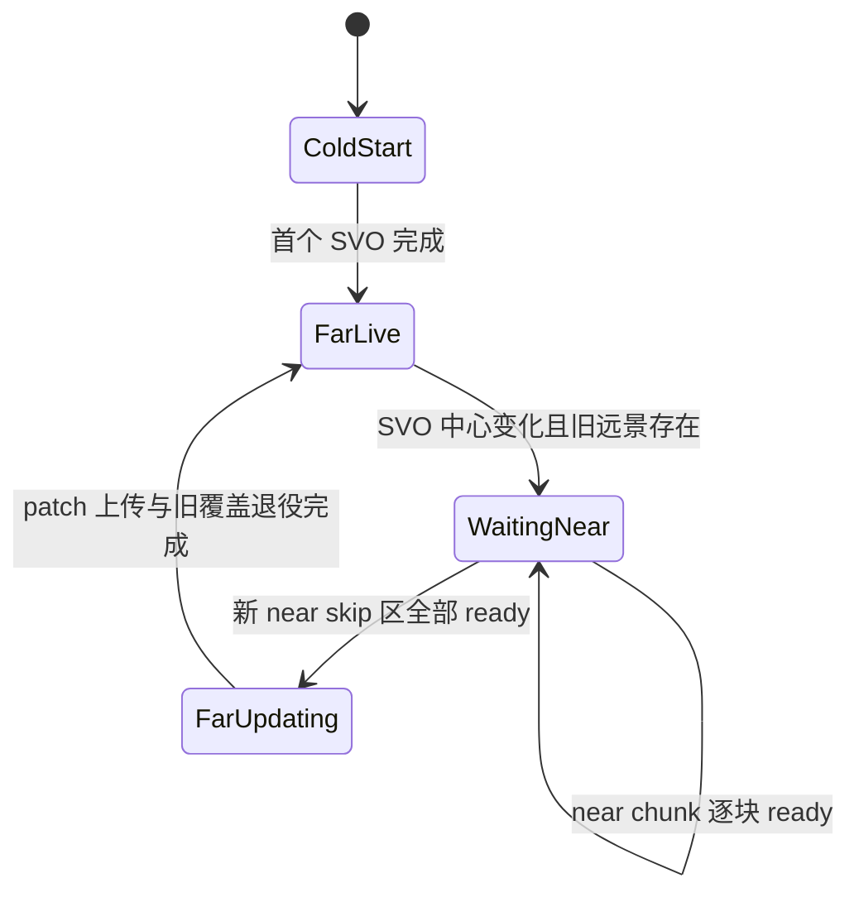

# 决策稿：Voxia 近远景呈现交接

- **日期**：2026-07-11
- **状态**：实施中
- **范围**：Voxia 客户端近景 mesh 流水线与派生远景 SVO 的呈现编排
- **非范围**：confirmed voxel truth、near window 激活、SVO 数据生成、协议与服务端 authority

## 1. 问题与根因

完整场景长距离移动暴露两项相互独立的问题：

1. near window 切换后，新 SVO revision 立即按新中心挖掉 `NearSkipRadiusTiles`，但近景 mesh 仍在逐 chunk 呈现，交接区会短暂空白。
2. near mesh 队列把已经消费的历史前缀也加入“仍在排队”集合。chunk 离窗时其呈现账本被移除，但它再次入窗时仍被历史前缀去重，直到整轮 build 重置才恢复。
3. WorldGen 近景只呈现玩家上下各 3 个 chunk 层，但该垂直带只随 voxel revision 更新。玩家爬升/下降一层而数据不变时，缺口会稳定停在 `3 entering tiles × 7×7 columns = 147 chunks`，直到下一次 tile/revision 变化才偶然恢复。

二者不能用固定等待、扩大预算或吞掉 revision 掩盖。前者缺的是显式的跨表现层交接契约，后者是 near 流水线没有持续维护自己的队列不变量。

## 2. 所有权与不变量

### 2.1 NearMeshPipeline

- 独占维护 `pending chunks` 与 `presentation-ready chunks`。
- `pending` 只包含当前 active window、垂直呈现带内、尚未处理的 chunk。
- `presentation-ready` 表示该 chunk 已被本轮流水线解析并完成呈现决策；有几何时组件已更新，无几何时已确认应为空或被完整遮挡。
- chunk 离开 active window 或 confirmed store 后，流水线必须主动撤销其 ready 状态；重新进入时必须可再次排队。
- 有限垂直呈现带必须随玩家所在 chunk 层自维护；这是一项位置驱动的表现覆盖活性，不能依赖 voxel revision 代为触发。

### 2.2 FarPresentation

- 只读 near 的 ready 快照，不读取 near 的构建数组索引，不改变 near 调度。
- 首次冷启动没有旧远景可保留，不设交接门。
- 已存在远景且 SVO 中心变化时，旧 revision 至少保留到“新 near skip 区减去旧 near skip 区”的进入条带达到 ready；然后才允许新 revision 进入 patch 聚合与上传。旧 hole 已覆盖的交集不重复等待。
- 数据 revision 仍可 latest-wins；门控只延迟派生表现提交，不延迟 confirmed truth 或 active window。

## 3. 本轮实现切片

1. 修正 near 队列：历史前缀不再参与 pending 去重；pending 同时按 active window 与垂直带裁剪。
2. ready 在每个 chunk 的呈现决策完成点更新，不再由批次 publish 函数按数组区间推断。
3. 玩家跨 Y chunk 层时，即使 voxel revision 不变也刷新 pending/ready 覆盖；移除旧垂直带并只追加新进入层。
4. SVO 中心变化时增加 coarse handoff gate：以新旧 near skip 集合差的 tile/chunk 覆盖完整度为条件，暂缓整个新 SVO revision；相邻横移通常只等待 3 个进入 tile，而不是整个 3×3 hole。
5. `near_mesh` CLI 快照增加 ready 数和 handoff 状态；结构化日志记录 revision、中心、ready/required tile 与 pending chunk。

本切片保证“不先挖洞”，但不是最终的逐 chunk 远景裁剪。当前 SVO render artifact 以 `8x8 tiles` patch 组织，若直接按 1m chunk 修改 CPU geometry 会破坏 patch-native 增量边界并制造高频重建。后续应在 renderer 内增加按 tile/chunk-column 的 GPU clip mask，使已 ready 区域逐块退役远景；该 mask 只能消费 ready 状态，不反向影响 near 或 truth。

## 4. 可观测契约

`near_mesh` 必须直接暴露：

- `presentation_ready_chunks`
- `handoff.deferred`
- `handoff.revision`
- `handoff.target_center_tile`
- `handoff.required_tiles` / `ready_tiles` / `pending_chunks`

日志事件：

- `near mesh streaming queue extended`：包含 added、removed_pending、pending、ready。
- `SVO presentation deferred for near handoff`：节流输出，不逐帧刷屏。
- `SVO presentation handoff ready`：门控解除时输出一次。

## 5. 验收矩阵

| 类别 | 验收 |
| --- | --- |
| 纯策略 | 离窗 pending 被裁剪；历史前缀不阻止重入；pending/ready 均阻止重复追加 |
| Actor 流水线 | 长距离往返后队列持续推进，不依赖 build reset 恢复 |
| 交接正确性 | 有旧远景时，新中心 SVO 在 near skip ready 前不提交；冷启动不死锁 |
| 视觉 | 跨 tile 时无先消失形成的空白带；允许短时 near/far 重叠，后续 clip mask 消除 |
| 性能 | 完整 near+far 场景报告 p50/p95/p99/max 与 `>8.33/16.67ms`；门控不得增加 GameThread 峰值 |

## 6. 残余风险

- coarse gate 会延长旧远景在新 near 已局部呈现区域的重叠时间，可能产生局部 z-fighting；它优先修复空白正确性，最终解法是 GPU clip mask。
- 长距离连续移动可能让目标中心持续变化。实现必须始终评估 Transport 当前最新 revision，不能缓存并发布已经过时的中心。
- ready 的空/遮挡语义必须由 near 流水线自己维护；远景不得重复推断 voxel 内容。
