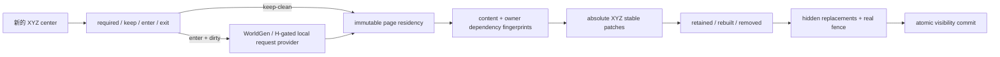
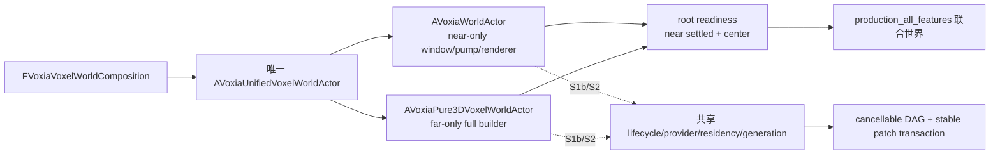
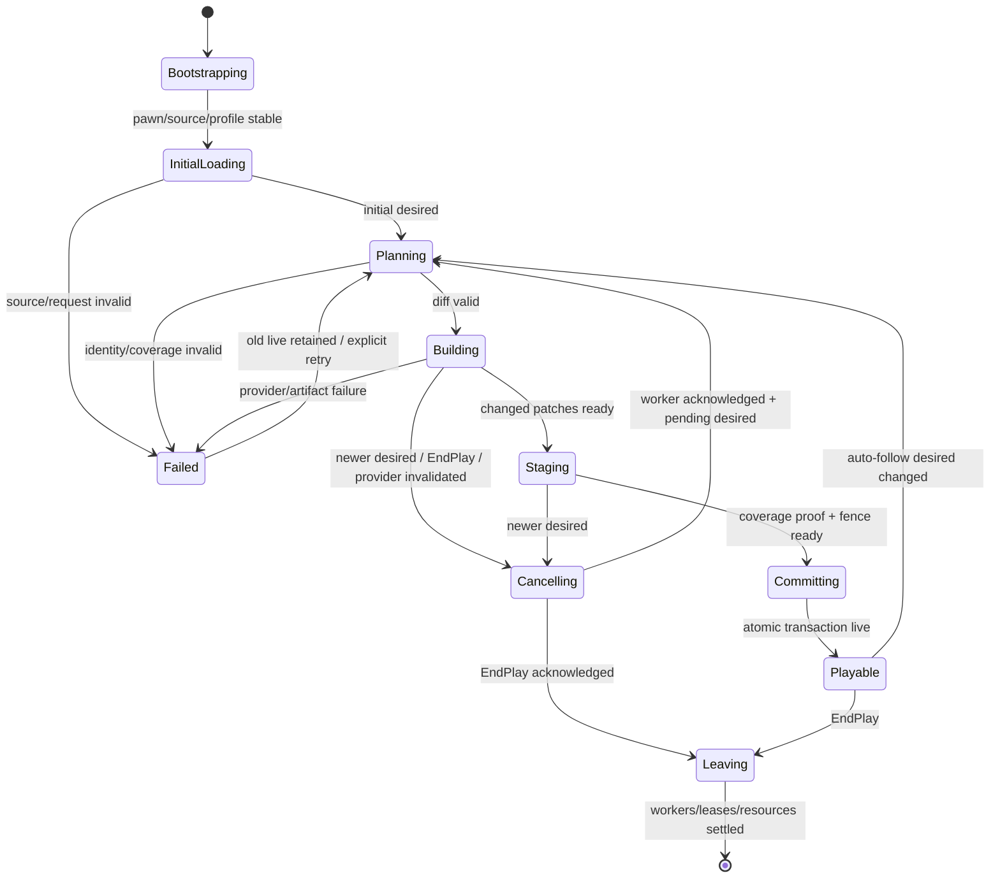

# 里程碑 A10 作战任务：WorldGen 驱动的完整客户端 3D 滑动世界

- **日期**：2026-07-12
- **状态**：客户端 A10 已完成；2026-07-23 near/far Tile handoff、活性、near mesh 与外观重新 closeout；Online authority/provider 不在本任务范围
- **归属**：扩展后的里程碑 A / A10
- **上位计划**：[`2026-07-12-pure-3d-voxel-shell-migration.md`](2026-07-12-pure-3d-voxel-shell-migration.md)
- **影响范围**：Voxia 场景进入与 pure-3D composition root、WorldGen/本地磁盘 page provider、三轴滑动窗口、page/artifact residency、resolved surface DAG、patch scene host、CLI/observe/automation
- **不改变**：服务端 authority、confirmed truth 来源、H gate、wire opcode、生产 1m/7m 投影契约与 `apps/*`

> **当前 closeout 阅读规则**：第 0–12 节保留 2026-07-12 至 2026-07-17 的原始执行设计、任务拆分和当时退出门槛，只作为历史实施证据，不再定义当前架构。其间所有要求 near/far “共享 provider/residency/generation”、进入同一 coverage generation、或把两个 actor 收敛为共享可变服务的表述，均已被最终正交契约取代：唯一根冻结 source/world/session identity 与共同 handoff target；near/far 各自持续维护派生 generation/residency/cache；根级 confirmed presentation transaction 只组合 immutable identity/proof/receipt，不共享可变状态。2026-07-22 的 presentation 重开及 2026-07-23 重新 closeout 见第 13 节末尾；当前规范以 `docs/00-current-truth/`、该最新条目与 Voxia 根 README 为准。

## 0. 作战决策

A8/A9 已证明完整 3D 外壳的空间、数据、表面与 Real-RHI 内核能够工作。A10 的第一片现已建立唯一 `production_all_features` 运行根：普通 `-VoxiaWorldGenPreview` 由 `AVoxiaUnifiedVoxelWorldActor` 同时持有成熟 near 滑窗/数据泵与 Pure3D far，GameMode 不再让旧 2.5D 与 Pure3D 两个顶层世界二选一。根级门槛要求 active near window 已结算、far 已 live、XYZ center 一致；高空 near 全空气也能以 zero geometry 正确 ready。

这解决了“所有成果没有一个共同运行事实”的问题，同时保持两个子系统的正交所有权：near 与 Pure3D far 分别维护自己的派生 generation/residency/cache，由根冻结 source identity 并以 confirmed presentation transaction 原子组合。A10 已把 Pure3D far 改为可替换的 WorldGen/H-gated `local_disk` request provider、immutable page residency、合作取消、依赖指纹 artifact 复用与绝对 XYZ stable-patch transaction；统一根不再创建被隐藏的 Pure3D near mesh/component。相邻一 tile 实跑只请求 `1517 / 33752` pages，复用 `32199` 个 material artifact、`29533` 个 surface artifact和 `175 / 216` 个 far patch。后续阶段又完成 full oracle、完整三轴 route、HUD、材质族、资源释放门禁与长稳验收。开发用 `local_disk` 仍只接 far；补 Online provider 或 local-disk near provider 是独立 adapter 工作，不表示 A10 未收口。

2026-07-23 重新 closeout 后，跨 renderer transaction 的现役形式是：唯一根用 target latch 固定已经发生
可见 mutation 的共同 near/far 目标；normal handoff 按实际 Tile 集合逐个提交，canonical chunk atlas、
seam、near visibility 与真实 staging/post fence 共同证明唯一 visible owner。near CPU mesh 使用有界并行
和有序发布，near/far opaque 共享 world-aligned 材质与 canonical AO/sky。这些都是客户端派生/呈现
能力；Online authority 仍只能通过后续 provider/bootstrap 接入，不能把本地 WorldGen 变成 confirmed truth。

本任务先以客户端 WorldGen 建立增量主干，再以 H-gated 本地磁盘 pack 验证真实可替换数据源，把 pure-3D 路径升级为：

1. **唯一完整场景入口**：所有已批准成果只进入一个正式组合根；参数/专用地图只能选 probe/compatibility，不能形成第二正式世界；
2. **同源 near + far**：从当前根拥有两个迁移期模块，继续收敛为 WorldGen canonical page 按请求供数，near 精确窗口与 far 3D cube-shell 属于同一 coverage generation、同一 residency 与同一 presentation transaction；
3. **三轴自动滑窗**：玩家步行、飞行、对角移动和传送都由位置自动产生 desired XYZ center；手工 CLI 只作诊断，不是正常运行前提；
4. **差集流送**：相邻重心只请求 `enter/dirty` pages，只移除 `exit` pages；`keep-clean` 必须复用；
5. **真正取消与依赖感知复用**：新重心到达时旧工作在有界 work quantum 内停止；page、material mip、resolved surface、mesh patch 分层缓存，只重建受影响依赖闭包；
6. **稳定分块呈现**：组件锚定 canonical patch，不锚定 generation center；未变化组件跨 generation 原样保留；
7. **差分原子提交**：changed patches 可分块准备，但 retained/replaced/removed 集合、near/far ownership proof 与 fence 全部 ready 后才同帧切换；
8. **可替换 provider 边界**：WorldGen 与 H-gated 本地磁盘 provider 走同一 request/result 契约；planner、residency、artifact DAG、scene transaction 与 host 均不得读取数据源种类。以后接服务器只能新增 provider adapter，不能重写客户端流送系统。

这是一项**客户端系统闭环任务**，属于 A10。2026-07-13 用户明确把 H-gated 本地磁盘 request/live provider 前移到当前任务；该切片现已落地：`FVoxiaCanonicalVoxelPages::LoadExpectedBatch` 保持 exact-set 原子 batch 语义，live provider 则在启动时用外部 manifest SHA-256 与 expected identity 打开不可变 manifest，在 worker 中只读取 `enter/dirty` 页面并逐页校验 size/hash/payload identity，不能把 manifest 自报内容当 H。网络/HTTP/服务器 provider、launcher 真包与在线 authority 切流仍不实现。WorldGen 与本地 pack 都是客户端离线/开发数据源，不得成为在线 confirmed truth。

### 0.1 本任务的完成画面

用户从正常可玩场景入口进入后，应看到并能连续穿行于一个完整世界：

- 出生点首窗同时具备可见 near 与 far，不是只显示远景壳或独立静态演示体；
- 地面移动时 near 精确块随玩家滑动，外部 far 始终连续；飞高后 near 可以因真实空气而为零面，但下方地表必须由 far owner 连续覆盖，不能留下二维近景柱洞；
- 跨 tile 时世界不会整套消失、冻结十几秒后换图，也不会靠重新进入场景刷新；
- 返回刚经过区域时能观察到 page/artifact/component 复用，而不是重新生成相同内容；
- HUD/CLI 能直接看到 desired/live center、near/far pages/patches、keep/enter/exit、取消、缓存和提交状态。

以下均不算完成：只跑 automation、只跑 CLI probe、只看固定相机截图、只证明单次整壳构建、只把 `auto_follow` 打开但仍整代全量重建，或把根所拥有的两个迁移期子模块长期当作共享 residency/transaction 已完成。禁止的是多个并列生产 root；根内临时组合只是一段可观测迁移，不是终态。

## 1. 当前实现与根因

### 1.1 已经具备

- `FVoxiaFarFieldCubeShellPlanner` 已输出完整 XYZ far cell 与 near cube；
- `FVoxiaCanonicalVoxelShellSceneBuilder::BuildPageRequest` 已给出一个 generation 的 far + near required page set；
- canonical batch、六向 material mip、coverage-resolved exact surface 与 source/coverage fingerprint gate 已完成；
- `UVoxiaVoxelPresentationSceneHost` 已能让旧 generation 在 hidden resource fence 完成前持续可见；
- actor 已有 latest desired center、stale result 拒绝、位置观察与显式重试入口；
- WorldGen 已有 `SampleMaterialVolume` 与 canonical materializer，足以作为请求式客户端 fixture provider；
- `FVoxiaVoxelWorldComposition` 已冻结顶层选择：WorldGen 默认唯一正式根，legacy/Pure3D standalone 只作 probe/compatibility，冲突 selector 硬失败；
- `FVoxiaWorldGenCanonicalVoxelPageProvider`、scripted provider、`FVoxiaCanonicalVoxelPageResidency` 与 `FVoxiaVoxelShellIncrementalPlan` 已进入正式 Pure3D worker；
- `FVoxiaCanonicalVoxelPages::OpenExpectedManifest` 与 `FVoxiaLocalDiskCanonicalVoxelPageProvider` 已进入同一 worker：外部 H/expected identity 冻结 manifest 超集，只读取请求页并在全批成功前不发布；builder 不按 provider kind 分支；
- VXP2 wire 继续保持 dense 确定性；解码后的统一空气/统一材质页恢复为 compact canonical storage，内容 fingerprint 与 dense/compact 表示无关，避免本地包把驻留和 mip 工作量放大；
- cancellation token 已贯穿 provider、mip、resolved surface 和 patch mesh work unit，actor 维护 latest desired、显式 scene phase、stale reject 与有界 EndPlay；
- material/surface artifact cache 已按 source/content/dependency fingerprint 复用；surface dependency 包含实际 coverage owner 与邻页内容；
- `UVoxiaVoxelPresentationSceneHost` 已以绝对 XYZ `32×32×32` tile patch registry 提交 retained/rebuilt/removed far patch，retained `UDynamicMeshComponent` 跨 generation 转交而不重注册；
- `AVoxiaUnifiedVoxelWorldActor` 已作为唯一顶层 root 真组合成熟 `AVoxiaWorldActor` near 模块与 Pure3D far 模块；旧 far 请求/可见性在根内关闭，统一根不再构建/注册 Pure3D near aggregate。该组合仍是迁移架构，后续必须抽取公共 near/provider/transaction，不能让两个 actor 成为长期边界。

### 1.2 当前增量链与剩余耦合



以下是 2026-07-14 checkpoint 当时的五个结构性缺口，现均已被 2026-07-21 客户端 closeout 取代：

1. GameMode 与根级 ready 已统一，但成熟 near 与 Pure3D far 子模块仍各自维护 revision/generation；尚未共享 source identity、coverage transaction 与 page residency。
2. Pure3D far 已有 Bootstrapping/InitialLoading/Playable/Streaming/Cancelling/Leaving、latest-only cancel 和 EndPlay；根级 HUD、prefetch/hysteresis、路线驱动与完整失败重试仍未收口。
3. clean artifact 已复用，shared-ref stage 与 parallel surface 已消除 value-copy/串行瓶颈；但当前每代仍重新扫描全部 surface dependency fingerprint，一 tile 增量仍重建 `4219` 个依赖闭包 surface，最新 Real-RHI artifact 约 `0.55-0.60s`、完整 worker 约 `0.91-0.95s`。反向依赖索引与增量/full oracle 尚未实现。
4. far patch 已稳定分块且 retained component 不重传，但 near 仍走成熟 `AVoxiaWorldActor` 自己的 chunk transaction；near/far 尚不是同一 coverage generation/fence。
5. 六方向、垂直、对角、折返、传送和长巡航尚未形成同轮报告；当前只批准相邻 +X 和既有高空证据。

因此，该 checkpoint 当时只批准从“全量静态外壳”进入**可取消、页级差集、artifact 复用和 far-patch 差分提交**阶段；它没有外推一次相邻移动。后续 closeout 已用 full oracle、完整三轴 route 与根级 confirmed presentation transaction 补齐证明。

### 1.3 基线证据

- full profile 单次通常规划约 `33.7k` far pages + `27` Pure3D near halo pages，精确数量随各 ring 量化 anchor 变化；
- 地面唯一根 `[11,0,-51]`：成熟 near=`855 components / 78451 quads`，Pure3D far=`33725 pages / 359397 quads`，far full build=`18810.607ms`，scene submit=`2.478ms`；稳定 5 秒 frame p50/p95/p99/max=`5.385/6.705/7.368/7.761ms`；
- 真实 pawn 飞到 `[8,13,-54]` 后，near window=`3087 ready chunks / 0 geometry`，Pure3D far generation 2=`288445 quads`，根重新 `ready=true`；full build=`12682.556ms`，scene submit=`2.268ms`；
- Real-RHI PNG 位于 `.demo/observe/voxia_unified_production_real_rhi.png` 与 `voxia_unified_production_flight_real_rhi.png`，均通过非黑/颜色审计；对应日志记录根级中心一致性与子模块状态；
- A10 S2-S5 Null-RHI 相邻 +X：`required/keep/enter/exit=33752/32235/1517/1517`，provider 仅请求 `1517` 页；material `reused/rebuilt=32199/1526`，surface `29533/4219`；far patch `required/retained/rebuilt/removed=216/175/41/0`，live geometry components=`53`；总构建=`6218.019ms`，far/scene submit=`3.219/3.229ms`；证据为 `.demo/observe/voxia_a10_s5_default_move_r2.log`；
- 同路线 Real-RHI 也在 generation 2 达到 `scene_playable=true`、中心 `[12,0,-51]`、`53/53` patch components visible，far/scene submit=`3.926/3.946ms`；两张 `1280×720` PNG 的非黑比例均为 `1.0`，unique colors=`14377/15542`，证据为 `clients/Voxia/Saved/voxia_a10_s5_production_real_rhi.png`、`clients/Voxia/Saved/voxia_a10_s5_production_move_real_rhi.png` 与 `.demo/observe/voxia_a10_s5_real_rhi_move.log`；
- A10 S2L default 本地包包含 `35269` 个 route union page、payload=`336571434` bytes，manifest H=`sha256:bd39bb6552c8e00b7fa95339d0b130bb530758d7584be4a2be634688fd3de1f0`。唯一根冷启动 `[11,0,-51]` 读取 `33752` 页；最新 Real-RHI 冷启动 worker 约 `5.0-5.8s`，磁盘 provider 约 `3.3-4.0s`。相邻 +X 只读 `1517` 个 enter 页并命中 `32235` 个 residency keep，最新 provider/artifact/mesh/total 约 `150-174/553-563/195-211/910-949ms`，patch=`216/175/41/0`、`53/53` visible。原始 S2L 首轮慢基线保留在 `.demo/observe/a10_s2l_default_local_root_move_r2.log`；优化后证据为 `a10_s4_async_plan_full_move_real_rhi.log` 与 `a10_s4_async_plan_far_only_real_rhi.log`；
- 错误 H 的唯一根快照为 `voxia_unified_voxel_world_root_v3`，`authorized=false`、`authorization.composition/source=true/false`，far generation/residency/artifact/component 均为零，provider kind 保持 `local_disk` 且根级 error 直接报告 expected/actual H；证据为 `.demo/observe/a10_s2l_local_root_wrong_h_r3.log`；
- 性能主矛盾已收敛到 dependency fingerprint/full-stage 组装与 `4219` 个 dirty-closure surface 的后台 CPU 工作，不在 provider 或 GameThread patch submit；Pure3D hidden near aggregate 已消除。

## 2. 目标与非目标

### 2.1 必达目标

1. `-VoxiaWorldGenPreview` 的可玩场景入口只启动唯一 `production_all_features` root；selector/probe 与根级 readiness 已落地，仍需补明确 loading/playable/streaming/leaving，并让 near/far/ownership/fence 同 coverage generation ready；
2. 默认 `auto_follow=true`，玩家位置是正常 desired center 来源；步行、飞行、对角移动和传送无需 CLI recenter 即触发三轴滑动窗口；
3. near 与 far 从同一个 WorldGen canonical page provider 和 residency 取数，使用同一 coverage generation；当前 root-owned near/far actor 模块必须被抽成显式服务边界，不能继续各自建数或重复 near artifact；
4. 地面首窗必须同时存在 near 与 far 可见几何；高空 near 全空气时允许 `near_quads=0`，但 ownership 仍 resolved，地面 far 不得被挖出柱洞；
5. 相邻 `±X/±Y/±Z` 一 tile 移动时，`keep-clean` page 不重新 materialize；provider 只生成 `enter/dirty`，`exit` 只释放本代 lease；
6. 同一 page 内容未变且派生依赖未变时，不重建 material mip、surface 或 mesh patch；
7. 新 desired generation 到达后，旧 worker 必须合作取消，并且永远不能 stage/commit；
8. unchanged live patch 不隐藏、不重新注册组件、不重新上传 mesh；added/replaced/removed patch 在 generation 差分事务中原子切换，任意可见帧 `gap_count=0 && overlap_count=0`；
9. 冷启动、相邻移动、快速折返、连续巡航、对角移动、传送与 WorldGen provider 失败都有真实用户、CLI/日志和 automation 三入口；
10. provider conformance test 至少以 WorldGen、scripted in-memory 与 H-gated 本地磁盘 canonical provider 跑同一请求序列，证明下游不读取数据源种类；本地 provider 必须覆盖 manifest hash/identity/missing/hash-corrupt/取消/子集请求，服务器 provider 不要求；
11. cache、取消、窗口调度和 retiring resource 的时间性不变量由各自系统持续维护，不依赖“以后会自然清理”。

### 2.2 明确非目标

- 不在 A10 实现或接入服务器 provider、HTTP provider、launcher 真包、签名发布链或在线 authority 切流；H-gated 本地磁盘 request provider 已前移到 A10，但只消费测试/开发 pack，不冒充生产发布物；
- 不冻结生产 7m page wire/payload、整数规约、HTTP locator、失效或 shard manifest；
- 不增加或修改服务端 opcode，不修改 `apps/*`，不实现服务端 pages writer、dirty 聚合或分发；
- 不把 WorldGen dev 数据称为 confirmed truth，也不把它作为在线 missing page 的 fallback；在线 baseline/H gate 铁律不变；
- 不恢复 raymarch；
- 不创建两个并列的生产 world root，也不把当前 root-owned near/far 迁移模块冒充为共享 residency/transaction 终态；legacy/Pure3D standalone 只能显式 probe；
- 不把手工 `pure3d_world_recenter`、固定中心或整代全量 auto-follow 叫作滑动流送；
- 不以视觉 fade 替代 coverage ownership 正确性。

## 3. 开工前正交自查

| 系统 | 唯一职责 | 自维护不变量 | 禁止承担 |
| --- | --- | --- | --- |
| Scene lifecycle | 从进入场景到首窗 playable、退出场景的生命周期 | 首窗未完整提交不伪装 ready；EndPlay 有界取消并回收 | 生成 page、解释 LOD |
| Desired controller | 维护最新 center/profile/source 请求 | 新请求立即 supersede 旧请求；队列最多保留最新一个 | page、mesh、UObject 构建 |
| Cancellation | 传播 cancel 与记录 acknowledgement | 每个 work quantum 可观察；终态只完成一次 | 决定 desired center |
| Incremental planner | 对两个 immutable coverage/source snapshot 求差集 | `keep/enter/exit/dirty` 互斥且完备 | 读取 WorldGen、创建资源 |
| Canonical page provider | 按 page request 返回 identity-bound canonical page；当前实现 WorldGen、scripted 与 H-gated local disk | 相同 identity+brick 内容确定；取消有界；失败显式；local manifest 由外部 H 固定 | 决定 coverage、持有 live cache、创建 mesh |
| Residency cache | 保存 immutable verified page 与租约 | 有界容量；只淘汰无 lease 项；source identity 不串用 | 成为 authority、猜测 dirty |
| Artifact DAG | 根据 page 内容与实际采样依赖派生 material/surface/mesh | dependency fingerprint 变化必失效 | 控制可见性 |
| Scene delta builder | 产 retained/replaced/removed patch transaction | required patch 全部有唯一归属 | 访问 provider/WorldGen |
| Scene host | 管 hidden/live/retiring patch component 与 fence | 未 ready 不切换；fence 前不销毁；retained 不重传 | 解释体素内容、偷偷 full rebuild |

跨系统只交换 immutable descriptor、结构化 key、fingerprint、lease 和结果；不共享可变 `TMap` 指针，也不让 renderer 反向读取 provider 私有状态。

## 4. 目标架构

```mermaid
flowchart LR
    EnterScene["Enter WorldGen scene"] --> First["Initial playable request"]
    Player["Player XYZ position"] --> Controller["Auto-follow + hysteresis"]
    First --> Desired["Desired XYZ generation"]
    Controller --> Desired
    Desired --> Diff["Coverage/Page Diff Planner"]
    Live["Live residency + patch registry"] --> Diff
    Diff --> Keep["keep-clean"]
    Diff --> Enter["enter + dirty"]
    Diff --> Exit["exit"]

    Enter --> Provider["Canonical page provider\nWorldGen / H-gated local disk"]
    Provider --> PageCache["Verified Page Residency"]
    Keep --> PageCache
    PageCache --> Dag["Dependency-aware Artifact DAG"]
    Dag --> PatchCache["Stable Canonical Patch Cache"]
    PatchCache --> Delta["retained / replaced / removed scene delta"]
    Exit --> Delta
    Delta --> Barrier["Coverage proof + render fence"]
    Barrier --> Host["Atomic patch visibility commit"]
    Host --> Playable["Complete near + far world"]

    Desired -. supersede .-> Cancel["Cancellation token"]
    Cancel -. bounded checks .-> Provider
    Cancel -. bounded checks .-> Dag
    Cancel -. reject stale .-> Delta
```



### 4.1 当前 S1a 迁移拓扑



这张图是当前实现事实，不是目标终态。子 actor 只因被唯一 root 拥有而成为迁移模块；它们仍各自建数。A10 后续不得再新增第三条 world 路径，而要沿虚线把共同内容下沉为显式共享服务。

## 5. 核心契约

### 5.1 场景生命周期与自动滑窗

WorldGen dev 场景必须有单一 composition root 管理以下状态：

```text
Bootstrapping -> InitialLoading -> Playable -> Streaming -> Leaving
                         |             ^          |
                         +-- Failed ---+----------+
```

- `Bootstrapping` 等待 pawn 与 WorldGen source identity/profile 冻结，不能在临时原点抢跑首窗；
- `InitialLoading` 产生首个 near cube + far shell request；只有 near、far、ownership 与 fence 同代提交后才进入 `Playable`；
- `Playable/Streaming` 默认从玩家 XYZ 位置计算 desired center，并用量化边界、hysteresis/prefetch margin 与声明的移动速度预算提前请求下一窗；
- 同一量化中心内移动不产生新 generation；跨界只产生一个最新 desired，请求队列不得随 Tick 增长；
- CLI recenter 是一次性诊断 override，不能永久关闭自动跟随；只有显式 `pure3d_world_auto_follow 0` 才允许进入手动模式，状态必须在 HUD/CLI 标红；
- `Leaving/EndPlay` 必须取消 provider/DAG worker、释放 in-flight lease、等待必要 retirement fence，并让 hidden/retiring/orphan 最终归零；
- 首窗失败保留 loading/error 诊断，不生成一半世界；后续窗失败保留旧 live 世界，不清空场景。

正常运行只能有一个顶层世界 owner，即 `AVoxiaUnifiedVoxelWorldActor`。S1a 允许该根暂时拥有 near-only `AVoxiaWorldActor` 与 far-only Pure3D actor 作为迁移模块，因为 GameMode 不再把它们当两个生产世界；S1b 以后必须把成熟 near pump/renderer 抽成 source/renderer 无关服务，并让两侧共享 lifecycle、provider、coverage generation 与 transaction。禁止让这种临时 actor 组合扩散为新的隐式契约。

### 5.2 Coverage 与 page 差集

建议新增纯值对象 `FVoxiaVoxelShellIncrementalPlan`：

```text
from_generation / to_generation
from_center_xyz / to_center_xyz
source_fingerprint
required_page_ids
keep_page_ids
enter_page_ids
exit_page_ids
provider_dirty_page_ids
ownership_changed_page_ids
affected_surface_ids
retained_patch_keys
rebuild_patch_keys
removed_patch_keys
full_rebuild_reason | none
```

硬不变量：

```text
provider_dirty ⊆ required_old ∩ required_new
keep = (required_old ∩ required_new) - provider_dirty
enter = required_new - required_old
exit = required_old - required_new
required_new = keep ∪ enter ∪ provider_dirty
required_old = keep ∪ exit ∪ provider_dirty
keep、enter、exit、provider_dirty 两两不相交
每个 required_new page 恰好由 resident verified page 或本轮 provider result 提供一次
```

`provider_dirty` 只能来自显式 provider proof；A10 不从时间、距离或本地内容猜测权威 dirty。source fingerprint 改变而 provider 又没有 page 级 unchanged proof 时，必须给出结构化 `full_rebuild_reason=source_identity_changed`，不得跨 identity 复用。

相邻同 identity 移动若退化为 full rebuild，视为实现缺陷。冷启动、profile 变化、超出 residency 窗口的传送与无 page 级证明的 source identity 变化可以显式 full build。

### 5.3 真正的 cooperative cancellation

`TFuture` 本身不可取消。建议新增线程安全、UObject 无关的 `FVoxiaVoxelShellBuildCancellation`：

- actor 产生新 desired serial 时立即 `RequestCancel(Superseded)`；
- worker 在 provider page、material mip page、resolved surface stripe、mesh patch 等**有界 work quantum**前后检查；
- cancel 后不得再排入新的 `ParallelFor` 批次，不得创建 UObject，不得 stage scene delta；
- worker 以 `Cancelled + reason + completed_work_units_after_cancel` 正常返回，不抛弃诊断；
- coordinator 收到 acknowledgement 后只启动最新 pending request，队列深度最多为 1；
- 已经完整验证的 immutable page/cache entry 可以保留；未完成 artifact、半张 mesh 与 hidden UObject 不得进入共享 cache；
- actor `EndPlay`、profile 切换、provider 失效也必须走同一取消/回收路径。

取消粒度必须配置并可观察，例如 `max_pages_per_quantum`、`max_surface_samples_per_quantum`、`max_patches_per_quantum`。验收看“cancel 后最多继续一个 quantum”，不靠硬编码 sleep 猜测线程结束。

### 5.4 分层 residency 与 cache key

| 层 | 最小 key | 可复用条件 | 失效条件 |
| --- | --- | --- | --- |
| Canonical page | source identity + brick id + payload hash/schema | provider proof 相同且 entry 已完整验证 | identity/hash/schema/expected set 变化 |
| Material mip | page content fingerprint + mip algorithm version | 单页内容不变 | page 或算法版本变化 |
| Resolved surface | owner id + exact sampled dependency fingerprint + surface algorithm version | owner、所有实际采样 page 内容与 ownership mapping 均不变 | dependency/owner/coverage 变化 |
| Mesh patch | stable patch key + surface fingerprints + adapter/material artifact version | 输入 surface 与稳定 world anchor 不变 | surface、adapter、material pass 变化 |
| UE component | patch key + mesh fingerprint + material family key | mesh/material/transform 不变 | replacement 或显式 retirement |

cache 必须持有容量、LRU 与 generation lease：live、hidden、in-flight 分别持 lease；只有零 lease entry 可淘汰。取消、失败、快速折返和 EndPlay 都必须释放自己的 lease，不能等待“下次重心变化”偶然清理。

### 5.5 Resolved surface 的依赖闭包

resolved surface 不能只按“本 page hash 未变”复用。它会读取 near halo、同 LOD 邻页、跨 LOD underlap owner 与 coverage 外 unresolved 状态。

实现时由 sampler **记录实际读取的 page/content fingerprint 与 ownership decision**，产出 `surface_dependency_fingerprint`。增量 planner 以这些记录反向建立 dependency graph：

```text
dirty page / enter / exit / owner change
    -> 所有读取过该 page/owner decision 的 surface
    -> 包含这些 surface 的 mesh patch
    -> changed scene resource
```

禁止用固定“六邻居”近似 mixed-LOD 依赖；禁止把 coverage 外 unresolved 当空气以换取复用率。

### 5.6 稳定 patch 与坐标锚点

当前 aggregate mesh 的局部顶点相对 generation center，center 改变会让共同世界内容也改变 mesh bytes。新路径必须使用稳定 canonical patch key：

```text
role(near|far)
lod_level
canonical_patch_anchor_xyz
patch_span_tiles
presentation/material_pass
```

每个 `UDynamicMeshComponent` 放在 patch 自己的 canonical world origin，mesh 顶点只相对该 patch origin。generation center 只影响“哪些 patch 被要求”，不进入 retained patch 的 vertex payload 或 transform。

`patch_span_tiles` 必须是对应 LOD page span 的整数倍，并作为 profile 的稳定配置进入 patch key；禁止随 center、相机方向或本轮负载临时变化。不能退化成“一 page 一个组件”。S0 必须用 component/quad/submit 数据比较候选 patch span，并在进入 S5 前写回各 LOD 默认值、`MaxLivePatchComponents` 与单 patch quad/byte 预算；超预算在 hidden staging 前显式失败。

旧 `FVoxiaFarFieldCompactPatchCache` 的 cell→patch/dirty aggregation 思路可以复用，但不得直接继承其中 XZ forward、center-relative local coordinate 或旧 SVO identity。A10 先建立纯 XYZ stable key，再选择可抽取的公共算法。

### 5.7 分块构建、整代差分原子提交

建议将 `FVoxiaVoxelPresentationSceneStage` 从 near/far 两个 aggregate mesh 改为 patch transaction：

```text
generation
coverage_fingerprint / source_fingerprint
retained_patch_keys
added_or_replaced_hidden_patches
removed_patch_keys
ownership_proof
```

scene host 的 live registry 以 stable patch key 拥有组件：

1. retained patch 继续可见，不能 hide/register/SetMesh；
2. added/replaced patch 创建 hidden component 并 arm fence；
3. removed/replaced old patch 在新 transaction commit 前继续可见；
4. required patch 集全部由 retained 或 ready replacement 覆盖且 ownership proof 通过后，在同一帧 show replacements、hide removals；
5. 只对 removed/replaced old resource arm retirement fence，retained component 不进入 retiring；
6. 任一 patch 构建失败、cancel 或 stale，整个 desired transaction 不提交，旧 live registry 保持不变。

“分块替换”指工作、缓存和资源以 patch 为单位；不意味着把半个 desired generation 渐进暴露给玩家。

### 5.8 请求式 provider、H-gated 本地 pack 与后续可替换边界

异步 `IVoxiaCanonicalVoxelPageProvider` 输入 source identity、请求 page ids 与 cancellation，输出 identity-bound page results；provider 不决定 coverage、不持有 scene live 状态，也不创建 artifact 或 UObject。resident proof 由上层 residency 消化，provider 只收到真正的 `enter/dirty` miss。

A10 实现并验收三个**纯客户端** adapter：

- `WorldGen` request provider：本任务真实运行源。只为 `enter/dirty` brick 调用三维 material volume API，可在 provider 内批处理相邻请求，但必须逐 page 返回完成/失败、content fingerprint 与取消统计；
- scripted in-memory provider：automation oracle。对同一 canonical 内容执行冷启动、移动、失败、延迟和乱序脚本，用来证明下游不读取 WorldGen，也不依赖同步返回。
- H-gated local disk provider：启动时以外部 `manifest_sha256 + expected identity` 打开 manifest 并冻结 entry table；每次 `Resolve` 只查找请求 page、读取 payload，并校验 entry size/SHA-1、payload codec 与 brick identity。manifest 可以是所需滑窗的超集，不能调用要求 exact expected set 的 `LoadExpectedBatch` 后再全量驻留；任一请求页缺失或校验失败时整批不发布，旧 live 保留。

WorldGen source identity 在一次会话中不变时，`provider_dirty` 默认为空；WorldGen 算法/config/seed/profile 任何影响内容的变化必须形成新 identity 并显式 full invalidation，禁止猜测跨 identity 复用。完整验证后的 WorldGen page 可以进入公共 residency；取消时只保留已完整发布的 immutable page，半成品不得入 cache。

本地 provider 的 open gate 是一次性的不可变 source snapshot：manifest 被外部 SHA-256 固定后，provider 使用内存中的 entry table；payload 每次仍按 entry hash 验证。运行中磁盘 manifest 变化不自动热切换，也不能静默降级到 WorldGen；换包必须显式创建新 provider/source identity 并走 generation invalidation。网络/HTTP 与服务器 provider 仍不在 A10 实现。未来服务器 provider 若不能只通过上述接口接入，应判定为客户端边界设计未完成，而不是让下游新增 server/source 分支。

## 6. 状态机与失败语义



结构化失败原因至少包括：

- `cancelled_superseded`、`cancelled_end_play`、`cancelled_profile_changed`；
- `provider_unavailable`、`worldgen_generation_failed`、`page_missing`、`page_payload_invalid`、`identity_mismatch`；
- `scene_bootstrap_timeout`、`initial_window_failed`、`auto_follow_disabled`、`desired_live_lag_exceeded`；
- `diff_incomplete`、`dependency_proof_missing`、`cache_lease_violation`；
- `surface_budget_exceeded`、`patch_budget_exceeded`、`scene_stage_failed`、`render_fence_failed`；
- `stale_generation_rejected`。

失败时必须记录 desired/live/in-flight generation、center、source/coverage fingerprint 和受影响 page/patch；禁止只写 `build failed`。

## 7. 可观测面先行

### 7.1 CLI

| 命令 | 输出/用途 |
| --- | --- |
| `voxel_world_composition_state` | **已实现**；顶层 mode、production root、WorldGen/legacy/Pure3D selector 与冲突错误 |
| `voxel_world_root_state` | **已实现**；唯一根 roles、target latch、Tile/atlas/seam/fence、near settled/geometry、far ready、XYZ center aligned 与完整子快照 |
| `until_voxel_world_root_ready timeout_ms` | **已实现**；联合根严格 ready 门槛，要求 latch idle、27 live/renderer Tile、0 staged/retiring/ticket/gap/overlap/seam/orphan；near 全空气可 resolved，missing window 不可通过 |
| `near_mesh` | **已实现**；active-near 有界队列 worker/capacity/in-flight/ready/pending、serial/high-water、stale/failure 与 publish timing |
| `voxel_material_parity` | **已实现**；near/far opaque asset、外观/ambient 指纹、UV0/UV1、基础色、lighting range 与 invalid vertex |
| `pure3d_stream_plan from_x from_y from_z to_x to_y to_z [profile]` | 纯函数输出 required/keep/enter/exit/dirty/affected surface/patch 与 full rebuild reason |
| `pure3d_stream_state` | scene lifecycle/playable、source provider、auto-follow、desired/live/in-flight generation、cancel、queue、page/artifact/patch/cache、timing 与错误快照 |
| `pure3d_world_auto_follow 0\|1` | 显式切换手动诊断/正常跟随；默认必须为 1 |
| `pure3d_world_recenter x y z [profile]` | 一次性诊断 override；不得作为正常滑窗入口或永久关闭 auto-follow |
| `pure3d_stream_route start\|stop\|state <route>` | 自动驱动水平、垂直、对角、折返和传送用户路线，状态与真实 pawn 移动一致 |
| `pure3d_stream_cancel` | 显式取消当前 dev worker，验证 acknowledgement 与旧 live 保留 |
| `pure3d_stream_cache` | 各层 entry/bytes/lease/LRU/eviction/orphan 统计 |
| `voxel_local_pack_build [center_x center_y center_z] [small\|default] [stationary\|adjacent_x\|six_axis] [output_dir]` | **已实现**；用同一 WorldGen provider 生成 route union canonical v2 本地包，保存 manifest/payload、重新通过 H gate，并返回完整 `ue_args` |
| `until_pure3d_scene_playable timeout_ms` | 等待首窗 near/far/ownership/fence 同代 live；失败返回结构化原因 |
| `until_pure3d_stream_settled timeout_ms min_generation` | 等待 desired=live、无 worker/hidden/retiring backlog |

### 7.2 结构化 observe

继续写入 `.demo/observe/voxia-transport.jsonl`，至少新增事件：

- `voxel_pure3d_stream_plan`；
- `voxel_pure3d_build_started`；
- `voxel_pure3d_cancel_requested` / `voxel_pure3d_cancel_acknowledged`；
- `voxel_pure3d_provider_batch`；
- `voxel_pure3d_artifact_delta`；
- `voxel_pure3d_patch_stage`；
- `voxel_pure3d_patch_commit`；
- `voxel_pure3d_patch_retired`；
- `voxel_pure3d_stream_failed`。

每次 generation 必须可关联以下字段：

```text
request_serial / generation / desired_generation / live_generation
scene_phase / scene_playable / provider_kind / auto_follow
player_xyz / observed_center_xyz / from_center_xyz / to_center_xyz / profile
coverage_fingerprint / source_fingerprint
required/keep/enter/exit/dirty page counts
page_cache_hits/misses/bytes/evictions
mip_reused/rebuilt
surface_reused/rebuilt/dependency_invalidated
patch_retained/replaced/added/removed/reuploaded
cancel_requested/cancel_ack_ms/post_cancel_work_units
provider/artifact/mesh/scene_submit/desired_to_live ms
gap_count / overlap_count / stale_commit_count
desired_live_lag_tiles / queue_depth / prefetch_margin_tiles
full_rebuild / full_rebuild_reason
error_code / error
```

可视 HUD 至少显示 `scene phase`、`provider_kind`、本地 H gate 状态、`auto-follow`、desired/live XYZ、near/far live patch 数、队列深度与最近一次提交耗时。出现手动模式、lag 超限、失败或旧 live 保留时必须可见，不能只藏在 JSON 日志里。

## 8. 实施切片

### A10-S0：冻结 full-build 基线与完整场景验收脚本（S0a 已完成，S0b 部分完成）

- S0a 已以 `voxel_world_root_state` 嵌套 near/far/page/artifact/mesh/scene timing，并显式保留当前 full-build 数据；
- 地面与高空默认 profile 的 root readiness、frame perf、PNG 与日志已写入 `.demo/observe/`；
- S0b 已补 scene phase、desired/live generation/center、queue、cancel、diff/cache/patch counters 与等待门；仍缺 route driver、HUD 和分位数报告；
- 固化真实用户路线：出生落地 → 水平六方向跨界 → 垂直飞行 → 对角移动 → 快速折返 → 传送；
- 对每段采样当前 required pages、`10-15s` full build、desired/live lag、near/far quads 与 GameThread 数据；
- `pure3d_stream_state`、`until_pure3d_scene_playable`、`until_pure3d_stream_settled` 已落地；cold/profile/source change 必须给出 full rebuild reason，相邻同 source 已明确 `full_rebuild=false`。

**退出**：S0a 的单次/高空基线已可复现；只有 S0b 完成六方向、对角、折返和传送同一脚本后，S0 才整体退出。

### A10-S1：唯一场景 composition root 与首窗完整世界（S1a 已完成，S1b 待实施）

- S1a 已实现 `FVoxiaVoxelWorldComposition` 与 `AVoxiaUnifiedVoxelWorldActor`：WorldGen 默认唯一正式 root；legacy/Pure3D standalone 只作显式 probe/compatibility；selector 冲突硬失败；
- S1a 已将成熟 near 滑窗/数据泵作为 root-owned near-only 模块，将 Pure3D 作为 far-only 模块；两侧自动跟随同一 pawn，根级 ready 维护 center 对齐与 near-air 语义；
- S1a 已提供 `voxel_world_composition_state`、`voxel_world_root_state`、`until_voxel_world_root_ready` 与 observe state transitions；正常进入场景不需要 CLI recenter；
- S1b 已在 Pure3D far 内补 Bootstrapping→InitialLoading→Playable→Streaming/Cancelling→Leaving、失败保留旧 live 与 EndPlay cancel；统一根不再构建/注册 Pure3D hidden near mesh/component。仍须把两个模块收敛到单一 source identity/coverage generation/transaction，抽取成熟 near 服务并补根级 HUD；
- standalone `pure3d_world_recenter` 继续只是 probe 诊断；正式根由 pawn 自动跟随。

**退出**：S1a 已证明正常 WorldGen 入口、自动中心与 Real-RHI 完整世界；S1 只有在 `scene_playable=true` 且 near/far/ownership/fence 同 coverage generation、失败/EndPlay 生命周期闭环后整体退出。此阶段允许仍报告 legacy full build，但不得再有第二正式 root。

#### S1b 子分片分解（2026-07-13 拍板）

S1b 是把两个迁移期 actor 收敛为共享 source/generation/transaction 的大重构，拆成五个可独立验证子片，逐片 build + 最小 automation 收口：

- **S1b-1 共享 source identity（起步、低风险、observable）**：新增根拥有的值对象 `FVoxiaVoxelWorldSourceIdentity`（`provider_kind` + local_disk 的 manifest 路径/SHA256 + `ExpectedIdentity` 五元组 `LogicalSceneId/ContentVersion/SourceRevision/DiffChainHash/MaterialSchemaVersion`；worldgen 的 seed/config 指纹）。根在 BeginPlay **解析一次**并下发给 far，far 停止自解析 provider（`ConfigurePageProvider` 逻辑上提到根），保证唯一 source-of-record。根 snapshot 用这唯一身份取代硬编码 `source_mode`，并**诚实**报告各模块消费状态（near 仍独立消费 WorldGen 时明确标 `near_source_consumption=independent_worldgen_pending_migration`，绝不冒充统一）。
  - 验收：`voxel_world_root_state` 显示 near/far 引用同一 `source_identity` 对象；`local_disk` 错误 H 时根与 far 一致 `source_authorized=false`；worldgen 与 local_disk 两路 automation + 一张 Real-RHI 截图。
- **S1b-2 根级 lifecycle + HUD**：far 的 `Bootstrapping→…→Leaving` 状态机提升到根，near 作 root-driven 子阶段汇报；补根级 HUD（scene phase / provider / auto-follow / desired-live center / near-far patch / lag）。
- **S1b-3 near 消费同一 canonical provider/residency（核心、最大）**：near 数据源从订阅式 `FVoxiaConfirmedChunk` 改为从根共享的 `IVoxiaCanonicalVoxelPageProvider` + `FVoxiaCanonicalVoxelPageResidency` 取数，near 精确窗口成为同一 coverage generation 的一个 role。provider conformance 用 near+far 同请求序列证明下游不读 source kind；full oracle 一致。
- **S1b-4 near/far 单一 coverage generation + 原子 scene transaction**：near patch 与 far patch 进同一 stable-patch registry + 同一 render fence，同帧提交；retained 不重传；每可见帧 gap/overlap=0。
- **S1b-5 抽取成熟 near 为 source-renderer 无关服务 + 退役临时 actor 组合**：两个迁移期 actor 收敛为共享服务边界，架构不再各自建数；测试矩阵全绿后 S1 整体退出。

### A10-S2：差集 planner、WorldGen request provider 与 page residency（首轮完成）

- 新增 immutable coverage/page snapshot 与 `FVoxiaVoxelShellIncrementalPlan`；覆盖 same center、六方向一 tile、对角、负坐标、ring anchor、profile/source 变化；
- 抽出异步 provider 接口，把 WorldGen materializer 改成按请求 page 供数；增加 scripted in-memory conformance provider；
- resident cache 实现 immutable entry、content fingerprint、generation lease、容量/LRU/eviction；
- 只为 enter/dirty 请求 WorldGen，keep-clean 直接复用，exit 只释放本 generation lease。
- 默认相邻 +X 实跑 `keep/enter/exit=32235/1517/1517`，provider requested=`1517`；residency 按 source identity 隔离并保留 generation lease，512 MiB 容量/LRU 指标进入 CLI。

**退出**：相邻同 source 请求不再 full materialize；`provider_requested_pages == enter + dirty`、`reused_pages == keep-clean`，且 planner/residency/DAG/host 不 include WorldGen 分支。

### A10-S2L：H-gated 本地磁盘 request provider（首轮完成）

- 为 canonical v2 manifest 增加只验证外部 SHA-256、expected identity 与 manifest schema/entry table 的 immutable open gate；保留 `LoadExpectedBatch` 的 exact-set 语义，不用它伪装 live 子集读取；
- 实现 `FVoxiaLocalDiskCanonicalVoxelPageProvider`：只读取请求页，逐页验证 size/SHA-1/codec/brick identity，合作取消，候选批全成功后才发布；
- build request 持有 source-neutral provider，不再在 builder 内硬编码构造 WorldGen；WorldGen、scripted/local test 与 actor 共用同一 Build 路径；
- 唯一 `production_all_features` 根支持显式 `local_disk` 数据源选择。缺 manifest/hash/expected identity、H 不匹配、page 缺失或损坏时启动/本代硬失败，不得回退 WorldGen；
- provider snapshot/CLI 暴露 kind、manifest hash verified、requested/completed/published pages、payload/resident bytes 与 gate error；
- 增加可保留的本地 canonical pack fixture/生成入口，输出完整 launch args；自动化覆盖 manifest 超集只读取请求子集、取消不发布、损坏硬失败与 residency keep 不重复读盘。

已完成事实：`OpenExpectedManifest`、`FVoxiaLocalDiskCanonicalVoxelPageProvider`、actor 参数接线、provider-neutral Build 与 `voxel_local_pack_build` 均已落地；WorldGen/scripted/local 同内容 fingerprint conformance、错误 H、identity 漂移、manifest/payload 缺页、hash corruption、预取消与零半批发布自动化通过。default 本地根冷启动和相邻 +X 已满足 `disk_pages_read=enter` 与 keep-only residency；错误 H 已做根级硬失败实跑。仍须在 S6 路线中补“已有 live 后下一代磁盘缺页/损坏时旧 live 保持”的用户级证据，但这不再是 provider 实现缺口。

**退出**：唯一根以 `provider_kind=local_disk` 首窗 ready，并在相邻移动中满足 `disk_pages_read == enter + dirty`、`keep-clean` 只命中 residency；错误 H/缺页/损坏页均旧 live 保留且零半成品发布。该退出不要求服务器、HTTP 或 launcher 真包。

### A10-S3：合作取消与 latest-only scheduler（首轮完成）

- 新增 cancellation token、work quantum 和 acknowledgement；
- 将 provider、mip、surface sampler、mesh patch 变成可观察取消的 bounded loops；
- actor 在 desired 变化时立即 cancel，pending 只保留最新请求；
- canceled/stale 结果无法 stage，EndPlay 能有界回收。
- 默认 profile 快速连续改中心实跑两次 cancel 均在约 `2ms` acknowledgement，只有最终 generation commit；`cancel_requested/acknowledged/stale_rejected=2/2/2`，证据 `.demo/observe/voxia_a10_s3_default_cancel.log`。

**退出**：B 构建中请求 C，B 在不超过一个配置 quantum 后停止；`post_cancel_commit=0`，随后只构建 C。

### A10-S4：依赖感知 artifact DAG（共享/并行性能首轮完成，反向依赖与全量 oracle 待收口）

- material mip 按 page content fingerprint 复用；
- resolved sampler 记录实际 page/owner dependencies；
- 反向 dependency index 尚待实现；当前仍计算完整 dependency fingerprint，再只发布完整一致的候选 stage；
- mesh patch 只聚合 affected surfaces；取消后的半成品不得进入共享 cache。
- material cache 已按 page content fingerprint 命中；surface cache fingerprint 混入 source page、实际 coverage owner、owner content、ring/candidate/unresolved，跨 source 硬隔离；成功 generation 原子替换完整 artifact cache，canceled/stale 结果不发布。
- 相邻 +X 实跑 material `32199 reused / 1526 rebuilt`、surface `29533 / 4219`。material/surface stage 现以 source-bound immutable shared refs 跨代复用，resolved surface 按 page 使用 `ParallelFor` 后台优先级构建；`xyz_cube_shell_material_surface_stage_v4` 暴露 `surface_parallel.work_ms/publish_ms`。Actor 以 `TFuture::Consume()` 移交 generation，coverage diff 在 worker 执行，旧 coverage 在 worker 析构，residency v2 每 tick 最多回收 `1024` 个旧 lease。最新 Real-RHI artifact=`0.55-0.60s`、完整 worker=`0.91-0.95s`，GameThread prepare/finalize/publish 分段约 `4.5-7.5ms`。仍需反向依赖索引、增量/full oracle 和离群帧收口。

**退出**：增量结果与干净 full-build oracle 的 surface/quad/material histogram/fingerprint 完全一致；共同 clean artifact 不重建。

### A10-S5：稳定 XYZ patch scene host（far 首轮完成，统一 near/far transaction 待实施）

- 定义 stable canonical patch key、per-patch local origin 与 material pass；near 与 far 都分 stable patch，不再各聚成单一 aggregate mesh；
- scene stage 改成 retained/replaced/added/removed transaction；
- host 维护 patch→component live registry、hidden replacements 与 patch retirement fence；
- retained component 跨 generation 保持同一对象、transform、mesh 与材质 fingerprint。
- Pure3D far 使用绝对 canonical XYZ `32×32×32` tile bucket；page 以绝对 origin 稳定归属，允许粗页几何跨逻辑 bucket 边界，不错误要求 ring anchor 与 patch 网格同相位；
- scene host v2 维护 patch fingerprint/component registry，hidden 只创建 replacement，commit 内转交 retained UObject 所有权，retirement fence 后只销毁不再被引用的组件；
- Null/Real-RHI 相邻 +X 均得到 `216 required / 175 retained / 41 rebuilt / 0 removed`，`53` 个有几何组件全部 visible；GameThread scene submit 约 `3-4ms`。near 仍由成熟 WorldActor 自有 transaction 管理，故 S5 尚未整体退出。

**退出**：相邻移动只 `SetMesh/register` changed patches；retained patch identity 不变；提交帧 gap/overlap 为 0。

### A10-S6：三轴连续滑窗与完整用户流程

- auto-follow 接增量 scheduler，使用量化边界、hysteresis/prefetch margin 和声明的步行/飞行速度预算；
- X→Y→Z 与对角连续移动时 cancel、prefetch、cache lease 和 retiring 不积压；
- A→B→A 快速折返优先重新采用仍 resident 的 A pages/artifacts/components；
- 传送允许显式 cold/full build，但旧 live 保留到新 transaction ready，并报告 reason；
- 地面路线验证 near+far 同时存在；高空路线验证 near 空气与下方 far 连续；回到地面验证 near 重新进入且共同 far patch 复用。

**退出**：真实玩家不调用 CLI recenter 即可连续步行/飞行；长巡航 queue depth 不增长，`desired-live` 在下一预取边界前收敛；无洞、双显、stale commit、orphan 或 lease 泄漏。

### A10-S7：Real-RHI、材质连续性与收口

- 同轮跑出生、水平、垂直、对角、折返、传送，采集 generation trace、cache/diff counters、`frame_perf` 与 PNG/视频辅助证据；
- 证明 WorldGen material id 在 near/far 使用同一 world-aligned 材质尺度与 material family，不能以全白调试壳替代完整场景验收；
- 重跑 `Voxia.Voxel`、`Voxia.FarField`、`Voxia.Presentation`、`Voxia.Gameplay`；
- 更新 current truth、Voxia/subsystem README 和上位 A10 进度日志。

**退出**：满足 §10 全部门槛后，本任务归档；服务器/HTTP provider、launcher 签名发布链与在线 authority 切流仍是后续独立工作，不阻塞 A10 客户端闭环归档。

## 9. 测试矩阵

| 层 | 场景 | 必须断言 |
| --- | --- | --- |
| Scene lifecycle | 正常进入、首窗失败/重试、退出场景 | 首窗同代完整后才 playable；无需手工 recenter；EndPlay 有界清空 |
| Auto-follow | tile 内移动、六方向跨界、手动 override 后恢复 | tile 内无新代；跨界只保留最新 desired；默认 auto-follow=true |
| Diff planner | same、±X/±Y/±Z、对角、负坐标、anchor 跳变 | 集合互斥/完备；相邻同 identity 非 full rebuild |
| Cancellation | provider/mip/surface/mesh 各阶段 B→C | 一个 quantum 内 ack；B 不 stage/commit |
| Page residency | keep/enter/exit、LRU、live/hidden/in-flight lease | keep 不读 provider；有 lease 不淘汰；取消释放 lease |
| Provider conformance | WorldGen + scripted + H-gated local disk 的同一请求、失败、取消 | 同 canonical 结果一致；下游无 source-kind 分支；失败保留旧 live |
| Local H gate | manifest 超集、错误 SHA-256、identity 漂移、缺页、size/hash/payload identity 损坏 | 只读请求子集；任何验证失败整批零发布；禁止 WorldGen fallback |
| Artifact DAG | page 内容变、owner 变、near/far 边界变、mixed LOD | 只重建真实依赖闭包；结果等价 full oracle |
| Patch host | retain/add/replace/remove、fence 乱序、失败 | retained 不重传；同帧提交；fence 前不销毁 |
| 折返 | A→B→A，B 未完成和 B 已 stage 两种 | stale B 不可见；A 复用 resident 内容；无 orphan |
| 长巡航 | X/Y/Z、对角、连续多 tile | queue≤1；无 backlog 增长；gap/overlap/stale=0 |
| 传送 | reuse window 内/外 | 显式 reason；允许 full build；旧 live 到 ready |
| Real-RHI 场景 | 出生地面、水平巡航、高空、回到地面、洞穴/浮空 fixture | near+far 完整；材质/几何一致；无空洞/双显/跳回旧中心 |

增量实现必须保留 clean full builder 作为 **automation oracle**，但运行时不能在增量失败时静默 fallback。对同一 center/source/profile：

```text
incremental final coverage fingerprint == clean full-build fingerprint
incremental surface/quad/material histogram == clean full-build histogram
```

## 10. A10 本任务退出门槛

### 完整客户端场景

- 从 WorldGen 正常可玩入口进入，无需 CLI recenter 或独立 preview map，首窗最终达到 `scene_playable=true`；
- 首窗 near、far、ownership、render fence 属于同一 coverage generation；地面场景必须同时有 near/far 可见 patch。GameMode 只能有一个生产 root，且当前 root-owned 两个迁移期 actor 模块在 A10 退出前必须收敛为显式共享服务/transaction；
- 默认 `auto_follow=true`，真实 pawn 的水平、垂直、对角和传送自动驱动 desired center；手动 override 结束后能恢复正常跟随；
- 地面→高空→地面路线中，下方地表连续、near/far owner 唯一，near 空气不等于 missing，回程 near 能重新进入；
- HUD 与 CLI 均能说明当前 scene phase、provider、auto-follow、desired/live center、near/far patch、lag 与最近失败。

### 正确性

- `required_new == retained_verified + newly_verified`，无 missing/duplicate；
- 相邻同 source 移动：`reused_pages == keep-clean`，`provider_requested_pages == enter + dirty`；
- material/surface/patch 只按声明的 dependency closure 重建；
- canceled/stale generation 的 stage/commit 计数恒为 0；
- 每个可见帧 `gap_count=0 && overlap_count=0`；
- 增量结果与 full-build oracle 一致。

### 活性与资源

- cancel acknowledgement 不晚于一个配置 work quantum；
- pending desired queue 最大为 1，连续巡航不形成单调增长 backlog；
- cache bytes、entry、eviction、lease 全可观察且有硬上限；
- live/hidden patch component 数与单 patch quad/byte 有 profile 硬预算，不能用无限组件换取复用率；
- EndPlay、失败、折返、传送后 hidden/retiring/orphan 均最终归零；
- WorldGen/scripted provider 失败不会让旧 live 过期或消失。

### 性能与体验

- 相邻 tile 不再出现 `full_rebuild=true`；
- retained component 不执行 `SetMesh`、register 或材质重绑；
- 当前验证机上，流送引入的 GameThread `p95 <= 8.33ms`，无流送导致的 `>16.67ms` 帧；
- `desired_to_live_ms`、cancel latency 与各阶段 p50/p95/p99 必须出报告；最终数值门槛在 S0 基线后写回本文，禁止只报平均值；
- 声明的步行/飞行验收速度下，desired/live lag 在跨入下一 prefetch boundary 前收敛，不能持续落后或靠停车追上；
- 可视三轴长巡航无洞、无双显、无整壳消失重现，也不能表现为每跨 tile 停顿后替换一张静态世界。

### 三入口

- **真实用户入口**：从正常 WorldGen 场景进入后直接移动/飞行/传送，全程不依赖 CLI recenter；
- **自动化入口**：scene lifecycle、auto-follow、provider conformance、diff、cancel、cache、DAG、scene transaction、full oracle；
- **CLI/日志入口**：§7 命令与 `.demo/observe/voxia-transport.jsonl` 可复现产物。

## 11. 预计代码落点

| 目录 | 计划改动 |
| --- | --- |
| `Presentation/` | desired/latest scheduler、cancellation snapshot、patch transaction barrier |
| `Voxel/` | WorldGen request provider 接口、canonical page residency、page lease/cache、scripted provider automation |
| `FarField/` | incremental plan、dependency-aware resolved surface、stable XYZ patch aggregation |
| `Gameplay/` | GameMode/pawn 场景 lifecycle、pure-3D composition root、auto-follow、incremental scene builder 与 patch scene host |
| `Debug/` | §7 CLI、HUD、observe events、route driver 与 stdio wait gate |

新公共 C++ 类型/函数按仓规补中文 `///` 注释；各 subsystem README 随对应切片同步更新。

## 12. 后续服务器 provider 边界（不进入本任务）

本任务完成后，客户端应已经在 WorldGen 场景中真实具备“给定 canonical page provider，即可持续增量流送完整 3D near/far 世界”的能力。后续工作只能替换 provider 和增加 authority/失效语义，不能再补场景 lifecycle、滑窗、residency、artifact DAG 或 patch host：

- **B**：冻结固定 1m near / 7m far page、规约、失效、manifest/shard 与 fixture oracle；
- **C**：服务端 writer、dirty/mip 聚合、HTTP/wire 分发、launcher 真包与默认在线 provider；
- H-gated 本地磁盘 request provider 已属于并完成 A10 首轮；网络/HTTP/服务器 adapter、launcher 真包和默认在线切流不属于 A10 验收；
- A10 不得自行选择生产 opcode、HTTP 路径或把 dev WorldGen 当成网络缺源 fallback；
- 若未来接服务器需要修改 provider 之外的客户端主干，必须先记录为 A10 边界遗漏并修正设计，禁止在服务器接入阶段复制第二套流送系统。

## 13. 进度日志

本节按时间保留各 checkpoint 当时的判断；较早条目中的“尚未完成”均由后续条目覆盖，不代表当前状态。

- **2026-07-12 / 作战任务建立**：确认完整 3D 外壳 A8/A9 内核已实现，但 pure-3D actor 仍是整代全量重建。用户拍板 tile 变化必须分块替换，共同 page/artifact/component 必须复用；先将 cooperative cancellation、差集 residency、依赖感知 DAG、稳定 patch scene transaction 与 provider 接线列为 A10 独立作战任务。最初把 H-gated fixture 接线也放在关键路径，随后由下一条用户实机结论取代。
- **2026-07-12 / 执行口径重排**：用户实机进入 pure-3D 入口后确认当前只是一套静态式 WorldGen 外壳，既有客户端 near/far、滑动窗口和数据泵并未迁入新组合根。A10 因此改为先用客户端 WorldGen 跑通完整场景系统：正常入场即有 near+far，真实 pawn 自动驱动 XYZ 滑窗，page 按请求进入 residency，共同内容复用，变化 patch 原子替换。现有 H-gated 原子磁盘 batch loader 继续作为地基，但尚未实现的磁盘 request/live provider 与服务器流送退出 A10 关键路径；以后接服务器只能替换 provider，不能再补客户端流程。
- **2026-07-12 / 唯一根事实 S1a**：新增 `FVoxiaVoxelWorldComposition`、`AVoxiaUnifiedVoxelWorldActor` 与根级 CLI/stdio gate。`-VoxiaWorldGenPreview` 默认选择唯一 `production_all_features` root；旧 WorldActor 在根内只承担成熟 near 滑窗/数据泵，Pure3D 只显示 far，legacy/Pure3D standalone 降为显式 probe/compatibility。Development build 与 `Voxia.Gameplay.VoxelWorldComposition` automation 通过；Null-RHI 小窗根 ready。默认 Real-RHI 地面根为 near `855 components / 78451 quads`、far `33725 pages / 359397 quads`，稳定帧 p95=`6.705ms`；真实 pawn 飞到 `[8,13,-54]` 后 near=`3087 ready chunks / 0 geometry`、far=`288445 quads`，中心一致且根再次 ready，截图无旧二维柱洞。该切片当时的高空 far full build 仍耗 `12682.556ms`，Pure3D hidden near 也仍重复构建，因此当时只批准 S1a 联合基线；后续 S2-S5 的现状见本日志下方新增条目。
- **2026-07-12 / H-gated 术语纠偏**：修正“非目标”中会暗示磁盘 live provider 已存在的表述。当前实现成果严格限定为 `LoadExpectedBatch` H-gated 原子磁盘 batch loader；磁盘 request/live provider 是尚未实现、计划在 A 退出后按冻结投影契约接入的未来 adapter。current-truth、上位计划、接力稿和长稳参考同步采用该口径。
- **2026-07-12 / S2-S3 请求差集与取消落地**：新增 source-neutral canonical page provider、真实 WorldGen request provider、scripted conformance provider、immutable residency/lease/LRU、coverage diff planner 与 thread-safe cancellation token。相邻小 profile 实跑只请求 `9` 个 enter page、复用 `18` 个 keep page；默认 profile 连续两次 supersede 均约 `2ms` acknowledgement，只有最终 generation commit。Pure3D actor 暴露完整 scene phase、desired/live、queue/cancel/stale/diff/residency 状态，EndPlay 先 cancel 再回收 worker。
- **2026-07-12 / S4 artifact dependency cache**：material mip 按 canonical page content fingerprint 复用；resolved surface dependency fingerprint 纳入 source page、实际 coverage owner、owner content、ring/candidate/unresolved，避免仅比较本页造成跨 LOD/near 边界误复用。缓存仅由当前成功 generation 原子替换；相邻默认 profile 得到 material `32199 reused / 1526 rebuilt`、surface `29533 / 4219`，artifact 从约 `15.1s` 降到 Null-RHI `6.0s`，但完整依赖扫描与 dirty closure 仍是 A10 当前 CPU 瓶颈。
- **2026-07-12 / S5 stable XYZ far-patch transaction**：source-neutral scene builder 不再生成单一 far aggregate，而按绝对 canonical XYZ `32³` tile bucket 计算稳定 patch fingerprint，只为 changed patch 生成 mesh。scene host v2 以真实 render fence 提交 retained/rebuilt/removed 集合，retained component 跨 generation 转交所有权；统一根不再创建不可见 Pure3D near mesh/component。默认相邻 +X 的 `216` 个 required patch 中保留 `175`、重建 `41`，`53/53` 有几何组件在 Null/Real-RHI 均 visible，scene submit 约 `3-4ms`；两张 Real-RHI PNG 非黑比例均为 `1.0`。A10 仍缺 near/far 单一 transaction、连续 route、HUD、增量/full oracle 与 artifact 延迟预算，不能归档。
- **2026-07-12 / 本轮收口复验**：补齐 artifact budget 失败分支的 cancellation work-unit 归还，并把旧 `v2` snapshot 测试更新到已发布 reuse/coverage 字段的 `xyz_cube_shell_material_surface_stage_v3` 契约。`VoxiaEditor Win64 Development` 重建成功；`Voxia.Voxel.ShellArtifactStager` 与 `Voxia.Gameplay.CanonicalVoxelShellSceneBuilder` 均 `Result=Success / exit 0`，日志分别为 `.demo/observe/a10_final_shell_artifact_stager.log` 与 `.demo/observe/a10_final_scene_builder.log`。这只收口当前 S2-S5 代码片，不改变 A10 尚未完成的判断。
- **2026-07-13 / 本地 provider 前移决策**：用户要求继续完成客户端优化，只把服务器相关部分后置，并先实现本地加载 provider。A10 新增 S2L：`LoadExpectedBatch` 继续保持 exact-set 原子 batch 语义；live adapter 改为外部 H 打开 immutable manifest、每代只加载 `enter/dirty` 请求页并逐页验证，禁止全量 pack 常驻、禁止 manifest 自报 H、禁止失败回退 WorldGen。服务器/HTTP/launcher 签名发布与在线 authority 切流仍为非目标。
- **2026-07-13 / S2L 本地 provider 首轮完成**：新增 `OpenExpectedManifest` immutable open gate、`FVoxiaLocalDiskCanonicalVoxelPageProvider`、provider-neutral Build 绑定、唯一根 `local_disk` 参数与 `voxel_local_pack_build`。default route union pack=`35269` 页/`336571434` bytes；冷窗读取 `33752` 页，compact resident material=`19626400` bytes；相邻 +X 只读 `1517` 页、复用 `32235` 页，provider=`116.424ms`、总构建=`6404.511ms`、far patch=`216/175/41/0`。统一材质页从 dense wire 解码后恢复 compact storage，修复曾导致约 `318MB` resident 与 derived-cell budget 溢出的表示问题。错误 H 根级 `authorized=false`、source authorization=false、零发布且无 fallback；Development build 与 `CanonicalPagesV2`、`CanonicalPageProvider`、两个 source-neutral builder automation 均通过。成熟 near 仍用 WorldGen，故当前本地根明确报告 mixed source，A10 不据此宣称统一 transaction 完成。
- **2026-07-13 / S4 shared/parallel/async 性能切片**：material/surface cache 改为 source-bound immutable shared refs，成功 stage 的四张并行映射直接转移所有权；resolved surface 使用后台优先级 `ParallelFor`，稳定顺序汇总并保持全有或全无发布。Actor 改用 `TFuture::Consume()`，把 coverage diff 放到独立 worker plan，旧 coverage 在 worker 析构；residency v2 建 generation reverse lease index，并以每 tick `1024` 页预算回收。相邻 Real-RHI provider/artifact/mesh/total 约 `150-174/553-563/195-211/910-949ms`，far GameThread prepare/finalize/publish 约 `4.5-7.5ms`；完整移动 p50/p95/p99/max=`4.507/5.591/6.260/19.767ms`，另一次 far-only 运行仍有两个 `16ms+` 离群帧，故不能宣称尖峰收口。快速 A→B→A 的 generation 2 request/ack/stale=`1/1/1`，仅 generation 3 提交。Development build、shared-cache/parallel/residency 定向 automation 均通过；证据为 `.demo/observe/a10_s4_shared_cache_*.log`、`a10_s4_budgeted_residency_*.log`、`a10_s4_async_plan_full_move_real_rhi.log` 与 `a10_s4_async_plan_rapid_return_null.log`。
- **2026-07-13 / 可见唯一根手动实跑与有限包边界**：以真实可见 `UnrealEditor` 窗口启动 `production_all_features + default + local_disk`。成熟 near 首窗加载 `9261` chunks；Pure3D far generation 1 在 `[11,0,-51]` 提交，artifact cache material/surface=`33725/33752`，near/far center 对齐后根报告 `ready=true`，稳定约 `200 FPS`。本次普通交互式冷启动从 `voxel_pure3d_world_build_started` 到 `voxel_pure3d_stream_committed` 为 `233.496s`，远慢于受控 `-unattended -DisablePython -NoDDCCleanup -RenderOffscreen` 证据中的 `5.0-5.8s`；在完成同参复现和分段归因前，将其登记为新的可见启动性能缺口，不以受控基准掩盖。随后真实用户自由飞行离开 `adjacent_x` route-union 开发包覆盖，generation 2-7 均以 `local disk provider manifest is missing requested page` 显式失败，`live_generation=1` 与旧 far 持续保留，但 near/far center 不再对齐、根正确降为 `ready=false`，且没有回退 WorldGen。这证明 H gate、失败可见性和旧 live 保留有效，也证明当前本地包仍是**有限路线 fixture**，不能宣称任意方向本地全世界流送；S6 必须用 `six_axis`/连续 route 包或明确的本地按需 pack resolver 完成自由飞行验收。证据：`.demo/observe/a10_user_visible_local_root_20260713_082049.log`。
- **2026-07-14 / 未提交代码审计 + 会话现场**：7 子代理对抗审计整批未提交 A10 代码（S1a→S5/S2L/S4 + S1b-1）是否与本决策稿对齐。结论：功能行为忠实于计划、零禁止越界、零谎报统一；差距集中在退出门槛/契约形式化/测试证明力未收口。明确契约偏离 3 处（S3 取消粒度硬编码违反 §5.3、S3 `ProviderInvalidated` 死枚举、S5 per-patch 预算缺失违反 §5.6 前置条件）；退出门槛未强制 2 处（S5 提交帧 gap/overlap=0 仅 CLI 探针、S2 provider==enter+dirty 是涌现非断言）；测试缺口若干（S1b-1 无 automation、S2 planner 仅一维、residency 淘汰/越界无测试）；S4 两处字面偏离（mip algo version 未入键、surface 依赖指纹用镜像枚举非 sampler 记录）。S2L 与禁止越界/near/CLI 完全对齐。详见 [`2026-07-14-a10-uncommitted-code-audit.md`](2026-07-14-a10-uncommitted-code-audit.md)（含提交账本、233s 破案、可跑脚本/截图 skill、换机注意）。用户决定全体提交并推送以换机继续。
- **2026-07-13 / S1b 启动与子分片分解**：A10 治理文档分支已合并回 master（合并提交 `60bdfe6`，DRAFT PR #9 因 head 停在合并前显示 CONFLICTING，push 分支后消解并快进 master，PR=MERGED；纯文档 PR，CI `Test bevy_client` 失败与本 PR 无关）。已删除该分支，从 master 新开 `agent/voxia-a10-s1b-near-far-unify` 承接 S1b。读清当前 source identity 流向：组合根无 source 概念，`bAuthorized` 只是 composition 级，source 授权只来自 far（`Pure3DFarWorld->IsSourceAuthorized()`），`source_mode` 硬编码 `mixed_near_worldgen_far_local_disk`/`dev_worldgen`；far 的身份三件套=`ProviderKind` + local manifest（路径/SHA256）+ `ExpectedIdentity` 五元组，near 身份隐式。据此把 S1b 拆为 S1b-1..S1b-5（见 §8 A10-S1 子分片），首刀 S1b-1=根拥有唯一 `FVoxiaVoxelWorldSourceIdentity`、far 从根消费停止自解析、根按唯一身份诚实汇报各模块消费状态。
- **2026-07-17 / 阶段 1 审查硬化候选**：`clients/Voxia@500248e + 97d5002` 补齐 stale plan、residency cancel/fail、build cancel/fail/stale、coverage retire、artifact cache 替换/失败与 EndPlay 的大纯数据所有权。reusable canonical batch 在所有失败路径归还唯一 owner，不同新 owner 不得被旧 generation 覆盖；大纯数据在单条最低优先级 far worker 释放，EndPlay 先 drain 再销毁会 abandon queued work 的 UE 线程池。`far_release.queued/completed/pending`、成功/失败终态、quit 后 `world_snapshot_id` 关联和 clean close 已进入 snapshot/observe/smoke。Development build、Voxia `69/69`、Null-RHI 25 routes 与 1600×900/30 分钟 soak（120 routes、95 样本、无单调增长、release 最终 `391/391/0`）通过；最终代码审查 Critical/Important/Minor 均为 0。最新两次独立 D3D12 performance-only 一红一绿，失败轮 GT max=`424.536ms`；另一次完整 Real-RHI 路线出现 `16.98ms` GT 帧。正式 runner 保持严格失败，因此该候选尚不是新最终验收点，Task 7 Step 3–5 未勾选。
- **2026-07-21 / 客户端 A10 与阶段 1 closeout**：唯一 `production_all_features` 根已完成 S1b-1 automation、full oracle、完整 XYZ/三轴 route、confirmed near/far presentation transaction、HUD、材质族、资源释放与 Real-RHI 长稳门禁。near/far 各自维护派生 residency/cache，不引入共享可变状态。精确验收数量、产物与后续阶段 2 证据统一索引在 `docs/00-current-truth/README.md`；Online authority/provider 与可选 local-disk near provider 后置，不重新打开 A10。
- **2026-07-22 / presentation closeout 被实跑推翻**：用户复现远→近双显数秒、近→远朝内侧缺墙；生产 near 仍挂 no-far sink，完整 27-Tile candidate 与 far 整中心提交产生约 `7.98s` 错配，gap/overlap proof 又是调用方自报值。A10 的 provider/residency/DAG/far patch 结论保留，但跨 renderer transaction 重新打开，锁定 [Tile handoff 修复设计](2026-07-22-near-far-tile-handoff-repair.md)。
- **2026-07-23 / A10 presentation 重新 closeout**：生产根安装真实 renderer sink，以实际 live Tile 集合
  逐 Tile 提交 canonical chunk atlas、seam 与 near visibility，并等待真实 staging/post fence；18 retained
  Tile identity 保持。target latch 固定首次可见 mutation 后的 near/far 共同目标，只保留一个 latest-wins
  后继目标，near/far/source 实际 fingerprint 自维护 60 秒 watchdog。active-near 使用 4-worker/16-cap
  有界并行、有序发布、chunk 去重与确定性失败身份；near/far opaque 共用 `M_VoxelWorldAligned`、稳定
  UV0 与 canonical AO/sky。Development build、UE `148/148`、Node `82/82`、23-route/21-generation
  Null-RHI smoke 全绿；最终 Tile=`27/0/0/27`、gap/overlap/seam/orphan=0、mesh failure=0，Real-RHI
  ROI p95/p99 channel delta=`1/2`。Online provider/服务端边界不变。
