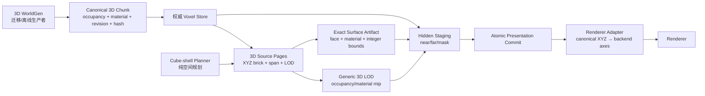

# 纯 3D 体素立方壳迁移阶段

- **日期**：2026-07-12
- **状态**：实施中（P0/P1 已完成；P2 进行中，所有新路径仍 `live_enabled=false`）
- **取代范围**：取代 [`2026-07-11-3d-lod-sliding-window.md`](2026-07-11-3d-lod-sliding-window.md) 中“保留 2.5D WorldGen 内容前提再扩展远景窗口”的迁移口径；该旧稿保留为历史设计输入
- **影响范围**：WorldGen 生成边界、canonical chunk/source page、Voxia near/far coverage、LOD 材质、presentation ownership、调试与验收
- **不改变**：服务端权威、H gate、confirmed truth 来源、编辑事务、ChunkProcess 所有权

## 1. 目标与非目标

本阶段把体素空间与流送正式收敛为纯三维模型：近场是精确 chunk 立方窗口，中远场是稀疏、嵌套的 3D brick 立方壳。当前生成结果即使主要表现为地表，也只是 `density(x,y,z)` 的一种内容结果，不能把 height、column 或水平面写进公共契约。

本阶段不是通过扩大垂直半径制造一个实心巨型立方体。远景只规划稀疏 brick 壳，空 brick 可由 occupancy 摘要表达；精确体素只在 near window、权威 delta 区域和显式高保真焦点存在。

本阶段也不把 3D 化当作现有闪烁、贴图拉伸或材质错误的替代修复。以下三项仍是独立、必须由各自系统维护的不变量：

1. 材质系统维护坐标精度和近远采样一致性；
2. LOD 派生系统维护 occupancy/material 的确定性来源；
3. Presentation 系统维护任意一帧无重叠、无空洞的原子所有权。

## 2. 系统边界



### 2.1 WorldGen

WorldGen 只承诺：给定明确的算法版本、配置、seed 和 `chunk_xyz`，生成确定性的 canonical 3D chunk 或明确失败。它可以在内部复用任意噪声与算子，但不得向下游暴露 `column_height`、heightmap、terrain-only、全高度列或 `Y=0` 身份。

更换 WorldGen 只能改变 canonical 内容与 `content_version`，不能改变 streaming、LOD、handoff、material 或 renderer 的代码路径。

### 2.2 Cube-shell planner

Planner 是纯空间函数，只消费请求中心、near cube 与 ring 配置，输出轴对齐 3D cell：

```text
origin_tile_xyz
span_tiles
ring_index
lod_level
requested_center_xyz
quantized_anchor_xyz
```

Planner 不读取 WorldGen、source page、player actor、UObject 或 renderer。每个 ring 按自己的 `span_tiles` 量化网格；粗 cell 只有完全落入细层保证覆盖时才可剔除，partial cell 必须保留为 underlap，禁止产生缝洞。

### 2.3 Source page 与 LOD

生产 source page identity 至少包含：

```text
scene_id + content_version + source_revision + diff_chain_hash
+ origin_xyz + span_tiles + lod_level + material_schema_version
```

`renderer_artifact_version` 不属于 canonical source page identity，只能进入从 page
派生出的 renderer cache/artifact key。更换 renderer backend 或顶点格式不得让同一份
canonical 内容变成另一份体素真值。

精确表面使用所属实心体素的 material id。合并只允许发生在材质和采样规则相同的面之间。粗 LOD 必须携带六方向 face-material 摘要或显式 material mip；不得以 source kind、WorldGen 或“表层地形”特判材质。

### 2.4 Presentation

build budget 只限制 hidden staging，不得让部分新 generation 提前可见。提交前必须同时满足：

- near component 已准备；
- far patch generation 已准备；
- ownership mask 已上传；
- render-thread fence 已确认相应资源可消费。

同一 generation 在帧边界原子提交。Fade 只允许作为提交后的视觉效果，不能承担所有权正确性。

## 3. 自维护不变量

| 系统 | 自己维护的不变量 | 显式失败 |
| --- | --- | --- |
| WorldGen materializer | 相同输入生成相同 canonical chunk/hash | 算法/配置不支持、生成失败、hash 不一致 |
| Voxel store | confirmed chunk 版本连续且缺块不等于空气 | 缺 snapshot、delta gap、baseline/H gate 失败 |
| Cube-shell planner | XYZ 对称、预算有界、无洞覆盖、稳定 cell identity | ring 非单调、span 非法、坐标溢出、预算超限 |
| Source pages | expected/present/hash/material schema 全匹配 | 缺页、旧格式、hash mismatch、版本不兼容 |
| LOD builder | occupancy/material 只派生自 canonical source | 缺 source、混合材质无法按契约归约 |
| Presentation | 每帧 `overlap_count=0` 且 `gap_count=0` | fence 未完成、generation 不一致、资源未就绪 |
| Renderer | 同一世界点与表面方向近远采样一致 | 材质函数/vertex format 契约不匹配 |

## 4. 可观测面先行

新增或扩展 CLI/observe 时使用结构化字段，不以截图作为唯一证据：

- `voxel_shell_plan`：requested center、per-ring quantized anchor/span/cell count、总 cell、预算、错误；
- `voxel_pages_v2_probe`：page codec、identity、expected/present/missing/hash/size/payload identity 与 schema 正交性；
- `voxel_shell_stage_probe`：计划页、加载页、派生 artifact、总 cell 预算、全有或全无发布数；
- `voxel_surface_preview`：fixture、world origin、cell size、raw face/material histogram、
  exact quad、adapter mesh、component/register/upload、材质路径、Real-RHI 状态；
- `voxel_presentation_trace`：desired/staged/live generation、near/far/mask ready、fence state、overlap/gap、instant-swap patch；
- `voxel_material_audit`：精确面、归约面、mixed/split 数、缺失 material 数；
- `.demo/observe/` 连续帧产物：固定相机下 X/Y/Z 单轴跨界、快速折返、传送。

## 5. 分阶段实施

### P0：决策、观测与回归基线（已完成）

- 本决策稿和旧结论取代关系就位；
- 冻结上述不变量与测试矩阵；
- 首个纯 3D planner 只以 automation test 运行，不切换 live 路径。

### P1：纯 3D 空间与 canonical source 契约（已完成）

- 新增 WorldGen 无关的 cube-shell planner；
- 新增结构化 XYZ cell/page identity；
- 定义 canonical chunk/source reader，区分 missing 与 air；
- 加入负坐标、三轴移动、量化中心、预算与溢出测试。

### P2：通用 3D occupancy/material artifact（进行中）

- source page 升级为 XYZ brick + span + LOD；
- 构建六方向 occupancy/material mip；
- 使用洞穴、悬挑、浮空体和混合材质 fixture；
- 把 plan + page gate + material mip 组成全有或全无的 hidden staging batch；
- 从同一 v2 page 构建精确逐材质 surface artifact；greedy 只合并同朝向同材质面；
- 显式适配 canonical `X/Y(up)/Z` 到 UE `X/Z/Y`，大世界位置只放 Actor transform；
- 用材质侧世界坐标三轴投影移除调试链的绝对顶点 UV 依赖，并完成 ±8km Real-RHI；
- 删除 far material 的 WorldGen `SurfaceMaterialId` 特判。

### P3：原子近远场 presentation

- near/far/mask 双缓冲 hidden staging；
- render-thread fence；
- generation 原子提交；
- 缩小 patch 空间单元，删除因 quad 上限绕过切换的正确性分支。

### P4：3D WorldGen materialization

- 服务端/NIF 公共 API 改为 `chunk_xyz -> canonical chunk`；
- 客户端 dev preview 也经相同 canonical store 注入；
- streaming、SVO、renderer 删除 WorldGen source kind 和算法分支。

### P5：切流与遗留退役

- 生产默认启用 3D cube-shell/source pages；
- 完成 X/Y/Z 长巡航与 baseline hard-fail 验收；
- heightmap、column cache、VHI、`CenterTile.Y==0` 只保留显式、可退出的协议兼容层，随后归档删除；
- 核对 Gate 与 web oracle 的 `0x6A/0x6B` 冲突，新 3D 协议只追加不复用编号。

## 6. 测试矩阵

| 层次 | 必测内容 | 门槛 |
| --- | --- | --- |
| Planner unit | 正负坐标、X/Y/Z 对称、三轴移动、每环独立量化、预算、溢出 | 无洞；默认 radius 72 总 cell `< 50,000` |
| Source contract | missing/air/solid/mixed、旧格式、缺页、hash mismatch | 全部显式结果，无 silent air/fallback |
| Metamorphic | 平地与洞穴/悬挑两种生成器走同一管线 | 下游测试和代码路径不变 |
| Material | 每面 material、同材质 merge、异材质 split、负坐标世界投影 | near/far 同点采样一致 |
| Presentation | 冷启动、相邻跨界、X/Y/Z、快速折返、传送 | 每帧 overlap/gap 均为 0 |
| Real-RHI | ±8km UV、连续帧 ROI、完整 near+far 性能 | 无拉伸；无中间态闪烁；性能预算单独报告 |
| Authority | H gate、snapshot/delta、编辑回流 | 3D 迁移不改变确认态来源 |

## 7. 进度日志

- **2026-07-12 / P0 启动**：用户拍板不再保留 2.5D heightmap 作为设计概念，3D 立方壳升级为下一主线。完成现有 WorldGen、coverage、SVO、材质和 presentation 耦合审计，确认 UV 半精度、WorldGen 表层材质特判和非原子近远切换是三个独立根因。
- **2026-07-12 / P1 第一片开始**：新增独立 cube-shell planner，先锁 XYZ 空间、量化、预算和失败契约；不修改 live 2.5D planner，避免未完成 source/presentation 迁移时污染现有运行路径。
- **2026-07-12 / P0 完成**：`voxel_shell_plan [tile_x tile_y tile_z] [near_radius]` CLI 与 `voxel_shell_plan` observe 事件落地。出生区 `[-8880,13,-11440]` 实测输出 5 环、`33,635` 个唯一 cell，低于 `50,000` 硬预算；每环直接暴露 requested center、quantized anchor、span、LOD 与 cell count，并明确 `live_enabled=false`。可复现产物写入 `.demo/observe/voxia-transport.jsonl`。
- **2026-07-12 / P1 空间内核**：新增 `FVoxiaFarFieldCubeShellPlanner`，覆盖负坐标向下量化、X/Y/Z 六方向边界、每环 span 稳定性、细层完全覆盖才剔除、身份唯一、非法 span、预算超限与坐标溢出。`Voxia.Voxel.FarFieldCubeShellPlanner`、13 项 `Voxia.Voxel.Far` 回归与 Development build 通过。
- **2026-07-12 / P1 canonical source 第一片**：新增 `IVoxiaCanonicalVoxelSource` 与 confirmed-store adapter，SVO confirmed path 已改为只通过该接口采样；`source unavailable / missing chunk / air / solid` 四态不可混淆，identity 只含 scene/content/source/diff/material，不含 WorldGen。新增 `Voxia.Voxel.CanonicalSource` 与 `Voxia.Voxel.SvoCanonicalSourceGate`；后者发现并修复了 `NormalizeConfig` 把显式缺失 `content_version` 静默补成 `dev` 的漏洞。完整 `Voxia.Voxel.SvoPreview` 回归通过。
- **2026-07-12 / P1 回归门禁**：首轮 `Voxia.Voxel` 发现 planner 测试把出生区 cell 数错误写成所有 center 的固定值；修正为“同输入 identity 集完全一致 + 总量有界”后，第二轮 32/32 通过。日志为 `clients/Voxia/Saved/Logs/voxia_pure3d_p0_p1_voxel_regression_v2.log`。
- **2026-07-12 / P1 完成、v2 page 契约**：新增通用 `FVoxiaVoxelBrickId` 与 `voxia_voxel_source_pages_v2` / `dense_material_u16_be_v1`。payload 是 X-fastest 的三维 `u16` material lattice（0=air），manifest 只绑定 scene/content/source/diff/material 与 XYZ origin/span/LOD，不再绑定 renderer artifact version。JSON 小数截断、非法路径、重复 identity、非 2 的幂 resolution、缺页、size/hash、payload identity mismatch 均硬失败。`Voxia.Voxel.CanonicalPagesV2` 通过；`voxel_pages_v2_probe -8 4 -12 2 2` 返回 `ready=true`、`materials_preserved=true`、`payload_bytes=50`。
- **2026-07-12 / P2 六向 material mip**：新增 `xyz_six_face_material_mip_v1`。每个派生 cell 分别维护 occupancy 与六个 face 的 `empty / uniform(material) / mixed`；mixed face 的 material 必须为 0，调用方只能细分或显式多材质切分，禁止挑一个表层材质拉满大面。`Voxia.Voxel.MaterialMip` 以整块异材质、封闭洞穴、贯通洞口和内部浮空体 fixture 验证同一路径；`voxel_material_audit split|cave|floating` 与同名 observe 已实跑通过。
- **2026-07-12 / P2 hidden staging 第一片**：新增 `FVoxiaVoxelShellArtifactStager`，把 cube-shell plan、v2 manifest gate、逐页二次 hash/decode 和 material mip 组合为 renderer-neutral staging batch。26 页 CLI fixture 只有全部成功才发布 26 个 artifact；缺页、身份变化或总派生 cell 超预算时发布数为 0。`Voxia.Voxel.ShellArtifactStager` 与 `voxel_shell_stage_probe -8 5 -12` 通过，后者记录 `planned/loaded/published=26/26/26`、`mixed_material_preserved=true`、`live_enabled=false`。
- **2026-07-12 / P2 回归门禁**：Development build 通过；完整 `Automation RunTests Voxia.Voxel` 找到 35 项，35 success / 0 failure / exit 0，包含新 `CanonicalPagesV2`、`MaterialMip`、`ShellArtifactStager` 与既有重型 SVO/near/far/WorldGen 兼容回归。日志为 `clients/Voxia/Saved/Logs/voxia_pure3d_p2_voxel_regression.log`。
- **2026-07-12 / P2 精确 surface artifact**：新增 `canonical_xyz_material_surface_v1`。构建器扫描三轴所有实体/空气边界，内部异材质相邻体素不出面；greedy key 同时包含 face sign 与 `MaterialId`，禁止跨材质矩形合并。每个 quad 用整数 `plane/u0/u1/v0/v1` 表示，不含 WorldGen、UE 轴、UV 或 presentation。`Voxia.Voxel.SurfaceArtifact` 对均匀块、左右分材质、封闭洞穴、内部悬浮体逐单位面校验“实体侧 material、另一侧 air、无重叠、面积/材质 histogram 守恒”。stager 现在同时原子发布 material mip 与 exact surface；任一 surface/raw-face/quad 预算失败时两类发布数都为 0。
- **2026-07-12 / P2 renderer adapter 与无 UV 调试材质**：新增 `FVoxiaVoxelSurfaceMeshAdapter`，唯一负责 canonical `X/Y(up)/Z` → UE `X/Z/Y` 与厘米缩放；网格保持组件局部坐标，大世界绝对位置只进入 Actor transform。新增 `M_VoxelWorldAligned`：WorldPosition 三轴投影 × VertexColor，DynamicMesh 主 UV 固定 `(0.5,0.5)` 且材质完全不读取 TextureCoordinate。`Voxia.Voxel.SurfaceMeshAdapter`、`SurfacePreviewPipeline`、`WorldAlignedMaterialContract` 均通过。
- **2026-07-12 / P2 Real-RHI 调试入口**：新增独立 `AVoxiaVoxelSurfacePreviewActor` 与 `voxel_surface_preview split|cave|floating [world_x world_y world_z] [cell_cm]`；它不订阅 transport、不参与 coverage/presentation，也不替换生产 WorldActor。`+8km` split：`raw_face_count=384`、`quad_count=10`、material histogram `2:192/6:192`、`component_registered/upload_complete/real_rhi=true`；`-8km` 同统计。洞穴：`raw_face_count=480`、`quad_count=15`、material histogram `2:452/6:28`。三张 1280×720 GPU 截图分别为 `clients/Voxia/Saved/voxel_surface_split_pos8km_oblique.png`、`voxel_surface_split_neg8km_oblique_final.png`、`voxel_surface_cave_pos8km_oblique.png`；纹理按 1m 世界格稳定重复，分材质边界与洞内材质可见，无大坐标拉伸。此证据只批准后续受控切流，**不等于**旧 live WorldGen/SVO 路径已修复；生产切换前仍须处理 dither/透明/发光材质变体并删除 `SurfaceMaterialId` 特判。
- **2026-07-12 / P2 exact-surface 完整回归**：Development build 成功；`Automation RunTests Voxia.Voxel` 找到 39 项，39 success / 0 failure / exit 0。新增 `SurfaceArtifact`、`SurfaceMeshAdapter`、`SurfacePreviewPipeline`、`WorldAlignedMaterialContract` 与既有 `SvoPreview`、`SvoSlidingFollow`、`WorldGenV1` 全部同轮通过。日志为 `clients/Voxia/Saved/Logs/voxia_pure3d_p2_surface_regression.log`。
- **2026-07-12 / live UV 拉伸根因修复**：用户在完整 `L_WorldGenSvoPreview` 的 `(1234m,-5678m)` 截图证明生产近/远路径仍不能保证单体素纹理尺度。根因是 `M_VoxelVertexColor` 的 `TextureCoordinate` 消费数公里绝对米 UV，而 UE 像素材质默认 `MaterialFloat=half`；在 `-5678` 附近量化步长为 4，导致一米端点塌缩或放大。`FVoxiaTerrainUv` 现按每个 quad 减去整数纹理周期，近场 greedy、紧凑 far mesh 与 DynamicMesh overlay 共用该契约；wrap 相位、每米 texel 密度和拆分/合并等价性不变。`Voxia.Voxel.FarMeshData` 与 `Voxia.Voxel.FarFieldCompactPatchUploader` 均 exit 0；Real-RHI 前后证据为 `Saved/ScreenShot_2026-07-12_125944_390.png` 与 `Saved/worldgen_svo_uv_rebased_ground.png`。这项修复独立于 cube-shell 切流，不用关闭 greedy，也不把 WorldGen 引入 renderer。
- **2026-07-12 / live v5 人工实机验收**：renderer artifact 语义版本升至 v5，确保旧绝对坐标 UV 派生物不会继续命中缓存。完整 `L_WorldGenSvoPreview` 复跑截图为 `clients/Voxia/Saved/worldgen_svo_uv_rebased_v5_ground.png`；用户确认贴图尺度观感正确，并确认窗口滑动期间未再看到空洞。该结论验收的是当前 live UV 数值契约与既有滑窗路径的本轮可见回归，不代表 P3 generation 原子提交已经实现，也不批准保留 WorldGen `SurfaceMaterialId` 特判；逐体素材质和纯 3D live coverage 仍按 P2/P3 后续切流。
