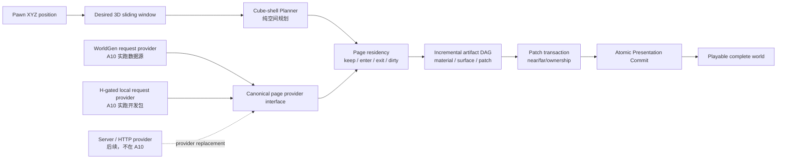
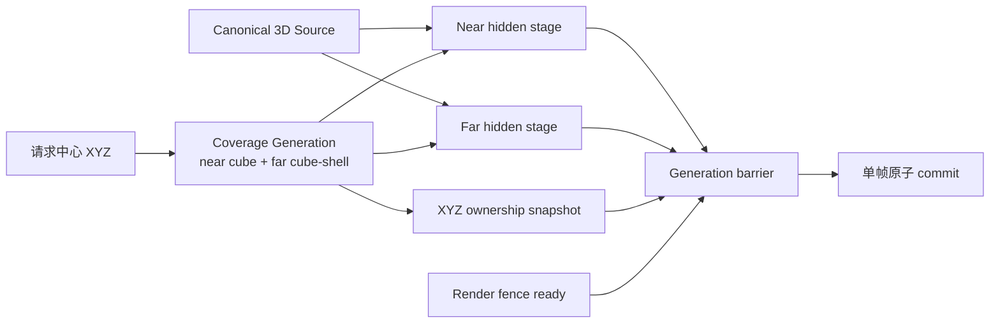

# 里程碑 A 扩展：完整 3D 体素立方壳与客户端流送

- **日期**：2026-07-12
- **状态**：实施中（扩展后的里程碑 A；A6-A9 只完成内核闭环，A10 正在补齐 WorldGen 驱动的完整客户端场景与增量滑窗；里程碑 B/C 均未开始）
- **取代范围**：取代 [`2026-07-11-3d-lod-sliding-window.md`](../../90-obsolete/voxel-far-field/2026-07-11-3d-lod-sliding-window.md) 中“保留 2.5D WorldGen 内容前提再扩展远景窗口”的迁移口径
- **影响范围**：WorldGen 生成边界、canonical chunk/source page、Voxia near/far coverage、LOD 材质、presentation ownership、调试与验收
- **不改变**：服务端权威、H gate、confirmed truth 来源、编辑事务、ChunkProcess 所有权

## 0. 里程碑定位

原里程碑 A 只覆盖客户端 8km 分层渲染正确性。A1-A5 收口后，连续实跑暴露的真正下一层问题是客户端数据如何持续流入、near/far 如何在三轴移动中保持唯一 owner，以及旧二维远景如何升级为完整三维而不引入第二真值。因此 A 扩展如下；**这些已经完成或正在完成的工作不能重记为 B**。

| 步骤 | 目标 | 当前状态 |
| --- | --- | --- |
| A1-A5 | tier、分组件 StaticDraw、greedy merge、seam/fade/collar、紧凑顶点与 cache 卫生 | 已完成，阶段稿已归档 |
| A6 | near 连续 generate/apply、compact store、per-chunk renderer、bounded observe/pump | 已完成 |
| A7 | near/far 双向 ownership、retirement lease、垂直活性、快速折返与联合性能 | 已完成 |
| A8 | XYZ cube-shell、canonical pages、六向 material mip、coverage-resolved exact surface | 内核已完成（dev 路径）；不代表完整客户端场景 |
| A9 | source-neutral scene stage、generation barrier、真实 fence/scene host、dev Real-RHI 单次三维切代 | 内核已完成；不代表滑窗或持续数据流送 |
| A10 | 唯一生产组合根、WorldGen 正常入场、同源 near/far、自动 XYZ 滑窗、请求式 page residency、可取消增量 DAG、稳定 patch 分块呈现、本地 H-gated provider、三轴长巡航 | 实施中；唯一根、Pure3D far S2/S3/S2L 与 S4/S5 artifact/stable-patch 首轮已实跑；统一 near/far transaction、延迟预算与完整 route 待完成，见 [独立作战任务](2026-07-12-a10-cancellable-incremental-voxel-shell-streaming.md) |

当前先用客户端 WorldGen 与 H-gated 本地开发包把客户端系统跑清楚：正常进入场景即形成完整 near/far 世界，真实 pawn 持续驱动滑窗与数据泵。`LoadExpectedBatch` 保持 exact-set 原子磁盘 batch 语义；独立本地 request provider 已接入 Pure3D far 的正式增量 worker，逐代只读取 `enter/dirty` 请求页且失败不回退 WorldGen。成熟 near 仍使用 WorldGen，故本地根是显式 mixed source 迁移态；生产投影契约和服务器流送不进入 A10。以后接服务器只能替换 provider。里程碑 B/C 仍未开始，当前 resume 不得跳到 B1，也不得提前修改 `apps/*`。

## 1. 目标与非目标

本阶段把体素空间与流送正式收敛为纯三维模型：近场是精确 chunk 立方窗口，中远场是稀疏、嵌套的 3D brick 立方壳。当前生成结果即使主要表现为地表，也只是 `density(x,y,z)` 的一种内容结果，不能把 height、column 或水平面写进公共契约。

本阶段不是通过扩大垂直半径制造一个实心巨型立方体。远景只规划稀疏 brick 壳，空 brick 可由 occupancy 摘要表达；精确体素只在 near window、权威 delta 区域和显式高保真焦点存在。

本阶段也不把 3D 化当作现有闪烁、贴图拉伸或材质错误的替代修复。以下三项仍是独立、必须由各自系统维护的不变量：

1. 材质系统维护坐标精度和近远采样一致性；
2. LOD 派生系统维护 occupancy/material 的确定性来源；
3. Presentation 系统维护任意一帧无重叠、无空洞的原子所有权。

## 2. 系统边界



A10 已实跑两条实线客户端路径：WorldGen 与 H-gated 本地开发包；两者下游共用同一 request/result、residency、DAG 与 patch transaction。虚线只表示未来服务器/HTTP adapter；服务器接入不得成为客户端 scene lifecycle、滑窗和 patch transaction 的缺失补丁。

### 2.1 WorldGen

WorldGen 只承诺：给定明确的算法版本、配置、seed 和 `chunk_xyz`，生成确定性的 canonical 3D chunk 或明确失败。它可以在内部复用任意噪声与算子，但不得向下游暴露 `column_height`、heightmap、terrain-only、全高度列或 `Y=0` 身份。

A10 中 WorldGen 必须实现请求式 canonical page provider：只为客户端滑窗的 `enter/dirty` page 供数，支持有界取消，并把已完成 page 交给公共 residency。更换 WorldGen 只能改变 canonical 内容与 `content_version`，不能改变 scene lifecycle、streaming、LOD、handoff、material 或 renderer 的代码路径。

### 2.2 Cube-shell planner

Planner 是纯空间函数，只消费请求中心、near cube 与 ring 配置，输出轴对齐 3D cell：

```text
origin_tile_xyz
span_tiles
ring_index
lod_level
requested_center_xyz
quantized_anchor_xyz
```

Planner 不读取 WorldGen、source page、player actor、UObject 或 renderer。每个 ring 按自己的 `span_tiles` 量化网格；粗 cell 只有完全落入细层保证覆盖时才可剔除，partial cell 必须保留为 underlap，禁止产生缝洞。

### 2.3 Source page 与 LOD

生产 source page identity 至少包含：

```text
scene_id + content_version + source_revision + diff_chain_hash
+ origin_xyz + span_tiles + lod_level + material_schema_version
```

`renderer_artifact_version` 不属于 canonical source page identity，只能进入从 page
派生出的 renderer cache/artifact key。更换 renderer backend 或顶点格式不得让同一份
canonical 内容变成另一份体素真值。

精确表面使用所属实心体素的 material id。合并只允许发生在材质和采样规则相同的面之间。粗 LOD 必须携带六方向 face-material 摘要或显式 material mip；不得以 source kind、WorldGen 或“表层地形”特判材质。

### 2.4 Presentation

build budget 只限制 hidden staging，不得让部分新 generation 提前可见。提交前必须同时满足：

- near component 已准备；
- far patch generation 已准备；
- ownership mask 已上传；
- render-thread fence 已确认相应资源可消费。

同一 generation 在帧边界原子提交。Fade 只允许作为提交后的视觉效果，不能承担所有权正确性。

### 2.5 Live 三维 coverage 与所有权切流决策

当前 live 路径把三个本应正交的概念压进了二维 `near-skip`：

1. near 数据窗口：哪些 XYZ chunk 已有 canonical truth；
2. near 呈现所有权：同一 generation 中哪些 XYZ 体积由精确 near 负责；
3. far 几何覆盖：哪些 XYZ brick/page 需要加载和派生。

WorldGen/source-pages SVO 现把 `CenterTile.Y` 归零，far `near-skip` 又只比较 X/Z。
玩家上升后 near 垂直窗口离开地面，但 far 仍在地面投影上切除一个无限高柱体，地面中央
于是同时失去 near 与 far owner。水平滑窗无洞只证明同一 Y 带内收敛，不能证明三维窗口成立。

本阶段采用以下不可退让的切流契约：

- coverage generation 只含 requested XYZ center、near cube、far cube-shell cell identity、
  canonical source identity 与 generation id，不含 WorldGen、UObject、材质或 renderer backend；
- near owner 由该 generation 的 **resolved canonical chunk volume** 决定，空气 chunk 也属于
  resolved/owned；不能用“是否生成了可见 component”代替所有权；
- far cell 的空间规划允许边界 underlap，但任意 tile 必须通过确定性的“最细 ring 优先”
  解析到唯一 far owner；renderer 只能显示 owner cell，不能把 underlap 变成双写；
- 新 generation 必须同时 stage near、far、ownership 与 render fence。任何部分失败都保留旧
  live generation；禁止先改中心、先挖洞、先隐藏旧组件或用 fade 承担正确性；
- live 切换后删除几何构建期二维 `near-skip`。near/far 裁剪只消费同一 generation 的 XYZ
  ownership snapshot；高空、地下、洞穴与浮空体不再需要 source-kind 特判。



## 3. 自维护不变量

| 系统 | 自己维护的不变量 | 显式失败 |
| --- | --- | --- |
| WorldGen materializer | 相同输入生成相同 canonical chunk/hash | 算法/配置不支持、生成失败、hash 不一致 |
| Voxel store | confirmed chunk 版本连续且缺块不等于空气 | 缺 snapshot、delta gap、baseline/H gate 失败 |
| Cube-shell planner | XYZ 对称、预算有界、无洞覆盖、稳定 cell identity | ring 非单调、span 非法、坐标溢出、预算超限 |
| Source pages | expected/present/hash/material schema 全匹配 | 缺页、旧格式、hash mismatch、版本不兼容 |
| LOD builder | occupancy/material 只派生自 canonical source | 缺 source、混合材质无法按契约归约 |
| Presentation | 每帧 `overlap_count=0` 且 `gap_count=0` | fence 未完成、generation 不一致、资源未就绪 |
| Renderer | 同一世界点与表面方向近远采样一致 | 材质函数/vertex format 契约不匹配 |

## 4. 可观测面先行

新增或扩展 CLI/observe 时使用结构化字段，不以截图作为唯一证据：

- `voxel_shell_plan`：requested center、per-ring quantized anchor/span/cell count、总 cell、预算、错误；
- `voxel_pages_v2_probe`：page codec、identity、expected/present/missing/hash/size/payload identity 与 schema 正交性；
- `voxel_shell_stage_probe`：计划页、加载页、派生 artifact、总 cell 预算、全有或全无发布数；
- `voxel_worldgen_canonical_shell_probe`：WorldGen 物化页、显式空气页、含实体页、identity
  绑定、coverage/source fingerprint 与通用 material/surface generation stage 发布数；
- `voxel_surface_preview`：fixture、world origin、cell size、raw face/material histogram、
  exact quad、adapter mesh、component/register/upload、材质路径、Real-RHI 状态；
- `voxel_presentation_trace`：desired/staged/live generation、near/far/mask ready、fence state、overlap/gap、instant-swap patch；
- `voxel_coverage_ownership_probe`：requested XYZ center、near cube、far candidate/owner、
  ground/current-altitude 样本、far-far overlap candidate 数、最终 owner 与 gap；
- `voxel_presentation_generation_probe`：乱序 ready、stale generation、supersede、failure、
  fence 前后 commit 结果，证明只有同一 generation 的四项资源可晋升 live；
- `pure3d_world_state`：dev-only 新组合根的 desired/observed/in-flight/live XYZ center、worker
  分段耗时、near/far quads、真实 fence、scene submit 与退休代际；
- `pure3d_world_recenter x y z [small|default]` 与 stdio `until_pure3d_world_ready`：三轴手动换代与
  可自动轮询的同中心 live 门槛；
- `voxel_world_composition_state` / `voxel_world_root_state` / stdio `until_voxel_world_root_ready`：
  唯一 `production_all_features` 根的顶层选择、near/far 职责、settled/geometry、far live 与 XYZ center 一致性；
- `voxel_material_audit`：精确面、归约面、mixed/split 数、缺失 material 数；
- `.demo/observe/` 连续帧产物：固定相机下 X/Y/Z 单轴跨界、快速折返、传送。

## 5. 分阶段实施

### P0：决策、观测与回归基线（已完成）

- 本决策稿和旧结论取代关系就位；
- 冻结上述不变量与测试矩阵；
- 首个纯 3D planner 只以 automation test 运行，不切换 live 路径。

### P1：纯 3D 空间与 canonical source 契约（已完成）

- 新增 WorldGen 无关的 cube-shell planner；
- 新增结构化 XYZ cell/page identity；
- 定义 canonical chunk/source reader，区分 missing 与 air；
- 加入负坐标、三轴移动、量化中心、预算与溢出测试。

### P2 / A8：通用 3D occupancy/material artifact（新路径已完成）

- source page 升级为 XYZ brick + span + LOD；
- 构建六方向 occupancy/material mip；
- 使用洞穴、悬挑、浮空体和混合材质 fixture；
- 把 plan + page gate + material mip 组成全有或全无的 hidden staging batch；
- 从同一 v2 page 构建精确逐材质 surface artifact；greedy 只合并同朝向同材质面；
- 显式适配 canonical `X/Y(up)/Z` 到 UE `X/Z/Y`，大世界位置只放 Actor transform；
- 用材质侧世界坐标三轴投影移除调试链的绝对顶点 UV 依赖，并完成 ±8km Real-RHI；
- 新路径不读取 WorldGen `SurfaceMaterialId`；旧 live 特判的物理删除留到 authority 切流后的兼容层整体退役。

### P3 / A9：原子近远场 presentation（dev 新路径已完成）

- near/far/mask 双缓冲 hidden staging；
- render-thread fence；
- generation 原子提交；
- P3 的单代 barrier/fence 仍是基底；A10 现已把 Pure3D far host 升级为 retained/rebuilt/removed stable patch transaction，但成熟 near 尚未进入同一 transaction，因此不能反向把 P3 写成统一 near/far 已完成。

### P4 / A9：3D WorldGen fixture materialization（客户端 dev 路径已接通）

- 客户端 dev preview 经通用 canonical store 注入；
- streaming、artifact、renderer 不读取 WorldGen source kind 和算法；
- WorldGen 只实现 fixture provider，不承担 H gate 或生产 confirmed truth。

### P5 / A10：WorldGen 驱动的完整客户端场景与增量滑窗（实施中）

> 当前主攻任务：[`A10 WorldGen 驱动的完整客户端 3D 滑动世界`](2026-07-12-a10-cancellable-incremental-voxel-shell-streaming.md)。该文档冻结场景 lifecycle、自动滑窗、可替换 canonical request provider、差集、取消、residency、依赖 DAG、stable patch transaction、可观测面和验收矩阵；本节只保留上位范围。

- **已完成 S1a**：普通 WorldGen 场景只生成 `AVoxiaUnifiedVoxelWorldActor` 顶层 root；成熟 near-only 模块与 Pure3D far-only 模块自动跟随同一 pawn，根级门槛要求 near settled、far live 与 center aligned。legacy/Pure3D standalone 只能显式 probe/compatibility；
- **S2-S5 far 首轮已落地**：WorldGen/scripted/H-gated local request provider、required/keep/enter/exit planner、immutable residency/lease/LRU、cooperative cancellation、dependency-keyed material/surface cache 与 absolute XYZ stable-patch transaction 已进入唯一根实跑；
- **待完成 S1b/S4**：把当前 root-owned 两个迁移期 actor 模块收敛为共享 source identity、page residency、coverage generation 与 scene transaction；Pure3D far 已有 scene phase/失败保留/EndPlay、shared artifact ref、parallel surface、worker plan 与预算化 lease release，hidden near mesh 已消除；仍缺根级 HUD、反向依赖索引与增量/full oracle；
- default 相邻 +X 只请求 `1517/33752` page，material/surface reused=`32199/29533`，far patch retained/rebuilt=`175/41`；最新 Real-RHI artifact/worker 约 `0.55-0.60s / 0.91-0.95s`，far GameThread 分段约 `4.5-7.5ms`，仍须完成连续巡航与离群帧预算；
- default 本地 route union pack=`35269` pages / `336571434` bytes；冷窗读取 `33752` 页，相邻 +X 只读 `1517` 页并复用 `32235` residency keep。错误 H 时根级 source authorization=false、零发布且不回退 WorldGen；当前 near 仍用 WorldGen，所以 source mode 明确为 mixed；
- 完成出生落地、水平、垂直飞行、对角、快速折返、传送、回到地面与长巡航的 `frame_perf + generation trace + Real-RHI`；
- 统一 opaque/dither/透明/发光 world-aligned material family 与 near/far 同点 audit；
- H-gated 本地 request provider 已进入 A10；网络/HTTP provider、服务器流送、launcher 真包和在线切流仍不进入 A10。以后在线接入只能新增 provider，不能再补客户端 lifecycle、滑窗、cache 或 presentation；
- 新路径不依赖 heightmap、column、VHI、`CenterTile.Y==0`、二维 near-skip 或 `SurfaceMaterialId`；旧在线兼容代码在后续 authority 切流后整体退役。

### A10 退出门槛

- 正常场景入口无需 CLI 即达到 `scene_playable=true`，地面首窗 near/far 同时可见且默认 `auto_follow=true`；
- 真实 pawn 步行、飞行、对角和传送自动驱动三轴滑窗；不得表现为固定静态世界或每跨 tile 整套换图；
- 相邻重心不得重新物化全部约 3.3 万 pages；结构化统计必须证明 overlap reuse、dirty patch 数与取消计数；
- stale/superseded worker 不能提交，并且必须在一个配置 work quantum 内确认取消；provider 失败时旧 live generation 持续可见；
- retained patch 不能重新 `SetMesh`、register 或上传，增量结果必须与 clean full-build oracle 一致；
- 地面→高空→地面和三轴长巡航每帧 `gap=0`、`overlap=0`，且无旧二维中心或 source-kind 分支参与 owner；
- GameThread 只消费完整 stage，分位数与超帧计数由 `frame_perf` 报告；冷构建/后台耗时单独报告，不能混成 GT 成本；
- 用户操作、automation、CLI/observe 三入口全部可复现。

## 6. 测试矩阵

| 层次 | 必测内容 | 门槛 |
| --- | --- | --- |
| Scene lifecycle | WorldGen 正常入场、首窗 loading/playable、退出 | 无需手工 recenter；near/far 同代完整；退出有界回收 |
| Sliding flow | 水平/垂直/对角/折返/传送、auto-follow | desired/live 收敛；keep 复用；queue≤1；无静态整壳换图 |
| Planner unit | 正负坐标、X/Y/Z 对称、三轴移动、每环独立量化、预算、溢出 | 无洞；默认 radius 72 总 cell `< 50,000` |
| Source contract | missing/air/solid/mixed、旧格式、缺页、hash mismatch | 全部显式结果，无 silent air/fallback |
| Metamorphic | 平地与洞穴/悬挑两种生成器走同一管线 | 下游测试和代码路径不变 |
| Material | 每面 material、同材质 merge、异材质 split、负坐标世界投影 | near/far 同点采样一致 |
| Presentation | 冷启动、相邻跨界、X/Y/Z、快速折返、传送 | 每帧 overlap/gap 均为 0 |
| Real-RHI | ±8km UV、连续帧 ROI、完整 near+far 性能 | 无拉伸；无中间态闪烁；性能预算单独报告 |
| Provider boundary | WorldGen 与 scripted canonical provider 同序列 | 下游无 WorldGen 分支；未来服务器只需 provider adapter |
| Authority 边界 | 文档/代码静态检查 | WorldGen 仅 dev/offline；3D 客户端闭环不改变在线确认态来源 |

## 7. 进度日志

- **2026-07-12 / P0 启动**：用户拍板不再保留 2.5D heightmap 作为设计概念，3D 立方壳升级为下一主线。完成现有 WorldGen、coverage、SVO、材质和 presentation 耦合审计，确认 UV 半精度、WorldGen 表层材质特判和非原子近远切换是三个独立根因。
- **2026-07-12 / P1 第一片开始**：新增独立 cube-shell planner，先锁 XYZ 空间、量化、预算和失败契约；不修改 live 2.5D planner，避免未完成 source/presentation 迁移时污染现有运行路径。
- **2026-07-12 / P0 完成**：`voxel_shell_plan [tile_x tile_y tile_z] [near_radius]` CLI 与 `voxel_shell_plan` observe 事件落地。出生区 `[-8880,13,-11440]` 实测输出 5 环、`33,635` 个唯一 cell，低于 `50,000` 硬预算；每环直接暴露 requested center、quantized anchor、span、LOD 与 cell count，并明确 `live_enabled=false`。可复现产物写入 `.demo/observe/voxia-transport.jsonl`。
- **2026-07-12 / P1 空间内核**：新增 `FVoxiaFarFieldCubeShellPlanner`，覆盖负坐标向下量化、X/Y/Z 六方向边界、每环 span 稳定性、细层完全覆盖才剔除、身份唯一、非法 span、预算超限与坐标溢出。`Voxia.Voxel.FarFieldCubeShellPlanner`、13 项 `Voxia.Voxel.Far` 回归与 Development build 通过。
- **2026-07-12 / P1 canonical source 第一片**：新增 `IVoxiaCanonicalVoxelSource` 与 confirmed-store adapter，SVO confirmed path 已改为只通过该接口采样；`source unavailable / missing chunk / air / solid` 四态不可混淆，identity 只含 scene/content/source/diff/material，不含 WorldGen。新增 `Voxia.Voxel.CanonicalSource` 与 `Voxia.Voxel.SvoCanonicalSourceGate`；后者发现并修复了 `NormalizeConfig` 把显式缺失 `content_version` 静默补成 `dev` 的漏洞。完整 `Voxia.Voxel.SvoPreview` 回归通过。
- **2026-07-12 / P1 回归门禁**：首轮 `Voxia.Voxel` 发现 planner 测试把出生区 cell 数错误写成所有 center 的固定值；修正为“同输入 identity 集完全一致 + 总量有界”后，第二轮 32/32 通过。日志为 `clients/Voxia/Saved/Logs/voxia_pure3d_p0_p1_voxel_regression_v2.log`。
- **2026-07-12 / P1 完成、v2 page 契约**：新增通用 `FVoxiaVoxelBrickId` 与 `voxia_voxel_source_pages_v2` / `dense_material_u16_be_v1`。payload 是 X-fastest 的三维 `u16` material lattice（0=air），manifest 只绑定 scene/content/source/diff/material 与 XYZ origin/span/LOD，不再绑定 renderer artifact version。JSON 小数截断、非法路径、重复 identity、非 2 的幂 resolution、缺页、size/hash、payload identity mismatch 均硬失败。`Voxia.Voxel.CanonicalPagesV2` 通过；`voxel_pages_v2_probe -8 4 -12 2 2` 返回 `ready=true`、`materials_preserved=true`、`payload_bytes=50`。
- **2026-07-12 / P2 六向 material mip**：新增 `xyz_six_face_material_mip_v1`。每个派生 cell 分别维护 occupancy 与六个 face 的 `empty / uniform(material) / mixed`；mixed face 的 material 必须为 0，调用方只能细分或显式多材质切分，禁止挑一个表层材质拉满大面。`Voxia.Voxel.MaterialMip` 以整块异材质、封闭洞穴、贯通洞口和内部浮空体 fixture 验证同一路径；`voxel_material_audit split|cave|floating` 与同名 observe 已实跑通过。
- **2026-07-12 / P2 hidden staging 第一片**：新增 `FVoxiaVoxelShellArtifactStager`，把 cube-shell plan、v2 manifest gate、逐页二次 hash/decode 和 material mip 组合为 renderer-neutral staging batch。26 页 CLI fixture 只有全部成功才发布 26 个 artifact；缺页、身份变化或总派生 cell 超预算时发布数为 0。`Voxia.Voxel.ShellArtifactStager` 与 `voxel_shell_stage_probe -8 5 -12` 通过，后者记录 `planned/loaded/published=26/26/26`、`mixed_material_preserved=true`、`live_enabled=false`。
- **2026-07-12 / P2 回归门禁**：Development build 通过；完整 `Automation RunTests Voxia.Voxel` 找到 35 项，35 success / 0 failure / exit 0，包含新 `CanonicalPagesV2`、`MaterialMip`、`ShellArtifactStager` 与既有重型 SVO/near/far/WorldGen 兼容回归。日志为 `clients/Voxia/Saved/Logs/voxia_pure3d_p2_voxel_regression.log`。
- **2026-07-12 / P2 精确 surface artifact**：新增 `canonical_xyz_material_surface_v1`。构建器扫描三轴所有实体/空气边界，内部异材质相邻体素不出面；greedy key 同时包含 face sign 与 `MaterialId`，禁止跨材质矩形合并。每个 quad 用整数 `plane/u0/u1/v0/v1` 表示，不含 WorldGen、UE 轴、UV 或 presentation。`Voxia.Voxel.SurfaceArtifact` 对均匀块、左右分材质、封闭洞穴、内部悬浮体逐单位面校验“实体侧 material、另一侧 air、无重叠、面积/材质 histogram 守恒”。stager 现在同时原子发布 material mip 与 exact surface；任一 surface/raw-face/quad 预算失败时两类发布数都为 0。
- **2026-07-12 / P2 renderer adapter 与无 UV 调试材质**：新增 `FVoxiaVoxelSurfaceMeshAdapter`，唯一负责 canonical `X/Y(up)/Z` → UE `X/Z/Y` 与厘米缩放；网格保持组件局部坐标，大世界绝对位置只进入 Actor transform。新增 `M_VoxelWorldAligned`：WorldPosition 三轴投影 × VertexColor，DynamicMesh 主 UV 固定 `(0.5,0.5)` 且材质完全不读取 TextureCoordinate。`Voxia.Voxel.SurfaceMeshAdapter`、`SurfacePreviewPipeline`、`WorldAlignedMaterialContract` 均通过。
- **2026-07-12 / P2 Real-RHI 调试入口**：新增独立 `AVoxiaVoxelSurfacePreviewActor` 与 `voxel_surface_preview split|cave|floating [world_x world_y world_z] [cell_cm]`；它不订阅 transport、不参与 coverage/presentation，也不替换生产 WorldActor。`+8km` split：`raw_face_count=384`、`quad_count=10`、material histogram `2:192/6:192`、`component_registered/upload_complete/real_rhi=true`；`-8km` 同统计。洞穴：`raw_face_count=480`、`quad_count=15`、material histogram `2:452/6:28`。三张 1280×720 GPU 截图分别为 `clients/Voxia/Saved/voxel_surface_split_pos8km_oblique.png`、`voxel_surface_split_neg8km_oblique_final.png`、`voxel_surface_cave_pos8km_oblique.png`；纹理按 1m 世界格稳定重复，分材质边界与洞内材质可见，无大坐标拉伸。此证据只批准后续受控切流，**不等于**旧 live WorldGen/SVO 路径已修复；生产切换前仍须处理 dither/透明/发光材质变体并删除 `SurfaceMaterialId` 特判。
- **2026-07-12 / P2 exact-surface 完整回归**：Development build 成功；`Automation RunTests Voxia.Voxel` 找到 39 项，39 success / 0 failure / exit 0。新增 `SurfaceArtifact`、`SurfaceMeshAdapter`、`SurfacePreviewPipeline`、`WorldAlignedMaterialContract` 与既有 `SvoPreview`、`SvoSlidingFollow`、`WorldGenV1` 全部同轮通过。日志为 `clients/Voxia/Saved/Logs/voxia_pure3d_p2_surface_regression.log`。
- **2026-07-12 / live UV 拉伸根因修复**：用户在完整 `L_WorldGenSvoPreview` 的 `(1234m,-5678m)` 截图证明生产近/远路径仍不能保证单体素纹理尺度。根因是 `M_VoxelVertexColor` 的 `TextureCoordinate` 消费数公里绝对米 UV，而 UE 像素材质默认 `MaterialFloat=half`；在 `-5678` 附近量化步长为 4，导致一米端点塌缩或放大。`FVoxiaTerrainUv` 现按每个 quad 减去整数纹理周期，近场 greedy、紧凑 far mesh 与 DynamicMesh overlay 共用该契约；wrap 相位、每米 texel 密度和拆分/合并等价性不变。`Voxia.Voxel.FarMeshData` 与 `Voxia.Voxel.FarFieldCompactPatchUploader` 均 exit 0；Real-RHI 前后证据为 `Saved/ScreenShot_2026-07-12_125944_390.png` 与 `Saved/worldgen_svo_uv_rebased_ground.png`。这项修复独立于 cube-shell 切流，不用关闭 greedy，也不把 WorldGen 引入 renderer。
- **2026-07-12 / live v5 人工实机验收**：renderer artifact 语义版本升至 v5，确保旧绝对坐标 UV 派生物不会继续命中缓存。完整 `L_WorldGenSvoPreview` 复跑截图为 `clients/Voxia/Saved/worldgen_svo_uv_rebased_v5_ground.png`；用户确认贴图尺度观感正确，并确认窗口滑动期间未再看到空洞。该结论验收的是当前 live UV 数值契约与既有滑窗路径的本轮可见回归，不代表 P3 generation 原子提交已经实现，也不批准保留 WorldGen `SurfaceMaterialId` 特判；逐体素材质和纯 3D live coverage 仍按 P2/P3 后续切流。
- **2026-07-12 / 高空孔洞根因与切流顺序重排**：代码审计确认 near 数据窗口本身按 XYZ 枚举，但 WorldGen/source-pages far center 强制 `Y=0`，几何 `near-skip` 只比较 X/Z；玩家上升时 near 离开地面、far 仍从地面投影切洞，形成无人拥有的体积。拒绝“高空临时关闭 near-skip”补丁；先落 renderer/source 无关的 coverage owner 与 generation barrier，再接 hidden live staging，最后一次性删除二维裁剪。
- **2026-07-12 / XYZ owner 与 generation barrier 第一片**：cube-shell plan 新增按 tile 的最细 ring 唯一 owner 解析，保留 `far_candidate_count` 观察 underlap；`FVoxiaVoxelCoverageOwnership` 以 resolved canonical chunk（含空气）优先，否则解析 far brick，无 owner 时显式 gap。`FVoxiaVoxelPresentationGenerationCoordinator` 只接受同一 generation 的 near/far/ownership/render-fence 四项 ready；stale、失败和早到 commit 均不改变旧 live。far hidden stage 另绑定 generation、coverage fingerprint 与 canonical source fingerprint，身份漂移在发布任何 mip/surface 前硬失败。Development build、`Voxia.Presentation.VoxelCoverageOwnership`、`Voxia.Presentation.VoxelPresentationGeneration`、`Voxia.Voxel.ShellArtifactStager` 均通过。
- **2026-07-12 / 非 GUI 高空证据**：`voxel_coverage_ownership_probe 11 12 -51 0 1` 返回 `legacy_projected_clip=true`，但新 owner 为 `current=near`、`ground=far`（ring 2）、`gap=false`；`voxel_presentation_generation_probe` 返回 `early_commit_rejected/old_live_retained/stale_ready_rejected/high_committed=true`。observe 写入 `.demo/observe/voxia-transport.jsonl`；两条命令仍 `live_enabled=false`，不能写成 WorldActor 已切流。
- **2026-07-12 / WorldGen→canonical 通用边界第一片**：新增 `FVoxiaWorldGenCanonicalPageMaterializer`，WorldGen 专用代码只负责把任意 XYZ brick 物化为通用 `FVoxiaCanonicalVoxelPage`；coverage、material mip、exact surface 与 generation stager 均不读取生成算法。磁盘 source pack 与内存 canonical batch 现在共用 `FVoxiaVoxelShellArtifactStager` 的预算、material 和 surface 构建核心，page provider 是唯一差异。
- **2026-07-12 / 内存 source identity 硬绑定**：首版内存 API 只接裸 pages 与调用方自报的 `ExpectedIdentity`，无法证明二者属于同一内容版本。该边界已在接 live 前收紧为 `FVoxiaCanonicalVoxelPageBatch = Identity + Pages`；WorldGen materializer 原子产出 batch，generation stager 以 batch 的实际 identity 计算 source fingerprint，伪造 revision、缺一页或非法 identity 均在发布任何 artifact 前硬失败。
- **2026-07-12 / WorldGen canonical 自动化与 CLI 证据**：Development build 通过；`Voxia.Voxel.WorldGenCanonicalPageMaterializer` success / exit 0，日志 `clients/Voxia/Saved/Logs/voxia_worldgen_canonical_stage_e2e_v2.log`。CLI 地面中心 `[11,0,-51]` 为 `planned/materialized/published=26/26/26`、显式空气/含实体页=`9/17`、material histogram=`1:1,2:97`；高空 `[11,12,-51]` 仍为 26 个显式空气页、missing=0、material/surface artifact=`26/26`，其中 surface face/quad=`0/0`。两次均 `identity_bound/complete_publication/generator_hidden_from_stage=true`，且仍明确 `live_enabled=false`。
- **2026-07-12 / compact canonical page 与完整壳容量**：canonical 内存 page 新增显式 `uniform_air / uniform_material / dense`，磁盘 `dense_material_u16_be_v1` wire schema 不变；codec 可确定性展开 compact page，通用 mip 对 uniform page 只保存一个 root，surface 对 uniform air/material 直接生成 0/6 quads。`CanonicalPagesV2`、`MaterialMip`、`SurfaceArtifact`、`WorldGenCanonicalPageMaterializer` 定向测试全部 success。CLI `[11,200,-51] default` 因各环量化 underlap 实际规划 33,725 cells（cell 数不是跨 center 常量），expected/present/missing=`33725/33725/0`；逻辑 dense 材质为 `316,530,688` bytes，page 材质值实际驻留 `67,450` bytes（不含 map/artifact 元数据），mip/surface artifacts=`33725/33725`，raw faces/quads=`0/0`。resolved air 仍是 present page，未被偷换成 missing。
- **2026-07-12 / shell 级表面邻域收紧 v2**：审计发现逐 page exact-surface 把页外一律当空气，相邻实体 page 会产生内部假表面；coverage 外部也不能继续伪装为空气，否则会在立方窗口外缘生成切面墙。`FVoxiaVoxelShellResolvedSurfaceStager` 以固定整数 subtile lattice 把所有采样映射到 near 优先、far 最细 ring 的唯一 owner；同 identity near halo 缺页、额外页或无 owner 均硬失败。27 个全实体 page 现在既无内部面，也不在有界 coverage 外缘生成人造外墙（face/quad=`0/0`）；中心 near 空气仍精确生成 `24` 个洞壁单位面，异材质实体相邻仍不出 occupancy 面，fine→coarse underlap 保持唯一 owner。`Voxia.Voxel.ShellResolvedSurfaceStager` success，日志 `clients/Voxia/Saved/Logs/voxia_shell_resolved_surface_v5.log`。
- **2026-07-12 / resolved stage 容量优化**：coverage-resolved 路径不再先构建一遍必被替换的 isolated surface；`built_isolated_surfaces=false` 成为结构化断言。uniform-air page 直接发布空 artifact，完全由自身拥有的 uniform-solid page 只采六个边界，只有 dense/underlap page 扫完整体积。默认 `[11,12,-51]` 仍完整发布 far/near=`33806/27` pages，但 resolved sample 从 `1,012,217,856` 降至 `76,830,720`（约 13.2×）；`skipped_air/boundary_uniform/full_sampled=22953/8996/1884`，同步 CLI 从约 `95s` 降至约 `8.65s`。coverage 外 unresolved sample=`278784`，不会成为空气面。
- **2026-07-12 / P3 真实资源集与 scene host**：新增 UObject/RHI 无关的 generation barrier、拥有真实 `FRenderCommandFence` 的 resource-set coordinator，以及只负责 `UDynamicMeshComponent` hidden/live/retiring 生命周期的 `UVoxiaVoxelPresentationSceneHost`。source/WorldGen/artifact 不进入 host；失败或 superseded hidden generation 由 host 自行 fence 后回收。Null-RHI 横向换代证明 generation 2 fence 前 generation 1 near/far 继续可见，提交后旧代才释放；`Voxia.Gameplay.VoxelPresentationResourceSet` 与 `Voxia.Gameplay.WorldGenVoxelShellBuilder` 均 success。
- **2026-07-12 / P4 客户端 dev 切流**：新增 `AVoxiaPure3DVoxelWorldActor` 与 `FVoxiaWorldGenVoxelShellBuilder`。GameMode 仅在同时显式传入 `-VoxiaPure3DWorld -VoxiaWorldGenPreview` 时用新组合根取代旧 `AVoxiaWorldActor`；缺少 dev source 授权时硬失败且禁止静默回退。cube-shell、WorldGen→canonical batch、resolved artifact 和 mesh 全在 worker，三轴请求合并后才把完整 scene stage 交给 host；首窗以连续 3 帧稳定 XYZ center 启动，避免构建 pawn 尚未落位的原点。CLI 为 `pure3d_world_state`、`pure3d_world_recenter`、`pure3d_world_auto_follow`，stdio 门槛为 `until_pure3d_world_ready`。
- **2026-07-12 / identity 与重复请求终审**：代码级生命周期复核发现 `small/default` 曾以不同 canonical 采样分辨率生成 payload，却共享同一 dev source identity；现分别绑定 `dev-pure3d-world-v1-s8/s32-<content_signature>`，其中签名覆盖算法形状与全部运行配置，builder 在物化前复核 frozen config，篡改 seed 会硬失败。resource-set coordinator 对同一 hidden/live descriptor 的重复 `BeginDesired` 现在保持幂等，不会误退役自己的 hidden set；无在途 worker 时 CLI 显式请求同一中心会生成新 request serial，程序 smoke 已提交 generation 2，可作为失败后的可操作重试入口。
- **2026-07-12 / WorldGen 纯 3D API 终审**：新 canonical materializer 原先仍直接调用 v1 `ColumnHeight/MaterialForColumn`，会让未来洞穴或浮空体算法改动静默生成旧列地形。现新增 generator-owned `FVoxiaWorldGenMaterialVolume` / `SampleMaterialVolume(origin_xyz, span, resolution)`；materializer 只消费 uniform/dense X-fastest 三维材质体，v1 可在自身内部继续按列缓存。volume 改造后的 `Voxia.Voxel` 为 41/41 success；随后内容签名加固的定向回归为 `WorldGenV1` + `WorldGenCanonicalPageMaterializer` 2/2、builder 1/1。完整五环 materialize/artifact/total=`516.8/12831.3/13591.7ms`，与改造前同量级。
- **2026-07-12 / 高空 Real-RHI 闭环**：新 GameMode 路径在 RTX 5060 Laptop GPU 上从地面 generation 1 `[11,0,-51]` 切到约 1.34km 高的 generation 2 `[11,12,-51]`。新代 near 全空气（`near_quads=0`），far 仍有 `291021` quads 并连续显示地表；旧代在 worker 期间保持可见，提交后经 retirement fence 回收。截图为 `clients/Voxia/Saved/pure3d_world_high_before_recenter.png`、`pure3d_world_high_during_recenter.png`、`pure3d_world_high_after_recenter.png`；排除 HUD 的 ROI 中，前→期间平均通道差 `0.799/255`、差值大于 8 的像素仅 `0.0918%`，提交后显著变化像素 `60.4%`。三张均通过 PNG 非黑屏审计；真实 RHI scene submit 为 near/far/total=`0.482/3.099/3.599ms`，主耗时仍是 worker artifact（本次约 `15.0s`），后续必须做增量复用/并行，而不是把工作移回 GameThread。
- **2026-07-12 / source-neutral scene builder**：新增 `FVoxiaCanonicalVoxelShellSceneBuilder`。`BuildPageRequest` 从 plan 确定 far shell 与 near halo 的完整 required set；`Build` 只接 identity-bound canonical batch，并复核 requested center、coverage fingerprint 与 source fingerprint 后调用 resolved generation stager。缺一页或 descriptor/source 漂移时不发布部分 artifact。`Voxia.Gameplay.CanonicalVoxelShellSceneBuilder` 通过；`clients/Voxia/Saved/Logs/voxia_pure3d_source_neutral_builder.log` 为 Gameplay 10/10 success。WorldGen builder 已降为 materialize + 调用通用 builder 的 dev adapter。
- **2026-07-12 / H-gated 原子磁盘 batch**：`FVoxiaCanonicalVoxelPages::LoadExpectedBatch` 新增更高信任入口提供的 `sha256:<64 hex>` manifest 凭证、expected identity/set 与加载前后 manifest 复核。manifest 不能自报 hash 给自己授权；page hash/size/decode/空间 identity 任一失败或加载期间 manifest 改变时，输出 batch 保持为空。`clients/Voxia/Saved/Logs/voxia_pure3d_h_gate_page_provider.log` 中 `Voxia.Voxel.CanonicalPagesV2` success。该 API 尚未接入 pure-3D actor，只能记为 A10 provider 基础，不能写成 B1 已启动。
- **2026-07-12 / 里程碑口径纠正**：本轮 cube-shell、完整 3D near/far、原子 presentation、source-neutral builder 与 H-gated client batch 均属于里程碑 A 的目标扩展；B 仍未开工。原 A1-A5、流送性能、near/far handoff 与视觉专项按文档规范归档，被纯 3D 路线推翻的旧 2.5D 三维窗口与 VHI baseline 稿移入 obsolete。
- **2026-07-12 / A10 增量流送任务建立**：用户拍板 tile 变化必须分块替换，共同 page/artifact/component 必须复用，superseded worker 不能继续完成整壳。新增 A10 独立作战任务，将差集 planner、cooperative cancellation、residency、依赖感知 DAG、stable XYZ patch transaction、CLI/observe 与三轴 Real-RHI 验收纳入 A；当前状态待实施，B/C 仍未开始。
- **2026-07-12 / A10 客户端闭环优先**：用户实机确认 pure-3D 入口当前只显示静态式 WorldGen 外壳，既有客户端 near/far、滑动窗口和数据泵没有迁入新组合根。A10 上位目标据此改为“WorldGen 驱动的完整客户端 3D 滑动世界”：先完成正常入场、同源 near/far、真实 pawn 自动 XYZ 滑窗、请求式 page residency、取消/复用与 stable patch 呈现。已有 H-gated 原子磁盘 batch loader 继续保留；尚未实现的磁盘 request/live provider 与服务器流送退出 A10 关键路径，后续接服务器只能替换 provider。
- **2026-07-12 / A10 S1a 唯一根事实**：新增顶层 composition selector 与 `AVoxiaUnifiedVoxelWorldActor`。普通 `-VoxiaWorldGenPreview` 默认进入唯一 `production_all_features` 根；GameMode 不再把成熟 2.5D 与 Pure3D 当两条正式入口。根在迁移期拥有 near-only `AVoxiaWorldActor` 和 far-only Pure3D 子模块，关闭旧 far 请求；S1a 当时仍构建后隐藏 Pure3D near aggregate，后续 S5 已取消该 mesh/component 的构建与注册。`voxel_world_root_state` 只有 near settled、far live、XYZ center aligned 才 ready。Development build、selector automation、Null-RHI、默认 Real-RHI 地面/高空均通过；地面 near/far=`78451/359397 quads`，高空 near=`0 geometry`、far=`288445 quads` 且无二维柱洞。S1a 高空 full build 当时仍耗约 `12.683s`，所以该切片只完成联合根；后续 S2-S5 增量链见下方进度项。
- **2026-07-12—13 / A10 S2-S5 far 增量链**：新增 request provider、coverage diff、page residency、cooperative cancellation、artifact dependency cache、shared immutable refs、parallel resolved surface、worker launch plan 与 stable XYZ patch host。default 相邻 +X 的 `required/keep/enter/exit=33752/32235/1517/1517`，provider=`1517`；material `32199 reused / 1526 rebuilt`、surface `29533 / 4219`；far patch `216 required / 175 retained / 41 rebuilt / 0 removed`，Null/Real-RHI 均 `53/53` geometry components visible。统一根不再构建 Pure3D hidden near mesh；Real-RHI 双截图非黑比例均 `1.0`。最新相邻 worker 约 `0.91-0.95s`，但 near/far 统一 transaction、反向依赖/full oracle、离群帧与完整 route 未完成。
- **2026-07-13 / A10 S2L 本地 provider**：新增外部 H + expected identity 的 immutable manifest open gate、按请求逐页验证且全批原子发布的 `local_disk` provider、provider-neutral builder 绑定、唯一根参数接线与 `voxel_local_pack_build`。default 本地包在唯一根冷窗/相邻 +X 分别读取 `33752/1517` 页，相邻复用 `32235` 页并保持 `175/216` far patch；统一材质页解码为 compact storage 后 resident material 回到约 `19MB`。错误 H 根级硬失败、零 generation/residency/artifact/component 且无 WorldGen fallback。成熟 near 仍未消费本地 provider。
- **当前切流边界**：以上只批准扩展 A 的客户端 WorldGen/本地开发包唯一联合根与 Pure3D far 增量链。根内两个迁移模块尚未共享 provider/residency/generation/transaction；反向依赖优化、三轴连续巡航、HUD 与完整材质族仍未完成。在线 confirmed provider、权威 delta 合并和默认在线接线属于后续；旧 `WorldActor` 的 heightmap/VHI/SVO/二维 near-skip 代码尚未删除，在统一根中已禁用 far 职责，后续应抽取 near 服务并随 authority 切流退役兼容 far。
