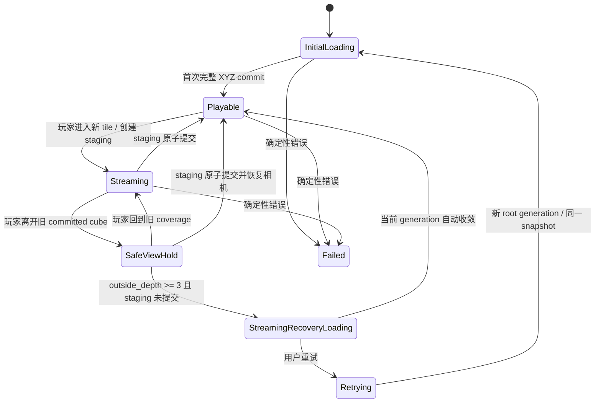
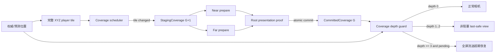

# Voxia 权威窗口后台流送与 3-chunk 超期恢复设计

- **日期**：2026-07-18
- **状态**：用户已批准设计，待实现
- **归属**：Voxia 阶段 1 后续硬化 / A10 完整 XYZ 滑动世界
- **影响范围**：Voxia 唯一 `production_all_features` 根、客户端 flow、safe-view、near/far handoff、CLI / observe、自动化与 Real-RHI 验收
- **不改变**：服务端 authority、confirmed truth 来源、baseline H gate、wire opcode、Web / Bevy 归档策略
- **上位事实**：[`Voxia 客户端流送与完整 3D LOD 当前事实`](../../00-current-truth/design/client/streaming-lod.md)
- **相关任务**：[`A10 可取消增量体素壳流送`](2026-07-12-a10-cancellable-incremental-voxel-shell-streaming.md)

## 1. 问题与决策

当前实现把“本次期望中心是否已由 near/far 同时提交”直接并入 root `ready`。玩家进入相邻 tile 后，near 会先切换 active center，Pure3D far 随后追赶；这段正常 handoff 会令 root 暂时 `ready=false`。相机 safe-view 又只接受与最近一次 presentation proof **中心 tile 完全相同**的候选位置，并在首次受阻 `2s` 后进入 `streaming_recovery_loading`。结果是玩家刚进入新 tile，客户端就可能显示“正在重新建立世界…”。

2026-07-18 可见实跑证明这不是完整世界损坏：第一次移动从 tile `11,0,-51` 切到 `10,0,-51` 时，near 只加载单轴进入面 `3087 chunks`，保留 `6174 chunks`；near/far 最终约 `5.2s` 后重新对齐。出生点距离旧 tile 边界约 `2.5m`，默认飞行速度为 `14m/s`，因此第一次移动约 `0.174s` 就进入相邻 tile，错误恢复 UI 被立即暴露。

本稿批准以下决策：

1. **首次可玩 readiness 与增量流送正交。** session 首次完成完整 root commit 后，可玩 readiness 在本 session 内保持单调；正常 desired/live 分离、near/far 追赶和 staging generation 不得令全局 readiness 回退。
2. **进入新 tile 只启动后台 staging。** 玩家完整 XYZ tile 发生变化时立即准备以该 tile 为中心的新权威窗口；旧 committed 窗口、旧 live presentation 和输入继续有效。
3. **全屏恢复由 coverage 超期决定。** 只有玩家已越出旧 committed 权威窗口，并继续深入 `3 chunks`，而新窗口仍未提交时，才进入阻塞式 `streaming_recovery_loading`。
4. **正常流送不冒充全世界重建。** tile handoff 期间 flow 使用 `streaming`；全屏恢复文案改为“权威覆盖流送超时，正在补齐…”，不得显示“正在重新建立世界…”。
5. **正确性错误不等待距离阈值。** snapshot / revision / H / manifest / provider identity / protocol / ownership / fence 等确定性错误立即显式失败，不使用 3-chunk 宽限吞错或回退本地替代 truth。

本稿取代 [`Voxia 客户端网络无关功能分阶段收口`](../cross-cutting/2026-07-14-voxia-client-offline-mock-closure-design.md) 中 D-019、D-021 的固定 `2s` 增量流送硬恢复口径；D-017 的连续权威移动、D-018 的 last-safe view、D-020 的人工重试与返回菜单仍保留。冷启动 loading timeout 与确定性失败路径也不受本稿影响。

## 2. 方案比较

| 方案 | 说明 | 结论 |
|---|---|---|
| A. 只把当前 `2s` 延长 | 保留 root `ready` 回退与 exact-center safe-view，仅延后全屏 UI | 拒绝。仍把正常流送误建模为全局失效，其他系统继续依赖错误语义 |
| B. 使用固定 wall-clock 流送超时 | tile 变化后累计固定秒数，超时显示全屏 | 拒绝。玩家静止时无需阻塞；不同移动速度下可用 coverage 余量不同 |
| C. 单调 readiness + coverage 深度门禁 | session readiness 单调，staging 后台追赶；按旧 committed 立方体外部深度判断超期 | **采用。** 与完整 XYZ authority、旧 live 保留和玩家移动连续性一致 |

## 3. 完整 XYZ 空间契约

### 3.1 Committed 权威窗口

一个 tile 固定为 `7×7×7 chunks`。near radius `1` 的 committed 权威窗口为
`3×3×3 tiles = 27 tiles = 9261 chunks`。

若 committed center tile 为 `C=(Cx,Cy,Cz)`，每轴 inclusive chunk 边界为：

```text
min_axis = (C_axis - 1) * 7
max_axis = (C_axis + 2) * 7 - 1
```

任何单轴相邻换窗必须保持：

```text
entered = 9 tiles = 3087 chunks
exited  = 9 tiles = 3087 chunks
retained = 18 tiles = 6174 chunks
```

### 3.2 3-chunk 外部深度

玩家 canonical chunk 为 `P`，旧 committed 窗口边界为 `[Min, Max]`。每轴外部深度：

```text
d_axis = Min_axis - P_axis,  P_axis < Min_axis
       = P_axis - Max_axis,  P_axis > Max_axis
       = 0,                  其他情况
```

完整 XYZ 外部深度采用立方窗口一致的 L∞：

```text
outside_depth_chunks = max(d_x, d_y, d_z)
```

- `0`：仍在旧 committed authority cube 内；相机必须继续正常跟随。
- `1..2`：已经离开旧 committed cube，但尚未耗尽宽限；允许 last-safe view 非阻塞保持，玩家权威位置继续推进。
- `>=3`：若目标 staging generation 尚未提交，判定 `streaming_overdue` 并进入全屏恢复。

该定义同时适用于单轴、棱、角、负坐标、步行、飞行和传送，不允许退化成 XZ column、固定 Y 或按欧氏距离另开口径。

### 3.3 可用追赶距离

玩家从 committed center tile 进入相邻 tile 时，旧 `3×3×3` 窗口在移动方向仍覆盖完整 `7 chunks`；越出旧窗口后再给 `3 chunks` 宽限，因此后台从触发到超期共有约 `10 chunks = 160m` 的距离预算。

- 默认飞行 `14m/s`：约 `11.4s`。
- 默认步行 `6m/s`：约 `26.7s`。

距离预算只决定“何时宣告流送追不上玩家”，不授权发布未确认 chunk、半成品 geometry 或本地替代 truth。

## 4. 状态与所有权

### 4.1 三个正交状态面

1. **Session readiness**
   - 所有者：`UVoxiaClientFlowSubsystem`。
   - 首次完整 commit 前为 initial loading；首次进入 playable 后保持单调。
   - 只在 session 离开、显式 retry 创建新 root 或确定性 fatal error 时结束。

2. **Authority coverage transaction**
   - 所有者：`AVoxiaUnifiedVoxelWorldActor`。
   - 同时维护一个 `CommittedCoverage` 和至多一个 `StagingCoverage`。
   - `CommittedCoverage` 是相机安全证明、外部深度和旧 live retirement 的唯一输入。
   - near transport 的 active/prepared center 与 far desired/live center 是子系统观察量，不能单独改写 committed truth。

3. **Presentation derivation**
   - 所有者：near/far renderer 与 scene host。
   - 可独立准备，但只能通过 root presentation proof 原子提交新 coverage generation。
   - stale / cancelled / superseded 结果不得更新 committed bounds 或 session readiness。

### 4.2 状态机



正常 handoff 的 near/far 暂时不一致只改变 `streaming` 观察量，不触发 `Failed`、不回退 `InitialLoading`，也不显示全屏 UI。

## 5. 数据流



具体顺序：

1. 玩家 tile 与当前 desired center 不同时，scheduler 立即创建或 supersede staging generation。
2. near 优先准备新进入的 `3087 chunks`；far 在既有 near-first 调度契约下准备对应增量 patch。旧 committed live 不退役。
3. root 只有在 snapshot、generation、center、near/far、ownership、gap/overlap 与 render fence 全部满足时才提交 staging。
4. commit 同帧更新 `CommittedCoverage`、presentation proof 与 live center；随后预算化退役旧退出面。
5. 提交前的相机安全性只以旧 committed **窗口边界**判断，不以 staging center 或 near/far exact-center equality 判断。

## 6. UI 与输入

| 状态 | UI | 输入 |
|---|---|---|
| `playable` | 无流送遮罩 | Game only |
| `streaming` 且 depth=`0` | 无全屏 UI；debug/HUD 可显示后台进度 | Game only |
| `safe_view_hold`，depth=`1..2` | 可显示非阻塞“正在同步视野覆盖…” | Game only |
| `streaming_recovery_loading` | 全屏“权威覆盖流送超时，正在补齐…”；重试、返回主菜单 | UI only |
| `failed` | 明确失败原因；重试、返回主菜单 | UI only |

进入新 tile 本身不得显示任何全屏 UI。非阻塞提示也只有相机实际越出旧 committed coverage、需要保持 last-safe view 时才允许出现。

## 7. 失败语义

### 7.1 正常可恢复事件

- desired center 被更新位置 supersede；
- worker cooperative cancellation；
- near/far 构建中、发布 fence 未完成；
- 玩家仍位于 committed coverage 内的 staging 延迟；
- 玩家离开 coverage 但 outside depth 仍为 `1..2`。

这些事件只进入 `streaming` / `safe_view_hold` 和结构化观察面，不得伪装为 fatal error。

### 7.2 确定性硬失败

- baseline / manifest / page H 不匹配；
- snapshot、revision、source identity 或 generation 漂移；
- missing confirmed truth、协议 decode、provider contract 失败；
- ownership gap/overlap、render fence 或 presentation proof 违反不变量；
- 同一失败在契约上不可通过继续等待恢复。

硬失败立即进入 `failed`，记录可诊断原因；禁止等待玩家走满 3 chunks、禁止 WorldGen/local fallback、禁止把未知空间当空气。

## 8. 可观测面

现有 `client_flow_probe`、`voxel_world_root_state` 与 `safe_view_state` 必须增加以下字段，不另建第二条正式 CLI：

- `session_ready`、`flow_phase`、`streaming_state`；
- `committed_generation`、`committed_center_tile`、`committed_min_chunk`、`committed_max_chunk`；
- `staging_present`、`staging_generation`、`staging_center_tile`、`staging_started_at`；
- `player_chunk`、`outside_depth_chunks`、`overdue_threshold_chunks=3`；
- `near_ready`、`far_ready`、`centers_aligned`、`proof_ready`；
- `entered_chunks`、`retained_chunks`、`exited_chunks`；
- `last_progress_at`、`last_failure_reason`。

结构化事件至少包括：

- `voxel_authority_stream_started`；
- `voxel_authority_stream_superseded`；
- `voxel_authority_stream_progress`；
- `voxel_authority_stream_committed`；
- `voxel_authority_safe_view_held`；
- `voxel_authority_stream_overdue`；
- `voxel_authority_stream_recovered`；
- `voxel_authority_stream_failed`。

`voxel_authority_stream_overdue` 必须携带完整 bounds、玩家 chunk、XYZ 每轴 depth、L∞ depth、阈值、generation、elapsed、near/far/proof 状态和原因，能够直接证明为何出现全屏 UI。

## 9. 实现边界

预计修改 Voxia 唯一正式路径中的以下职责，不新增第二生产 root：

- `FVoxiaWorldPresentationProof`：从“只证明一个 center tile”扩展为证明 committed XYZ coverage bounds。
- `AVoxiaUnifiedVoxelWorldActor`：拥有 committed/staging coverage ledger、单调 readiness 与 outside-depth 判定；不再把暂时 center mismatch 当全局未就绪。
- `FVoxiaClientFlowMachine` / `UVoxiaClientFlowSubsystem`：补齐正常 `streaming`、`safe_view_hold`、coverage-overdue recovery 转换。
- `AVoxiaCameraManager` / safe-view guard：按 committed bounds 判断候选相机；距离门禁取代固定 `2s` 硬恢复。
- `SVoxiaClientFlowOverlay`：正常 streaming 隐藏，全屏恢复改为 coverage-overdue 文案。
- 既有 CLI、observe、automation、目录 README 与 current-truth：同步更新，不创建 probe-only 正式入口。

本次不修改服务端、wire、provider 数据格式、baseline H gate、near/far 内容算法、Web 或 Bevy。

## 10. 测试与验收矩阵

### 10.1 纯逻辑自动化

1. committed bounds 对正负 XYZ tile 坐标计算正确。
2. cube 内 depth=`0`；六个面外、十二条棱外、八个角外的 L∞ depth 正确。
3. inclusive 边界无 off-by-one：`Max+1/2/3` 分别为 depth `1/2/3`。
4. tile change 进入 `streaming`，session readiness 不回退。
5. depth `0` 不 hold；depth `1..2` 只进入非阻塞 hold；depth `3` 且 staging pending 才恢复加载。
6. staging 在阈值前 commit 时直接恢复 playable，从未显示全屏。
7. superseded / stale generation 不改变 committed bounds。
8. fatal identity / proof 错误立即失败，不等待距离阈值。

### 10.2 集成与 CLI

1. 冷启动后 `session_ready=true`。
2. 单轴进入相邻 tile：观察 `3087/6174/3087`，flow 为 `streaming`，overlay 不可见。
3. near/far 暂时不一致期间 `session_ready=true`、旧 committed bounds 不变。
4. 模拟 staging 延迟，在旧窗口内和外部 depth `1..2` 均无全屏；depth `3` 精确出现恢复 UI。
5. staging 随后提交时自动恢复，不创建第二 session/root。
6. +X/-X/+Y/-Y/+Z/-Z、棱/角移动和快速 supersede 都输出同一 XYZ 契约。

### 10.3 Real-RHI 与用户入口

1. 唯一 `production_all_features` 可见入口从当前边界附近出生点移动，不得在进入新 tile 时出现全屏加载。
2. 默认飞行速度连续跨 tile，旧画面保持、近远场无空洞/重叠，输入不中断。
3. 注入可控慢流送，验证 full-screen 只在旧 committed cube 外 depth=`3` 出现。
4. `client_flow_probe`、结构化 observe 与屏幕 UI 对同一 generation、bounds、depth、阈值给出一致结果。
5. 重跑 Development build、相关 focused automation、全量 `Automation RunTests Voxia`、Null-RHI 路线和受影响 Real-RHI movement/return 路线；保留 `.demo/observe/` 证据。

## 11. 完成定义

只有同时满足以下条件，才能写成实现完成：

1. 玩家进入新 tile 只触发后台 staging，session readiness 单调且无全屏 UI。
2. committed/staging coverage、presentation 与 flow 职责分离，旧 live 在原子提交前持续有效。
3. 完整 XYZ/L∞ 外部深度经过边、棱、角与负坐标测试。
4. full-screen 恢复只在 `outside_depth_chunks >= 3` 且 staging 未提交时出现；确定性错误保持立即硬失败。
5. 真实用户操作、自动化、CLI / 日志三个入口均验证同一行为。
6. 唯一生产组合根及 confirmed truth、H gate、协议和归档客户端边界未被破坏。
