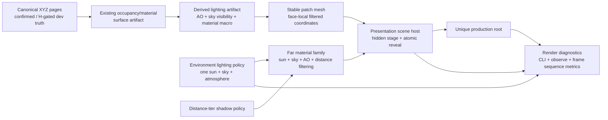
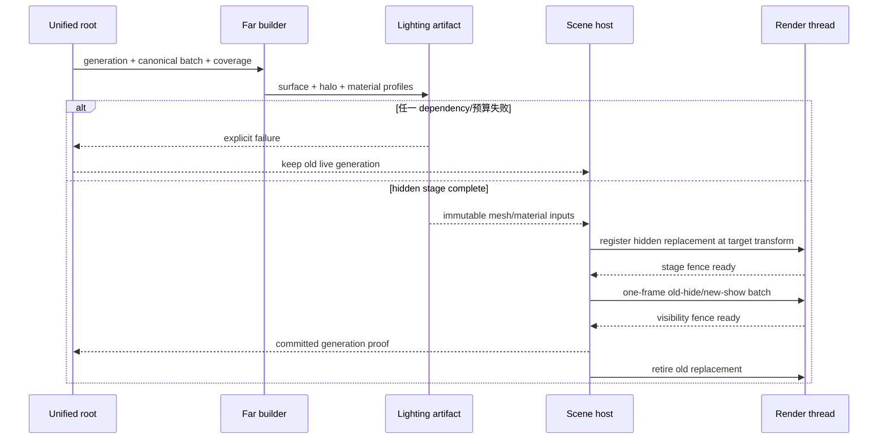

# Voxia 远景渲染专项治理设计（RG0–RG6）

- **日期**：2026-07-21
- **状态**：设计冻结，RG0–RG5 已实施并通过阶段门禁
- **现役客户端**：`clients/Voxia`（UE 5.8）
- **唯一正式入口**：`production_all_features` / `AVoxiaUnifiedVoxelWorldActor`
- **用户决策**：高刷新优先；视觉方向为“清晰自然”；覆盖中午、晨昏、夜晚三个锚点及连续太阳移动；闪烁验收同时覆盖摄像机移动与静止
- **批准边界**：不改 wire、服务端 authority、confirmed truth、完整 XYZ 空间契约、功能语义与唯一生产根；允许治理渲染可见效果、材质、灯光、阴影、presentation 与性能分档

## 1. 问题与结论

用户观察到两个独立症状：

1. 远景缺少光影层次，整体显得平；
2. 摄像机移动和静止时都可见闪烁。

本专项不把二者归结为单一 TSR 参数问题。当前代码已经确认的结构事实如下：

| 事实 | 当前实现 | 直接风险 |
| --- | --- | --- |
| 远景光照参与边界 | `UDynamicMeshComponent` 启用 StaticDraw、投影与平面法线，但关闭 dynamic indirect、distance-field lighting、ray tracing、reflection/sky capture visibility | 远景不能把完整 Lumen/HWRT 表示当作正确性来源 |
| 环境补光 | 三盏侧向无阴影平行光、一盏向上补光、强度 4–5 的 Skylight 用来抬亮黑面 | 抹平方向感、遮蔽与材质层次 |
| 材质 | `M_VoxelWorldAligned` 主要是三轴世界坐标贴图 × 顶点色，粗糙度固定约 0.9；缺稳定 AO、天空可见度与远距频率治理 | 远距离高频纹理刺激 TSR，材质响应单一 |
| presentation | changed patch 当前跨 Tick 逐个把旧组件移到隐藏位置、再把新组件移入 | 多个可见帧可能混合新旧 patch；大范围 transform 变化也会扩大阴影缓存失效 |
| 默认时序 | TSR、77% screen percentage、VSM、Lumen 均开启；已有 TSR 抗闪参数 | 参数只能缓解，不能维护 generation、LOD 和材质频率不变量 |

以下仍是 **RG0 必须用单变量 A/B 证实的假设**，不能提前写成根因：

- H1：亚像素体素边缘与远距 1 米贴图频率超过 77% 内部分辨率的可恢复带宽，导致 TSR 历史反复接受/拒绝；
- H2：远景 movable DynamicMesh、跨帧 parking transform 与连续太阳更新造成 VSM page invalidation；
- H3：UDS/SkyLight、曝光或 Lumen screen trace 在静止视点仍持续改变低频亮度；
- H4：跨帧 patch 换代造成移动/跨 tile 时的新旧 LOD 边界闪烁；
- H5：上述因素可能同时存在，且移动闪烁与静止闪烁的主因不同。

## 2. 参考方案与取舍

本设计只提炼成熟项目的工程原则，不复制第三方 shader 代码、纹理或受限制资源。

- [Distant Horizons](https://gitlab.com/distant-horizons-team) 用简化 LOD 扩展 Minecraft 可视距离；其[官方 release 记录](https://gitlab.com/distant-horizons-team/distant-horizons/-/releases)持续处理 LOD flashing、LOD lighting、vanilla/DH fading、vertical LOD、雾、SSAO、线程与 GC，说明远景稳定性必须同时治理数据、换代、光照和提交成本。
- [Sodium](https://github.com/CaffeineMC/sodium)把目标明确放在帧率、micro-stutter 和图形问题上。本项目吸收其“可见集合稳定、提交成本有界、后台派生不阻塞帧”的方向，不假定或照搬其内部实现。
- [Complementary Reimagined](https://github.com/ComplementaryDevelopment/ComplementaryReimagined)强调质量、细节与性能并存。本项目只提炼单一明确主光、受控环境光、材质层次、空气透视与分档思想；不复制其 GLSL 或资产。
- [UE 5.8 TSR](https://dev.epicgames.com/documentation/en-us/unreal-engine/temporal-super-resolution-in-unreal-engine?lang=en-US)可以缓解锯齿、moire 与闪烁，但不能替代正确的几何频率、mip、运动向量和历史稳定性。
- [UE 5.8 VSM](https://dev.epicgames.com/documentation/en-us/unreal-engine/virtual-shadow-maps-in-unreal-engine)会因移动 primitive、大包围盒和光源变化失效缓存页，因此远景投影距离与 primitive 稳定性必须受策略约束。
- [UE 5.8 Lumen 技术细节](https://dev.epicgames.com/documentation/en-us/unreal-engine/lumen-technical-details-in-unreal-engine)与[性能指南](https://dev.epicgames.com/documentation/unreal-engine/lumen-performance-guide-for-unreal-engine?lang=en-US)显示：Lumen High 的主要目标是 60 FPS，硬件光追在大量实例下有额外 scene/TLAS 成本；UE 5.8 Medium 虽更快，但仍不能成为 120 FPS 远景正确性的唯一依赖。

比较过的路线：

| 路线 | 优点 | 缺点 | 结论 |
| --- | --- | --- | --- |
| 只调 TSR/VSM/雾与补光 | 改动小、见效快 | 不能维护 generation 原子性、采样带宽和光照来源；容易反复 | 淘汰 |
| 全远景接入 Lumen/HWRT/VSM | 质量上限高 | DynamicMesh 无可用距离场，全量 HWRT/VSM 不符合 120 FPS 余量目标 | 仅允许未来质量档受控实验 |
| 距离分层的确定性渲染 | 正确性不依赖全距离时序 GI；可同时治理光照、闪烁和成本 | 需要新增 derived lighting artifact、材质合同和严格诊断 | **正式方案** |

## 3. 目标、非目标与预算

### 3.1 目标

1. 远景保持体素硬表面轮廓，但有明确主光方向、局部遮蔽、天空可见度、材质层次与距离纵深。
2. 固定环境时钟下，静止相机不出现可感知闪烁；移动和跨 tile 时不出现新旧 patch 混合、白边、洞或 LOD 抖动。
3. 中午、晨昏、夜晚共享同一渲染结构；太阳连续移动不触发 canonical、surface 或 lighting artifact 重建。
4. 默认档面向 RTX 4060/5060 级、1080p、TSR 77%，目标 120 FPS，持续下限 90 FPS，并给后续玩法、特效、UI 和在线对象留出预算。
5. 用户操作、Automation、CLI/结构化 observe 三入口完整；截图和人工观看只作补充证据。

### 3.2 非目标

- 不实现天气、雨雪、雷电或云层重写；只保留未来天气输入接口。
- 不恢复旧 raymarch、XZ/VHI/SVO/heightmap 生产路径。
- 不把 Nanite、全距离 HWRT 或全距离 Lumen 作为本轮前置条件。
- 不用浓雾、dither 或屏幕空间噪声隐藏 coverage gap。
- 不修改服务器、wire codec、baseline/H gate 或 confirmed voxel truth。
- 不改变 near/far 的完整 XYZ coverage、canonical source identity 或唯一生产根。

### 3.3 默认性能门槛

| 指标 | 默认门槛 |
| --- | --- |
| 总帧时间 | `frame_ms p95 <= 8.33ms`，`p99 <= 11.11ms` |
| GameThread | `game_thread_ms p95 <= 3.5ms` |
| GPU | warm steady-state `gpu_ms p95 <= 6.0ms` |
| 远景稳态增量 | 相对同根 debug-only far-hidden 基线，GPU p95 增量 `<= 2.0ms` |
| generation 可见提交 | 单次 GameThread 增量 `<= 1.0ms`；不允许跨帧逐 patch reveal |
| 长稳态 | 无 renderer-owned 单调资源增长，无持续低于 90 FPS 的窗口 |

外部 D3D12/DXGI stall 必须保留在 raw frame 证据中，不得过滤。归因型 subsystem 指标与端到端 raw 指标并列报告；最终端到端门禁仍需在无已知外部阻塞的环境通过。

## 4. 总体架构



渲染派生仍是单向函数：

```text
外观 = f(canonical truth, material profile, lighting state, camera, quality policy)
```

任何渲染缓存、AO、天空可见度、阴影策略或 TSR 历史都不能反向写入 canonical truth。

## 5. 正交系统与自维护不变量

### 5.1 `FarRenderDiagnostics`

职责只有复现、采样、归因和输出证据，不修改生产策略。它维护：

- 固定相机静止、纯相机平移/旋转、跨 tile generation、太阳连续移动四类 route；
- 固定环境时钟、固定曝光和正常动态环境两类模式；
- TSR 77%/100%、VSM on/off、far cast-shadow on/off、Lumen screen trace on/off、sky update on/off 的单变量矩阵；
- `frame_ms/game_thread_ms/render_thread_ms/rhi_thread_ms/gpu_ms` 分位数；
- generation、changed/retained/replaced patch、visibility commit、VSM/Lumen/TSR 配置快照；
- 帧序列的平均亮度差、边缘高频差、超过阈值的闪烁像素比例。

诊断输出写入 `.demo/observe/voxia_far_render_<run-id>/`。生产 CLI 只追加命令与字段，不改变既有 envelope/schema。

### 5.2 `VoxelPresentationSceneHost`

它自己维护“每个可见帧只有一个 owner generation”：

1. retained patch 直接转交新 generation，不调用 `SetMesh`、不移动、不重新注册；
2. replacement component 在目标 transform 处分帧创建、注册和上传，但保持不可见；
3. barrier 同时确认 source/coverage/artifact、component、ownership 与 render fence；
4. 最终一个 GameThread 帧内批量隐藏全部旧 replacement、显示全部新 replacement；
5. 旧 component 只有在新 visibility command 的 render fence 完成后才进入 retirement；
6. 任一步失败或提交成本预测超预算，整代不发布，旧 live 保持可见。

禁止继续用“每 Tick 换一个 patch”承担可见提交，也禁止用非互补 dither 承担所有权正确性。

### 5.3 `FarLightingArtifact`

它只从当前 generation 的 canonical occupancy/material 及完整 halo 派生与视角、太阳方向无关的低频量：

- face/corner ambient occlusion；
- sky visibility / local enclosure；
- material macro tint/roughness profile 索引；
- artifact algorithm/version 与完整 dependency fingerprint。

逻辑合同与物理打包分离。实现可以使用 vertex color、UV overlay 或 custom primitive data，但必须先有自动化证明相同 world point 的 near/far 语义一致。missing halo、身份漂移、未知 material profile 或预算超限都使整代失败；不得把 missing 解释成 air。

AO 采用体素邻域的确定性角点遮蔽思想，吸收 Minecraft 生态成熟的 smooth-lighting 可读性原则，但算法、数据布局和代码均在本仓独立实现。AO 不包含太阳方向，因此昼夜变化不触发网格重建。

### 5.4 `FarMaterialFamily`

保持 opaque/translucent/emissive 三个既有 family，新增统一的材质输入合同：

```text
material_id
face_axis_and_sign
stable_face_local_coordinate
albedo_tint
ambient_occlusion
sky_visibility
macro_profile
distance_lod_factor
```

规则：

- 体素面继续使用平面几何法线，不把方块表面错误平滑化；
- 采样坐标在 patch/quad 内保持小数值，并保留绝对世界相位，避免公里级 half precision 量化；
- 面向投影只做所需的一次主纹理采样，避免当前无条件三轴高频采样；
- 纹理必须有正确 mip，远距按连续距离降低微观 albedo/normal 频率并提高 macro 权重；
- AO/sky visibility 只调制间接项，不把主光阴影烘死；
- translucent/emissive 保持 family 语义，不用 opaque fallback 伪装成功；
- 材质资产或参数合同缺失时 readiness 显式失败。

### 5.5 `EnvironmentLightingPolicy`

GameMode 仍只组合一套环境，不创建第二世界根。正式策略为：

- 一盏主太阳；
- 一套 SkyLight/天空环境；
- SkyAtmosphere/高度雾负责物理距离纵深；
- 删除三侧向加一向上的补光 rig；
- 暴露中午、晨昏、夜晚三个冻结锚点和连续太阳 route；
- 曝光必须有界、可观察，在固定环境下收敛后不持续漂移；
- 太阳/天空状态变化只更新 lighting state，不重建 canonical、surface、lighting artifact 或 patch identity。

雾只按真实距离参与空气透视。coverage gap、LOD seam 或 generation mismatch 在有雾时仍必须由结构化断言检出。

### 5.6 `FarShadowPolicy`

默认档按距离分层：

- near 与 collar：允许 VSM cast/receive，保证玩家附近遮挡和接地；
- 中层：只保留经 RG0 证明有稳定收益的有限 VSM 距离；
- 远层：不投射高成本动态 VSM，以 direct sun、face normal、AO、sky visibility 与空气透视保持体积；
- Lumen 可以服务 near/collar 或质量档，但 far 视觉正确性不能依赖 Lumen scene/HWRT 收录；
- 质量档只能扩大阴影/GI 距离或材质细节，不能形成第二入口、第二真值或不同 presentation 语义。

具体距离不在设计阶段猜测，由 RG0 profile 和 RG3 单变量结果冻结；冻结后写入显式 quality policy 与自动化 fixture，禁止散落 CVar。

## 6. 数据流与失败语义



所有错误必须携带 `reason_code`、generation、source/coverage fingerprint、patch key 与阶段。运行时不允许：

- 静默回退旧材质、旧补光 rig、legacy renderer 或 WorldGen source；
- 因 lighting artifact 失败发布部分 patch；
- 因性能门槛失败自动降低到未声明配置；
- 把截图“看起来没洞”替代 ownership/gap/overlap 断言。

## 7. 分阶段实施

### RG0：可观测面与根因基线

- 新增诊断 snapshot、CLI/observe、固定相机与固定环境 route；
- 建立静止、移动、跨 tile、太阳移动四类帧序列；
- 完成 TSR/VSM/Lumen/sky/exposure/presentation 单变量矩阵；
- 输出根因报告，只批准有证据的后续改动。

### RG1：presentation 单帧原子可见提交

- 先写失败测试，证明当前多 patch 换代跨多个 Tick；
- hidden replacement 改为目标位置预注册；
- retained 不动，replacement 同帧批量 hide/show；
- 加 visibility fence、失败保留旧 live、提交耗时和每帧 owner 断言；
- 不改材质或灯光，单独验证 H4。

### RG2：材质坐标、mip 与 LOD 时间稳定性

- 统一 near/far 面向、相位和小数值坐标合同；
- 建立正确 mip 与远距频率衰减；
- 只在 RG0 证实需要时调整 geometry/material LOD 阈值；
- 复跑 TSR 77%/100% 和静止/移动矩阵，单独验证 H1。

### RG3：单太阳、确定性 AO 与阴影分层

- 新增 lighting artifact 与 halo/dependency 测试；
- 删除生产补光 rig，接入有界环境策略；
- profile VSM invalidation，冻结 near/collar/远层投影策略；
- 验收中午、晨昏、夜晚与连续太阳移动；
- 单独验证 H2/H3。

### RG4：材质层次与空气透视

- 在既有 family 上加入 macro albedo/roughness、AO/sky visibility 与距离过滤；
- 保持方块法线、材质身份与透明/发光合同；
- 调整克制的大气纵深，不隐藏结构错误；
- 完成近远同点、负坐标与 ±8km 采样审计。

### RG5：性能分档与预算硬化

- 默认 `performance_natural` 为唯一生产默认；
- 可选 `quality_natural` 只扩展同一策略，不创建第二根；
- 建立 GPU、GT、RT、RHI、draw、triangle、VSM invalidation、Lumen instance、资源生命周期预算；
- 优化只针对 profile 证实的热点，不做无证据的全局 CVar 猜测。

### RG6：唯一生产根联合收口

- 更新 README、current truth、known gaps、source index 与本阶段进度；
- 全量 Automation、Null-RHI、Real-RHI、静止/移动/昼夜 route、30 分钟 soak；
- 用户操作、自动化、CLI/observe 三入口同轮通过；
- 阶段提交推送后检查 CI；远景成果只有进入 `production_all_features` 根并通过根级 readiness 才能记为完成。

## 8. 验证矩阵

| 层次 | 必测内容 | 门槛 |
| --- | --- | --- |
| 纯函数 | AO、sky visibility、material profile、坐标相位、distance factor | 正负坐标与 near/far 同点确定性一致 |
| dependency | 缺 halo、missing page、identity 漂移、未知材质、预算超限 | 零部分发布；旧 live 保留；明确 reason code |
| presentation | 1、2、41 个 replacement patch；retained/replaced/removed 混合 | 每帧 gap/overlap/mixed generation 为 0；同帧 reveal |
| 静止时序 | 三个昼夜锚点，固定环境，300 帧 warmup 后采样 | `abs(Δluma)>3/255` 像素比例 p95 `<=0.1%`；无周期性边缘闪烁 |
| 移动时序 | 平移、旋转、对角、跨 tile、快速折返 | 无白边/洞/混代；结构化 route 完整；人工可见验收通过 |
| 太阳移动 | 中午→晨昏→夜晚连续 sweep | 无 artifact/mesh rebuild；曝光有界；光照连续 |
| TSR | 77% 默认、100% 诊断参考 | 默认不依赖 100% 才稳定；差异可归因 |
| VSM/Lumen | policy on/off 与 visualization/profile | 远景成本、instance 与 invalidation 在预算内 |
| 性能 | RTX 4060/5060 级 1080p，warm steady、移动、换代 | 满足第 3.3 节；raw 与 attribution 指标并列 |
| 生命周期 | 首窗、stream、取消、失败、重试、EndPlay、30 分钟 soak | 无单调增长、无 stale publish、无 render-thread 错误 |
| 根级合同 | production root、完整 XYZ、CLI schema、wire fixture | 唯一根不变；wire 字节不变；旧 probe 仍非 production |

移动帧序列的自然画面变化不能直接用相邻帧像素差判失败。自动化以 generation/ownership、固定 camera keyframe、可重复 camera path 和 TSR/VSM visualization 指标为主；帧序列视频/截图只作支持证据。静止序列才使用严格的逐像素时间差门槛。

## 9. 提交与回滚纪律

- RG0–RG6 各自至少一个独立提交，阶段内先测试后实现，阶段末 fresh 验证；
- 不把多个未证实假设的修复混入同一提交；一个 A/B 只改一个变量；
- renderer artifact、material contract 或 cache key 语义变化必须提升显式版本，旧派生缓存不得继续命中；
- 阶段失败只回滚当前候选策略，不回滚 canonical XYZ、server authority、H gate 或唯一根；
- 禁止为通过门槛过滤帧、缩短采样、关闭默认 GC、隐藏错误日志或使用独立 probe 冒充生产根。

## 10. 设计自查

- **系统正交**：诊断、presentation、lighting artifact、material、environment、shadow policy 各自只有一个职责；
- **自维护不变量**：原子可见性由 scene host 维护，坐标/mip 由 material contract 维护，昼夜连续性由 environment policy 维护，预算由 quality policy 与 harness 维护；
- **显式契约**：跨系统只传 immutable generation/source/coverage/material/lighting snapshot；
- **唯一事实**：AO 与材质输入是 canonical truth 的派生，不是第二份世界状态；
- **唯一生产根**：质量分档是同根策略参数，不是新 GameMode、地图或 world actor；
- **完整 XYZ**：所有 patch、halo、lighting artifact、coverage 和测试均使用完整 XYZ；
- **参数完整性**：具体阴影距离由 RG0 数据冻结，不是未定义实现；冻结动作、输入矩阵和通过条件已在 RG0/RG3 明确。
