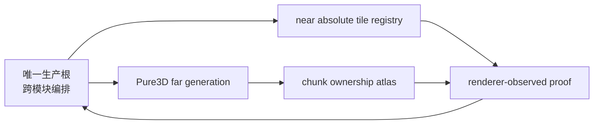
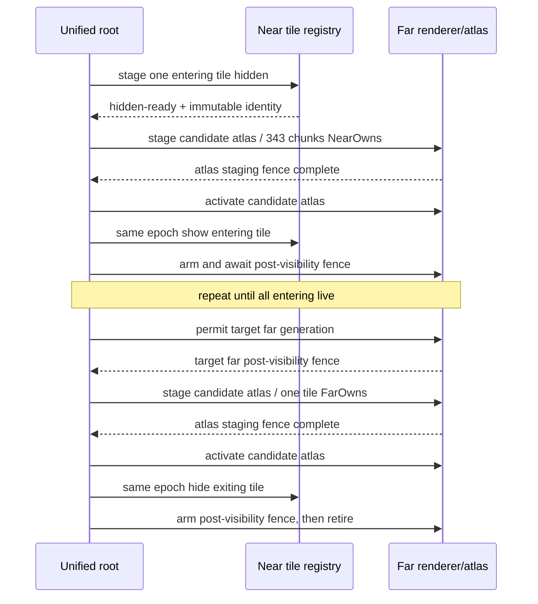

# Voxia 近远景 tile 级渐进交接修复

- **日期**：2026-07-22
- **状态**：已按 TDD 实施并于 2026-07-23 重新验收完成
- **影响范围**：唯一生产组合根、active near tile presentation、Pure3D far ownership renderer、根级 proof、CLI/smoke
- **不改变**：服务端权威、confirmed truth 来源、完整 XYZ、far generation 内部原子性、阶段 2 intent/receipt 语义

> **完成范围修正（2026-07-23）：** 本稿的 Tile ownership、活性、renderer asset/UV/AO 合同继续完成。
> 后续固定相机证据重新打开了独立的 canonical LOD surface material 语义：粗中心采样会漏掉 4m
> 表层。下文“外观/颜色 closeout”只证明同材质 asset 与 fixture contract，不代表 live LOD material id
> 一致；详见
> [`Far LOD 外露表面材质语义修复`](2026-07-23-far-lod-surface-material-semantic-repair.md)。

## 1. 为什么重开阶段 1 / A10 presentation closeout

用户在可见客户端中复现：远景进入近景时同一区域双显数秒，近景退出到远景时朝向近景的一侧暂时缺少
真实竖墙。运行日志与代码审计给出同一条根因链：

- 唯一根已有 Pure3D far proxy，但 near 仍安装 `Pure3DFarPending` no-far sink；
- active near 正常路径构建完整 27-tile candidate，18 个 retained tile 仍被重建；
- near 与 far 分别提交完整中心，实跑出现约 `7.98s` 的 live center 错配；
- 根级 `ownership/fence/gap/overlap` 由调用方直接填 `true/0`，现有 smoke 没有观察 renderer 事实。

因此 2026-07-21 的阶段 1 / A10 presentation closeout 被新证据推翻。surface stager 的真实边界面语义不改，
不增加人工竖墙、裙边或淡变补丁。

## 2. 锁定决策



1. **所有权精度是 canonical chunk。** atlas 按完整 signed XYZ 维护；二维 R8 texture 只是 flatten 后的 GPU
   存储，不能反向定义为 XZ coverage。
2. **调度和可见提交单位是完整 tile。** 一个 tile 固定包含 `7³=343 chunks`；一次 ownership batch 和
   near 可见变更必须覆盖同一个完整 tile。
3. **live near 是绝对 tile key 集合，不是单一中心 batch。** 相邻单轴移动只新增/移除 9 tiles，18 个
   retained tile 的组件 identity 原样保留。
4. **far generation 可继续内部全有或全无 stage。** 其可见结果始终受同一个 ownership atlas 裁剪；目标
   far 在全部 entering tile live 前不得获得可见 permit，exiting tile 在目标 far post-visibility fence 完成前
   不得释放。
5. **任一空间体积只有一个 visible owner。** 过渡时旧、新中心 tile 可以混合存在，但不能按中心相等与否
   猜测 owner。
6. **整窗只作显式兜底。** 首窗、无交集跳跃、live far coverage 不足或 atlas span 越界可走 paired
   full-window fallback；正常相邻移动触发 fallback 即验收失败。

## 3. 正常相邻移动

默认 `3×3×3 = 27 tiles = 9261 chunks`。沿任一轴移动一个 tile：

- retained=`18 tiles / 6174 chunks`；
- entering=`9 tiles / 3087 chunks`；
- exiting=`9 tiles / 3087 chunks`。



atlas 使用 live/candidate texture 双缓冲：staging fence 期间 far 仍绑定旧 live atlas；只有 candidate 已上传且
near mutation 预校验通过，根才在同一 GameThread 可见提交栈中切 atlas 与 near visibility，再用
post-visibility fence 证明完整事务。快速折返时以当前实际 live tile set 重新求差集。已经提交的 stale ownership 必须等 ticket 终态并走反向
补偿；隐藏但未提交的 tile 可以直接丢弃。旧 far 与旧 near 始终保留到替代 owner 具备真实 coverage 和 fence。

## 4. 生产边界

- 新的纯 `FVoxiaNearFarTileHandoffCoordinator` 只维护状态和 immutable identity，不持有 UObject/RHI。
- `AVoxiaWorldActor` 提供 hidden stage、show/hide、live tile snapshot；宏格 truth 仍只来自 authority/store。
- Pure3D scene host 提供生产 `Renderer` sink，拥有 atlas、transient texture、三材质族 MID、dirty upload 与
  fence ticket。
- `AVoxiaPure3DVoxelWorldActor` 增加 far generation visibility permit，hidden generation 不再自动换 live。
- `AVoxiaUnifiedVoxelWorldActor` 是唯一跨 near/far 编排者；不得在 child 之间共享可变隐式中心。

客户端详细类型、状态与验收契约同步锁定在 Voxia repo：
`docs/superpowers/specs/2026-07-22-near-far-tile-handoff-design.md`。

## 5. 真实 proof 与观察字段

根级 proof 删除自填 `bOwnershipReady=true`、`bFenceObserved=true` 与默认 zero gap/overlap。observer 按
实际 near live tile、far coverage 与 atlas 逐 chunk 计算：

```text
near_owner = chunk 所属 tile 当前 live
far_owner  = live far 覆盖该 chunk 且 atlas 为 FarOwns
gap        = !near_owner && !far_owner
overlap    = near_owner && far_owner
```

CLI / observe 至少包含 target/settled center、retained/entering/exiting/live/staged/retiring tiles、sink/far/atlas
generation、pending ticket、每 tile commit 时延、真实 gap/overlap、fallback count/reason 和 oldest handoff age。
缺 observer、真实 renderer sink 或 matching fence 时 proof 必须 incomplete。

## 6. 测试矩阵与退出门槛

- RED→GREEN：相邻 ±X/±Y/±Z 与负坐标均为 18 retained、9 enter、9 exit；一次只提交一个 tile。
- retained UObject identity 不变；正常移动不再出现 `near_active_batch_committed ... tiles=27`。
- renderer sink、batch ticket、atlas rebase/双缓冲 dirty upload、far permit、三材质族 mask、staging 与
  post-visibility 真实 fence 全有自动化。
- root proof 在 injected gap/overlap、self-reported zero、错 generation、旧 fence 时必须失败。
- Phase 1 runner 在过渡中持续采样，要求真实 gap/overlap 始终为 0、normal fallback 不增长。
- Phase 2 place/break 回归只重组 dirty tile，authority intent/confirmed/presented 顺序不变。
- 完整 Voxia automation、Node tests、Development build、Null-RHI smoke 与 Real-RHI 六轴/快速折返通过。

上述门禁全部通过前，不得重新宣称阶段 1/A10 near/far transaction closeout，也不得开始用服务器接入填补该
客户端 presentation 缺口。

## 7. 2026-07-23 实施与重新 closeout

- 唯一根已经安装真实 Pure3D renderer sink；normal handoff 从实际 absolute `LiveTiles` 求差集，逐 Tile
  stage/activate/retire，18 个 retained Tile 的 registry/component identity 不变。空间断开的 teleport 或
  union 超预算才允许整窗 fallback。
- scene host 拥有双缓冲 ownership atlas、三材质族 MID、真实 staging/post fence 与 seam component；
  根级 proof 读取实际 live/staged/retiring/renderer Tile、atlas generation、ticket 与 seam component
  identity，不再接受调用方自填 `ready/0`。
- 新增 `FVoxiaNearFarHandoffTargetLatch`：首个可见 mutation 后固定当前 near/far 共同 target，移动抖动
  只覆盖一个 latest-wins queued target；当前收口后两侧才共同追赶。near build、far build/live 与 source
  revision 的实际 fingerprint 推进自维护 watchdog，连续 60 秒无进展才显式失败。
- active-near CPU mesh 使用 4-worker/16-cap 有界并行、有序发布与 chunk 去重；确定性 worker/投影/
  边界 source 失败锁存 voxel/field/activation 身份，同一事实不再热重试。这关闭了实跑中“后来卡死”的
  第二条独立根因。
- near/far opaque 共同使用 `M_VoxelWorldAligned`、稳定世界格 UV0 与共享 canonical AO/sky；near 对
  UE Z-up/canonical Y-up 执行显式轴与角点映射，非对称 blocker 自动化防止竖墙光照旋转或镜像。
- fresh 验收：Development build；UE Automation `148/148`；Node `82/82`；Phase 1 Null-RHI
  23 routes / 21 generations，覆盖 X/Y/Z、对角、A-B-A、纵向往返、teleport、失败重试、新会话和性能
  往返，clean exit、far release pending=0。最终 root `ready=true`、target phase=`idle`，
  live/staged/retiring/renderer=`27/0/0/27`，gap/overlap/seam/orphan=`0/0/0/0`，near queue failure=0。
  Real-RHI 固定 ROI 的交接帧与稳定帧 channel delta p95/p99 均为 `1/2`。

因此第 6 节门禁已关闭，阶段 1/A10 presentation 可重新写为客户端完成；Online authority/provider、
服务端/wire 与阶段 3 prefab 仍是后续正交工作。

## 8. 后续材质语义证据的边界

本稿最后一段只对 presentation transaction 完成有效。关闭 Lighting/Fog/PostProcessing 后仍存在的
暖灰色带证明，现有 `voxel_material_parity` 没有覆盖真实 owner/ring/LOD 的 surface material id。
阶段 3 因此先暂停；先在 A8/A10 内实现 surface-aware canonical material reduction。不得修改本稿已经
通过的 Tile owner/fence 流程，也不得在 renderer 中增加 tint workaround。
