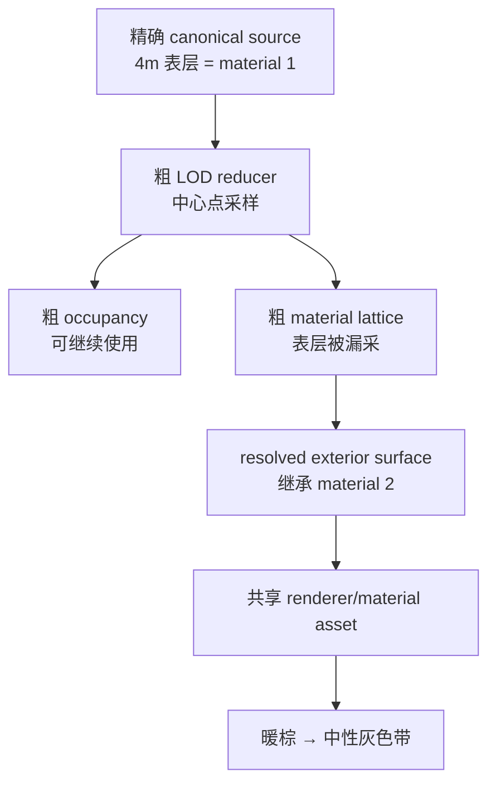

# Voxia Far LOD 外露表面材质语义修复

- **日期**：2026-07-23
- **状态**：根因与边界已锁定，尚未实现；阻断阶段 3 Prefab runtime 开工
- **影响范围**：canonical page/LOD material reducer、artifact schema/fingerprint、live CLI/observe、
  自动化与 Real-RHI 验收
- **不改变**：服务端权威边界、完整 XYZ coverage、near/far 唯一 owner、Tile handoff、粗 occupancy、
  阶段 2 宏格交互、普通世界无微格编辑

## 1. 新证据推翻了哪一部分 closeout

2026-07-23 早先修复已经证明：

- near/far 绑定同一个 `M_VoxelWorldAligned`；
- 两侧共享稳定 UV0、canonical AO/sky 与正确的 UE Z-up/canonical Y-up 角点映射；
- target latch、逐 Tile ownership、真实 fence、near 有界队列和稳定态账本均闭合。

这些事实继续有效。但后续固定相机实跑显示，暖色近区与中性灰远区在
`Lighting=0`、`Fog=0`、`PostProcessing=0` 时仍存在。现有 `voxel_material_parity` 只用固定材质 2
fixture 比较 renderer contract，没有验证 live surface 在不同 owner/ring/LOD 最终携带相同 material id。
因此旧“外观全部 closeout”结论范围过大；被重新打开的是 **A8/A10 的跨 LOD 内容材质语义**，
不是已经闭合的 presentation ownership 或 renderer asset 合同。

受控证据位于 Voxia 工作树：

- `Saved/near_far_material_diagnosis_2026-07-23/02_no_fog_lit.png`
- `Saved/near_far_material_diagnosis_2026-07-23/04_restored_lit.png`
- `Saved/near_far_material_diagnosis_2026-07-23/06_stable_lit.png`
- `Saved/near_far_material_diagnosis_2026-07-23/07_no_lighting_no_fog_no_post.png`
- `docs/engineering-notes/2026-07-23-far-lod-surface-material-aliasing.md`

无光照截图中，近区 ROI 平均 RGB=`[168.05,147.04,121.41]`、`R-B=46.64`，远区平均
RGB=`[91.71,92.12,93.03]`、`R-B=-1.31`。只开关雾的同 ROI 121,000 像素三通道绝对差之和
平均为 `2.2382`，雾不是主因。

## 2. 根因

默认 WorldGen 定义：

- `SoilDepthMacro=4`
- `SurfaceMaterialId=1`，调色板为暖棕 `(0.55,0.40,0.25)`
- `SubsurfaceMaterialId=2`，调色板为中性灰 `(0.50,0.50,0.50)`

`FVoxiaWorldGenCanonicalPageMaterializer` 默认每 tile 取 32 个中心点样本，并随 LOD 每级减半。
一个 tile 为 112 个宏格，所以 LOD0..4 的采样间距为 `3.5/7/14/28/56m`。从 LOD1 起，中心样本
可能完整跳过 4m 表层；resolved surface 随后正确地继承了“实体侧”材质，但实体侧输入已经从材质 1
走样为材质 2。



画面中的主色带很可能是 far LOD0→LOD1 的语义切换，中央暖区可能同时包含 near 与 far LOD0；
这是基于采样间距与色相的推断。实现前必须用 owner/ring/LOD/material 观察面确认，不能把整条色带
直接等同于 near/far ownership seam。

## 3. 边界裁决

外露表面材质是 canonical LOD 派生语义，不是 renderer 美化参数：

1. 粗 LOD occupancy 与外露表面 material reduction 必须解耦。occupancy 可以粗化，但外露面材质要由
   精确 source 的表面覆盖确定性归约。
2. production 服务端/内容管线最终拥有 canonical page 事实；Voxia
   `FVoxiaWorldGenCanonicalPageMaterializer` 只实现同一 source-neutral 契约的 dev provider 版本。
3. 新语义必须进入 material schema、page/artifact fingerprint 与 cache invalidation；旧 artifact
   不得静默复用。
4. DynamicMesh、scene host 与 `M_VoxelWorldAligned` 只消费 material id，不按距离、ring、WorldGen
   或“朝上表面”猜材质。

禁止采用：

- 第二套 far 材质、ring tint 或 shader 补色；
- 增厚 `SoilDepthMacro` 以覆盖最粗采样；
- 把中心点换成另一个单点而仍声称保持薄层语义；
- 只做截图阈值，不验证 actual material id/source identity。

## 4. 先定义可观测面

实现前扩展 `voxel_material_parity` 或增加同域只读命令，至少输出：

```text
world_snapshot_id
source_revision
material_schema_version
owner = near | far
ring_index
lod_level
exposed_face_direction
material_histogram
surface_sample_count
exact_to_lod_mismatch_count
representative_world_samples[]
```

同一世界表面样本必须能返回 exact source material、LOD reduced material、最终 surface material、
owner/ring/LOD 与 artifact fingerprint。命令只读 confirmed/frozen snapshot 和 live receipt，不触发
重建，不产生第二 truth；观察产物写入 `.demo/observe/`。

## 5. 测试矩阵

| 层级 | 必须覆盖 |
| --- | --- |
| 纯函数 | 4m 薄表层在 LOD0..4；负坐标；六个面方向；同材质、混合材质、洞穴/悬挑；确定性 fingerprint |
| canonical page | occupancy 可粗化但外露 material 保持；missing/air/halo 区分；跨 page 与跨 LOD owner |
| artifact | surface histogram 与精确 source 覆盖守恒；旧 schema/cache 明确拒绝 |
| production root | near、far LOD0..4 的 live histogram；同世界样本 mismatch=0；ownership/gap/seam 旧门禁不回归 |
| 用户入口 | 固定相机正常 Lit 与关闭 Lighting/Fog/PostProcessing 两组；near/far owner seam 和 far ring seam 都无语义色带 |
| 长稳 | XYZ 移动、A-B-A、teleport、阶段 2 place/break 后无 stale material artifact 或资源单调增长 |

## 6. 下一会话执行顺序

1. 为真实 live surface material 身份与 histogram 写 RED automation/CLI contract。
2. 为 thin-stratum 跨 LOD 语义写 RED 纯函数和 canonical page 测试。
3. 设计并实现 surface-aware material reducer，同时升级 schema/fingerprint/cache gate。
4. 接入 WorldGen dev materializer，不改变 renderer/presentation 边界。
5. 跑 Development build、全量 Voxia Automation、Node、Phase 1/2 Null-RHI、固定相机 Real-RHI，
   再做代码审查与文档 closeout。

阶段 3 Prefab 依赖同一 canonical material/surface 契约。在本门禁关闭前启动阶段 3，会把错误的 LOD
语义扩散到 prefab refined surface，因此当前明确暂停阶段 3，而不是转去服务器接入或 shader 调色。

## 7. 诊断中的无效路径

- `ToggleDebugCamera`、`viewmode unlit` 返回未执行，对应截图不计证据。
- 改变过相机的 near/far 截图不计像素对比。
- handoff 未 settled 的首张截图不计稳定态证据。
- `-VoxiaWorldGenSoilDepth=64` A/B 被
  `near_worldgen_snapshot_fingerprint_mismatch` 正确拒绝；这证明唯一根 source identity
  fail-closed，不构成视觉结果，也不得为实验绕过。

截至本稿，仅记录状态和锁定修复边界，没有实现代码或新的通过结论。
