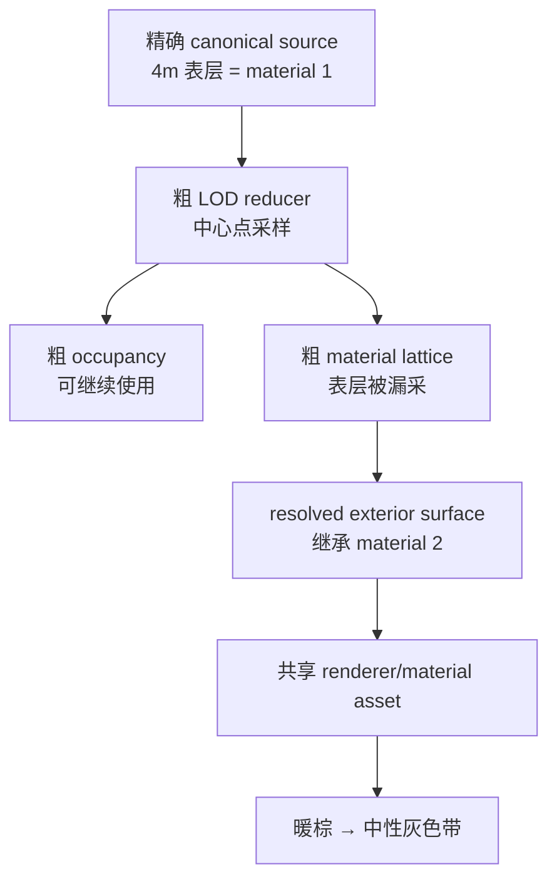

# Voxia Far LOD 外露表面材质语义修复

- **日期**：2026-07-23
- **状态**：canonical 外露材质语义与最终 ownership MID 绑定两个串联根因均已修复，并完成
  全量/Null-RHI/可见 Real-RHI/代码审查；本项不再阻断阶段 3，但阶段 3 尚未启动
- **影响范围**：canonical page/LOD material reducer、artifact schema/fingerprint、live CLI/observe、
  SceneHost 材质组合、自动化与 Real-RHI 验收
- **不改变**：服务端权威边界、完整 XYZ coverage、near/far 唯一 owner、Tile handoff、粗 occupancy、
  阶段 2 宏格交互、普通世界无微格编辑

## 1. 新证据推翻了哪一部分 closeout

2026-07-23 早先修复已经证明：

- near/far 绑定同一个 `M_VoxelWorldAligned`；
- 两侧共享稳定 UV0、canonical AO/sky 与正确的 UE Z-up/canonical Y-up 角点映射；
- target latch、逐 Tile ownership、真实 fence、near 有界队列和稳定态账本均闭合。

这些事实继续有效。但后续固定相机实跑显示，暖色近区与中性灰远区在
`Lighting=0`、`Fog=0`、`PostProcessing=0` 时仍存在。现有 `voxel_material_parity` 只用固定材质 2
fixture 比较 renderer contract，没有验证 live surface 在不同 owner/ring/LOD 最终携带相同 material id。
因此旧“外观全部 closeout”结论范围过大；这一轮先重新打开 **A8/A10 的跨 LOD 内容材质语义**。
这只能证明 canonical 内容层有缺陷，尚不能证明 presentation ownership 的最终实例父链确实有效。

受控证据位于 Voxia 工作树：

- `Saved/near_far_material_diagnosis_2026-07-23/02_no_fog_lit.png`
- `Saved/near_far_material_diagnosis_2026-07-23/04_restored_lit.png`
- `Saved/near_far_material_diagnosis_2026-07-23/06_stable_lit.png`
- `Saved/near_far_material_diagnosis_2026-07-23/07_no_lighting_no_fog_no_post.png`
- `docs/engineering-notes/2026-07-23-far-lod-surface-material-aliasing.md`

无光照截图中，近区 ROI 平均 RGB=`[168.05,147.04,121.41]`、`R-B=46.64`，远区平均
RGB=`[91.71,92.12,93.03]`、`R-B=-1.31`。只开关雾的同 ROI 121,000 像素三通道绝对差之和
平均为 `2.2382`，雾不是主因。

## 2. 串联根因一：canonical surface material 走样

默认 WorldGen 定义：

- `SoilDepthMacro=4`
- `SurfaceMaterialId=1`，调色板为暖棕 `(0.55,0.40,0.25)`
- `SubsurfaceMaterialId=2`，调色板为中性灰 `(0.50,0.50,0.50)`

`FVoxiaWorldGenCanonicalPageMaterializer` 默认每 tile 取 32 个中心点样本，并随 LOD 每级减半。
一个 tile 为 112 个宏格，所以 LOD0..4 的采样间距为 `3.5/7/14/28/56m`。从 LOD1 起，中心样本
可能完整跳过 4m 表层；resolved surface 随后正确地继承了“实体侧”材质，但实体侧输入已经从材质 1
走样为材质 2。



修复前画面中的主色带很可能是 far LOD0→LOD1 的语义切换，中央暖区可能同时包含 near 与 far
LOD0；这是基于采样间距与色相的推断。最终 live receipt 已用真实
owner/ring/LOD/material histogram 与 exact→LOD→final witness 关闭观察盲区，不能把整条历史色带
直接等同于 near/far ownership seam。

### 2.1 串联根因二：最终 ownership MID 父链失效

VXP5 surface reducer 修复后，live receipt 已证明 near/far LOD0–4 都是 material 1，但用户实跑仍看到
far 灰色。stdio 与 UE object dump 随即给出第二条独立证据链：

- SceneHost 收到的是动态 `VoxiaFarQualityMaterial`；
- 旧实现又以这个 MID 作为 ownership MID 的父级，UE 记录
  `VoxiaFarQualityMaterial is not a valid parent for ... MaterialInstanceDynamic`；
- 创建结果虽然非空，property dump 却是 `Parent=None`；
- far component slot 0 绑定该失效实例，最终回退 UE 默认灰。

因此，第一层修复保持必要且正确；剩余灰色不是雾、光照、后处理、另一套材质资产或新的
material-id 走样，而是 presentation 组合边界没有保留合法父链。

## 3. 边界裁决

外露表面材质是 canonical LOD 派生语义，不是 renderer 美化参数：

1. 粗 LOD occupancy 与外露表面 material reduction 必须解耦。occupancy 可以粗化，但外露面材质要由
   精确 source 的表面覆盖确定性归约。
2. production 服务端/内容管线最终拥有 canonical page 事实；Voxia
   `FVoxiaWorldGenCanonicalPageMaterializer` 只实现同一 source-neutral 契约的 dev provider 版本。
3. 新语义必须进入 material schema、page/artifact fingerprint 与 cache invalidation；旧 artifact
   不得静默复用。
4. DynamicMesh 与 shader 不按距离、ring、WorldGen 或“朝上表面”猜 canonical material；
   SceneHost 只组合既定材质族与 ownership 参数，并必须保证最终 MID 的父链合法。

禁止采用：

- 第二套 far 材质、ring tint 或 shader 补色；
- 增厚 `SoilDepthMacro` 以覆盖最粗采样；
- 把中心点换成另一个单点而仍声称保持薄层语义；
- 只做截图阈值，不验证 actual material id/source identity。

## 4. 先定义可观测面

现已增加同域只读命令 `voxel_surface_material_state`，输出：

```text
world_snapshot_id
source_revision
material_schema_version
owner = near | far
ring_index
lod_level
exposed_face_direction
material_histogram
surface_sample_count
exact_to_lod_mismatch_count
representative_world_samples[]
```

同一世界表面样本必须能返回 exact source material、LOD reduced material、最终 surface material、
owner/ring/LOD 与 artifact fingerprint。命令只读 confirmed/frozen snapshot 和 live receipt，不触发
重建，不产生第二 truth；观察产物写入 `.demo/observe/`。

## 5. 测试矩阵

| 层级 | 必须覆盖 |
| --- | --- |
| 纯函数 | 4m 薄表层在 LOD0..4；负坐标；六个面方向；同材质、混合材质、洞穴/悬挑；确定性 fingerprint |
| canonical page | occupancy 可粗化但外露 material 保持；missing/air/halo 区分；跨 page 与跨 LOD owner |
| artifact | surface histogram 与精确 source 覆盖守恒；旧 schema/cache 明确拒绝 |
| presentation binding | 真实 SceneHost 接收动态质量 MID；最终 ownership MID 父级合法、质量参数保留、atlas 参数后写；非法父链硬失败 |
| production root | near、far LOD0..4 的 live histogram；同世界样本 mismatch=0；ownership/gap/seam 旧门禁不回归 |
| 用户入口 | 固定相机正常 Lit 与关闭 Lighting/Fog/PostProcessing 两组；near/far owner seam 和 far ring seam 都无语义色带 |
| 长稳 | XYZ 移动、A-B-A、teleport、阶段 2 place/break 后无 stale material artifact 或资源单调增长 |

## 6. 执行顺序与结果

1. 先为真实 live surface material 身份与 histogram 写 RED automation/CLI contract；
2. 再为 thin-stratum 跨 LOD 语义写 RED 纯函数和 canonical page 测试；
3. 实现 source-neutral surface-aware material reducer，同时升级 schema/fingerprint/cache gate；
4. 接入 WorldGen dev adapter，不让 renderer 猜 source 语义；
5. 用户复验仍灰后，先用真实 SceneHost 写 ownership parent RED，再在材质组合边界展开合法
   `Material/MIC` 父链并复制动态参数；
6. 运行 Development build、全量 Voxia Automation、Node、Phase 1/2 Null-RHI、固定相机
   Real-RHI，并完成严格代码审查和文档 closeout。

以上步骤已按顺序完成。阶段 3 Prefab 依赖的 canonical material/surface 前置合同现已通过，
但本次没有开始阶段 3。

## 7. 诊断中的无效路径

- `ToggleDebugCamera`、`viewmode unlit` 返回未执行，对应截图不计证据。
- 改变过相机的 near/far 截图不计像素对比。
- handoff 未 settled 的首张截图不计稳定态证据。
- `-VoxiaWorldGenSoilDepth=64` A/B 被
  `near_worldgen_snapshot_fingerprint_mismatch` 正确拒绝；这证明唯一根 source identity
  fail-closed，不构成视觉结果，也不得为实验绕过。

## 8. 实现裁决

- `FVoxiaCanonicalVoxelSurfaceMaterialReducer` 只依赖 exact material/coverage port；粗 occupancy
  保持不变，真正外露面的材质只从精确 source coverage 归约。
- VXP5 page 保存 coarse cell 默认 surface semantic、direct-face override 与受限 regional
  fallback；manifest/payload/material schema 分别为
  `voxia_voxel_source_pages_v5`、`dense_material_u16_be_surface_coverage_v4`、
  `voxia_surface_material_coverage_v4`。
- VXP2/VXP3/VXP4、旧 manifest/payload/material schema 明确拒绝；page SHA、artifact
  fingerprint、surface dependency、stage 与 near/far boundary fingerprint 全部绑定新语义。
- WorldGen provider 最多 8 个后台 worker，各 page 独立计算、按稳定 index 串行合并，最终发布前
  再次复核 cancellation。默认宏场景 provider 从串行约 `33.27s` 降至 `4.80s`，输出不变。
- `local_disk` 开发 provider 没有 exact overlay sampler；unchanged page 保留已验证 base surface
  semantics，changed page 无法证明 exact coverage 时硬失败，不构造第二 truth。
- `UVoxiaVoxelPresentationSceneHost::EnsureRendererOwnershipMaterials()` 对动态材质输入先取合法
  `UMaterial/MIC` 父级，再创建 ownership MID、复制动态参数并最后叠加 ownership atlas 参数。
  输入或创建结果父链非法时显式失败；CLI readiness 要求三个共享实例全部存在且父链 `3/3`
  有效，不能把非空 `Parent=None` 当作 installed。

## 9. 最终证据

| 门禁 | 结果 | 产物 |
| --- | --- | --- |
| ownership parent RED/GREEN | `0/1 → 1/1`；RED 精确复现 invalid parent / `Parent=None` / 参数丢失，GREEN warning 为 0 | `.worktrees/voxia-phase2-macro-interaction/Saved/AutomationReport_FarOwnershipParent_RED_20260723/`、`.worktrees/voxia-phase2-macro-interaction/Saved/AutomationReport_FarOwnershipParent_GREEN_20260723/` |
| Development build | success，exit 0，binary 与最终源码同步 | `.worktrees/voxia-phase2-macro-interaction/Saved/Logs/build_far_parent_closeout_20260723.stdout.log` |
| Voxia Automation | `153/153` 无失败（151 Success + 2 expected warnings） | `.worktrees/voxia-phase2-macro-interaction/Saved/AutomationReport_FarParentCloseout_20260723/index.json` |
| Node | 6 files，`82/82` pass，0 fail | `.worktrees/voxia-phase2-macro-interaction/Saved/Logs/node_far_parent_closeout_20260723.stdout.log` |
| Phase 1 Null-RHI | `passed=true`；25 条完整 XYZ/teleport/retry/new game 路线，clean exit，far release `11/11/0` | `.demo/observe/voxia_phase1_2026-07-23T14-12-48-405Z_null_rhi_1280x720/` |
| Phase 2 Null-RHI | `passed=true`；material 6 place/break、X/Y/Z reload、最终 empty，Phase 3 拒绝合同通过 | `.demo/observe/voxia_phase2_2026-07-23T14-19-39-157Z_null_rhi_1280x720/` |
| 可见 Real-RHI | D3D12 Development，1600×900，唯一根 ready，同机位 Lit/控制图，771/771 far 可见，clean exit 0 | `.worktrees/voxia-phase2-macro-interaction/Saved/near_far_parent_chain_nearfar_2026-07-23/` |

最终 Real-RHI 现场同时证明：

- root near geometry、far 与 Tile handoff 均 ready，中心为 `[11,0,-51]`，
  gap/overlap/seam-gap/orphan=`0/0/0/0`；
- `shared_material_instances=3`、`shared_material_parent_valid_instances=3`、
  `shared_material_parent_valid=true`、`shared_materials_installed=true`；
- quality MID 与 opaque ownership MID 的 `Parent` 都是
  `/Game/Voxia/Materials/M_VoxelWorldAligned`；far component
  `Pure3D_FarPatch_10_0_-17_Shard_0_0` 的 slot 0 实际绑定该 ownership MID；
- 初始 near histogram 为 material 1 `15933`，far LOD0–4 分别为 material 1
  `121343/82135/241505/129692/117527`；30 个 representative witness 的 exact unresolved、
  exact→LOD、LOD→final 均为 0；
- 同相机关闭 Lighting/Fog/PostProcessing 后，near/far ROI 中位 RGB 为
  `[179,157,128]` 与 `[178,156,128]`，最大通道差 1，两侧灰色像素比例均为 0。

此前 `.worktrees/voxia-phase2-macro-interaction/Saved/near_far_surface_semantic_final3_2026-07-23/`
只证明了 canonical material-id 一致；它把“两侧都接近中性灰”误当作视觉 closeout，现已由上述
真实 parent、component slot 与暖棕控制图证据取代。

最终审查额外以 RED 锁定并修复 mixed histogram 冒充 directional uniform proof、反向 corridor、
极端 resolution 乘法/分配、deterministic merge 后取消发布、跨 page 归约统计超过 `int32`
以及 `INT64_MIN/MAX` cell-volume 邻格偏移等问题。最后两项由
`.worktrees/voxia-phase2-macro-interaction/Saved/AutomationReport_SurfaceOverflow_RED_20260723/`
的 `0/1` 推进到
`.worktrees/voxia-phase2-macro-interaction/Saved/AutomationReport_SurfaceOverflow_GREEN_20260723/`
的 `1/1`。修复未引入第二套 far 材质、ring tint、shader 补色、`SoilDepthMacro` 增厚、
等待型生产修复或第二组合根。

最终独立审查覆盖 `334ff779..1158d6b`，对 UE5.8 parent 规则、参数覆盖顺序、三材质族、
fail-closed、UObject 生命周期、真实 SceneHost 反例与架构边界复核，Critical/Important/Minor
均为 0。本问题至此关闭；阶段 3 已解除本项前置阻断，但本次没有开始阶段 3。

## 10. 颜色收口后暴露的近景边缘 transition 修复

颜色与 actual material-id 已一致后，用户继续走到边缘时暴露了一个独立活性问题：confirmed
revision 改变且快速跨多个 Tile 时，旧 renderer near owner 所需的外侧 far 边界不在最终目标的
固定 slab 内，逐 Tile ownership 因精确 boundary miss 停止提交，所以视觉上仍是旧 far。

本修复没有改变材质、加载距离或表土厚度。Unified Root 按 handoff generation 冻结真实
`RendererNearOwnedTiles`；canonical builder 为真实 live 与最终 target 的并集生成完整六面
far boundary，并把 transition fingerprint 贯穿所有异步 stale gate、hidden stage 与 root commit
permit。CLI 同时输出精确 boundary miss receipt 及 requested/desired/in-flight/live identity；
64 位 fingerprint 使用十进制字符串，Node 门禁做无损相等比较。

最新验证在 Voxia 核心提交
`509c91d365a8fca1c0773a5daaac9fe1c5c6001b`、文档提交
`802817d83753d6aa9b986df1d40294e012a11233` 上完成并已推送：

| 门禁 | 结果 | 产物 |
| --- | --- | --- |
| Development build | success，exit 0 | 最终 Development binary |
| Voxia Automation | `151/151`，0 failed，2 项仅含预期 warning | `.worktrees/voxia-phase2-macro-interaction/Saved/AutomationReport_TransitionFinal_20260723/` |
| Node | `83/83` pass，0 fail | transition identity/cold bootstrap/boundary miss 门禁 |
| Phase 1 Null-RHI | `passed=true`，25 条完整 XYZ 路线；`handoff_failed=0`、boundary miss true=0 | `.demo/observe/voxia_phase1_2026-07-23T16-48-33-789Z_null_rhi_1280x720/` |
| Phase 2 Null-RHI | `passed=true`；material 6 place/break、revision 1/2、X/Y/Z reload、最终 empty | `.demo/observe/voxia_phase2_2026-07-23T16-55-15-847Z_null_rhi_1280x720/` |
| 可见 Real-RHI | D3D12 Development 唯一根；跨多个 Tile 后 `[8,0,-52]` ready，27/0/0/27，所有 gap/seam/miss 为 0 | `.worktrees/voxia-phase2-macro-interaction/Saved/near_far_transition_final_real_rhi_2026-07-23/` |

Real-RHI 的四处 transition fingerprint 精确一致为
`"9416127099811288665"`；near 与 far LOD0–4 histogram 仍只含 material 1，30 个 witness 的
unresolved、exact→LOD、LOD→final 均为 0。同机位 Lit、关闭 Lighting/Fog/PostProcessing 与恢复
Lit 均已保存，恢复前后全图 PSNR 为 `49.255125 dB`。严格终审没有剩余
Critical/Important/Minor。至此材质语义、最终绑定与近景边缘 transition 三层问题全部关闭；
阶段 3 仍未在本轮启动。
