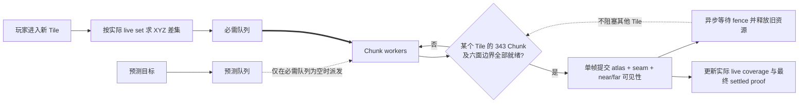

# Voxia 按 Tile 渐进流送治理决策

- **日期**：2026-07-24
- **状态**：已实施并通过自动化、Null-RHI 与 Real-RHI 验证
- **范围**：唯一生产组合根的 near/far 流送、优先级、可见交接、安全限行与可观测面
- **不改变**：服务端权威、confirmed truth 来源、完整 XYZ、`3×3×3` near 窗口、单 Tile
  `7×7×7 = 343 chunks`、唯一生产根

## 1. 结论

本轮不另造一套流送框架，而是在现有 Tile ownership 事务上删除不必要的全局串行门槛：

1. 玩家进入新 Tile 时，立即把新 near 窗口差集加入**必需队列**。
2. Chunk 是最小调度粒度；同一 Tile 的 343 个 Chunk 可并行准备，不同 Tile 也不得被单一
   ownership ticket 串行阻塞。
3. 一个 Tile 的数据、网格、材质和六面边界全部就绪后，在一个 GameThread frame 内完成该位置
   `FarOwns ↔ NearOwns` 的可见替换及 seam 更新。
4. render fence 用于证明和延迟释放旧资源，不再阻塞其他已就绪 Tile 的准备或可见提交。
5. 预测预取允许存在，但只能使用必需队列不用的容量；必需任务到来后，预测任务必须在 Chunk
   边界让路，绝不能让必需任务排队等待预测任务。
6. 玩家可越出尚未更新完成的 near coverage。按实际 live near coverage 计算完整 XYZ/L∞
   超出深度：`1..2 chunks` 继续移动且不弹阻塞提示；达到 `3 chunks` 且必需任务仍未完成时，
   停止继续移动并显示“加载中”，恢复覆盖后自动解锁。

正常单轴移动时，旧 near 前缘本身提供一整个 Tile，即 7 个 Chunk 的提前量；再加允许超出的
3 个 Chunk，流送共有最多 10 个 Chunk 的移动时间。默认速度下约为：步行 `26.7s`、冲刺
`14.8s`、飞行 `11.4s`。深度 3 是异常慢加载的安全闸，不是正常流送的常态路径。

## 2. 与既有文档和实现的差异

| 维度 | 之前文档 | 实施前实现（本轮诊断基线） | 本轮决策 |
| --- | --- | --- | --- |
| 触发时机 | 进入新 Tile 后开始 staging | `MaybeRefreshSubscription` 已按 Tile 变化触发 | 保留；不再依赖固定 12 秒预取才能及时 |
| 调度粒度 | Tile 是可见提交原子 | Chunk worker 已并行，但 Tile 聚合 future 一次只处理一个 | Chunk 并行准备，Tile 原子可见提交 |
| near 就绪门槛 | 最终窗口要求 27 Tile 全部 ready | `NearActivePresentationBarrier::CanCommit()` 把 27 Tile 作为 root commit barrier | 单 Tile ready 即可交接；27 Tile 只作为最终 settled proof |
| ownership 推进 | 一次提交一个 Tile，并等待 staging/post fence | 单 `ActiveRendererTileTicket` 串行 stage→activate→post fence；根 tick 为 10Hz | 单帧仍只做一个 Tile 的可见 mutation，但 fence 等待不阻塞其他 Tile |
| far 时序 | 全部 entering live 后才 permit 目标 far；far fence 后才退出旧 Tile | `ShouldDeferFarDispatch` 在 near loading/not-ready 时推迟 far | entering Tile 直接替换其旧 live far；退出 Tile 的 far counterpart 属于当前必需任务，整窗 far 不再阻塞 entering |
| seam | 文档要求实际 seam component 和零 gap/overlap | SceneHost 已能生成 `±X/±Y/±Z` 六面边界 | 保留六面 seam；与 Tile ownership 在同一 frame 提交 |
| 玩家越界 | depth `1..2` 非阻塞提示，depth `>=3` recovery loading；文档称 guard 不改移动 | `SafeViewHold` 仍为 GameOnly，`RecoveryLoading` 为 UIOnly，实际上 depth 3 才阻塞输入 | depth `1..2` 静默继续；depth `>=3` 显式发送零移动意图并阻塞输入，禁止客户端改写 confirmed position |
| 预取优先级 | 有 speculative/required 语义，但未写物理容量保证 | 同 key 可 promotion；但预取先于 required 调用，废弃 worker 仍可能占满全局 2 个 physical slots，使 required 失败或等待 | 必需队列绝对优先；停止派发预测 Chunk，运行中的预测 Chunk 在最近边界退出；物理 limiter 必须保留必需容量 |
| 性能验收 | 记录过阶段性 Real-RHI 通过数据 | 新鲜复跑一轴流送需 `14.340s`，GameThread p95 `7.568ms`，门禁失败 | 增加端到端流送时延和逐 Tile 提交证据；旧数据仅保留为历史证据 |

因此，本轮与
[2026-07-22 near/far Tile 交接设计](2026-07-22-near-far-tile-handoff-repair.md)
的核心差异不是取消 Tile 原子性，而是取消以下两个全局门槛：

- 不再等全部 entering Tile live 后才允许任何 entering Tile 完成 far→near 替换；
- 不再让一个 Tile 的 post-visibility fence 阻塞下一个已就绪 Tile。

旧设计中的绝对 live Tile set、18 个 retained Tile、9 个 entering/exiting Tile、双缓冲 ownership
atlas、真实 fence、latest-wins 后继目标、零 gap/overlap 和失败显式化全部保留。

## 3. 简化后的运行流程

预测任务与必需任务使用同一份 artifact identity 和 cache。若预测命中当前目标，直接 promotion
并复用已经完成的 Chunk；若未命中，结果只能留在有界 cache，不能产生可见 mutation。

### 3.1 Tile ready 的唯一含义

一个 Tile 只有同时满足下列条件才可进入可见提交：

- 精确匹配当前 world/source/content/generation/Tile identity；
- 343 个 Chunk 全部有明确结果，空气 Chunk 也必须计入完成；
- CPU 数据、mesh、材质绑定和 ownership 候选均已准备；
- `±X/±Y/±Z` 六面边界能与相邻 live near/far owner 形成封闭 coverage；
- 没有失败、取消、旧 generation 或未决 source revision。

不得把“部分 Chunk 已经有网格”报告为 Tile ready，也不得用缺块兜底或运行时 snapshot 绕过
baseline 校验。

### 3.2 单帧替换与 fence

单个 Tile 的可见提交仍保持原子：

1. 在 frame 开始前准备好 candidate atlas、seam 和 hidden near/far component；
2. 在同一个 GameThread frame 内提交 ownership atlas、seam 和组件可见性；
3. 当帧结束后异步观察 post-visibility fence；
4. fence 完成后释放旧 owner，并把该 Tile 记入完整事务 proof。

为控制 GameThread 峰值，每帧最多提交一个 Tile 的可见 mutation。这里的“一次一个”只限制
可见 mutation，不限制后台并行准备，也不要求等待前一个 Tile 的 fence 才提交下一个。

### 3.3 entering 与 exiting

- **entering**：新 near Tile ready 后，直接用它替换同位置仍可见的旧 far Tile。
- **exiting**：只有同位置目标 far counterpart 已 ready，才执行反向替换并退休旧 near Tile。
- far counterpart 缺失时，它属于当前过渡的必需任务，不属于预测任务。
- 整个目标窗口的 far generation 可以继续保持内部原子，但它的最终整窗提交不得成为 entering
  Tile 可见的前置条件。

首窗、传送、无交集跳跃或 live far coverage 不足仍可走显式整窗 recovery；该路径必须标为
recovery，不能回流成普通移动的默认门槛。

## 4. 必需任务与预测预取

只保留两个优先级，不引入更多队列层级：

1. **Required**：玩家当前 Tile 对应的新 near 差集、退出位置所需 far counterpart，以及恢复
   玩家 live coverage 所需工作。
2. **Speculative**：基于速度和方向预测的未来 Tile。

调度契约如下：

- 只要 Required 非空，就不派发新的 Speculative Chunk；
- 新 Required 到来时，已运行的 Speculative 在最近的 Chunk 边界取消或挂起；
- physical worker limiter 必须为 Required 保留容量；Speculative 不得因为占满 fuse/slot 而让
  Required 失败、超时或排队；
- 同 identity 的 Speculative 原地 promotion，不重算已完成 Chunk；
- 不同 identity 的旧预测结果不得获得 ownership ticket 或可见提交权。

这修复了当前实现“逻辑上 required 优先、物理 worker 仍被预测任务占用”的断层。

## 5. 深度 3 安全闸

安全距离按**实际 live near Tile coverage 的并集**计算，而不是只看尚未整窗提交的旧 AABB；
这样某个 entering Tile 一旦提交，安全边界会立即向前扩展。

- `outside_depth_chunks = 0`：正常移动；
- `outside_depth_chunks = 1..2`：正常移动，不显示阻塞加载界面；
- `outside_depth_chunks >= 3` 且 Required 未完成：客户端停止继续发送非零移动意图，切换
  UIOnly 并显示“加载中”；
- 玩家当前位置重新被 live near coverage 覆盖且没有确定性失败后，自动恢复输入。

该闸只限制用户继续移动，不把客户端位置当成 confirmed truth，不回滚服务端坐标，也不吞掉
加载失败。确定性错误或超时必须进入可诊断失败态。

## 6. 可观测面与验收

在现有 `client_flow_state`、`voxel_streaming_state`、`voxel_presentation_state` 和 frame perf
基础上补齐：

- `required_queued/running`、`speculative_queued/running`、promotion/cancel 原因；
- 每个 Tile 的 identity、完成 Chunk 数、ready、visible、fence pending 和 owner；
- 每次 swap 的 frame、方向、旧/新 owner、六面 seam 状态；
- 玩家相对实际 live coverage 的 `outside_depth_chunks`；
- `movement_blocked`、阻塞原因和恢复原因；
- 从跨 Tile 到首个 entering Tile visible、全部 entering visible、最终 settled 的墙钟时延。

最小自动化矩阵：

- Required 到达时预测任务让路，且不能因预测占用 physical slots 失败；
- 同 identity 预测结果可 promotion，旧 identity 不可 visible；
- 343 Chunk 未齐时不可提交，齐备后无需等待其他 26 Tile；
- 连续两个 ready Tile 可在相邻 frame 提交，不等待前一个 post fence；
- `±X/±Y/±Z`、负坐标、快速折返均保持 gap/overlap/seam 为 0；
- depth `0/1/2/3` 分别验证移动与 overlay，恢复覆盖后自动解锁；
- NullRHI lifecycle、Real-RHI 单轴/XYZ、stdio CLI 均给出逐 Tile 与墙钟证据；
- Real-RHI 继续满足既有 frame budget，并新增正常移动不触发 depth 3 限行的门禁。

## 7. 明确不做

- 不改变 Tile/Chunk 尺寸、near 半径或完整 XYZ 空间契约；
- 不新增第三套 world root、第二份 voxel truth 或客户端 confirmed truth；
- 不把每个 Chunk 变成独立可见切换，Tile 仍是最小可见原子；
- 不用固定等待、提高超时、吞错或无限增加 worker 数掩盖串行；
- 不要求删除预测预取，只要求它严格服从当前必需加载；
- 不把首窗/传送 recovery 当作普通走路的性能证明。

## 8. 文档收口要求

实现完成后必须同步修订
[`docs/00-current-truth/design/client/streaming-lod.md`](../../00-current-truth/design/client/streaming-lod.md)：

- 把“27 Tile 全部 ready 才可提交”改为“逐 Tile visible、整窗只作 settled proof”；
- 把 depth `1..2` 非阻塞提示改为静默继续；
- 明确 Required 对 Speculative 的物理容量优先级；
- 用 2026-07-24 之后的 fresh NullRHI/Real-RHI 证据替换过时性能结论。

在新门禁通过前，历史 correctness 证据仍可证明 ownership/seam 语义，但不得继续用它宣称当前
流送已经顺畅或满足性能目标。

## 9. 实施结果与验证证据

本轮没有新增队列层级或第二套流送根，实际修改集中在四个既有 owner：

| Owner | 已实施变化 |
| --- | --- |
| Near prepare / mesh | Required 可使用全部物理容量；Speculative 最多使用 `worker_limit - 1`，只在 Required 无待派发 Chunk 时运行。WorldGen/pack 按最多 32 Chunk 批次处理，mesh 仍以 Chunk 为后台粒度。 |
| Tile registry / root | 每个 Tile 独立记录 343 Chunk、六面边界和 staged/ready/live/retiring；每帧最多提交一个 ready Tile，进入侧不等待整窗 far。 |
| Scene host / ownership | atlas、seam 与 near/far 可见性同帧原子切换；post-visibility fence 独立排队退役，不阻塞下一 Tile；live far 自维护当前 near 外扩一层的六向边界。 |
| Coverage / safe view | 中间态报告实际 live Tile 并集；单轴交接可暂时为 28 Chunk 跨度，final proof 恢复精确 21。只有玩家在实际 coverage 外 depth `>=3` 且 Required pending 才阻塞。 |

可游玩期间的 far 整代重算仍是低优先级后台工作，不改为逐 Tile far generation。为避免其
surface 扫描与 GameThread 争用，Pure3D far 使用专用最低优先级单 worker；组合根在每个 frame end
持续授予 `0.30ms` 协作时间片，sample 循环与 page 边界都检查预算，取消与 EndPlay 主动唤醒。
这不是逐页固定 sleep，也不改变 Required near 的容量或可见提交顺序。

验证结果：

- Development build：成功；
- `Automation RunTests Voxia`：`155/155` Success；
- Node 合约：`85/85` 通过；
- 完整 Null-RHI 生命周期：`passed=true`，证据
  `.demo/observe/voxia_phase1_2026-07-24T16-41-33-553Z_null_rhi_1280x720/`；
- Real-RHI 相邻往返：`passed=true`，两个最终收敛窗口为 `34.670s / 33.104s`，
  GameThread p95=`3.106ms / 3.015ms`、p99=`5.759ms / 7.824ms`，证据
  `.demo/observe/voxia_phase1_2026-07-24T16-35-35-576Z_real_rhi_1280x720/`。

Real-RHI 事件顺序证明进入侧不是等最终 far：目标 center `[12,0,-51]` 的 9 个 X+ Tile 在
near ready 后逐帧完成 `FarOwns → NearOwns`；随后 far generation 3 回填，9 个 X- Tile 再逐帧
执行 `NearOwns → FarOwns`，最后才提交 `voxel_authority_stream_committed`。全过程
`gap/overlap/seam/orphan=0/0/0/0`，`future_far_boundary_wait=false`，没有触发 depth 3 recovery。
