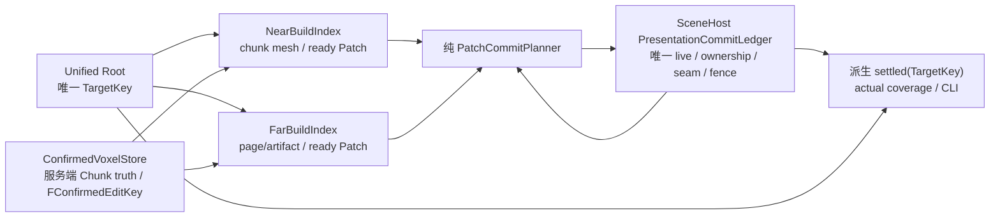

# Voxia Near/Far Patch Diff 流送设计

- **日期**：2026-07-25
- **状态**：实施中；核心 Patch 架构与 Far ready-stream 已落地，完整 Real-RHI/长稳门禁待刷新
- **范围**：唯一生产组合根中的 near/far 准备、可见提交、ownership、边界封口、退役、
  移动流送与 confirmed 体素编辑呈现
- **前置决策**：
  - [2026-07-24 Voxia 按 Tile 渐进流送治理决策](2026-07-24-voxia-tile-streaming-governance.md)
  - [当前客户端流送与 LOD 真值](../../00-current-truth/design/client/streaming-lod.md)
- **不改变**：服务端权威、confirmed truth 来源、baseline 硬校验、完整 XYZ、默认
  `3×3×3 tiles = 27 tiles = 9261 chunks` near 窗口、唯一生产组合根

## 1. 审查结论

原稿不能直接实施。它正确识别了“已有 diff 没有贯通到可见发布”这个根因，但又引入了新的
重复事实和运行时兜底：

1. `PatchCommitSet` 会根据共享边界动态扩大，并用 `27` 作为没有数学来源的保险丝；
2. `TargetEpoch / LiveEpoch / SettledEpoch` 与现有 generation、serial、latch、proof 重复表达目标；
3. Near/Far registry 同时拥有 build、live、component 和 fence，会与 SceneHost 争夺 presentation truth；
4. “超预算保持旧 live、输入变化后自动 retry”混淆了原子替换、暂时 Busy 和确定性失败；
5. 迁移期 compatibility adapter 会让 Tile/whole-generation 与 Patch 两条正式路径继续并存；
6. Near `4³ chunks` 的预算只算稳定 `21³` 窗口，漏算相邻三轴过渡；
7. 现有代码里已经存在同类问题，不能只改新设计而继续保留旧兜底。

修订后的核心原则是：

> 后台依赖使用固定 stencil；可见事务使用固定形状；边界由固定边界壳封闭；任何依赖都不得在
> 运行时递归扩散。目标只有一个 `TargetKey`，live presentation 只有 SceneHost 一份账本，
> settled 只从事实派生。

`27` 只保留两个有明确空间含义的地方：

- near 稳定目标是 `3³ = 27 tiles`；
- near mesher 对一个 changed Chunk 使用固定 `3³ = 27 chunks` 失效 stencil。

它不再是 CommitSet 上限、恢复阈值或“依赖可能扩散”的兜底数字。

## 2. 为什么不能靠 CommitSet 扩散

原稿把三件不同的事混在了一起：

1. **构建输入依赖**：某个 Chunk/page 变化后，哪些 mesh/surface 需要重算；
2. **可见边界闭合**：新 Patch 与当前 live 邻居之间如何不出现洞、重复面或 LOD 裂缝；
3. **可见提交原子性**：同一帧必须切换哪些 geometry、ownership 与 seam 资源。

若把构建依赖直接转换为“把邻 Patch 一起提交”，就会出现递归闭包：

```text
Patch A 边界不匹配 B
  → 把 B 加入 CommitSet
  → B 的另一边不匹配 C
  → 再把 C 加入
  → 最后只能设置一个任意上限
```

这不是正常运行时状态，而是边界所有权没有设计完整。检测“扩散超过 27”只会为错误架构再增加
搜索、visited set、失败分支和恢复状态。

修订后不搜索闭包：

- near 移动事务固定提交一个 Near Patch；
- near confirmed 单 Chunk 更新固定提交由 mesher stencil 直接映射出的 `1..8` 个 Near Patch；
- far 事务固定提交一个 Far Patch；
- 每个事务同时提交该 Patch 的固定边界壳，边界壳可以读取当前 live 邻居的不可变 profile，
  但不会把邻 Patch 拉进事务。

## 3. 唯一事实与 Owner

### 3.1 Root：只拥有 TargetKey

唯一生产根只保存当前期望目标：

```text
TargetKey {
  world_snapshot_id
  source_fingerprint
  desired_window_serial
  center_tile_xyz
  near_radius_tiles
}
```

`TargetKey` 是 near/far 共同消费的不可变值。它取代 root 级
`HandoffGeneration / CandidateGeneration / TargetEpoch / SettledEpoch` 等平行身份。

`TargetKey` 只表达“当前会话要呈现哪个空间窗口”，不能成为包住一切变化的超级 epoch。
confirmed truth 仍只由 confirmed voxel store 按 Chunk 保存服务端 revision 与内容；单 Chunk
confirmed update 不创建新 TargetKey，也不使无关 Patch 过期。它产生独立的不可变事件身份：

```text
FConfirmedEditKey {
  chunk_id
  server_revision
  delta_fingerprint
}
```

BuildIndex 用该事件更新受固定 stencil 影响的目标 PatchVersion。没有受影响的 PatchVersion、
在途工作和 live presentation 保持原身份，不做 generation relabel。
其中 `source_fingerprint` 只绑定当前会话不可变的 baseline/schema/source contract，不得混入滚动
confirmed overlay revision；否则它仍会退化成全局 invalidation epoch。

Root 负责：

- 在移动、bootstrap、relocate 或会话 source identity 改变时发布最新 `TargetKey`；
- 派发 Required/Speculative 工作；
- 从 near/far build index 与 SceneHost 读取同一 `TargetKey` 的不可变 receipt；
- 从 SceneHost 的 committed near mask 计算 actual coverage 观察值；
- 只从显式 `Relocate` transition 读取动作阻塞，不从 coverage 距离推导策略；
- 计算派生的 `settled(TargetKey)`。

Root 不保存 live Patch 集合、renderer ownership 镜像、component、mesh、atlas、seam 或 fence。

### 3.2 NearBuildIndex：只拥有 near 构建事实

NearBuildIndex 维护：

- 当前 `TargetKey` 导出的 Near Patch 目标指纹；
- Required/Speculative chunk work；
- confirmed voxel store 发出的 `FConfirmedEditKey` 与受影响 Patch 目标；
- chunk CPU mesh store 与唯一 mesher dependency stencil；
- Patch assembler 的 in-flight/ready/failed 项；
- stale/cancel 计数和固定容量。

它只产出不可变 `FNearPatchVersion`，不拥有 staged/live/retiring component、ownership 或 fence。

### 3.3 FarBuildIndex：只拥有 far 构建事实

FarBuildIndex 维护：

- cube-shell target 与 Far Patch 目标指纹；
- confirmed voxel store 发出的 `FConfirmedEditKey` 与受影响 canonical page/surface/Patch 目标；
- page/cell diff、residency、artifact cache 与 reverse dependency index；
- Patch cursor、in-flight/ready/failed 项；
- 每个 Far Patch 的 core mesh 与 boundary profile。

它只产出不可变 `FFarPatchVersion`，不拥有 live component、ownership atlas 或 render fence。

### 3.4 SceneHost：唯一 presentation truth

`UVoxiaVoxelPresentationSceneHost` 的单一 `PresentationCommitLedger` 拥有：

- committed near/far PatchVersion map；Far 项同时持有 immutable boundary profile ref；
- exact near-owned Chunk mask；
- live/staged/retiring geometry handle；
- canonical far boundary-slot map、near/far seam-slot map 与 ownership atlas；
- staging fence、post-visibility fence 与资源池；
- 一个仅用于观测的 `commit_serial`。

NearBuildIndex、FarBuildIndex 和 Root 都不得再保存可写的 live 镜像。



## 4. 强类型空间身份

不使用带 `domain + span + unit` 的通用运行时 `PatchId`。Near/Far 单位不同，应由类型阻止误用：

```text
FNearPatchId {
  patch_xyz  // 单位：4 chunks
}

FFarPatchId {
  patch_xyz  // 单位：8 tiles
}
```

固定布局：

- `FNearPatchLayout::ChunksPerAxis = 4`；
- `FFarPatchLayout::TilesPerAxis = 8`；
- 负坐标统一使用 floor division；
- origin、span、center 不重复写入每个 id；
- 若以后修改布局，必须新建 layout/schema version 并重新设计、重新验收，不能在运行时混用。

PatchVersion 是内容身份，不是构建批次：

```text
FNearPatchVersion {
  patch_id
  exact_owned_chunk_mask
  source_fingerprint
  confirmed_input_fingerprint
  content_fingerprint
  dependency_fingerprint
}

FFarPatchVersion {
  patch_id
  exact_page_owner_mask
  source_fingerprint
  content_fingerprint
  dependency_fingerprint
  boundary_profile_fingerprint
}
```

只有完整 PatchVersion 相等才允许 retained reuse。禁止只比较 generation、center 或 source
fingerprint 后给旧 receipt 改写新身份。

## 5. Near 的固定依赖合同

### 5.1 唯一 mesher stencil

现有 near worker 冻结完整 `3×3×3 chunks` 邻域，`18³` macro samples 中的 AO 还会读取
棱邻居和角邻居。现有 exact presentation fingerprint 和 transaction path 却只混入 self + 六面，
会漏掉 edge/corner AO 变化。

本轮必须定义唯一编译期合同：

```text
FNearMesherStencil::ChunkOffsets = [-1, 0, 1]³  // 恰好 27 个
```

freeze、fingerprint、invalidation、测试和 CLI 都只能调用这一份 stencil，禁止各自手写
“self + 六面”。

对于一个可以替换整 Chunk 的 confirmed `ChunkDelta`：

- mesh target 固定为 changed Chunk 周围 `3³ = 27 chunks`；
- 这些 mesh target 所需的 source closure 固定为 `5³ = 125 chunks`；
- 27 个 mesh target 投影到全局 `4³ chunks` Patch 网格后，最多命中
  `2×2×2 = 8` 个 Near Patch。

这里的 `8` 是空间类型容量，不是运行时扩散上限。代码不搜索邻 Patch，也没有
“超过 8 保留旧 live 再试”的分支；若单 Chunk 事件映射出第 9 个 Patch，就是 stencil 或坐标实现
错误，Development 使用 `checkf` 暴露，session 同时进入 Fatal。

阶段 2 的 confirmed 宏格编辑每次只产生单 Chunk 更新。未来跨 Chunk 原子事务
（Prefab/Field 大事务）不允许偷用这个合同，必须在对应阶段单独定义 authority transaction 与
presentation atomicity。

### 5.2 移动事务

玩家进入新 Tile 后：

1. Root 发布最新 `TargetKey`；
2. NearBuildIndex 从固定 `21³ chunks` 窗口生成全局 Near Patch 目标与 partial mask；
3. Required chunk 立即占用全部可用 worker 容量；
4. 一个 Patch 的 owned chunks、CPU mesh 与 `FNearMesherStencil` 输入齐备后产出
   `FNearPatchVersion`；
5. `PatchCommitPlanner` 每次选择一个 Required Near Patch；
6. SceneHost 同帧提交 Patch geometry、partial ownership mask 与相交 near/far boundary；
7. actual near coverage 立即从 SceneHost committed mask 变化；
8. 不等待完整 Tile 或其余目标 Patch。

### 5.3 Confirmed edit 事务

1. 点击只发 intent，不改 confirmed presentation；
2. 服务端 `ChunkDelta/ChunkSnapshot` 更新 confirmed mirror 并产生 `FConfirmedEditKey`，不改变
   `TargetKey`；
3. NearBuildIndex 使用唯一 `FNearMesherStencil` 得到 27 个 mesh target；
4. 直接映射为 `FNearEditCommit` 的 `1..8` 个 PatchId，不递归扩大；
5. 所有命中 PatchVersion ready 后，SceneHost 在一个 frame 原子切换该固定 batch；
6. presented receipt 必须匹配 `FConfirmedEditKey` 与全部 PatchVersion。

移动和 confirmed edit 共用 NearBuildIndex、Near Patch assembler 和 SceneHost ledger；区别只在
固定的提交形状：移动为一个 Patch，单 Chunk confirmed edit 为最多 8 个 Patch。

## 6. Far 的固定边界合同

### 6.1 现有 8³ Patch 为什么尚不能直接逐 Patch 发布

现有 cube-shell cell 使用 dyadic `span=1/2/4/8 tiles` 并全局 XYZ 对齐，因此 cell 不跨越
`8³ tiles` Far Patch 边界；但 surface 会读取邻域最终 coverage owner/content。

这只证明 cell 切分固定，不证明 `A_new + B_old` 的共享边界一定闭合。当前 SceneHost 没有
far/far reciprocal boundary receipt；新 Patch 按目标邻居构建、旧 Patch 按旧邻居构建时，可能出现：

- 旧 `solid/solid` 双方都裁面；
- 新状态变为 `air/solid`，应由 solid 邻居出面；
- 若先换 air Patch、solid 邻居仍是旧版，共享面会暂时缺失。

因此不能直接把已有 far patch map 改成逐项 Swap，也不能用 CommitSet 扩散掩盖。

### 6.2 Canonical boundary slot

Far 边界不归任一 Patch 私有。SceneHost 使用三种强类型拓扑 slot 作为唯一事实：

```text
FFarFaceSlotId   { axis, plane_xyz }
FFarEdgeSlotId   { axis, line_xyz }
FFarCornerSlotId { vertex_xyz }
```

坐标都位于全局 `8³ tiles` Far Patch 网格。一个 Patch 恰好关联 `6 faces + 12 edges + 8 corners
= 26` 个 canonical slot；相邻 Patch 对同一拓扑位置得到完全相同的 SlotId。SceneHost ledger
按 SlotId 只保存一份 live artifact，禁止把边界复制进两个 PatchVersion。

slot 的 after-image 从所有 incident live Patch profile 计算：face 最多读 2 个、edge 最多读 4 个、
corner 最多读 8 个 profile。若其中一个 incident Patch 是本次 candidate，使用 candidate profile；
其余使用 SceneHost immutable snapshot 中的 live profile；FarBuildIndex 同时提供当前 target
membership fingerprint，用来明确区分“target 外侧”与“target 内但尚未 live”。

### 6.3 固定 PatchBoundaryShell

每个 Far Patch 额外产出不可变 boundary profile。SceneHost 按当前 candidate 与周围 live profile
快照派发纯 `FFarBoundaryShellBuilder`，构建固定 `PatchBoundaryShell`：

- 一个 candidate Patch 仍是唯一 geometry Patch；
- 固定读取 `3×3×3 - self = 26` 个邻位的 immutable boundary profile；
- 六个面生成 exact face 或确定性 LOD stitch/vertical skirt；
- 棱和角 cap 由同一个 shell 构建器闭合；
- 输出是上述 26 个 canonical slot 的完整 after-image；无几何的 slot 也以显式 remove 表达；
- target 外侧无邻居时生成永久 outer wall；target 内但尚未 live 的邻居生成临时闭合 wall，
  该邻居提交时会重算并替换同一 SlotId；
- near ownership frontier 穿过时，使用 SceneHost 实际 committed near mask 生成 near/far seam；
- boundary shell 与 Patch geometry、ownership 在同一 frame 切换；
- commit 前精确验证 candidate、target membership 与 26 个邻位 profile fingerprint；快照已变化则记为
  `Cancelled` 并从新快照重新计划，不提交旧 shell。

这 26 个 profile 只是固定只读输入，不是 26 个待提交 Patch。邻 Patch 不重建、不 stage、不加入
事务，因此不存在 dependency closure、visited set 或 27 Patch cap。

若固定 shell 无法构造闭合结果，说明 boundary profile、LOD stitch 或 mesher 合同有错误：

- candidate 不可见；
- TargetKey 进入 Fatal；
- Development 直接断言并保留可复现输入；
- 不拉入邻 Patch，不复用旧 face，不改写 generation，不自动 retry。

### 6.4 Far 数据流

```text
plan TargetKey
  → page/cell diff
  → fixed reverse dependency index: dirty page → affected surface → FarPatchId
  → Required before Speculative
  → resolve one Far Patch core + boundary profile
  → emit immutable FFarPatchVersion
  → build 26 canonical boundary-slot after-images against current live profiles
  → commit exactly one Far Patch + its boundary-slot after-images
  → continue next Patch
```

保留：

- page residency；
- source-bound material/surface/lighting cache；
- complete dependency fingerprint；
- cooperative cancellation；
- mesh shard；
- existing low-priority work quantum。

移除：

- 完整 `FVoxiaWorldGenVoxelShellBuildResult` 才能进入发布的门槛；
- hidden whole-generation resource set；
- whole-generation permit；
- far-to-far 必须全代原子切换的合同。

## 7. SceneHost 固定可见事务

只保留三种 production transaction：

```text
NearMoveCommit   = 1 NearPatchVersion + ownership subrect
                   + affected near/far seam-slot after-images
NearEditCommit   = 1..8 NearPatchVersion + ownership changes
                   + affected near/far seam-slot after-images
FarPatchCommit   = 1 FarPatchVersion + 26 canonical far boundary-slot after-images
                   + affected near/far seam-slot after-images
```

不再存在通用 `PatchCommitSet`。

Near chunk mesh 已用固定 `FNearMesherStencil` 读取完整邻域，因此 near/near 不另建第二套边界
系统。Near transaction 只更新 ownership 变化触及的 near/far seam slot，不产生可递归扩张的
near Patch 邻接集合。

提交阶段：

1. 纯 `PatchCommitPlanner` 从 ReadyPatch 与 SceneHost immutable snapshot 生成固定 transaction；
2. SceneHost 在 hidden 侧准备 component、atlas subrect、boundary shell；
3. staging fence 完成；
4. GameThread 在调用可见切换前最后一次精确验证 `TargetKey + PatchVersion`；edit 事务还必须验证
   `FConfirmedEditKey`，Far 事务还必须验证全部 incident boundary profile；
5. 一次不可失败的 commit callback 同帧切 geometry、ownership、boundary；
6. ledger 记录新的 committed PatchVersion 与 exact owned mask；
7. arm post-visibility fence；
8. 对应旧资源进入 retirement，fence 完成后回收。

NearEditCommit 虽含最多 8 个 Patch，仍算一个 transaction。同一帧可以提交多个互不冲突且
staging-ready 的固定 transaction；有 SlotId、PatchId 或 ownership subrect 写集合交集的事务
不得并行提交。每帧数量只受冻结的 GameThread publish budget 调度，不改变事务正确性或扩大
任一事务形状。

staging 完成前可 cancel；commit callback 开始后没有“stale compensation”分支。若 TargetKey 在
commit 后变化，刚提交的 Patch 是 actual live 事实，新目标按普通 diff 再决定 retained/retire，
不回滚已经发生的可见事实。

## 8. 固定移动模式

不再根据 actual live 集合猜测 previous center、动态扩大 ownership box 或选择“fallback”。

生产只接受三种显式 target kind：

1. **Bootstrap**
   - 无旧 live；
   - 使用固定 `21³ chunks` atlas；
   - 在加载界面后逐 Patch 首显；
   - near 覆盖玩家且 required boundary 闭合后可进入 playable，完整目标只负责 settled。
2. **AdjacentStep**
   - previous/target center 都来自明确 TargetKey；
   - 每轴差值只能是 `-1/0/1`，至少一轴非零；
   - ownership atlas 固定为 current/target AABB 的最大 `28³ chunks`；
   - actual live 可以是两个目标窗口并集的任意已提交子集；
   - exited near 的 far replacement 必须在玩家走完一个 Tile 前完成。下一次 AdjacentStep 若仍有
     live near 落在新的 current/target 并集之外，说明该生产活性合同已被破坏：Development
     断言、session Fatal；不得扩大 atlas、猜第三个 previous center 或转 full fallback。
3. **Relocate**
   - 只由 teleport、服务端大幅纠正、新游戏或显式重载创建；
   - 阻塞移动并显示加载；
   - 不保留跨远距离 union atlas；
   - 旧 ledger 正常 retire，新位置按 Bootstrap 的固定窗口逐 Patch 建立。

production near radius 固定为 1。运行时 radius change 是配置错误，不进入 full-window fallback。

## 9. Required 与 Speculative

仍只保留两个优先级：

1. **Required**
   - 玩家所在与前方 entering Near Patch；
   - confirmed edit 的固定 NearEditCommit；
   - 退出旧 near 所需的 Far Patch；
   - 当前 TargetKey 其余目标 Patch。
2. **Speculative**
   - 根据速度和方向预测的未来 near/far work。

物理规则：

- Required 有待派发工作时不启动新 Speculative work；
- 在途 Speculative 在最近 Chunk/page work-unit 边界 cancel；
- Required 可使用全部 worker、ready slot 与 staging slot；
- Speculative 不能占满任何物理池，至少保留一个 Required slot；
- 相同 PatchVersion 原地 promotion，不复制结果。

Speculative 结果只可进入同一个 build cache。它没有 ownership ticket，也不能直接 visible。

## 10. Actual coverage、动作策略与 settled

### 10.1 Actual live coverage

authority coverage 只等于 SceneHost committed near Patch 的 `exact_owned_chunk_mask` 并集：

- 不使用 Patch AABB；
- 不从 center 推导完整立方体；
- 不使用 root 的镜像 Tile set；
- 不使用 target 或 staged mask；
- SceneHost 在一次 immutable snapshot 中同时返回 Patch map、ownership mask、seam 与 commit serial。

outside depth 只作为观察数据，不参与动作策略：

- `AdjacentStep`：无论暂时越出旧 committed coverage 多少，都继续移动并让 Required 加载追赶；
- 原因是 target 在玩家进入新 tile 时已经提前发布，而一个 tile 单轴有 7 chunks 的行程；
- `Relocate`：由 transition plan 显式阻塞动作并显示加载，目标收敛后解锁；
- Fatal 不进入无限加载，直接显示可诊断失败。

禁止重新引入 depth-3、等待秒数、队列长度或“超过第几个窗口”阻塞阈值。这些数字没有
动作语义；相邻加载赶不上下一 TargetKey 是可观测的活性合同失败，应修复 Required 吞吐，
不能在本地改成距离兜底。

### 10.2 Settled 是派生谓词

不保存 `SettledEpoch`。以下谓词为真时生成一次 immutable settled receipt：

```text
settled(TargetKey) =
  NearBuildIndex.target_map == SceneHost.live_near_map
  && FarBuildIndex.target_map == SceneHost.live_far_map
  && SceneHost.actual_near_mask == TargetKey expected near coverage
  && no pending FConfirmedEditKey
  && no Required queued/running/ready
  && no staged/active transaction for TargetKey
  && gap/overlap/seam/orphan == 0
  && no Fatal
```

post-visibility retirement fence 不属于目标内容正确性，因此不阻塞 settled 或可玩；它单独属于
`resources_quiescent` 观测。资源 owner 仍必须持续 drain，不能泄漏。

## 11. 容量由空间合同推导

容量不能靠运行时自动扩张，也不能把“达到 cap”当成正常恢复分支。

Near `4³ chunks`：

- 稳定 `21³ chunks` 窗口每轴最多相交 6 个 Patch，目标最多 `6³ = 216`；
- AdjacentStep 单轴 current/target union 最多 288 个 Patch；
- 双轴最多 336 个 Patch；
- 三轴最多 368 个 Patch；
- ownership atlas 的固定 AABB 最大是 `28³ chunks`，但不得为 AABB 中不属于实际两窗并集的
  角落创建 component；
- 每个 PatchId 只允许两份 renderer version：live + staged，或 live + retiring；
- 三个 material family 下，near scene-wide component 硬容量为
  `2 × 368 × 3 = 2208`，free pool 也计入这个总数；
- 单 Chunk confirmed edit 的 transaction Patch 数固定最多 8；
- ready Patch 容量固定最多 216。

上述 transition 容量依赖 §8 的单 Tile far replacement 活性合同；它不是运行时赌运气。连续移动
测试必须证明合同成立。若不成立，应修复 far Required 吞吐或 Patch 成本，不能把容量改成
“看见第三个窗口就再扩一次”。

Far：

- production cube-shell 固定为 radius=`4/8/24/40/72 tiles`、
  cell span=`1/1/2/4/8 tiles`，Far Patch 固定为 `8³ tiles`；
- 外层半开立方体每轴最多落入 19 个 Patch，因此
  `MaxFarTargetPatches = 19³ = 6859`；
- AdjacentStep 的 current/target Far Patch 并集在单轴、双轴、三轴换格时最多分别为
  `7220 / 7562 / 7886`，故 `MaxFarLivePatchIds = 7886`；
- 每个 Far PatchId 最多两份 renderer version，物理硬上界为
  `2 × MaxFarLivePatchIds`，包括 live/staged/retiring/free；
- 每个 live PatchId 固定关联 26 个 incident slot，因此 canonical boundary slot 的保守硬上界为
  `26 × 7886 = 205036`；这是空间合同推导值，不是运行时搜索阈值，实际 SlotId 去重后只会更少；
- 每个 boundary SlotId 同样最多两份 artifact version：live + staged，或 live + retiring；
  对应物理 artifact version 保守硬上界为 `2 × 205036 = 410072`；
- 每 Patch 的最大 shard 数从 page/cell schema 与 `MaxShardQuadCount` 静态推导；
- live、staged、retiring、free、release queue 全部计入同一物理总量。

若内部计数超过上述静态合同：

- Development `checkf`；
- structured Fatal 包含 TargetKey、PatchId、实际值和合同值；
- 禁止软扩容、动态倍增、换 coarse path 或逐 Tick 重试。

物理池暂时被合法 staging/retirement 占用时返回 typed `Busy`，由 fence 完成事件重新唤醒；
这只是有界背压，不改变正确性集合。

## 12. 错误模型

所有内部 API 使用明确结果类型：

```text
Ready       // 可继续
Waiting     // 正在等待明确的 required work/fence
Busy        // 固定物理槽被合法事务占用
Cancelled   // TargetKey/PatchVersion 已被 supersede
Fatal       // 确定性输入、合同、资源或实现错误
```

规则：

- stale/cancel 是正常异步并发，丢弃旧结果，不记为失败；
- 同 PatchVersion 的 retained reuse 必须 full fingerprint exact；
- baseline/hash/manifest/source identity 错误立即 Fatal；
- missing required dependency 在 planner 阶段是 Waiting；planner 宣称 complete 后仍缺失则 Fatal；
- mesher/material/boundary/publication 错误立即 Fatal；
- GPU allocation、component registration、identity mismatch 立即 Fatal；
- 同一输入不自动 retry；
- 尚未返回的异步 I/O 是 Waiting；I/O 返回失败后是 Fatal，不在内部重发；
- unrelated revision 变化不自动清除 Fatal；
- 只有显式 session Retry 销毁并重建生产 root 才解锁；
- 旧 live 因尚未被原子替换可以继续显示，但 session 必须标记 Fatal、停止动作，不能把旧 live
  写成 target current 或 Playable success。

## 13. 本轮必须一并清理的现有问题

以下不是从命名推测，而是对现役 Voxia 分支的代码审查入口。实施时以这些位置为删除清单，
并继续用引用搜索证明旧路径已归零：

| 问题 | 现有代码证据 |
|---|---|
| target latch、queued target、整窗 fallback | `Source/Voxia/Presentation/VoxiaNearFarTileHandoff.*` |
| ownership 动态倍增与 CoarseGate | `Source/Voxia/Presentation/VoxiaNearFarHandoffCoordinator.*` |
| root live 镜像、sink 热换绑、零身份补值 | `Source/Voxia/Gameplay/VoxiaUnifiedVoxelWorldActor.*` |
| receipt generation relabel | `Source/Voxia/Gameplay/VoxiaVoxelPresentationSceneHost.*` 的 `TransitionFallback*` |
| completion repair / deterministic retry | `Source/Voxia/Gameplay/VoxiaNearActivePresentation.*`、`VoxiaWorldActor.cpp` |
| no-far 正式 adapter | `Source/Voxia/Presentation/VoxiaNoFarCoverageOwnershipSink.*`、`Source/Voxia/FarField/VoxiaNoFarRenderFenceOwnershipSink.*` |
| near 27 邻域与 face-only 身份不一致 | `Source/Voxia/Gameplay/VoxiaWorldActor.cpp`、`Source/Voxia/Voxel/VoxiaVoxelAmbientLighting.cpp` |
| legacy far 仍在 production Transport | `Source/Voxia/Net/VoxiaLegacyFarBuildRuntime.*`、`VoxiaTransportSubsystem.*` |

### 13.1 删除重复 target/settled 状态

删除或收敛：

- `FVoxiaNearFarHandoffTargetLatch` 的 `CommittedToFinish / Settling / queued target`；
- Tile coordinator 内重复的 handoff generation/window serial；
- Root 的 planned/permitted/last-settled/last-progress/last-requested generation 镜像；
- `FVoxiaVoxelPresentationGenerationCoordinator` 整代 barrier；
- `FVoxiaFarPresentationLifecycle` 整代 live/candidate 状态；
- Root `RendererNearOwnedTiles` 与手工 add/remove。

资源局部的 transaction id、lease id、far worker serial 和 fence ticket 继续保留，但不能冒充
TargetKey 或 settled 身份。

### 13.2 删除多套 near production truth

当前同一 Actor 同时持有：

- Chunk transaction coordinator；
- Tile registry；
- whole-window presentation barrier；
- candidate/live/retiring batch；
- internal/external handoff mode switch。

Patch 路径落地时原位替换这些 production 成员，不保留并行 compatibility path。Chunk 只保留
CPU 数据/worker 粒度，SceneHost ledger 是唯一可见 owner。

### 13.3 删除动态 ownership 扩容

删除 production：

- `BuildExpandedCopyForChunks`；
- `BuildPaddedCopyForChunks`；
- `RebaseExtendedOwnership` 的容量倍增；
- `ownership_span_exceeded → CoarseGate`；
- 从 actual live bounds 反推 previous center；
- 一百万 Tile 的宽松计划上限。

由 `Bootstrap / AdjacentStep / Relocate` 构造器一次创建固定 atlas。

### 13.4 删除 full-window fallback

`bootstrap_empty_live_tiles`、`tile_window_radius_changed`、
`actual_live_tiles_not_adjacent_union`、`tile_windows_have_no_reusable_tiles` 不再选择一个兜底算法：

- bootstrap 是显式 Bootstrap；
- radius change 是 Fatal 配置错误；
- teleport/不连续是显式 Relocate；
- AdjacentStep live 集越界是 planner invariant Fatal。

删除 `FullFallback` action、counter、reason 与整窗 ownership replacement。

### 13.5 删除 no-far/null production adapter

生产根必须在任何 near 可见 commit 前构造并注入唯一 SceneHost presentation service。

删除 production 使用的：

- `FVoxiaNoFarCoverageOwnershipSink`；
- `FVoxiaNoFarRenderFenceOwnershipSink`；
- `ExplicitNoFar / Pure3DFarPending` 运行时换绑；
- `PendingRendererOwnershipSink` 与逐 Tick 安装重试；
- single-chunk sink API 与 optional Tile API。

显式 probe 若确实需要无 far，只能在非 production test module 使用测试 fake，不能进入正式模块。

### 13.6 删除 receipt 伪造

删除 SceneHost `TransitionFallback*`：

- 不得只比较 live/hidden 第一张 boundary 的 source fingerprint；
- 不得在 hidden 缺 face 时复用旧 live face；
- 不得把旧 face 的 generation 改成新 generation 后返回成功。

安全复用只认完整 PatchVersion/BoundaryVersion exact match。

同时删除 `FMath::Max(1, HandoffGeneration/DesiredWindowSerial)` 这类零身份补值。零身份是 Fatal。

### 13.7 删除静默重试与 completion repair

删除或改写：

- renderer sink 安装失败后一律静默 return、下一 Tick再试；
- `PublishNearActiveChunkMeshResult` 失败后 `QueueRetry`；
- boundary completion 阶段发现缺 Chunk 后再 `QueueRepair`；
- deterministic near prepare failure 的固定 cooldown/restart budget；
- Required 为同一 deterministic failure 再获得一套重试预算；
- provisional retirement lease 事后绑定任意 far generation。

所有 fixed stencil dependency 必须在任务创建时一次列全。只有尚未完成的异步 I/O、cancel 或
Busy 可以等待明确事件；I/O 已返回失败、确定性构建失败和 publication 失败都不得自动重发。

### 13.8 删除旧 far runtime 的生产编译路径

`LegacyFarBuildRuntime`、VHI、旧 XZ SVO、heightmap、旧 patch identity/uploader 仍存在于
Transport、WorldActor 与 debug command 路径，虽然启动门禁会拒绝它们。

本轮一并：

- 从 production Transport/Gameplay/FarField 模块删除旧 runtime state 与 build request；
- 删除只按 X/Z 分 Patch、Y 保持 Tile 的旧 identity；
- 删除 production legacy probe actor 与 runtime flag；
- append-only wire decoder、golden fixture 和 archive test 可以保留，但不得链接进 production
  presentation owner；
- 更新 Presentation/FarField/Gameplay README，只描述一条现役 Patch 流程。

### 13.9 修正 proof 与预算

- proof 读取 SceneHost 单次 immutable ledger snapshot，不再顺序读取三份状态后取 epoch 最大值；
- 删除从 center 推导 AABB coverage；
- scene budget 必须统计 live + staged + retiring + free + release queue + 实际 shards；
- wall-clock slice 只是 yield 阈值，不得冒充硬资源界；
- release queue 必须有固定 slot 与 drain 活性。

## 14. 可观测面

CLI/JSON 只暴露真实 owner 的状态：

### Root

- `target_key` 全字段；
- target kind：bootstrap/adjacent_step/relocate；
- Required/Speculative queued/running；
- pending `FConfirmedEditKey`；
- derived `settled` 与 failure。

### NearBuildIndex / FarBuildIndex

- target/in-flight/ready/failed Patch 数；
- PatchId、PatchVersion、fixed dependency input count；
- stale/cancel/promotion；
- ready queue 和 worker slot 高水位；
- far core/boundary profile work time 与主动让行时间。

### SceneHost

- committed near/far Patch map fingerprint；
- actual owned Chunk count；
- staged/retiring/free component、shard、bytes 与 release slot；
- active transaction kind 与 PatchId；
- boundary shell 的 26 个 input fingerprint、canonical face/edge/corner SlotId 与 artifact 数；
- staging/commit/post-fence 时间；
- gap/overlap/seam/orphan；
- observation-only `commit_serial`；
- `resources_quiescent`。

所有 observe 继续写入 `.demo/observe/`，64 位身份使用十进制字符串。

## 15. 测试矩阵

### 15.1 类型与固定空间合同

- Near/Far 强类型 id 不能交叉调用；
- 正负 XYZ floor division；
- Near `4³ chunks`、Far `8³ tiles` 固定布局；
- production far cell span 只能是 `1/2/4/8` 且不能跨 Far Patch；
- `FNearMesherStencil` 恰好 27 个唯一 offset；
- 单 ChunkDelta mesh targets=`27`、source closure=`125`、Near Patch fanout `<=8`；
- stable/单轴/双轴/三轴 near Patch 上限=`216/288/336/368`；
- Bootstrap atlas=`21³ chunks`、AdjacentStep atlas 最大=`28³ chunks`；
- 不存在 runtime dependency closure、CommitSet cap 或动态 atlas 扩容。

### 15.2 唯一事实

- Root 只持有一个 TargetKey；
- confirmed edit 使用独立 `FConfirmedEditKey`，不改变 TargetKey 或无关 PatchVersion；
- SceneHost ledger 是唯一 live Patch/ownership 集合；
- proof 使用单次 ledger snapshot；
- settled 是派生谓词，不存在 stored SettledEpoch；
- exact PatchVersion 才能 retained；
- 删除 generation relabel、root live mirror 和 AABB coverage。

### 15.3 Near

- movement 一个 Patch ready 后立即 visible，不等完整 Tile；
- confirmed ChunkDelta 固定 invalidation 27 个 chunk mesh、最多 8 Patch；
- edge/corner AO 变化会改变 dependency fingerprint；
- edit batch geometry/ownership/boundary 同帧；
- 未收到服务端 delta 不创建 candidate；
- sparse/air Patch 使用 exact mask，不用 AABB 冒充。

### 15.4 Far 与边界壳

- `A_new + B_old` 的 solid/solid→air/solid、solid/air→solid/solid；
- same LOD、fine/coarse、coarse/fine；
- ±X/±Y/±Z、棱、角和负坐标；
- candidate 只提交一个 Far Patch，邻 Patch ledger 不变化；
- boundary shell 对 26 邻位只读，不派发邻 Patch work；
- face/edge/corner SlotId 全局 canonical，同一拓扑位置只存在一份 live artifact；
- candidate 提交完整替换其 26 个 incident slot，邻 Patch 后续提交命中同一 SlotId；
- near/far frontier 生成 exact seam/vertical wall；
- 缺 boundary profile 或 stitch 构造失败立即 Fatal；
- 不复用旧 face、不改写 generation。

### 15.5 异步与失败

- Required 抢占 Speculative 物理容量；
- stale/cancel 不修改 live；
- Busy 只由 slot/fence 事件唤醒，不逐 Tick 盲重试；
- deterministic source/mesh/material/boundary/publication 错误立即 Fatal；
- Fatal 保留旧画面但停止动作且不报告 current/Playable；
- session Retry 销毁并重建生产 root；
- staging fence 不阻塞其他 build；
- post fence 不阻塞 settled，只影响 resources_quiescent；
- 每 PatchId 最多两份 renderer version；
- shell 快照变化只产生 Cancelled + 新快照计划，不产生邻 Patch 扩散或自动失败重试。

### 15.6 生命周期与 Real-RHI

- Bootstrap；
- `±X/±Y/±Z`、双轴、三轴 AdjacentStep；
- 连续直线至少 10 Tile；
- 快速折返与 180° 转向；
- Relocate、retry、新游戏、返回菜单、EndPlay；
- AdjacentStep 暂时越出 actual coverage 时仍不阻塞动作；
- Relocate 未收敛时阻塞动作，收敛后显式恢复；
- 玩家走完 7 Chunk 前完成前方 Required near coverage；
- 退出侧 far Patch 在旧 near 资源预算耗尽前 ready；
- first far Patch visible 不等待完整 far target；
- 每次 exited-near far replacement 在下一次 AdjacentStep 前完成，live near 不出现第三窗口；
- component/shard/bytes/release queue 达到固定平台；
- far target/live PatchId 不超过 `6859/7886`，canonical boundary slot 不超过 `205036`；
- gap/overlap/seam/orphan/stale receipt 全为零；
- Development build、完整 Automation、Node、Null-RHI、Real-RHI 和 CLI 全部通过。

## 16. 实施顺序

按已观测瓶颈与 owner 收敛顺序实施：

1. 先添加 TargetKey、FConfirmedEditKey、Near/Far typed PatchId、PatchVersion、typed result 与
   CLI 合同测试；
2. 修正唯一 `FNearMesherStencil`，删除 face-only fingerprint/target offset；
3. 把 SceneHost 改为唯一 PresentationCommitLedger，删除 root live 镜像与 receipt 伪造；
4. 固定 Bootstrap/AdjacentStep/Relocate 与 ownership atlas，删除动态扩容和 full fallback；
5. far 先落地 Patch cursor、FarBuildIndex、canonical boundary slot、boundary profile/shell 与
   单 Patch publish；
6. 移除 far whole-generation build/publish barrier；
7. near 再把 Tile assembler 原位替换为 `4³ chunks` NearBuildIndex，movement 与 confirmed edit
   共用 Patch path；
8. 删除旧 chunk/Tile 双事务、no-far adapter、sink 热换绑和静默 retry；
9. 删除 production legacy far runtime/identity/uploader/probe；
10. 完成容量、失败、连续移动、Relocate、Real-RHI 与长时间资源门禁；
11. 同步更新 Presentation/FarField/Gameplay README、Voxia README 与
    `docs/00-current-truth/`。

实施分支中不保留 Tile/whole-generation compatibility adapter。测试可以在单个提交之间暂时红，
但 production build 在任何可运行提交上只能有一个 presentation owner。

### 16.1 2026-07-25 实施进度

已落地：

- `VoxiaPatchStreamingContract`：TargetKey、ConfirmedEditKey、Near/Far PatchId/Version、
  固定空间容量与 typed work result；
- `VoxiaNearMesherStencil`：唯一 27-source stencil、125-source closure 与最多 8 Patch fanout；
- `VoxiaPresentationCommitLedger` + `SceneHost`：唯一 live ledger、Near move/edit 与 Far
  Patch/26-slot 原子提交；
- `VoxiaNearPatchBuildIndex`、`VoxiaNearPatchAssembler` 与 WorldActor Patch CPU mesh/cache；
- `VoxiaFarPatchBuildIndex`、canonical boundary profile/shell 与 fixed SlotId；
- `VoxiaFarPatchBuildStream`：完整目标计划先发布，随后每个 Patch ready 即交接；actor 不再等待
  完整 `FVoxiaWorldGenVoxelShellBuildResult` 才开始 Far 可见提交；
- 当前 Target 的 Required provider/surface work 使用正常并行容量；删除
  `LiveGeneration != 0` 即强制单 worker + frame pacer 的错误归类，pacer 只属于未来
  Speculative 队列；
- `Bootstrap / AdjacentStep / Relocate`，且只有 Relocate 阻塞用户动作；
- SceneHost 先推进唯一 Target ledger，Near/Far BuildIndex 再从推进后的 immutable snapshot
  建立任务；Relocate 不再从旧 ledger 误判 retained Patch；
- Near assembler 的 frozen-source proof 与可移动 mesh payload 分离验证；SceneHost 的组件
  retirement fence pacer 即使队列刚清空也会消费最终已完成 fence；
- Root `patch_streaming` readiness、Near/Far BuildIndex receipt、SceneHost ledger 与
  `pure3d_world_state.far_patch_stream` 可观测面；
- 删除 production Tile handoff/chunk transaction、dynamic ownership coordinator、
  no-far/ownership sink、legacy far runtime/probe、root live mirror与旧 runtime gate。

当前 fresh 证据：

- UE 5.8 Development build 成功；
- 完整 `Voxia` Automation `155/155`（153 Success + 2 项预期 warning，0 failed）；
- Node `84/84`；
- Phase 1 Null-RHI `passed=true`：Bootstrap、连续 AdjacentStep、Relocate、retry/new game，
  最终 Near `216/216`、exact ownership `9261`、Far `6859/6859`、资源静默；
- Phase 2 Null-RHI `passed=true`：material 6 place/break、revision `1/2`、X/Y/Z 80-tile
  unload/reload、最终 empty 与 Phase 3 拒绝合同通过；
- Phase 2 的同类 80-tile Relocate 在 Required 并行修复前于 90 秒证据门槛边缘收敛，修复后
  X/Y/Z 往返均在门槛内完成，证明当前工作不再被误排为 Speculative。

仍需在写成完整跨 RHI closeout 前刷新：

- Real-RHI 连续移动、Relocate、首 Patch 时序、资源平台与长稳。

## 17. 完成定义

只有同时满足以下条件才可写成完成：

1. Root 只有窗口 TargetKey，没有重复 target/live/settled epoch；confirmed edit 使用独立
   `FConfirmedEditKey`，不制造全局 invalidation epoch；
2. SceneHost ledger 是唯一 live Patch、ownership、boundary 与 fence owner；
3. production 不存在 `PatchCommitSet`、动态依赖闭包或 27 Patch cap；
4. near movement 单 Patch 提交，single-Chunk confirmed edit 固定最多 8 Patch；
5. far 单 Patch 提交，固定 canonical boundary slot 封闭与 old neighbor 的六面/棱角；
6. first near/far Patch 都不等待完整 Tile/target generation；
7. actual coverage 只来自 SceneHost committed exact mask；
8. dynamic ownership expansion、full fallback、no-far adapter、generation relabel、零身份补值、
   deterministic auto-retry 全部删除；
9. production legacy far runtime/identity 不再编译进正式模块；
10. 资源总量符合静态空间合同并达到平台；
11. gap/overlap/seam/orphan/stale receipt 为零；
12. Development build、完整 Voxia Automation、Node、Null-RHI、Real-RHI 与 CLI 门禁全部通过；
13. `docs/00-current-truth/`、Voxia README 和阶段证据同步更新。
