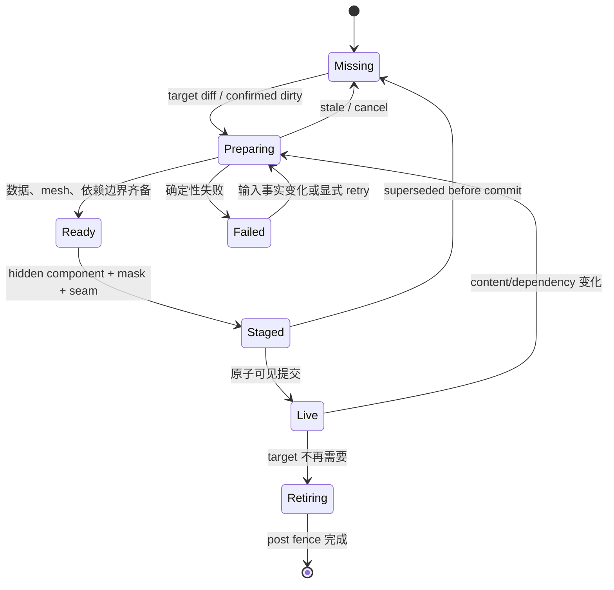
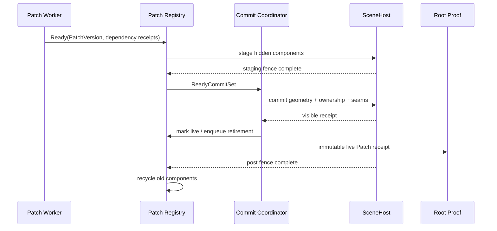

# Voxia Near/Far Patch Diff 流送设计

- **日期**：2026-07-25
- **状态**：架构边界已确认，等待书面复核与实施计划
- **范围**：唯一生产组合根中的 near/far 准备、可见提交、ownership、seam、退役、移动流送与 confirmed 体素编辑呈现
- **前置决策**：
  - [2026-07-24 Voxia 按 Tile 渐进流送治理决策](2026-07-24-voxia-tile-streaming-governance.md)
  - [当前客户端流送与 LOD 真值](../../00-current-truth/design/client/streaming-lod.md)
- **不改变**：服务端权威、confirmed truth 来源、baseline 硬校验、完整 XYZ、默认
  `3×3×3 tiles = 27 tiles = 9261 chunks` near 窗口、唯一生产组合根

## 1. 结论

Near 和 far 都改为 **Patch Diff 流送**，不再把完整 Tile 或完整 far 壳代际作为普通流送的
可见提交硬门槛。

统一原则是：

> Chunk/page/cell 是数据与后台工作粒度，Patch 是通常的可见提交粒度，完整目标 Patch
> 指纹集合只负责最终 settled proof。

Near 和 far 共享稳定的 Patch 生命周期与提交契约，但各自维护 registry，不共享可变状态：

- near 默认使用全局对齐的 `4×4×4 chunks` Patch；
- far 保留现有全局对齐的 `8×8×8 tiles` render Patch；
- Tile 继续作为移动触发、窗口规划、统计和最终 coverage 证明单位；
- movement streaming 与 confirmed voxel edit 统一走同一条 near Patch dirty、prepare、commit
  与 retire 路径；
- far 继续复用既有 page/cell diff、artifact cache、surface dependency fingerprint 与
  render patch fingerprint，不再等待整代壳全部完成后才首次发布。

单个 Patch 通常独立提交。若共享边界会因 LOD、编辑或 ownership 变化而不闭合，则由 planner
生成最小的 **PatchCommitSet**，把相互依赖的少量相邻 Patch 在同一可见事务中提交。禁止为了
追求“严格一次一个 Patch”而短暂制造 gap、overlap 或破面。

## 2. 当前实现为什么仍然慢

当前实现已经具备三层 diff：

1. `FVoxiaVoxelShellIncrementalPlan` 已产生 `keep/enter/exit/provider_dirty/
   surface_dependency_dirty` page 集合；
2. material、surface、lighting artifact 已按 source identity 与 dependency fingerprint
   复用；
3. `FVoxiaVoxelPresentationSceneStage` 已产生 retained/rebuilt/removed far patch。

剩余的整代门槛位于发布层：

- far worker 必须先返回完整 `FVoxiaWorldGenVoxelShellBuildResult`；
- SceneHost 必须先组装完整 hidden generation resource-set；
- generation permit 与 resource coordinator 只接受整个 hidden generation；
- 所有 patch 完成后才切换新的 live generation。

2026-07-24 Real-RHI 证据中，一次相邻中心变化虽然 page provider 全命中，但仍处理约
`33725` 个 far page 的目标集合，执行约 `3366 万` 次 resolved sample 和 `227 万` 次
dependency candidate check。surface 阶段约 `29.33s`，其中 `27.44s` 是为保护前台帧而主动
让出的等待时间。

Near 的断层与此类似：

- confirmed truth、mesh worker 与 CPU mesh store 已经是 Chunk 粒度；
- 当前可见组件按 Tile × material 聚合；
- Tile 的 343 Chunk 和六面边界全部齐备后才生成 candidate component；
- 因此 Chunk 已经完成并不等于它所在区域可以提前换显。

Patch Diff 的目标不是取消缓存、fence 或正确性证明，而是把已有 diff 一直贯通到 live
presentation。

## 3. 目标与非目标

### 3.1 目标

1. 新中心或 confirmed 编辑产生 dirty Chunk/page 后，只处理确实受影响的 Patch 及其依赖闭包。
2. Required Patch 就绪一个提交一个，不等待完整 near Tile 或完整 far 壳。
3. 进入侧 near Patch、退出侧 far counterpart Patch、confirmed 编辑 Patch 使用同一事务语义。
4. live presentation 允许由不同构建批次的不可变 Patch 组成，但不得出现身份不明的混合状态。
5. 可见提交始终保持 geometry、ownership mask 与 seam 同帧闭合。
6. post-visibility fence 只保护旧资源退役，不阻塞其他已就绪 Patch。
7. Required 永远优先；Speculative 不能占满物理 worker、ready queue、component pool 或
   staging budget。
8. actual live coverage 始终从已提交 near Patch 的精确 Chunk mask 求并集。
9. 连续移动时 backlog、组件数与旧 near 保留量必须有硬上限，不能因 far 追赶而无界增长。

### 3.2 非目标

- 不修改服务端权威和线协议；
- 不把客户端 Patch 状态当作 confirmed voxel truth；
- 不创建第二套 production root 或第二份 voxel store；
- 不要求 near/far 使用相同空间尺寸；
- 不为每个 near Chunk 创建永久独立组件；
- 不通过提高线程优先级、取消帧预算、固定 sleep 或扩大超时掩盖工作范围问题；
- 不恢复历史 XZ column、有限 Y band 或 near-only/far-only 正式路径。

## 4. 稳定空间身份

### 4.1 PatchId

Patch 必须使用全局对齐的完整 XYZ 身份，不得相对当前窗口编号：

```text
PatchId {
  domain: Near | Far
  origin_xyz
  span_xyz
}
```

- Near 默认 `span_xyz = [4,4,4] chunks`；
- Far 保持 `span_xyz = [8,8,8] tiles`；
- `domain` 同时决定坐标单位：Near 的 origin/span 只用 Chunk 坐标，Far 只用 Tile 坐标，
  禁止在调用侧猜测或换算单位；
- 负坐标使用 floor division，与现有 far patch grid 一致；
- PatchId 不包含 generation、center 或玩家方向，因此窗口移动后 retained Patch 可直接复用。

### 4.2 PatchTarget

全局 Patch 可能只与当前目标 coverage 部分相交，因此目标身份还必须包含精确空间 mask：

```text
PatchTarget {
  patch_id
  required_coverage_mask
  dependency_ids
  source_identity
  content_fingerprint
  dependency_fingerprint
}
```

Near 的 `required_coverage_mask` 是 Patch 内 Chunk bitset；far 是 Patch 内 page/cell owner
集合及其 coverage fingerprint。禁止用 Patch AABB 冒充实际 ownership。

### 4.3 PatchVersion 与目标代次

不再要求所有 live Patch 共享同一个构建 generation：

- **TargetEpoch**：一次中心变化或 confirmed 呈现请求的目标 Patch 指纹集合；
- **PatchVersion**：单个 Patch 的不可变 source/content/dependency 身份；
- **LiveEpoch**：每次成功可见提交后递增的 observation epoch；
- **SettledEpoch**：所有目标 Patch 指纹精确匹配且无 pending transaction/fence 后提交。

未受 confirmed 编辑影响的 Patch 可以保留旧构建批次，只要其 PatchVersion 与新 TargetEpoch
期望指纹一致。根级 proof 比较目标 Patch 指纹集合，不比较“所有资源是否同一次构建产生”。

这避免两种错误：

- 把安全复用误判为 stale；
- 把仅 generation 数字相同、内容却不同的 Patch 误判为 current。

## 5. Owner 与边界

### 5.1 NearPatchRegistry

由 near world owner 独立维护：

- target、required、speculative、preparing、ready、staged、live、retiring、failed Patch；
- Patch 内精确 owned Chunk mask；
- 每个 Chunk 的 frozen source epoch、mesh fingerprint 与 confirmed dependency receipt；
- candidate component、material slots、boundary receipts 和 staging fence；
- component pool、ready queue、retirement queue 与硬预算。

NearPatchRegistry 不读取 far worker 内部状态，只消费 root 提供的 far coverage/boundary receipt。

### 5.2 FarPatchRegistry

由 Pure3D far owner 独立维护：

- target far patch fingerprint map；
- page/cell dependency closure；
- retained/rebuilt/removed Patch；
- candidate mesh shards、far coverage receipt、near-boundary face receipt；
- live PatchVersion、staging/post fence 和 component pool；
- TargetEpoch 的 completed/failed/cancelled 状态。

FarPatchRegistry 不读取 near mesh store，只消费 root 冻结的实际 near ownership mask 与
transition boundary fingerprint。

### 5.3 Unified Root

唯一生产根只负责稳定契约编排：

- 根据移动或 confirmed presentation 请求创建 TargetEpoch；
- 把 actual live near ownership mask 冻结给 far；
- 按 Required/Speculative 规则派发，不操作子系统内部 worker；
- 从两个 registry 收集不可变 Patch receipt；
- 调用 PatchCommitCoordinator 完成可见事务；
- 根据 live near Chunk mask 计算 authority coverage 与 depth-3 guard；
- 在目标指纹集合完整闭合后提交 settled proof。

Root 不保存第三份 mesh、artifact 或 voxel truth。

## 6. 统一 Patch 生命周期



共同不变量：

1. `Ready` 只表示当前 PatchTarget 的完整依赖闭包齐备；
2. `Staged` 资源不可见，且必须有 exact PatchVersion；
3. `Live` 必须有可复现的 geometry/ownership/seam receipt；
4. stale completion 不能改写任何 live 状态；
5. failure 保留旧 live Patch，不允许清空后伪装成功；
6. fence 未完成只阻止对应旧资源销毁，不阻止其他 Patch stage/commit；
7. registry 自己维护 retry、cancel、fence 与 retirement 活性，不依赖 root 定时猜测。

## 7. PatchCommitSet 与原子可见提交

### 7.1 为什么不能无条件一次一个 Patch

通常一个 Patch 可以独立换显，但以下情况会改变共享边界：

- near confirmed 编辑位于 Patch 边缘；
- far LOD owner 或 quantized anchor 变化；
- 新旧 far patch 的 coverage mask 在共享面上不一致；
- near/far ownership frontier 穿过 Patch；
- seam dependency fingerprint 同时使相邻 Patch dirty。

如果只提交其中一个 Patch，可能短暂产生裂缝、重复面或错误 LOD owner。因此 planner 必须把
相互依赖的 dirty Patch 合并成最小 PatchCommitSet。

### 7.2 CommitSet 规则

```text
PatchCommitSet {
  target_epoch
  patch_versions[]
  old_ownership_mask
  candidate_ownership_mask
  seam_receipts[]
  visibility_budget
}
```

- 普通情况 `patch_versions.Num() == 1`；
- 只有共享边界 fingerprint 无法与当前 live 邻居闭合时才扩大；
- dependency closure 只能落在目标 Patch 的直接 `3×3×3` 邻域，单个 CommitSet 硬上限为
  `27` 个 Patch；超过说明 dependency contract 或 dirty 扩散有误，必须保持旧 live 并显式失败；
- CommitSet 必须有硬数量、quad、component 与提交耗时预算；
- 超预算不得拆成会破坏边界的事务，必须保持旧 live 并显式报告；
- 同一 frame 最多提交一个 CommitSet；
- staged component、candidate ownership texture 和 candidate seam component 在 frame 前准备；
- 同一 GameThread frame 只做可见性/句柄切换和有界 texture upload；
- frame 后 arm post fence，旧资源进入独立 retirement queue。

### 7.3 提交顺序



## 8. Near 数据流：移动与编辑统一

### 8.1 移动流送

1. 玩家进入新 Tile，near owner 立即计算目标 Chunk set；
2. 将目标 Chunk set 投影到全局 `4³ chunks` Patch；
3. retained PatchVersion 直接复用；
4. entering mask、exiting mask 与 dependency dirty 进入 Required；
5. worker 仍以 Chunk 为最小工作粒度，把完成结果发布到现有 CPU mesh store；
6. Patch assembler 从 CPU store 冻结 required mask 与依赖 Chunk；
7. candidate Patch 按 material family/slot 生成组件；
8. PatchCommitSet 与 far counterpart、ownership mask、seam 同帧提交；
9. actual live coverage 立即按新 owned Chunk mask 扩展或收缩；
10. 全部目标 Patch 精确匹配后才提交最终 27-Tile settled proof。

### 8.2 Confirmed voxel edit

1. 点击只发送 intent，不改 confirmed presentation；
2. 服务端 ChunkDelta/ChunkSnapshot 更新 confirmed store；
3. mesh invalidation policy 产生受影响 Chunk 与边界依赖 Chunk；
4. 将 dirty Chunk 投影到与移动相同的 NearPatchRegistry；
5. Patch assembler 复用未变化 Chunk，只重建 dirty Patch；
6. 编辑位于 Patch 边缘时，把实际受影响的相邻 Patch 加入同一依赖闭包；
7. 服务端 revision、PatchVersion 与 presented receipt 闭合后才报告编辑已显示。

移动和编辑不得分别维护不同的 component、seam 或 fence 状态机。

### 8.3 Near 组件预算

- 每个非空 near Patch 每个 material family/slot 最多一个 live component；
- `21×21×21 chunks` near 窗口最多与 `6×6×6=216` 个全局 `4³` Patch 相交；
- 默认三类 material family 的理论 live 上限为 `648`；
- 单个 candidate/retiring CommitSet 最多 `27×3=81` 个 near component，不能复制完整
  216-Patch 窗口；
- near free pool 最多保留一个 live 上限，即 `648` 个 component；ready Patch 数不得超过
  一个完整 near 窗口的 `216`；
- 空 Patch 不创建组件；
- 达到预算时保持旧 live，显式失败或背压，禁止软扩容。

`4³` 是首个生产默认值，不写入跨模块协议。只有完整 Real-RHI component/RHI/frame
门禁证明需要调整时，才允许改变实现常量；改变尺寸不能改变 PatchId、PatchVersion 或 proof
语义。

## 9. Far 数据流：贯通已有 diff

### 9.1 保留的现有能力

- Cube shell planner 与 LOD `span=1/2/4/8 tiles`；
- coverage snapshot 与 incremental page plan；
- canonical page residency；
- material/surface/lighting artifact cache；
- surface dependency dirty proof；
- `8³ tiles` far patch fingerprint；
- mesh shard 硬上限；
- SceneHost far component pool；
- near ownership texture 与六向 boundary receipt。

### 9.2 需要移除的整代门槛

当前 `WorldGenVoxelShellBuilder::Build()` 返回完整 build result 后才进入 publish。改造后 far
worker 应按 target patch 的 dependency closure 推进，并把完成 Patch 发布到有界 ready queue：

```text
plan TargetEpoch
  → map dirty page/cell to far Patch
  → sort Required before Speculative
  → resolve one Patch dependency closure
  → build/reuse artifact
  → build replacement mesh shards
  → emit FarPatchReady
  → continue next Patch
```

这是一条现有 far worker 内部的增量 cursor，不增加新的调度层级。ready queue 只传递
immutable Patch result，不拥有 worker、source 或 live state。

### 9.3 Far Patch 提交

- retained fingerprint 立即成为目标 receipt；
- rebuilt Patch 完成后独立 stage；
- removed Patch 只有在 replacement coverage 已闭合后才退役；
- near 后方 exiting Chunk 所需 far counterpart 属于 Required；
- 与玩家无关的远端 ring 补齐属于 Required 的剩余部分，但排在当前 near frontier 之后；
- predictive far Patch 仍为 Speculative；
- far TargetEpoch 全部匹配后只提交 settled proof，不再执行第二次整壳可见切换。

## 10. Required 与 Speculative

仍只保留两个优先级，不新增更多队列层：

1. **Required**
   - 玩家当前/即将进入的 near Patch；
   - confirmed 编辑 dirty Patch；
   - 闭合这些 Patch 所需的依赖邻居；
   - 退出旧 near 所需的 far counterpart；
   - 当前 TargetEpoch 的其余必需 Patch。
2. **Speculative**
   - 根据速度、方向预测的未来 near/far Patch。

Required 内部只做确定性空间排序，不形成新的资源池：

- 玩家所在 Patch 与 confirmed edit 首先；
- 距玩家最近、沿运动方向的 entering Patch 其次；
- 能释放旧 near 的 far counterpart 随后；
- 其余目标 Patch 最后。

只要 Required 有待派发工作：

- 不启动新的 Speculative Chunk/page；
- 在途 Speculative 在最近 Chunk/page 边界让行；
- Required 可使用全部 worker、ready queue 与 staging slot；
- Speculative 的物理占用必须低于总容量，至少保留一个 Required slot；
- 同 identity 命中时原地 promotion，不重复计算。

## 11. Coverage、限行与最终 proof

### 11.1 Actual live coverage

Near authority coverage 定义为所有 live near Patch 的 `owned_chunk_mask` 并集：

- 不使用 Patch AABB；
- 不使用尚未提交的 target mask；
- 不要求中间态恰好是 21-Chunk 立方体；
- 必须无非法内部 hole；若 Patch diff 合法产生非立方边界，按精确 mask 计算。

depth-3 guard 保持现有语义：

- outside depth `0..2`：正常移动，不显示阻塞提示；
- outside depth `>=3` 且 Required pending：停止发送非零移动意图并显示加载；
- Patch 覆盖玩家位置且无确定性错误后自动恢复；
- 不回滚或伪造服务端 confirmed position。

### 11.2 Settled proof

TargetEpoch 只有同时满足以下条件才 settled：

- near/far target PatchId 集合完整；
- 每个 live PatchVersion 与目标 fingerprint 精确相等；
- target coverage 与完整 `3×3×3` near Tile 窗口一致；
- required/speculative queue 不再影响当前目标；
- 无 staged、active CommitSet、retiring ownership ticket；
- pending post fence 已清零；
- gap/overlap/seam/orphan/stale commit 全为零；
- root snapshot、confirmed receipt 与 target identity 一致。

Settled proof 是审计与资源回收终态，不是普通移动的可玩门槛。

## 12. 失败、取消与恢复

| 情况 | 行为 |
| --- | --- |
| stale Patch completion | 丢弃 candidate，保留旧 live；若新目标 fingerprint 相同则复用 |
| latest-wins 中心变化 | 保留仍匹配的新旧 Patch；取消不再需要的 work，禁止清空整个 live scene |
| source/baseline/hash 错误 | 硬失败并报告，不允许 runtime snapshot/self-heal 绕过 |
| mesh/material/dependency 失败 | 锁存 exact PatchVersion；输入事实变化或显式 retry 后才重试 |
| seam/ownership 不闭合 | CommitSet 不可见，旧 live 保持；报告缺失 Chunk face/Patch 邻居 |
| component/quad/memory 超预算 | 提交前拒绝并背压；禁止软扩容或部分发布 |
| staging fence 未完成 | 仅等待该 CommitSet，不阻塞其他 Patch 准备 |
| post fence 未完成 | 仅延迟对应旧资源回收，不阻塞其他 Patch 可见提交 |
| worker cancel | 在 Chunk/page 边界确认；cancel 后不得再发布 Patch result |
| Required backlog 导致 depth 3 | UIOnly 加载并发送零移动意图；Patch 覆盖恢复后自动解锁 |

所有错误必须包含 TargetEpoch、PatchId、PatchVersion、source identity、dependency identity
和明确 stage。

## 13. 可观测面

在现有 `client_flow_state`、`voxel_streaming_state`、
`voxel_presentation_state` 上增加：

### 13.1 Registry

- near/far `target/retained/dirty/preparing/ready/staged/live/retiring/failed` Patch 数；
- Required/Speculative queued/running/ready 数；
- TargetEpoch、LiveEpoch、SettledEpoch；
- PatchId、coverage mask count、content/dependency fingerprint；
- promotion/cancel/stale/failure reason；
- ready queue、component pool、retirement queue 高水位。

### 13.2 CommitSet

- Patch 数、Chunk/page 数、component/quad 数；
- staging、visible swap、texture upload、seam update 与 post fence 时间；
- boundary dependency 扩大 CommitSet 的原因；
- old/new ownership mask count；
- gap/overlap/seam/orphan；
- first required Patch visible、player-frontier complete、TargetEpoch settled 三段时延。

### 13.3 性能

- near/far worker 实际计算时间与主动让行时间；
- 每帧 visible CommitSet 数，固定上限为 1；
- GameThread p50/p95/p99/max；
- live/candidate/retiring component 数；
- 连续移动时 backlog、旧 near 保留量与内存曲线。

观察产物继续写入 `.demo/observe/`，CLI 输出必须保持结构化 JSON 和精确 64 位十进制身份。

## 14. 测试矩阵

### 14.1 纯逻辑

- 正负 XYZ 的 Near `4³ chunks` 与 Far `8³ tiles` PatchId；
- 21-Chunk near cube 最多相交 216 个 Near Patch；
- 部分相交 Patch 的 exact Chunk mask；
- retained/enter/exit/dirty Patch diff；
- confirmed edit 的边界 dependency closure；
- far LOD boundary 变化生成最小 PatchCommitSet；
- PatchVersion/TargetEpoch/latest-wins/promotion；
- stale/cancel/failure 不改变 live registry；
- actual live coverage 从 mask 并集计算；
- depth `0/1/2/3`。

### 14.2 SceneHost 与 ownership

- candidate component 在 commit 前不可见；
- 单 Patch 与多 Patch CommitSet 都同帧切 geometry/mask/seam；
- staged fence 不阻塞其他 Patch prepare；
- post fence 不阻塞下一 CommitSet；
- component pool 有界复用；
- partial Patch 不产生 gap/overlap；
- near/far、near/near、far/far 共享面 fingerprint 闭合；
- LOD owner 切换无重复面和破面；
- 负坐标与快速折返保持 exact identity。

### 14.3 统一移动与编辑路径

- 移动进入新 Tile 后 first near Patch 无需等待整个 Tile；
- confirmed edit 只 dirty 命中 Patch及真实依赖邻居；
- Patch 内未变化 Chunk 从 live/CPU store 复用；
- 编辑与移动同时发生时使用同一 latest-wins TargetEpoch；
- 未收到服务端 delta 时不产生 near candidate；
- presented receipt 只在 CommitSet fence 闭合后完成。

### 14.4 生命周期

- 初始 27-Tile load；
- `±X/±Y/±Z` 单轴、双轴、三轴；
- 连续直线跨越至少 10 Tile；
- 快速往返与 180° 转向；
- 玩家最大生产速度下不进入 depth-3 recovery；
- Required 持续到达时 Speculative 不占保留容量；
- 停止移动后 backlog、retiring 与旧 near 保留量归零；
- retry、新游戏、返回菜单、EndPlay 无泄漏或 stale commit。

### 14.5 Real-RHI

- 沿用现有 frame gate，不允许 GameThread/GPU percentile 回退；
- 玩家进入新 Tile 后，first required near Patch 必须早于旧整 Tile ready，且前方 Required
  coverage 必须在玩家以最大生产速度走完 7 Chunk 前完成；
- 后方 Required far counterpart 必须在旧 near 资源预算耗尽前可见；其 deadline 同样使用
  `7 × ChunkWorldSize / MaxProductionSpeed` 计算，不写死墙钟秒数；
- 连续跨 Tile 时 live component、retiring component 与内存达到平台而非单调增长；
- gap/overlap/seam/orphan/stale commit 全程为零；
- 不以完整 far settled 时长作为可玩门槛，但 TargetEpoch 停止变化后必须最终收敛。

## 15. 实施边界与顺序

实施不得同时重写 source、mesher、材质或 LOD 算法。按以下边界推进：

1. 先定义 PatchId、PatchVersion、TargetEpoch、PatchCommitSet 与 CLI 快照；
2. 把 near Tile registry 泛化为 NearPatchRegistry，但暂不改 far；
3. 让移动与 confirmed edit 统一走 Near Patch；
4. 把现有 far retained/rebuilt/removed patch 接入 FarPatchRegistry；
5. 把 far monolithic build result 改为内部 cursor + immutable ready queue；
6. 接入统一 root proof、actual coverage 与 depth-3 guard；
7. 最后移除旧 Tile/whole-generation 普通流送门槛；
8. 完整 Null-RHI、Real-RHI、CLI 和长时间资源门禁通过后更新 current truth。

迁移期间只允许一个正式 live presentation owner。旧 Tile/whole-generation 路径可作为短期
内部 compatibility adapter，但不得并列成为第二条 production root；退出条件必须是 Patch
路径完成全部门禁。

## 16. 完成定义

只有同时满足以下条件才可写成完成：

1. movement 与 confirmed edit 共用 NearPatchRegistry 和 PatchCommitSet；
2. near first-visible 不再等待完整 343-Chunk Tile；
3. far first-visible 不再等待完整 far TargetEpoch；
4. required far counterpart 能逐 Patch 释放旧 near；
5. 连续 10-Tile 最大速度路线不触发 depth-3 recovery；
6. component、ready、retiring、residency 和 artifact cache 全部达到有界平台；
7. gap/overlap/seam/orphan/stale commit 为零；
8. Development build、完整 Voxia Automation、Node、Null-RHI、Real-RHI 与 CLI 门禁全部通过；
9. `docs/00-current-truth/`、Voxia README 和阶段进度证据同步更新。
